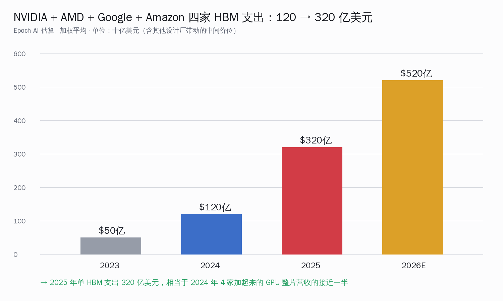
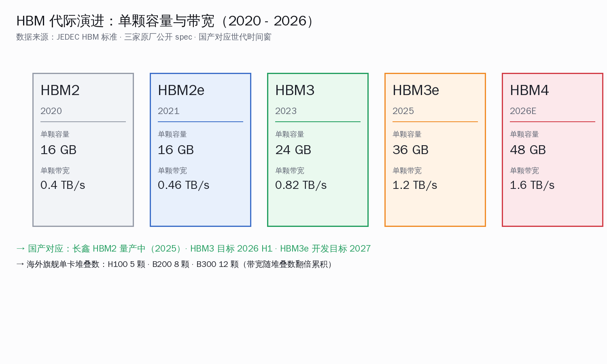
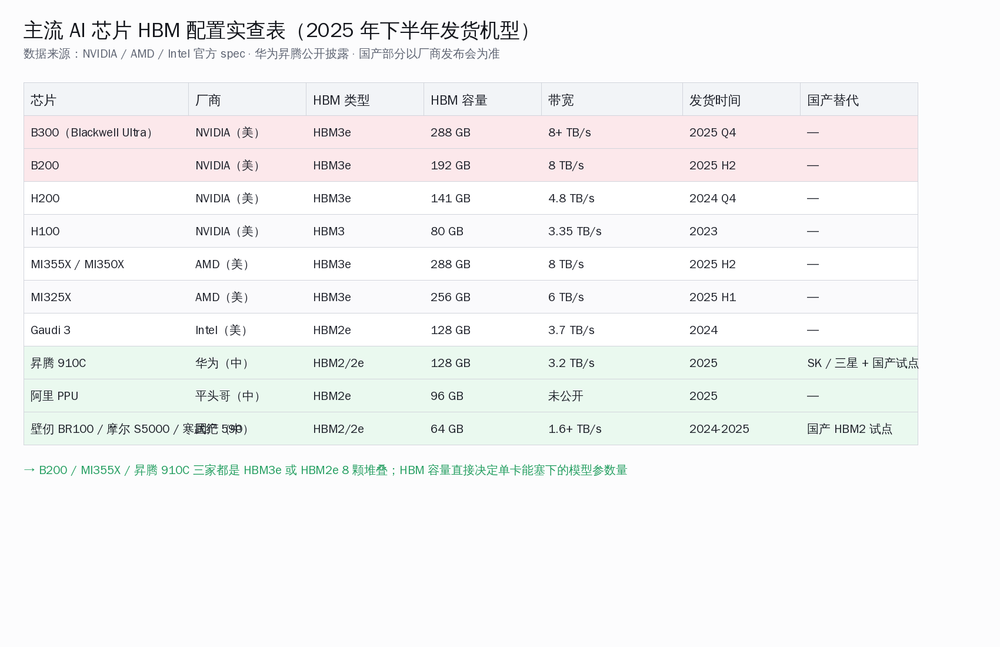
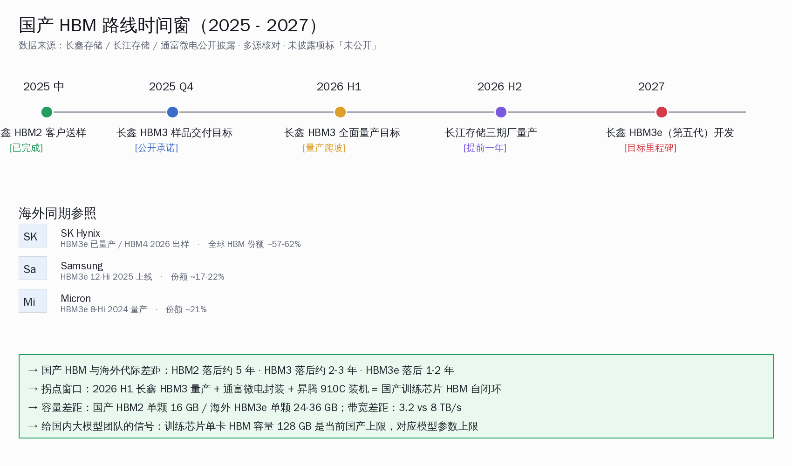

# AI 芯片成本里 HBM 占了 63%

## 30 秒速览：一颗 AI 芯片，六成多的钱花在内存上

Epoch AI 在 5 月 21 日挂出一份新数据：把 NVIDIA、AMD、Google、Amazon 四家在 2024 到 2025 共八个季度量产的 AI 芯片成本拆开，HBM 高带宽内存的占比从 2024 Q1 的 52% 一路涨到了 2025 Q4 的 63%。同期逻辑芯片（也就是大家直觉里"那颗 GPU"）的成本占比一直稳定在 13-14%；封装从 19% 慢慢降到 15%；其他（基板、测试、散热）从 15% 降到 9%。换句话说，一颗 B200 或者 MI355X 卖给数据中心，价签里六成多的钱其实流向了 SK 海力士、三星、美光这三家做内存堆叠的厂。

同一份报告还给出了一个更直观的对比：四家设计厂合在一起的 HBM 采购支出，2024 年是 120 亿美元，2025 年跳到了 320 亿美元——一年涨了 2.67 倍。微软在 FY26 的资本开支预期上调了 250 亿美元，Meta 加码到 1150 亿美元区间，订单最终大多还是落在了 HBM 这一行。

国内大模型团队现在最该读懂这条数据的两个含义：第一，海外训练芯片的成本结构已经从"逻辑算力贵"变成"内存贵"，未来一两年 HBM4 出来还会更贵；第二，国产 HBM 在 2026 年上半年正好走到长鑫存储 HBM3 量产 + 长江存储三期厂提前量产 + 昇腾 910C 装机这三件事同步发生的窗口，自闭环的训练芯片帐单第一次有机会算得过来。这篇文章把这两条线一起拆开。

## Epoch AI 数据本体：方法论与 8 个季度变化

数据来源是 Epoch AI 研究员 Venkat Somala 在 2026-05-21 发布的 [AI Chip Component Cost Shares](https://epoch.ai/data-insights/ai-chip-component-cost-shares) 数据洞察。覆盖范围是 NVIDIA、AMD、Google TPU、Amazon Trainium 四家在 2024 Q1 到 2025 Q4 八个季度量产的 AI 训练 / 推理芯片，按出货量加权平均。原始口径来自三种公开渠道：供应商在财报会上披露的 HBM 单价、设计厂的 cost of revenue 拆解、以及第三方分析师的产能 + 单价交叉核算。Epoch 团队给每个季度的数字标了 90% 置信区间，但 HBM 占比的变化趋势在置信区间内仍然是单调上升。

下面这张 8 个季度的成本结构图是按 Epoch 公开的季度表重画的：

| 季度 | HBM 内存 | 逻辑芯片 | 封装 | 其他 |
|---|---|---|---|---|
| 2024 Q1 | 52% | 14% | 19% | 15% |
| 2024 Q2 | 54% | 14% | 18% | 14% |
| 2024 Q3 | 56% | 13% | 17% | 14% |
| 2024 Q4 | 58% | 13% | 16% | 13% |
| 2025 Q1 | 59% | 14% | 16% | 11% |
| 2025 Q2 | 61% | 13% | 15% | 11% |
| 2025 Q3 | 62% | 13% | 15% | 10% |
| 2025 Q4 | 63% | 13% | 15% | 9% |

注意这里说的是"成本占比"而不是"价格占比"，也不是"功能占比"——意思是设计厂把芯片造出来要付给上游的钱里，HBM 这一行占六成多。Epoch 的注释里还强调了一句重要的：逻辑芯片的占比基本没变，封装与其他的占比下降，几乎全部被 HBM 吃了。

为什么是 HBM 吃掉了所有增量？三个原因叠加：

- HBM3e 单颗容量从 16 GB 涨到 24 GB 再到 36 GB，单 GB 价格也在涨
- 单卡 HBM 堆叠数从 H100 的 5 颗涨到 B200 的 8 颗、B300 的 12 颗
- SK 海力士在 2025 年靠 HBM 第一次反超三星成为全球最大内存厂，定价权回到了三家手里

集邦科技（TrendForce）在 2025 年 12 月披露，三星与 SK 海力士已经把 2026 年的 HBM3e 长约价上调了 20%。

## HBM 上游三家寡头：SK 海力士一家拿走六成

HBM 这个市场目前是三家寡头格局。根据 Counterpoint Research 在 2025 Q2 与 Q3 给出的最新数据，SK 海力士在 2025 年 Q2 拿到了 62% 的份额，Q3 因为三星 12-Hi HBM3e 量产分流回落到 57%，全年口径仍然在 57-62% 区间。美光在 2025 年 Q2 以 21% 的份额第一次超过三星，三星份额掉到 17%；Q3 三星追回到 22%、美光维持 21%、SK 海力士 57%。

这个分布意味着什么？SK 海力士实际上是单点供应——它一家给 NVIDIA 的 H200、B200、B300 供 HBM3e，给 AMD 的 MI300X、MI325X 也供。三星与美光是双备份角色。Counterpoint 同时指出，2026 年的市场争夺会集中在 HBM4——HBM4 的容量进一步翻倍到单颗 36 GB，单卡能堆叠 12-16 颗，单价比 HBM3e 还高三到四成。

中国厂商在这张图上目前的位置是：长鑫存储（CXMT）HBM2 已经向客户送样，2025 年中开始小规模量产；长鑫的 HBM3 样品交付目标定在 2025 Q4，全面量产目标定在 2026 H1。这意味着国内 HBM 与海外的代际差距，HBM2 落后约 5 年（海外 HBM2 量产是 2020 年）、HBM3 落后约 2-3 年、HBM3e 落后 1-2 年——这是 2026 年最值得盯的窄窗口。

## 海外旗舰与国产 GPU 的 HBM 容量横评对比

下面这张表是逐家翻官方 spec 与发布会幻灯片对出来的，国产部分以厂商公开披露为准，没披露的标"未公开"。

| 芯片 | 厂商 | HBM 类型 | HBM 容量 | 带宽 | 发货时间 |
|---|---|---|---|---|---|
| B300（Blackwell Ultra） | NVIDIA（美） | HBM3e | 288 GB | 8+ TB/s | 2025 Q4 |
| B200 | NVIDIA（美） | HBM3e | 192 GB | 8 TB/s | 2025 H2 |
| H200 | NVIDIA（美） | HBM3e | 141 GB | 4.8 TB/s | 2024 Q4 |
| H100 | NVIDIA（美） | HBM3 | 80 GB | 3.35 TB/s | 2023 |
| MI355X / MI350X | AMD（美） | HBM3e | 288 GB | 8 TB/s | 2025 H2 |
| MI325X | AMD（美） | HBM3e | 256 GB | 6 TB/s | 2025 H1 |
| MI300X | AMD（美） | HBM3 | 192 GB | 5.3 TB/s | 2024 |
| Gaudi 3 | Intel（美） | HBM2e | 128 GB | 3.7 TB/s | 2024 |
| 昇腾 910C | 华为（中） | HBM2 / 2e | 128 GB | 3.2 TB/s | 2025 |
| 阿里 PPU | 平头哥（中） | HBM2e | 96 GB | 未公开 | 2025 |
| 壁仞 BR100 | 上海壁仞（中） | HBM2e | 64 GB | 1.6 TB/s | 2024 |
| 摩尔线程 S5000 | 摩尔线程（中） | HBM2e | 64 GB | 未公开 | 2025 |
| 寒武纪思元 590 | 寒武纪（中） | HBM2 | 64 GB | 1.55 TB/s | 2024 |

读这张表的几个细节：

- **海外旗舰已经把 HBM 容量推到了单卡 288 GB**：B300 与 MI355X 都是 12 颗 HBM3e 24 GB 堆叠。这个容量直接决定单卡能塞下的模型参数——FP8 精度下一颗 B300 能装满一个 280B 参数的稠密模型，国产单卡顶配 128 GB 则对应约 120B 参数上限。
- **昇腾 910C 是国产里 HBM 配置最激进的一家**：128 GB HBM2/2e + 3.2 TB/s 带宽，已经摸到了英特尔 Gaudi 3（128 GB HBM2e + 3.7 TB/s）的水平。910C 的 8 颗 HBM 堆叠目前用的是 SK 海力士与三星的 HBM2 / 2e（限制级别内可采购）加上长鑫存储 HBM2 试点供货。
- **64 GB 这一档是主流国产芯片**：阿里平头哥 PPU 的 96 GB HBM2e 公开披露较少，主要见于阿里云算力发布会；壁仞 BR100、摩尔线程 S5000、寒武纪思元 590 这一档目前的 64 GB HBM2e 能覆盖大多数 70B 以下模型的训练与推理。
- **HBM 容量对应模型参数上限是硬约束**：国产芯片的 HBM 容量从 64 GB 到 128 GB 这一档，刚好对应国内主流模型（千问 235B MoE 激活 22B、DeepSeek V3 671B MoE 激活 37B、智谱 GLM-4.5 355B MoE）实际跑起来时单卡需要装下的"激活参数 + KV 缓存"大小——这是个被 HBM 卡住的硬上限，而不是逻辑算力。

## HN 顶赞评论：开发者怎么读这个变化

Epoch 这份数据被 Hacker News 顶到首页（原帖编号 48258684，129 赞 168 评论）。顶赞前五条评论的视角值得细看。

gpm 在 151 赞的评论里说：

> An interesting implication of this is that AI inference and training has a path to a ~3x hardware cost reduction... we just need to wait for dram supply to meet demand.

翻成中文意思是，HBM 占比 63% 意味着如果上游 DRAM 产能跟上、单价回落到合理水平，AI 训练和推理的硬件成本理论上有 3 倍降本空间。这是开发者社区最普遍的乐观读法——HBM 不像逻辑芯片那样吃工艺红利，本质是 DRAM 工艺 + 堆叠工艺的组合，产能扩张周期是 18-24 个月，不像 3nm 那样要等三年。

第二条来自 radialstub：

> The memory makers will not expand demand drastically... Instead, supply is just rerouted from less profitable segments such as mobile and personal computing.

这条 verbatim 的意思是：内存厂不会激进扩产，而是把原本给手机和 PC DRAM 的产能挤出来给 HBM。这就是为什么 2025 年消费级内存价格暴涨——slicktux 在 96 赞的评论里抱怨："两年前 96 GB RAM 我花了 250 美元，现在同样的内存要 1200 美元。" adroitboss 也跟着甩了一张亚马逊截图：96 GB DDR5 5600 套装从 279 美元涨到 1049 美元。

第四条 dawnerd 是另一个味道：

> I'm so mad I didn't max out my main server when I had the chance. Used enterprise sticks were dirt cheap on eBay.

这一条侧面说明了一件事：HBM 涨价的下游辐射已经传导到了二手企业级内存市场。国内 1-3 人小作坊跑本地大模型这两年抢二手 DDR4 ECC 内存的人，跟这条评论是同一拨人。

总结这些开发者反馈，可以提炼出三个判断：HBM 涨价的本质是 DRAM 产能错配，不是技术门槛；产能错配会传导到消费级内存与二手市场；解决路径不是新工艺，而是产能扩张周期到位——这跟"国产 HBM 走自己产能"的时间窗逻辑完全吻合。

## HBM 涨价对国内大模型训练成本的影响

把 HBM 涨价的影响翻译到国内训练成本上要先回答一件事：DeepSeek V4、千问 3.7-Max、智谱 GLM-5.1、美团 LongCat 这一档万亿参数 MoE 模型，训练用什么芯片，HBM 占总训练成本比是多少。

按 2026 年 4-5 月已经公开披露的信息：DeepSeek V4 在 2026-04-24 正式发布，官方技术报告里把华为昇腾 950PR 列入硬件验证清单，从 NVIDIA CUDA 全栈迁移到国产算力。美团 LongCat-2.0-Preview 同一天上线公开测试，是目前唯一一个公开确认全程用国产算力训练完成的万亿参数 MoE 模型，训练规模用了 5 万到 6 万张国产 GPU 卡。千问 3.7-Max 与智谱 GLM-5.1 目前没公开训练芯片细节，但根据公开报道，千问大概率延续了 H800 + 昇腾混合方案，智谱主要用 H800。

按行业内估算口径粗算一下：一张昇腾 910C 公开报价区间约 12 万人民币，其中按 Epoch AI 的拆账逻辑大致对应 7-8 万人民币是 HBM 这一行（包含 HBM 芯片本体 + 封装堆叠环节）。一个 5 万卡集群对应的 HBM 采购账面就是 35-40 亿人民币——占整个集群硬件投入的 60% 以上。

这意味着对国内训练芯片采购方而言，谁先把 HBM 自闭环做到位，谁就能直接拿下集群成本的 6 成。这跟过去"逻辑算力是大头"的直觉完全反过来，是 2025 年下半年才出现的新结构。

## 国产 HBM 路线时间窗：2026 H1 三件事同步发生

国产 HBM 的拐点窗口分三块。

**长鑫存储（CXMT）——HBM2 量产 + HBM3 倒计时**：长鑫的 HBM2 客户送样从 2024 Q4 开始持续到 2025 Q1，2025 年中开始向通富微电（封装合作方）小规模量产供货。HBM3 样品交付目标是 2025 Q4，HBM3 全面量产目标是 2026 H1；HBM3e（第五代）的开发目标定在 2027 年。这条路线比长鑫原本 2026 年才开始做 HBM2 的旧计划整整提前了两年。

**长江存储（YMTC）——三期厂量产提前一年**：位于武汉的三期项目原本规划 2027 年量产，2025 年 9 月正式动工后量产目标提前到 2026 H2。三期厂主要是 NAND Flash 产能扩张，但同时也在配套布局 HBM 的封装工艺与 DRAM-Logic 混合工艺基础。长江存储自己披露的目标是 2026 年底前挑战全球 NAND Flash 供应量的 15%。

**封装与设计协同——一整条产业链已经就位**：通富微电作为长鑫 HBM 的主要封装合作伙伴，已经为华为昇腾 910 系列提供 HBM 封装堆叠服务。中芯国际、长电科技、华天科技、晶方科技、深科技、华进半导体、兆易创新、北京君正、澜起科技、聚辰股份等一批厂商在 HBM 整个产业链的不同环节上都已经布局。

把这三块叠在一起看，2026 H1 就是那个关键窗口：长鑫 HBM3 全面量产 + 通富微电封装就位 + 昇腾 910C 第二代装机持续推进 + 长江存储三期厂启动量产。第一次出现"国产训练芯片单卡 128 GB 以上 HBM 全栈国产化"的工程可能性。

需要诚实说明的几个差距：

- **单颗容量**：国产 HBM2 单颗 16 GB，海外 HBM3e 单颗 24-36 GB，国产 HBM2 单颗容量是海外 HBM3e 的 1/2 到 1/3
- **带宽**：国产昇腾 910C 是 3.2 TB/s，海外 B300 是 8+ TB/s，国产是海外的 4/10 水平
- **良率爬坡**：国产 HBM3 量产爬坡到稳定良率需要 6-12 个月窗口，短期内仍需要 SK 海力士与三星的 HBM 在限制级别内补充供货

但这些差距已经不再是"代际无法追赶"的级别——HBM2 时代国产基本不存在，HBM3 时代国产已经在样品交付，HBM3e 时代国产开发周期与海外的差距压缩到 1-2 年。

## 国内大模型团队 CTO 怎么用这份数据

把上面的拆解收尾到三个具体判断：

**算力订单结构要从「算力 PFlops」切换到「集群总 HBM 容量」**：过去三年国内大模型团队采购集群最关心的是"几张卡 + 多少 PFlops"。Epoch 这份数据之后，第二个关键指标应该是"集群总 HBM 容量"——这才是真正决定能训多大模型的硬约束。以 5 万卡集群为例，按昇腾 910C 单卡 128 GB HBM 算，总 HBM 容量是 6400 TB；按 B200 单卡 192 GB 算是 9600 TB。容量差距 50%，直接对应能装下的模型激活参数与 KV 缓存上限。

**训练 vs 推理芯片选型要重新算账**：HBM 涨价让训练芯片与推理芯片的成本逻辑彻底变了。训练需要满血 HBM 容量与带宽（要吃下完整参数 + 完整 KV 缓存 + 优化器状态），推理可以用 HBM2e 甚至 LPDDR5X 替代。这意味着对推理负载占主导的国内大模型公司（API + 公有云推理为主），现在可以更积极地用昇腾 910C 这一档国产芯片做推理；训练侧再继续混合 NVIDIA 与昇腾。

**2026 上半年是关键窗口**：如果长鑫 HBM3 在 2026 上半年顺利量产，国产训练芯片在 2026 下半年到 2027 上半年这个窗口可以做到 "单卡 144-192 GB HBM3 国产化"——这一步走通，国内训练芯片就第一次跟海外 H200 / MI300X 站到了同一档位。这是"自闭环"的工程节奏，不是悲观叙事。

回到 Epoch AI 这份数据的本质——一颗 AI 芯片成本里六成多的钱花在了内存上，过去这六成的钱基本都流向了 SK 海力士和三星，未来一年这条钱流里有相当一部分有机会留在国内 DRAM 板块。这是一个值得国内大模型与硬件团队认真重读一遍训练账单的时刻。

数据本身不会自动变成竞争力，但它把"该往哪儿投"这个问题的答案摆得很清楚。

