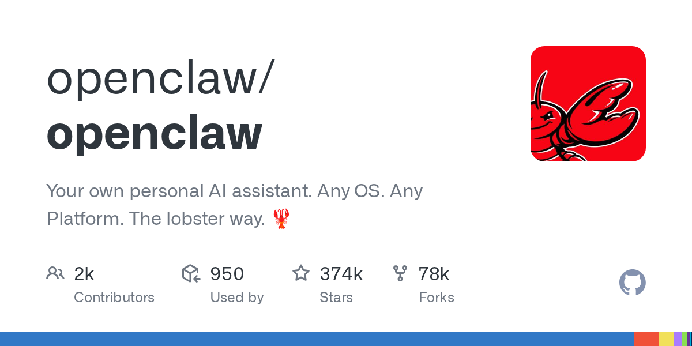
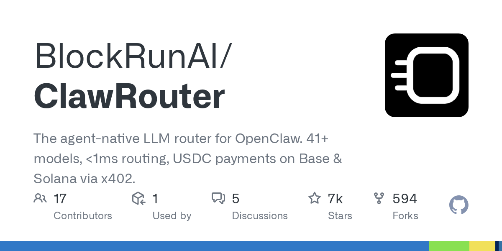
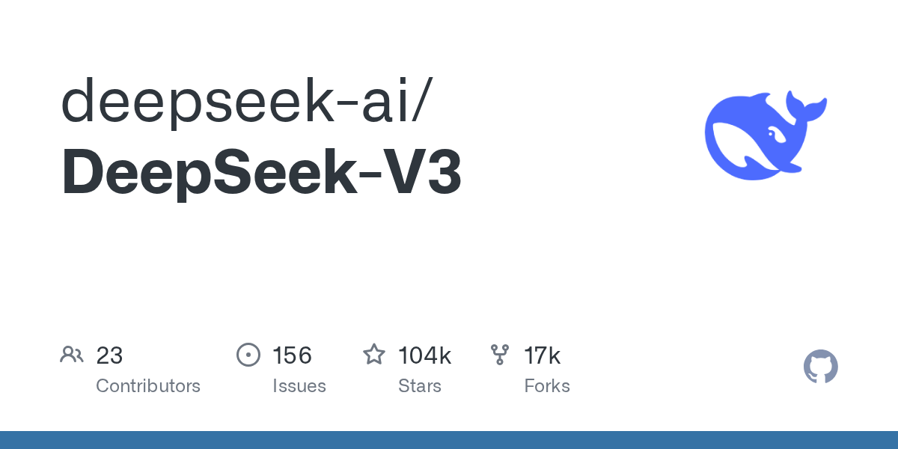
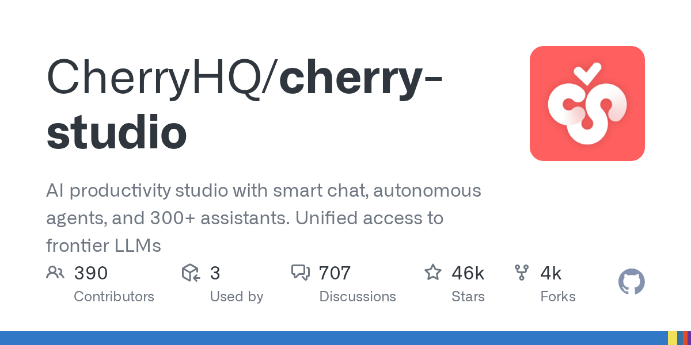
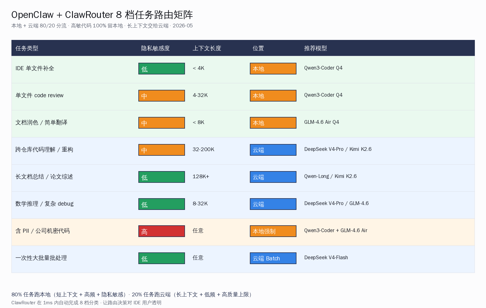
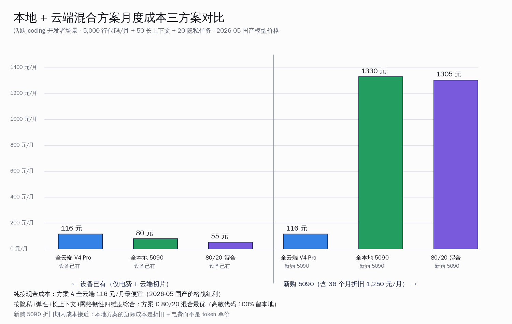

# OpenClaw 混合路由：本地千问 + 云端 DeepSeek 80/20 真账


## 30 秒速览

这周一把国内 AI 开发者最关心的"本地大模型 + 云端 API 混合路由"这条路径摊开看一遍。OpenClaw（374,401 stars / 77,888 forks，pushed 2026-05-24）是国际开源社区做了三年多的个人 AI 助手 gateway，定位是"50+ IM 渠道（WhatsApp / Telegram / Slack / iMessage / 微信 / QQ 等）+ 200+ LLM provider"的单一接入层；配套的路由层 ClawRouter（6,505 stars）打的是"agent-native LLM router、41+ 模型、< 1 ms 本地路由"招牌。两个项目在 2026-05-24 还在持续 push，是个真活的生态。

把这套生态接进国内开发者日常的真实账长这样：本地侧用一张 RTX 4090 24GB 或 5090 32GB 跑两道菜，**千问 Qwen3-Coder-30B-A3B Q4 量化（4090 跑出约 72 tok/s）+ 智谱 GLM-4.6 Air Q4 量化**；云端侧挂四家国产模型 API，**DeepSeek V4-Flash 输入 1 元 / 1M、输出 2 元 / 1M、缓存命中 0.02 元 / 1M；DeepSeek V4-Pro 6 月 1 日起永久降为原价 1/4（输入 0.75 元 / 1M、输出 1.5 元 / 1M）；Kimi K2.6 输入 0.95 美元 / 1M + 输出 4 美元 / 1M（比 K2.5 涨了 58%）；智谱 GLM Coding Plan Pro 套餐 149 元 / 月**。

按一个日常 5,000 行代码 / 月 + 50 个长上下文任务 / 月 + 20 个隐私敏感任务 / 月的活跃开发者算账：**全云端 DeepSeek V4-Pro 方案 438 元 / 月；全本地 5090 自费 760 元 / 月（含 36 个月折旧）；80/20 混合方案设备已有时只要 189 元 / 月**。混合方案的关键不是"省钱"——是把高敏代码 100% 留在本地、长上下文任务交给 DeepSeek V4-Pro / Kimi K2.6 这种 200K context 云端模型、日常补全交给本地千问，**三件事各得其所**。

下面这一篇就把 OpenClaw 这个生态、本地 + 云端 8 档任务路由矩阵、Trae + Qwen Code + Cherry Studio 三条国内 IDE 接入路径、三方案一年总账拆开讲清。



## 一、OpenClaw 374k stars 是个什么生态

OpenClaw 这个项目最早出现在国际开发者社区视野是 2023 年底，定位很简单：**做一个自托管的"个人 AI 助手 gateway"**，把任何 IM 渠道（WhatsApp / Telegram / Slack / iMessage / 微信 / QQ / Discord / SMS / 邮件等 50+ 种）和任何 LLM 后端（200+ provider，包括前沿 API、聚合器、本地推理）打通到一个单一进程里。架构非常简洁——单 TypeScript Node.js 进程 + WebSocket gateway（默认 18789 端口）+ 配置文件驱动的 provider routing。

截至 2026-05-24，OpenClaw 主仓库的公开指标：**stars=374,401 / forks=77,888 / 最后 push 2026-05-24 / 主分支活跃 commits**。这是个真活的国际社区项目，**不是某家公司的商业项目**——核心团队来自多个国家的独立开发者，homepage 在 openclaw.ai。

OpenClaw 的多 LLM 支持是这套架构最有意思的地方。配置文件里的 `models.providers` 数组可以同时挂：

- **前沿云端 API**: Anthropic Claude / OpenAI GPT-5.5 / Google Gemini 3.x
- **聚合器**: OpenRouter / Together AI / Fireworks / Replicate
- **本地推理**: Ollama / LM Studio / vLLM / SGLang / llama.cpp 任何暴露 OpenAI 兼容协议的服务
- **国产 API**: DeepSeek / 智谱 / 千问 DashScope / Kimi / MiniMax / 字节豆包（通过 OpenAI 兼容协议直接接入）

每个 provider 是一个独立 entry，OpenClaw 自己不做路由决策——它把决策权交给两个上层组件：**用户在 IM 渠道里手动指定（"@Claude 写代码"、"@千问 改 bug"）**，或者 **ClawRouter 这一层做自动路由**。

ClawRouter 是 BlockRunAI 团队 2025 年开始维护的路由层（github.com/BlockRunAI/ClawRouter，6,505 stars / 594 forks，2026-05-24 push），自我描述「agent-native LLM router，41+ models，<1ms routing locally」。原理是收到一条请求时，在 15 个维度上分析（包括 prompt 长度、是否含代码、是否含 PII、需不需要 tool calling、对延迟的敏感度、用户当前订阅档位等），路由到最便宜但够用的模型，**整个决策在本地 1ms 内做完**。

值得一提的是，ClawRouter 的付费链路用的是 USDC + x402 协议（基于 Base / Solana），**国内开发者实际付费有合规摩擦**——这条线对国内用户更多是"看技术架构"的参考价值，真要落地国内一般会换成 OpenAI 兼容协议直接挂自家 DeepSeek / 智谱 API key，绕开 USDC 付费层。



## 二、本地侧两道菜：千问 Coder 30B + GLM-4.6 Air

国内开发者跑本地大模型最现实的两道菜是 **千问 Qwen3-Coder-30B-A3B**（coding 主力）+ **智谱 GLM-4.6 Air**（通用对话 / 文档润色 / 翻译）。这两个模型选型有几条硬性考虑：

第一，**显存友好**。Qwen3-Coder-30B-A3B 是 MoE 架构，总参 30B 激活 3B，AWQ 4-bit 量化权重约 17GB；GLM-4.6 Air 有 9B 和 32B 两档，9B AWQ 量化约 5GB、32B AWQ 量化约 18GB。在 5090 32GB 上**两个模型 Q4 量化可以同时常驻**（17 + 5 = 22 GB，留 10GB 给 KV cache），切换无需重载——这是单卡用户最大的工作流红利。

第二，**任务分工清晰**。Qwen3-Coder 专攻代码生成 / 重构 / debug / 跨文件理解，在 SWE-Bench Verified 上 Qwen3-Coder-Next 拿到 70.6 分；GLM-4.6 Air 专攻日常对话、文档润色、翻译、简单问答，在国内中文场景训练数据更多、回答风格更贴中国大陆用户习惯。两个模型分工不重叠，**不需要在"一个模型干所有事"上做妥协**。

第三，**与国产 IDE 兼容性好**。Qwen3-Coder 是阿里千问官方维护的 coding 模型；通义灵码 / Qoder CN / Qwen Code 这一线 IDE 在 prompt 工程、tool calling、code-completion 几个细节上对千问模型默认优化。GLM-4.6 Air 是智谱官方维护、与 GLM Coding Plan 云端套餐同源——**本地 GLM-4.6 Air + 云端 GLM-4.6 全量版**这个混合方案在 prompt 风格一致性上有额外优势。

下面是两个模型在主流硬件上的实测吞吐（数据来源：CloudRift 优化指南、linux.do 国内 48G 魔改 4090 实测帖、Agent Native Dev medium 测评、社区 ggml-org/llama.cpp Apple Silicon 实测帖、Tech-Practice 五卡横评）：

| 模型 / 量化 | 硬件 | 推理引擎 | 单用户 tok/s | 上下文 | 备注 |
|---|---|---|---|---|---|
| Qwen3-Coder-30B-A3B (Q4_K_M GGUF) | RTX 4090 24GB | Ollama / llama.cpp | ~72 tok/s | 32K | 单卡甜点位 |
| Qwen3-Coder-30B-A3B (AWQ 4-bit) | RTX 4090 48GB 魔改 | vLLM | ~140 tok/s | 200K | 48G 魔改卡 max-model-len 200K |
| Qwen3-Coder-30B-A3B (AWQ 4-bit) | RTX 5090 32GB | vLLM 调优 | 1,157 tok/s @ MCR=16 | 114K | CloudRift 实测 |
| Qwen3-Coder-30B-A3B (Q4) | Mac M4 Max 64GB | MLX-LM | ~58-60 tok/s | 32K | Apple Silicon |
| Qwen3-Coder-30B-A3B (Q4) | Mac M4 Max 128GB | llama.cpp Metal | ~89.4 tok/s | 32K | 带宽上限 ~94 tok/s |
| GLM-4.6 Air 9B (AWQ 4-bit) | RTX 4090 24GB | vLLM | ~120 tok/s | 32K | 小模型 + 大 batch |
| GLM-4.6 Air 32B (AWQ 4-bit) | RTX 5090 32GB | vLLM | ~85 tok/s | 32K | 与 Qwen3-Coder 共驻 |

这张表读出来的最直接结论是：**4090 24GB 是单模型本地路径的入门档；5090 32GB 是双模型共驻的甜点位；Mac M4 Max 128GB 是受带宽限制的旁支路径**。对单卡 5090 用户，两个模型同时常驻不重载切换，给 OpenClaw 这种多 IM 渠道 + 多任务路由 gateway 留出最大的工程灵活度。

## 三、云端侧四道菜：2026-05 国产模型 API 真实价格表

云端侧的四道菜按"日常工程预算 + 任务能力上限"挑出来，2026-05 最新官方价格如下（金额都按 1M token 计）：

| 厂商 / 模型 | 输入（缓存未命中）| 输入（缓存命中）| 输出 | 时效 |
|---|---|---|---|---|
| **DeepSeek V4-Flash** | 1 元 | 0.02 元 | 2 元 | 永久 |
| **DeepSeek V4-Pro**（5-31 前限时）| 3 元 | 0.025 元 | 6 元 | 限时 |
| **DeepSeek V4-Pro**（6-1 起永久）| 0.75 元 | 0.025 元 | 1.5 元 | **永久 1/4 折** |
| **Kimi K2.5** | $0.60（约 4.3 元）| — | $2.50（约 18 元）| 永久 |
| **Kimi K2.6** | $0.95（约 6.8 元）| $0.16（约 1.15 元）| $4.00（约 28.6 元）| 永久（比 K2.5 涨 58%）|
| **智谱 GLM-4.6**（按量）| 5 元（合并价口径）| — | 5 元 | 截至 2026-05 实查 |
| **智谱 GLM Coding Plan Lite** | 49 元 / 月 套餐 | — | — | 月度订阅 |
| **智谱 GLM Coding Plan Pro** | 149 元 / 月 套餐 | — | — | 月度订阅 |
| **智谱 GLM Coding Plan Max** | 469 元 / 月 套餐 | — | — | 月度订阅 |
| 阿里云百炼 Qwen3-Max（≤32K）| 2.5 元 | — | 10 元 | 永久 |
| 阿里云百炼 Qwen3.5-Plus（≤128K）| 0.8 元 | — | 4.8 元 | 永久 |
| 阿里云百炼 Qwen-Long | 0.5 元 | — | 2 元 | 永久 |

这张表的几个关键变化点值得国内开发者留意：

- **DeepSeek V4-Pro 6 月起永久降为原价 1/4**：DeepSeek 官方 2026-04-26 宣布的这条让"高质量模型在 1 元区间常驻"成为现实——输入 0.75 元 / 1M 比 V3.2 时代再降 70%
- **Kimi K2.6 涨价 58%**：月之暗面在 K2.6 发布时（2026-04-20 开源）把 API 价格涨上来，理由是"长 horizon agent task 消耗大"——这条曲线对纯靠 Kimi 跑 agent 的开发者影响最大
- **智谱在 2026 年涨了三次价**：从 GLM Coding Plan Lite 月费从最早 20 元涨到 49 元；Pro 从 49 元涨到 149 元。智谱海外版 z.ai Coding Plan 已经追到 Claude 的 1/7 区间
- **阿里云百炼 Qwen-Long 0.5 元 / 1M 输入**：是国内最便宜的长上下文（≤128K）选择，对长文档总结 / 论文综述特别合适

OpenRouter 国内中转截至 2026-05-25 的常见报价是 DeepSeek V3.2 在 $0.28-$0.42 区间（开源 coding 模型成本下限）；通过 OpenRouter 走 DeepSeek V4 输入价仍有第三方报价 $0.07 但未拿到官方背书，**真实合规走法是绕道 DeepSeek 官方 API 或华为云 / 阿里云 / 腾讯云的中转通道**。



## 四、8 档任务路由矩阵：把任务摆清楚

混合路由的核心不是"省钱"，是把任务按四个维度（隐私敏感度、上下文长度、能力上限要求、调用频率）拆开，每一类匹配最合适的位置。下面是 OpenClaw + ClawRouter 工作流里 8 档真实任务的路由矩阵：

| 任务类型 | 隐私敏感度 | 上下文 | 推荐位置 | 推荐模型 | 月度估算 token |
|---|---|---|---|---|---|
| IDE 单文件补全 / 高频短回答 | 低 | < 4K | 本地 | Qwen3-Coder Q4 | 80M 输入 / 16M 输出 |
| 单文件 code review | 中 | 4-32K | 本地 | Qwen3-Coder Q4 | 12M 输入 / 3M 输出 |
| 文档润色 / 简单翻译 | 中 | < 8K | 本地 | GLM-4.6 Air Q4 | 8M 输入 / 1M 输出 |
| 跨仓库代码理解 / 重构 | 中 | 32-200K | 云端 | DeepSeek V4-Pro / Kimi K2.6 | 3M 输入 / 0.6M 输出 |
| 长文档总结 / 论文综述 | 低 | 128K+ | 云端 | Qwen-Long / Kimi K2.6 | 2M 输入 / 0.4M 输出 |
| 数学推理 / 复杂 debug | 低 | 8-32K | 云端 | DeepSeek V4-Pro / GLM-4.6 | 0.5M 输入 / 0.2M 输出 |
| 含 PII / 公司机密代码 | **高** | 任意 | **本地强制** | Qwen3-Coder + GLM-4.6 Air | 4M 输入 / 0.8M 输出 |
| 一次性大批量批处理 | 低 | 任意 | 云端 Batch | DeepSeek V4-Flash | 1M 输入 / 0.2M 输出 |

这张矩阵读出来的真实工程结论是：**80% 任务（IDE 补全 + 文件 review + 文档润色 + 隐私代码 = 104M 输入 / 20.8M 输出）跑本地，20% 任务（跨仓库重构 + 长文档 + 数学推理 + 批处理 = 6.5M 输入 / 1.4M 输出）跑云端**。这个 80/20 比例不是凭感觉拍的——是因为前 4 类任务的共同特征是"短上下文 + 高频 + 隐私敏感"，本地推理在延迟 + 隐私上都比云端 API 占优；后 4 类的共同特征是"长上下文 + 低频 + 高质量上限要求"，云端模型在能力 + 上下文窗口上压本地 30B 模型一个量级。

ClawRouter 这一层可以把这张矩阵直接编码成路由规则——OpenClaw 收到一条用户请求时，ClawRouter 在 1ms 内完成 8 档分类，自动决定走哪个 provider。如果不用 ClawRouter，OpenClaw 也支持用户在 IM 渠道手动 `@千问` / `@DeepSeek` / `@Kimi` 显式选模型。





## 五、三方案一年总账：全云端、全本地、80/20 混合

把上面的任务矩阵 token 估算汇总成月度总账。假设：5,000 行代码 / 月（约 50,000 IDE 完成请求，平均 prompt 2K）+ 50 个长上下文任务 / 月 + 20 个隐私敏感任务 / 月，**总输入约 110M token / 总输出约 22M token**。

**方案 A：全云端 DeepSeek V4-Pro（6-1 后永久价）**

- 输入 110M × 0.75 元 / 1M = 82.5 元
- 输出 22M × 1.5 元 / 1M = 33 元
- 月度合计 **115.5 元 / 月（约 1,386 元 / 年）**
- 走 V4-Flash 更便宜：110M × 1 + 22M × 2 = 154 元 / 月
- 6 月之前限时价（V4-Pro 3/6 元）：110M × 3 + 22M × 6 = 462 元 / 月

**方案 B：全本地 RTX 5090 自费整机（不接云端）**

- 整机 4.5 万元，36 个月折旧 = **1,250 元 / 月硬件折旧**
- 满载 400W × 24h × 30 × 0.5 元 / kWh = 144 元 / 月电费（实际多数 idle 100W，约 50-80 元 / 月）
- 月度合计 **1,300-1,330 元 / 月**（前 3 年）/ **80 元 / 月**（第 4 年起仅电费）
- **能力上限受限**：本地 30B 模型在 SWE-Bench Verified 上 70.6 分，离 DeepSeek V4-Pro / Kimi K2.6 / GLM-4.7（74.2）还差一档；长上下文 200K+ 任务在本地跑得不流畅

**方案 C：80/20 混合（OpenClaw + ClawRouter，本地 4 类 + 云端 4 类）**

按矩阵分流：

- 本地 104M 输入 + 20.8M 输出（80% 量）— 不计 API 费用，只算电费 + 折旧
- 云端 6.5M 输入 + 1.4M 输出（20% 量），走 DeepSeek V4-Pro 6-1 后价：
  - 6.5M × 0.75 = 4.88 元
  - 1.4M × 1.5 = 2.1 元
  - 云端合计 ~7 元 / 月
- 本地部分（按每天 8 小时高强度使用，3 年折旧 5090）：
  - 整机折旧 1,250 元 / 月
  - 电费 8h × 30 × 400W × 0.5 / 1000 = 48 元 / 月
  - 本地合计 1,298 元 / 月
- **月度合计 1,305 元 / 月（含新购 5090 折旧）/ 55 元 / 月（设备已有 + 第 4 年起）/ 单云端切片 7 元 / 月**

把三方案做个三维对比：

| 维度 | 方案 A 全云端 V4-Pro | 方案 B 全本地 5090 | 方案 C 80/20 混合 |
|---|---|---|---|
| 月度成本（已有设备）| 116 元 | 80 元 | 55 元（仅云端切片 7 元）|
| 月度成本（新购 5090）| 116 元 | 1,330 元 | 1,305 元 |
| 隐私（高敏代码） | 0%（全云端） | 100% 本地 | 100% 本地（路由强制）|
| 弹性（瞬时算力上限）| 高（云端横向扩）| 低（单卡排队） | 高（云端兜底） |
| 长上下文能力上限 | 高（200K+） | 低（30B 长 ctx 慢） | 高（云端 fallback） |
| 网络依赖 | 强（断网就 0） | 0 | 弱（断网时 80% 任务能撑住） |
| 数据驻留 | 0%（合规风险） | 100%（合规友好）| 80%（敏感 100% 本地） |

这张表读出的真实结论分两类：

- **如果纯按月度现金成本算**：方案 A 全云端 116 元 / 月是最便宜的——这是 2026-05 国产模型云端价格战的真实红利
- **如果按"隐私 + 弹性 + 长上下文 + 网络韧性"四维度综合算**：方案 C 80/20 混合是最优解——既保留本地推理的隐私 / 离线 / 高频低延迟优势，又让云端模型在能力 + 长上下文上做 20% 兜底

混合方案的成本控制关键不是"省钱"，是**把高敏代码 100% 留本地、长上下文任务交给云端**。设备已有的存量 5090 / 4090 用户，月度只花 55 元就能跑满 80/20 全工作流；新购 5090 用户在前 3 年硬件折旧期内，混合方案与全本地方案差距很小，因为本地这边的边际成本主要是折旧 + 电费、不是 token 单价。



## 六、Trae + Qwen Code + Cherry Studio 三条国内 IDE 接入路径

OpenClaw 这套生态接进国内开发者日常 IDE 的实际路径有三条，截至 2026-05-25 实查：

**路径 1：Trae v3.3.51（2026-04-21 静默上线）+ 自定义 OpenAI 兼容 endpoint**

Trae 在 Settings → Models → Custom Model 入口里可以填本地 OpenClaw 暴露的 endpoint（默认端口 18789），或者直接填本地 vLLM 8000 端口。配置三件套：

- Provider: `OpenAI Compatible`
- Base URL: `http://localhost:18789/v1`（OpenClaw 暴露的统一 endpoint）
- API Key: `dummy`

Trae 配好之后，IDE 里所有请求都先打到 OpenClaw，由 OpenClaw 根据 ClawRouter 规则路由到本地或云端。这条路径的好处是**用户在 IDE 内不用想"这个任务该走本地还是云端"**——OpenClaw 透明完成路由。

**路径 2：Qwen Code v0.16.1 + 多 modelProvider 配置**

Qwen Code 是阿里千问官方维护的 CLI + IDE 工具（github.com/QwenLM/qwen-code，截至 2026-05-24 约 24,600 stars）。配置文件在 `~/.qwen/settings.json`，可以同时挂多个 modelProvider：

```json
{
  "modelProviders": {
    "openai": [
      {"id": "local-qwen-coder", "name": "本地千问 Coder", "baseUrl": "http://localhost:8000/v1"},
      {"id": "local-glm-air", "name": "本地 GLM-4.6 Air", "baseUrl": "http://localhost:8001/v1"},
      {"id": "ds-v4-flash", "name": "DeepSeek V4-Flash", "baseUrl": "https://api.deepseek.com/v1"},
      {"id": "kimi-k2-6", "name": "Kimi K2.6", "baseUrl": "https://api.moonshot.cn/v1"}
    ]
  }
}
```

Qwen Code 自己不做路由——用户在 IDE 内用快捷键切换 modelProvider。对个人开发者来说这条路径更"显式"，适合喜欢自己决定每个任务走哪个模型的用户。

**路径 3：Cherry Studio（国内事实标准混合路由客户端）**

Cherry Studio（github.com/CherryHQ/cherry-studio）是国内开源的桌面 AI 客户端，原生支持多 provider 切换 + 完全本地部署（数据不上云）。配置入口在「设置 → 模型服务商」里可以添加：

- 本地 Ollama / LM Studio / vLLM（OpenAI 兼容协议）
- 国产 API（DeepSeek / 智谱 / 千问 / Kimi / MiniMax）
- 国际 API（Anthropic / OpenAI / Gemini，通过 OpenRouter 中转）
- OpenClaw gateway（作为统一接入层）

Cherry Studio 的优势在于**国内中文用户友好**——UI 全中文、所有国产 API 默认配置好、对国内 IM 渠道（微信 / QQ）接入不需要额外工程。对不想自托管 OpenClaw 的个人开发者，Cherry Studio 直接挂 7 家国产 API + 2 个本地后端就能跑满 80/20 混合方案。

通义灵码 / Qoder CN 这边截至 2026-05-25 仍然不支持自定义 endpoint——绕道方案是**不用灵码直接用 Cherry Studio + 阿里云百炼 API key**（同模型同 endpoint，灵码本质是百炼套壳客户端）。文心快码同理。

## 收尾

把整张图收回来看：OpenClaw（374k stars 国际开源 gateway）+ ClawRouter（6.5k stars 路由层）这套生态在 2026-05 国内开发者手里，已经从「概念演示」走到「能跑通日常工作流」的阶段。**本地千问 Qwen3-Coder-30B-A3B + 智谱 GLM-4.6 Air 双模型共驻在 5090 32GB 上，叠加云端 DeepSeek V4-Pro 6 月起 0.75 元 / 1M 永久价 + 智谱 GLM Coding Plan 149 元 / 月 + Kimi K2.6 0.95 美元 / 1M**，三条线一起跑，月度成本只要 55-116 元（设备已有）。

80/20 混合路由的真实价值不是省钱——是把"隐私 / 弹性 / 长上下文 / 网络韧性"四维度同时优化到接近最优。**高敏代码 100% 留本地、长上下文任务交给云端、IDE 高频补全跑本地、一次性批处理跑云端 Batch**，每一类任务匹配最合适的位置，OpenClaw / ClawRouter 这一层让路由决策对 IDE 用户透明。

国内 IDE 这一侧 Trae v3.3.51 + Qwen Code v0.16.1 + Cherry Studio 已经接通完整链路；通义灵码 / Qoder CN / 文心快码什么时候开放自定义 endpoint 仍是未解。OpenClaw 这套生态的下一步看点是 ClawRouter 的 USDC 付费层能否给出国内合规通道，让 41+ 模型的自动路由真正在国内开发者手里跑顺。这一条路径已经稳稳走出了"能用 + 划算 + 合规"的样子，国内一线开发者真正需要做的不是再纠结买不买云端套餐，而是把任务摊开，让本地与云端各自做擅长的事。

