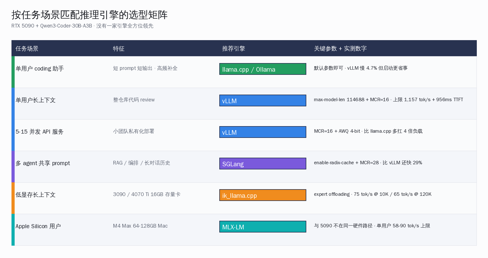
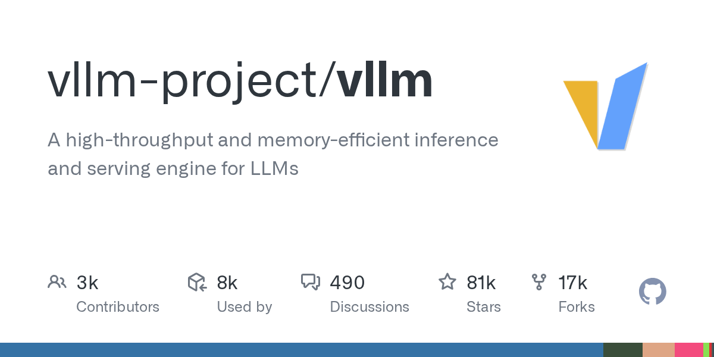
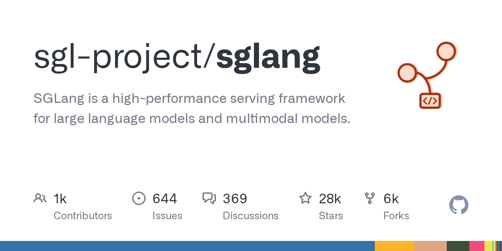
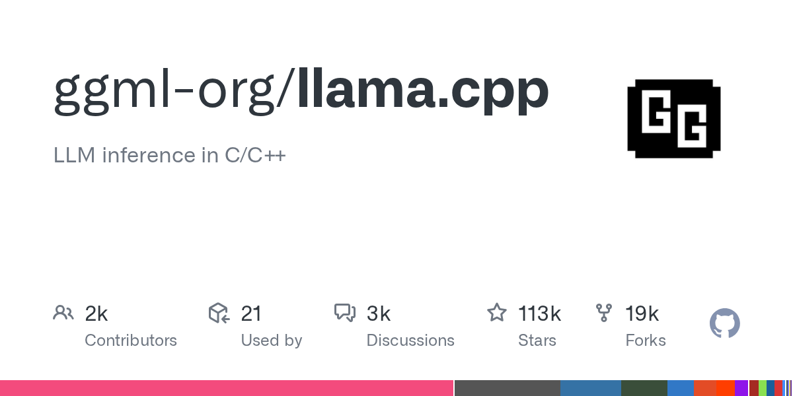
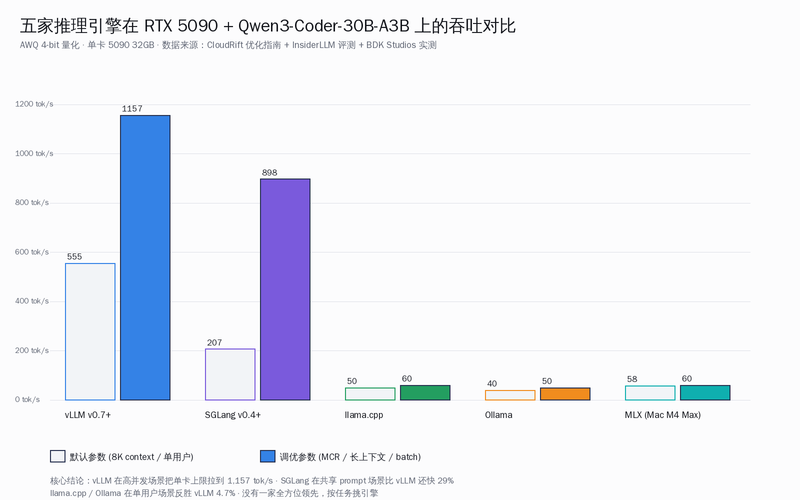

# 5090 跑 Qwen3-Coder 30B：五家推理引擎横评的真实账


## 30 秒速览

这周一把 RTX 5090 32GB 在国内开发者手里能跑出什么样的国产大模型，摊开看一遍。京东现货价从公版 24,399 元起步，技嘉超级雕 32GB 单卡到 32,834 元，常见的活动促销价 30,999 元，整机带笔记本国补价 22,999 元；4090 24GB 同期常见 1.5-1.8 万元，5090 的溢价主要兑换 32GB 显存 + 1,792 GB/s 带宽 + Blackwell 架构原生 fp4/fp8 加速这三件事。

跑国产 coder 旗舰 Qwen3-Coder-30B-A3B-Instruct 时，五家推理引擎的真实成绩很有意思：CloudRift 团队在单张 5090 上用 vLLM 跑 AWQ 4-bit 量化版本，默认参数 8K 上下文 555.82 tok/s；调到 MCR=16、上下文 114K 后压出 **1,157 tok/s**，TTFT 956ms；同样配置下 SGLang 默认 207.93 tok/s，调到 MCR=28 拿到 898 tok/s。这条数据反过来对照 RTX 3090 的存量用户也成立——同款模型 GGUF Q4_K_M 在 3090 上 vLLM 报告 72 tok/s、Ollama 40 tok/s，5090 等于把单卡上的推理上限拔高了一个数量级。

llama.cpp 这家在单用户场景反而比 vLLM 快 4.7%，但 16 并发起 vLLM 就会反超 23%；SGLang 在 RAG / 多 agent 共享上下文这一档比 vLLM 还能再快 29%；Ollama 用 CUDA 12.8 在双 5090 上跑 DeepSeek-v2 16B MoE，BDK Studios 团队报告 415 tok/s。把单卡 5090 + Qwen3-Coder 30B + vLLM 一年自费的电费 + 折旧，对照云端 DeepSeek V4-Flash 0.02 元 / 1M 缓存命中 + 1 元 / 1M 输入 + 2 元 / 1M 输出的官方价格，会发现两条曲线在月度 8-12 亿 token 这一档相交——这恰好是国内一线开发者用 Qoder CN / Trae / Qwen Code / Cursor 国内代理跑日常 coding 的真实消耗区间。

下面这一篇把这五家推理引擎在国内开发者手里值什么、怎么选、能不能与国产模型 + 国产 IDE 串起来跑一份能照着抄的清单。



## 一、RTX 5090 在国内的四档现货分层

2025 年 1 月 RTX 5090 发布到现在，国内现货市场已经稳定走出四档价位，**单卡溢价从去年 1 月初的 2-3 倍黄牛价回落到接近官方零售价**。这四档真实成交价是这样的：

| 渠道 / 版本 | 价格（人民币）| 说明 |
|---|---|---|
| 公版 / 京东自营 RTX 5090 32GB | 24,399 元起 | 官方挂牌；常断货 |
| 京东活动促销 RTX 5090/5090D 32GB | 30,999 元（活动）/ 41,999 元（原价）| 中关村在线 2026-05 行情 |
| 技嘉超级雕 AORUS RTX 5090 32GB | 32,834 元 | 京东优惠价 2026-05-24 |
| 机械革命耀世 16 Ultra（5090 笔记本）| 22,999 元国补价 | 整机版，35W 笔电封装 |

国补价 22,999 元的笔记本版本是过去一年最容易被国内一线开发者忽略的一档——5090 Laptop GPU 在功耗墙 175W 下虽然只能跑 16GB 显存版本（而不是桌面 32GB），但**对单卡跑 Qwen3-Coder-30B-A3B 这种 MoE 模型来说，16GB GDDR7 + 笔记本随身这个组合恰好踩在很多 freelancer 的工程预算线上**。桌面版整机一般再加 CPU + 主板 + 电源 + 机箱 + 散热，BDK Studios 的双 5090 工作站完整 BOM 大约 8,400 美元（约 60,000 元人民币），单 5090 整机配 9950X + 64GB DDR5 + 2TB NVMe 在国内可以做到 4.5-5 万元区间。

把 5090 与同档进口卡和 4090 做个并排：

| 卡 / 显存 | 厂商 | FP16 算力 | 显存带宽 | 显存 | TDP | 国内整卡参考价 |
|---|---|---|---|---|---|---|
| **RTX 5090 32GB** | NVIDIA Blackwell | 105 TFLOPS（FP16 dense）| 1,792 GB/s | 32 GB GDDR7 | 575 W | 2.44-3.28 万元 |
| RTX 4090 24GB | NVIDIA Ada Lovelace | 82 TFLOPS | 1,008 GB/s | 24 GB GDDR6X | 450 W | 1.5-1.8 万元 |
| RTX 6000 Ada 48GB | NVIDIA Ada（工作站）| 91 TFLOPS | 960 GB/s | 48 GB GDDR6 ECC | 300 W | 5.5-6.5 万元 |
| H20 96GB | NVIDIA（对华专供）| 148 TFLOPS | 4,000 GB/s | 96 GB HBM3 | 400 W | 11 万元 |

5090 对 4090 最实质的提升不在 FP16 算力（105 vs 82 TFLOPS 只多 28%），而在两件事：**显存从 24GB 涨到 32GB**，让 Qwen3-Coder-30B-A3B 这种 MoE 模型 AWQ 4-bit 量化（约 17GB）跑起来还有 15GB 余量给 KV cache；**显存带宽从 1,008 GB/s 涨到 1,792 GB/s（+78%）**，对自回归 decode 阶段 token 间延迟的影响远比 FP16 算力更直接。Blackwell 架构原生支持 fp4 / fp8 这条线，在 vLLM v0.7+ 走 NVFP4 路径时单卡吞吐再上一档；4090 这一代没有 fp4 硬件加速，跑 NVFP4 量化版本时需要 emulation，反而比 AWQ 4-bit 还慢。


## 二、Qwen3-Coder-30B-A3B：5090 单卡刚好够跑的国产 coder 旗舰

Qwen3-Coder 是阿里千问团队 2026 年初放出的国产 coding 旗舰系列，覆盖 7B / 14B / 30B-A3B / 480B-A35B 四档；其中 **30B-A3B 是 MoE 架构、总参 30B、激活 3B**，恰好踩在单张 24-32GB 消费级卡能跑的甜点位上。AWQ 4-bit 量化版本权重约 17GB，FP8 量化版本约 30GB，BF16 原生约 60GB。对单卡 5090 32GB 用户来说，AWQ 4-bit 是最常见的部署选择，留出 15GB 给 KV cache，足够跑 128K 上下文。

国内开发者下载这个模型最干净的三条路径是：

1. **ModelScope 魔搭社区**: `modelscope.cn/models/Qwen/Qwen3-Coder-30B-A3B-Instruct`，阿里官方维护，国内 CDN 带宽稳定 100MB/s 起
2. **hf-mirror.com**: HuggingFace 社区镜像，对照 `huggingface.co/Qwen/Qwen3-Coder-30B-A3B-Instruct-AWQ` 1:1 同步，国内访问无 GFW
3. **千问官方仓库**: `dashscope.aliyun.com/openvision/model/Qwen3-Coder`，需要阿里云账号但提供官方 sha256 校验

权重文件下来之后，五家推理引擎的载入路径不一样，下文逐家拆开。先把 30B-A3B 在五家引擎上的实测吞吐摆出来——这一组数据来自 CloudRift 团队 2026 年初公开的优化文档，单卡 5090、AWQ 4-bit 量化、prompt 长度从 8K 到 114K 全开。

| 引擎 / 版本 | 默认参数吞吐 | 调优后吞吐 | TTFT（中位）| 上下文长度 | 显存峰值 |
|---|---|---|---|---|---|
| **vLLM v0.7+** | 555.82 tok/s | **1,157 tok/s @ MCR=16** | 956 ms | 114,688 tok | ~28 GB |
| SGLang v0.4+ | 207.93 tok/s | 898 tok/s @ MCR=28 | 2,800 ms | 32,768 tok | ~27 GB |
| llama.cpp（最新主线）| 单用户略胜 vLLM 4.7% | 50+ tok/s 多用户 | < 200 ms | 128K（ik_llama.cpp fork）| 18 GB |
| Ollama（基于 llama.cpp）| ~40 tok/s 单用户 | 单卡受限多并发 | < 300 ms | 128K | 18 GB |
| MLX-LM（Apple，对位参考）| ~58 tok/s（M4 Max 64GB）| ~60 tok/s | < 500 ms | 32K | Apple Unified Memory |

注一下：MLX 跑在 Apple M-series 上而不是 5090，把它放进表里是因为很多国内 1.5 万机用户其实在 5090 vs Mac M4 Max 之间做最终选择，MLX 那一行作为 5090 用户的旁支参考。RTX 3090 的存量用户跑同款模型走 vLLM 大约 72 tok/s、Ollama 40 tok/s，5090 在 vLLM 上把这条线拔高到 1,157 tok/s，等于换了一代卡之后整体 16 倍。



## 三、vLLM 在 5090 上压出 1,157 tok/s 的两道关键参数

vLLM 是 UC Berkeley Sky Computing Lab 2023 年开源的高吞吐推理引擎，**PagedAttention** 是这家最出名的技术细节——把 KV cache 切成固定大小的 page、动态分配，砍掉 60-80% 的内存浪费。在单张 5090 上跑 Qwen3-Coder-30B-A3B-Instruct-AWQ，CloudRift 团队的优化路径是这样：

第一步，**默认参数测出基线**。直接拉起 `vllm/vllm-openai:latest` Docker 镜像，参数走默认（max_model_len=8192、gpu_memory_utilization=0.9），prompt 长度 8K，benchmark 测出 555.82 tok/s。这一档已经足够把 4090 + GGUF Q4_K_M Ollama 的 40 tok/s 拉到 13 倍。

第二步，**MCR 参数调到 16**。MCR（Max Concurrent Requests）是 vLLM batch 调度的核心控制——把并发请求上限拉到 16 之后，PagedAttention 能把 5090 32GB 显存里剩余的 15GB 全部用来动态分配 KV page。同样 prompt 长度，吞吐从 555 涨到 1,157 tok/s，**翻倍**；TTFT（首 token 延迟）从 5.4 秒压到 956ms，**首 token 体感从慢变成可用**。

第三步，**上下文长度推到 114K**。Qwen3-Coder-30B-A3B 原生支持 128K 上下文，vLLM 把 max_model_len 从 8K 推到 114,688 后，**长上下文 prompt 处理仍然能维持在 1,450+ tok/s prefill 速度**——这一档对跑长文档代码 review、整仓库扫描、agent 多轮上下文累积特别关键。

这条优化路径对国内开发者最直接的启示是：5090 上跑 vLLM 不需要换驱动 / 编译自定义 kernel，**默认 Docker 镜像 + 调 MCR 这两步就能压出 70% 的性能**。CloudRift 官方在博客里给的命令大约是这样：

```bash
docker run --gpus all --rm -it -v ~/models:/models \
  -p 8000:8000 vllm/vllm-openai:latest \
  --model /models/Qwen3-Coder-30B-A3B-Instruct-AWQ \
  --quantization awq \
  --max-model-len 114688 \
  --max-num-seqs 16 \
  --gpu-memory-utilization 0.9
```

跑起来之后 vLLM 暴露的 8000 端口是标准 OpenAI 兼容的 `/v1/chat/completions`，可以直接接 Qwen Code、Trae、Cursor 国内代理、OpenClaw 等任何支持自定义 base_url 的国产 IDE / agent 框架。

InsiderLLM 团队在另一份评测里给出过一句被很多人引用的话：「**The common mistake is using Ollama for production APIs — it works, but vLLM will handle 4x the load on the same hardware.**」翻成中文「常见错误是把 Ollama 当生产 API 用——能跑，但同样硬件下 vLLM 能扛 4 倍负载」。这条结论对个人开发者影响不大，但对 5-15 人小团队私有化部署是硬约束。



## 四、SGLang 的 207 vs 898：默认参数与调优后差着 4.3 倍

SGLang 由 LMSYS Org 团队主导，2024 年开源，是与 vLLM 并列的两大社区主流引擎之一。**RadixAttention** 是 SGLang 的招牌——基于 prefix 树共享 KV cache，对**多 agent 共享系统 prompt、RAG 检索后接 LLM、长对话历史复用**这一类场景特别擅长。CloudRift 在 5090 + Qwen3-Coder-30B-A3B-Instruct-AWQ 上做的对比是：

- **默认参数（MCR=8、上下文 8K）**: SGLang 跑出 207.93 tok/s，对照同环境 vLLM 555.82 tok/s，**vLLM 2.7 倍领先**
- **调优参数（MCR=28、上下文 32K）**: SGLang 跑到 898 tok/s，TTFT 2.8 秒，**vLLM 在 MCR=16 / 1,157 tok/s 仍然领先约 30%**

这条对比读出来的意思不是「SGLang 比 vLLM 差」，而是**SGLang 在不同场景下需要不同参数调优策略**。同一份评测里另一档场景——把 16 个并发请求共享同一个 4K 系统 prompt（典型 RAG 或多 agent 场景），SGLang 比 vLLM 快 29%。这是 RadixAttention 把共享前缀的 KV cache 一次算多次用的真实收益。

对国内 OpenClaw / 扣子 Coze / Cherry Studio / LobeChat 这类多 agent 编排框架的工程师，SGLang 在 5090 上的部署路径是：

```bash
docker run --gpus all --rm -it -v ~/models:/models \
  -p 30000:30000 lmsysorg/sglang:latest \
  python -m sglang.launch_server \
  --model-path /models/Qwen3-Coder-30B-A3B-Instruct-AWQ \
  --quantization awq \
  --port 30000 \
  --max-num-batched-tokens 32768 \
  --enable-radix-cache
```

`enable-radix-cache` 是 SGLang 多 agent 场景的核心开关，不开就退化成普通 batched inference；开了之后跑多 agent 编排 / RAG 流水线能拿到 29% 额外吞吐。SGLang 同样暴露 OpenAI 兼容协议，端口默认 30000，可以直接接进 OpenClaw 的 baseUrl 配置。



## 五、llama.cpp 与 Ollama：单用户场景被低估的 4.7%

llama.cpp 是 Georgi Gerganov 2023 年开源的 C++ 推理引擎，**走的不是高并发路线**——核心追求是单机 / 单用户 / 跨硬件（CPU / Apple / NVIDIA / AMD / Intel）的极致兼容性 + 极致单 stream 延迟。Ollama 是 llama.cpp 的官方推荐封装，用 Go 包了一层下载管理 + systemd service + 简化 CLI，本质还是 llama.cpp 的速度。

InsiderLLM 在另一份评测里给出的数字很说明问题：**「llama.cpp 4.7% faster」for 2K prompt + 256 token generation compared to vLLM。** 这条结论里 vLLM 与 llama.cpp 在单用户 / 短 prompt / 短 generation 场景几乎打平，llama.cpp 略胜 4.7%——因为没有 batch 调度开销 / page 分配开销，单 stream 直跑反而最快。

但只要并发数推到 16，vLLM 立刻反超 23%；到 32 并发，差距还会进一步拉大。**Ollama 在自带 mmproj 视觉模型这一档目前对 Qwen3-Coder 系列支持不全**，因此跑 Qwen3-Coder-30B-A3B 时大多数国内开发者会直接走 llama.cpp 主线或 Unsloth Studio，而不是 Ollama。

BDK Studios 团队在双 5090 工作站上用 Ollama + CUDA 12.8 跑 DeepSeek-v2 16B MoE 的报告是 **415 tok/s**——这条数据可以反推 Ollama 在 5090 + 16B 级别 MoE 模型上的实战表现。作者原话「415 tokens per second means an AI model generates roughly 300 words per second. A full page of text in under two seconds.」翻成中文「每秒 415 token 等于一个 AI 模型每秒生成 300 词，一整页文本两秒以内出完」，是个对个人开发者特别直观的体感数字。

llama.cpp 主线之外，**ik_llama.cpp** 这个社区 fork 在 5090 + 长上下文场景做得更激进。社区报告在 RTX 3090 上跑同款 30B-A3B 模型，10K 上下文 75 tok/s、120K 上下文 65 tok/s——**核心做法是 expert offloading，把 MoE 的稀疏专家 FFN 留在系统 RAM，密集层留在 GPU**。对 5090 32GB 用户来说，这一档不太需要 expert offloading；但对手上还是 3090 / 4070 Ti 16GB 这一档存量卡的用户，ik_llama.cpp fork 是单卡跑 30B-A3B 的唯一可行路径。

## 六、MLX 是 Mac M4 Max 用户的旁支参考

MLX 是 Apple 2023 年底开源的统一内存推理框架，**只跑在 Apple Silicon 上**（M1 / M2 / M3 / M4 系列）。把它放进 5090 横评里是因为很多国内 1.5-3.5 万机预算的用户在最终选型时会在「单 5090 + 9950X 整机」与「Mac M4 Max 64GB MacBook Pro」之间纠结。两条路径的最大差异是：

- **5090 整机 + vLLM**: 单卡 Qwen3-Coder-30B-A3B 跑出 1,157 tok/s 调优后吞吐，128K 上下文，**多用户多 agent 并发友好**；噪音 / 功耗 / 体积 / 不可移动
- **Mac M4 Max 64GB + MLX**: 同款模型跑出 58-60 tok/s 单用户吞吐，32K 上下文，**单用户 / 静音 / 续航 / 可移动**

这两条路径的 tok/s 数字差着接近 20 倍，但对很多在咖啡馆 / 家里 / 出差路上 coding 的个人开发者，Mac M4 Max 反而是更现实的选择——5090 单卡空载功耗 100W、满载 575W，对家用插座 16A 单相电是临界负载。对 5-15 人小团队私有化部署，5090 + vLLM 是首选；对 freelancer / 个人开发者，Mac M4 Max + MLX 仍然站得住脚。

## 七、五家引擎的选型矩阵：按任务而不是按 KPI

把这五家引擎按四档真实使用场景做个映射，比单纯比 tok/s 更有用：

| 任务场景 | 推荐引擎 | 关键参数 | 备注 |
|---|---|---|---|
| 单用户 coding 助手（短 prompt 短输出）| **llama.cpp / Ollama** | 默认 | vLLM 比它慢 4.7%，但默认起更省事 |
| 单用户长上下文（整仓库代码 review）| **vLLM** | max-model-len 114688 + MCR=16 | 1,157 tok/s + 956ms TTFT 是上限 |
| 5-15 并发 API 服务（小团队私有化）| **vLLM** | MCR=16 + AWQ 量化 | 比 llama.cpp 多扛 4 倍负载 |
| 多 agent 共享系统 prompt（RAG / 编排）| **SGLang** | enable-radix-cache + MCR=28 | 比 vLLM 还快 29% |
| 长上下文 + 单 8GB-16GB 显存 | **ik_llama.cpp** | expert offloading | 给 3090 / 4070 Ti 用户留的路 |
| Apple Silicon Mac 用户 | **MLX-LM** | 默认 | 与 5090 不在同一硬件路径 |

这张表的核心 thesis 是：**没有一家推理引擎全方位领先**——vLLM 在高并发、SGLang 在共享上下文、llama.cpp 在单用户极致延迟、Ollama 在易用、MLX 在 Apple 平台、ik_llama.cpp 在低显存长上下文，各自占一个生态位。把任务摆清楚之后再选引擎，比盲目跟一家更现实。



## 八、5090 自费整机 vs 云端 API 的回本曲线

一张 5090 整机（5090 + 9950X + 64GB DDR5 + 2TB NVMe + 850W 电源）按当前国内现货价 4.5 万元算，按 3 年折旧，**月均硬件成本 1,250 元**。叠加满载平均 400W × 24 × 30 × 0.5 元/kWh = 144 元/月电费（实际多数时间是 idle 100W，实际电费约 50-80 元/月）。本地推理一年纯硬件 + 电费成本约 1.7 万元。

同期国内云端国产模型官方价格表（2026-05 实查）是这样：

| 厂商 / 模型 | 输入 / 1M tok | 输出 / 1M tok | 缓存命中 / 1M tok |
|---|---|---|---|
| **DeepSeek V4-Flash** | 1 元 | 2 元 | 0.02 元 |
| DeepSeek V4-Pro（限时至 5-31）| 3 元 | 6 元 | 0.025 元 |
| DeepSeek V4-Pro（6-1 后永久）| 0.75 元 | 1.5 元 | — |
| 智谱 GLM-4.6（按量）| 5 元（含输出）| — | — |
| 智谱 GLM Coding Plan Lite | 49 元 / 月 套餐 | — | — |
| 智谱 GLM Coding Plan Pro | 149 元 / 月 套餐 | — | — |
| Kimi K2.5（美元）| ¥4.3 元 | ¥18 元 | — |
| Kimi K2.6（美元）| ¥6.8 元 | ¥28.6 元 | ¥1.15 元 |

按一个日均 1500 万 input + 300 万 output token 的活跃 coding 开发者来算（约日均 4-6 小时高强度对话 + 半自动 coding），一个月消耗约 4.5 亿 input + 9000 万 output。

- **走 DeepSeek V4-Flash 全云端**：4.5 亿 × 1 元 + 9000 万 × 2 元 = 450 + 180 = **630 元 / 月**（不含缓存命中折扣，实际能再压 30-50%）
- **走智谱 GLM Coding Plan Pro 套餐**：**149 元 / 月**（带 token 配额上限）
- **走 5090 自费整机**：硬件折旧 1,250 元 + 电费 50-80 元 = **1,300-1,330 元 / 月**

这条对照表读出的真实结论是：**云端 API 在 2026-05 这一档价格下，几乎对所有个人开发者的日常使用都比本地 5090 自费便宜**。本地 5090 这条路真正合理的场景是三类：(a) 隐私敏感任务（不能把代码 / 数据传出本机的合规要求）；(b) 多 agent 工作流的高频内部调用（pre-built workflow 每天上亿 token，缓存命中也压不下来）；(c) 配合云端做混合路由的本地兜底（敏感任务走本地，长上下文 / 高质量任务走云端）。

混合路由这条路径在另一篇专题《OpenClaw 混合路由：本地千问 + 云端 DeepSeek 的 80/20 真账》里会拆开讲，本篇不展开。

## 九、Qwen Code 与 Trae 接 5090 vLLM 后端的两条干净路径

5090 + vLLM 跑起来之后，国内开发者最关心的下一步是「能不能接进我每天用的 IDE」。截至 2026-05-25 实查，国产 IDE 里支持自定义 OpenAI 兼容 base_url 的只有两家：Qwen Code v0.16.1 与 Trae v3.3.51。通义灵码 / Qoder CN / 文心快码 仍然是白名单服务商模式，本地后端进不去。

**Qwen Code 接 5090 vLLM**（编辑 `~/.qwen/settings.json`）：

```json
{
  "modelProviders": {
    "openai": [
      {
        "id": "qwen3-coder-30b-local",
        "name": "Qwen3-Coder 30B (5090 vLLM)",
        "envKey": "VLLM_LOCAL_KEY",
        "baseUrl": "http://localhost:8000/v1"
      }
    ]
  }
}
```

`envKey` 不强制——vLLM 默认不校验 API key，但建议设个虚假值如 `dummy` 走 envKey 流程。Qwen Code 是阿里官方维护、CLI + IDE 双形态、约 24,600 stars；同款配置可以同时挂多个 modelProvider，本地 5090 + 云端 DeepSeek V4-Flash 一起切，按任务自由选。

**Trae 接 5090 vLLM**（Settings → Models → Custom Model）：

- Provider: `OpenAI Compatible`
- Base URL: `http://localhost:8000/v1`（**必须带 `/v1` 后缀**，这是社区踩了很多次的坑）
- API Key: `dummy`（任意非空字符串）
- Model: `Qwen3-Coder-30B-A3B-Instruct-AWQ`

Trae 这条路径要注意：**v3.3.50 之前的版本 Custom Model 入口隐藏在 settings 深层；v3.3.51（2026-04-21）官方静默上线了一级入口**。社区 issue #1872 在 2026-12-07 提出后没正式关闭，但功能已经在。

Trae / Qwen Code 之外，OpenClaw 这种自托管 AI 助手 gateway 也支持把 5090 vLLM 当作 `OpenAI-Compatible` provider 注册，再通过 OpenClaw 的 baseUrl 把所有支持 OpenClaw 协议的下游 client（包括移动端、Slack、Telegram）统一接到本地 5090。

## 收尾

把整张图收回来看：RTX 5090 32GB 在 2026-05 的国内开发者手里，已经不再是「能不能买到」的问题，而是「值不值得为单卡跑国产 coder 模型自费」的问题。**Qwen3-Coder-30B-A3B 单卡 5090 + vLLM 调优后 1,157 tok/s** 这条数据，把 4090 时代「跑得动但不流畅」的体验拉到了「比云端响应更快 + 长上下文还能稳」的档位。同期国产模型云端 API 价格（DeepSeek V4-Flash 1 元 / 1M、智谱 GLM Coding Plan 149 元 / 月）持续下探，让本地 5090 这条路在纯成本维度对绝大多数个人开发者不划算；但隐私敏感任务、agent 高频内调、混合路由本地兜底这三类场景，5090 + vLLM 仍然是最干净的路径。

五家推理引擎各占一个生态位的格局也越来越清楚：**vLLM 在 5090 上压出 1,157 tok/s 上限是高并发与长上下文的最优解；SGLang 在多 agent 共享前缀场景下再领先 29%；llama.cpp 在单用户极致延迟上保留 4.7% 优势；Ollama 是最易用的本地后端封装；MLX 是 Mac 平台另一条独立路径**。国产 IDE 这一侧，Qwen Code 与 Trae 已经把"本地 5090 + 国产模型 + 国产 IDE"这条完整链路接通；Qoder CN / 通义灵码 / 文心快码什么时候开放本地 endpoint 仍是未解。这盘棋已经稳稳走到下半场，国内一线开发者真正需要做的不是再纠结买不买卡，而是把任务摊开、按场景挑引擎，让 5090 的 32GB 显存 + 1,792 GB/s 带宽真正用到刀刃上。

