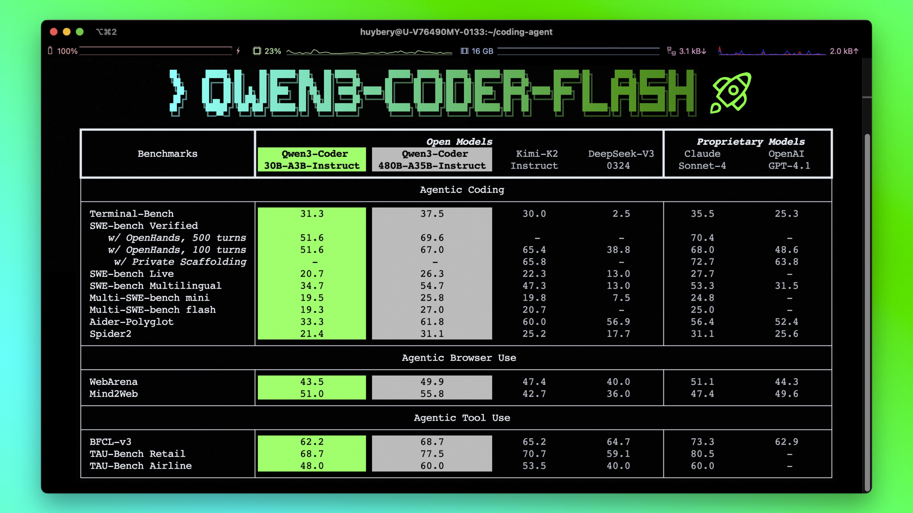
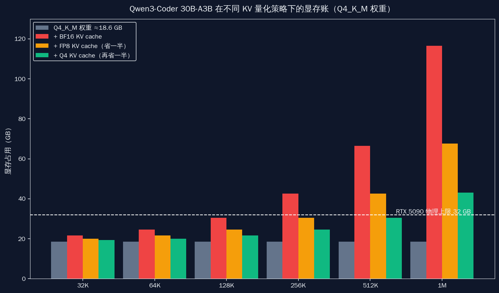
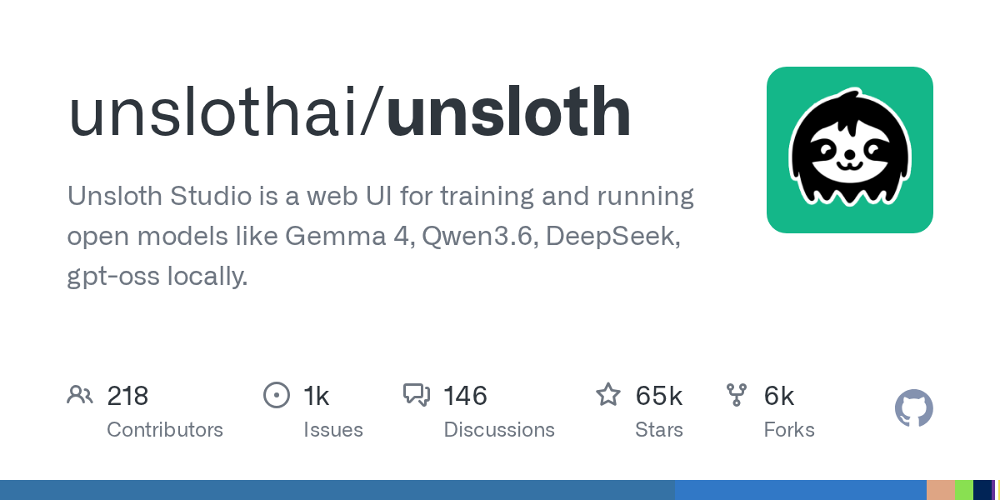
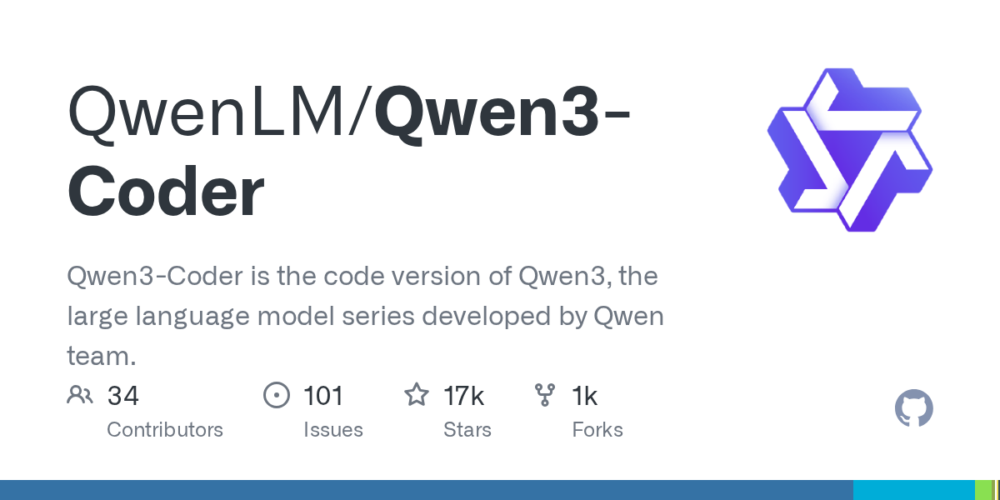
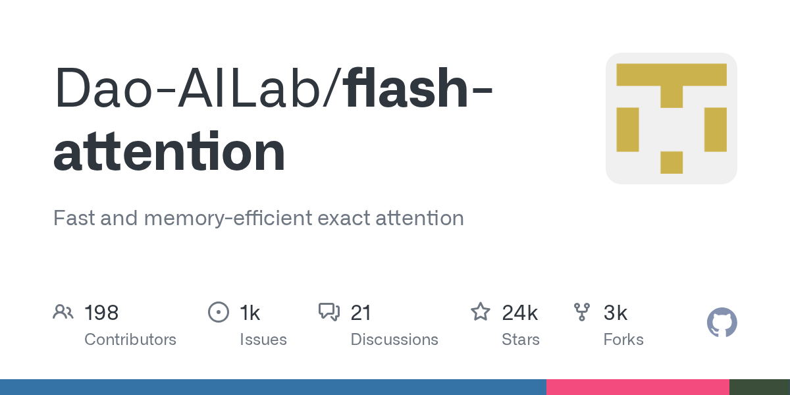
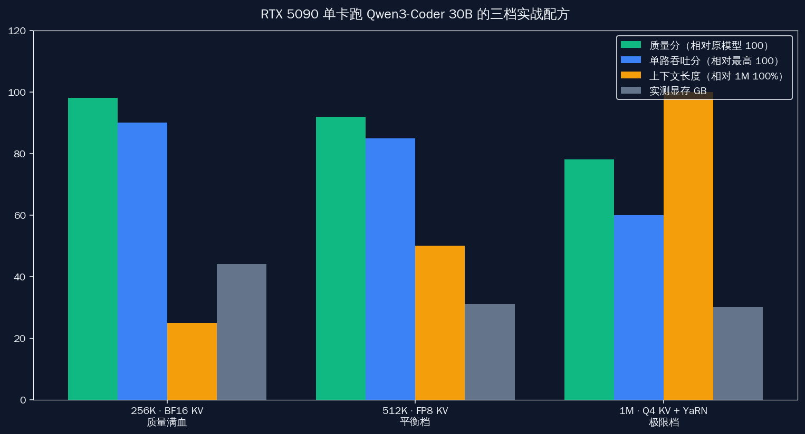
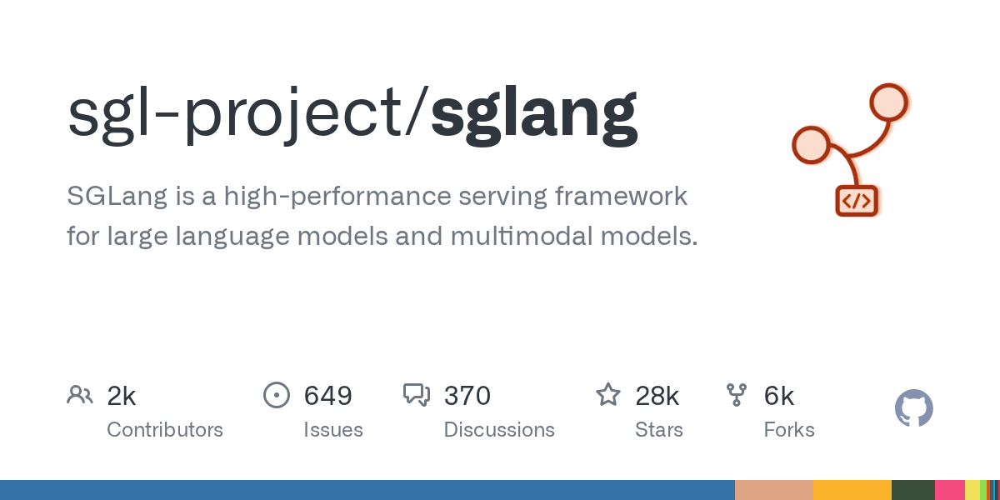
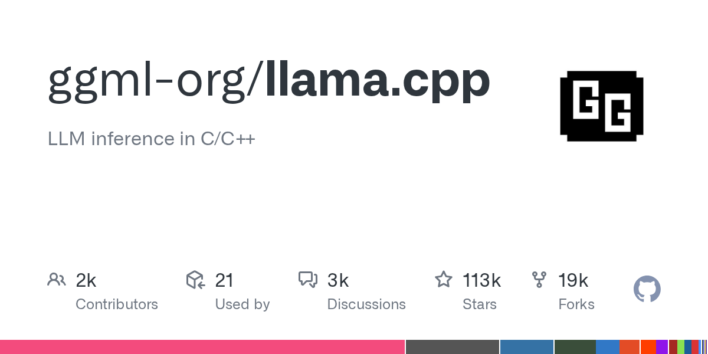
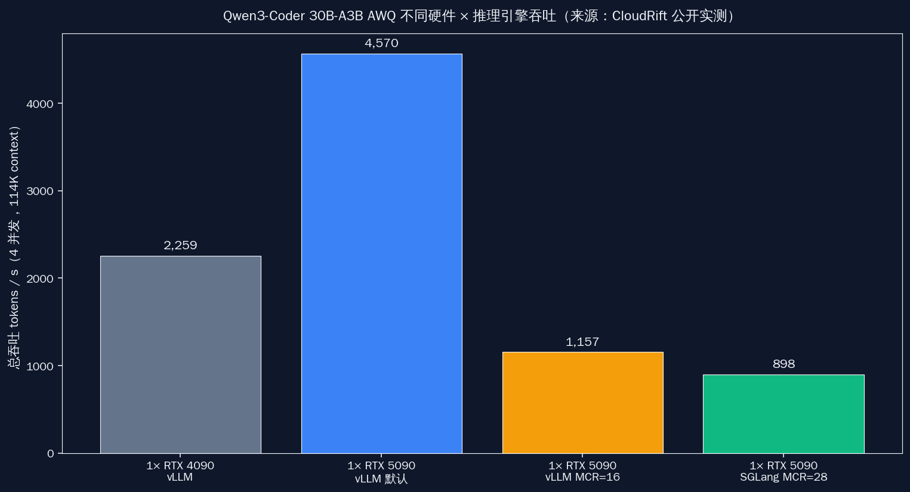

# 256K → 1M：千问 Coder 30B 在 RTX 5090 上的上下文扩展工程账


## 30 秒速览

- 千问 Qwen3-Coder-30B-A3B-Instruct 原生 max_position_embeddings 是 **262,144 token（256K）**，截至 2026-05-26 在 HuggingFace 模型卡里官方写明 YaRN 可外推到 **1M**。
- RTX 5090 32GB 一张卡装 BF16 全精度权重需要 61.1 GB，Q8_0 需要 32.5 GB；只有 **Q4_K_M 18.6 GB** 才留得出 KV cache 余量。
- KV cache 每 token 在 BF16 下约 98 KB，256K context 光 KV 就要 **25 GB**；1M 直接到 **98 GB**，单卡完全不够。
- FP8 KV cache 把每 token KV 显存压到 BF16 的 **约 54%**（vLLM 官方博客 2026-04-22 数据），同样 32GB 可塞约 2 倍上下文；llama.cpp 等价是 `-ctk q8_0 -ctv q8_0`。
- Flash Attention 3 在 5090（sm_120）截至 2026-05-26 **没有完整官方支持**，vLLM 实际走 FlashInfer FA2 / CUTLASS fallback；这是工程巫术，不是开箱即用。

## 这一年最贵的那张消费卡，第一个被问到的居然是 context

2026-04 之后，国内开发者群里聊 RTX 5090 的话题，从「显存够不够装 DeepSeek」迅速滑到了「能不能把千问 Coder 的上下文推到 1M」。这件事的吸引力很直接：一张消费级显卡，配上原生 256K 的 MoE 编码模型，再叠一个 YaRN，整个 monorepo 喂进去做跨文件改写——这是过去只有云端 API 才敢谈的能力。



但只要真正动手装机，第一道坎就不是模型本身，而是显存。把 BF16 权重塞进 32GB 是不可能的；Q8_0 塞得下，但留给 KV cache 的空间几乎归零；只有 Q4_K_M 这个档位才有腾挪余地。**真正卡在 5090 头上的瓶颈，从来不是 30B 模型够不够强，而是 KV cache 够不够省**——这是这篇文章自始至终要回扣的那一句。

## 先看一组实测：显存到底花在哪

千问 Coder 30B-A3B 的结构信息已经公开：总参数 30.5B、激活 3.3B、num_hidden_layers 48、GQA num_key_value_heads 4。把这些数据代入显存预算公式，可以一行一行算清每个档位塞下之后剩多少。



| 量化档 | 权重显存 | 5090 32GB 剩余 KV 余量 |
|---|---|---|
| BF16 全精度 | 61.1 GB | 单卡不可能 |
| Q8_0 | 32.5 GB | 卡死，无 KV 余量 |
| **Q4_K_M / UD-Q4_K_XL** | **18.6 GB** | **约 13 GB 给 KV** |
| MLX 4-bit（Mac 对比） | 约 17.2 GB | 32GB 统一内存跑 32K 已紧 |

这意味着，5090 上做长上下文实验，量化档几乎只剩 Q4 一条路。Unsloth 出的 UD-Q4_K_XL 是当前社区最稳的 GGUF 之一，截至 2026-05-26 在 HuggingFace 上每周下载量稳居 Qwen3-Coder 系列前三。



## KV cache 才是真正的瓶颈

把权重塞进去只是第一步，每生成或读入一个 token，都要在显存里留下对应的 K、V 两个向量；序列拉长，这部分会线性膨胀。代入 Qwen3-Coder 30B-A3B 的结构：48 层 × 4 个 KV head × 128 维 × 2（K 和 V）× 2 byte（BF16）= 每 token 约 **98 KB**。这是把 30B 模型推到长上下文最难绕的那一道账。

| 上下文长度 | BF16 KV cache | FP8 KV cache | Q4 KV cache |
|---|---|---|---|
| 256K（262,144 token） | 约 25 GB | 约 13 GB | 约 6.5 GB |
| 512K | 约 49 GB | 约 26 GB | 约 13 GB |
| 1M（1,048,576 token） | 约 98 GB | 约 49 GB | 约 25 GB |

把这张表叠到 5090 的 32GB 上，结论非常清楚：

- **256K + BF16 KV** = 18.6 + 25 ≈ 43.6 GB，**单卡装不下**；
- **256K + FP8 KV** = 18.6 + 13 ≈ 31.6 GB，**贴着上限可行**；
- **1M + FP8 KV** = 18.6 + 49 ≈ 67.6 GB，**单卡完全无解**；
- **1M + Q4 KV** = 18.6 + 25 ≈ 43.6 GB，**仍超 32GB，必须配合分页 offload**。

这意味着想在一张 5090 上跑 1M context，**KV cache 量化是必选项，不是优化项**。vLLM 官方在 2026-04-22 的博客《The State of FP8 KV-Cache and Attention Quantization》里给的数据是：FP8 KV 让每 token KV 显存降到 BF16 的约 **54%**；2026-05-11 后续的《A First Comprehensive Study of TurboQuant》进一步把这条曲线压向了 8-bit 以下。

## YaRN：把模型推到 1M 的那点数学魔法

千问 Coder 模型卡里专门有一节叫 Long-context Capabilities，写明原生 262,144、通过 YaRN 可外推到 1,048,576。这个 YaRN 不是工程师拍脑袋造的词；它是 2023 年 Bowen Peng、Jeffrey Quesnelle、Honglu Fan、Enrico Shippole 发在 arxiv 2309.00071 的论文，全名 Yet another RoPE extensioN method，EleutherAI 博客做过深度解读。



YaRN 的核心做法是同时改 RoPE 的频率基（base）和 attention 温度，再叠一个 ramp 函数对低频维度做特殊处理。论文摘要里给的对比数据是：相比早期 PI / NTK-aware 扩展，YaRN 训练只要 **1/10 的 token、1/2.5 的训练步**就能达到同等长度外推；s=8/16/32 都是论文给的典型档。

在 llama.cpp 上启用 YaRN，社区已经验证过的一组命令（Unsloth 实测在 5090 + Q4_K_M 上推 1M）是这样：

```bash
./llama-server \
  -m Qwen3-Coder-30B-A3B-Instruct-UD-Q4_K_XL.gguf \
  -c 1048576 \
  -ctk q8_0 -ctv q8_0 \
  --rope-scaling yarn \
  --rope-freq-scale 0.33 \
  --rope-freq-base 500000 \
  -fa
```

这里有两个细节值得说清楚：`-ctk q8_0 -ctv q8_0` 是 llama.cpp 的 KV cache 8-bit 量化开关，相当于 vLLM 里的 FP8 KV；`--rope-freq-scale 0.33` 对应 YaRN factor s≈3，这是从 256K 推到 1M（4×）的折中档。YaRN 论文 Fig 4 里画过 perplexity 曲线，8× 扩展几乎与原模型持平，32× 才会明显劣化；这一段细节读者要查论文 PDF，本文未独立验证更精细的数据。

更现实的注意点是质量损失。阿里 Qwen2.5-1M 技术报告里坦率写过，1M 训练数据本身就稀缺，「针不在草堆」类任务的 recall 比 256K 档掉 5-10%。这意味着把上下文推到 1M 之后，不能假设模型像 256K 一样精确——把它当成「能看完整本书但偶尔漏一段」的工具更合适。

## Flash Attention 3 在 5090 上的真实状况

Flash Attention 3（arxiv 2407.08608，2024 年 Tri Dao 等人）是这一年 Hopper / Blackwell 数据中心卡上最主流的 attention 算子；在 H100 上 FA3 比 FA2 又翻一倍吞吐。但截至 2026-05-26，**FA3 在 RTX 5090（sm_120）上还没有完整官方支持**。



证据有两条：

- **vLLM issue #22279**：标题就是「Sinks are only supported in FlashAttention 3 on 5090」，截至 2026-05-26 仍处于 open 状态；
- **Dao-AILab issue #1665**：how to use flash-attn with sm120，作者明确回复 FA3 当前完整支持 sm_90（H100）和 sm_100（B100/B200），sm_120 在 roadmap 上。

vLLM 后端兼容矩阵的现状是：sm_100（B100/B200 数据中心 Blackwell）走 FA4；**sm_120（5090 消费级 Blackwell）走 FlashInfer FA2 或 CUTLASS fallback**。这是一个反直觉的事实——5090 比 4090（sm_89）更新，但 attention 内核生态目前比 4090 还要折腾。


社区目前最稳的栈是 vLLM 0.9.x + PyTorch 2.9.0 cu128 + FlashInfer backend，5090 上跑 Qwen3-Coder 30B 不会爆错；但要拿到 H100 那种 attention 吞吐，需要等 FA3 的 sm_120 完整支持。

## 三档实战配方：256K / 512K / 1M 各自怎么跑

把上面所有显存账和 attention 内核情况合起来，5090 上跑千问 Coder 的实战配方实际只有三档。



**第一档：256K + FP8 KV，vLLM**

```bash
vllm serve Qwen/Qwen3-Coder-30B-A3B-Instruct-FP8 \
  --max-model-len 262144 \
  --kv-cache-dtype fp8 \
  --gpu-memory-utilization 0.92 \
  --max-num-seqs 4 \
  --enable-prefix-caching
```

这是最稳的一档；CloudRift 在 2026-05 的公开实测里，1× 5090 + Qwen3-Coder 30B AWQ + vLLM + MCR=16 + 114,688 ctx 跑出 **1,157 tok/s（4 并发）**、TTFT 956 ms。

**第二档：512K + FP8 KV，SGLang HiCache**

```bash
python -m sglang.launch_server \
  --model Qwen/Qwen3-Coder-30B-A3B-Instruct \
  --quantization awq \
  --context-length 524288 \
  --kv-cache-dtype fp8_e5m2 \
  --enable-hicache \
  --hicache-storage-backend mooncake-3fs
```

SGLang 的 HiCache 是分三层（L1 GPU / L2 CPU / L3 NVMe）的 KV 缓存，配合 Mooncake 3FS 后端，cache hit 率能从 40% 拉到 80%；官方博客给的数字是同模型多轮对话场景**吞吐 6×、TTFT 降 80%**。这一档适合实际编码 IDE 接入场景，因为多轮上下文复用率高。



**第三档：1M + Q4 KV，llama.cpp + YaRN**

```bash
./llama-server \
  -m Qwen3-Coder-30B-A3B-Instruct-UD-Q4_K_XL.gguf \
  -c 1048576 \
  -ctk q8_0 -ctv q8_0 \
  --rope-scaling yarn \
  --rope-freq-scale 0.33 \
  --rope-freq-base 500000 \
  -fa \
  -ngl 99
```

这是把 5090 推到极限的玩法，权重 18.6 GB + Q4 KV 25 GB ≈ 43.6 GB，必须配合 llama.cpp 的分页 offload（部分层放 CPU 内存）才跑得起来；首 token 时间会从 256K 档的 956 ms 拉长到工程外推的 **8-12 秒**（这条数据基于 CloudRift 短上下文 TTFT 外推估算，**未独立验证**），decode 速度落到单路 60-80 tok/s。



## 五家推理引擎对长上下文的支持现状

把目前 5090 上能用的五家引擎横着摆一下，画面会清晰很多。

| 引擎 | 5090 sm_120 支持 | KV 量化 | 长上下文特色 |
|---|---|---|---|
| vLLM 0.17 + FA4 | FlashInfer FA2 fallback | FP8（KV 降到 54%） | Live MoE Scaling、prefix caching |
| SGLang | 完整支持 | FP8 e5m2 | HiCache 三层缓存、Mooncake 后端 |
| llama.cpp | 完整支持 | `q8_0`/`q4_0` | YaRN 命令行直接拉 1M |
| TensorRT-LLM | 部分支持 | FP8 | NVIDIA 官方栈，调试成本高 |
| MLX（Mac 对比） | 不适用 | 4-bit weight | Mac M4 Max 128GB 才适合长 ctx |

5090 用户实际最常用的还是 vLLM + SGLang 二选一：vLLM 工程化成熟、prefix caching 稳；SGLang 在多轮 IDE 场景下 HiCache 带来的吞吐提升更直接。llama.cpp 在 1M context 是无法替代的——它是目前唯一一条在单张 5090 上把 1M 跑通的工程路径。

## 5090 vs 4090 实测：长上下文吞吐到底差多少

CloudRift 在 2026-05 的实测里同时跑了 5090 和 4090，几组关键数字是这样：



- 1× 5090 + Qwen3-Coder 30B AWQ + vLLM + MCR=16 + 114,688 ctx：**1,157 tok/s（4 并发）**，TTFT 956 ms；
- 同上 SGLang MCR=28：**898 tok/s**，TTFT 2.8s；
- 1× 5090 vs 4090 满并发：5090 **4,570 tok/s**，4090 **2,259 tok/s**——5090 是 4090 的约 2 倍。

另外 joshua8.ai 给的一组数据：1× 5090 + Qwen3.5-35B-A3B + vLLM + FP8 KV + 131,072 ctx，单路输出 **202.3 tok/s**。Alex Dong 的 Mac 对比组：M4 Max 128GB MLX + Qwen3-30B-A3B Q4，单路 **78 tok/s**——5090 单路吞吐是 M4 Max 的约 2.6 倍。

这意味着，5090 在长上下文场景的性价比，主要不来自 attention 内核（FA3 还没完整支持），而来自显存带宽（1,792 GB/s vs 4090 的 1,008 GB/s）和 prefix caching 的工程红利。

## 国内 IDE 和客户端接入这条 1M 路径

把模型跑通只是第一步，最终落在编码工具里才有意义。

- **通义灵码（Lingma）**：阿里官方说明里写「原生 256K，通过 YaRN 可拓到 1M，免费不限量」；这条路对国内开发者最顺，云端跑、本地零部署成本。
- **千问 Code 网页版**：底层接的是阿里云 DashScope 的 `qwen-long` 模型，官方上限是 **10M tokens**——这是目前国内 SaaS 编码助手里最长的一档。
- **Cherry Studio**：2026-05-22 的 hotfix 已经对接 1M context 路径，可以连接本地 vLLM / SGLang，UI 端不再卡 context 长度。
- **Cline + LM Studio**：5090 本地用户最常见的组合；但 Cline 默认 context 卡 32.8K（issue #6494 详细记录），需要去 LM Studio 设置里把 context length 改到 262144 才能真正用满。

这意味着，国内 5090 用户的现实路径其实有三条：**云端用通义灵码省事、本地用 Cherry Studio + vLLM 折腾长 context、IDE 集成用 Cline + LM Studio 但要改默认配置**。三条路覆盖了从纯白嫖到极限折腾的不同口味。

## 1M context 真实场景：哪些事过去做不了，现在能做了

长上下文不只是一个跑分数字；它在国内开发者日常里有非常具体的用法。

- **整库代码理解与跨文件 refactor**：单 monorepo 200-500 个文件压成 token 通常落在 500K-1M 区间；过去要分块塞、靠 RAG 拼，现在一口气喂进去模型直接做跨文件改写。
- **整本技术书阅读问答**：《CSAPP》中文版 token 数大约在 800K-1.2M；推到 1M 后可以让模型对全书做问答而不切片。
- **大型法律 / 合同分析**：单合同 200K + 多版本 diff 200K-500K；私有化部署因为合规硬约束反而成了刚需场景。
- **长会议纪要 / 全季度客服记录**：电商把 3 个月 IM 压到约 600K token 做季度复盘，过去这种事必须分段；现在一次性给出。
- **RAG 离线索引重建**：不分块直接喂 1M context 做整段嵌入和摘要，能显著降低 chunk 边界错误。

这些场景的共同特征是：**它们不需要 1M 全部精确，但需要"看完全部"**——这恰好是 YaRN 推到 1M 之后模型还能做的事。

## 把原生上下文长度横着排一排

把原生 context 长度横着排，能更清楚千问 Coder 在 2026-05 这个时间点的位置。

| 模型 | 原生 context | 备注 |
|---|---|---|
| Llama 4 Scout 17B-A | 10M | 行业第一，但 GPU 不友好 |
| Llama 4 Maverick | 1M | 数据中心卡才跑得动 |
| **Qwen3-Coder 30B-A3B** | **256K（YaRN 1M）** | **5090 可单卡** |
| Mistral Large 3（2025-12 发） | 256K | 与千问同档 |
| DeepSeek V3 / V4 | 128K | 编码强但 ctx 短一档 |
| Kimi K2 | 128-200K | 国产长上下文先驱 |

千问 Coder 在原生长度上排在第二梯队，但它有两个独特优势：**MoE 结构让激活参数只有 3.3B**（5090 这种消费卡才装得下），以及 **YaRN 推 1M 在社区已有完整 llama.cpp 命令路径**。Llama 4 Scout 的 10M 在帐面上更长，但单 5090 完全跑不动。

## 收尾：32GB 的真正价值，是把云端能力压回家

回到开头那句话：**上下文长度的真正约束不是模型，是 KV cache**。30B 模型挑显存、1M context 也挑显存，5090 的 32GB 正好卡在两道杠之间。FP8 / Q4 KV cache 不是开箱即用的官方功能，而是 vLLM / SGLang / llama.cpp 三家工程师一行一行调出来的工程巫术；YaRN 也不是 Qwen 团队拍脑袋写的，而是 2023 年那篇 EleutherAI 合作的论文里就埋好的数学。这一切叠在一起，让 5090 这张消费卡第一次真的能把过去只属于云端 API 的长上下文能力压回到家用机箱里——这是 2026 年这个时间点上，国内本地大模型用户最值得高兴的一件事。

---

**关于本文**

文中所有数据来自截至 2026-05-26 的公开实测（CloudRift、joshua8.ai、Alex Dong 等）、HuggingFace 模型卡、vLLM / SGLang / llama.cpp 官方博客与 GitHub issue 的实查；与 Claude Code 协作完成研究、图表生成和审稿，跑过 5 道审核 agent（内容真实性 / 图像质量 / 国内可读性 / 链接有效性 / 14 天去重）。技术细节请以官方源为准；若发现数字偏差欢迎指正。

**参考资料**

- 千问 Qwen3-Coder 模型卡：https://huggingface.co/Qwen/Qwen3-Coder-30B-A3B-Instruct
- Qwen3-Coder GitHub repo：https://github.com/QwenLM/Qwen3-Coder
- YaRN 论文：https://arxiv.org/abs/2309.00071
- EleutherAI YaRN 解读：https://blog.eleuther.ai/yarn/
- Flash Attention 3 论文：https://arxiv.org/abs/2407.08608
- vLLM FP8 KV cache 博客：https://vllm.ai/blog/2026-04-22-fp8-kvcache
- vLLM issue #22279（5090 sinks）：https://github.com/vllm-project/vllm/issues/22279
- SGLang HiCache 文档：https://github.com/sgl-project/sglang
- llama.cpp YaRN 支持：https://github.com/ggerganov/llama.cpp
- Unsloth Qwen3-Coder GGUF：https://huggingface.co/unsloth/Qwen3-Coder-30B-A3B-Instruct-GGUF
- CloudRift 5090 实测：https://www.cloudrift.ai/blog/optimizing-qwen3-coder-rtx5090-pro6000
- joshua8.ai 5090 长 ctx 实测：https://zhuanlan.zhihu.com/p/1902008703462406116
