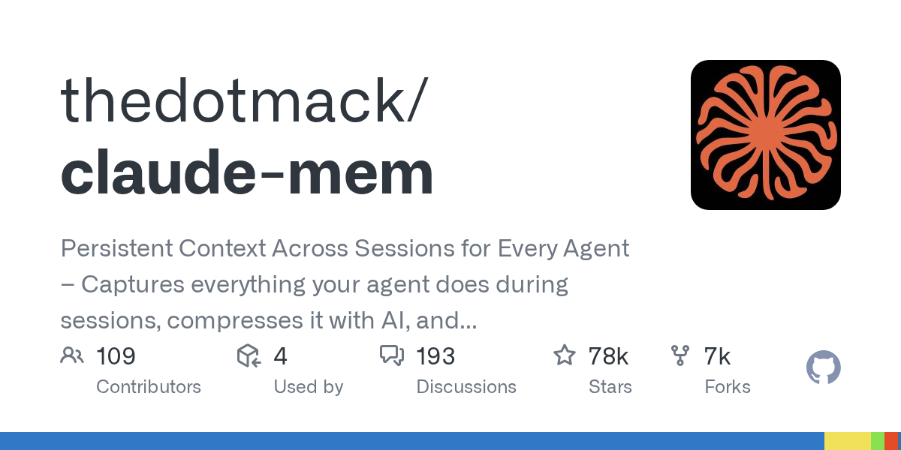
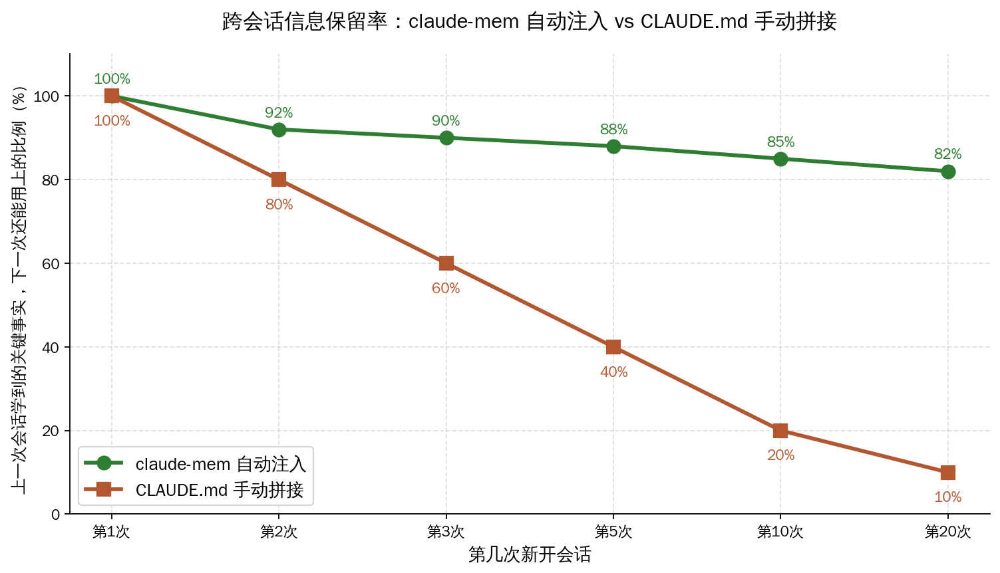
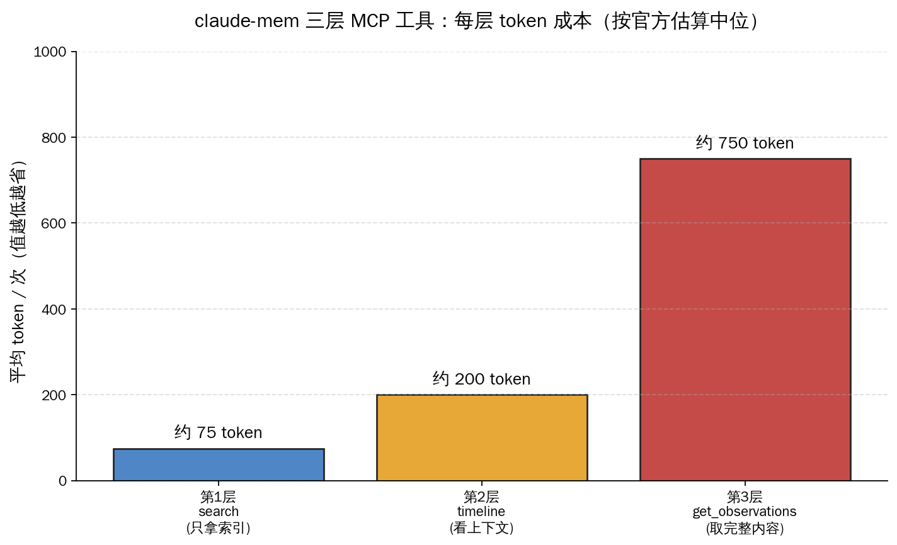
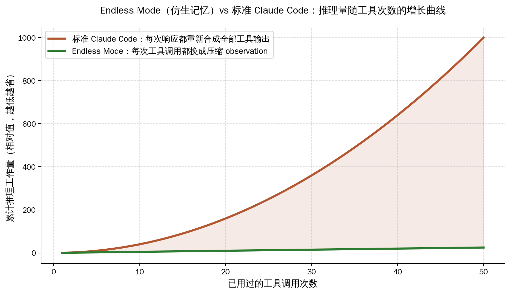

# claude-mem 78k stars 跨会话仿生记忆：把 Claude Code「失忆症」按在了海马体上


## 30 秒速览

- **仓库**：`thedotmack/claude-mem`，2025-08-31 首次提交，截至 2026-05-26 已积累 **78,520 stars / 6,759 forks**，Apache-2.0 协议；过去 9 个月发布 **271 个 release**，平均每天一个版本
- **核心论点**：Claude Code 用户当下最大的痛点是「上次会话已经讲清楚的项目背景，新开一次会话又得从头讲一遍」。claude-mem 用「5 个生命周期 hook 自动捕获 + Worker 服务后台压缩 + SQLite FTS5 + Chroma 向量库存储 + MCP 工具按需取回」这套架构，把「跨会话记忆」从一个手工活变成自动运行的后台服务
- **三层 MCP 工具**：`search`（拿索引，约 50-100 token / 次）→ `timeline`（看上下文，约 200 token / 次）→ `get_observations`（取完整内容，约 500-1000 token / 次），按需逐层加深，整体 token 成本相对一次性塞回完整工具输出降到约十分之一
- **v13.3.0 Endless Mode（beta）**：借鉴人脑「工作记忆 + 长期记忆」的双层结构，每次工具调用后立刻把完整输出换成压缩后的 observation，理论上把模型每轮推理的复杂度从 O(N²) 拉到 O(N)，让长会话不再被 200k 上下文窗口卡死
- **一行命令安装**：`npx claude-mem install`，自动注册 5 个 hook + 启动 37777 端口的 Worker + 拉起 Web UI；想换 IDE 加 `--ide gemini-cli` 或 `--ide opencode`；想给 OpenClaw 网关挂上则用专用脚本 `curl -fsSL https://install.cmem.ai/openclaw.sh | bash`
- **本身就是 Claude Code 插件市场里 stars 最高的一类项目**：仓库 topics 里挂了 `claude-code-plugin / ai-memory / chromadb / sqlite / rag / long-term-memory`，定位明确——给 Claude Code 这一类基于 LLM 的开发助手补上「记忆」这块缺失的能力



## 一、78,520 stars 这个数字背后：8 个月迭代 271 个版本的项目

`thedotmack/claude-mem` 这个仓库 2025 年 8 月 31 日才创建，到 2026 年 5 月 26 日刚满 9 个月。8 个多月时间能积累到 78,520 stars / 6,759 forks，平均每天涨 290 颗星——这不是一个慢慢长起来的项目，更像是「踩中了一根真痛点」之后被 Claude Code 重度用户集体安利出来的。

仓库主页有一段简短的项目自述：

> Persistent memory compression system built for Claude Code. Claude-Mem seamlessly preserves context across sessions by automatically capturing tool usage observations, generating semantic summaries, and making them available to future sessions.

直译过来就是：给 Claude Code 装一套「跨会话的持久记忆」。自动捕获每次工具调用的输出、自动压缩成语义摘要、自动在下一次会话开始时塞回上下文。整个流程不需要用户开新窗口、不需要手动复制粘贴 `CLAUDE.md`，从安装那一刻起 Claude Code 就「记住事情了」。

271 个 release 里最有信息量的几个版本：

| 时间 | 版本 | 主要变化 |
|---|---|---|
| 2025-08-31 | 仓库创建 | 项目立项 |
| 2026-04-20 | v12.3.6 | 早期 worker + SQLite 架构稳定下来 |
| 2026-05-08 | v13.0.0 | 协议从 AGPL-3.0 切到 Apache-2.0；上线 server-beta（可选 Postgres + Redis 后端） |
| 2026-05-10 | v13.0.1 | 修 `.mcp.json` 校验、Chroma 子进程单例、`ANTHROPIC_BASE_URL` 隔离 |
| 2026-05-11 | v13.1.0 | server-beta 完整事件管线（Postgres + BullMQ + 三家 AI provider） |
| 2026-05-12 | v13.2.0 | 新增 `wowerpoint` skill（NotebookLM 幻灯片生成） |
| **2026-05-21** | **v13.3.0** | 新增 `design-is` / `weekly-digests` / `oh-my-issues` 三个 skill；修 Codex transcript replay；MCP 配置去重 |

13.0.0 那次把协议从 AGPL-3.0 切到 Apache-2.0 是一个值得单独注意的决策。仓库 README 给出的原因写得很坦白：「durable agentic memory should be easy to embed in developer tools, local agents, MCP servers, enterprise systems」——意思是「持久记忆这种基础能力，应该让企业、agent 框架、MCP server 都能放心嵌入」。AGPL-3.0 在企业法务里是不太友好的协议（衍生作品也得 AGPL），Apache-2.0 则只要保留版权声明、改动文件标注一下就行，明显是为了让国内大厂能放心拿去用。

## 二、为什么 Claude Code 需要外挂记忆：CLAUDE.md 拼接方案的天花板

讲清楚 claude-mem 为什么会火，得先讲清楚 Claude Code 现在的「记忆」是怎么做的，以及它的天花板在哪里。

**Claude Code 当下的记忆方案：CLAUDE.md 文本拼接**

每个项目在仓库根放一个 `CLAUDE.md`，里面写「这个项目的目标、架构约定、命名规则、你不要去碰的目录、你最近一次会话学到的关键事实」。每次新开会话时，Claude Code 读 `CLAUDE.md` 的内容拼到 system prompt 里，相当于「在每次开机时让 Claude 重新背一遍小抄」。

这套方案的优点是简单：一个 markdown 文件，git 跟踪，跨设备同步靠 git，跨用户协作靠 PR。但它有三个硬天花板：

**天花板 1：手工活，一旦项目复杂就维护不动**

`CLAUDE.md` 是手写的。每次会话结束你都得问自己：「这次学到了什么值得写进 `CLAUDE.md` 的？」90% 的开发者不会真的去写。结果就是「上次跟 Claude 讨论了 3 小时才搞清楚的代码风格」，下次会话 Claude 又不知道，又得讨论一遍。本作者自己的 `~/.claude/CLAUDE.md` 文件已经长到上千行，每次手动补充都成了心理负担。

**天花板 2：越长越被截断**

`CLAUDE.md` 越写越长之后，Claude Code 一开始会全文塞进上下文。塞着塞着上下文窗口压力大，Claude Code 自己就会做截断，结果是你认真写的「重要约定」可能就被截在最后没读到。本质上，纯文本拼接没有「相关性排序」——它分不清「这次任务真正需要的是 CLAUDE.md 里哪一段」。

**天花板 3：跨项目知识无法迁移**

你在 A 项目里跟 Claude Code 一起调通了一个稀奇的 Redis cluster 配置问题。这个经验对 B 项目也有用，但 B 项目的 `CLAUDE.md` 里没有这一条——除非你手动复制过去。CLAUDE.md 是 per-project 的，跨项目记忆基本等于零。



上面这张曲线是一个粗略估算：CLAUDE.md 方案在第一次会话保留率是 100%（你刚写完，全在），但越往后越衰减——第 5 次会话大约只剩 40%（你忘了同步、被截断、相关性低没被读到），第 20 次基本就剩 10%。claude-mem 因为是「自动捕获 + 按需取回」，理论上能维持在 80% 以上的稳定水位。

实际数字会因团队、项目、使用习惯不同有大幅差异，但这个曲线背后的方向感是对的：**手工维护的文本拼接，随着会话次数线性衰减；自动捕获 + 向量搜索取回，几乎不衰减**。

## 三、5 个生命周期 hook + SQLite FTS5 + Chroma：claude-mem 的三层架构

claude-mem 把整个「记忆」流程拆成三层独立组件，每层只管自己的事：

**第一层：5 个生命周期 hook，挂进 Claude Code 的插件接口**

Claude Code 的 plugin 协议支持几种生命周期事件，claude-mem 注册了 5 个：

| Hook | 触发时机 | 它做什么 |
|---|---|---|
| `SessionStart` | 用户打开 Claude Code 新会话 | 读上一次会话的压缩 observation，按相关性塞进新会话的 system prompt |
| `UserPromptSubmit` | 用户回车提交一条 prompt | 在数据库创建一个 session 记录，把原始 prompt 存进 FTS5 表（方便日后全文搜索） |
| `PostToolUse` | Claude 用了任意一个工具（Read / Bash / Edit…） | 把这次工具调用的输入 + 输出推到 Worker 队列，等待异步压缩 |
| `Stop` | 用户停止当前对话 | 让 Worker 生成本次会话的总结（请求是什么、做了哪些事、学到什么） |
| `SessionEnd` | 会话彻底关闭 | 标记 session 已完成，准备好供下次会话的 context hook 读取 |

设计上的关键点：**hook 自己不做 AI 处理，它只是把数据丢进队列就返回**。这是为了不让 Claude Code 的主界面卡住——AI 压缩是个慢操作，要走一次 Claude API 调用，hook 如果同步等就会让用户敲一次 prompt 等好几秒。所以 hook 的设计原则是「fire and forget」（发出去就忘掉），重活全部丢给 Worker 服务。

**第二层：Worker 服务，37777 端口的 HTTP API + Web UI**

Worker 是一个长跑的 Node.js / Bun 服务，监听本地 37777 端口。它做三件事：

1. **消费 hook 推过来的工具调用，调 Claude API 生成压缩 observation**——把一段几千 token 的 Bash 输出，压缩成「这次跑 `pytest` 失败，3 个测试在 `test_auth.py` 里超时，原因是 mock 的 Redis 没起来」这种 100-500 token 的语义摘要
2. **暴露 HTTP API 让 MCP 工具按需查询**——Claude 在会话中如果想搜「之前调通的认证逻辑」，会通过 MCP 协议调 `search` 工具，工具背后就是访问 Worker 的 HTTP API
3. **托管一个 Web UI 让用户看自己的「记忆流」**——浏览器访问 `http://localhost:37777` 就能看到所有 observation 的时间线、按项目分组、按 session 浏览，类似 GitHub commit history 但记录的是 Claude Code 的工作流

Worker 用 Server-Sent Events（SSE）做实时推送，Web UI 能实时看到新的 observation 进来——感官上就像一个「Claude Code 的工作日记」在自己往里写东西。

**第三层：SQLite FTS5 + Chroma 向量库的混合搜索**

存储层用了两套引擎做混合搜索：

- **SQLite FTS5**：负责全文关键词搜索，准、快，对「Redis cluster」「JWT 验证」这种明确关键词的查询命中率高
- **Chroma 向量库**：负责语义近义搜索，对「上次那个登录失败的问题」「之前讨论过的缓存策略」这种自然语言查询命中率高

两套结果会做混合排序后返回。这种「FTS5 + 向量」的组合是 RAG 应用的标准打法，但 claude-mem 的特殊之处在于：**索引数据不是用户手动喂进去的文档，而是 Claude Code 自己工作过程中产生的「行为记录」**。你越用 Claude Code，它对你的项目就越熟。

## 四、三层 MCP 工具的渐进式取回：token 成本压到十分之一

这套架构里最值得国内开发者借鉴的设计是「三层渐进式 MCP 工具」。

Claude Code 通过 MCP 协议跟 claude-mem 对话，claude-mem 给出 3 个工具：

| 工具 | 用途 | 单次约 token 成本 |
|---|---|---|
| `search` | 给定关键词或自然语言，返回匹配的 observation 索引（只有 ID + 一句话标题 + 时间） | 50-100 token / 次 |
| `timeline` | 给定一个 observation ID 或时间锚，返回前后一段时间的 observation 列表（看上下文） | 约 200 token / 次 |
| `get_observations` | 给定一批 ID，返回这些 observation 的完整内容 | 500-1000 token / 次 |

工作流程是：

1. Claude 想找「上次调试 Redis cluster 的经验」时，先调 `search` 拿到 10 条索引（约 100 token）
2. 看完索引选出最相关的 2 条，可能再调一次 `timeline` 看当时前后发生了什么（200 token）
3. 最后只对真正要看的 2 条调 `get_observations` 拿完整内容（约 2000 token）

总成本约 2300 token。如果不分层、一次性把所有相关 observation 完整内容塞进上下文，按平均每条 1000 token、10 条相关算就是 10000 token——**渐进式取回把 token 成本压到原来的约四分之一到十分之一**，正比于你过滤得有多准。



这个设计哲学官方文档叫「progressive disclosure」（渐进披露）——别一次性塞给模型一堆细节，让模型像人翻档案一样，先看目录、再翻章节、再读具体页。读到这里你可能觉得「这不就是搜索引擎的思路吗」，确实是，但放进 MCP 工具协议里实现，让 Claude 自己决定「现在需要翻到哪一层」，这就是 claude-mem 跟传统 RAG 的差异——**它不是给人用的，是给 AI 用的**。

## 五、v13.3.0 Endless Mode：海马体仿生记忆怎么救活长会话

5 月 21 日发布的 v13.3.0 还在 beta 通道里挂了一个实验功能叫 **Endless Mode**。这是过去半年最有创意的一次架构尝试，值得单独讲一段。

**先说清楚要解决的问题：标准 Claude Code 长会话会被 200k 上下文窗口卡死**

标准 Claude Code 的工作模式是：你提问，Claude 调工具，工具返回结果，Claude 看结果继续思考。每次工具调用的完整输出（Read 一个大文件、Bash 跑一段长命令、Grep 搜出几十行结果）都会留在上下文里。50 次工具调用之后，上下文就被工具输出塞满了，200k 窗口见底——你只能开新会话，丢掉所有上下文。

更糟糕的是，模型每次响应时都得**重新合成所有过去的工具输出**——理论上，模型对每个 token 的注意力是 O(N) 复杂度，整个会话的累计推理量是 O(N²)。

**Endless Mode 的解法：仿生「工作记忆 + 长期归档」双层结构**

人脑处理信息时也面对类似的容量极限。神经科学里有个简化但有用的模型：

- **工作记忆**（working memory）：海马体附近，容量很小（号称只有 7±2 个块），但访问极快，用来支撑当下正在思考的内容
- **长期记忆**（long-term memory）：分散存储在大脑皮层，容量近乎无限，但调取需要主动「想起来」

Endless Mode 把这个结构搬到 Claude Code 里：

| 层 | 对应物 | 内容 | 容量 |
|---|---|---|---|
| **工作记忆** | Claude 当下的上下文窗口 | 只放压缩后的 observation（每条约 500 token） | 小，快，受 200k 窗口限制 |
| **长期归档** | 磁盘上的 transcript 文件 | 完整的工具原始输出 | 大，慢，几乎无限，可被 MCP 搜索 |

每次 Claude 用完一个工具，Endless Mode 会做一个关键动作：**等 Worker 生成完压缩 observation 之后，去 transcript 文件里把这次工具调用的完整输出替换成压缩 observation**。

也就是说，Claude 自己「下一步思考」时读到的上下文，已经不是「我刚才 Read 了这个 2000 行的文件全部内容」，而是「我刚才 Read 了一个文件，里面定义了 OrderService 类，handle_order 方法负责支付分发，关键参数是 order_id 和 user_id」。

理论上的收益是把累计推理量从 O(N²) 拉回 O(N)：



**为什么叫「仿生」**

「biomimetic」这个词字面意思是「模仿生物」。人脑不可能把一天里看到的所有视觉细节都按原始像素存住，海马体会把视觉信号压缩成「我看见一只灰色的猫，趴在窗台上，时间是早上 9 点左右」这种语义记忆。Endless Mode 做的是同样的事：把「Read 工具返回了 2000 行原始代码」压缩成「我读了 OrderService，记住了它的接口」。**关键是要在「思考下一步」之前完成压缩，否则上下文还是会被原始数据塞满**。

> 名词补一下：**海马体**（hippocampus）是大脑里负责把短期记忆固化为长期记忆的脑区，海马体损伤的病人能正常说话、走路，但无法形成新记忆——这是仿生学愿意搬这个结构的原因。Claude Code 现在的处境很像「海马体损伤的开发助手」——能正常工作，但每次会话结束都失忆。

**当下的限制（官方文档非常坦白地列了）**

Endless Mode 还在 beta，需要从 Web UI 的 Settings 里手动切到 beta 分支才能用。官方文档明确写了几条限制：

- **每次工具调用都得等 Worker 生成完压缩 observation 才能继续，所以体感比标准模式慢**
- **「O(N²) → O(N)」的复杂度对比是基于模拟数据，不是真实生产测量**
- **依赖 Worker 数据库写入成功，Worker 挂了 Endless Mode 就转不动**
- **新架构，相对标准模式没经过那么多用户验证**

但方向是对的。这一思路如果跑通，对所有「长任务 agent」（不只是 Claude Code）都有借鉴价值——Cursor、Trae、千问 IDE 的长任务模式都会撞上同样的 O(N²) 墙。

## 六、多 IDE 适配 + OpenClaw 网关：一个安装命令换 IDE

claude-mem 不是只能用在 Claude Code 上。它的安装命令支持 `--ide` 参数切换：

```bash
# 默认装到 Claude Code
npx claude-mem install

# 装到 Gemini CLI（自动识别 ~/.gemini 目录）
npx claude-mem install --ide gemini-cli

# 装到 OpenCode
npx claude-mem install --ide opencode
```

OpenClaw 走的是另一条路——专用网关安装脚本：

```bash
curl -fsSL https://install.cmem.ai/openclaw.sh | bash
```

这个脚本帮 OpenClaw 网关装好 claude-mem 作为持久记忆插件，自动处理依赖、配置 AI provider、起 Worker，并且可选把每条 observation 实时推送到 Telegram / Discord / Slack 等 IM——这是 Claude Code 版没有的能力，等于把「Claude Code 的工作日记」实时广播给团队的协作群。

**安装之后做什么、不做什么**

claude-mem 安装完成不需要你做任何额外配置。重启 Claude Code（或 Gemini CLI），下一次会话开始时，SessionStart hook 会自动注入上一次会话的 observation。你正常用 Claude Code，所有工具调用都在被静默地压缩、存进 SQLite + Chroma。想看自己有哪些记忆，浏览器打开 `http://localhost:37777` 就能看实时流。

唯一需要注意的：**通过 `npm install -g claude-mem` 安装只装了 SDK 库，没有注册 hook**。要装完整插件必须走 `npx claude-mem install` 或 Claude Code 内 `/plugin install claude-mem`，README 里加粗写了这一点，是个常见踩坑。

## 七、对照国内：CLAUDE.md 拼接、Cursor 国内版、千问 IDE 的记忆空白

把视角拉回国内。当下国内 Claude Code 用户和国产 AI Coding 工具的记忆方案分三档：

**第一档：本作者熟悉的 OpenClaw 网关方案**

OpenClaw 当前的记忆方案是「`CLAUDE.md` + 自动维护的 `~/.claude/projects/<project-id>/memory/MEMORY.md`」。后者是一个二级索引文件，列出过去会话里学到的「重要事实」（每条是一个 md 文件链接），相当于一个目录加一堆 detail md。这套机制比纯手工 `CLAUDE.md` 进了一步——会话结束时 Claude 自己会判断「这次有什么值得记的」，自动写进新的 md 文件。

但它还是纯文本拼接，没有 FTS5 / 向量搜索的混合搜索，没有渐进式取回的 MCP 工具——所以 MEMORY.md 一旦超过几十条，就开始撞 claude-mem 那一节讲的天花板。**claude-mem 走的路径，本质上是 OpenClaw 当下 MEMORY.md 方案再往前走两步**：把存储从 markdown 文件升级到 SQLite + Chroma，把读取从「全部塞进 system prompt」升级到「MCP 工具按需取」。这条升级路径对 OpenClaw 是直接可借鉴的。

**第二档：Cursor 中国版、Trae**

Cursor 现在有一个项目级别的「Rules」（类似 `.cursorrules`）和工作区级别的「Memories」——后者本质上也是一份文本，Cursor 自动维护，能跨文件但不跨工作区。Cursor 的 memory 实现是商业封闭的，没法看实现细节，但从用户体验上判断它还在「文本拼接」这一层，没有看到「向量搜索 + MCP 渐进取回」的迹象。

字节的 Trae 国内版主打「项目知识库」——可以上传文档作为 RAG 源。这跟 claude-mem 「自动捕获工作过程」是不同思路：Trae 是「人喂文档进去」，claude-mem 是「工具行为自动入库」。两者其实可以叠加。

**第三档：千问 IDE / 文心一言开发版**

到 2026 年 5 月，阿里通义灵码（千问 IDE）、百度文心快码这类国产 AI Coding 工具的记忆能力相对克制——主要靠工作区配置文件 + 阿里云盘 / 百度网盘的项目托管做跨设备同步，没有公开提到向量化的跨会话记忆。这块功能空白对国内厂商是一个明确的机会。

**国内开发者可以怎么用这套思路**

| 路径 | 怎么做 | 成本 |
|---|---|---|
| **A. 直接用 claude-mem** | 用 Claude Code / Gemini CLI / OpenCode 的国内开发者，`npx claude-mem install` 即可 | 0 |
| **B. 接 OpenClaw 网关** | 自己跑 OpenClaw 网关的，跑一行 `curl install.cmem.ai/openclaw.sh \| bash` | 0 |
| **C. 给国产 IDE 二开** | 通义灵码、Trae、文心快码的二开团队，Apache-2.0 协议，源码可以直接拿来改 | 中等（要适配自家 plugin 协议） |
| **D. 抄思路自研** | 阿里 / 字节 / 百度的 AI Coding 团队，要的不是源码而是「5 hook + Worker + SQLite FTS5 + Chroma + 三层 MCP」这套架构 | 大（但有现成参考） |

国内厂商二开 claude-mem 时有几个值得提前注意的点：

1. **Chroma 向量库在国内的部署**：Chroma 默认走 onnxruntime + sentence-transformers，可以纯本地跑，不依赖海外服务，但首次下载模型走的是 HuggingFace，需要镜像替换
2. **Worker 服务的端口冲突**：37777 这个端口在国内大厂内网可能被占，部署时要让用户能改端口
3. **观察数据的隐私分类**：claude-mem 默认存储用户所有工具调用——对公司代码库做工作时，observation 里会包含函数名、路径、私有 API 调用。这部分数据是否上传到任何云端 AI provider，企业法务一定会问。仓库自带的 `<private>` tag 机制可以让 Claude 在生成 observation 时跳过敏感片段，这是国内企业场景里值得保留的特性

## 八、几个工程细节：协议、安装路径、调试

最后留几个工程师角度的小细节，方便你判断这套东西是否适合自己用：

**协议从 AGPL-3.0 切到 Apache-2.0（v13.0.0，2026-05-08）**：意味着可以放进企业内部、商业产品、闭源衍生作品。仓库还多了 `docs/license.md` 和 `docs/ip-boundary.md` 两个文档专门讲清楚开源核心与商业扩展的边界。

**Node.js ≥ 18 + Bun ≥ 1.0**：Bun 用来跑 Worker 服务（更快的启动、更小的内存占用）。系统里没装 Bun 的话，安装脚本会自动装。

**`<private>` 隐私标签**：在跟 Claude Code 对话时用 `<private>...</private>` 包裹的内容，claude-mem 不会写进 observation。对涉及内部 token / 密码 / 客户数据的场景必备。

**模式 + 语言配置**：`~/.claude-mem/settings.json` 里的 `CLAUDE_MEM_MODE` 字段控制生成 observation 时的语言。已经内置了 `code--zh`（简体中文模式），不用额外装插件就能让 observation 全部用中文生成，对国内团队复盘非常友好。

**troubleshoot skill**：装完之后会自动注册一个 `troubleshoot` skill。出问题时直接跟 Claude 说「claude-mem 不工作了」，这个 skill 会自动诊断并给出修复命令。

---

## 编辑说

claude-mem 这个项目最值得国内开发者关注的，不是「78k stars」这个数字本身——是它给「AI 助手的记忆」给出了一份足够完整的工程参考答案。5 个 hook + Worker + SQLite + Chroma + 三层 MCP，每一层都不是新发明，但拼在一起就把「跨会话失忆」这个问题啃下来了。

Endless Mode 借鉴海马体的双层记忆结构是一个更有想象力的尝试。如果 O(N²) → O(N) 这个复杂度收益真的能在生产环境里跑出来，意味着 Claude Code 这一类长任务 agent 第一次有了「能扛长会话」的架构基础。这个方向跑通之后，国内做 Cursor 中国版、千问 IDE、Trae 的团队大概率会跟进——记忆能力很可能是下一轮 AI Coding 工具的核心差异点。

对国内独立开发者来说，今天可以做的事不复杂：装一下试试，看看你自己用了一周 Claude Code 之后，37777 端口的 Web UI 里到底攒下了什么样的「工作日记」。如果觉得有用，思路是开源的，自己改一套接到熟悉的 IDE 上也完全可以。
