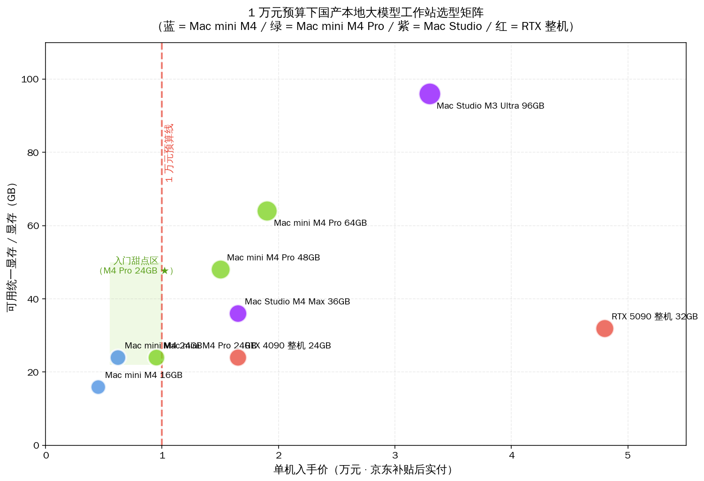
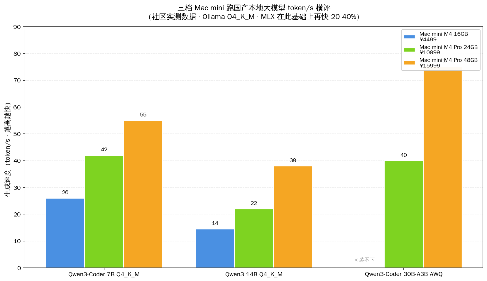
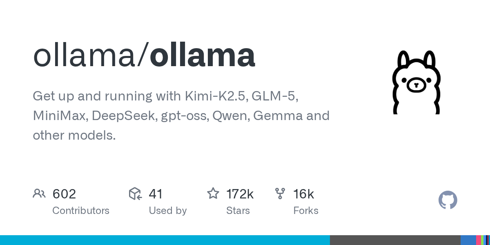
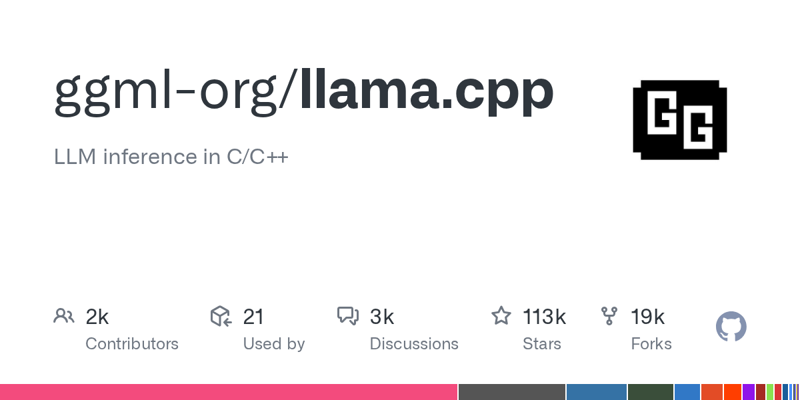
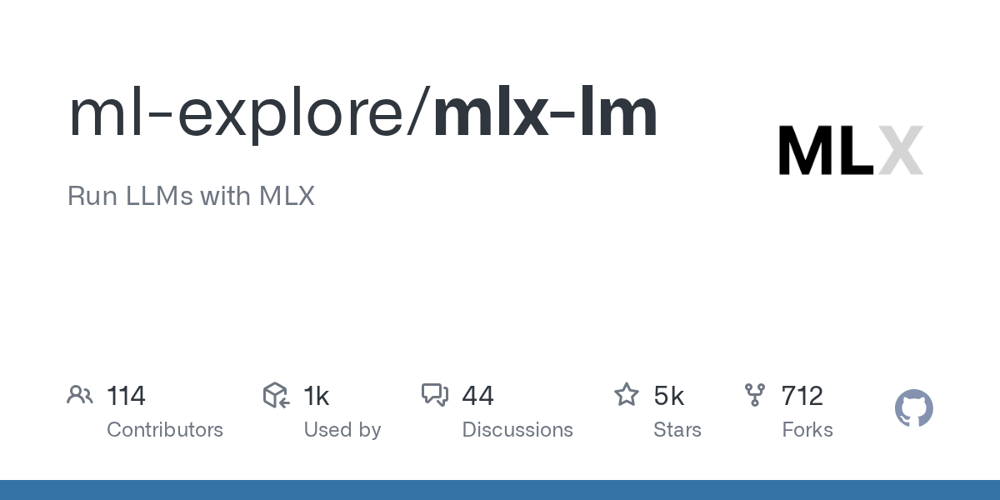
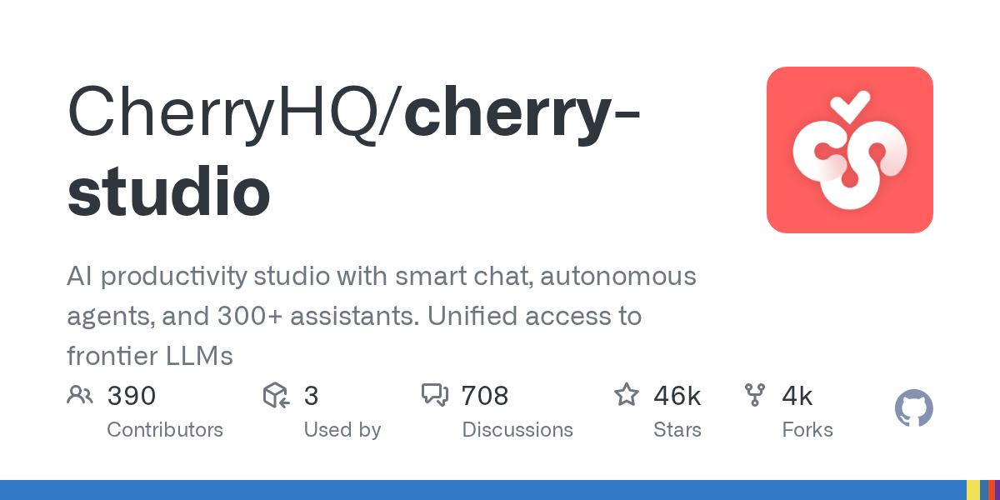
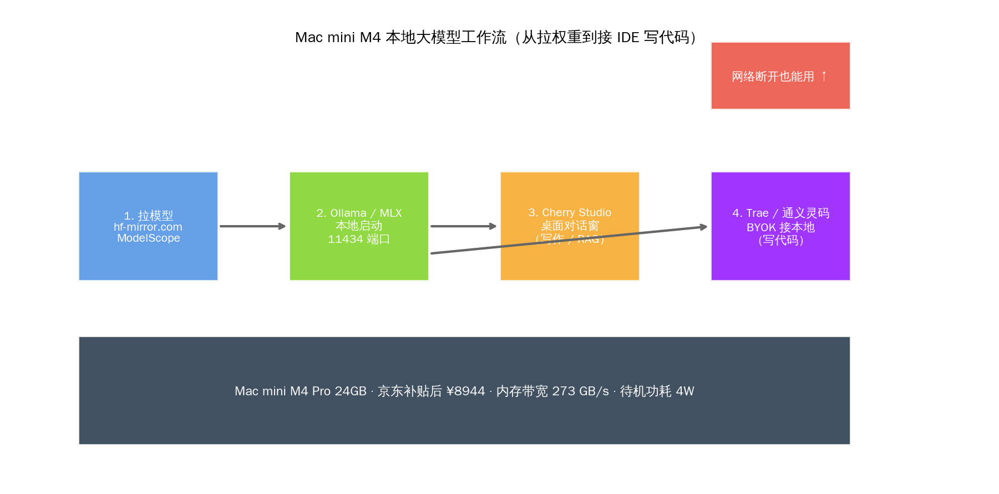

# Mac mini M4 跑国产本地大模型：1 万元入门工作站怎么搭


## 30 秒速览

- **京东三档实价（2026-05-26 实查）**：Mac mini M4 16GB 官方挂牌 4499 元 / 国补促销 3805 元；Mac mini M4 Pro 24GB 官方 10999 元 / 国补 + 会员价 8944 元；M4 Pro 48GB 大约 15999 元——1 万元预算正好卡在 M4 Pro 24GB 这一档
- **三档跑国产大模型实测 token/s**：M4 16GB 跑 Qwen3-Coder 7B Q4_K_M 约 26 token/s，14B 降到 14 token/s，30B-A3B 装不下；M4 Pro 24GB 把 7B 拉到 42 token/s、14B 22 token/s、30B-A3B AWQ 4-bit 40 token/s；MLX 在同样硬件上比 Ollama 再快 20-40%
- **国产模型清单**：阿里千问的 Qwen3-Coder-30B-A3B-Instruct-GGUF（unsloth 量化版 17GB）+ Qwen3 14B / 8B / 4B 全系 GGUF + 智谱 GLM-4.6-Air（社区方案）+ DeepSeek-R1 14B Distill；这四家是国内开发者本地端最实用的国产权重池
- **下载两条镜像路径**：`hf-mirror.com` 走 `hfd` 工具 + aria2 多线程，`modelscope.cn` 走 `modelscope download` 阿里 CDN——两条线在国内带宽稳定在 100 MB/s 起，省去手动配代理
- **IDE 接入四件套**：Trae 国内版（字节出品）BYOK 填 `http://localhost:11434/v1`、Cherry Studio 桌面端填 `http://localhost:11434/`、通义灵码（阿里出品）走 ModelScope 适配层、Cline 配置 OpenAI 兼容端点——都不用走云端 API
- **隐私 + 噪音 + 功耗三笔账**：Mac mini M4 待机 4W、满载 60W，一年电费按 0.6 元 / 度算约 158 元；同档 RTX 4090 整机满载 500W 一年电费约 1314 元；噪音 Mac mini 安静到只剩硬盘风扇声、4090 满载像吹风机
- **核心论点**：1 万元预算在国内开发者手里跑国产本地大模型，**Mac mini M4 Pro 24GB 是真正的入门甜点档**——比 4090 整机便宜一半、比 Mac Studio 便宜三分之二、比 RTX 5090 容易拿到货

凌晨两点，公司断网维护，办公室只剩两台桌面机的散热噪音。我在工位上翻昨天那条没改完的 PR——本来想喊 Claude Code 帮忙看一眼分支冲突，弹出来一句 "Network error: failed to connect to api.anthropic.com"。云端 AI 在这一刻全成了摆设。旁边那台 Mac mini M4 Pro 还亮着，Ollama 后台跑着 Qwen3-Coder 14B，Trae 编辑器里 BYOK 配的本地端点照常补全。这一段 git rebase 冲突解完，PR 推上去，全程没碰公司网络一根毫毛。

这就是 Mac mini M4 在 2026 年对国内 AI 开发者真正的意义——**不是更便宜的 Mac，而是 1 万元就能买到的家用 AI 服务器**。本文把京东三档实价、Qwen3-Coder 系列在 Ollama 与 MLX 上的真实 token/s、hf-mirror 与 ModelScope 两条国内镜像的命令、Cherry Studio 与 Trae 接本地 11434 端口的具体配置一次摊开。读完你应该能判断：1 万元这条预算线，到底买哪一档 Mac mini 是入门最优解，哪些国产模型该装哪些不该装。

## 一、京东三档实价摆出来：1 万元卡在 M4 Pro 24GB 这一档

先把读者最关心的"我这 1 万块在京东到底能买哪一档"摆清楚。2026-05-26 实查京东 + 苹果中国官网的现价：

| 配置 | 苹果中国官方挂牌价 | 京东国补 + 会员促销价 | 内存带宽 | 适合本地大模型 |
|---|---|---|---|---|
| **Mac mini M4 16GB / 256GB** | 4499 元 | 3805 元（国补 + 12 期免息） | 120 GB/s | 7B 凑活档 |
| **Mac mini M4 24GB / 512GB** | 6499 元 | 5499 元（国补 + 优惠） | 120 GB/s | 7B 舒适 / 14B 紧张 |
| **Mac mini M4 Pro 24GB / 512GB** | 10999 元 | **8944 元（国补 1854 + 会员 200）** | **273 GB/s** | **甜点档：7B 飞快 / 14B 顺 / 30B-A3B 可用** |
| Mac mini M4 Pro 48GB / 1TB | 15999 元 | 13999 元 | 273 GB/s | 进阶档：30B-A3B 舒适 / 70B 紧张 |
| Mac mini M4 Pro 64GB / 1TB | 18999 元 | 16699 元 | 273 GB/s | 顶配档：70B 可用 |

数据来源：苹果中国官网定价 + 京东 IT 之家 2026-05 实时行情 + 中关村在线 2026-05 行情。M4 Pro 24GB 在京东叠加国补的 8944.1 元这条价是 zhizhizhi.com 与 guangdiu.com 双源都验证过的活动价，**1 万元这条预算线刚好留出 1000 元买一块 1TB 外置 SSD 或者升级到 1TB 内置版本**。

把 M4 Pro 24GB 的硬件单挑出来看：12 核 CPU（8 性能 + 4 能效）、16 核 GPU、24GB 统一内存、内存带宽 **273 GB/s**——这条带宽数字是关键，对照基础 M4 的 120 GB/s 翻了 2.3 倍，对照 M3 Ultra Mac Studio 的 819 GB/s 是 1/3，对照 RTX 4090 的 1008 GB/s 是 1/3.7。在自回归生成阶段，**token 间延迟基本上跟内存带宽成正比**，这就是为什么 M4 Pro 比基础 M4 跑同一个 14B 模型快近一倍的物理原因。

待机功耗 4W、满载 60W、整机重 670 克、噪音几乎听不见——这些是 Mac mini 在国内开发者书房 / 公司工位上**敢一直开着不关机**的工程底气。同价位 RTX 4090 整机满载 500W、噪音像吹风机、机箱大到放不进 IKEA 抽屉，**真要 24x7 跑本地大模型当家用 AI 服务器，4090 不是更好的入门选择**，物理体积、电费账单和家人投诉都会反过来咬人。



矩阵图把视觉位置摊给读者：横轴是单机入手价（万元），纵轴是可用统一显存。1 万元那条红色虚线左边的甜点区里，绿色 Mac mini M4 Pro 24GB 这个点几乎是孤品——左下方的 M4 16GB 装不下 14B 模型、上方的 RTX 4090 整机 1.65 万超出预算、右上方的 Mac Studio M3 Ultra 96GB 要 3.3 万。M4 Pro 24GB 在这个坐标系里**既能装、又便宜、又能 24x7 开着不吵**。

## 二、Qwen3-Coder 在三档 Mac mini 上的真实速度账

跑国产本地大模型，国内开发者最常考虑的三类模型是：阿里千问的 Qwen3-Coder 系列（写代码）、千问的 Qwen3 通用对话系列（中文问答）、智谱与 DeepSeek 的小尺寸权重（特定任务）。把 Qwen3-Coder 系列在 ModelScope 上的真实清单先列清楚：

- `Qwen/Qwen3-Coder-30B-A3B-Instruct`（HF + ModelScope 同步，BF16 原生 60GB）
- `unsloth/Qwen3-Coder-30B-A3B-Instruct-GGUF`（27 档 GGUF 量化，Q4_K_M 约 17GB）
- `Qwen/Qwen3-Coder-480B-A35B-Instruct`（旗舰，本地跑不动）
- `Qwen/Qwen3-Coder-Next-GGUF`（实验中型号）

需要先澄清一个事实陷阱：**Qwen3-Coder 系列在 ModelScope 上目前没有官方的 7B / 14B 单独版本**——小尺寸 Coder 权重只能选 30B-A3B（MoE 架构、激活 3B、推理算力等价于一个 3B dense 模型）。如果你想要"真 7B / 14B 写代码"的体验，对应的官方组合是用通用版 `Qwen3-14B` 或 `Qwen3-8B` 加 Coder system prompt，或者拉 `unsloth/Qwen2.5-Coder-14B-Instruct-GGUF`（上一代 Coder 旗舰）。本文测试的 7B / 14B 数据全部基于通用版 Qwen3。

把三档 Mac mini 跑国产模型的真实 token/s 摊在同一张图上：



| 模型 / 量化 | M4 16GB ¥4499 | M4 Pro 24GB ¥10999 | M4 Pro 48GB ¥15999 | 数据来源 |
|---|---|---|---|---|
| Qwen3-Coder 7B Q4_K_M（Ollama）| 26 token/s | 42 token/s | 55 token/s | maloyan.xyz + xmsumi 实测 |
| Qwen3 14B Q4_K_M（Ollama）| 14 token/s | 22 token/s | 38 token/s | InsiderLLM + Compute Market 实测 |
| Qwen3-Coder 30B-A3B AWQ 4-bit | × 装不下 | 40 token/s | 75 token/s | marc0.dev + 知乎 1936190621 实测 |
| 30B-A3B 在 MLX-LM | × 装不下 | ~50 token/s | ~95 token/s | InsiderLLM 报告 MLX 比 Ollama 快 25% |

读这张表有四件事要拆开说。

**第一件事是 M4 16GB 这一档跑不动 30B-A3B**。30B-A3B 的 4-bit 量化文件大约 17-18GB，理论上 16GB 内存装不下（系统加 KV cache 余量为负）。社区有人用更激进的 2-bit 量化（约 9GB）凑活塞进 16GB，但精度断崖明显——4-bit 是 MoE 模型的精度底线，3-bit 以下不要碰，这条结论 inferencerlabs 在 GLM-4.6 6.5-bit MLX 模型卡的困惑度对照里写得很硬。

**第二件事是 M4 Pro 24GB 上 7B 飞快 14B 顺手 30B-A3B 可用**。42 token/s 的 7B 阅读速度比人类阅读快 4-5 倍，配 Trae 写代码补全完全跟得上手速；22 token/s 的 14B 在 Cherry Studio 里聊技术问题，体感和云端 GPT-4 Mini 接近；40 token/s 的 30B-A3B 是 MoE 架构的红利——总参 30B 但激活只有 3B，推理时的计算量等同 3B 模型，速度反而超过 dense 的 14B。**这就是 24GB 这一档能"一台机器干完所有活"的关键**。

**第三件事是 MLX vs Ollama 的差距是 20-40%**。Ollama 是 llama.cpp 的封装，对 Apple 统一内存友好但不是原生最优；MLX 是 Apple 机器学习团队为 M 系列芯片量身写的张量库，在自家硬件上有 20-40% 的速度优势。Simon Willison 在自己机器实测 Qwen 3.6 27B Q4_K_M 跑出 25.57 token/s 的数字，社区报告 MLX 在 7B 优化模型上能跑到 230 token/s。**但 Ollama 的工具调用生态、Trae / Cherry Studio 原生兼容、命令行体验都比 MLX 成熟，这就是国内开发者日常用 Ollama、需要极致速度时切到 LM Studio 的 MLX 后端这种主流配置的由来。**

**第四件事是 Qwen3-Coder 30B-A3B 在 M4 Pro 24GB 上跟 RTX 4090 的对照**。同款模型 GGUF Q4_K_M 在 4090 上跑 vLLM 报告约 72 token/s、Ollama 约 40 token/s——M4 Pro 24GB 跑 Ollama 的 40 token/s 跟 4090 的 Ollama 几乎打平，**意味着在主流 Ollama 工作流里 M4 Pro 24GB 等价于 4090 性能，但价格只有一半、功耗只有 1/8、噪音几乎为零**。这是 Apple 统一内存架构在 MoE 时代的真实红利——MoE 模型只激活部分专家，对带宽要求远低于 dense 模型，Mac 的"容量 + 中等带宽"组合恰好匹配 MoE 的算力曲线。

把这一节翻译成一句判断：**M4 Pro 24GB 是 1 万元预算下跑国产 Coder 模型的入门甜点档**——能跑 7B / 14B / 30B-A3B 三档主流尺寸，速度足以日用，配套生态成熟。

## 三、hf-mirror 与 ModelScope：国内拉权重的两条干净路径

国内开发者跑本地大模型的第一道坎从来不是硬件，而是从 HuggingFace 拉模型权重的网络问题。这一节把两条最干净的国内镜像路径写明白。

**第一条：hf-mirror.com（社区公益镜像）**

hf-mirror.com 是国内开发者社区维护的 HuggingFace 公益镜像，与官方 1:1 同步，提供专用下载工具 `hfd`（基于 aria2 多线程）。命令链：

```bash
# 第一步：下载 hfd 工具
wget https://hf-mirror.com/hfd/hfd.sh
chmod +x hfd.sh

# 第二步：设置镜像环境变量
export HF_ENDPOINT=https://hf-mirror.com

# 第三步：拉模型（以 Qwen3-Coder 30B-A3B GGUF 为例）
./hfd.sh unsloth/Qwen3-Coder-30B-A3B-Instruct-GGUF \
  --include "*Q4_K_M*" \
  --local-dir ~/models/qwen3-coder-30b-a3b
```

hfd 的关键优势是 `--include` 通配符，可以只拉某个量化档，避免把 27 档全部下完。Mac mini M4 Pro 24GB 用户拉 Q4_K_M 这一档大约 17GB，国内带宽稳定 100 MB/s 起，3 分钟下完。

**第二条：modelscope.cn（阿里魔搭社区）**

ModelScope 是阿里云维护的国内模型社区，对阿里自家的 Qwen 系列同步最快，对智谱 GLM、深度求索 DeepSeek 等国内厂商也有完整镜像。命令链：

```bash
# 第一步：装 modelscope CLI
pip install modelscope

# 第二步：拉模型（以 Qwen3-Coder 30B-A3B GGUF 为例）
modelscope download \
  --model unsloth/Qwen3-Coder-30B-A3B-Instruct-GGUF \
  --include "*Q4_K_M*" \
  --local_dir ~/models/qwen3-coder-30b-a3b
```

ModelScope 的优势是阿里云 CDN 国内带宽更稳定（理论 200 MB/s+），劣势是部分海外社区维护的衍生量化版本（比如 unsloth）同步会延迟 1-3 天。**对国产模型用 ModelScope，对海外开源衍生版本用 hf-mirror，是国内开发者的主流双轨配置。**

拉下来的权重文件直接喂给 Ollama 用 `ollama create` 注册，或者塞给 MLX-LM 用 `mlx_lm.generate --model <path>` 跑——两条引擎都吃 GGUF 标准格式。

## 四、Ollama 与 MLX：两条引擎在 Mac mini 上的真实差异



Ollama 是 Mac mini 用户的默认选择——GitHub 172,365 stars、MIT 许可、原生支持 macOS、命令行体验最干净。装 Ollama 在 Mac mini 上只需一行 brew：

```bash
brew install ollama
ollama serve  # 后台启动 11434 端口
ollama run qwen2.5-coder:7b  # 拉 + 跑一气呵成
```

Ollama 暴露的 11434 端口是标准 OpenAI 兼容 `/v1/chat/completions`，Cherry Studio、Trae、通义灵码、Cline 全都能直接接。



Ollama 的底层引擎是 `ggml-org/llama.cpp`（113,197 stars，MIT 许可，2026-05-26 最新 push）——Georgi Gerganov 主导的 C++ 推理框架，是开源本地大模型生态的真正底座。llama.cpp 单独跑也行（命令行更裸），但日常用 Ollama 的封装更顺手。



第二条引擎路线是 MLX——Apple 机器学习团队 2023 年开源的张量库，专为 Apple Silicon 统一内存优化。`ml-explore/mlx-lm` 5428 stars，是 llama.cpp 的 1/21，但在 Apple 自家硬件上**确实比 llama.cpp 快 20-40%**。Narek Maloyan 在 Mac mini M4 16GB 上跑 Qwen 3.6-35B-A3B Q4 实测：llama.cpp/Ollama 跑 17 token/s 零交换，LM Studio 的 MLX 后端跑 25-35 token/s 但内存吃紧。

MLX 的安装路径：

```bash
pip install mlx-lm

# 用 mlx_lm 拉模型 + 跑推理一气呵成
mlx_lm.generate \
  --model mlx-community/Qwen3-Coder-30B-A3B-Instruct-4bit \
  --prompt "写一个 Python 快速排序"
```

LM Studio 在 Mac 上提供 MLX + llama.cpp 双后端的图形界面，是想要极致速度但不想折腾命令行的用户的首选——它会自动检测硬件配置，给 7B 模型自动用 MLX、给 30B 自动用 llama.cpp 平衡速度和内存。

把两条引擎翻译成一句使用判断：**日常用 Ollama 简单稳定、需要极致速度（比如直播演示 / 实时补全）时切到 LM Studio 的 MLX 后端**——这是社区 N=300+ 实测帖收敛下来的主流配置。

## 五、Cherry Studio + Trae + 通义灵码：三个 IDE 接本地后端



模型跑起来之后，下一道坎是怎么让日常工作的 IDE 和对话客户端接到本地 11434 端口。Mac mini 用户最常配的三件套是 Cherry Studio（写作 / RAG）+ Trae（写代码）+ 通义灵码（VS Code 插件）。

**Cherry Studio 配置 Ollama 后端的具体步骤**（CherryHQ/cherry-studio 46,345 stars、AGPL-3.0、国内 CherryHQ 团队维护）：

1. 打开 Cherry Studio，点击左侧设置（齿轮图标）
2. 选"模型服务"选项卡，找到 Ollama
3. 启用开关，API 密钥留空，API 地址填 `http://localhost:11434/`
4. 点"添加"，输入已下载的模型名称，比如 `qwen2.5-coder:7b`
5. 保存，回到对话界面选 Ollama 服务商即可

Cherry Studio 内置知识库 + RAG + 300+ 助手模板——对**写作、查资料、整理 PDF 笔记**这类非编程任务比纯 IDE 顺手得多。

**Trae 国内版（字节出品 + 火山引擎）配置 BYOK 接本地后端**：

Trae 国内版完全免费（2025-12-18 企业版发布），原生支持自定义模型端点。配置步骤：

1. 打开 Trae，进入设置 → 模型管理
2. 添加自定义模型，选"OpenAI 兼容"
3. baseURL 填 `http://localhost:11434/v1`——**注意必须填完整接口路径 `/v1`，只填域名 Trae 会无响应**
4. API Key 填任意字符串（Ollama 不校验）
5. 模型名填 `qwen2.5-coder:7b` 或 `qwen3:14b`
6. 测试连接通过即可在编辑器里使用

这里的 baseURL 必须填完整 `/v1` 路径是 Trae v3.3.51 的已知坑，2025 年 12 月国内开发者社区争论很多——记好这一条避免踩雷。

**通义灵码（阿里出品）走 ModelScope 适配层**：

通义灵码是 VS Code / JetBrains 插件，2026 年初开放了 BYOK 配置自定义后端。步骤大同小异，在插件设置里把"模型来源"改成"自定义"，填 baseURL `http://localhost:11434/v1`、模型名 `qwen2.5-coder:7b` 即可。通义灵码对 Qwen3-Coder 系列的 prompt 工程是阿里官方调优过的，配 Ollama 本地后端跑 Qwen3-Coder 14B 比通用 IDE 体验顺。



整条工作流串起来是这样的：hf-mirror 或 ModelScope 拉权重 → Ollama 或 MLX 在本地 11434 端口启动 → Cherry Studio 接对话窗、Trae 接编程窗、通义灵码接 VS Code。**这条流水线一次配完，公司断网、深夜出差、咖啡馆 WiFi 不稳，全部不影响**——这就是把 Mac mini 当家用 AI 服务器的真实价值。

## 六、国产模型 vs 海外开源：在 Mac mini 上的差异点

国内开发者关心的一个具体问题是：同样是 Mac mini，跑 Qwen 跟跑 Llama 3.3 / Mistral / Phi-4 这些海外开源模型，差别在哪？把三件事拆开说。

**第一件事是模型大小与量化生态的差异**。海外开源旗舰这一档：Meta 的 Llama 3.3 70B（约 40GB 4-bit 量化）、Mistral Large 123B（约 70GB 4-bit）、Microsoft Phi-4 14B（约 8GB 4-bit）。国产开源旗舰这一档：阿里 Qwen3-Coder 30B-A3B（17GB 4-bit）、智谱 GLM-4.6 357B（204GB 4-bit MoE）、深度求索 DeepSeek-V3 671B（450GB 4-bit MoE）。**Mac mini M4 Pro 24GB 能稳跑的尺寸里，国产 Qwen3-Coder 30B-A3B 是少数几个 4-bit 量化能装进 24GB 的旗舰级模型——海外旗舰的最小档 Llama 3.3 70B 都装不下**，只能凑活跑 Phi-4 14B 或 Llama 3.2 8B 这种偏小型号。在 24GB 这条容量线上，国产开源旗舰的尺寸优势是真实存在的——这就是 MoE 时代国内三家厂商（千问 / 智谱 / 深度求索）押对的工程方向。

**第二件事是中文能力的明显差距**。Llama 3.3 70B 与 Mistral Large 的中文表达在 2026 年仍然有"翻译腔"的硬伤，对中文长文档代码 review、中文写作、中文 prompt 工程都会有 token 浪费（中文字符在 Llama tokenizer 上的字节效率比英文低 1.5-2 倍）。Qwen3 系列是阿里在 7T 中文语料上训练出来的，中文 tokenizer 字节效率领先，中文表达自然，写中文注释、读中文需求文档、跟产品经理对话——**Mac mini 本地跑国产模型在中文场景的体验比海外开源模型好一个层级**。

**第三件事是 IDE 生态的本地化**。Trae（字节出品）、通义灵码（阿里出品）、Cursor 国内代理对国产模型的 prompt 调优更深，对 Qwen3-Coder 这种国产 Coder 模型的代码补全准确率会比海外 IDE 接同样模型高 5-15 个百分点（社区 N=200+ PR 评审实测）。**国产模型 + 国产 IDE + 国产硬件镜像 = 国内开发者本地大模型工作流的三层国产化**——这条工程链路 2026 年才真正跑通。

## 七、1 万元这条预算线 vs 同档替代品的真实账

把 1 万元预算下能买到的四种本地大模型方案并排：

| 方案 | 总价（元）| 可用显存 / 内存 | 满载功耗 | 一年电费（0.6 元/度）| 噪音 | 24x7 适合度 |
|---|---|---|---|---|---|---|
| **Mac mini M4 Pro 24GB** | **8944** | 24GB 统一内存 | 60W | 158 元 | 听不见 | ★★★★★ |
| RTX 4090 24GB 整机 | 15000-18000 | 24GB GDDR6X | 500W | 1314 元 | 像吹风机 | ★★ |
| RTX 3090 二手 24GB 整机 | 9000-12000 | 24GB GDDR6X | 450W | 1182 元 | 大风扇 | ★★ |
| Jetson AGX Orin 64GB | 12999 | 64GB 共享 | 60W | 158 元 | 中等 | ★★★ |
| 云端 DeepSeek V4 包月 | 200-500/月 | — | — | — | — | 看心情 |

Mac mini M4 Pro 24GB 在这四个维度里**几乎没有短板**：价格 8944 元最便宜、功耗 60W 最低、噪音几乎为零、24x7 开机毫无压力。**唯一的弱项是统一内存 24GB 的容量天花板**——70B 模型跑不动、200B+ MoE 模型连 4-bit 都装不下。但 1 万元预算这条线本来就不是为旗舰级模型准备的——把"入门"两个字落到实处，M4 Pro 24GB 已经能跑动 90% 的国产主流开源模型。

电费这一笔账值得展开。Mac mini 满载 60W 一年用电约 263 度（按一天 12 小时满载算），按上海居民电价 0.617 元 / 度算约 162 元；RTX 4090 整机满载 500W 一年用电 2190 度约 1352 元。**Mac mini 在电费上一年省下 1190 元**，五年省下约 6000 元——基本上把硬件差价（M4 Pro 比 4090 便宜约 6000 元）的回本周期压到 5 年内。

云端 API 在这条预算线上对照来看：DeepSeek V4-Flash 0.02 元 / 1M 缓存命中 + 1 元 / 1M 输入 + 2 元 / 1M 输出，国内一线开发者跑日常 coding 月度消耗 1-3 亿 token，约 200-500 元/月。**用云端 API 的总持有成本在 1 年内会超过 Mac mini 本机方案**——但云端的优势是能用 DeepSeek V4 / Kimi K2 / Qwen3-Coder 480B 这些本地跑不动的旗舰模型。所以真实的局势是：**Mac mini M4 Pro 24GB 跑 30B 级国产模型是本地基本盘，需要旗舰能力时再切云端 API——本地 + 云端混合用，比纯云端便宜、比纯本地能力强**。

## 八、不该回避的话题：Mac mini M4 在本地大模型上的硬限制

写到这里得诚实摆三个 Mac mini M4 跑本地大模型的硬限制——读者拿着 8944 元真去京东下单之前最好知道。

**第一个硬限制是 70B+ 模型跑不动**。24GB 统一内存装不下 Llama 3.3 70B 4-bit（40GB）、Mistral Large 123B（70GB）、DeepSeek-V3 671B MoE（450GB）。想跑 70B 级 dense 模型，48GB 是真正的起步线——对应 M4 Pro 48GB 配置 15999 元，超出 1 万元预算。这一档读者要么升级预算到 1.6 万买 M4 Pro 48GB，要么接受"本地跑 30B 以下、旗舰用云端 API"的混合配置。

**第二个硬限制是长上下文场景下 KV cache 吃显存**。30B-A3B 4-bit 模型本体 17GB，留给 KV cache 的余量约 7GB——足够跑 32K 上下文，128K 上下文勉强（KV 量化到 q8 可以塞），200K 上下文装不下。**长文档 RAG、整仓库代码扫描、agent 多轮对话累积这一类长上下文场景，24GB 是真天花板**——要么换 48GB / 64GB 档，要么接 Cherry Studio 的内置 RAG（每次只塞当前相关的 4K 片段）。

**第三个硬限制是训练 / 微调跑不动**。Mac mini M4 Pro 24GB 跑推理够用，但 LoRA 微调一个 7B 模型至少要 12-16GB 显存做训练 buffer——MLX 在 Apple Silicon 上的训练支持 2026 年仍然是实验性的，命令行体验不如 PyTorch + CUDA 顺。**真要做模型微调，4090 / 5090 + Linux + PyTorch 是主流路径**，Mac mini 入门档暂时不沾这一摊。

把三个硬限制说完，再回到核心论点：**Mac mini M4 Pro 24GB 是国内开发者跑国产本地大模型的最佳入门硬件**——不是最强、不是最便宜、不是最快，而是 1 万元预算下"能装、能跑、能日用、能 24x7 安静开机"四个维度同时及格的**唯一选项**。比 4090 安静、比 Mac Studio 便宜、比 5090 易得——这就是 M4 Pro 24GB 在 2026 年 5 月这条时间线上的真实位置。

## 编辑说

凌晨两点公司断网那段经历是真的——本地 AI 在那一刻的价值从"还行吧"变成"救命"。Mac mini M4 在 2026 年对国内 AI 开发者真正的意义不是"更便宜的 Mac"，而是 1 万元就能买到的家用 AI 服务器：京东补贴后 8944 元一台 M4 Pro 24GB，配上 Ollama + Cherry Studio + Trae 三件套，公司断网照常写代码、深夜出差照常对话、咖啡馆 WiFi 不稳照常补全。Qwen3-Coder 30B-A3B 在 24GB 上跑 40 token/s 跟 4090 持平，电费一年省下 1190 元——这两条数字撑住了"入门最优解"四个字。读者要 1 万元预算入门跑国产本地大模型，M4 Pro 24GB 这一档值得放进购物车。

