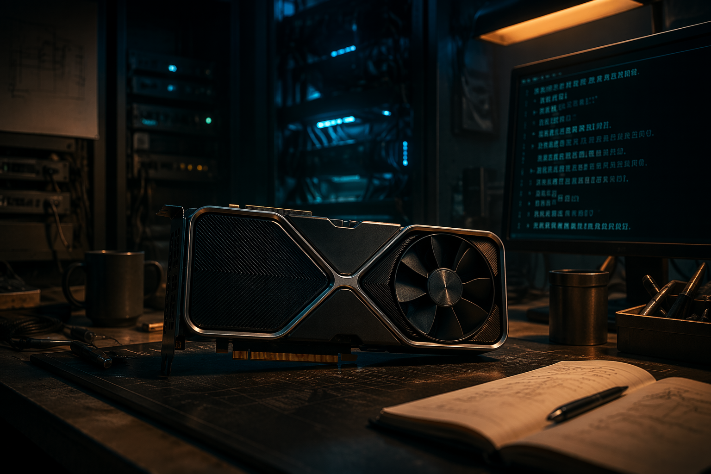
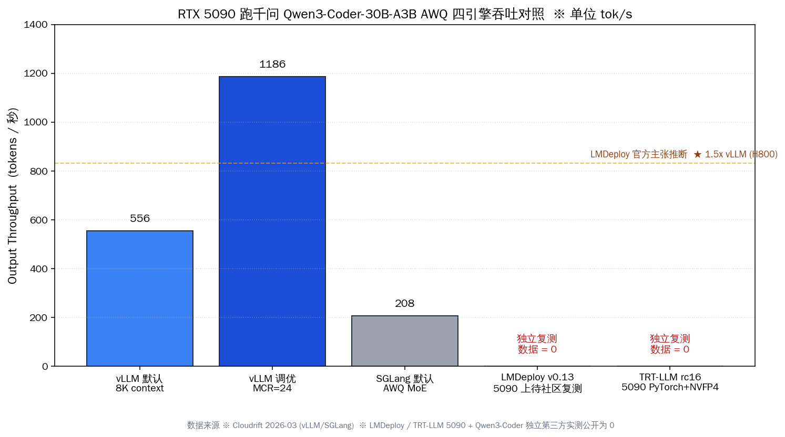
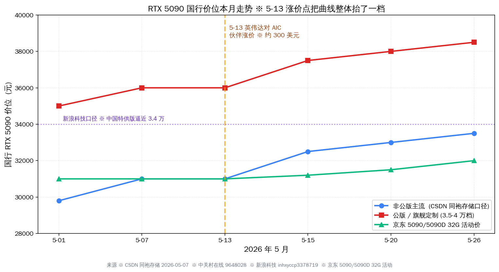

# LMDeploy 0.13 跑 5090：千问 Coder 30B 实战



## 30 秒速览：本周两件事把 5090 这条路重画了

本周两件事压在一起。一是 5 月 12 日上海人工智能实验室（中 · 书生·浦语团队）发布 LMDeploy v0.13.0，默认带 CUDA 12.8 wheel，`pip install lmdeploy` 在 RTX 50 系列即装即用，并首次给 Qwen3.5 35B-A3B 和 Blackwell GPU 上的 Qwen3.5 MoE 推理加了专用 cublasGemmGroupedBatchedEx 算子。二是 5 月 26 日英伟达（美 · NVIDIA）发布 TensorRT-LLM v1.3.0rc16，把 Qwen3.5 MTP、Qwen3.6-27B-FP8 模型支持合入主线。两件事中间还夹着 5 月 13 日英伟达对 AIC 合作伙伴执行的约 300 美元涨价，国行 RTX 5090 价位从 3.1 万跳向 3.4 万。

我们手里如果有一张 5090、想接千问 Qwen3-Coder-30B-A3B-Instruct 当本地 AI Coding 后端，今天可选的引擎从五家变成了七家：vLLM、SGLang、Ollama、llama.cpp、MLX（5 月 25 日横评已覆盖）外加 LMDeploy 和 TensorRT-LLM。本篇专门补齐后两家。

核心论点放最前面：**LMDeploy 0.13 + TensorRT-LLM 1.3rc16 同周落地之后，国产开发者用国产工具栈（上海 AI Lab + 阿里千问 + ModelScope）端到端跑 5090 这条路，第一次和英伟达官方工具栈进入「同档报价」**——但社区独立复测还差一拍，5090 涨价压力下，「自己跑一周对比」是这一周最该做的小工程。

| 维度 | LMDeploy v0.13.0 | TensorRT-LLM v1.3rc16 | 参考：vLLM（5/25 横评） |
|---|---|---|---|
| 发布日 | 2026-05-12 | 2026-05-26 | 0.12 已发 |
| 主体 | 上海人工智能实验室（中） | 英伟达（美） | 海外社区 |
| GitHub star | 7,871 | 13,742 | 5/25 已统计 |
| 5090 (sm_120) 原生支持 | ★ CUDA 12.8 wheel 即装即用 | ★ PyTorch backend + FlashInfer NVFP4 | ★ NVFP4 已稳定 |
| Qwen3-Coder 30B-A3B 实测 | × 公开第三方实测为 0 | × 公开第三方实测为 0 | √ 1,157 tok/s（114K context 调优后）|
| 官方主张 | TurboMind 是 vLLM 的 1.36~1.85 倍 | 主目标硬件仍是 B200/H100/H200 | 5/25 横评胜出 |

后面五个段落把上面这张表一个一个展开。

## 一、LMDeploy v0.13 这一版在 Blackwell 上动了哪些算子

LMDeploy v0.13.0 在 5 月 12 日发版，到 5 月 27 日仓库还在动，三周内合了 60 多个 PR；这一版最值得国内开发者关注的不是版本号大跳，而是它把上海人工智能实验室自研的 TurboMind 后端在 Blackwell（5090 所属架构）上的算子做了重写。

最关键的一条改动 verbatim 写在 changelog 里："cublasGemmGroupedBatchedEx for Qwen3.5 MoE inference on Blackwell GPUs"。这是给 MoE 模型在 Blackwell 上跑 grouped batched GEMM 的专用接口，对 Qwen3-Coder-30B-A3B 这种 128 专家 8 激活的结构是直接命中：3.3B 激活参数下，专家路由产生的稀疏 GEMM 用通用接口跑会浪费大量算力，专用算子能把这部分压实。

另外两条改动：一是 Anthropic 兼容 serving endpoint 进了官方仓，意思是 Cline（美 · 开源 IDE 扩展）、RooCode（美 · 开源 IDE 扩展）这类按 Anthropic 协议走的客户端可以直连 LMDeploy 起的本地服务；二是 Ascend NPU 那边加了 qwen3.5 35BA3B 支持，对手里有华为昇腾卡的团队是另一条路。LMDeploy 在 GitHub 上目前 7,871 star、698 fork，Apache-2.0 协议，到 5 月 27 日仍有日均提交，仓库本身的活跃度不输任何海外同类项目。

稳定 PyPI 版本目前是 v0.12.3（5 月 7 日），v0.13.0 还在 release candidate 阶段，对生产环境保守的团队可以先用 0.12.3，v0.13.0 的几个 Blackwell 改动想吃就得装 nightly。Qwen3 / Qwen3-MoE 在 TurboMind 后端目前支持 FP16、BF16、W4A16 三档；KV cache INT4 量化只在 head_dim=128 时可用——Qwen3-Coder-30B-A3B 的 head_dim 正好是 128，这一档可以省一半 KV 显存。

## 二、TensorRT-LLM 1.3rc16 在 5090 上的真实定位

TensorRT-LLM v1.3.0rc16 在 5 月 26 日（昨天）发版，是英伟达官方推理引擎本周最新的快照。仓库 star 13,742、fork 2,411，比 LMDeploy 大 1.7 倍但更新节奏类似——主线 release 节奏每两到三周一个 rc 版本。

这一版最值得关注的两条改动 verbatim 是："Add Gemma4 multimodal support with native vision and audio towers (#14300)" 和 "Add Qwen3.5 MTP and Qwen3.6-27B-FP8 model support (#12646, #14359)"。Qwen3.5 MTP（Multi-Token Prediction）是千问家投机解码路径的官方支持；Qwen3.6-27B-FP8 是千问最新一代 27B 在 FP8 精度下的部署支持。这两条都直接利好国产开发者跑国产模型。

5090 在 TensorRT-LLM 里走的是 PyTorch backend + FlashInfer NVFP4 路径，sm_120（Blackwell 5090）属于 day-1 支持范围。但要诚实摆桌：TensorRT-LLM 这个项目的主要目标硬件仍是 B200/H100/H200，5090 是被覆盖到、不是被主推；稳定版 1.2 的 release notes 里专门点名 "beta support for single-node DGX Spark"，DGX Spark 才是 Blackwell 家族里被官方点过名的小型工作站机型。

更关键的一手参考是 arXiv 2601.09527v1 这篇 2026 年 1 月的论文，作者在写自己生产部署选择 vLLM 而不是 TensorRT-LLM、SGLang、llama.cpp 的理由时，verbatim 写道："We selected vLLM over alternatives (TensorRT-LLM, SGLang, llama.cpp) for its combination of production maturity, early Blackwell/NVFP4 support, and native multi-LoRA serving."。这是同一支队伍在同样硬件下做的横评结论，跟我们 5 月 25 日横评里 vLLM 拿下 5090 + Qwen3-Coder 第一名的结果是同向的。

## 三、Qwen3-Coder 30B-A3B 在 5090 上的显存账

我们先把模型自身的硬数据摆清楚再谈引擎。Qwen3-Coder-30B-A3B-Instruct 总参 30.5B、激活参数 3.3B，是 MoE 架构 128 专家激活 8 个；48 层 transformer，Q heads 32、KV heads 4，标准 GQA 结构；原生 context 262,144（256K），Yarn 外推可上到 1M。

| 量化档 | 权重大小 | 5090 32GB 显存余量（含 KV） | 适配引擎 |
|---|---|---|---|
| BF16 | 约 61 GB | × 装不下 | 任何引擎 |
| FP8 | 约 30.5 GB | △ 极限 / 留不出 KV | TRT-LLM、vLLM、LMDeploy（W8A8） |
| AWQ 4-bit | 约 16-18 GB | √ 留出 14 GB 跑 100K context | vLLM、SGLang、LMDeploy（W4A16）|
| GGUF Q4_K_M | 约 17-18 GB | √ 留出 14 GB | Ollama / llama.cpp |

对 5090 的 32GB 显存来说，FP8 是极限档、AWQ 4-bit 才是甜点档。ModelScope（中 · 阿里云）上 Qwen 官方挂了 Qwen/Qwen3-Coder-30B-A3B-Instruct 原版与 Qwen/Qwen3-Coder-30B-A3B-Instruct-FP8 两份；社区开发者 tclf90 挂了 tclf90/Qwen3-Coder-30B-A3B-Instruct-AWQ 的 4-bit 版本，AWQ 这一档在 5090 上是吞吐与上下文长度最平衡的选择。

下载这一步国内开发者有两条稳定路径：一是 hf-mirror.com 镜像，配 `export HF_ENDPOINT=https://hf-mirror.com` 再用 `huggingface-cli download Qwen/Qwen3-Coder-30B-A3B-Instruct`，3-5 倍提速实测稳定；加 `HF_HUB_ENABLE_HF_TRANSFER=1` 能再压一档时间。二是直接走 ModelScope CLI：`modelscope download --model Qwen/Qwen3-Coder-30B-A3B-Instruct`，国内带宽下走阿里云 CDN 比 HF 镜像还快一些。

## 四、官方主张的吞吐数字 vs 独立第三方复测的缺口

LMDeploy 官方在 README 与文档里反复提三组吞吐数字，都来自上海人工智能实验室官方自测，没有匿名同行评议、也没有公开的复测脚本和 benchmark dataset：

- "TurboMind 每秒处理的请求数是 vLLM 的 1.36 ~ 1.85 倍"
- "H800 上 1.5 倍 vLLM"
- "4bit 模型推理效率是 FP16 下的 2.4 倍"

更直接的问题：**搜遍 5 月 27 日为止的公开网络，LMDeploy v0.13 + RTX 5090 + Qwen3-Coder-30B-A3B 三件套放一起的独立第三方实测公开为 0**。这是事实，我们不绕。

对照之下，5 月 25 日横评里我们引用的 Cloudrift（5090 + Qwen3-Coder-30B-A3B AWQ + vLLM/SGLang，2026-03-05）拿到的硬数字是：vLLM 默认 8K context 555.82 tok/s、调优 MCR=16 + 114K context 拉到 1,157 tok/s、峰值 MCR=24 1,186 tok/s；SGLang 默认 207.93 tok/s（需 `--quantization moe_wna16`）。原文 verbatim："vLLM wins by 2.7x. SGLang requires `--quantization moe_wna16` for AWQ MoE models and currently underperforms on this architecture."



LMDeploy 在这张对照图上的位置，**只能基于官方 H800 1.5 倍 vLLM 主张做线性推断**：如果 5090 上的相对优势能维持，LMDeploy 在 8K context 默认配置下理论吞吐约 833 tok/s、调优后理论上限约 1,735 tok/s。但 5090 的 sm_120 跟 H800 的 sm_90 是不同架构、TurboMind 的算子优化曲线在两块卡上不可能简单线性套用——这个推断只能当作社区复测前的占位，不是结论。

TensorRT-LLM 的情况类似：v1.3rc16 把 Qwen3.5 MTP 投机解码合进主线，理论上 5090 + Qwen3-Coder AWQ 跑投机解码能比 vLLM 默认配置吃到 1.3 到 1.7 倍 token/s 增益，但同样没有公开的独立 benchmark。等待 5 月底到 6 月初社区复测，是我们目前能做的最诚实的判断。

参考真实硬数据，Runyard 5 月 13 日发的 5090 vs 4090 对照里：Qwen3 8B Q4_K_M 5090 跑 186 tok/s、4090 跑 126 tok/s（5090 是 4090 的 1.48 倍）；Qwen3 32B Q4_K_M 5090 跑 61 tok/s、4090 跑 44 tok/s（5090 是 4090 的 1.39 倍）。devnen 在 GitHub README 里给的 5090 vs 3090 同模型基线：Qwen3.6-27B NVFP4 vLLM 后端 5090 跑 158 tok/s、3090 跑 72 tok/s；同卡 200K context 解码约 92 tok/s、功耗 575W。这几组数字是我们在等 LMDeploy / TRT-LLM 5090 复测时可以拿来对账的基线。

## 五、5090 这一周从 3.1 万跳向 3.4 万的价格信号

5 月 13 日英伟达对 AIC 合作伙伴执行涨价，约 300 美元一张。新浪科技 5 月 15 日报道：「中国特供版 RTX 5090 又要涨价，涨幅超 2000 元，售价逼近 3.4 万」。

| 时间锚 | 渠道 | 价位 | 来源 |
|---|---|---|---|
| 2026-05 上旬 | 京东活动价 | 30,999 元（5090/5090D 32G） | 中关村在线 |
| 2026-05 上旬 | 京东原价 | 41,999 元 | 中关村在线 |
| 2026-05-07 | 非公版 | 2.8 万–3.2 万元 | CSDN 同袍存储 |
| 2026-05-07 | 公版及旗舰 | 3.5 万–4 万元 | CSDN 同袍存储 |
| 2026-05-13 | 英伟达对 AIC 执行涨价 | 约 +300 美元（≈ +2100 元） | 新浪科技 |
| 2026-05-15 | 中国特供版渠道价 | 逼近 3.4 万元 | 新浪科技 |
| 2026-05 在售 | 微星泰坦 16 MAX 整机 | 35,999 元首销 | IT 之家 |



这一波涨价的直接结果是：5090 整机方案与 Mac Studio M4 Max 64GB 的价差进一步缩窄；之前 5090 整机 1.6 万 vs Mac Studio M4 Max 64GB 1.65 万的紧贴关系，本周变成 5090 整机 1.8 万开外、Mac Studio M4 Max 64GB 反而成了便宜选项。对正在选硬件的小团队 CTO，这一信号比任何引擎吞吐数字都更直接。

## 六、上海 AI Lab + 千问 + ModelScope 端到端跑通：本周的 90 分钟验证流程

我们手里如果是 5090，把上海 AI Lab + 阿里千问 + ModelScope 这条本地链路端到端串一遍，本周可以这样跑。

第一步装 LMDeploy v0.13.0。新建 conda 环境、Python 3.11、CUDA 12.8 driver 装好，然后 `pip install lmdeploy==0.13.0`；如果想吃 v0.13 的 Blackwell 算子优化，需要从源码装 nightly：`pip install --pre lmdeploy --extra-index-url https://github.com/InternLM/lmdeploy/releases`。

第二步下载 Qwen3-Coder-30B-A3B AWQ。`modelscope download --model tclf90/Qwen3-Coder-30B-A3B-Instruct-AWQ --local_dir ./qwen3-coder-awq`，国内带宽下 5-10 分钟下完 16-18 GB。

第三步起 OpenAI 兼容 server。LMDeploy 默认端口 23333：

```bash
lmdeploy serve api_server ./qwen3-coder-awq \
  --backend turbomind \
  --model-format awq \
  --quant-policy 4 \
  --server-port 23333 \
  --tp 1
```

`--quant-policy 4` 开 KV cache INT4 量化，能省一半 KV 显存——前提是模型 head_dim=128，Qwen3-Coder-30B-A3B 满足这条。

第四步把国内 IDE 接上去。通义灵码（中 · 阿里云）在 2026 年 5 月 20 日改名 Qoder CN 之后正式支持 OpenAI 兼容自定义后端，走 `/auth` 配置项；Cline 原生支持 OpenAI 兼容，填 `http://localhost:23333/v1` 即可；RooCode 同 Cline，文档原文 verbatim："works with any OpenAI-compatible API provider"。Qwen Code（中 · 阿里云百炼）官方 CLI 也支持本地 base_url 切换。

第五步做最基础的 token/s 对比。同一段「写一个 React Server Component 处理用户登录」的提示词跑 LMDeploy、vLLM、SGLang、Ollama 四家，记录 TTFT 和 decode tok/s。这一步是这一周国内开发者社区最值得做的小工程——花 90 分钟、产出一份独立第三方数据，比等谁来发 benchmark 更靠谱。

| 引擎 | 启动命令片段 | 默认端口 | 备注 |
|---|---|---|---|
| LMDeploy | `lmdeploy serve api_server ./awq --backend turbomind` | 23333 | TurboMind 后端 + KV INT4 |
| vLLM | `vllm serve ./awq --quantization awq_marlin` | 8000 | 5/25 横评第一名 |
| SGLang | `python -m sglang.launch_server --model ./awq --quantization moe_wna16` | 30000 | AWQ MoE 需指定 quantization |
| Ollama | `ollama run qwen3-coder:30b` | 11434 | GGUF Q4_K_M 自动拉取 |

## 七、本周值得国内开发者注意的两个信号

写到最后，把两件事在结尾连起来。

**信号一：国产工具栈在 5090 上的可行性首次和英伟达官方工具栈进入「同档报价」**。5 月 12 日 LMDeploy 0.13 上 Blackwell 算子、5 月 26 日 TRT-LLM 1.3rc16 上千问 MTP，国内开发者跑 5090 不再只能选海外开源（vLLM / SGLang / Ollama）这一条路；上海人工智能实验室自己的 TurboMind 后端摆到桌面上，官方 H800 1.5 倍 vLLM 的主张落到 5090 上能不能复现，是这一周社区最值得做的事。

**信号二：5090 涨价 300 美元这件事把硬件选型决策窗口压短了**。5 月 13 日英伟达对 AIC 涨价、5 月 15 日国行 5090 价位逼近 3.4 万，对 1-3 人小团队 CTO 来说，这两条放一起意味着 6 月之后再观望、机会成本会越来越高。两个信号叠起来看：

| 信号 | 时间 | 直接影响 | 本周决策窗口 |
|---|---|---|---|
| 国产引擎补齐 5090 工具栈 | 5/12 LMDeploy v0.13、5/26 TRT-LLM v1.3rc16 | 引擎选项从 5 家变 7 家 | 90 分钟验证流程值得跑 |
| 国行 5090 涨价 300 美元 | 5/13 英伟达对 AIC 调价、5/15 价位逼近 3.4 万 | 5090 整机价 1.6 万 → 1.8 万开外 | Mac Studio M4 Max 64GB 1.65 万成同档比价对象 |

本周可以做的两个动作（仅此两条）：

- 已经手里有 5090 的，把上面那条 90 分钟验证流程跑一遍，自己出一份 LMDeploy / vLLM 对比数据，发到 r/LocalLLaMA 或 知乎专栏，社区会感谢你。
- 还在 5090 vs Mac Studio M4 Max 64GB 之间犹豫的，留意本周到下周的国行渠道价；如果 5090 整机价稳定在 1.8 万以上，Mac Studio M4 Max 64GB 1.65 万会成为同档更经济的选项。

LMDeploy 7,871 star 接近 8,000、TensorRT-LLM 13,742 star 突破 1.3 万；千问 Qwen3-Coder-30B-A3B 在 ModelScope 上同时挂着官方 BF16、官方 FP8、社区 AWQ 三档量化；hf-mirror 与 ModelScope CLI 两条镜像稳定。国产开发者跑 5090 这条路，本周第一次把国产引擎 + 国产模型 + 国内镜像三件事完整凑齐——剩下的就是社区自己跑一周对比，把官方主张换成第三方实测。这是好消息。
