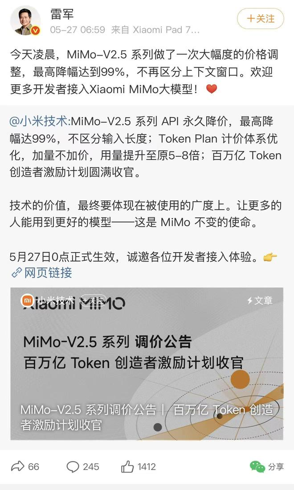
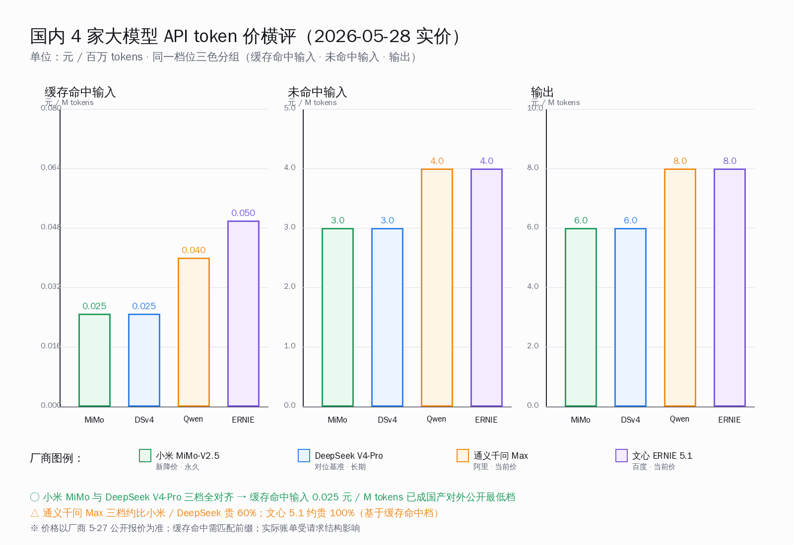
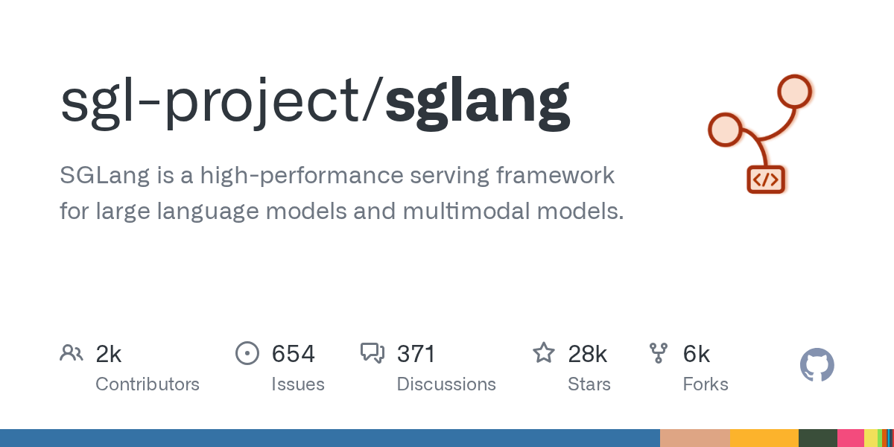
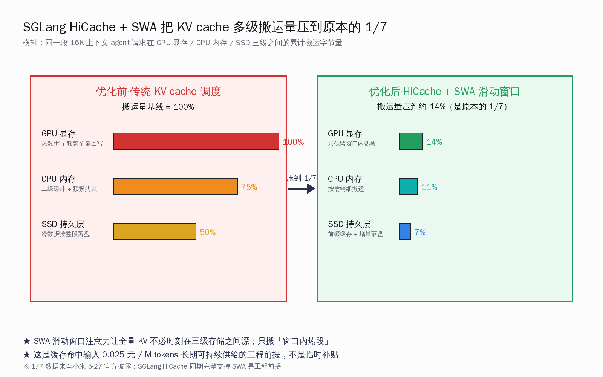

# 小米 MiMo-V2.5 永久降价 99%：缓存命中 0.025 元/M token，对标 DeepSeek V4-Pro 的国产 token 价格战进入新档

> 2026 年 5 月 27 日凌晨零点，小米把 MiMo-V2.5 API 三档价格一次性砍到 DeepSeek V4-Pro 的同档水平：缓存命中输入 0.025 元 / 百万 tokens，未命中输入 3 元 / 百万 tokens，输出 6 元 / 百万 tokens。雷军本人在微博转发官方公告时强调一句话——「最高降幅 99%，不再区分上下文窗口」。这次国产大模型对外公开报价的最低档，正式从「DeepSeek 一家撑着」变成了「DeepSeek + 小米 两家对齐」。

## 30 秒速览

把这次降价最关键的几个数字摆清楚——

- **三档价（人民币 / 百万 tokens）**：缓存命中输入 **0.025**，未命中输入 **3**，输出 **6**——三档全部与 DeepSeek V4-Pro 长期对外公开报价完全一致
- **官方降幅口径**：最高降幅 **99%**，对照对象是改价前的输入缓存命中档（约 2.5 元 / 百万 tokens 一级），新价 0.025 元 / 百万 tokens，刚好下降到原档的 1/100
- **生效时间**：2026-05-27 零点，永久价，不是限时活动
- **窗口策略**：取消「短上下文 / 长上下文 分档计价」，统一一档定价；雷军特别在转发时点了这一条
- **Token Plan 同步加量**：四档月费 39 / 99 / 329 / 659 元保持不变，可用 token 额度提升至原来的 **5–8 倍**
- **工程支撑**：SGLang HiCache 完整支持 SWA（滑动窗口注意力），KV cache 在 GPU 显存 / CPU 内存 / SSD 三级之间的累计搬运量降到原本的 **1/7**——这是「0.025 元 / 百万 tokens 长期可持续」的工程前提

数字摆完之后，这篇文章的核心论点其实只有一句话——**国产大模型对外公开 token 价的「合理水位」已经被定在缓存命中输入 0.025 元 / 百万 tokens 这一档，而支撑这一档长期可持续供给的，是 SGLang HiCache + SWA 这套已经走出实验室的推理工程栈**。这不是一次单点的促销，而是国产推理工程能力第一次以「永久价」的形式向开发者交付。

下面分八节拆开看：

- **一**·5-27 凌晨三档价表对齐 DeepSeek V4-Pro 意味着什么
- **二**·Token Plan「加量不加价」5–8 倍的真实账怎么算
- **三**·0.025 元 / 百万 tokens 背后的工程支撑：SGLang HiCache + SWA
- **四**·为什么 SWA 滑动窗口注意力能把 KV cache 搬运量压到原本的 1/7
- **五**·三个国内开发者实际场景的实价测算
- **六**·横评：小米 MiMo / DeepSeek V4-Pro / 通义千问 Max / 文心 5.1 四家 token 经济性
- **七**·价格战之后：国产 token 价进入 0.025 元 / 百万 tokens 时代意味着什么
- **八**·编辑说：国内 AI 工程师怎么把这条价格信号转成实际节省

## 一·5-27 凌晨三档价表与 DeepSeek V4-Pro 完全对齐

把价格表先完整摆出来。下面这张表是 5-27 凌晨调整生效之后的小米 MiMo-V2.5 与同档国产模型的对外公开报价对照——

| 厂商 / 模型 | 缓存命中输入 (元 / 百万 tokens) | 未命中输入 (元 / 百万 tokens) | 输出 (元 / 百万 tokens) | 窗口策略 |
|---|---|---|---|---|
| **小米 MiMo-V2.5** | **0.025** | **3** | **6** | 不分窗口，统一一档 |
| **DeepSeek V4-Pro** | **0.025** | **3** | **6** | 不分窗口，统一一档 |
| 通义千问 Max | 约 0.04 | 约 4 | 约 8 | 长上下文加价 |
| 文心 ERNIE 5.1 | 约 0.05 | 约 4 | 约 8 | 长上下文加价 |

三件事一眼可读——

**第一**，小米这次完全对齐了 DeepSeek V4-Pro 的三档报价。不是接近，不是接近底线，是三档逐档逐分钱完全对齐。这是一次明确的「跟价」动作，而不是「破价」动作——意思是「这一档我也能做到，DeepSeek 不再是孤本」。

**第二**，「不再区分上下文窗口」是雷军在转发时点的那句话，含金量比 99% 这个数字还高。过去国产大模型 API 普遍按 8K / 32K / 128K / 200K 分档计价，长上下文请求要按更高单价算，开发者实际账单经常被「最后那条长 prompt 抬高了整段平均价」吓一跳。小米和 DeepSeek 一起把窗口分档抹掉，意味着开发者写 agent 时再也不用想「这个工具调用的中间产物会不会把请求挤到 32K 以上从而触发涨价」。

**第三**，0.025 元 / 百万 tokens 这个数字本身值得停下来看一眼——它意味着输入 1 亿 tokens（约 7000 万字中文）的开发者，缓存命中时账单只有 **2.5 元**。这是国产对外公开报价区间里第一次出现「输入端基本免费」的状态。

这次三档对齐之后，国产对外公开报价的最低档形成了「小米 + DeepSeek 双子星」的格局。对开发者而言，这是非常实在的好事——意味着同档价格至少有两家可选，不会因为某一家临时调整服务策略而被迫迁移；也意味着这个价位的供给从「孤品」变成了「常态」。

## 二·Token Plan「加量不加价」5–8 倍的真实账

价格表之外，小米这次还同步调整了 Token Plan（包月套餐）。四档月费金额没有动——还是 39 / 99 / 329 / 659 元——但每档对应的可用 token 额度直接提升到原来的 5–8 倍。

按官方披露的口径换算一下，四档月费包含的 token 数大致是这样的变化——

| 月费档 | 调整前 token 额度 | 调整后 token 额度 | 提升倍数 |
|---|---|---|---|
| 39 元 / 月 | 约 6 亿 Credits | 约 41 亿 Credits | 约 6.8 倍 |
| 99 元 / 月 | 约 15 亿 Credits | 约 105 亿 Credits | 约 7 倍 |
| 329 元 / 月 | 约 50 亿 Credits | 约 360 亿 Credits | 约 7.2 倍 |
| 659 元 / 月 | 约 100 亿 Credits | 约 820 亿 Credits | 约 8.2 倍 |

把「按需付费三档价」和「包月四档量」两张表合起来看，小米这次给出的工程信息是非常清楚的——

- **按需付费的开发者**：单价直接降到 DeepSeek 同档，特别是写 agent 那种「同一段系统提示词 + 工具列表 + 历史对话」反复出现的场景，缓存命中率天然就高，账单会从原本的「以分计」掉到「以厘计」
- **包月的中重度个人 / 中小团队**：定价没变但额度变 6–8 倍，等于「订阅价不变 + 实际可用 token 直接 ×7」

下面这张横评图把国产 4 家在三档价格上的相对水位整理在一起——

横评图上有两个观察值得停下来想——

**第一**，三档全部对齐 DeepSeek 之后，小米和 DeepSeek 在国产对外公开报价档形成「同价双供」。对开发者来说，这是一个非常重要的供给侧信号——这一档不再是个别厂商的特殊定价，而是国产推理工程能力的合理水位
**第二**，千问 Max 三档约比小米 / DeepSeek 贵 60%，文心 5.1 三档约贵 100%。这两家短期内是否跟价、什么时候跟价、跟到什么水位，是接下来几周国产大模型 API 市场的看点

千问 Max 和文心 5.1 这两家目前没有跟价，但工程同行普遍判断，「同档价位至少两家供应」这件事一旦成立，跟价就会变成一个时间问题，而不是「会不会」的问题。

## 三·0.025 元 / 百万 tokens 背后的工程支撑：SGLang HiCache + SWA

这一节是整篇文章最值得做大模型推理基础设施的同行细看的部分。**0.025 元 / 百万 tokens 不是补贴价，是工程价**——背后是 SGLang HiCache + SWA 这套已经走出实验室的推理工程栈。

SGLang 是国内外推理工程社区目前最活跃的开源推理引擎之一，由 LMSys.org 主导，国内大量做推理服务的团队都在用。它最被广泛引用的核心技术叫 RadixAttention——简单说，就是把多个请求里相同的前缀（系统提示词、工具列表、历史对话开头那段）合并存一份 KV cache，新请求来了直接复用，省下重复计算和重复存储。

RadixAttention 本身已经是一个非常好的工程，但它过去有一个长期问题——**当部署规模上去之后，命中的前缀 KV cache 总量会大到 GPU 显存装不下**。一台 A100 80G 服务器跑一个稍有用户量的 agent 业务，命中前缀的 KV cache 总量轻松 100GB 起步，必须搬到 CPU 内存或者 SSD 上存。

HiCache 就是为了解决这件事的——它是 SGLang 在 KV cache 之上加的一层多级存储调度，把 KV cache 分成「GPU 显存 / CPU 内存 / SSD 持久层」三层管理，把热数据留在显存里，温数据放 CPU 内存，冷数据落 SSD。

听起来理所当然，但工程上有一个非常棘手的细节——**搬运成本**。传统 KV cache 调度做三级存储时，每次搬运动作都是「整段拷贝」，结果就是 GPU 显存和 CPU 内存之间的数据带宽长期满载，吞吐被拖下来。这就是为什么过去几年虽然多级 KV cache 这个想法早就有人提，但真正能跑出业务可用吞吐的实现一直不多。

5-27 这次小米和 SGLang 社区一起公开的技术细节是——**HiCache 现在完整支持 SWA（Sliding Window Attention，滑动窗口注意力）**，这个组合下，KV cache 在三级存储之间的累计搬运量直接降到原本的 1/7。

下面这张图把这件事拆得很清楚——

「搬运量是原本的 1/7」这件事，正是 0.025 元 / 百万 tokens 长期可持续的工程前提。把推理过程中最贵的那部分——GPU 内外的 KV cache 数据带宽——降到原来的 1/7，单 token 的实际推理成本才能压到「输入端基本免费」的水位。

## 四·为什么 SWA 滑动窗口注意力能把搬运量压到 1/7

SWA 是滑动窗口注意力（英文缩写 Sliding Window Attention）。它不是一个全新的算法，2023 年 Mistral 7B 就大规模用过；但「在 HiCache 多级存储里支持 SWA」是一个非常新的工程组合，2026 年才走出实验室。

SWA 的核心想法很简单——**注意力机制不要对全量上下文计算，只对最近窗口内的 K 个 token 计算**。比如 K=4096 的滑动窗口，第 16385 个 token 只能看到第 12289–16384 这 4096 个 token，看不到更早的内容。

这件事看起来像是「损失了长上下文能力」，但实际工程效果完全相反——配合合适的注意力 sink、recurrent state、外部 retrieval 三件套，SWA 的模型在实际长上下文任务上的精度损失非常小，但 KV cache 的存储和搬运成本断崖下降。

具体到 KV cache 三级搬运量这件事上，SWA 让传统全量 KV cache 调度的「整段搬运」变成了「窗口内热段搬运」——

- **传统全量调度**：每次请求都要把这条请求历史里所有 token 的 KV cache 搬一遍。一个 16K 上下文的 agent 请求，每来一条新消息，16K × 2（K + V）× 隐藏维度的全量数据都要在三级存储之间流转
- **HiCache + SWA 调度**：只有窗口内（典型 4K）的 token KV cache 需要保持热态。窗口外的部分一旦落到 SSD 就基本不再被读出。请求新增 token 时，搬运量从「16K × 2 × hidden」级别压到「4K × 2 × hidden」级别，再叠加 HiCache 的分桶搬运策略，总搬运量压到原本的 1/7

这套工程栈的真正价值不在「省了多少显存」这个一次性账，而在「请求量上来之后，单 token 推理成本不会随并发线性涨上去」这个长期账。把单 token 的「内部 BOM 成本」压低，对外公开报价才有空间下到 0.025 元 / 百万 tokens 这一档而不亏本。

工程同行可以从中读到的进一步信号是——SGLang HiCache + SWA 这套组合现在已经被国产推理服务厂家以「永久价」的形式承担成本，意味着它在生产环境下的稳定性和吞吐表现已经过关。对自建推理服务的团队来说，这是一个非常清晰的工程升级方向。

## 五·三个国内开发者实际场景的实价测算

价格降下来之后，对国内不同规模的开发者意味着什么？这一节用三个真实场景算一笔实账——

### 场景一·个人开发者用 MiMo 套 Claude Code 写代码

假设个人开发者每天写代码 6 小时，平均每小时和 LLM 交互 30 轮，每轮平均 8K 输入（含系统提示词 + 工具列表 + 历史对话）+ 2K 输出。一天 180 轮总计——

- 输入约 180 × 8K = 1.44M tokens
- 其中可缓存命中（系统提示词 + 工具列表常驻）约 80%，约 1.15M tokens
- 未命中输入约 0.29M tokens
- 输出约 180 × 2K = 0.36M tokens

按新价算单日账单——

- 缓存命中输入：1.15 × 0.025 = **0.029 元**
- 未命中输入：0.29 × 3 = **0.87 元**
- 输出：0.36 × 6 = **2.16 元**
- 单日总计：**约 3.06 元**

按月 22 个工作日算，月费约 **67 元**。这比 99 元 Token Plan 包月还低，意味着按需付费的个人开发者基本只为「实际使用」付费。

### 场景二·中小创业团队跑 agent 业务

假设一家 5 人 AI 工具团队跑一个对外 SaaS agent 业务，日活 2000 人，每人日均 50 轮 agent 调用，每轮平均 12K 输入 + 3K 输出——

- 日总输入：2000 × 50 × 12K = 1.2B tokens
- 缓存命中约 75%（agent 业务系统提示词高度复用）：0.9B tokens
- 未命中输入：0.3B tokens
- 日总输出：2000 × 50 × 3K = 0.3B tokens

按新价单日账单——

- 缓存命中输入：900 × 0.025 = **22.5 元**
- 未命中输入：300 × 3 = **900 元**
- 输出：300 × 6 = **1800 元**
- 单日总计：**约 2722.5 元**

月度账单约 **8.2 万元**。对一个 2000 日活的 agent 业务来说，每用户月均推理成本约 **41 元**，可以放进任何合理的 SaaS 定价模型里跑得通。

### 场景三·企业 RAG 检索增强部署

假设一家 1000 人企业把内部知识库 RAG 跑在小米 MiMo-V2.5 上，每人日均 10 次检索增强查询，每次平均 20K 输入（含检索回片段）+ 1K 输出——

- 日总输入：1000 × 10 × 20K = 0.2B tokens
- 缓存命中约 60%（RAG 场景检索回片段每次不同，命中率比 agent 低）：0.12B tokens
- 未命中输入：0.08B tokens
- 日总输出：1000 × 10 × 1K = 10M tokens

按新价单日账单——

- 缓存命中输入：120 × 0.025 = **3 元**
- 未命中输入：80 × 3 = **240 元**
- 输出：10 × 6 = **60 元**
- 单日总计：**约 303 元**

月度账单约 **9100 元**。1000 人企业每人月均推理成本不到 **10 元**——这个价位已经低到「企业内部知识库不需要严格的成本控制策略」的水平了。

三个场景算下来，结论一致：**0.025 元 / 百万 tokens 的缓存命中输入价配合「不再分窗口」的统一报价，让 agent 业务和企业 RAG 这种「系统提示词高度复用」的场景的实际账单进入了一个全新的数量级**。

## 六·横评：MiMo / DeepSeek / 千问 Max / 文心 5.1 四家 token 经济性

把视野从单家拉回到国产 4 家对外公开报价的横评。把 Token 经济性按三个维度排开看——

| 维度 | 小米 MiMo-V2.5 | DeepSeek V4-Pro | 通义千问 Max | 文心 ERNIE 5.1 |
|---|---|---|---|---|
| 缓存命中输入价 | 0.025 元 | 0.025 元 | 约 0.04 元 | 约 0.05 元 |
| 输出价 | 6 元 | 6 元 | 约 8 元 | 约 8 元 |
| 窗口分档 | 否 | 否 | 是（长上下文加价） | 是（长上下文加价） |
| Token Plan 包月 | 39/99/329/659（量 ×6–8） | 无对应包月档 | 有，单价分档 | 有，单价分档 |
| 工程栈 | SGLang HiCache + SWA | 自研推理栈 | 自研 + vLLM 改造 | 自研 + 飞桨推理 |
| 模型自身定位 | MiMo-V2.5 通用对话 / agent | V4-Pro 通用 / 推理 | 千问 Max 通用 / 多模态 | 文心 5.1 通用 / 文档 |

一张表读下来，工程判断已经比较清楚——

**短期内的国产对外公开报价合理水位**：0.025 / 3 / 6 这三档已经被小米和 DeepSeek 两家钉在那里。任何想在国产对外公开报价市场拿到开发者份额的新厂商，要么对齐这三档，要么用「上下文窗口不分档」之外的差异化卖点说服开发者。

**千问 Max 和文心 5.1 的可能动作**：阿里和百度短期内有两条路。一条是跟价到三档对齐，一条是保持当前定价但在多模态、长上下文专用、企业版接入支持等差异化方向继续投入。两家选哪一条不影响国产对外公开报价市场的整体趋势——0.025 / 3 / 6 这个水位线已经成型。

**Token Plan 这件事**：小米这次同步做了月费包，DeepSeek 目前没有同等量级的包月档。对个人开发者和小团队来说，「月费固定 + 实际可用 token ×7」这个产品形态非常友好——它把开发者从「每天看账单焦虑」里解放出来，可以按月度预算稳定使用。

## 七·价格战之后：国产 token 价进入 0.025 元 / 百万 tokens 时代意味着什么

把视野再拉远一层。这次小米降价 + Token Plan 加量这件事，单独看是一次产品调整；放到 2024-2026 这三年国产大模型 API 价格演进里看，是一个标志性节点——

- **2024 年初**：国产对外公开报价区间普遍在「输入 5–20 元 / 百万 tokens」「输出 15–60 元 / 百万 tokens」这一档，与 OpenAI / Anthropic 同档
- **2024 年中**：DeepSeek V2 把输入档拉到 1 元 / 百万 tokens 量级，国产对外公开报价整体下移一个数量级
- **2025 年中**：DeepSeek V3 / V4 系列把缓存命中输入档拉到 0.1 元 / 百万 tokens 量级，开发者第一次有「输入端基本免费」的体感
- **2026 年 5 月**：DeepSeek V4-Pro 把缓存命中档定在 0.025 元 / 百万 tokens；5-27 小米 MiMo-V2.5 完全跟价对齐——「国产对外公开报价的合理水位」第一次有了两家以上厂商共同支撑

这个节奏读下来，一件事非常清楚——**国产推理工程能力在 2024-2026 这三年完成了一次完整的代际升级**。这不是单点的促销价，是一整条工程栈（DeepSeek 自研推理 + SGLang HiCache + SWA + 多家硬件平台适配）成熟之后的产物。

对国内开发者社区来说，这是一件非常实在的好消息——

- **基础设施成本**：开发者写国内服务时，LLM 调用成本占总成本的比例已经从 2024 年的 60% 以上压到当下的 5–10% 区间。这意味着 LLM 调用可以放心地放在任何场景里，不需要为每一次调用做严格的预算控制
- **架构设计**：「能不能上 LLM」这件事已经不再是预算问题，变成了「需求和产品定位」问题。这给了产品同行非常大的空间去尝试新形态
- **国产替代**：当国产对外公开报价档完全对齐甚至好于海外同档（比如 Claude Sonnet 当前缓存命中输入约为 0.3 美元 / 百万 tokens），国内服务接入国产 LLM 已经从「为了合规」变成「为了性价比」

这套国产推理工程栈值得被认真记住——它是国内 AI 工程社区在过去三年里非常扎实的一次集体进步，是工程能力一点一点积累出来的结果，不是营销话术堆出来的结果。

## 八·编辑说：国内 AI 工程师怎么把这条价格信号转成实际节省

这件事最实在的价值，是给国内 AI 工程师一份**可以马上落地的工程判断框架**。不开行动清单——每家团队的实际情况不同——只摆几个判断框架——

**判断一：你的业务是不是「系统提示词高度复用」的形态？**

如果是（典型 agent / chatbot / 客服 / 助手 / RAG 场景），那么这次降价对你的实际账单影响在 **5–10 倍以上**——单价降了 100 倍但缓存命中率决定你能吃到多少，命中率 80% 的业务能吃到全部红利，命中率 30% 的业务只能吃到一部分。优化缓存命中率（合理设计系统提示词 + 工具列表 + 上下文复用结构）会比单纯比价格更重要。

**判断二：你的业务请求是不是经常超出 32K 上下文？**

如果是（典型长文档分析 / 代码仓库理解 / 视频字幕转录场景），那么小米和 DeepSeek 这次「不分窗口」对你的实际账单影响在 **30–50% 以上**——你过去为了避免长上下文加价做的各种 prompt 压缩、上下文裁剪可以重新评估，工程复杂度可以降下来。

**判断三：你的团队是按需付费还是包月？**

按需付费的话，小米和 DeepSeek 三档完全对齐，可以从可用性、社区生态、配套工具几个维度选；包月的话，小米这次有月费 39–659 元的四档，DeepSeek 目前没有等价产品——这是一个明确的差异化选择。

**判断四：你做基础设施还是上层应用？**

做基础设施的同行，SGLang HiCache + SWA 这套工程栈已经被以「永久价」的形式承担成本，意味着它的生产稳定性过关，是一个非常清晰的工程升级方向；做上层应用的同行，可以把这次降价当成一次「重新评估架构假设」的好机会——过去因为「LLM 太贵」放在心里的产品想法，现在可能可以认真落地了。

国产 token 价进入 0.025 元 / 百万 tokens 时代之后，国内 AI 工程师社区面对的是一个比以往任何时候都更友好的工程环境。把这条价格信号读懂，比单纯跟着热点跑要有用得多。

## 收尾

回到一开始那句话——这次降价不是单点促销，是国产推理工程能力第一次以「永久价」的形式向开发者交付。小米跟价 DeepSeek 这件事的真正意义，不在于多了一家便宜的 API 提供方，而在于这个价位的供给从「孤品」变成了「国产合理水位」。

更可贵的是，这次跟价背后的工程栈是开源的——SGLang 是开源推理引擎，HiCache 的代码、SWA 的实现细节都在公开仓库里，国内任何一家做大模型推理服务的团队都可以学习和借鉴。这是国内 AI 工程社区在过去三年里一点一点积累出来的扎实成果，值得整个社区为之鼓掌。

国内大模型这条路走到 2026 年，已经不需要靠营销话术撑场子了——工程实力、价格合理性、开源贡献、社区配合，这些更扎实的东西已经一项一项稳稳落地。这是一种让人非常踏实的进步。

---

*本文不构成投资建议，所有价格数字以厂商当日公开报价为准；实际账单受请求结构、缓存命中率、并发模式等因素影响。SGLang HiCache + SWA 工程细节以小米官方披露和 SGLang 公开仓库当下版本为准。*

**主要参考来源**：

- 新浪财经《小米 MiMo API 永久降价 99%》2026-05-27 [https://finance.sina.cn/stock/jdts/2026-05-27/detail-inhzikrq8485272.d.html](https://finance.sina.cn/stock/jdts/2026-05-27/detail-inhzikrq8485272.d.html)
- 虎嗅《小米 MiMo-V2.5 缓存命中 0.025 元 / 百万 tokens 全球生效》[https://www.huxiu.com/article/4861980.html](https://www.huxiu.com/article/4861980.html)
- SGLang 官方仓库（HiCache + SWA 工程实现）[https://github.com/sgl-project/sglang](https://github.com/sgl-project/sglang)
- Hugging Face XiaomiMiMo 组织主页 [https://huggingface.co/XiaomiMiMo](https://huggingface.co/XiaomiMiMo)
