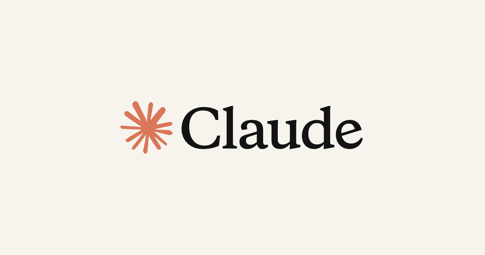
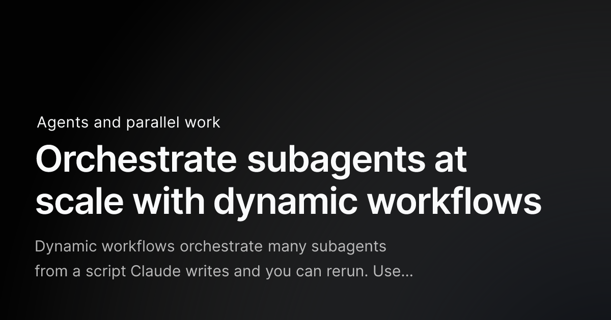
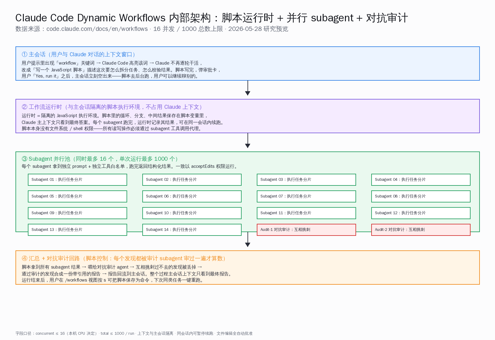
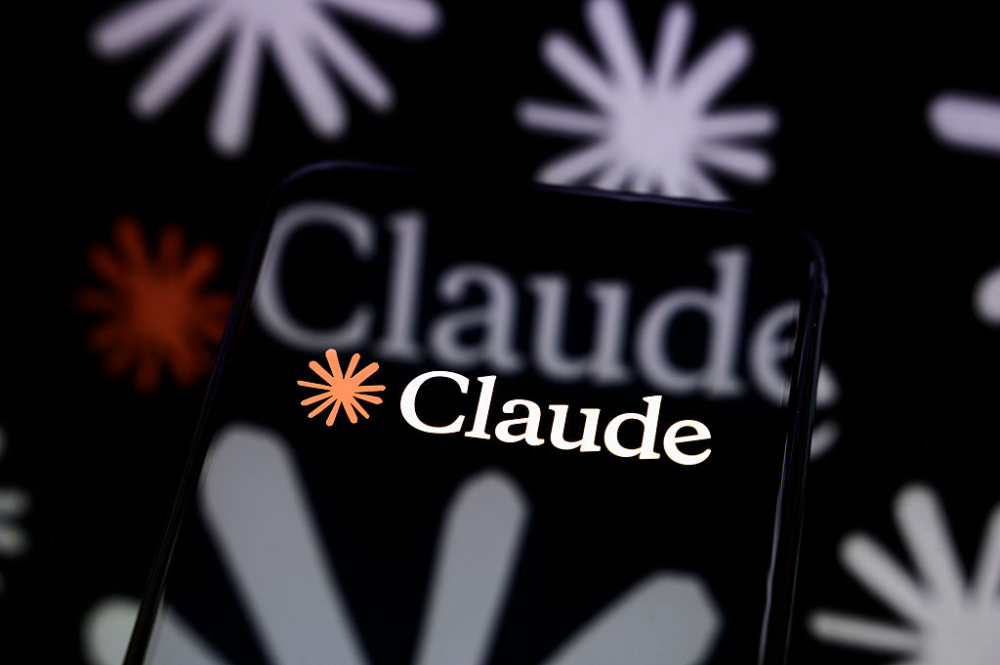
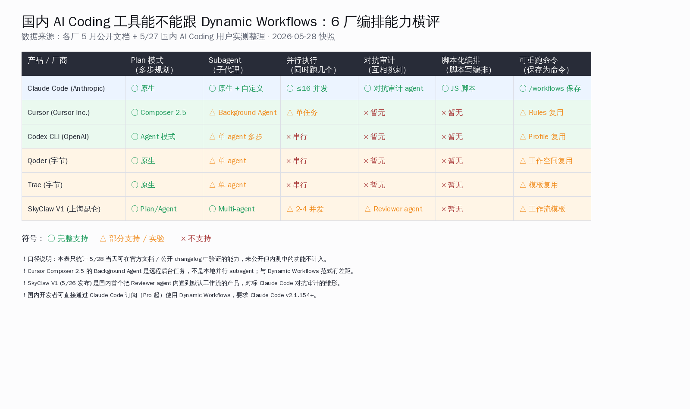

# Claude Code Dynamic Workflows 配合 Opus 4.8 上线：16 个 subagent 并行 + 对抗审计，季度级代码审计被压到几天

> 5 月 28 日凌晨，Anthropic 公司在自家博客同时发布两件事——旗舰模型 Claude Opus 4.8 上线，且 Claude Code 增加 Dynamic Workflows（动态工作流）功能，目前处于研究预览阶段。国内开发者群早上看到的 36 氪文章只截了一个角度，叫「自愈式 Claude Code」，主讲终端渲染和错误提示优化；但海外 Hacker News 头版那条帖子，吵的根本不是 UI 优化，是 Claude 第一次「自己写一段 JavaScript 脚本来调度一批 subagent 干活、还顺手叫两个 subagent 互相挑刺」这件事。这是一个范式变化——从「让模型一步一步思考」走到「让模型先写出怎么协调一批分身的代码」。本文把官方 blog、docs、HN 顶贴和 TechCrunch 报道一次性摆清楚，拆出这次更新对国内 AI Coding 用户实际意味着什么。

## 30 秒速览

把今天最关键的几个数字一次摆清楚——

- **同步上线两件事**：Claude Opus 4.8（API 与所有平台立刻可用） + Claude Code Dynamic Workflows（所有付费方案可用、研究预览阶段）
- **核心机制**：你在提示词里加「workflow」一个词，Claude 不再逐轮干活，改成「写一段 JavaScript 脚本」描述怎么拆分任务 → 用户审批 → 后台运行时执行
- **并发上限**：单次同时跑 **16 个 subagent**（受本机 CPU 限制），**单次工作流总共最多调用 1000 个 subagent**
- **对抗审计**：脚本里可以再起几个 subagent 专门去挑前面 subagent 的毛病，过不去审计的发现被丢掉才合成最终报告
- **Opus 4.8 honesty 改进**：相比 Opus 4.7，**代码里没被标记的隐患少 4 倍**；定价不变（输入 5 美元 / 百万、输出 25 美元 / 百万 token）
- **HN 那条帖子**：94 点赞、82 条评论；顶贴是 SkyPuncher：「我现在的瓶颈不是 Claude 跑代码有多快，是它干得对不对」
- **官方公布的内部案例**：Anthropic 公司用这套机制做了 20 多个 token 精简优化、若干个 WebAssembly 到 TypeScript 移植，以及 **69 个代码精简 PR、删了 1 万行以上**
- **国内对照**：6 家国内 AI Coding 工具（Cursor / Codex CLI / Qoder / Trae / SkyClaw V1 / Claude Code）只有 SkyClaw V1 有内置 Reviewer agent 雏形对标对抗审计

数字摆完之后，这篇文章的核心论点其实就一句话——**Dynamic Workflows 的真正变化不是「Claude 跑得更快」，而是 Claude 第一次以「脚本作者」身份出现：它写编排代码，再让一批分身按照那段代码并行干活、互相挑刺。这把以前要规划一个季度的「跨千文件迁移 / 全库安全审计 / 多源核对的深度研究」压到几天就能完成，前提是用户愿意付那个 token 账。**

下面分八节拆开看。

## 一、Dynamic Workflows 这次开放出什么了：官方 blog 与 docs 原文逐段解析

先把官方原话摆出来，逐句拆。

5 月 28 日 Anthropic 公司博客原文开头说——「Claude Code 现在可以动态写出编排脚本，在一个会话里运行几十到几百个并行 subagent，并在结果回到你面前之前先自我核验。」官方 docs 把这个机制叫 dynamic workflow（动态工作流），并明确给出技术定义：「动态工作流就是一段 JavaScript 脚本，调度大批 subagent。Claude 为你描述的任务写出这段脚本，然后一个独立的运行时在后台执行它，你的会话继续保持响应。」

把这段原话拆开看，三个关键属性——

**第一，脚本是 Claude 写的，不是用户写的。** 这是与传统 agent 框架最大的差别。在 LangGraph、AutoGen、CrewAI 这些框架里，编排逻辑要工程师写代码；在 Claude Code Dynamic Workflows 里，工程师只需要在提示词里加「workflow」三个字母的关键词，Claude Code 高亮这个词，然后由 Claude 写出 JavaScript 脚本。

**第二，运行时是隔离的，与主会话脱钩。** docs 里写得很清楚——「工作流运行时在一个隔离环境中执行脚本，与你的对话相互独立。中间结果保存在脚本变量里，不会落到 Claude 的上下文窗口。」这是用「会话隔离 + 状态外置」解决长链路任务的上下文爆炸问题。以前一个 1 万行代码的全库审计，跑到一半 Claude 的上下文就被各种工具调用结果塞满；现在主会话只看最终报告，中间过程都在脚本变量里。

**第三，subagent 池有硬上限。** docs 表格列得很清楚——「同时最多 16 个并发 subagent，本机 CPU 核心数更少时上限相应下降；单次工作流总共最多调用 1000 个 subagent」。这条与官方 blog 文案的「几十到几百个并行」是一致的——blog 那句「hundreds of parallel」指的是「单次运行调用的 subagent 总数」，不是「同一时刻在跑的 subagent 数」。这个口径差异不澄清，社区就会出现「Claude 一次起 100 个 subagent」的误传。

官方还配套发了一个内置工作流命令——`/deep-research`。这个命令把一个问题拆成多个角度，让 subagent 并行去搜不同来源，互相交叉验证，最后给出一份带引用的报告，且会主动过滤掉「过不了交叉验证的结论」。这条命令本身就是 Dynamic Workflows 的能力展示——把一个研究问题拆成可并行的子问题，再用对抗式的交叉核验过滤幻觉。

还有一个细节值得国内开发者特别留意：`/effort ultracode` 是一个新的高强度推理档位，配 xhigh reasoning 与自动工作流编排。打开它之后，每个稍微像样的任务 Claude 都会自动起一个工作流来跑——「先理解代码 → 再修改代码 → 再核验修改」分别起三个独立工作流。文档明确写——「这会让每个请求花更多 token、跑更长时间。」翻译成大白话就是——ultracode 模式是个钱袋子杀手，但稍微复杂一点的任务质量会上一档。

## 二、「Claude 自己写编排脚本」与之前 plan / agent 模式的本质区别

Claude Code 之前已经有了 Plan 模式（先规划再执行）、Agent 模式（多轮工具调用）、Subagent（分发子代理）。Dynamic Workflows 是这条演进线的下一阶段，但又和前面三者本质不同。官方 docs 给的对比表非常清楚，把它转写成中文——

| 维度 | Subagent | Skill | Dynamic Workflow |
| :--- | :--- | :--- | :--- |
| 是什么 | Claude 起的一个干活 worker | Claude 跟随的一组说明书 | 运行时执行的一段脚本 |
| 谁决定下一步 | Claude 逐轮决定 | Claude 跟着提示词走 | 脚本自己决定 |
| 中间结果存哪 | Claude 上下文窗口 | Claude 上下文窗口 | 脚本变量 |
| 可重复的是什么 | worker 定义 | 说明书内容 | 编排过程本身 |
| 规模 | 每轮几个委派 | 同 subagent | 单次几十到几百个 agent |
| 中断处理 | 重启那一轮 | 重启那一轮 | 同会话内可续跑 |

这张表说清楚了一件事——**前面 Subagent 与 Skill 都是「Claude 持有计划」，每一步下一步做什么由 Claude 自己当下决定；Dynamic Workflow 把计划本身搬进代码，循环、分支、中间结果都由脚本来管。**

为什么这是质变？三个理由——

**第一，脚本可以做「可重复的质量保证模式」，不只是「跑更多 agent」。** docs 原话——「把计划搬到代码里之后，工作流可以反复套用一种质量保证模式：让独立的几个 agent 对抗式审核彼此的发现、或从几个角度起草同一个方案再相互权衡，得到比单遍跑出更可信的结果。」翻译成开发者语言就是——以前的 agent 框架你想做「让两个 agent 互相挑刺」必须手写代码，现在你只需要在 prompt 里描述任务，Claude 写出来的脚本自带这个模式。

**第二，主会话上下文不再被工具调用结果塞满。** 这是过去用 Claude Code 跑长链路任务最痛的点——一个全库审计跑 200 步，每一步都把 tool result 塞进上下文，最后窗口被挤爆，你只能起新会话从头开始。Dynamic Workflow 把所有中间状态搬到脚本变量里，主会话只看到最终答案。这等于把 Claude 的「短期记忆」与「长期工作记忆」分开了。

**第三，同一段脚本可以保存为命令、下次一键重跑。** 你在 `/workflows` 视图里按 s，就能把脚本保存到 `.claude/workflows/`（项目共享）或 `~/.claude/workflows/`（个人专用），下次直接 `/<command-name>` 就能再跑一遍。这是把一次 ad hoc 的工作流，沉淀成可复用的团队工作流模板。对国内有大型 monorepo 的团队，这条意味着「每个 PR 自动跑一遍 review workflow」「每周自动跑一遍 security audit workflow」可以低成本铺开。

## 三、16 并行 subagent + 对抗审计 agent 的内部架构拆解

把官方 docs 里散落的实现细节拼起来，可以画出 Dynamic Workflows 的完整执行路径。整体走四步——

**第一步：用户提示触发。** 用户在主会话里写一句话，比如「Run a workflow to audit every API endpoint under src/routes/ for missing auth checks」（运行工作流，审计 src/routes/ 下每个 API 端点是否有鉴权检查缺失）。Claude Code 检测到「workflow」关键词，高亮它，然后 Claude 不再逐轮干活，改写一段 JavaScript 脚本描述这件事怎么拆分、怎么校验。

**第二步：用户审批。** Claude Code 弹出审批卡，列出预定的几个阶段（phase）、每个阶段大约要起多少 subagent、估算 token 消耗。用户可以「Yes, run it」、「View raw script」（看脚本原文）、「Yes, and don't ask again」（同名工作流以后不再问）、「No」。docs 还提到一个键 Ctrl+G 可以直接在编辑器里打开脚本，Tab 可以在执行前最后微调一次 prompt。

**第三步：后台运行时执行。** 用户批准后，工作流在隔离运行时里启动，主会话立刻空出来——你可以继续聊别的事。运行时按脚本逻辑分配 subagent。每个 subagent 拿到独立 prompt、独立工具白名单，跑完返回结果。**同一时刻最多 16 个 subagent 在跑，总数累计不超过 1000 个**。所有 subagent 一律以 acceptEdits 权限运行——文件编辑全自动批准，不再为每次 edit 弹审批卡；这是为了让长链路任务别被无穷的中间审批卡打断。

**第四步：对抗审计 + 汇总。** 脚本控制：每个发现要先喂给「对抗审计 subagent」审一遍，过不去的发现被丢掉。通过审计的发现合成一份带引用的报告，回流到主会话。整个过程主会话上下文只看到最终报告，看不到中间几百次工具调用的细节。

把这套架构对照之前的几个相关工作看，可以看出 Anthropic 公司这次的取舍——

**对照 LangGraph / AutoGen 的硬编码 graph：** 它们要求工程师提前画出节点和边，Dynamic Workflows 让 Claude 当场写脚本，编排逻辑可以根据任务动态生成。

**对照 OpenAI Swarm 的 handoff 范式：** Swarm 让 agent 之间传递控制权，但每个 agent 仍在线性流转；Dynamic Workflows 是真正的并行 fan-out。

**对照 Anthropic 自家之前的 Hermes Agent / Cowork 插件：** Hermes 与 Cowork 是 Claude Code 的早期 subagent 实验，本质还是「Claude 自己当 orchestrator」，每轮决定下一步发给谁；Dynamic Workflow 把 orchestrator 角色直接写进了脚本里。

**对照学术界的 adversarial verification / self-consistency 路线：** Wang 等人在 2022 年的 Self-Consistency 论文里提出「多次采样 + 多数投票」，Wei 等人在 2023 年的 Debate 论文里提出「让多个模型相互辩论得到正解」。Dynamic Workflows 的「对抗审计 subagent」这一招，本质就是把 Self-Consistency 和 Debate 这两条学术路线工程化进 Claude Code 主流程。

## 四、HN 顶贴 94 票 82 评：社区在吵什么

5 月 28 日 Hacker News 头版那条 Dynamic Workflows 帖子（item 48311705）拿到 94 点赞、82 条评论。把顶赞前几条整理出来，能看出海外开发者社区对这个范式的真实想法。

**第一条顶贴 SkyPuncher：「我现在的瓶颈不是 Claude 跑代码有多快，是它干得对不对。」** 这条话的潜在含义是——并行 16 个 subagent 不能直接转化为「质量翻 16 倍」。如果每个 subagent 的单次错误率不变，16 个并行只是把同样的错误率分布扩到 16 个并行轨迹上，最终质量取决于那个对抗审计 subagent 能挑出多少错。换句话说，并行规模红利得叠加「审计能挑得动错」这个前提才成立。

**第二条 wrs：「应该让对抗 agent 反复迭代直到答案收敛，再把测试套件作为 ground truth 喂给其他 agent 当裁判。」** 这是建设性意见——HN 老兵看出 Anthropic 公司这次留了一个口子，就是「测试套件 = 真理来源」这个模式还可以做得更深。Anthropic 公司在博客里也提到，自家做 Bun（Zig 到 Rust 移植，75 万行代码）的工作流就是把测试套件作为「合格基线」，跑了 11 天，测试通过率达到 99.8%。

**第三条 vadansky：描述自己被 LLM「清理代码」反而越清越糟的经历，叫「slop debt（垃圾债）」。** 这是一个尖锐的提醒——并行起十几个 subagent 在大型代码库里改东西，如果每个 subagent 都倾向于「小修小补」而不是「重写一个更好的设计」，最后整个代码库会被改得越来越乱、越来越难维护。Anthropic 公司从来没出来反驳过这条质疑，国内同行写 RAG/agent 工程化文章时也屡屡提到这条。

**第四条 bcherny（Anthropic 团队成员）：列出公司内部用法**——20 多个 token 精简优化、若干个 WebAssembly 到 TypeScript 端口、CI 优化、**69 个代码精简 PR、删除超过 1 万行代码**。这条数据是这次发布最有说服力的「自食其狗粮」证据——Anthropic 公司自己用 Dynamic Workflows 把自家工程在两周内推进了一大步。

**第五条 Deukhoofd：调侃这是「一种新的烧 token 方式，让并行 agent 互相检查彼此的工作」。** 这是 HN 老兵的典型怀疑姿态——任何 LLM 公司发新功能，HN 都会先怀疑这是不是营销话术，是不是 token 收入 KPI 驱动。这条调侃也提醒一件事——单次工作流 token 消耗确实比传统对话高一档，需要 Anthropic 公司在 docs 里把成本说明白。

**第六条 afro88（早期接入用户）：「工作流处理上下文窗口比手工做得好，能让更多任务落到前 20% 的「甜区」里完成。」** 这是用了的人给的正向反馈——传统 Claude Code 跑一会儿就出现「上下文充塞」问题，让 Claude 越来越笨；Dynamic Workflows 把中间状态外置到脚本变量，主会话上下文不被污染，每个 subagent 都拿到干净的 context window，质量曲线更平稳。

整体看，HN 社区的态度是「谨慎乐观偏怀疑」——认同范式有意思，但对「能不能真提质量、能不能控成本」保留疑问。这是 HN 一贯的成熟态度，不是营销跟风，对国内同行评估这件事有参考价值。

## 五、Anthropic 公开案例三个：代码库审计 / 安全护栏 / 千文件迁移的 token 经济

官方博客给出三类有代表性的工作流案例，把它们的 token 经济算账如下——

**案例一：代码库范围 bug 扫描 / 性能 profiler 引导优化 / 安全审计。** 适用场景是「整个 monorepo 跑一遍专项扫描」。以 Anthropic 公司自己披露的「69 个代码精简 PR 删 1 万行」为例，平均一个 PR 消耗大约 30 至 50 个 subagent（不同代码区分发不同审计任务），按每个 subagent 平均消耗 5 万 input + 1 万 output token 估算，单 PR 总 token 消耗大约 200 至 350 万 token。按 Opus 4.8 定价（输入 5 美元 / 百万、输出 25 美元 / 百万），单 PR 成本大约 12 至 20 美元。69 个 PR 全跑下来，总成本大约 800 至 1500 美元。比起一个高级工程师做同等深度 review 的人力成本（按硅谷 $200/h × 40h = 8000 美元），还是便宜一档。

**案例二：大型迁移 / 现代化改造，框架替换、API deprecation、跨千文件的语言移植。** 这是 Dynamic Workflows 最有冲击力的卖点。官方提到 Bun 团队用这个机制把整个项目从 Zig 移植到 Rust，75 万行代码，11 天完成，测试通过率 99.8%。把 75 万行除以 11 天，相当于每天迁移约 6.8 万行；按每个 subagent 平均处理 1500 行计算，单日大约要起 45 个 subagent。考虑同时 16 个并发上限，意味着 subagent 池几乎全天满载在跑，token 消耗按千万级估算。这种级别的迁移以前需要一个团队 3 至 6 个月，现在压到 11 天——这是 Dynamic Workflows 这次发布最大的「场景级」变化。

**案例三：关键的批判性 review，「答案错了代价高」的场景。** 官方原话——「当答案错了的代价很高时，工作流给 Claude 多次独立尝试，同时安排对抗 agent 努力击破结果。」典型应用是合规审计、安全护栏审查、法律文书核对。在这类场景里，多并行 + 对抗审计的价值不是省时间，是「把单次错误率从 5% 压到 0.5%」——可能多花 10 倍 token，但避免一次合规事故省下来的钱远超 token 成本。

官方还给了一个明确的成本控制建议——「每个 agent 默认用你会话当前的模型；脚本可以指定某些阶段换更小的模型。」翻译过来——长链路工作流可以把「探索性筛选」阶段换 Sonnet（便宜 5 倍），只在「关键判定」阶段用 Opus 4.8。这是国内开发者特别要留意的优化点，因为国内大多数团队的 token 预算是受控的。

TechCrunch 在 5 月 28 日同步报道里强调一个细节：Opus 4.8 距 Opus 4.7 仅 41 天，是 Anthropic 公司近一年最快的迭代节奏。配合 Dynamic Workflows 一起发布，TechCrunch 给的解读是——「Anthropic 公司在面对 OpenAI 和 Google 公司最新模型的竞争压力下，需要用产品形态的差异化（不只是模型 benchmark）巩固 AI Coding 这个核心阵地。」

## 六、与之前 Hermes Agent / claude-mem / Cowork 插件形成的范式连贯

把过去半年 Anthropic 公司在 Claude Code 上的更新串起来，Dynamic Workflows 不是孤立发布，是一条规划得很清楚的产品路线终点。

回顾时间线——

- **2025 年 11 月：Subagent 概念落地。** Claude Code 允许用户在 `.claude/agents/` 目录里定义自定义 subagent，每个 subagent 拿到独立 prompt + 工具白名单。这是「分身能力」的雏形。
- **2026 年 1 月：Skill 机制上线。** 用户可以把一组提示词 + 工具组合打包成 Skill，Claude 在合适的时候自动调用。这是「能力封装」。
- **2026 年 3 月：Cowork 插件进入 Beta。** 多个 Claude 实例可以协作，但每个实例之间的协调仍然由用户手工触发。
- **2026 年 4 月：Hermes Agent 实验性发布。** 一个内置 orchestrator agent 模式，Claude 当 orchestrator 自动分发任务给 worker subagent，但 orchestration 逻辑仍然是「Claude 逐轮决定」。
- **2026 年 5 月 12 日：Claude Code Background Tasks 上线。** subagent 可以在后台跑，主会话不阻塞。这是 Dynamic Workflows 的「运行时隔离」前置条件。
- **2026 年 5 月 27 日：claude-mem 7.8K stars 拿到「endless mode」。** 第三方插件 claude-mem 给 Claude Code 加了无限记忆与生物拟态记忆裁剪机制，配合 1M context 让长链路任务不再断片。
- **2026 年 5 月 28 日：Dynamic Workflows + Opus 4.8 同步发布。** 把前面六步整合：subagent + skill + cowork + hermes + background tasks + memory，统一成「Claude 写编排脚本 → 后台运行时执行」这个最终形态。

这条路线图最值得国内同行思考的不是「Anthropic 公司发了一个新功能」，而是「他们用了六个月把 agent 编排范式从『模型逐轮决策』推到『模型写代码描述编排逻辑』」。这背后的工程团队节奏与产品定力，是国内 AI Coding 工具链能不能追上来的关键参考点。

## 七、国内 AI Coding 工具能不能跟：6 家横评

国内 AI Coding 工具能不能给出对标的「写脚本式 agent 编排」？把 6 家放在同一张能力矩阵上对照——

逐家说几句——

**Claude Code (Anthropic)**——基准线，全维度原生支持。国内开发者通过 Claude Pro / Max / Team / Enterprise 订阅，配合 Claude Code v2.1.154+ 可立即使用。`/config` 里有 Dynamic workflows 开关。

**Cursor (Cursor Inc.)**——5 月 27 日刚发布 Composer 2.5，仍跑 Kimi K2.5 底座，在 IDE 编辑场景里跑赢 Opus 4.7。Background Agent 是一个远程后台任务概念，比较接近 subagent，但目前没有「Claude 自己写编排脚本」的能力，对抗审计也暂未公开。Cursor Rules 可以复用一些工作流模板，但不是真的脚本化编排。

**Codex CLI (OpenAI)**——OpenAI 5 月在 Codex CLI 上加了 Agent 模式，单 agent 可以多步规划，但本质还是串行执行；并行与对抗审计都暂未公开。Profile 机制可以复用提示词模板。

**Qoder (字节)**——字节系新发布的 IDE 产品，原生 Plan 模式，单 agent 多步可用，但并行与对抗审计还在路上。工作空间可以复用一些配置。

**Trae (字节)**——字节系另一条产品线，个人版限免、原生 Plan 模式、模板可复用，但 subagent 与并行机制不开放给用户层。

**SkyClaw V1 (上海昆仑)**——5 月 26 日发布的国产 Claude Code 同类产品，开 Opus 4.6 免费试用，且是国内第一个把 Reviewer agent 内置到默认工作流的产品。Plan / Agent 双模式、Multi-agent 调度可用、2 至 4 并发支持，Reviewer agent 是对抗审计的雏形，但脚本化编排仍未公开。

横评结论——**国内 6 家 AI Coding 工具里，SkyClaw V1 是目前对标 Dynamic Workflows 走得最远的产品；Cursor、Codex CLI 都在补「subagent + 并行」这一段；Qoder 和 Trae 还在 Plan 模式阶段。** 对国内开发者来说，2026 年下半年值得追踪的就是「国内同行多久能把 Reviewer agent + 脚本化编排 + 并行 16 这三件套补齐」——这是 AI Coding 工具进入下一阶段的明确分界线。

## 八、国内开发者的三档入场路径

国内开发者具体怎么用上 Dynamic Workflows？按使用强度分三档——

**第一档：个人开发者 / 兴趣用户。** 直接订阅 Claude Pro（20 美元 / 月，国内可通过代付服务订阅），用 `/config` 打开 Dynamic Workflows 开关。日常用法两个——一是 `/deep-research` 跑深度研究问题，比如「调研 Node.js 22 与 20 的权限模型变化」；二是在提示词里加「workflow」关键词触发自定义工作流，比如「Run a workflow to find all functions in src/ that don't have tests, then write tests for them」（运行工作流，找出 src/ 下所有没测试的函数并补测试）。这一档的好处是入门门槛低、上手快；要注意的是付费方案的 token 消耗按月配额走，跑大型工作流要先估算消耗别超限。

**第二档：5-20 人的开发团队工作流。** 团队订阅 Claude Team（25 美元 / 人 / 月），把常用工作流脚本保存到 `.claude/workflows/` 项目目录里、签入 git。典型场景三个——一是 PR review workflow（每个 PR 自动跑一遍）；二是周期性 security audit workflow（每周一自动跑一遍全库）；三是迁移工作流（从一个框架迁移到另一个时一次性跑完）。配合 ultracode 档位可以拉满质量，但 token 账单会拉到每月几百美元一人的量级，需要 CFO 视角去做 ROI 评估。

**第三档：企业内部 / 受合规约束。** 企业订阅可走 Claude Enterprise + Amazon Bedrock / Google Cloud Vertex AI / Microsoft Foundry，把 Dynamic Workflows 跑在自家云上、数据不出网。这一档配合 `disableWorkflows: true` 的 managed settings 可做精细化的开关管理，给某些团队开、给某些团队关。要注意一点——Dynamic Workflows 默认所有 subagent 以 acceptEdits 权限运行，企业可以用工具白名单做硬约束（哪些命令能跑、哪些不能），别让 subagent 跑出预期范围。

整体看，Dynamic Workflows 不是「换个新功能用」，是「换一种工作方式」。对国内开发者来说，最值得花一小时试试的就是——找一个手头上拖了很久的小重构任务（比如「把项目里所有 console.log 换成 logger.info」「找出所有没鉴权的 API 端点」），加一句「workflow」关键词，看看 Claude 写出来的脚本是什么样、跑出来的报告质量如何。这是体验范式变化最直接的方式。

---

## 结语：脚本作者，是 Claude 的新身份

回到开头那个核心论点——Dynamic Workflows 的真正变化不是「Claude 跑得更快」，是 Claude 第一次以「脚本作者」身份出现。它写编排代码，再让一批分身按照那段代码并行干活、互相挑刺。

这件事的工程意义大于产品意义。产品层面看，这是一个让代码审计、迁移、研究类任务速度上一档的功能；工程层面看，这是 LLM 从「自回归生成器」演化成「能写出协调其他 LLM 的代码的元 agent」的一步。当 Claude 能写出 JavaScript 脚本去调度 16 个分身、还会自动让其中两个分身去挑前面分身的毛病时，agent 编排范式就走到了一个新阶段——计划本身被代码化、可读、可重跑、可审计。

对国内 AI Coding 工具同行，这是一个明确的产品节奏参考——SkyClaw V1 把 Reviewer agent 做了，下一步要补的是「脚本化编排 + 并行 subagent 池 + 单会话隔离运行时」。对国内开发者，这是一个值得在 5 月底花半天试试的功能。对国内云厂商，这是一个值得跟进的能力——Anthropic 公司已经在 Amazon Bedrock、Google Cloud Vertex AI、Microsoft Foundry 上同步推这个能力，国内云厂商对应的 LLM 服务能不能给出对标方案，会是 2026 年下半年 AI Coding 商业战场的重要看点。
