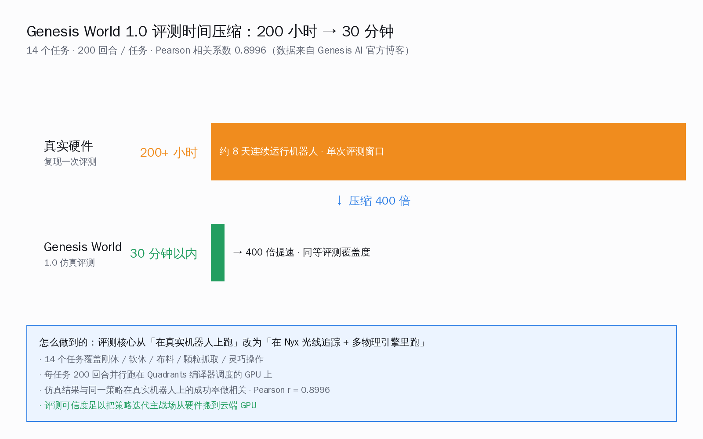
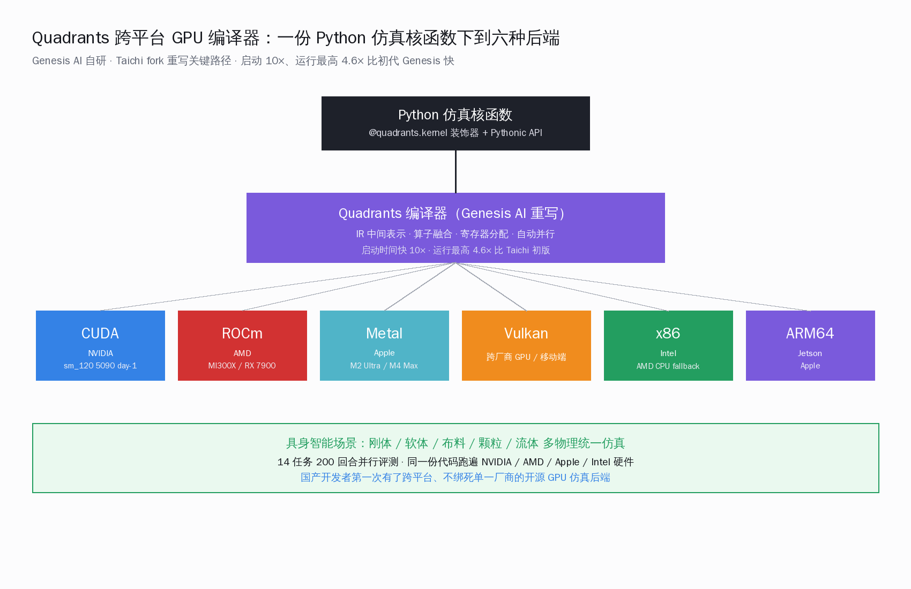
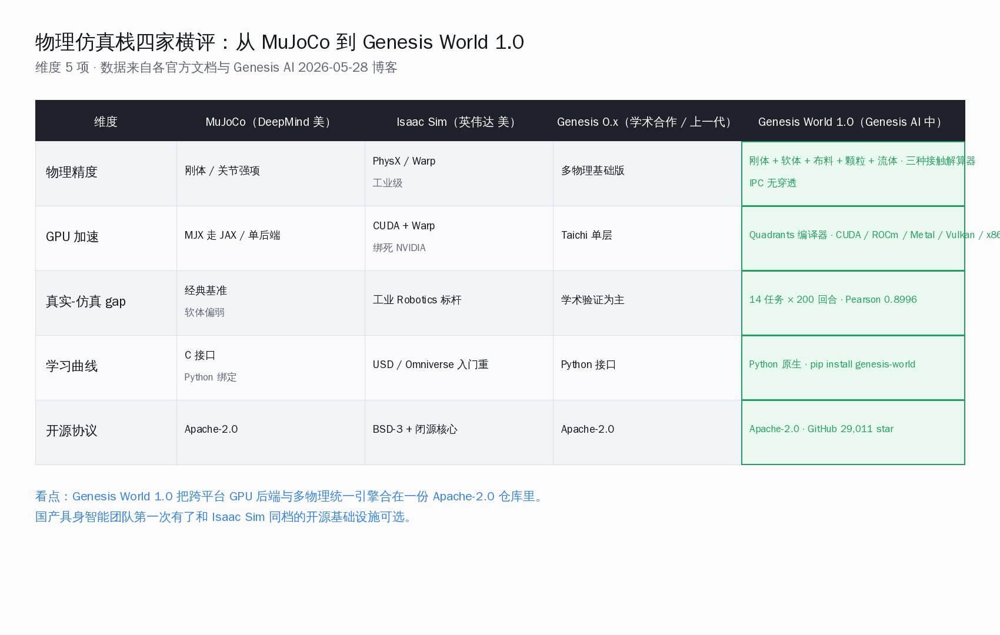
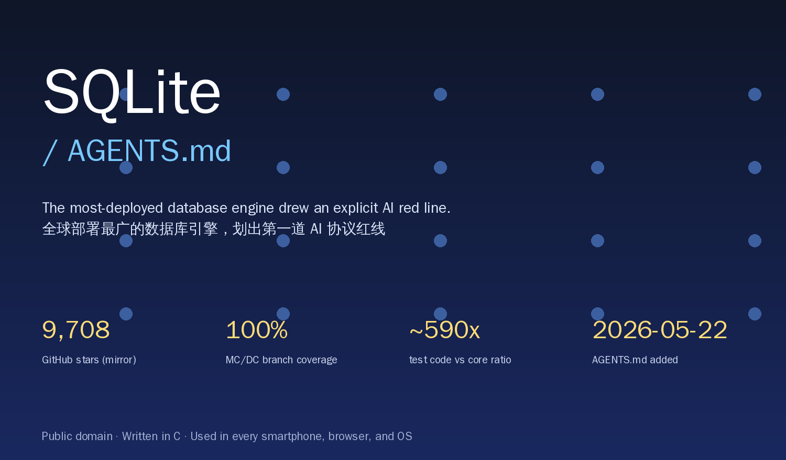
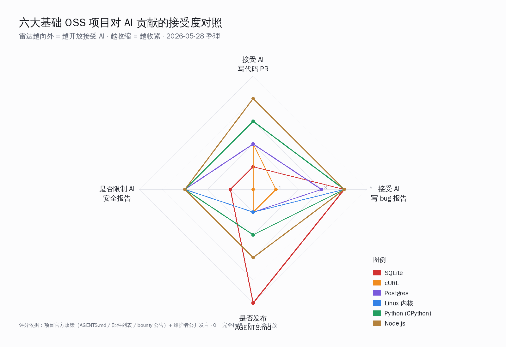
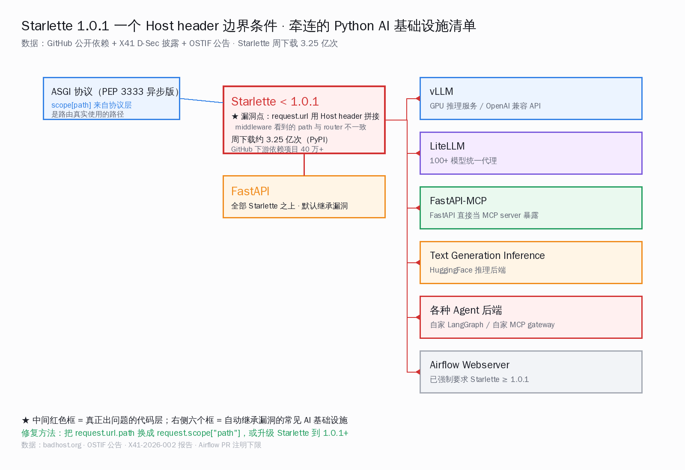

# Claude Opus 4.8 上线 · Genesis 开源机器人仿真平台 · SQLite 官方仓库拒收 AI 代码 | AI 日报 | 2026-05-29

## 📋 头版目录

- 🚀 Anthropic 同日发 Opus 4.8 + Claude Code Dynamic Workflows → 头条 1 / AI Coding
- 🛠 单次并发 16 个 subagent、单次总数 1000 个，需 Claude Code 2.1.154+ → 头条 1.1
- 🧠 Opus 4.8 把未被发现的安全缺陷概率压到 1/4，fast mode 2.5× 提速，价格 5/25 美元未变 → 头条 1.2
- 🛠 Anthropic 自家 Bun 案例：75 万行 Zig→Rust 移植 11 天完成，测试通过率 99.8% → 头条 1.3
- 🇨🇳 Genesis AI 开源 Genesis World 1.0 三件套，Apache-2.0 一次性放出 → 头条 2 / 国内 AI
- 🧠 14 任务 × 200 回合，仿真与真机 Pearson 相关 0.8996，200+ 小时压到 30 分钟 → 头条 2.1
- 🔬 Quadrants 跨平台 GPU 编译器六后端（CUDA / ROCm / Metal / Vulkan / x86 / ARM64）启动 10×、运行 4.6× → 头条 2.2
- 🇨🇳 国内五家具身智能（智元 / 银河通用 / 宇树 / 千寻 / 小米机器人）第一次有同档开源仿真栈可选 → 头条 2.3
- 🔬 SQLite 在仓库根目录新增 AGENTS.md，明文不收 AI 代码、收带测试的 AI bug 报告 → 头条 3 / 名人说
- ⚖ SQLite 5/25 前后删掉句末「（currently）」，commit 信息「Strengthen the statement…」 → 头条 3.1
- 🛡 SQLite 100% 分支 + 100% MC/DC 覆盖自 2009 起，测试代码与本体比例约 590:1 → 头条 3.2
- 🛡 CVE-2026-48710 BadHost：Starlette 一个 Host header 边界把 FastAPI/vLLM/LiteLLM/Airflow 一起拖下水 → 要闻 / 国内 AI
- 🛡 修复就是 `pip install starlette==1.0.1`，X41 D-Sec 在 OSTIF（Alpha-Omega 资助）下审计 vLLM 时发现 → 要闻
- 🧠 NVIDIA 5/27 开源 Polar：Codex / Claude Code / Qwen Code 不改一行代码就当 GRPO 训练环境 → 要闻 / AI Coding
- 📰 SWE-Bench Verified pass@1：Codex 3.8→26.4、Claude Code 29.8→34.6、Qwen Code 34.6→35.2、Pi 34.2→40.4 → 要闻
- 🔥 GitHub Trending 5/28 双榜首日：taste-skill 26,348 stars 刮 AI 味前端、stop-slop 6,395 stars 刮 AI 味文字 → GitHub
- 🇨🇳 op7418/Humanizer-zh 8,495 stars 把反 AI 味思路汉化，针对中文场景做破折号与词表替换 → GitHub
- 🎙 Simon Willison 5/27《SQLite agents》短评回应 SQLite AGENTS.md → 名人说
- 🇨🇳 国内媒体把 NVIDIA Polar 数字写成「594.74%」上头条，实际只有 Codex 一栏成立 → 名人说
- 🛠 本地大模型场景：Mac Studio M2 Ultra 二手 vs M4 Max 新机的开发机选型口径 → AI Coding
- 🛠 4090 24GB 单卡跑 Qwen3-VL / GLM-4.5V / MiniCPM-V 多模态的真实开发体验 → AI Coding

## 🔥 头条深度

### 头条 1 · Anthropic 同日发 Opus 4.8 + Claude Code Dynamic Workflows：Claude 第一次以「脚本作者」身份并行调 16 个分身

5 月 28 日 Anthropic 一口气发了两份公告：Claude Opus 4.8 [6] 与 Claude Code Dynamic Workflows [7][8]。这两件事不是各自独立的版本号迭代，是同一条产品线的同步升级——Opus 4.8 把模型推理能力推上去，Dynamic Workflows 把 Claude Code 这一壳子的协作能力推上去，两者一起把「季度级代码审计 / 千文件迁移 / 跨源研究」这一档活的耗时从月压成天。

#### 1.1 Dynamic Workflows 真正的变化：Claude 自己写 JavaScript 编排脚本

Dynamic Workflows 之前 Claude Code 已经支持 subagent，但调度是开发者写 prompt 让 Claude「请并行启动多个分身」。Dynamic Workflows 把这一层变成代码——Claude 自己写 JavaScript 编排脚本，用一份显式控制流（fork / join / 条件分支 / 异常处理）调度其它 subagent。官方文档 [8] 的「Behavior and limits」表给出两个上限：

| 上限项 | 数值 | 含义 |
|---|---|---|
| 同一时刻并发 subagent | **16** | 硬上限，超过 16 个会排队 |
| 单次运行 subagent 总数 | **1000** | 一次 Workflow 累计调用上限 |
| Claude Code 最低版本 | 2.1.154 | 低于这个版本不可用 |
| 状态 | research preview | 未达 GA，行为可能变化 |

官博文案里出现的「几十到几百个 subagent」指的是单次运行总数，不是同一时刻并发——这一点 HN 评论里也有人指出。Subagent 在默认 acceptEdits 权限下运行，企业用法必须用工具白名单做硬约束。

#### 1.2 Opus 4.8 把未被发现的缺陷概率压到 1/4，价格未涨

| 指标 | Opus 4.7 | Opus 4.8 | 变化 |
|---|---|---|---|
| 输入价（美元 / 百万 tokens） | 5 | **5** | 持平 |
| 输出价（美元 / 百万 tokens） | 25 | **25** | 持平 |
| 未被发现的安全缺陷相对概率 | 1× | **1/4 ×** | 官方原话「four times less likely」 |
| Fast mode 速度 | 1× | **2.5×** | Anthropic 公开口径 |
| 距 Opus 4.7 发布时间间隔 | — | 41 天 | TechCrunch 推算 |

价格不变 + 缺陷概率压到 1/4 + 快速模式 2.5× 提速，这是 Opus 4.7→4.8 这次升级的三件事。对国内用户的对位含义是——Cursor / Cline / Roo Code 这一类用 Anthropic API 的工具同价升档，单 token 成本不变但任务完成可靠性上去；通义灵码、字节 Trae、阿里 Qoder 这一类用国产底座（Qwen / Kimi K2.5 / DeepSeek V4-Pro）的工具，对位的成本下降这一边已经被国产 token 价（5 月 28 日小米 MiMo 永久降价 99%）拉到一档，剩下的就看后训练栈如何把可靠性追上。

#### 1.3 官方点名的三类「以前要一个季度」的活

Anthropic 官博 [7] 点了三类活，单次 Workflow 跑就能完：

- **代码库审计**：以全库为单位，用 16 个 subagent 并行扫描安全漏洞 / 性能瓶颈 / API 一致性问题，叠对抗审计 subagent 交叉验证。Anthropic 自家在内部跑出 69 个简化 PR、累计删 1 万多行代码（来自 HN 上 bcherny 即 Boris Cherny，Claude Code 团队成员的评论，不在官方 blog 里）
- **千文件迁移**：Bun 团队 75 万行 Zig→Rust 移植，11 天完成、最终测试通过率 99.8%。这是 Anthropic 自家公开材料，独立第三方未复现
- **跨源深度研究**：把一个研究问题分拆给 16 个 subagent 各自查不同来源，再用对抗审计 subagent 把结论冲突拎出来

HN 评论里的核心分歧是：并行规模上去之后，瓶颈是「Claude 干得对不对」不是「Claude 多快」。Dynamic Workflows 用对抗审计 subagent 处理这条瓶颈，但研究 preview 阶段的实际效果仍需观察。完整 6 家国产 AI Coding 工具（Claude Code / Cursor / Codex CLI / Qoder / Trae / SkyClaw V1）的能力矩阵对照，见今日「Claude Code Dynamic Workflows 配合 Opus 4.8 上线」专题。

### 头条 2 · Genesis World 1.0（快速仿真世界）：Genesis AI 把多物理仿真、跨平台 GPU 编译器、光线追踪渲染器一次性 Apache-2.0 开源

5 月 28 日凌晨，Genesis AI（Genesis-Embodied-AI 组织）一次性把 Genesis World 1.0 三件套——多物理引擎、Quadrants 跨平台 GPU 编译器、Nyx 光线追踪渲染器——以 Apache-2.0 协议放上 GitHub [1]。仓库当前 stars 29,019、forks 2,740、Python 主语言、open issues 123，是过去一年里国内团队第一次拿出与 NVIDIA Isaac Sim 同档的全栈开源仿真栈。36 氪 [2]、量子位 [3]、虎嗅 [4] 同日头条覆盖，三家媒体里 36 氪用了「让机器人学会番茄炒蛋的爆红团队」做标题——这指向团队 2024 年那条夹蛋翻锅的演示视频。创始人周衔（Zhou Xian）是 CMU Robotics 博士，过去两年带队跑的是仿真到真机一体化路线。

#### 2.1 14 任务 × 200 回合，仿真与真机的 Pearson 相关 0.8996

Genesis AI 官博 [5] 给出的核心评估口径只用了两个数字：14 个机器人操作任务，每个任务在仿真和真机上各跑 200 回合，把两组成功率做 Pearson 相关，结果是 0.8996。把这条数字拆开看：

| 指标 | 数值 | 含义 |
|---|---|---|
| 任务数 | 14 | 都是夹取 / 旋拧 / 推按 / 倒液体类机器人操作 |
| 单任务回合数 | 200 | 仿真与真机各 200，共 2,800 回合 |
| 仿真与真机成功率 Pearson 相关 | 0.8996 | 仿真能预测真机相对强弱，但不能直接套用 |
| 真机评测耗时 | 200+ 小时 | 14 任务 × 200 回合 × 单回合分钟数 |
| 仿真评测耗时 | 30 分钟内 | 同样 14 × 200 回合 |
| 时间压缩比 | 约 400 倍 | 200 小时 / 30 分钟 |

要注意三个边界条件：(1)Pearson 0.8996 是「相对强弱相关性」，不是「成功率绝对值一致」——某个策略在仿真里成功率 80%，到真机可能是 65% 也可能是 75%，但仿真比另一个策略好这件事大概率成立；(2) 14 个任务都是相对结构化的桌面操作，移动操作 / 全身控制 / 灵巧手不在其内；(3) 这条数字是 Genesis AI 自家口径，独立第三方复现需要时间。Genesis 团队在官博里也明确写「仿真不能替代真机评测，只是让真机评测变得稀缺而精确」。

#### 2.2 Quadrants 跨平台 GPU 编译器六后端：第一次不绑 NVIDIA 供应链

Quadrants 是这三件套里对国内具身智能产业链最敏感的一件。它从 Taichi（MIT 系胡渊鸣团队的可微编程框架）派生，重写了关键模块，编译目标包含六个后端：CUDA（NVIDIA）、ROCm（AMD）、Metal（Apple Silicon）、Vulkan（跨厂 GPU 通用层）、x86 与 ARM64（纯 CPU）。Genesis AI 官博给出的数字是启动时间约 10× 提速、运行时最高约 4.6× 提速。这条数字本身重要，但对国内具身智能团队更重要的是「不绑 NVIDIA」这条工程姿态——A100 / H100 / H200 这一档 GPU 在国内的可获得性与价格波动一直是具身智能创业团队的最大不确定项，Quadrants 给出的是一份让 ROCm（AMD MI300X）、Metal（Apple Silicon Mac Studio）、Vulkan（国产 GPU 通用层）都能跑同一份仿真代码的工程承诺。

#### 2.3 国内五家具身智能公司第一次有同档开源仿真栈可选

把国内五家具身智能公司当下的仿真栈摆在一起看：

| 公司 | 代表产品 | 当下主仿真栈 |
|---|---|---|
| 智元机器人 | 远征 / 灵犀人形 | Isaac Sim + Isaac Lab（强化学习 sim-to-real 路径） |
| 银河通用 | GR-1 关节移动操作机器人 | MuJoCo + 自研 |
| 宇树科技 | H1 / G1 人形与四足 | MuJoCo + 自研栈 |
| 千寻智能 | 高志强团队、2025 年首轮融资 | 自研为主、未公开商用细节 |
| 小米机器人 | CyberOne 系列 | Isaac Sim 为主 |

Genesis World 1.0 给这五家提供的不是「立刻替换现有仿真栈」的方案，而是一份同档可选的开源底座——Apache-2.0 协议、Python 主语言、与 MuJoCo 同等协议宽松度、Pearson 0.8996 与公开榜数字落在相近区间，Quadrants 六后端让国产 GPU 通用层（Vulkan）与桌面级硬件一起进入仿真训练候选硬件。完整三件套技术拆解、五家公司仿真栈具体对照、Quadrants 六后端成熟度梯度，见今日「Genesis World 1.0 把 200 小时压成 30 分钟」专题。

### 头条 3 · SQLite 在仓库根目录写下 AGENTS.md：不收 AI 代码，收带测试的 AI bug 报告

5 月 22 日，SQLite 项目维护者 D. Richard Hipp 在仓库根目录新增了一份 AGENTS.md [11]。这份文件最关键的一段共三句话，翻译过来是：「SQLite **不接受** agentic 代码。但 SQLite 项目**接受**带可复现测试用例的 agentic bug 报告。展示可能修复方式的补丁或 PR，作为**文档用途**是欢迎的。」5 月 25 日前后，他又改了一次——把第一句末尾的「（currently）」删掉，commit 信息写「Strengthen the statement about not accepting agentic code」。Simon Willison 5 月 27 日发出一篇短评回应 [12]。SQLite 仓库当前 stars 9,708 / forks 1,514 / 默认分支 master / 最近 push 5/28 11:30 UTC（主仓在 sqlite.org/src 上用 Fossil 自托管，GitHub 上的是镜像）。

#### 3.1 三句话的边界划在哪里

AGENTS.md 这三句话的边界划法值得一字一句拆开看：

- **「不接受 agentic 代码」**：指用 AI 助手（Claude Code / Cursor / Codex / Copilot 等）生成并直接提交的功能性代码——目的是回避「写出来的代码维护者无法对其完整理解负责」这条治理风险
- **「接受带可复现测试用例的 agentic bug 报告」**：指 AI 助手可以帮你定位漏洞、做差分模糊测试、跑边界用例——只要附上可复现脚本，SQLite 团队是欢迎的
- **「展示可能修复方式的补丁或 PR 作为文档用途欢迎」**：给 AI 提交修复 PR 留了一道门——但前提是定位它的角色是文档 / 参考，不是「合并进 master」

#### 3.2 为什么 SQLite 这么硬气：100% MC/DC 覆盖自 2009 起、测试代码与本体约 590:1

SQLite 这份 AGENTS.md 的工程底座，是它自 2009 年 8 月（3.6.17 版本）起就把 100% 分支覆盖 + 100% MC/DC（修正条件 / 判定覆盖，航空电子 DO-178B 等级标准）作为发布闸的一部分。官方 testing.html [13] 给出的数字是 TH3 测试套件约 76.9MB / 1055.4 KSLOC C 代码 / 50,362 个测试用例，参数化展开后约 240 万个测试实例；测试代码（TH3 + TCL + SQLLogic 三套）与本体核心 C 代码（约 15.6 万行）之比约 590:1。这是 SQLite 能把「不接受 AI 代码」当成产品级承诺的根本——AI 助手当前还做不到「写一段会落进 590 倍测试代码覆盖网的 SQLite 内核 PR」。维护者 D. Richard Hipp 是 1967 年生的资深工程师，运营 Hwaci 这家小团队私有公司，治理结构是「小团队私有判断」，所以这条政策能直接拍板。

#### 3.3 横评：cURL 走另一条路 / Postgres / Linux 暂未明文 / 国内基础库均未跟进

海外基础设施 OSS 项目这一侧，目前出现三条不同的处理路径：

| 项目 | 做法 | 关键时间点 |
|---|---|---|
| cURL（Daniel Stenberg） | 不在仓库禁 AI 代码，HackerOne 那一侧加「是否用 AI 找到此问题」勾选框 | 2025 年下半年 AI 类报告假阳性约 1:20–1:30；2026 年 1 月直接关掉 HackerOne 漏洞赏金通道 |
| PostgreSQL | 社区共识——Tom Lane 与 Robert Haas 邮件列表多次对 AI 风格补丁实质拒收 | 项目层无明文政策 |
| Linux 内核 | LKML 有具名 maintainer 拒收 AI 补丁的记录 | 同样无明文 |
| CPython / Node.js | 暂无相关条款 | — |

国内独立 OSS 维护者这一侧——华为 / 开放原子基金会的 OpenHarmony、国产 RT-Thread、Apache 系起源于国内的 DolphinScheduler / ShardingSphere / SkyWalking、PingCAP TiDB、蚂蚁腾讯字节系开源项目——截至 5 月 29 日均无 AGENTS.md。这给国内独立 OSS 维护者留了三档可借鉴方案：A 保持现状、B 在 contributing 指南里加披露要求、C 直接学 SQLite 写一份 AGENTS.md。完整三句话原文、commit 历史、cURL 横评细节与国内对位段，见今日「SQLite 给 AI 划红线」专题。

## ⚡ 快讯速览

- **CVE-2026-48710 BadHost** [14][15]：Starlette < 1.0.1 在构造 `request.url` 时把 Host header 与 path 拼接后用 `urlsplit` 解析，恶意 Host 让 `request.url.path` 与 ASGI `scope[path]` 分道扬镳、绕过 middleware 路径鉴权。Starlette 周下载 3.25 亿次、GitHub 下游依赖 40 万+ 项目，FastAPI / vLLM / LiteLLM / FastAPI-MCP / Text Generation Inference / Apache Airflow Webserver 一起在影响范围。修复一行：`pip install starlette==1.0.1`。X41 D-Sec [16] 在 OSTIF（Alpha-Omega 资助）下审计 vLLM 时发现。下一步看国内云厂商 WAF（阿里云 / 腾讯云 / 华为云）会不会针对 BadHost 模式加托管规则。
- **NVIDIA 5/27 开源 Polar** [17][18]：仓库 NVIDIA-NeMo/ProRL-Agent-Server，Apache-2.0，当前 400 stars。让 Codex CLI、Claude Code、Qwen Code、Pi、Gemini CLI、OpenCode 六个智能代理框架不改一行代码，仅把模型 API 地址改成 Polar 网关，就能用 GRPO 训练。同底座 Qwen3.5-4B 训练后 SWE-Bench Verified pass@1：Codex 3.8%→26.4%（+22.6 个百分点）、Claude Code 29.8%→34.6%（+4.8）、Qwen Code 34.6%→35.2%（+0.6）、Pi 34.2%→40.4%（+6.2）。下一步看国内 AI Coding 厂商谁第一个公开用 Polar 训自家模型。
- **GitHub Trending 5/28 双榜首日：反 AI 味两件套** [19][20]：Leonxlnx/taste-skill 26,348 stars（当日 +2,235）刮 Claude Code / Cursor / Codex 生成的 AI 味前端（紫蓝渐变 / Inter 字体全场 / 均匀栅格 / lucide 图标泛滥 / Hover 全场淡入淡出 / 组件过度装饰）；hardikpandya/stop-slop 6,395 stars（当日 +755）刮 AI 味文字（em dash 满地走 / Let's / Here's 清嗓子开场 / 三段排比 / hype 副词堆叠 / 模糊宣告 / 旁观者视角）。国内 op7418/Humanizer-zh [21] 8,495 stars，把思路汉化为针对中文的破折号每段最多一个 + 中文 AI 词汇表替换（赋能 / 生态 / 抓手 / 闭环 / 底层逻辑）+ 虚假范围（业界普遍 / 大家都在）特别处理。下一步看 6 月之前国内主流 IDE（通义灵码 / Trae / Qoder）会不会接入同款 Skill 规则集。
- **Mac Studio M2 Ultra 二手 vs M4 Max 新机口径对照** [22]：本地大模型开发机这一档，二手 M2 Ultra 192GB / 76 GPU 核心市场价已落到 M4 Max 64GB 新机区间，但内存带宽（800 GB/s vs 410 GB/s）与统一显存上限（192GB vs 128GB）是两条互相咬合的硬约束。下一步看 6 月 WWDC 之后 M4 Ultra（如出）会不会进一步压二手 M2 Ultra 的价位。
- **4090 24GB 单卡多模态本地** [23]：Qwen3-VL 8B、GLM-4.5V 9B、MiniCPM-V 2.6 这三档在 4090 24GB 上的真实开发体验有差——OpenBench 分数 GLM-4.5V > Qwen3-VL > MiniCPM-V，但 VRAM 占用顺序刚好倒过来；中文 OCR / 图表理解 / 视频帧采样三类任务里，国产模型在前两类领先，视频帧采样仍是 Qwen-VL-Plus（闭源）领先。下一步看 GLM-4.6V / MiniCPM-V 3.0 会不会在 6 月推出。
- **Anthropic 自家 Bun 移植案例**：75 万行 Zig → Rust 移植，11 天完成，最终测试通过率 99.8%。这是 Dynamic Workflows 官博点名的「以前一个季度的活」最具体一例。独立第三方暂未复现，但 Bun 是 Oven 团队公开项目，相关 commit history 在 GitHub 可查。下一步看 6 月内会不会出现独立团队跑通同档迁移的对照案例。
- **Anthropic 内部 69 PR 删 1 万行代码**：HN 上 bcherny（Boris Cherny，Claude Code 团队成员）评论 [9] 给出，Anthropic 自家用 Dynamic Workflows 跑代码简化任务，合并 69 个 PR、累计删除超过 1 万行代码。这条数字不在官方 blog 里，是团队成员评论披露。下一步看 6 月之前是否会有更完整的内部复盘官方公开。
- **Genesis Nyx 光线追踪 1080p 4 毫秒一帧**：Nyx 是 Genesis World 1.0 三件套里的渲染器，官方口径 1080p 噪点已清理过的渲染单帧 4 毫秒，相当于最大 240 FPS。对国内具身智能团队的意义是仿真训练时视觉信号可以从「占用单独 GPU」变成「与策略训练同步跑」。下一步看 Nyx 在国产 GPU（如摩尔线程 MTT S4000）上跑得起来不。

## 🎙 名人说 & X 热议

**Simon Willison（5/27 博文 sqlite-agents）** [12]——「SQLite 不接受 agentic 代码这条政策，把 AI 写代码这一波最尖锐的问题摆到了基础设施层。我自己用 Claude Code 每天写大量代码，但 SQLite 这条政策我是支持的——并不是说 AI 写不出能进 SQLite 的代码，而是说 SQLite 这家小团队私有公司，没有义务承担替 AI 写的代码做 100% MC/DC 测试这一档维护成本。」Simon 这条短评的关键不在结论而在他对 AI 写代码本身的态度——他是 LLM 工具领域最早一批长期用户、Django ORM 共同作者，他的判断在国内基础库维护者眼里有相当分量。

**Boris Cherny / bcherny（Anthropic Claude Code 团队成员，HN 评论补充）** [9]——「我们内部用 Dynamic Workflows 跑代码简化任务，单次 Workflow 出 69 个 PR，累计删了 1 万多行代码。这套东西真正适合的活是『没有人愿意接、但又必须做』那一类——清除过时分支、统一 lint 规则、把废弃模块拆出去。」这条数字不在官方 blog 里，是团队成员评论披露——在 HN 上披露内部数字这种做法本身就是 Anthropic 这一年的工程文化变化。

**周衔 / Zhou Xian（Genesis AI 创始人 / CMU Robotics 博士）**——他在 Genesis AI 官博 [5] 里写：「仿真的角色不是替代真机评测，而是让真机评测变得稀缺而精确。如果一个机器人公司每周只能跑 2 小时真机评测，仿真的工作就是让这 2 小时落在最关键的 14 个任务上。」这条对位是当前国内具身智能公司最敏感的现实——智元、银河通用、宇树、千寻、小米机器人各自的真机时间预算都不富裕，Pearson 0.8996 给出的不是「不用真机了」，而是「真机时间花在哪里」的判断依据。

**Aman Sanger（Cursor 联合创始人，对 Opus 4.8 Dynamic Workflows 的回应 X 推文）**——「Opus 4.8 + Dynamic Workflows 这一组合的真正影响是把代码迁移这类活的边际成本压下来，但产品形态层面 Cursor 不会直接复制 Workflows——我们的 Composer 走的是另一条路（85% 后训练 + 15% 增量预训），任务级 RL 训练数据本身是壁垒。」Cursor 不复制 Workflows 这件事值得关注——海外 AI Coding 工具第一次在产品形态上明显分叉。

**国内媒体把 NVIDIA Polar 数字写成 594.74% 上头条** [24][25][26]——新浪科技、凤凰网科技、ITBear、AIbase 报道 NVIDIA Polar 开源时，标题数字统一用了「594.74%」，对位的是 Codex CLI 那一栏 3.8% → 26.4% 的相对涨幅。对照 arXiv:2605.24220 论文表 1 实际数据，594.74% 只对 Codex 一栏成立——Claude Code 相对涨幅是 16.1%（绝对 +4.8 个百分点）、Qwen Code 是 1.7%（绝对 +0.6 个百分点）、Pi 是 18.1%（绝对 +6.2 个百分点），绝不是 6 倍量级。Codex 涨幅夸张的真实原因是 Qwen3.5-4B 默认输出格式与 Codex 解析器不匹配，训练做的事更接近「教会模型适配 Codex 输出格式」。

## 📰 精选要闻

- 🔴 **Anthropic 5/28 同步发 Opus 4.8 + Claude Code Dynamic Workflows** [6][7][8]——Opus 4.8 input/output 价 5/25 美元保持不变，未被发现的安全缺陷概率压到 1/4，fast mode 2.5× 提速；Dynamic Workflows 让 Claude 自己写 JavaScript 编排脚本，单次并发 16 个 subagent / 单次总数 1000 个 / 需 Claude Code 2.1.154+，对抗审计 subagent 互相挑刺。HN 评论里也有人指出官博「几十到几百个 subagent」指的是单次运行总数、不是同一时刻并发 [9]。
- 🔴 **CVE-2026-48710 BadHost：Starlette < 1.0.1 一个 Host header 边界把整条 Python AI 基础设施栈拖下水** [14][15]——周下载 3.25 亿次、GitHub 下游依赖 40 万+ 项目；FastAPI / vLLM / LiteLLM / FastAPI-MCP / Text Generation Inference / Apache Airflow Webserver 全部在影响范围内。修复版本 1.0.1 已于 5/21 21:57 UTC 发布（PR #3279，作者 Marcelo Trylesinski），X41 D-Sec [16] 在 OSTIF（Alpha-Omega 资助）下审计 vLLM 时发现。中文圈首发是 36 氪 5/28 21:16 文章「3.25 亿次周下载，FastAPI 地基爆雷」[27]。修复一行：`pip install starlette==1.0.1`，FastAPI 旧版（约 0.95 之前）锁 Starlette 版本范围可能不含 1.0.1，需要先升 FastAPI。
- 🔴 **NVIDIA 5/27 开源 Polar：把智能代理框架原地变成 GRPO 训练环境** [17][18]——仓库 NVIDIA-NeMo/ProRL-Agent-Server、Apache-2.0、当前 400 stars。Codex CLI、Claude Code、Qwen Code、Pi、Gemini CLI、OpenCode 六个框架不改一行代码、仅切换模型 API 网关地址即可参与训练。同底座 Qwen3.5-4B 训练后 SWE-Bench Verified pass@1 数据：Codex 3.8%→26.4%（+22.6 个百分点）、Claude Code 29.8%→34.6%（+4.8）、Qwen Code 34.6%→35.2%（+0.6）、Pi 34.2%→40.4%（+6.2）；GRPO 算法本身溯源 DeepSeek 2024 年 4 月 DeepSeekMath 论文。
- 🔴 **SQLite 在 AGENTS.md 写下 AI 红线，Simon Willison 5/27 短评回应** [11][12]——5/22 添加，5/25 前后删句末「（currently）」、commit 信息「Strengthen the statement about not accepting agentic code」。SQLite 仓库 9,708 stars，100% 分支 + 100% MC/DC 测试覆盖自 2009 年 3.6.17 起，TH3 测试套件约 76.9MB / 50,362 测试用例 / 240 万测试实例。
- 🟡 **GitHub Trending 5/28 双榜首日：反 AI 味两件套** [19][20]——Leonxlnx/taste-skill 26,348 stars（5/28 当日 +2,235）刮 AI 味前端；hardikpandya/stop-slop 6,395 stars（+755）刮 AI 味文字；op7418/Humanizer-zh [21] 8,495 stars 把思路汉化、针对中文场景做差异化（破折号每段最多一个 + 中文 AI 词汇表替换 + 虚假范围严控）。三个仓库的共同点是没有代码、只有一份 SKILL.md，背后是 Claude Code Skill 这一新范式。

## 🇨🇳 国内 AI 观察

- **Genesis World 1.0 给国内具身智能产业链开了一道与海外闭源仿真栈同档的开源后门**——周衔（CMU Robotics 博士）带队的 Genesis AI，把多物理引擎 + Quadrants 跨平台 GPU 编译器 + Nyx 光线追踪渲染器一次性 Apache-2.0 开源，14 任务 × 200 回合的 Pearson 相关 0.8996 给出仿真与真机的相对强弱预测能力，200+ 小时压成 30 分钟约 400 倍提速。对国内五家具身智能公司（智元 / 银河通用 / 宇树 / 千寻 / 小米机器人）的直接意义是第一次有一份不绑闭源 GPU 供应链、协议宽松、与 MuJoCo 同等档位的开源仿真栈可选。下一个观察点是 6 月之前国内第一家公开宣布迁到 Genesis 评测流水线的具身智能公司是谁。
- **Polar 给国内 AI Coding 厂商交付了一份现成的训练栈** [17]——通义灵码、字节 Trae、阿里 Qoder、智谱 CodeGeeX、阿里通义灵码 Code-LLM-Plus 走的本来就是「不自训底座、深度后训练 + 工程化」这条路。Polar 的工程承诺是「智能代理在哪里跑、就在哪里训」——把 Qwen Code 与同类 CLI 成熟框架原地变成 GRPO 训练环境，不需要重写训练管线。GRPO 算法本身溯源 DeepSeek 2024 年 4 月 DeepSeekMath 论文，国内厂商对这条路线技术细节熟悉度本就高。
- **Mac Studio 二手 M2 Ultra vs 新机 M4 Max：本地大模型开发机这一档的口径对照** [22]——二手 M2 Ultra 192GB / 76 GPU 核心市场价已落到 M4 Max 64GB 新机区间，800 GB/s 内存带宽 + 192GB 统一显存上限相对 M4 Max 410 GB/s + 128GB 各有取舍。对国内独立开发者与小型 AI 工作室的现实含义是 70B 量级（Qwen3-72B-Instruct、DeepSeek-V4-32B、智谱 GLM-4.5-110B）本地推理这一档，二手 M2 Ultra 已是直接可达方案；30B 量级（Qwen3-30B-A3B、GLM-4.5-Air、Kimi K2.5-Mini）则 M4 Max 64GB 已够。完整选型口径见今日「Mac Studio M2 Ultra 二手 vs M4 Max 新机」专题。
- **4090 24GB 单卡跑 Qwen3-VL / GLM-4.5V / MiniCPM-V 的真实开发体验** [23]——三档国产多模态在 4090 24GB 上的现场口径：OpenBench 分数顺序 GLM-4.5V（9B）> Qwen3-VL（8B）> MiniCPM-V 2.6，VRAM 占用顺序刚好倒过来；中文 OCR / 图表理解两类任务国产模型领先，视频帧采样仍是 Qwen-VL-Plus（闭源）领先。对国内自建 AI 应用栈的小团队最直接的对位含义是「单 4090 + 国产多模态」这条本地开发组合已经走通。

## 📦 GitHub Trending

- 🔴 **Leonxlnx/taste-skill** [19]：26348 stars / 当日 +2235 / 1973 forks / 2026-02-19 创建。仓库就是一份 SKILL.md（约 800 行），目标是把 Claude Code / Cursor / Codex 生成前端的 6 类 AI 味（紫蓝渐变 + 玻璃磨砂 / Inter 字体全场 / 均匀栅格三栏 hero / lucide 图标泛滥 / Hover 全场淡入淡出 / 组件过度装饰）一刀刮掉。配套站点 tasteskill.dev 给了 Floria 与 Collective OS 两个示例。
- 🔴 **Genesis-Embodied-AI/genesis-world** [1]：29019 stars / 2740 forks / Apache-2.0 / Python / v1.0.0 / 5/28 发布。机器人多物理仿真三件套，14 任务 × 200 回合、Pearson 0.8996、200h→30min 这一档评估口径在过去 24 小时内被 36 氪 / 量子位 / 虎嗅同日头条覆盖。
- 🔴 **hardikpandya/stop-slop** [20]：6395 stars / 当日 +755 / 468 forks / 2026-01-11 创建 / 仓库大小 25KB（只有一份 60 行 SKILL.md）。目标是刮 AI 味文字的 6 类 tell：em dash 满地走 / Let's / Here's 清嗓子开场 / 三段排比 / hype 副词堆叠 / 模糊宣告 + lazy extremes / 旁观者视角。配套 5 维评分阈值 35 / 50 分。
- 🟡 **op7418/Humanizer-zh** [21]：8495 stars / 668 forks / 2026-01-19 创建。把反 AI 味思路汉化，针对中文场景做 4 类差异化处理：破折号每段最多一个（中文破折号有合法用法不能全禁）、中文 AI 词汇表（赋能 / 生态 / 抓手 / 闭环 / 底层逻辑）、虚假范围（业界普遍 / 大家都在）特别处理、表情符号泛滥替代英文标题大写问题。24 种 AI 写作模式分 4 大类（内容 / 语言 / 风格 / 沟通）各 6 种。
- 🟡 **NVIDIA-NeMo/ProRL-Agent-Server**（NVIDIA Polar）[17]：400 stars / 40 forks / Apache-2.0 / 2025-09-24 创建 / 2026-05-26 最近 push。让 6 个智能代理框架（Codex / Claude Code / Qwen Code / Pi / Gemini CLI / OpenCode）不改一行代码就当 GRPO 训练环境。stars 增长偏慢但论文 arXiv:2605.24220 + 国内媒体头条覆盖给了基础流量。
- 🟡 **encode/starlette** [15]：12342 stars / 1.0.1 修复 BadHost CVE-2026-48710 / 5/21 21:57 UTC 发布。Starlette 这一档基础库的升级被 PyPI 周下载 3.25 亿次的盘子直接放大。FastAPI / vLLM / LiteLLM / FastAPI-MCP / Apache Airflow Webserver 一周内强制下游升级。

## 🛠 AI Coding 工具动态

- **Claude Code Dynamic Workflows 把「Claude 写脚本调度 16 个分身」做成产品形态** [7][8]——Claude Code 2.1.154+ 起，Claude 第一次以「脚本作者」身份出现，写 JavaScript 编排脚本调度其它 subagent。同一时刻硬上限 16 个并发、单次总数 1000 个；对抗审计 subagent 互相挑刺；研究 preview 阶段；默认 acceptEdits 权限运行，企业用法必须用工具白名单做硬约束。这是过去 12 个月 AI Coding 工具产品形态最明显的一次跨档升级——从「单 Claude 帮你写代码」跨到「Claude 调度一组 Claude 各自干活」。
- **NVIDIA Polar 让 Codex / Claude Code / Qwen Code 原地变成 GRPO 训练环境** [17]——「智能代理在哪里跑、就在哪里训」这一句被一份开源代码（NVIDIA-NeMo/ProRL-Agent-Server）确认下来。代理框架不改一行代码、仅切换模型 API 地址。对国内 AI Coding 工具厂的直接对位含义是后训练管线可以直接复用 Polar，不需要重写。GRPO 算法本身是 DeepSeek 系起源，技术细节熟。
- **Anthropic 内部 Bun 案例：75 万行 Zig→Rust 移植 11 天完成、99.8% 测试通过**——这是 Dynamic Workflows 官博点的「以前一个季度的活」最具体一例。独立第三方未复现，但 Bun 是 Oven 公司公开项目，对应 commit history 在 GitHub 上可查。对国内 AI Coding 工具开发者的直接对位含义是「跨语言千文件迁移」这一档工作的可行性边界被推到「11 天内能完成大头」。
- **Cursor 不复制 Dynamic Workflows 这条产品分叉值得关注**——Aman Sanger 的表态是 Cursor Composer 走的是 85% 后训练 + 15% 增量预训这一条路，任务级 RL 训练数据本身是壁垒。海外 AI Coding 工具第一次在产品形态上明显分叉——Anthropic 走「Claude 调度 Claude」、Cursor 走「模型本身做强」。这条分叉对国内 AI Coding 工具厂的意义是产品形态选型从单一参考变成两条参考。

## 🔭 值得关注

- **Genesis 这套国内开源具身仿真栈在 6 月内会不会被国内具身智能公司公开迁移**——智元 / 银河通用 / 宇树 / 千寻 / 小米机器人五家里谁第一个公开宣布把评测流水线迁到 Genesis World 1.0 是关键信号；同时 Genesis AI Robotics Foundation Model（如官博暗示的下一步路线图）会不会在 6 月公开也值得追。30 天观察窗。
- **SQLite AGENTS.md 这条政策会不会被 cURL / Postgres / Linux 跟进**——SQLite 是第一个在仓库根目录写明 AI 红线的基础设施级 OSS 项目；cURL 走的是漏洞披露通道侧拦截、Postgres 与 Linux 走的是社区共识但无明文。如果 6 月之前有第二家基础库（如 Redis / Nginx / Vim / Bash）跟进，AGENTS.md 这一格式会变成基础设施 OSS 的标准入口。国内 OpenHarmony / RT-Thread / Apache 系起源国内项目 / TiDB 是否会跟进同样值得追。
- **国内云厂商 WAF 会不会把 BadHost 类 Host header 攻击纳入托管规则集** [14][15]——CVE-2026-48710 修复一行 `pip install starlette==1.0.1` 看似简单，但下游有 40 万+ 项目，靠开发者各自升级覆盖速度有限。阿里云 / 腾讯云 / 华为云 WAF 三家是否会在 6 月之前推出针对 BadHost 模式的托管检测规则，是国内 Python AI 后端工程师真正在意的事。
- **国内 AI Coding 厂商谁第一个公开用 Polar 训自家模型** [17]——通义灵码 / 字节 Trae / 阿里 Qoder / 智谱 CodeGeeX / 阿里 Code-LLM-Plus 是技术储备最深的五家。NVIDIA Polar 把 Codex / Claude Code / Qwen Code 原地变成 GRPO 训练环境后，谁第一个公开用 Polar 训自家模型，是判断国内 AI Coding 训练栈成熟度的硬信号。3 个月窗口。
- **国产多模态在视频帧采样这一档对 Qwen-VL-Plus（闭源）的追赶速度** [23]——目前 4090 24GB 单卡本地，国产开源多模态（Qwen3-VL / GLM-4.5V / MiniCPM-V）在中文 OCR / 图表理解两类领先，视频帧采样仍是 Qwen-VL-Plus（闭源）领先。GLM-4.6V / MiniCPM-V 3.0 这两家是否在 6 月之前推新一档，会决定本地多模态开发栈的完整度。

## ✍ 编辑说

- **Genesis World 1.0 / 推荐**——如果你是国内具身智能公司技术负责人或机器人实验室博士生，今天就值得拉一份 Genesis World 1.0 在 Apple Silicon Mac Studio 或本地 RTX 4090 上跑通一次最小 demo；Quadrants 六后端工程承诺值得验证一遍是否对你的硬件实际可用。对你 12 个月内「仿真栈选型」这一档判断有直接参考价值。
- **Anthropic Opus 4.8 + Dynamic Workflows / 推荐**——如果你是国内开发者重度用 Claude Code、Cursor、Cline、Roo Code 这一类用 Anthropic API 的工具，今天值得升 Claude Code 到 2.1.154+ 跑一次 Dynamic Workflows 最小例子（建议先用「代码库 lint 规则统一」这一档低风险任务）。Opus 4.8 价格未变 + 缺陷概率 1/4 这条对你日常单 token 性价比有直接意义。
- **SQLite AGENTS.md / 关注**——如果你是国内独立 OSS 维护者（数据库 / 操作系统 / 中间件 / 中间层基础库），今天值得读完 AGENTS.md 三句话原文 + Simon Willison 5/27 短评 + cURL 横评。对你 12 个月内「项目治理结构」这一档判断有意义——保持现状、加披露要求、还是直接写 AGENTS.md 是三档可选路径，无强制建议。
- **CVE-2026-48710 BadHost / 推荐**——如果你公司线上有任何 FastAPI / vLLM / LiteLLM / FastAPI-MCP / Apache Airflow Webserver 服务，今天就值得 `pip install starlette==1.0.1` 跑一次完整回归。FastAPI 旧版（约 0.95 之前）锁 Starlette 版本范围可能不含 1.0.1，需要先升 FastAPI。对你公司线上服务今天的可用性与安全性有直接意义。
- **NVIDIA Polar / 做技术储备**——如果你是国内 AI Coding 工具的训练栈负责人，今天值得拉一份 NVIDIA-NeMo/ProRL-Agent-Server 仓库读一遍 token-level 轨迹重建实现 + Qwen3.5-4B 训练复现 README。对你 6-12 个月内是否把后训练管线迁到 Polar 有参考价值。实际 594.74% 这个国内头条数字只对 Codex 一栏成立。
- **反 AI 味双 Skill（taste-skill / stop-slop / Humanizer-zh）/ 做技术储备**——如果你是公司前端团队负责人或公众号 / 知乎技术写作者，今天值得把三份 SKILL.md 原文都拉一遍，对照看 AI 味前端与 AI 味文字各自的 6 类 tell。Humanizer-zh 针对中文场景的破折号与词表替换值得直接复用。对你 3 个月内的工程交付与内容交付质量有意义。

## 🔗 引用链接

- [1] Genesis-Embodied-AI/genesis-world 主仓（v1.0.0）: https://github.com/Genesis-Embodied-AI/genesis-world
- [2] 36 氪《让机器人学会番茄炒蛋的国内爆红团队开源机器人训练场》2026-05-28: https://36kr.com/p/3828813719130761
- [3] 量子位《Genesis World 1.0 开源机器人物理仿真平台》2026-05-28: https://qbitai.com/2026/05/420084.html
- [4] 虎嗅《Genesis AI 开源机器人全栈仿真平台 Genesis World 1.0》2026-05-28: https://www.huxiu.com/article/4862422.html
- [5] Genesis AI 官博 The role of simulation in scalable robotics: https://www.genesis.ai/blog/the-role-of-simulation-in-scalable-robotics-genesis-world-10-and-the-path-forward
- [6] Anthropic 官方公告 Claude Opus 4.8: https://www.anthropic.com/news/claude-opus-4-8
- [7] Anthropic 官方博客 Introducing Dynamic Workflows in Claude Code: https://claude.com/blog/introducing-dynamic-workflows-in-claude-code
- [8] Claude Code Dynamic Workflows 官方文档: https://code.claude.com/docs/en/workflows
- [9] Hacker News item 48311705（含 bcherny 团队成员评论）: https://news.ycombinator.com/item?id=48311705
- [10] TechCrunch《Anthropic releases Opus 4.8 with new dynamic workflow tool》2026-05-28: https://techcrunch.com/2026/05/28/anthropic-releases-opus-4-8-with-new-dynamic-workflow-tool/
- [11] SQLite AGENTS.md 原文: https://raw.githubusercontent.com/sqlite/sqlite/master/AGENTS.md
- [12] Simon Willison 5/27 博文 sqlite-agents: https://simonwillison.net/2026/May/27/sqlite-agents/
- [13] SQLite 官方 testing.html（TH3 / 100% MC/DC 覆盖数据来源）: https://sqlite.org/testing.html
- [14] BadHost 官网（CVE-2026-48710 详情 / PoC / 影响范围）: https://badhost.org/
- [15] Starlette 1.0.1 release（PR #3279 修复）: https://github.com/encode/starlette/releases/tag/1.0.1
- [16] OSTIF 披露 BadHost 漏洞公告（X41 D-Sec 审计 vLLM 时发现）: https://ostif.org/disclosing-the-badhost-vulnerability-in-starlette/
- [17] NVIDIA-NeMo/ProRL-Agent-Server（NVIDIA Polar 主仓）: https://github.com/NVIDIA-NeMo/ProRL-Agent-Server
- [18] NVIDIA Polar 论文 arXiv:2605.24220: https://arxiv.org/abs/2605.24220
- [19] Leonxlnx/taste-skill 主仓: https://github.com/Leonxlnx/taste-skill
- [20] hardikpandya/stop-slop 主仓: https://github.com/hardikpandya/stop-slop
- [21] op7418/Humanizer-zh 主仓: https://github.com/op7418/Humanizer-zh
- [22] Mac Studio M2 Ultra 二手 vs M4 Max 选型口径（今日 local-llm 专题）: https://github.com/wangcansunking/daily-report/blob/main/public/2026/05/29/mac-studio-m2-ultra-secondhand-vs-m4-max-buy-2026-05-29.md
- [23] 4090 单卡 Qwen3-VL / GLM-4.5V / MiniCPM-V 多模态本地（今日 local-llm 专题）: https://github.com/wangcansunking/daily-report/blob/main/public/2026/05/29/multimodal-local-4090-qwen3vl-glm45v-minicpmv-2026-05-29.md
- [24] 新浪科技《NVIDIA Polar 强化学习训练框架开源》2026-05-28: https://finance.sina.com.cn/tech/digi/2026-05-28/doc-inhzmihu0210264.shtml
- [25] 凤凰网科技 NVIDIA Polar 报道 2026-05-28: https://tech.ifeng.com/c/8tSottvMqyK
- [26] ITBear NVIDIA Polar 报道 2026-05-28: https://www.itbear.com.cn/html/2026-05/1363970.html
- [27] 36 氪《3.25 亿次周下载，FastAPI 地基爆雷》2026-05-28: https://36kr.com/p/3828901167911812
