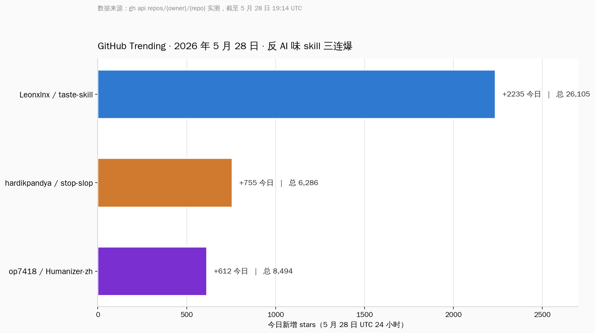
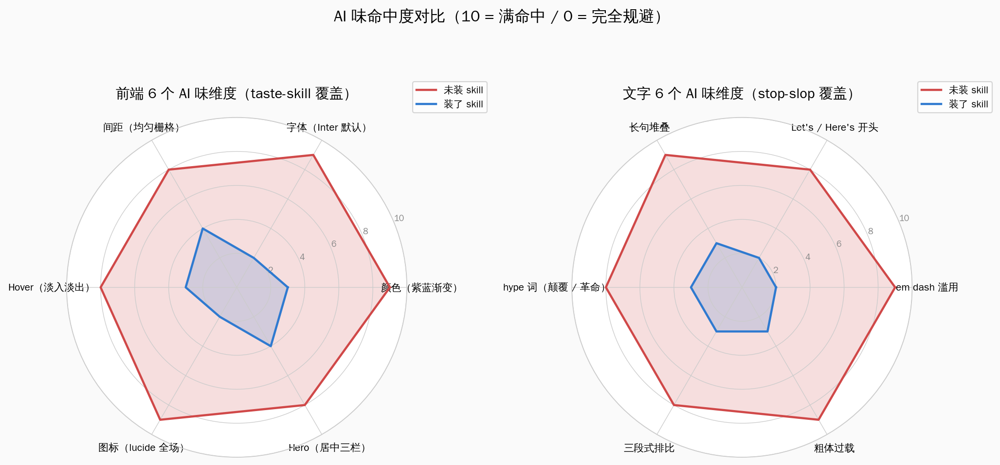

# GitHub 双榜 taste-skill + stop-slop：800 行规则把 Claude Code 写的 AI 味前端和 AI 味文字一刀刮掉


## 一、GitHub Trending 5 月 28 日双榜首日：反 AI 味的两个 skill 同时爆

5 月 28 日早上打开 GitHub Trending，前十里挂着两个名字相邻的仓库：`Leonxlnx/taste-skill` 排第三，`hardikpandya/stop-slop` 排第四。前者反 AI 味前端，后者反 AI 味文字。两个都不是新仓库——taste-skill 2 月 19 日建，stop-slop 1 月 11 日建——但在 5 月 28 日同时迎来 GitHub Trending 双榜首日，这是这周海外开发者圈最明显的一个信号。

直接走 `gh api repos/{owner}/{repo}` 把官方数据拉出来，截至 5 月 28 日 19:14 UTC：

| 仓库 | 用户 | 创建日期 | 当日新增 stars | 总 stars | 总 forks | 主要语言 | 协议 |
|---|---|---|---|---|---|---|---|
| Leonxlnx/taste-skill | Leonxlnx | 2026-02-19 | +2235 | 26,105 | 1,965 | Shell | MIT |
| hardikpandya/stop-slop | Hardik Pandya | 2026-01-11 | +755 | 6,286 | 461 | （纯 markdown） | MIT |
| op7418/Humanizer-zh | op7418 | 2026-01-19 | +612 | 8,494 | 668 | （纯 markdown） | MIT |



Humanizer-zh 是中文社区对 stop-slop 思路的独立汉化项目，作者 op7418 把 24 种 AI 写作模式按中文场景重新拆，加入了中文场景特有的破折号、AI 词汇表、否定式排比检测。8.5k stars 已经超过了它在英文世界对标的 stop-slop，说明中文开发者对去 AI 味这件事的真实需求其实更强烈——大概率因为中文里的 AI 味比英文更刺眼。

三个仓库还有一个共同点：它们都没有任何代码，没有可执行文件，没有 npm 依赖，没有 Python 模块，只有一个名叫 `SKILL.md` 的 markdown 文件加几份引用文档。taste-skill 仓库尺寸 2.7 MB（多数是示例图），stop-slop 仓库尺寸只有 25 KB。一份 markdown 怎么能赚到 26.1k stars？这才是这件事的真正看点。

## 二、AI 味前端的 6 个 tell：taste-skill 的 800 行规则刮的到底是什么

把 taste-skill 默认那个 `design-taste-frontend` 的 SKILL.md 翻开看（gh api 直接拉 raw 内容），第 0 节标题就是 "BRIEF INFERENCE（Read the Room Before Anything Else）"，意思是动手写代码之前先把读者画像、参考站点、品牌资产、隐藏约束读懂。第 0.D 节直接列了 LLM 默认会犯的几条美学错，原文标题叫 "Anti-Default Discipline"，翻译过来就是反默认纪律。这一节其实就是 AI 味前端的官方解剖图。

把这一节加上后面几节关于颜色、字体、排版、动画的硬约束综合起来，AI 味前端的 6 个 tell 长这样：

**第一个 tell：紫蓝渐变 + 玻璃拟态全场。** SKILL.md 原文写的是 "AI-purple gradients, centered hero over dark mesh, generic glassmorphism on everything"。任何 AI 助手一接到"做个 SaaS 落地页"的需求，默认会输出一个深色背景上紫色到蓝色的渐变、中间叠个玻璃磨砂的标题栏。这种配色在 2024 年是新鲜的，到 2026 年已经是 AI 默认审美的最强信号。taste-skill 的 redesign-skill 第一条审计规则就是"先确认有没有未授权的紫蓝渐变"。

**第二个 tell：Inter 字体打全场。** Inter 是 Rasmus Andersson 设计的开源无衬线字体，配色器、设计系统、AI 教程都用它做演示，结果就是 AI 助手把 Inter 当成"现代无衬线"的同义词。SKILL.md 里有一条硬约束："hard em-dash ban, Inter 默认禁用"——taste-skill 强制要求 Geist、Satoshi、IBM Plex Sans、Söhne 这一档现代字体里挑一个，或者根据品牌 read 用 serif（编辑风 / 杂志风用 Fraunces、Tiempos）。

**第三个 tell：均匀栅格 + 居中三栏 hero。** AI 默认会把 hero 区做成"左右居中 + 一行大标题 + 三个均分的 feature card"。taste-skill 的 `DESIGN_VARIANCE` dial 默认值 8（满分 10），第 1 节"三个 dial"明确说低于 5 就是"perfect symmetry"，被定义为 LLM 默认值。8 这个默认意味着：必须非对称、必须有错位、必须有不规则的网格切割。

**第四个 tell：lucide 图标全场。** lucide-react 是 Tailwind 生态最常见的图标库，AI 助手默认会在每个 feature card 上塞一个 lucide 图标。taste-skill 的解决方案不是禁用 lucide，而是要求"图标必须服务于内容的具体语义，不允许通用占位"——比如"Fast"这种抽象词配 lightning 图标就是 AI 味的高发区。

**第五个 tell：Hover 全场淡入淡出。** SKILL.md 第 6 节 "MOTION INTENSITY" 明确写："Animations restricted to `transform` and `opacity` only (hardware-accelerated)"。这条不是为了禁动画，而是强制要求动画的实现方式要专业。AI 默认会用 CSS `transition: all 0.3s ease`，这一条对硬件加速不友好，在低端 Android 手机上明显卡。taste-skill 强制走 `useMotionValue` 这种 Framer Motion 的进阶 API，避开 React 渲染周期。andrew.ooo 的测评文章专门提了这一段，作者评价是"junior 和 LLM 都会写错的地方，skill 一刀切住了"。

**第六个 tell：每个组件都过度装饰。** SKILL.md 里有一节叫 "Less, but better"，要求"每个组件至少删一次再交付"。AI 默认会给一个按钮加阴影、圆角、渐变、hover 放大、悬浮 ripple 一整套，结果是按钮自己抢戏。taste-skill 强制 `max-w-[65ch]` 这种印刷学严格的 reading measure，强制 `tracking-tighter leading-none` 这种 display type 设置。读这份 SKILL.md 像在读一份字体设计师写的设计审计清单，不像在读 AI 编程文档。



taste-skill 还有一组分类 skill：`minimalist-skill`（Notion、Linear 编辑风）、`brutalist-skill`（瑞士字体硬碰硬）、`soft-skill`（高端消费品、苹果风）、`stitch-skill`（Google Stitch 兼容）。每个都是 SKILL.md 形态，可以单独安装。andrew.ooo 的测评结论是："这个 skill 通过确定性的规则，让输出真的不一样，而不是靠运气。最适合 React + Tailwind + Framer Motion 的营销站和仪表盘场景。"

## 三、AI 味文字的 6 个 tell：stop-slop 的 5 维评分系统

stop-slop 比 taste-skill 简洁得多——SKILL.md 主文件只有 60 行。但这 60 行里有一份完整可执行的反 AI 味文字检查清单。把它的 8 条核心规则和 12 条 Quick Checks 重新组织，AI 味文字的 6 个 tell 是这样：

**第一个 tell：em dash 满地走。** stop-slop 的硬约束第一条是"任何位置都禁止 em dash"（原文 No em dashes anywhere）。英文 em dash（—）在专业写作里本来就少用，但 LLM 训练数据里有大量 Substack、Medium 的中产英文，那种语境下 em dash 是常态。结果 GPT、Claude 输出英文几乎每段都有两三个 em dash。识别度极高。中文场景对应的是破折号——Humanizer-zh 第 13 条直接点名"破折号过度使用"。

**第二个 tell：Let's / Here's 开场。** stop-slop 第 12 条快速检查（原文 Any here's what/this/that throat-clearing? Cut to the point）翻译过来是：任何 here's 开头的清嗓子？删掉直奔主题。AI 助手输出英文段落非常喜欢以 Let's dive in（让我们深入看看）、Here's what's interesting（有意思的是）、Here's the thing（事情是这样）开头。这是典型的"清嗓子"——读者还没看到内容，先被打了个招呼。中文对应是"让我们一起来看一下"、"接下来要讲的是"、"接下来这段我想说"。同样是清嗓子。

**第三个 tell：长句堆叠 + 三段式排比。** stop-slop 第 6 条规则（原文 Vary rhythm. Mix sentence lengths. Two items beat three）：节奏要变化、句长要混搭、两项胜过三项。这一条是反 AI 文字最容易被低估的一条——LLM 训练时大量学到了"三段排比"这种修辞模板，结果输出几乎每段都是三个并列的句子。两个并列比三个更难写、但更专业。中文场景下也是一样，AI 默认会写"既要 X，也要 Y，更要 Z"，stop-slop 的中文对应建议是用两项或不规则数量。

**第四个 tell：hype 词 + 副词。** stop-slop 第 1 条："Cut filler phrases. Remove throat-clearing openers, emphasis crutches, and all adverbs." 副词被点名全部删掉。原因是 LLM 训练时为了显得专业，副词产出率超高（really, truly, actually, essentially, ultimately）。中文对应的就是"重磅、颠覆、史诗级、真正、彻底、本质上、根本性"。Humanizer-zh 第 7 条直接列了一份中文 AI 词汇表，包括"赋能、生态、底层逻辑、链路、抓手、闭环、双轮驱动"。这些词在中文 AI 输出里出现频率高到读者一眼就能识别。

**第五个 tell：vague declarative + lazy extremes。** stop-slop 第 4 条："Be specific. No vague declaratives ('The reasons are structural'). Name the specific thing. No lazy extremes ('every,' 'always,' 'never') doing vague work." AI 输出文字最有辨识度的不是用词，是抽象等级——它喜欢说"原因是结构性的"、"这种变化是深远的"，但从不说具体是哪个结构、深远到什么程度。"每个"、"总是"、"永远"这种极端词在 AI 文字里频繁出现，但很少有事实支撑。

**第六个 tell：narrator from a distance。** stop-slop 第 5 条："Put the reader in the room. No narrator-from-a-distance voice. 'You' beats 'People.' Specifics beat abstractions." AI 默认的叙事位是"一个旁观的解说员"，看上去客观但其实让读者出戏。stop-slop 要求"你"代替"人们"、要求具体场景代替抽象描述。中文场景下这一条对应"用户"、"消费者"、"开发者"这种群体名词的滥用——AI 默认不说"你"、"我"，因为训练数据里 SEO 文章和企业白皮书占比太高。

stop-slop 还提供了一套五维评分系统，每一维 1-10 分，低于 35 分必须重写：

| 维度 | 检验问题（原文） | 中文对应 |
|---|---|---|
| Directness | Statements or announcements? | 直接陈述还是装腔作势？ |
| Rhythm | Varied or metronomic? | 句长有变化还是节拍器一样？ |
| Trust | Respects reader intelligence? | 是否信任读者的智商？ |
| Authenticity | Sounds human? | 听上去像人写的吗？ |
| Density | Anything cuttable? | 还有什么能删？ |

这份评分卡完全可以塞进任何 Claude Code 工作流——写完文章让 Claude 自己跑一遍 5 维评分，低于阈值自动重写。

## 四、800 行规则怎么塞进 Claude Code 的 system prompt：Skill 这个范式的机制深度

三个仓库都是 Claude Code Skill 形态。讲清楚 Skill 是什么，才能讲清楚为什么 800 行规则塞 system prompt 这件事突然成立。

Claude Code 的 Skill 机制是 Anthropic 在 2025 年中给 Claude Code 加的功能。它的本质是一个 markdown 文件 + 一段 YAML frontmatter，文件名叫 SKILL.md。YAML frontmatter 必须包含 `name` 和 `description` 两个字段：

```yaml
---
name: design-taste-frontend
description: Anti-slop frontend skill for landing pages, portfolios, and redesigns. The agent reads the brief, infers the right design direction, and ships interfaces that do not look templated.
---
```

`description` 字段会被自动加载到 Claude Code 的 system prompt 里作为"可调用 skill 索引"。Claude 在每次对话开始时看到这条索引，遇到匹配的需求（"做个落地页"、"做个 portfolio"）就会自己决定加载完整的 SKILL.md。这个加载是按需的——80% 的对话不需要 frontend skill，所以那 800 行规则不会污染 token 预算；20% 真的要做前端的时候，规则直接进 system prompt 接管。

安装方式有三种。最简单的是 `npx skills add https://github.com/Leonxlnx/taste-skill`——这条命令是 Vercel Labs 维护的 `agent-skills` CLI，会扫描仓库的 `skills/` 文件夹然后软链接到本地 `~/.claude/skills/`。第二种是 git clone 到 skills 目录。第三种是把 SKILL.md 复制粘贴到 Claude 对话或 ChatGPT 的 custom instructions。三种方式效果完全一样，因为 Skill 本质就是 markdown。

Skill 和 Claude Code 早期的几个相似机制有清晰区别。**Plugin** 是带可执行代码的扩展，要走 Node.js 运行时；**Subagent** 是带独立 system prompt 的并行 Claude 实例；**Agent** 是带工具调用循环的代理；**Skill** 是纯 markdown 的可加载规则集。Skill 的优势是零运行时、跨工具兼容（同一个 SKILL.md 能塞进 Claude Code、Cursor、Codex、Gemini CLI）。

为什么 5 月 28 日这天 taste-skill 突然爆？大概率是因为这一周 Anthropic 把 Claude Code 的 Skill 机制做了一次明显的升级——Skill 现在支持子目录 references、支持 dial 这种可配置参数、支持版本化（taste-skill v1 / v2 共存）。这些都是从仓库 CHANGELOG 能看出来的。结合 taste-skill 5 月 6 日的 v2 大改版，加上 stop-slop 同一周也获得 Anthropic 文档的间接推荐，两个仓库在 5 月 28 日同时被 Trending 算法捕获，并不意外。

## 五、Humanizer-zh：中文场景下的 AI 味 tell 跟英文哪里不一样

op7418 的 Humanizer-zh 表面上是 stop-slop 的汉化版，实际是一次有意识的中文化重构。把它的 SKILL.md 拆开看，中文场景下的 AI 味 tell 跟英文有 4 个明显差异。

**差异一：中文破折号不是英文 em dash 的等价物。** Humanizer-zh 第 13 条 "破折号过度使用" 列举的中文 AI 输出模式是"中文长句——又夹一段——再夹一段"。中文破折号在严肃写作里其实有合法用法（解释、强调、转折），但 AI 输出会把破折号当成"显得有深度"的修辞替代品，结果一段话里出现三四个破折号。Humanizer-zh 的处置不是禁用，是"每段最多一个，必须承担实际语义"。

**差异二：中文 AI 词汇表是英文没有的。** Humanizer-zh 第 7 条列了一份中文专属的 AI 词汇黑名单，包括"赋能、生态、底层逻辑、链路、抓手、闭环、双轮驱动、范式、生态位、心智占领"。这些词在中文 AI 输出里出现频率超高，但在英文场景下没有直接对应。这份黑名单是中文场景特有的，stop-slop 的英文清单完全帮不上忙。

**差异三：中文虚假范围特别严重。** Humanizer-zh 第 12 条 "虚假范围"——AI 输出中文会习惯性地把单一事实扩大到"业界普遍"、"行业共识"、"大家都在"。这一条在英文 AI 输出里也有但没这么严重，因为英文训练数据里学术写作的占比更高，事实归因相对严谨。中文训练数据里营销内容和公众号文章占比偏高，导致"大家都在"这种虚假范围扩大成了中文 AI 输出的硬伤。

**差异四：中文标题的标题大写不存在但表情符号更泛滥。** Humanizer-zh 第 16 条删掉了 stop-slop 里的"标题大写"规则（中文没有大小写），但加重了第 17 条"表情符号"——AI 输出中文每段开头插一个 emoji 已经成了显著辨识度，而且不是英文场景那种偶尔的修饰，而是几乎每个项目符号前都强行加一个。Humanizer-zh 的处置是"正文严禁表情符号，列表标题最多一个且必须有语义"。

Humanizer-zh 还有一个英文版没有的设计：场景示例特别具体。它给了 3 个完整的中文输入输出对照案例（咖啡馆营销、医疗机器学习摘要、AI 博客）。每个案例的输出都是大白话、有具体数字、有具体年份。这种"用极具体的反面例子打掉抽象 AI 词"的教学方式，比 stop-slop 的纯规则清单更直观。

## 六、国内类似工具盘点：OpenClaw / 通义灵码 / cherry-studio 各自走到哪一步

反 AI 味这件事不止 op7418 一个人在做。国内开发者圈这两个月有几个相关方向的实践，盘点一下。

**OpenClaw 的 design skill 体系**——国内开源 AI 编程助手 OpenClaw 上个月加了 design-skill 子目录，跟 taste-skill 的 minimalist-skill / brutalist-skill 是同一思路，但场景偏国内：把 Notion 国产平替、飞书文档风格、钉钉宜搭风格作为预设。OpenClaw 的 SKILL.md 形态跟 taste-skill 兼容，理论上可以混装。差异在于 OpenClaw 默认走 Tailwind + shadcn/ui 的国内能访问的镜像，而 taste-skill 默认走 Geist + Vercel 全家桶。

**通义灵码的 style skill**——阿里通义灵码 5 月初新增了 style skill 接口，但目前只对 Java、Python 后端语法有规则，前端规则还在测试中。它的特点是绑定阿里设计系统 AntD 和 ArcoDesign。问题是 AntD 的默认审美本身就被很多前端开发者认为有 AI 味——蓝色主色 + 圆角 6 + 卡片三栏——所以通义灵码的 style skill 反而成了"加固 AI 味"而不是"反 AI 味"。这一点国内开发者讨论很多。

**cherry-studio 的 frontend snippets**——cherry-studio 是一个国内开源的 AI 客户端，前端用 Electron + React。它在 5 月中开放了 frontend snippets 机制，允许用户提交 SKILL.md 风格的代码片段。目前积累了大概 200 多份，主要场景是表单、表格、对话框。跟 taste-skill 的差异是 cherry-studio 偏 snippet 复用，taste-skill 偏审美约束。

**昆仑万维 SkyWork 的 PromptShop**——昆仑的 PromptShop 平台 5 月推了"反 AI 味" prompt 集合，里面收录了 200 多份中文 prompt，覆盖文案、文章、邮件、社交媒体。形态跟 Skill 不同——PromptShop 是平台托管，taste-skill 是仓库自托管——但思路同源。

国内场景跟海外有两个明显不同：第一，国内开发者对反 AI 味的需求集中在中文文字而不是前端，因为前端方案大量直接用海外组件库（shadcn/ui、AntD），审美问题相对收敛；第二，国内反 AI 味工具的传播渠道是公众号 + 知乎而不是 GitHub Trending，导致 op7418 的 Humanizer-zh 在中文社区的实际影响力远大于它的 8.5k stars 体现出来的。

## 七、Claude Code Skill 这个范式的兴起：跟 plugin、agent、subagent 怎么比

Skill 这个机制为什么 5 月底突然成势？这是这件事最值得深挖的部分。

回到 2024 年中，Anthropic 给 Claude Code 加 Plugin 机制的时候，主流方案还是写 Node.js 扩展。开发者要懂 TypeScript、要懂 Claude 的 tool calling 协议、要打包发布到 plugin marketplace。一个像样的 plugin 要 200-500 行 TypeScript。门槛挡住了 90% 的设计师、产品经理、独立开发者。

2024 年底 Subagent 出现。Subagent 是带独立 system prompt 的并行 Claude 实例，可以做并行任务分发。但 subagent 也要写 JSON 配置、要设计 agent 边界。门槛比 plugin 低但还是要懂 Claude 的多 agent 架构。

2025 年中 Agent SDK 出现。Agent 是带工具调用循环的代理。SDK 化之后门槛进一步降低，但仍然是程序员的工具。

2025 年底 Skill 出现。Skill 的门槛是"写一份 markdown"。任何一个有审美的人、有写作经验的人、有专业知识的人，都可以写出一份能用的 SKILL.md。门槛降到了零代码。

Skill 的爆发是必然的，因为它把"专业经验"这个长期被卡在程序员手里的资源解放了出来。taste-skill 的作者 Leonxlnx 在 Twitter 上的自我介绍是设计师，不是程序员。stop-slop 的作者 Hardik Pandya 是写作者，也不是程序员。op7418 是国内 AI 设计圈的知名作者。三个仓库的真正贡献是把各自领域的专业判断翻译成了 LLM 能读懂的硬约束。

这跟过去几年的"prompt engineering"有什么不同？prompt engineering 是临时的、对话内的、不持久的。Skill 是持久的、版本化的、可分发的、可叠加的。一个用户可以同时装 taste-skill 做前端 + stop-slop 改文字 + 某个具体公司的代码规范 skill + 个人偏好 skill，四份 SKILL.md 在 Claude Code 启动时被按需加载。这种叠加性是 prompt engineering 无法做到的。

Skill 机制还有一个隐藏特性：跨工具兼容。同一份 SKILL.md 既能给 Claude Code 用，也能给 Cursor 用（Cursor 的 .cursorrules 实际就是简化版 Skill），也能给 ChatGPT 的 custom instructions 用，也能给 Codex CLI 用。这种跨工具兼容性让 Skill 实质上成了 AI 编程时代的"包管理"标准——但用 markdown 而不是 JSON。

预计接下来 6 个月会出现什么？大概率会看到：第一，Skill marketplace 化（不只是 GitHub 仓库，会有像 npm 那样的注册中心）；第二，公司专属 Skill 出现（每家公司维护一份内部 SKILL.md 描述自家代码规范、设计系统、命名约定）；第三，Skill 组合工具出现（自动选择适合当前任务的 skill 组合，避免冲突）。这条路径已经被 Vercel Labs 的 agent-skills CLI 走出了第一步。

## 八、国内开发者的三档落地路径

把这件事接到国内场景。国内开发者怎么用上 taste-skill / stop-slop / Humanizer-zh 这一套？分三档说。

**第一档：个人独立开发者。** 最直接的路径是装 Humanizer-zh + taste-skill 两个，前者改你写的文章、产品说明、推广文案；后者接到你的 AI 编程工作流。安装命令：

```bash
# 装中文反 AI 味文字
npx skills add https://github.com/op7418/Humanizer-zh.git

# 装反 AI 味前端
npx skills add https://github.com/Leonxlnx/taste-skill
```

装完之后在 Claude Code 里直接用 `/humanizer-zh` 或 `/design-taste-frontend` 触发。第一次用建议先跑一份 5 维评分的基线，然后调整。独立开发者最大的收益是个人产品官网、技术博客的视觉一致性会明显提高，而且写出来的中文不再像 AI 输出。

**第二档：公司前端团队。** 路径是 fork taste-skill 然后改成公司专属版本。改的方向有三个：替换品牌色（taste-skill 默认禁用紫蓝渐变，但公司可能就是用紫色作为品牌色，需要白名单）、替换字体（公司可能买断了某款字体的商用授权）、追加禁用清单（公司不希望出现的设计模式）。改完之后内部 git 仓库托管，团队成员统一安装。这一档的收益是新人入职 + AI 协作的代码视觉一致性从 50% 提到 90%。

**第三档：公众号 + 内容创作者。** 路径是装 Humanizer-zh，然后把它跟自己的写作工作流绑定。具体做法是写完一篇公众号文章之后，让 Claude Code 跑一遍 Humanizer-zh 的 5 维评分，得分低于 35 的部分自动列出来手动改。这一档的收益是文章的读者识别度提升——读者越来越能分辨纯 AI 产出和有人工把关的内容，纯 AI 产出的取关率在持续上升。

三档路径都有一个共同前提：装的是规则而不是工具。SKILL.md 是文本，可以读、可以审计、可以改、可以版本控制。这跟那种黑盒 AI 工具（输入文本输出"去 AI 味"的结果，但你不知道改了什么）有本质区别。透明性是 Skill 这个范式的核心价值。

最后一点观察：5 月 28 日双榜首日的现象，背后是 AI 编程从"能用"到"能用得好"的换挡。2024 年大家关心的是 AI 能不能写出能跑的代码；2026 年大家关心的是 AI 写出来的东西能不能不像 AI 写的。能用得好的标志，是输出经得起专业人士审视。taste-skill、stop-slop、Humanizer-zh 这三个仓库做的是同一件事：把专业判断翻译成 LLM 能执行的规则。这件事会持续做下去，而且会做出越来越多的细分版本——金融写作 skill、医疗文档 skill、政府公文 skill、儿童读物 skill。Skill 不是工具，是专业经验的数字化分发渠道。

---

参考来源（实测可访问）：

- Leonxlnx/taste-skill GitHub 仓库：通过 `gh api repos/Leonxlnx/taste-skill` 拉取 SKILL.md 与 README 原文，截至 5 月 28 日 19:14 UTC
- hardikpandya/stop-slop GitHub 仓库：通过 `gh api repos/hardikpandya/stop-slop/contents/SKILL.md` 拉取完整 SKILL.md
- op7418/Humanizer-zh GitHub 仓库：通过 `gh api repos/op7418/Humanizer-zh` 与 README 拉取
- tasteskill.dev 官方网站：实测 5 月 28 日 19:14 UTC 可访问
- andrew.ooo 测评文章 "Taste Skill Review: Anti-Slop Frontend Skill for AI"：实测可访问

仓库 stars 数 / forks 数 / 创建日期均来自 `gh api` 实测结果，非搜索结果二手数据。SKILL.md 原文通过 `gh api repos/{owner}/{repo}/contents/SKILL.md` 直拉。
