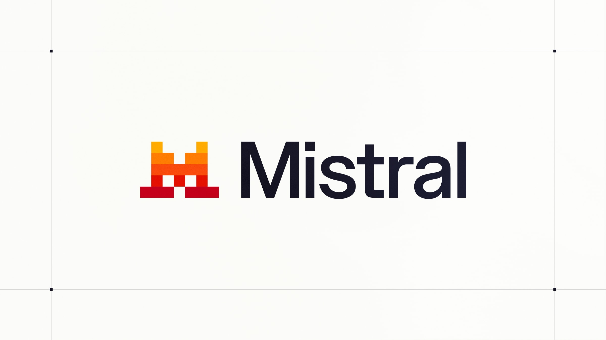
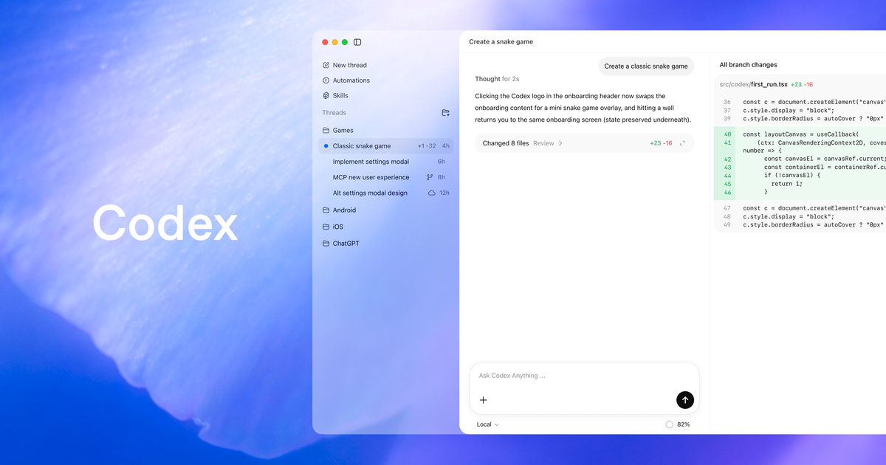
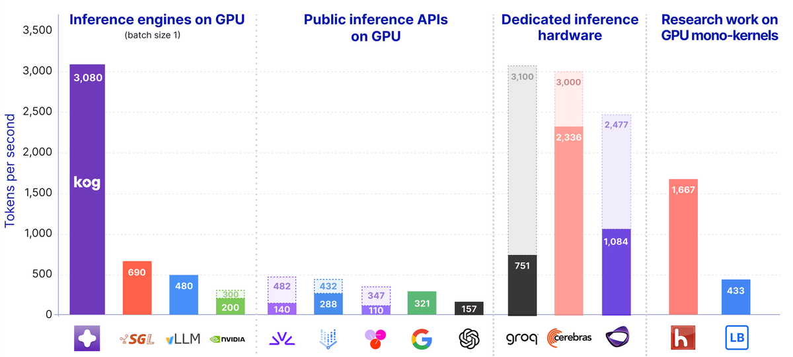
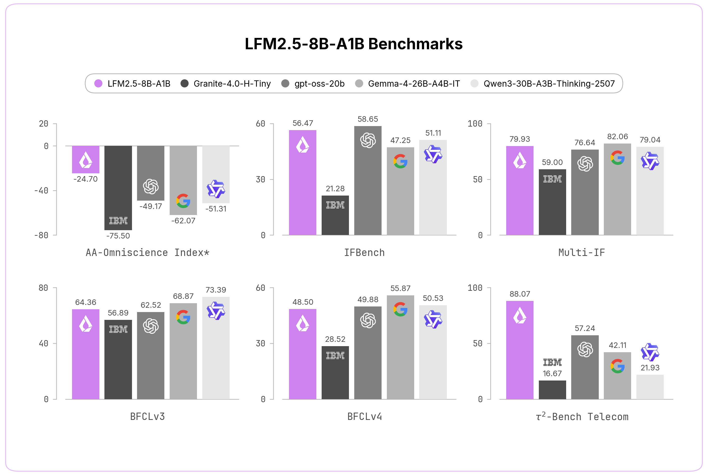
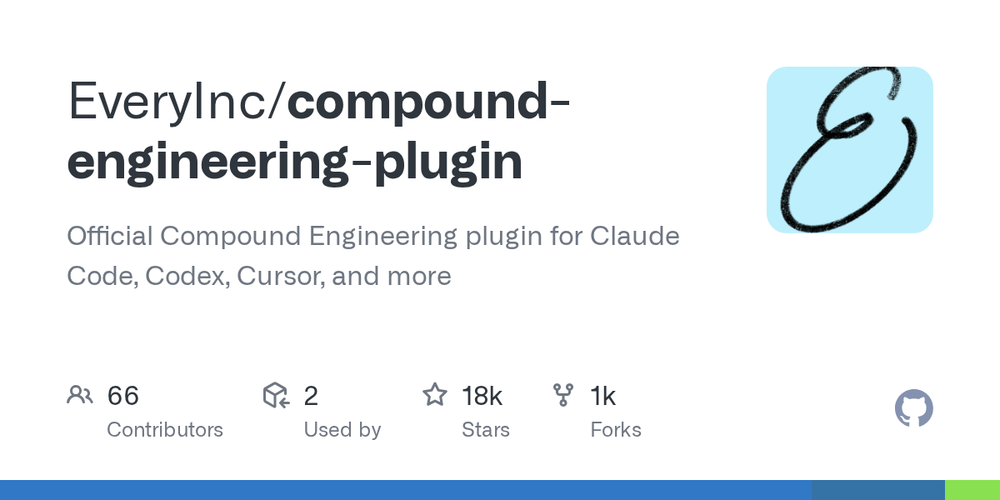

# Mistral 把 Le Chat 改名 Vibe 转身做全栈编码 · Codex 学会操作 Windows 桌面 · 讯飞 40 克眼镜同传 122 语言 | AI 日报 | 2026-05-30

## 📋 头版目录

- 🚀 Mistral 5-28 把 Le Chat 升级改名 Vibe，一个 agent 一套订阅覆盖工作与编码 → 头条 1 / AI Coding
- 🛠 Vibe 编码模式是远程编码 agent，web / VS Code 扩展 / CLI 三端，连 GitHub 沙箱里写到 PR → 头条 1.1
- 💰 定价 Free / Pro 14.99 美元一月 / Team 24.99 美元每人月 / Enterprise 定制 → 头条 1.2
- 🧠 两条线都跑在 Mistral 旗舰模型上，发布通篇不刷 SWE-Bench 榜单 → 头条 1.3
- 🇨🇳 科大讯飞 5-28 在澳门 BEYOND Expo 发布首款 AI 眼镜，端到端同传大模型进镜腿 → 头条 2 / 国内 AI
- 🧠 122 种语言含方言口音实时互译，覆盖 200 多个国家地区，18 语种离线 → 头条 2.1
- 🛠 整机 40 克、售价 4299 元、6 月 15 日预售，唇动识别配气导骨传导降噪 → 头条 2.2
- 🧠 端到端同传与传统级联式同传的区别：少一道转写中转，延迟更低 → 头条 2.3
- 🚀 OpenAI Codex 5-29 把 Computer Use 扩到 Windows，能看点打字操作桌面应用 → 头条 3 / AI Coding
- 🛠 远程控制支持 Windows 设备，可从 iOS / Android / Mac 发起任务 → 头条 3.1
- 🛠 配套 Codex CLI 0.135.0：codex doctor 诊断、Vim text-object、命名权限 profile → 头条 3.2
- 🧠 Liquid AI 发布端侧 MoE 模型 LFM2.5-8B-A1B，总参 8.3B 每 token 激活 1.5B → 要闻
- 🏭 KOG 公布 LaneFormer，单请求解码做到 3000 tokens/s（8×MI300X，无量化） → 要闻 / 名人说
- 🧠 腾讯 Hy3 在 OpenRouter 用量榜断层登顶，标价低于 DeepSeek → 要闻 / 名人说
- 🇨🇳 比亚迪 5-28 发布璇玑 A3，号称中国首款 4nm 车规智驾芯片、已开放量产 → 国内 AI
- 🇨🇳 腾讯香港 Cloud Day 发布创意设计版智能体工作室 Miora → 国内 AI
- 🔥 EveryInc/compound-engineering-plugin 把多步开发流程封装成可复用 agent，18,124 stars → GitHub
- 🔥 cursor/plugins 官方插件规范开放，对标 Claude Code 插件生态 → GitHub
- 🎙 Max Woolf 拆穿 Hy3「最便宜」的标价假象：算上缓存 DeepSeek 输入更便宜 → 名人说
- 🎙 Simon Willison 判断 agent 这个词终于有了够用的共识定义 → 名人说
- 🛠 liteparse 用 Rust 全量重写，小文档解析最高提速到原来的 100 倍 → 快讯

## 🔥 头条深度

### 头条 1 · Mistral 把 Le Chat 升级改名 Vibe：从只做模型，转身做覆盖工作与编码的全栈 agent

5 月 28 日，Mistral 把用了两年多的 Le Chat 升级，并直接改名为 Vibe [1]。这不是单纯换个名字——过去 Le Chat 是一个对话助手，现在 Vibe 被定义成一个 agent：一套账号、一套订阅，同时管「工作」和「编码」两件事。对一家此前以开放权重模型立身的欧洲公司来说，这是一次重心从「只做模型」往「做完整产品」的明显移动。

对国内开发者来说，最值得对照的锚点是 Claude Code 和 Cursor：它们都在做「从需求到 Pull Request」这条链路，Vibe 这次正式把自己摆进了同一张牌桌。

#### 头条 1.1 · 编码模式：连 GitHub，在沙箱里从需求写到 PR

Vibe 的编码模式（Code Mode）是一个远程编码 agent，web、VS Code 扩展、CLI 三端都能用 [1]。它能连上 GitHub 仓库，在隔离沙箱里从一句需求开始，自己写代码、写测试、做重构、跨语言翻译，最后提交一个 Pull Request；过程中能读 GitHub、Jira 里的项目上下文，知道这个仓库平时是怎么协作的。

和它并排的工作模式（Work Mode）则面向企业知识场景：跑内部知识检索、结构化数据分析，以及按日、周、月周期编排的长任务。两种模式共享同一个 agent 底座，区别只是面对的活不同。

#### 头条 1.2 · 定价分四档，编码不再单独买单

Vibe 按四档订阅卖：免费版、Pro 每月 14.99 美元、Team 每人每月 24.99 美元、Enterprise 走定制合同 [1]。值得注意的是，编码能力不再是一个需要单独付费的产品，而是和工作能力打包进同一档订阅——这和「编码 agent 单独成一条产品线、单独计价」的做法是两种思路。

#### 头条 1.3 · 不刷榜，押注平台形态

这次发布有一个反常之处：通篇没有拿 Vibe 去刷 SWE-Bench 之类的编码评测榜，没有亮出某个百分比来证明自己更强。官方口径只说两条线都跑在 Mistral 针对推理、智能体任务、工具调用和编码优化过的旗舰模型上 [1]。换句话说，模型层依旧是 Mistral 的老本行，但这次它把叙事重心放在了平台形态和部署灵活性上，而不是单点能力的榜单数字。

**产业含义**：模型本身越来越难成为护城河时，把模型包进一个能持续收费的产品，是几乎所有模型公司都要走的一步。Vibe 的意义不在于它编码有多强，而在于一家以开放权重著称的公司，开始认真把「工作面」当作主战场——这条路 OpenAI、Anthropic、Google 都在走，现在欧洲这一家也正式入场了。

### 头条 2 · 讯飞把端到端同传大模型塞进 40 克眼镜：122 种语言实时互译

5 月 28 日，澳门 BEYOND Expo 2026 的展台上，科大讯飞（iFLYTEK）拿出了首款 AI 眼镜 [3][4]。整机 40 克、售价 4299 元、6 月 15 日开启预售。光看这几个数字，它和这两年密集冒头的 AI 眼镜没太大差别；真正的不同，藏在镜腿里。

#### 头条 2.1 · 122 种语言，18 语种离线

这副眼镜把讯飞自研的端到端语音同传大模型直接装进了镜腿，支持 122 种语言（含方言、口音）的实时互译，覆盖全球 200 多个国家和地区，其中 18 个语种支持离线翻译 [3][4]。对经常要和不同母语的人打交道的人来说，「不掏手机、不点 App、对面一开口就出译文」是它想解决的核心场景。覆盖词库还做了 17 个行业的专业术语，应对专业对话。

#### 头条 2.2 · 40 克的舒适度，是靠唇动识别和多麦降噪换来的

40 克这个重量，意味着它要做成接近普通眼镜的形态，而不是一个挂在脸上的设备。更关键的是嘈杂环境下的识别——讯飞用前置摄像头锁定佩戴者的唇动，配合 5 颗气导麦克风加 1 颗骨传导麦克风一起降噪，官方称识别准确率提升超过 50% [4]。在机场、展会、餐厅这类背景音很重的地方，能不能把「对面那个人说的话」从一片嘈杂里单独拎出来，是同传眼镜好不好用的分水岭。

#### 头条 2.3 · 端到端同传，和传统的「级联式」差在哪

讯飞反复强调的是「端到端」三个字。传统的语音翻译走的是级联路线：先把语音转成文字，再把文字翻译成另一种语言，最后合成语音——中间每一道转换都会累加延迟和误差。端到端同传把这几步合成一套模型直接做，少了中间转写这道中转，延迟更低、语气和上下文也更容易保住。这正是把一个大模型「塞进」端侧设备的价值所在：模型越靠近用户，链路越短，体验越接近「即说即译」。

**产业含义**：个人 AI 硬件和端侧模型，是本日报长期看好的方向。AI 眼镜这条赛道上已经站着 Ray-Ban Meta、小米、华为、雷鸟、字节几家，各有侧重；讯飞的差异化打法很清楚——不拼拍照、不拼社交，而是把自己最强的语音同传能力做成这副眼镜的唯一主线。当一个能力足够刚需、又能在端侧跑起来，它就有机会成为一类硬件的存在理由。

### 头条 3 · OpenAI Codex 把 Computer Use 扩到 Windows：编码 agent 开始操作整台桌面

5 月 29 日，OpenAI 在 Codex 的更新日志里加了一条不起眼但方向感很强的能力：Computer Use 扩展到 Windows [2]。简单说，Codex 现在不只是在云端帮你写代码，它能在 Windows 上「看屏幕、移动鼠标、敲键盘」，直接操作桌面应用。

#### 头条 3.1 · 从「写代码」到「操作整台电脑」

这次更新（版本号 Windows 26.527）让 Codex 能直接驱动 Windows 桌面：看到界面、点击控件、输入文字 [2]。同时，远程控制也支持 Windows 设备了——你可以从 iPhone、安卓手机或 Mac 上发起一个任务，让它在远端那台 Windows 机器上跑。Profile 页面还新增了用量统计和 token 活动展示，方便看自己到底花了多少。

一个原本只在终端里写代码的工具，开始具备「操作一整台电脑」的能力，这是编码 agent 往通用桌面 agent 演进的一小步。它意味着「自动化」的边界从代码文件，扩到了任何一个有图形界面的软件。

#### 头条 3.2 · 配套的 Codex CLI 0.135.0：诊断、Vim 编辑、命名权限

就在前一天 5 月 28 日，Codex CLI 也更到了 0.135.0 [2]。这一版偏开发者日常体验：新增 `codex doctor` 增强诊断，能一次性检查环境、Git、终端、app-server 和线程清单；Vim 模式加入了 text-object 编辑和可配置的中断键位；权限 profile 支持命名后选择；Python SDK 还暴露了「友好沙箱预设」，简化调用。

**产业含义**：今天这三条头条其实是一条线——Mistral 把工作和编码合进一个 agent，讯飞把模型塞进眼镜贴着用户的耳朵，Codex 让 agent 直接接管桌面。它们都在做同一件事：让 AI 从一个你打字提问的对话框，变成一个能在你真实工作环境里动手的存在。对开发者来说，「能操作桌面的 agent」是值得提前留意的能力，安全边界和权限控制会是它能不能放心用起来的关键。

## ⚡ 快讯速览

- **liteparse 用 Rust 全量重写，小文档解析最高提速到原来的 100 倍**。LlamaIndex 把开源文档解析器 liteparse 用 Rust 重写，小文档提速 5 到 100 倍、大文档约 3 倍，一份 457 页、100MB 的 PDF 只要 0.777 秒；支持 PDF、Office 文档等数十种格式，新增 Rust / Python / JS / WASM 四端分发，能在浏览器和边缘环境跑，不绑专有大模型 [8][9]。GitHub 上 7,300 stars、Apache 2.0。待观察的是它在中文版式复杂文档（表格、公式、竖排）上的解析质量是否同样稳。

- **HuggingFace diffusers 五月版集中补多模态生成管线**。这一版给开源扩散库新增了若干图像与多模态生成管线，包括以稀疏 MoE 做图像生成的 NucleusMoE-Image（17B 总参、约 2B 激活）等 [11][12]。对做本地图像生成的人来说，开源管线越全，绕开闭源 API 自己搭一条生成链路的门槛就越低。后续值得看这些新管线在消费级显卡上的真实显存占用。

- **MCP 2026 路线图把协议核心推向「无状态」**。Model Context Protocol 的 2026 路线图把协议核心往无状态方向改，并规划了服务端渲染 UI、长任务扩展、贴近 OAuth/OIDC 的授权等能力 [13]。无状态化是为了让 MCP 更好地架在网关、负载均衡后面做生产部署。MCP 是本日报长期跟踪的一条线，能不能在保持简单的同时撑住企业级部署，是接下来几个月要持续看的。

## 🎙 名人说 & X 热议

**Max Woolf：榜单「最便宜」是假象，算上缓存 DeepSeek 输入反而更便宜。** 腾讯 Hy3 这几天在 OpenRouter 的用量榜断层登顶，标价每百万 token 0.066 美元，低于 DeepSeek 的 0.10 美元，看起来是「最便宜」的赢家。开发者 Max Woolf 写了一篇短文泼了冷水 [10]：真实成本要算 prompt 缓存——如今绝大部分 LLM API 成本是输入 token，而输入 token 会被大量缓存命中。把缓存折扣算进去后，DeepSeek 在官方渠道的输入实际只要每百万 token 0.018 美元（缓存读取只收 2%），比 Hy3 算上缓存后的实际单价还便宜近一倍。他的判断是：Hy3 登顶更可能是某个「单一大客户做大批量数据处理」带来的量，而不是它真有性价比优势。这是一条「榜单数据不等于真实性价比」的清醒提醒，对照着看格外有用。

**KOG 单请求 3000 tokens/s 的工程争议。** 推理初创 KOG 公布自研 LaneFormer 架构加协同设计的推理引擎，声称在 8 张 AMD MI300X 上、batch=1 单请求能跑到 3000 tokens/s（H200 上 2100），不靠量化也不靠投机解码 [7]。HN 上的讨论很快聚焦到一个折扣问题：H200 的理论带宽天花板约 7700 tokens/s，实测只到 2100，中间约 3 倍的差距去哪了？KOG 自报的显存带宽利用率（MBU）只有 36%，说明 KV cache 流量、非矩阵乘算子和同步开销吃掉了大半。值得点明的是，这是一个 2B 小模型加引擎深度协同的速度展示（HumanEval 仅 50%），亮点在工程，不能当成通用大模型的速度来读。

**Simon Willison：agent 这个词，终于有了够用的共识定义。** 在 agent 一词被各家用到几乎失去意义之后，Simon Willison 撰文判断，业界对它的理解现在终于收敛到了一个「够用」的程度，可以当作有效的行话来用了 [19]。这种术语层面的共识看似无关紧要，实际很重要——当大家说 agent 时指的是同一类东西，关于 agent 的讨论、产品对比和能力评估才有了共同的坐标。

**X 热议：AI 辅助前端，是不是在重演「失落的十年」？** 一篇标题为《AI 是否在重演前端的失落十年》的文章在 Hacker News 上拿到 272 分、236 条评论 [20]。作者的担心是：AI 大量代写前端代码，可能正在重演 2015 年前后前端工具链爆炸、复杂度失控的那段历史——代码写得更快，但整体可维护性反而更糟。这是一条没有单一作者背书、却引发广泛共鸣的行业反思，值得做技术决策的人放在心里掂量。

## 📰 精选要闻

- 🔴 **Liquid AI 发布端侧 MoE 模型 LFM2.5-8B-A1B**。Liquid AI 发布面向端侧的稀疏 MoE 模型 LFM2.5-8B-A1B：总参数 8.3B，但每个 token 只激活 1.5B，支持 128K 上下文，定位手机、笔记本、机器人上的本地工具调用与推理 [5][6]。官方给的指标里，指令遵循 IFEval 拿到 91.84（较上代提升 12.40），数学 MATH500 88.76。它的思路很直白——用「总参数大、单次激活小」的 MoE 结构，在端侧设备有限的算力下尽量保住能力。这是端侧模型走 MoE 路线的一个代表性发布。

- 🟡 **KOG 公布 LaneFormer，把单请求解码做到 3000 tokens/s**。推理初创 KOG 公布 LaneFormer 2B 模型加协同设计的推理引擎，在 8 张 MI300X、batch=1 下达到每请求 3000 tokens/s [7]。它专攻的不是吞吐，而是单请求低延迟——这正好对应 Agent 那种「一步接一步连续调用模型」的场景，每一步都快，整条链路才快。核心技术是把整条解码路径编译成一个持久化的单核（monokernel），消掉逐个 kernel 启动的开销。能力有限但方向有新意，工程细节见上文名人说。

- 🔵 **腾讯 Hy3 在 OpenRouter 用量榜断层登顶**。腾讯 Hy3 模型在 OpenRouter 的用量排行榜上断层登顶，标价每百万 token 0.066 美元 [10]。不过这个「最便宜」的标签经不起细算——把 prompt 缓存折扣算进去后，性价比格局会反转（见名人说 Max Woolf 的拆解）。它更像是一个提醒：选模型不能只看挂出来的标价，要看你的实际调用里有多少能命中缓存。

## 🇨🇳 国内 AI 观察

- 🔴 **比亚迪发布璇玑 A3，号称中国首款 4nm 车规级智驾芯片**。5 月 28 日，比亚迪在深圳全球总部的「敢为」智能战略发布会上推出自研智驾芯片璇玑 A3，称其为中国首款 4nm 车规级智驾芯片，已开放量产，面向 L3 / L4 自动驾驶 [14][15]。规格上，单板三颗 NPU 协同、总算力超 2100 TOPS，16 核 CPU、DDR 带宽 273GB/s，厂商称同级单位功耗约低 20%，面向的是高阶智驾对大算力车端芯片的需求。智驾芯片这种把大算力做进车规、做到量产的硬件，是国产芯片真正落到产品层的一个标志——不是 PPT，而是要装进能上路的车里。

- 🟡 **腾讯发布创意设计版智能体工作室 Miora**。腾讯在香港 Cloud Day 上发布了智能体创意工作室 Miora，主打用对话生成图像、品牌视觉、完整视频和 UI/UX 设计稿 [16]。它和腾讯此前的 CodeBuddy、WorkBuddy 共用同一套底层架构，专攻创意设计这一垂直方向，内置记忆系统和可定制的技能（Skills），国际版同步内测。对设计和内容工作者来说，又多了一个把「想法到成稿」交给 agent 的国内选项。

- 🔵 **面壁智能开源周收口，端侧能力集中放出**［跟进］。面壁智能在 5 月 25 到 29 的开源周里集中放出了 BitCPM-CANN、MiniCPM5-1B、ForgeTrain 等一批项目，主线是端侧 AI 和昇腾适配，OpenBMB 的开源星标已超 13 万 [17]。其中 MiniCPM5-1B、ForgeTrain 本日报近期已单独报道，这里作为开源周的整体收口，端侧这条线国内仍在密集投入。

- 🔵 **DeepSeek V4 与昇腾芯模协同，国产算力生态继续补位**［跟进］。继 DeepSeek V4 发布后，国内媒体梳理了它与华为昇腾的芯模协同进展：CANN 生态覆盖率在 8 个月内从近零升到 80% 到 90% 区间，部分求解器场景拿到数十倍加速 [18]。这是 V4 发布之后的生态侧后续，不是新模型，但它说明国产算力软件栈在快速补位——模型和芯片越贴合，国产这条路才越走得通。

## 📦 GitHub Trending

- 🔴 **EveryInc/compound-engineering-plugin**（18,124 stars，约 +350/日）[21]。面向 Claude Code、Codex、Cursor 的「复合工程」插件，把「计划 → 实现 → 审查」这套多步开发流程封装成可复用的 agent 流程。TypeScript 实现，最近持续在推送，是 AI Coding 工具往「把工作流标准化」方向走的一个活跃代表。

- 🟡 **cursor/plugins**（1,294 stars）[22]。Cursor 官方刚开放的插件规范加官方插件集合，对标 Claude Code 的插件生态。体量不大，但来源权威——它是「AI 编辑器插件标准化」趋势的一手信号，几家编辑器都在抢这套生态的标准。

- 🟡 **galilai-group/stable-worldmodel**（1,240 stars）[23]。一个可复现的世界模型（world model）研究与评测平台，Python 实现。世界模型方向少见的开源评测基建，对做这块研究的人来说是个能直接上手的底座。

- 🟡 **jmaczan/tiny-vllm**（258 stars，Show HN 上首页）[24]。用 C++/CUDA 从零手写的 vLLM 精简版高性能推理引擎，主打教学和可读性。配合今天 KOG 那条推理引擎的话题看正好——想真正读懂推理引擎内核怎么运作，这种「小而全」的实现比直接读 vLLM 源码友好得多。

- 🟡 **Crosstalk-Solutions/project-nomad**（26,950 stars）[25]。一台离线自包含的「随身电脑」，内置离线 AI 加本地知识库，断网也能用。它属于边缘 / 离线 AI 题材，把模型和知识完整装进一个不依赖云的盒子——本地优先这条路，在没有网络的场景里有它实在的价值。

## 🛠 AI Coding 工具动态

- **Claude Code 5-28 增量更新**。Claude Code 这次给 git 插件市场源加了 `skipLfs` 选项；`/model` 命令的选择现在会保存为新会话的默认值；`claude agents` 自动补全开始建议原生 slash 命令和内置技能；状态栏命令能拿到终端的 `COLUMNS` / `LINES` 环境变量。都是小改进，但 `/model` 存默认值、agents 补全技能这两条对每天用它的人来说挺省事。

- **Mistral Vibe 与 Codex 的桌面化，重画了编码 agent 的边界**。把今天头条 1 和头条 3 放一起看，编码 agent 的竞争正在从「谁写代码更准」扩到「谁能接管更大的工作面」——Vibe 把工作和编码合一，Codex 直接去操作 Windows 桌面。Claude Code、Cursor、Codex、Vibe 四方现在比的不只是模型，还有它们能伸进你工作流的多深。这条线值得持续盯着看。

## 🔭 值得关注

- **MCP 生态的「无状态化」方向**。MCP 2026 路线图把协议核心往无状态推，是为了更好地架在网关和负载均衡之后做生产部署。能不能在保持协议简单的同时撑住企业级场景，是接下来几个月值得持续观察的，这也关系到 MCP 工具链能不能从「能跑」走到「敢在生产用」。

- **编码 agent 四方的工作面之争**。Claude Code、Cursor、Codex、Mistral Vibe 四家，正在从比模型能力转向比「能接管多大的工作面」。谁能在安全可控的前提下把 agent 伸进真实开发流程更深，会决定下一阶段的格局，值得长期跟踪。

- **个人 AI 硬件赛道的能力分化**。讯飞用语音同传切 AI 眼镜，和 Ray-Ban Meta 的拍照社交、小米华为的生态打法形成对照。AI 硬件最终会不会沿「单一刚需能力」分化出几条互不相同的产品线，是这条赛道接下来值得看的。

- **国产智驾芯片的量产对位**。璇玑 A3 号称中国首款 4nm 车规智驾芯片并已开放量产，对位的是车端高算力智驾芯片的国际旗舰水平。国产高算力车规芯片能不能从「发布」稳定走到「上车规模量产」，是判断这条供应链成熟度的关键，待后续装车数据观察。

## ✍ 编辑说

- **Mistral Vibe / 关注**：一家以开放权重立身的公司开始认真做产品形态。如果你在选编码 agent，Vibe 值得纳入对比池——它和 Claude Code、Cursor 走的是同一条「需求到 PR」的路，但把工作场景也并了进来。对未来 12 个月要不要把团队的 AI 工具收敛到一个平台的人，这是个新变量。

- **讯飞 AI 眼镜 / 关注**：它代表的不是「又一副眼镜」，而是「端侧大模型找到一个刚需场景」的样本。如果你关心个人 AI 硬件会长成什么样，这副眼镜「把最强能力做成唯一主线」的打法，比堆功能更值得琢磨。

- **Codex Computer Use / 做技术储备**：编码 agent 开始操作整台桌面，是自动化边界往外扩的信号。如果你在做开发流程自动化，「能操作桌面的 agent」这类能力值得提前了解，重点是想清楚权限和安全边界怎么管，再决定放它进多深。

- **Liquid LFM2.5 / 关注**：端侧 MoE 是「总参大、激活小」的折中思路，想在手机或边缘设备上本地跑模型的人，可以把这类结构作为一个对照参考，看它在你的设备上能不能撑住你要的能力。

- **璇玑 A3 / 观望**：国产 4nm 车规智驾芯片已开放量产是个硬节点。如果你关注国产算力供应链，这条值得记下，但「量产」到「规模装车」之间还有距离，下一步看装车数据再下判断更稳。

## 🔗 引用链接

[1] Mistral Vibe 官方公告: https://mistral.ai/news/vibe-agent/
[2] OpenAI Codex 更新日志: https://developers.openai.com/codex/changelog
[3] 讯飞 AI 眼镜（新浪科技）: https://finance.sina.com.cn/tech/digi/2026-05-28/doc-inhzmyen0134955.shtml
[4] 讯飞 AI 眼镜（爱范儿）: https://www.ifanr.com/1667281
[5] Liquid LFM2.5 官方博客: https://www.liquid.ai/blog/introducing-lfm2-5-the-next-generation-of-on-device-ai
[6] Liquid LFM2.5（HuggingFace）: https://huggingface.co/LiquidAI/LFM2.5-8B-A1B
[7] KOG LaneFormer 3000 tokens/s: https://blog.kog.ai/real-time-llm-inference-on-standard-gpus-3-000-tokens-s-per-request/
[8] liteparse v2.0 博客: https://www.llamaindex.ai/blog/liteparse-v2-0-runs-everywhere
[9] liteparse（GitHub）: https://github.com/run-llama/liteparse
[10] Max Woolf 评 Hy3 OpenRouter 登顶: https://minimaxir.com/2026/05/openrouter-hy3/
[11] HuggingFace diffusers 更新汇总: https://releasebot.io/updates/huggingface
[12] NucleusAI 图像生成模型博客: https://huggingface.co/blog/NucleusAI/nucleus-image
[13] MCP 2026 路线图: https://blog.modelcontextprotocol.io/posts/2026-mcp-roadmap/
[14] 比亚迪璇玑 A3（IT之家）: https://www.ithome.com/0/956/780.htm
[15] 比亚迪璇玑 A3（36氪）: https://36kr.com/p/3830122454541954
[16] 腾讯 Miora（量子位）: https://www.qbitai.com/2026/05/426400.html
[17] 面壁智能开源周（量子位）: https://www.qbitai.com/2026/05/426542.html
[18] DeepSeek V4 昇腾芯模协同（量子位）: https://www.qbitai.com/2026/05/426293.html
[19] Simon Willison 论 agent 定义: https://simonw.substack.com/p/i-think-agent-may-finally-have-a
[20] AI 是否在重演前端失落十年（Hacker News 热议）: https://mastrojs.github.io/blog/2026-05-23-is-AI-causing-a-repeat-of-frontends-lost-decade/
[21] EveryInc/compound-engineering-plugin: https://github.com/EveryInc/compound-engineering-plugin
[22] cursor/plugins: https://github.com/cursor/plugins
[23] galilai-group/stable-worldmodel: https://github.com/galilai-group/stable-worldmodel
[24] jmaczan/tiny-vllm: https://github.com/jmaczan/tiny-vllm
[25] Crosstalk-Solutions/project-nomad: https://github.com/Crosstalk-Solutions/project-nomad
