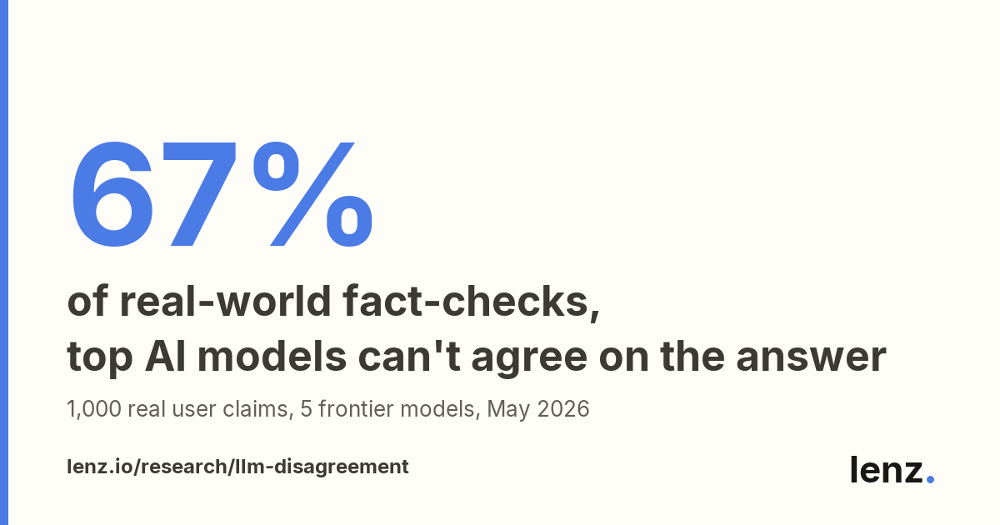
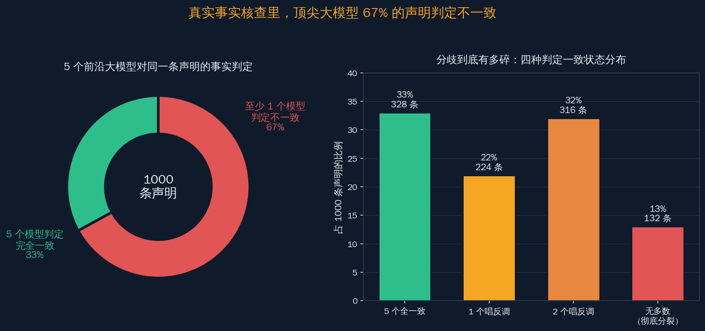
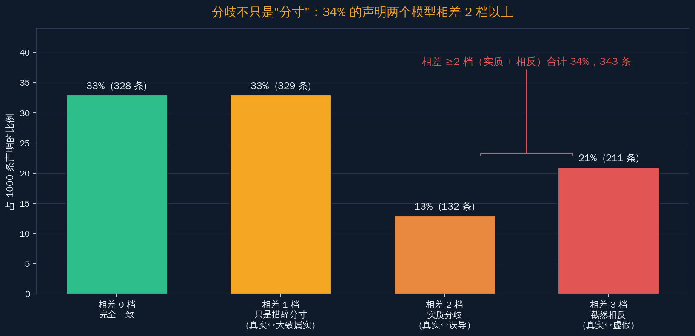
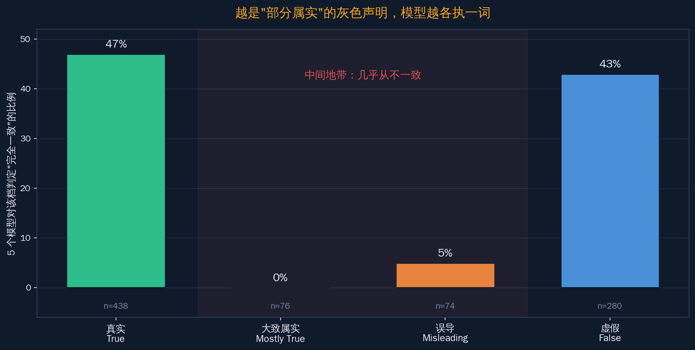
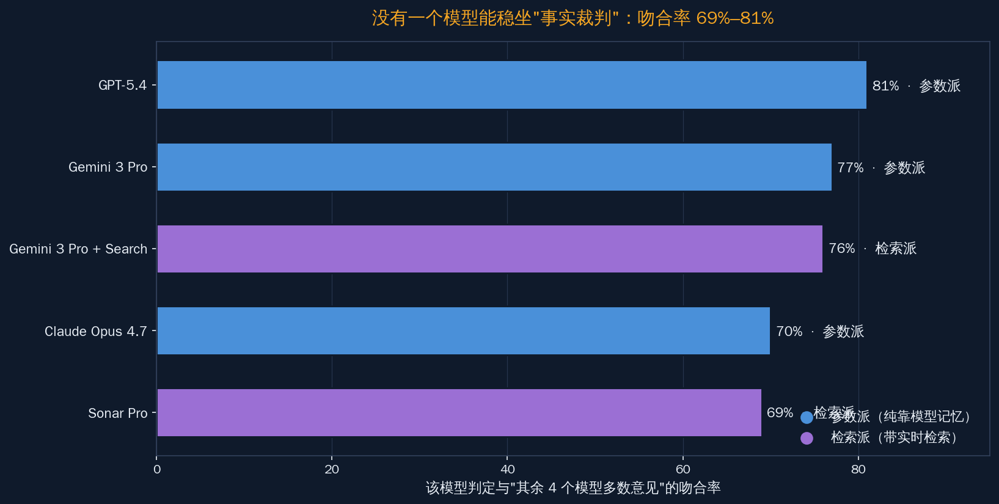
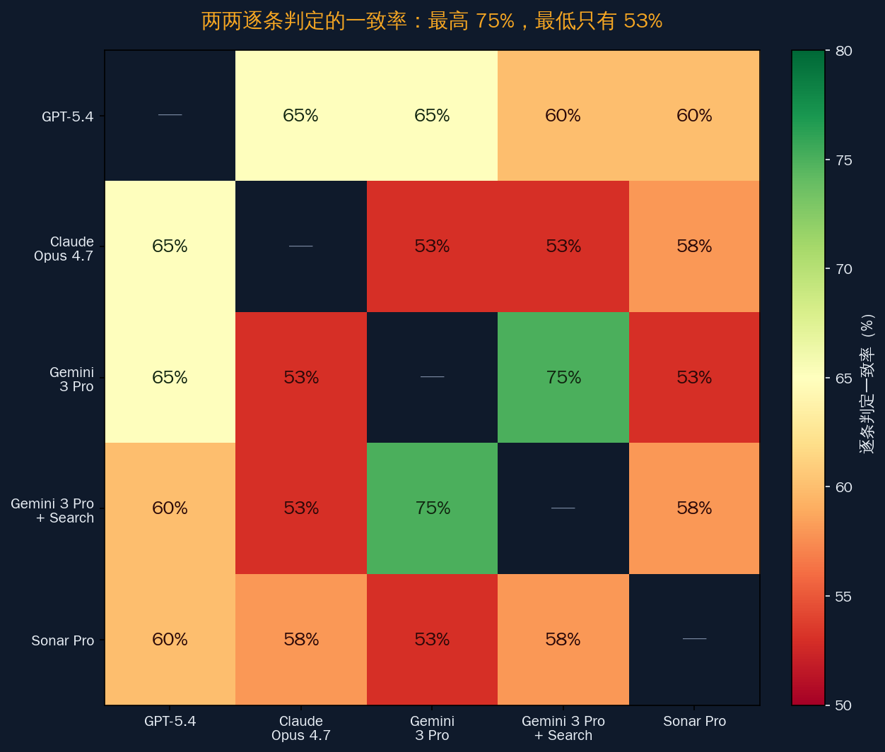

# 5 个顶尖模型核查同一批声明，67% 判定不一致

如果你正在给产品接一个"AI 帮我判断这句话是真是假"的功能，先记住一个数字：**把 1000 条真实用户提交的声明，丢给当前 5 个最强的大模型去判断真假，只有 33% 的声明 5 个模型给出完全相同的结论，剩下 67% 至少有一个模型唱反调。**

这是 Lenz Research 的 Kosta Jordanov 在 2026-05-21 发布的一份评测（快照 v1.0）得到的结果。它最近在开发者社区里被反复转发，原因不难理解——做事实核查、做检索增强生成（RAG，retrieval-augmented generation，即让模型先检索再回答）、做内容审核、做多模型集成的人，每天都在隐隐担心一个问题：**我现在依赖的这个模型，它给我的"真 / 假"判断到底有多稳？**

这篇文章想说清楚一件事，也是全文的核心论点：**在事实核查这件事上，不要把任何单独一个大模型当成"事实裁判"，尤其是在那些"部分属实"的灰色地带——那里几乎没有任何两个模型能稳定地达成一致。** 这不是唱衰大模型，恰恰相反，搞清楚这套分歧的结构，正是把 AI 核查产品做得更可靠的前提。

下面分几步讲：这套评测怎么做的、它合理在哪也有什么局限、分歧规模有多大、为什么中间档最危险、检索增强为什么救不了、以及国产模型接进来会不会更好。

来源：Lenz Research《Frontier LLM Disagreement on Fact-Checks》研究页，快照 v1.0，2026-05-21

## 评测是怎么做的：1000 条真实声明、5 个模型、四档判定

先把这套方法的骨架讲清楚，因为它的合理性和局限性都藏在方法里。一份评测的结论可不可信，往往不取决于结论本身有多惊人，而取决于它是怎么测出来的。

评测对象是 1000 条**真实**的声明——不是研究者拍脑袋编的测试句，而是用户近期提交到 Lenz 核查平台的真实内容。这一点很关键：测试集越接近真实使用场景，结论对做产品的人就越有参考价值。

参评的 5 个模型分成两派：

- **纯参数派**（只靠模型自己训练时记住的知识来判断）：GPT-5.4、Claude Opus 4.7、Gemini 3 Pro；
- **检索增强派**（回答前先去检索实时资料）：Gemini 3 Pro + Search、Sonar Pro。

每个模型拿到完全相同的提示词，被要求对每条声明给出四档判定之一：

| 判定档 | 英文原档 | 含义 |
|---|---|---|
| 真实 | True | 声明基本成立 |
| 大致属实 | Mostly True | 主体成立，但有不准确之处 |
| 误导 | Misleading | 字面或许没错，但整体让人误解 |
| 虚假 | False | 声明不成立 |

注意这套设计的一个刻意取舍：**它没有"标准答案"（ground truth，即被公认为正确的参考答案）。** 评测不去裁定"这条声明客观上到底是真是假"，只衡量 5 个模型彼此之间有多一致。

为什么不设标准答案？因为给 1000 条真实声明逐条标注权威答案，成本极高，而且很多灰色声明本身就没有公认结论——"某政策让中产税负更重"这种声明，连人类专家都未必能给出一个无争议的"真 / 假"。于是这套方法换了个角度：**与其问"谁对了"，不如先问"它们彼此之间到底有多分歧"。** 这个换位很聪明，因为它把一个几乎无法客观裁定的问题（谁对），换成了一个可以干净测量的问题（它们多一致）。

衡量分歧用的是 Krippendorff's α（一种衡量多个评判者一致性的统计量，按"序数"处理，也就是把四档当成有顺序的等级，相差一档算小分歧、相差三档算大分歧）。选序数而不是简单的"一致 / 不一致"很重要：它能区分"真实 ↔ 大致属实"这种小分歧和"真实 ↔ 虚假"这种大分歧，后者在统计上会被惩罚得更重，更贴近人对"严重分歧"的直觉。

还有一个工程上要留意的细节：评测对每个模型每条声明做的是"判定是否成立"的统计，部分模型在部分声明上会因为拒答、格式不符等原因被判为"不适用"，所以后面看到的各模型"可用样本数"会略有差别（650 到 693 不等）。这不影响主结论，但说明评测在数据清洗上是认真的，不是把所有输出一股脑算进去。

这套方法的合理与局限，可以摆在一起看：

- **合理**：用真实声明、统一提示词、序数化的一致性指标，能干净地回答"模型之间分歧有多大"这个问题；
- **局限**：没有标准答案，所以它**不能**告诉你"哪个模型更准"——只能告诉你"它们有多不一致"。读这份结果时，别把"一致"误读成"正确"。

这一节记住一句话：**这是一份测"分歧"而非测"对错"的评测，它的全部价值在于让你看清分歧的规模和结构。**

## 67% 不一致：分歧不是个别现象，是普遍现象

核心数字一次摆清楚，全部相对于这 1000 条声明：

- **5 个模型完全一致：33%（328 条，95% 置信区间 30–36%）**；
- **至少 1 个模型给出不同判定：67%（672 条，95% 置信区间 64–70%）**。

67% 不是个小尾巴，而是大多数。这意味着，在真实事实核查场景里，"5 个顶尖模型异口同声"反而是少数情况。

再往下拆，分歧的浓度比"67%"这个总数更值得注意：

| 一致状态 | 占 1000 条声明的比例 | 声明条数 |
|---|---|---|
| 5 个模型全一致 | 33% | 328 |
| 仅 1 个模型唱反调 | 22% | 224 |
| 有 2 个模型唱反调 | 32% | 316 |
| 完全分裂、形不成多数（如 2-2-1） | 13% | 132 |

也就是说，**"有 2 个或更多模型唱反调"的声明占到 45%（448 条）**——接近一半的声明，分歧不止来自一个"离群"模型，而是相当一部分模型集体意见不同。把这个换成产品语言：如果你用单模型出核查结论，你大约有一半的概率，输出的结果会被另外两个同样顶尖的模型反对。

这一节的结论：**分歧是这套任务的常态，不是异常。任何"单模型 = 权威判断"的产品假设，在真实声明面前都站不住。**

## 哪类声明最容易吵：法律、金融、健康分歧最高，历史最低

总数之外，分歧还有领域差异。这份评测把声明按主题分了类，每一类里"出现任意分歧"和"出现实质分歧（相差 ≥2 档）"的比例各不相同。对做垂直核查产品的人来说，这张表比总数更有指导意义——它告诉你哪个领域最不能信任单模型。

| 领域 | 声明数 | 出现任意分歧 | 实质分歧（相差 ≥2 档） |
|---|---|---|---|
| 法律 | 48 | 77% | 40% |
| 金融 | 75 | 67% | 39% |
| 健康 | 171 | 71% | 29% |
| 一般话题 | 179 | 68% | 40% |
| 历史 | 131 | 53% | 24% |

几个值得留意的点：

- **法律类分歧最高**（77% 任意分歧、40% 实质分歧）。法律声明常常依赖具体管辖区、时间节点、条款解释，模型对"在什么前提下成立"的理解差异很大；
- **金融类实质分歧高达 39%**。涉及数据口径、时间窗口、统计方法的金融声明，最容易在"真实"和"误导"之间反复横跳；
- **健康类任意分歧 71% 但实质分歧只有 29%**，相对最低——模型们经常在"真实 ↔ 大致属实"这种小分寸上不一致，但很少在健康声明上给出非黑即白的对立结论，这可能与各家对医疗内容更保守、更趋同的对齐策略有关；
- **历史类分歧最低**（53% 任意、24% 实质）。已经盖棺定论的历史事实，模型共识度相对最高。

这一节的结论：**分歧有明确的领域分布——法律、金融、一般话题是高危区，做这几类垂直核查产品的团队尤其不能押单模型；历史这类有定论的领域相对安全。**

## 分歧有多严重：34% 的声明，两个模型相差两档以上

光说"不一致"还不够。两个模型一个判"真实"、一个判"大致属实"，这只是措辞分寸的差别；但一个判"真实"、另一个判"虚假"，那就是截然相反。把分歧按"相差几档"拆开，才看得出严重程度。

按"任意两个模型判定相差的最大档数"统计，仍然相对于 1000 条声明：

| 档差距 | 性质 | 占比 | 条数 |
|---|---|---|---|
| 相差 0 档 | 完全一致 | 33% | 328 |
| 相差 1 档 | 只是措辞分寸（真实 ↔ 大致属实） | 33% | 329 |
| 相差 2 档 | 实质分歧（真实 ↔ 误导） | 13% | 132 |
| 相差 3 档 | 截然相反（真实 ↔ 虚假） | 21% | 211 |

把后两行加起来：**相差 2 档及以上的"实质性分歧"占 34%（343 条，95% 置信区间 31–37%）。** 这里要厘清两个数字的语义，避免混淆——67% 指的是"至少一个模型不完全一致"（含只差一档的措辞分歧），34% 指的是"相差两档以上的实质分歧"。前者是宽口径，后者是严重口径。

最扎眼的是那 21%、211 条相差 3 档的声明：一个顶尖模型说"真实"，另一个同样顶尖的模型说"虚假"。在这种声明上，你选哪个模型当裁判，结论就完全相反。

整套一致性用 Krippendorff's α 量化下来是 **0.639**。这个数怎么读？α 取值 1 表示完全一致、0 表示和随机瞎猜没区别。学界做内容标注时通常把 0.667 当作"可以接受"的下限、0.8 以上才算"可靠"。0.639 落在"可接受线"之下一点——**说明 5 个模型之间存在真实的、成系统的一致性，但这种一致性是有限的，远没到能让你闭眼信任的程度。**

这一节的结论：**分歧不只是"用词分寸"上的微调，三分之一的声明上模型们存在实质判断冲突，其中相当一部分是非黑即白的对立。**

## 中间地带最危险："大致属实"上，0% 的声明能让模型一致

如果说前面是规模问题，这一节是结构问题，也是全文最该带走的一个发现。

把分歧按"该声明的多数判定落在哪一档"切开来看，会发现分歧高度集中在中间两档。

各档里"5 个模型完全一致"的比例（分母是该档以多数判定成立的声明数）：

| 多数判定档 | 该档样本数 | 5 个模型完全一致的比例 |
|---|---|---|
| 真实（True） | 438 | 47% |
| 大致属实（Mostly True） | 76 | **0%** |
| 误导（Misleading） | 74 | **5%** |
| 虚假（False） | 280 | 43% |

两头的"真实"和"虚假"还算有共识——接近一半的声明能让 5 个模型异口同声。但中间两档几乎彻底碎裂：

- **"大致属实"档：76 条声明里，0 条能让 5 个模型完全一致**（一致率 0%）；
- **"误导"档：74 条声明里，只有 4 条完全一致**（一致率 5%）。

为什么这是最危险的发现？因为**产品里最常见、最需要人来把关的，恰恰就是这些"部分属实"的灰色声明。** 一句完全编造的假新闻，多数模型都能识别；一句板上钉钉的事实，多数模型也都认。真正让运营头疼、让用户争论、让平台担责的，永远是那些"七分真三分假""字面没错但有误导"的内容——而这正是模型们集体抓瞎的地方。

为什么中间档天然碎裂？根子在于"误导"和"大致属实"本身就是高度依赖判断的标签。一句"某产品销量增长了 30%"，如果省略了"在某个低基数季度对比"的背景，算"误导"还是算"大致属实"？这取决于评判者认为"省略多少背景才构成误导"——这条线，每个模型在训练和对齐时被塑造出的尺度都不一样。两端不同：编造的事实和确凿的事实，判断空间窄，模型容易趋同；中间档判断空间宽，模型各自的尺度差异就被放大。

换句话说：**模型在"容易的两端"达成一致，在"困难的中间"集体失灵；而困难的中间，才是事实核查真正的战场。**

## 检索增强救不了：带搜索的模型也没明显更一致

很多人第一反应是：纯靠记忆的模型不准很正常，让它联网检索（RAG）不就好了？这份评测里有个反直觉的发现——**检索增强派并没有明显更一致。**

衡量"每个模型和其余 4 个模型的多数意见有多吻合"，结果按高到低：

| 模型 | 与同行多数吻合率 | 流派 |
|---|---|---|
| GPT-5.4 | 81% | 参数派 |
| Gemini 3 Pro | 77% | 参数派 |
| Gemini 3 Pro + Search | 76% | 检索派 |
| Claude Opus 4.7 | 70% | 参数派 |
| Sonar Pro | 69% | 检索派 |

吻合率最高的是纯参数派的 GPT-5.4（81%），两个检索增强派（76%、69%）反而排在中后段。再看两两一致率的矩阵，对照更直观：

- 最高的一对是 Gemini 3 Pro 和 Gemini 3 Pro + Search，**75%**——但这俩本来就是同源模型，搜索是加在同一个底座上的，高一致是意料之中；
- 跨家组合里，最低能掉到 **53%**（Claude Opus 4.7 与 Gemini 3 Pro、Gemini 3 Pro 与 Sonar Pro 等多对都是 53%）；
- 没有任何一对跨家组合的逐条一致率超过 65%。

这说明什么？**给模型接上实时检索，确实能补上"知识过期"的短板，但它补不了"判断尺度不同"这个更深的问题。** 同一份检索结果，A 模型读完觉得"这构成误导"，B 模型读完觉得"大致属实"——分歧的根源不在于"知不知道事实"，而在于"怎么把事实归到四个档里"。这是个判断标准的问题，不是信息检索的问题，所以 RAG 救不了。

这一节的结论：**别指望"接个搜索"就能让核查结论变稳。检索解决信息新鲜度，解决不了判断口径的分歧。**

## 测试集里没有国产模型，但同样的问题一定会出现

这份评测有一个对国内开发者来说很现实的空白：**5 个模型全是海外的，没有 DeepSeek、千问（Qwen）、GLM（智谱）、Kimi（月之暗面）这些国产模型。**

这不代表国产模型可以幸免。恰恰相反——这份评测揭示的分歧，根源是"四档判定的边界本身就模糊""不同模型对'误导'的尺度理解不同"，这是事实核查任务的内在难题，跟模型产自哪个国家没关系。可以客观地讲：**把国产模型接进同样的核查流程，大概率会遇到同样的中间档碎裂问题，甚至因为模型间训练数据和对齐口径的差异，分歧可能不会更小。**

那对正在做核查 / RAG / 内容审核的国内团队，工程上能怎么应对？这份评测的结构其实已经把答案指了出来：

1. **多模型投票，而不是单模型裁决。** 既然单个模型 67% 的概率会被同行反对，那就用 3 个以上模型投票，把"是否一致"本身当成一个信号——全票通过的，可以高置信度自动放行；意见分裂的，恰恰是最需要人介入的。实操上不必都用顶尖闭源模型，国产模型里挑两三个对齐口径有差异的（比如一个偏保守、一个偏宽松），反而比凑三个口径相近的更能暴露分歧。投票的价值在于"差异"，不在于"都很强"。
2. **把"不确定性"显式标注出来，而不是藏起来。** 与其逼模型在"真实 / 虚假"里二选一，不如保留"大致属实 / 误导"这样的中间档，并在产品里明确告诉用户"这条存在争议"。中间档碎裂不是 bug，是真实世界的灰度，把它如实呈现比假装确定更可靠。可以把多模型的分歧度直接做成一个"争议指数"展示给用户：5 个模型全一致就标"高置信"，相差 2 档以上就标"存在重大争议、建议自行核实"。
3. **人工兜底要押在中间档，而不是平均分配。** 既然两端（真实 / 虚假）模型共识度有 43%–47%，中间档几乎为 0，那有限的人工审核资源就该重点压在"模型们吵起来了"的声明上——这是投入产出比最高的地方。具体可以设一个规则：5 个模型全票通过的自动放行，相差 1 档的抽检，相差 ≥2 档的强制人工复核。这样既不浪费人力在简单声明上，又守住了最容易出错的灰色地带。
4. **别神化检索增强。** 检索值得做，但要清楚它解决的是信息时效，不是判断口径。把 RAG 当成"让核查变准"的银弹会落空。如果发现接了搜索后分歧没降反升，别意外——检索给不同模型喂的资料本身可能就不一样，反而引入了新的分歧来源。
5. **按领域调整信任策略。** 前面的领域表已经说明，法律、金融、一般话题是高危区，历史相对安全。做垂直核查产品时，可以给不同领域设不同的人工介入阈值：金融法律类哪怕只差 1 档也复核，历史类全票通过就放行。一刀切的阈值会在高危领域漏判、在安全领域浪费人力。

把这几条放进一张决策表：

| 声明类型 | 模型表现 | 工程策略 |
|---|---|---|
| 多数判"真实 / 虚假" | 共识度 43%–47%，相对可靠 | 多模型全票 → 可自动放行 |
| 多数判"大致属实 / 误导" | 共识度 0%–5%，几乎全靠运气 | 标注"存在争议" + 人工复核优先 |
| 跨模型相差 ≥2 档 | 占 34%，实质冲突 | 触发人工兜底，不自动出结论 |

这一节的结论：**国产模型不是例外，但这套"多模型投票 + 不确定性显式化 + 人工押注中间档 + 按领域调阈值"的工程方法，对国产模型一样适用，而且现在就能落到产品里。**

## 写在最后：分歧是地图，不是判决

回到开头那句核心论点：**别把任何单独一个大模型当成事实裁判，尤其在"部分属实"的中间地带。**

这份评测最有价值的地方，不是给大模型泼冷水，而是给所有做核查产品的人画了一张清晰的"分歧地图"——它告诉你哪里模型基本可信（两端）、哪里模型集体失灵（中间）、哪里检索增强帮不上忙（判断口径）。有了这张地图，我们反而能把产品做得更稳：把自动化放在共识区，把人和不确定性标注放在分歧区，让每一分审核成本都花在刀刃上。

模型之间会吵架，这不是坏消息。坏消息是你不知道它们在哪吵、吵得多凶，于是盲目相信某一个的输出。现在我们知道了——67% 会有分歧、34% 是实质冲突、中间档几乎注定不一致。**看清了分歧的形状，就有了把它管理好的底气。** 国内做事实核查和内容审核的同行，手里其实已经握着所有需要的工具，下一步只是把"多模型一致性"这个信号，认真地用起来。
