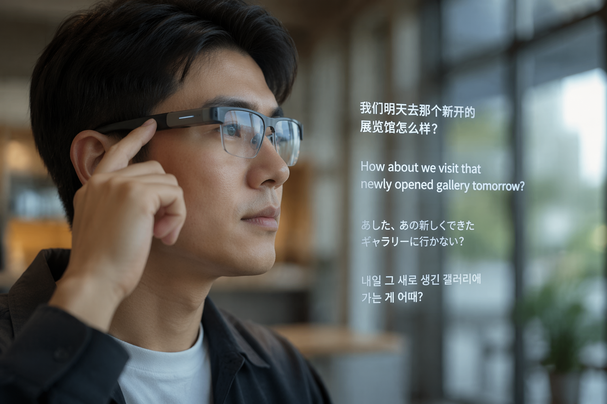
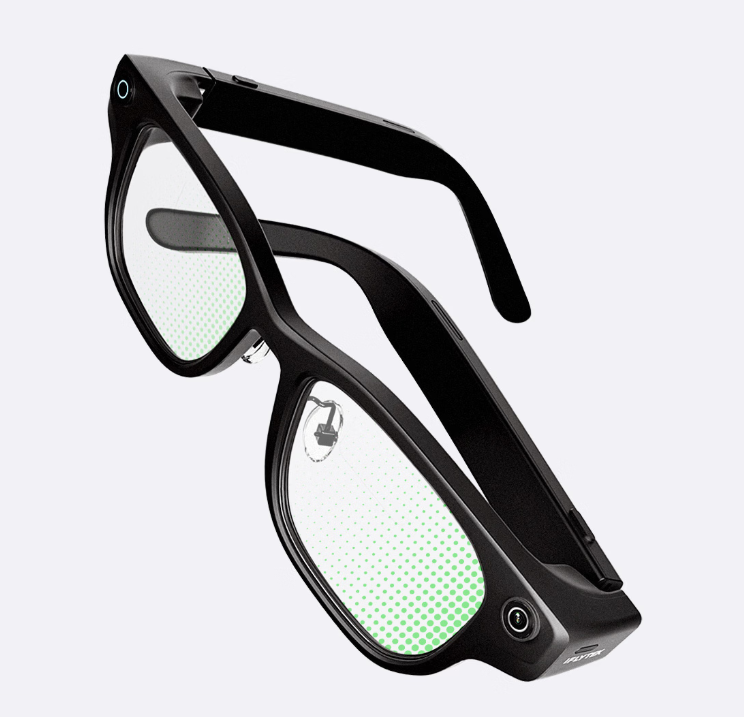
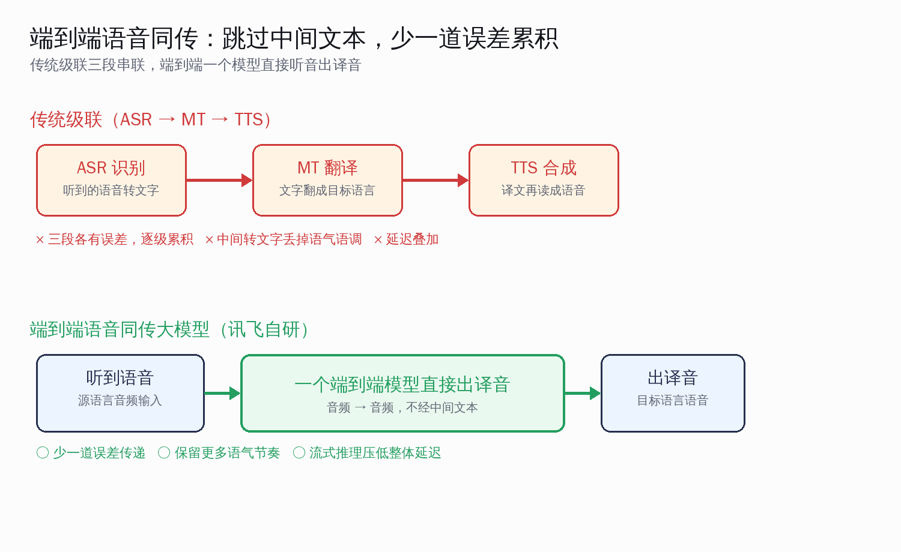
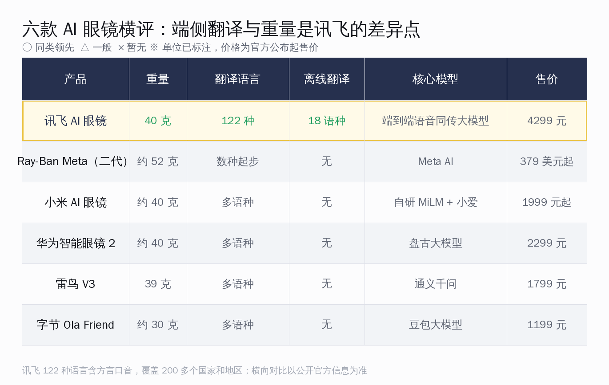

# 讯飞 AI 眼镜：40 克塞进 122 语言端到端同传

5 月 28 日，澳门 BEYOND Expo 2026 的展台上，科大讯飞拿出了讯飞 AI 眼镜。整机 40 克，售价 4299 元，6 月 15 日开启预售。

数字听上去和这两年密集冒头的 AI 眼镜没太大差别。但如果只盯着"又一副智能眼镜"，会错过这副眼镜真正的不同点——它把讯飞自研的**端到端语音同传大模型**直接装进了镜腿，支持 122 种语言（含方言、口音）的翻译，覆盖全球 200 多个国家和地区。

这篇文章的核心判断是：讯飞这一步，赌的不是镜头、不是显示、也不是续航，而是**把"实时翻译"这件讯飞最擅长的事，从手机 App 搬到了端侧、搬上了脸**。在如今厂商扎堆的 AI 眼镜赛道里，它选了一条和 Ray-Ban Meta、小米、华为都不太一样的路。

## 先看清这副眼镜到底是什么

讯飞 AI 眼镜的定位很直白——"眼前的超级 AI 助理"。它不是要做一台戴在脸上的相机，而是要做一个**随身的同声传译**。

四个最该记住的硬参数：

- **重量 40 克**：经典眼镜形态，基于万张头模数据打磨佩戴结构，拿到了 SGS 舒适度专业认证；镜片用全贴合树脂材质，意外跌落不易碎裂。
- **翻译 122 种语言**：含方言和口音，覆盖 200 多个国家和地区；其中 18 个语种支持离线翻译，没网也能用。
- **售价 4299 元**：3 月 4 日已开启预约，抢先预约可享购镜抵 299 元，6 月 15 日正式预售。
- **核心模型**：讯飞自研的端到端语音同传大模型，是整副眼镜的发动机。

这里面最容易被低估的是那个 40 克。后面横评会看到，国内同类产品多数压在 39 到 52 克之间，讯飞官方称比同类轻约 20%。眼镜这种"全天戴在鼻梁上"的设备，每减一克都直接对应戴一整天的舒适度，重量从来不是一个可以含糊的参数。

> 一句话定调：这是一副**把同声传译当成第一卖点**的 AI 眼镜，翻译能力是它的主场，其他都是配角。

## 122 种语言不只是数字，是六种翻译场景

光报一个"122 种语言"很容易被当成营销话术。真正决定体验的，是这 122 种语言能在多少种真实场景里跑起来。讯飞这次给了六种：

| 翻译场景 | 怎么用 | 适合谁 |
|---|---|---|
| 通话翻译 | SIM 卡通话 / 视频电话 / 网络会议全程双向同传 | 跨国客户电话、远程协作 |
| 线上同传 | 线上讲座、商务会议、实时课程 | 看海外直播课、参加线上会 |
| 同声传译 | 8 米内全向拾音，线下讲座会议 | 现场听外语演讲 |
| 面对面翻译 | 智能定向收音，显示贴合用眼距离 | 出国问路、点餐、谈生意 |
| 视觉翻译 | 看菜单、看路牌、看文件直接显示译文 | 海外自由行 |
| 音视频翻译 | 随附赠翻译 App 权益 | 翻译外语音视频素材 |

这张表说明了一件事：讯飞没有把翻译做成一个孤立的功能键，而是覆盖了"通话、会议、面谈、阅读"这几条普通人真正会遇到外语的路径。

尤其值得拿出来说的是**通话翻译支持 SIM 卡通话、视频电话和网络会议的全程双向同传**。这意味着你和一个只说西班牙语的客户打电话，两边各说各的母语，眼镜在中间实时转。这是手机翻译 App 一直做得很别扭、而戴在脸上反而顺手的场景。

*来源：新浪科技 2026-05-28 讯飞 AI 眼镜发布报道*

收音这一块讯飞也下了功夫：**骨传导拾音**让人声更纯净，面对面翻译用智能定向收音只听对面那个人，同声传译则是 8 米内全向拾音。三种收音策略对应三种距离和场景，不是一套麦克风走天下。

*来源：网易科技 2026-05-28 讯飞 AI 眼镜发布报道*

## 端到端语音同传：为什么这事比"支持 122 种语言"更关键

如果说 122 种语言是讯飞这副眼镜的台前卖点，那幕后真正的发动机是**端到端语音同传大模型**。理解了它和传统做法的差别，才明白讯飞的底气在哪。

过去做实时语音翻译，业界标准做法是把它拆成三段串起来——业内叫**级联**（cascade）：

1. **ASR**：先把听到的语音识别成文字；
2. **MT**：再把这段文字翻译成目标语言的文字；
3. **TTS**：最后把译文合成成语音读出来。

这套流程结构清晰、每段都有成熟方案，但有三个绕不开的毛病：

- **误差逐级累积**：ASR 听错一个词，MT 就在错的基础上翻，TTS 再把错的读出来，三段各自的小错越叠越大。
- **中间转文字会丢信息**：语音里的语气、停顿、节奏，一旦压成纯文字就丢了，合成出来的译音听起来生硬。
- **延迟叠加**：三段各自要算一遍，时间一段段加上去，同传场景下这点延迟很影响跟得上跟不上。

端到端的思路是**用一个模型直接从源语言音频出目标语言音频**，中间不再硬性经过文字这一道。少了一次模块交接，误差就少传一道；流式推理还能边听边出，把整体延迟压下来。这也是 Meta 的 SeamlessM4T 等多语种语音翻译模型这两年都在走的方向。

讯飞在语音这件事上有近二十年的积累，从语音识别、合成到机器翻译都是老本行。把这套能力收敛成一个端到端模型、再塞进 40 克的眼镜里，是它和那些"先有硬件、再外接一个翻译 API"的做法最本质的区别。

> 本节记住一句：**讯飞的护城河不是镜框，是那个能听音直接出译音的端侧模型。**

## 横向对比：在 AI 眼镜混战里，讯飞站在哪

2026 年的 AI 眼镜赛道相当热闹。小米、华为、雷鸟、字节都已下场，海外则有 Ray-Ban Meta 这个标杆。讯飞挤进来，靠的不是抢同样的位置，而是错开打。

把六款主流产品摆在一起看，分工其实很清楚：

- **Ray-Ban Meta（二代）**：约 52 克，379 美元起，强在拍摄、墨镜时尚属性和 Meta AI 的语音交互，翻译是逐步增加的语种、目前还是辅助功能。
- **小米 AI 眼镜**：1999 元起，骁龙 AR1 加单色绿光波导显示，自研 MiLM 大模型配小爱同学，续航约 8.6 小时，主打日常拍摄与第一视角记录。
- **华为智能眼镜 2**：2299 元，鸿蒙系统加盘古大模型，航空级钛合金，续航约 12 小时，定位高端商务。
- **雷鸟 V3**：1799 元、39 克，骁龙 AR1 平台搭通义千问，1200 万像素加 107 度超广角，主打千元级拍摄。
- **字节 Ola Friend**：约 30 克的开放式耳机眼镜形态，搭豆包大模型，强在随身语音对话。

把这几款放在一起，一个判断就立住了：**国内多数 AI 眼镜的第一卖点是拍摄或语音助手，翻译是顺带；而讯飞反过来，翻译是主场，拍摄反而不是它要争的地方。**

讯飞真正拉开身位的是两个点：

1. **离线翻译 18 个语种**——表里其余几款都依赖联网调云端，讯飞把模型做到端侧，没网也能翻；出国漫游不稳、地下室没信号、飞机上，这些恰恰是最需要翻译的时刻。
2. **122 种语言这个量级**——加上方言和口音的覆盖广度，在这一批产品里是顶配。

价格上 4299 元确实比小米、雷鸟高出一截，但讯飞对标的本来就不是"拍 vlog 的年轻人"，而是**经常跨语言沟通的商务人士、外贸从业者、出国频繁的人**。对这群人，一副能离线、能 122 种语言双向同传的眼镜，和 1999 元的拍摄眼镜不在同一个需求格子里。

## 几个还需要观望的边界

把话说圆才公道。讯飞这副眼镜有亮点，也有几处目前信息还不够、值得继续看的地方。我们只摆能查到的，查不到的不替它圆：

- **续航**：发布信息里没有明确给出讯飞 AI 眼镜的续航时长。对照同类——小米约 8.6 小时、华为约 12 小时——续航是这一类设备的集体软肋。一副以"全程同传会议"为卖点的眼镜，开着模型连续翻译能撑多久，是真正使用时最该确认的一项，这点还要等上手后的真实体验。
- **隐私**：眼镜要做面对面翻译和会议纪要，必然要持续拾音。讯飞用了骨传导和定向收音来提纯人声，但"在公共场合开着同传"对周围人的录音边界，是所有带麦克风眼镜的共同课题，使用时需要尊重对方知情。
- **离线和在线的体验差**：18 个离线语种是亮点，但官方未细说离线模型与联网时在准确度、语种范围上的差距。离线能用，和离线能用得和在线一样好，是两回事。
- **显示与提词**：它支持实时提词，发言重点会显示出来并跟随语速自动滚动，还能蓝牙遥控翻页——这对演讲、汇报场景很实用。但具体显示形态、清晰度和视野，还需要上手才能判断好不好用。

这些不是减分项，而是任何一副新眼镜上市前，理性买家都该列出来逐条确认的清单。讯飞在语音翻译这条主线上的功底毋庸置疑，剩下的就交给 6 月 15 日预售后的真实体验来回答。

*来源：网易科技 2026-05-28 讯飞 AI 眼镜发布报道*

## 对端侧语音模型从业者，这副眼镜意味着什么

跳出"买不买"这个层面，从做 AI 的人的角度看，讯飞这副眼镜其实是一个**端侧语音大模型落到消费级硬件的样本**。

它至少印证了三件和技术路线相关的事：

1. **端到端语音翻译已经能塞进 40 克的功耗和体积里**。这在两三年前还是云端大模型才敢碰的活，现在做到了端侧、还留出了 18 个语种离线跑的余量，说明模型压缩、端侧推理这套工程已经成熟到能上量产眼镜。
2. **国内厂商在语音这条线上的积累正在变成硬件差异点**。当多数厂商还在比镜头、比波导显示时，讯飞用一个自研语音模型直接开了另一条赛道——把最难做、最吃数据和工程的实时同传做成主功能，这是把"专长"变成"产品差异"的典型打法。
3. **"翻译"可能是 AI 眼镜第一个真正高频的杀手级场景**。拍摄会被手机分流，语音助手要和耳机抢，但"实时听懂外语"这件事，手机和耳机都做得别扭，恰恰是戴在脸上、贴着耳朵的眼镜最顺手的事。

回到开头那个判断——讯飞赌的不是又一副智能眼镜，而是把它最擅长的实时翻译搬上脸。从端到端语音同传大模型、40 克轻量化到 122 种语言这套组合看，这一赌至少在技术路线上是想清楚了的。

国内 AI 硬件这两年的故事，正在从"堆参数、比镜头"慢慢转向"各家把自己最硬的那块本事做成产品差异"。讯飞这副眼镜是一个不错的注脚：当一家公司把近二十年的语音积累收敛成一个能戴在脸上的端侧模型时，AI 眼镜这场仗，比的就不只是谁的镜头更清楚了。6 月 15 日预售之后会有更多真实反馈，值得继续看下去。
