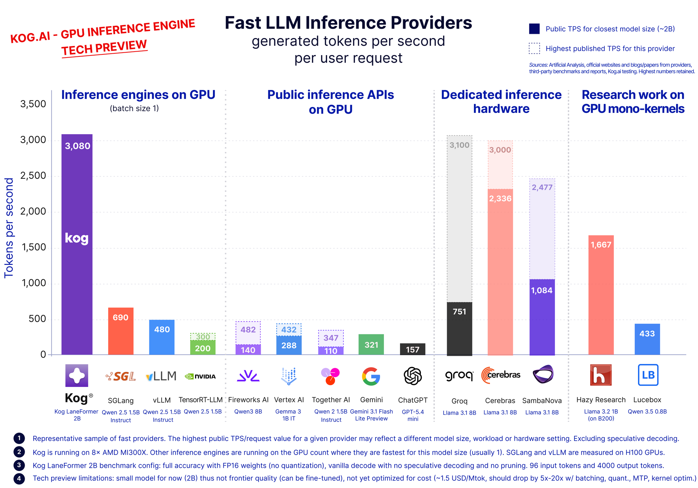
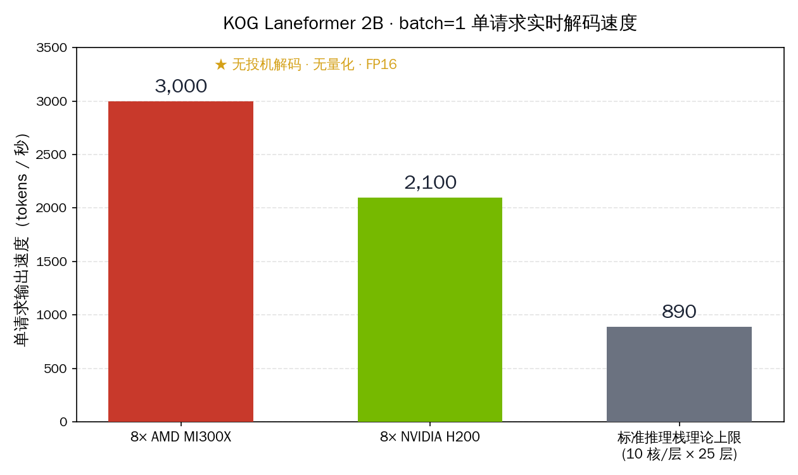
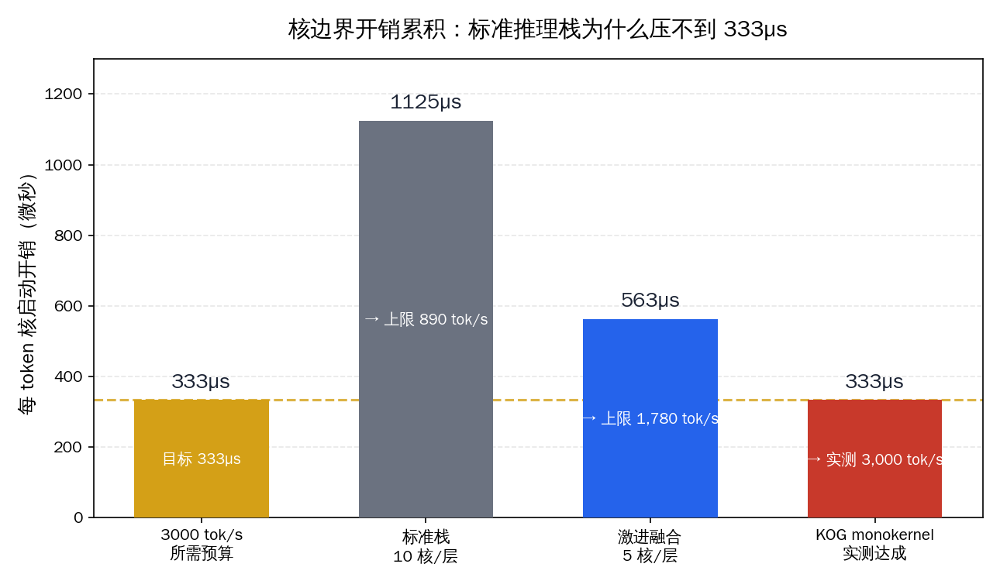
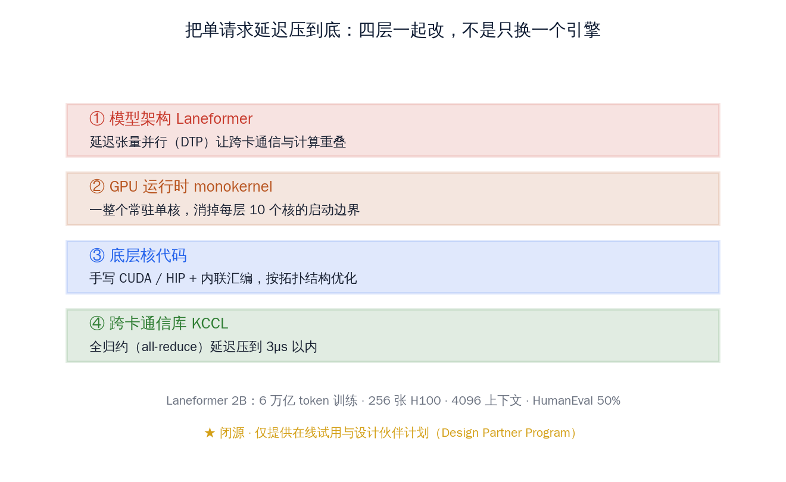
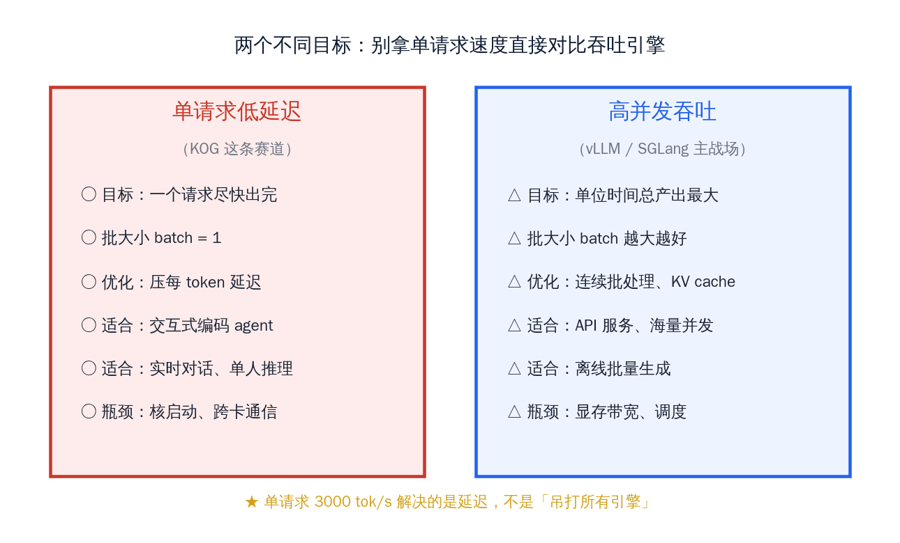

# KOG 把单请求解码做到 3000 tokens/s

巴黎一家只有 11 个人的初创公司 KOG，5 月 28 日发了一篇博客，给出一个让做推理部署的人会愣一下的数字：在 8 张 AMD MI300X 上、批大小（batch size）等于 1、不开投机解码、不做量化，单个请求的输出速度跑到了 **3000 tokens/s**；换成 8 张 NVIDIA H200，也有 2100 tokens/s。

这个数字反常的地方不在于"快"，而在于它打破了一条被默认很久的天花板。按标准推理栈的算法，一个 25 层的 Transformer，每层要发约 10 个 GPU 计算核（kernel），每个核启动加同步约 4.5 微秒，光这一项每个 token 就要花掉 1125 微秒——单这一笔开销就把速度封死在每秒 890 个 token 上下。KOG 实测的 3000 比这个理论上限高出三倍多。

**这篇文章想讲清楚一件事：单个请求的解码延迟为什么这么难压，KOG 是用什么把它压到 3000 的，以及这条「单请求低延迟」赛道和国内工程师天天在用的 vLLM、SGLang、TensorRT-LLM 到底是不是一回事。** 先把结论放这儿：KOG 解决的是延迟，不是吞吐；它跑的是一个 2B 的小模型、而且闭源——所以它既不是"吊打所有引擎"，也不是马上能拿来用的东西，但它指出的那个工程方向，值得国内做实时推理的人认真看一眼。

先把这家公司的底细交代清楚，方便后面判断这件事的分量。KOG 成立于 2023 年，在巴黎，团队 11 个人，其中 10 个是工程师 / 研究员、5 个有博士学位，融资 500 万美元，来自 Varsity VC 和法国公共投资银行 BPI France。这是个典型的小而专的深度技术团队——没有大厂的卡海，没有几百号人，靠的是把一个很窄的问题（单请求解码延迟）从模型一直啃到通信库。这一点本身就值得国内同样规模的小团队留意：在推理这条已经很拥挤的赛道上，一个十来人的团队仍然能靠极致的工程协同做出别人没做到的数字。

## 先看这张速度对照：3000 是个什么概念

KOG 在博客里给了一张横向对照图，把自己和市面上主流的推理路径摆在同一个坐标里。这张图信息量很大，值得逐列读。

> 来源：KOG 官方博客 `blog.kog.ai` 2026-05-28 发布的速度基准图。柱状高度是单用户单请求的每秒输出 token 数，批大小均为 1。

把这张图拆成四组看：

- **GPU 上的推理引擎（批大小 1）**：KOG 跑出 3080；同口径下 SGLang 690、vLLM 480、TensorRT-LLM 200。这三个正是国内工程师最熟的开源 / 厂商推理引擎。
- **公共推理 API**：Fireworks 482、Together 347、Gemini 321、ChatGPT 157——这是大家平时调云端接口时实际感受到的出字速度。
- **专用推理硬件**：Groq 751、Cerebras 2336 / 3000——这两家是靠定制芯片堆出来的实时速度，不是标准 GPU。
- **GPU 单核研究方向**：Hazy Research 1667、另一项研究 433——这是学界在 monokernel（单核）方向上的同类探索。

所以 KOG 这条柱子的真正看点是：**它是在标准 GPU 上、用纯软件协同设计，把单请求速度推到了过去要靠 Cerebras 这类专用硬件才够得着的区间。** 这是它和国内读者关心的成本结构直接相关的地方——不用换芯片。

需要立刻说清楚的边界有三条，免得把这个数字读歪：

1. **跑的是 2B 小模型**，不是 70B、不是 DeepSeek V4 那种大家伙。小模型本身解码就快，这是它能上 3000 的前提之一。
2. **批大小是 1**，衡量的是"一个请求多快出完"，不是"一秒钟服务多少人"。
3. **不开投机解码、不做量化**——也就是说还有进一步加速的余量没用上，同时也意味着这是个干净的纯架构对照。

这一节记住一句话：3000 tokens/s 是"标准 GPU + 纯软件 + 单请求"三个条件叠在一起的成绩，它对标的是延迟，参照系是 Cerebras 那种专用硬件，而不是 vLLM 的高并发吞吐。

> 来源：KOG 官方博客 `blog.kog.ai` 2026-05-28 题图。同一张全景把开源引擎、云端 API、专用芯片、单核研究四条线一次性铺开。

值得专门说一句 H200 的那个 2100。MI300X 是 AMD 的卡、H200 是 NVIDIA 的卡，KOG 在两家的硬件上都做了适配并都跑出了远超标准栈的数字——这说明它的方法不是绑死某一家 GPU 的特殊指令，而是一套可以跨平台落地的工程思路。对国内读者来说这点尤其有意义：在国产 GPU 和进口 GPU 混用、且越来越重视非 NVIDIA 路线的当下，"方法不绑硬件"比"某张卡上的峰值"更值钱。

## 单请求延迟为什么这么难压：核边界的微秒账

要理解 KOG 做了什么，得先理解标准推理栈在单请求场景下时间都花在哪了。这一节是全文的技术核心。

当你只发一个请求、批大小为 1 时，GPU 的算力其实是富余的——矩阵乘法那点计算量喂不饱 MI300X 这种卡。**真正的瓶颈不在算，而在"调度"**：每做一步计算，GPU 都要从主机端启动一个计算核，跑完再同步、再启动下一个。这个启动加同步的固定开销，在大批量推理里被海量计算稀释得看不见，但在批大小 1 的单请求里，它直接变成主导项。

打个直观的比方：核启动开销好比一次"上菜"前后摆盘、端上、撤下的固定动作。如果一桌坐了几十个人（大批量），后厨一次出一大盘，这点固定动作摊到每个人头上微不足道；可如果整间餐厅只有一位客人（单请求），每道菜都要走一遍完整的摆盘端撤流程，固定动作占的时间比例就被放到最大。批大小 1 的单请求解码，正是"只有一位客人"的极端情形——算力（后厨火力）再猛也没用，时间全耗在反复的启动同步上。

KOG 给了一笔很具体的账：

- 一个 Transformer 层，标准实现要发大约 **10 个核**（注意力、归一化、前馈网络各拆几个）；
- 一个模型 **25 层**；
- 每个核的启动加同步开销约 **4.5 微秒**；
- 算下来：10 × 25 × 4.5 = **每个 token 1125 微秒**纯开销。

而要达到 3000 tokens/s，留给每个 token 的总预算只有约 **333 微秒**。1125 远大于 333，等式根本不成立——单是核启动这一项，就把标准栈的速度上限锁死在每秒约 890 个 token。

有人会说，那把核融合（kernel fusion）做激进一点不就行了？把注意力、归一化、前馈这些原本分开的核尽量合并成大核，确实是过去几年推理优化的主流手段，TensorRT-LLM、FlashAttention 这类工作都在这条线上。KOG 也算了这一档：哪怕把每层压到 5 个核，开销还有 563 微秒，对应上限约 1780 tokens/s——仍然到不了 3000。

也就是说，**核融合是在"减少核的数量"，但只要还存在核边界，启动同步开销就还在，融合只能把墙往后挪、挪不掉。** 这是 KOG 那笔账最关键的一层含义：要真正打穿这堵墙，得让核边界本身消失，而不是减少它的个数。这正是下一节 monokernel 的出发点。

再补一个国内工程师能立刻对上号的细节：这套核启动开销，在多卡场景下还会叠加一层跨卡通信的同步代价。8 张卡协作推理一个请求时，张量并行（tensor parallelism）会在每一层产生跨卡的全归约（all-reduce）操作，每次都要等所有卡到齐——这又是一道额外的、随卡数增加而变重的延迟。所以单请求场景里，"核多 + 卡多"是双重夹击，这也是为什么 KOG 要同时动模型架构和通信库两层。

> 这笔账解释了一个国内工程师可能踩过的坑：当你用 vLLM 服务一个低 QPS、要求快速响应的场景（比如内部一个交互式编码助手，同一时刻就一两个人在用），你会发现单请求出字速度并不会因为你卡很强就线性变快——因为你撞到的是核启动开销这堵墙，而不是算力墙。**加卡、换更强的卡，对单请求延迟基本无效。**

这一节的结论：单请求低延迟的敌人是核边界的微秒级固定开销，它不随算力增长而消失，靠常规的核融合也只能缓解、压不到底。

## KOG 的解法：四层一起改，而不是只换一个引擎

KOG 的核心判断是——既然瓶颈是"核太多、边界太碎"，那就别在现成推理栈上打补丁，而是把模型、运行时、底层代码、通信库这四层重新一起设计，让它们彼此适配。这是典型的协同设计思路。

四层各自做的事：

- **① 模型架构 Laneformer**：自研的 2B 编码模型，引入"延迟张量并行"（Delayed Tensor Parallelism, DTP），让跨卡通信和计算尽量重叠，而不是算完了干等通信。
- **② GPU 运行时 monokernel（单核）**：这是最关键的一层——把整个前向计算塞进**一个常驻 GPU 的大核**里，从源头上消掉"每层 10 个核反复启动"这件事。核启动开销之所以能从 1125 微秒砍掉，靠的就是这里。
- **③ 底层核代码**：手写 CUDA / HIP，加内联汇编，按 GPU 的实际拓扑结构做优化，把每一寸延迟抠出来。
- **④ 跨卡通信库 KCCL**：自己写的跨 GPU 集合通信库，把全归约（all-reduce）这种多卡同步操作的延迟压到 3 微秒以内。8 张卡协作时，通信延迟很容易吃掉单请求的时间预算，这一层就是专门治这个的。

这里要重点解释 monokernel 这层，因为它是整套设计里最反直觉、也最关键的一步。常规推理栈里，模型的每一步运算都对应一个独立的核，由 CPU 端逐个发起、GPU 端逐个执行，核与核之间靠 CPU 调度衔接。

monokernel 的做法是反过来：**写一个一直常驻在 GPU 上的大核，让整个前向计算都在这一个核内部完成，中间不再退回 CPU、不再反复启动。** 核边界没了，那笔 1125 微秒的启动同步开销自然就塌掉了。

这件事工程上极难——等于要在一个核里手工编排原本由整个运行时负责的调度逻辑，对寄存器、共享内存、指令流水的控制都要抠到底层——但它是唯一能把开销从"减少"变成"消除"的路子。

把这四层串起来看，逻辑就清楚了：**模型架构让通信可以藏进计算里，monokernel 让核不再反复启动，手写核把单核内部抠到极致，KCCL 把多卡同步的尾巴收掉。** 单独做任何一层都到不了 3000，四层咬合才行——这也是为什么这件事难复制：它不是一个能 pip install 的库，而是一整套互相适配的设计。换个角度说，KOG 赌的是"垂直整合"——从模型怎么设计，到核怎么写，到卡怎么通信，全攥在自己手里一起调。这跟现在主流的"模型归模型、推理引擎归引擎、通信库归通信库"的分层解耦做法正好相反，是一种用灵活性换极致延迟的选择。

| 设计层 | 解决的具体问题 | 对延迟的作用 |
|---|---|---|
| Laneformer + 延迟张量并行 | 跨卡通信和计算串行等待 | 让通信重叠进计算，藏掉等待 |
| monokernel 单核运行时 | 每层 10 个核反复启动同步 | 砍掉核边界开销这个主导项 |
| 手写 CUDA / HIP 核 | 通用核没榨干单卡延迟 | 按拓扑做底层延迟优化 |
| KCCL 通信库 | 多卡全归约同步慢 | all-reduce 压到 3µs 以内 |

这一节的结论：3000 tokens/s 不是某个魔法核函数的功劳，而是模型、运行时、底层代码、通信库四层重新协同设计的结果——这是它的厉害之处，也是它短期内难被现成栈追平的原因。

## 这个模型本身：Laneformer 2B 是个什么东西

容易被速度数字盖过去的一点是：KOG 跑的不是别人的开源模型，而是自己训的 Laneformer 2B。模型规格摆出来：

- **参数量** 20 亿（2B），属于小模型；
- **上下文长度** 4096 token；
- **训练数据** 6 万亿 token，用的是 NVIDIA Nemotron 数据集；
- **训练算力** 256 张 H100；
- **能力** HumanEval 编码基准约 50%。

50% 的 HumanEval 对一个 2B 模型不算差，但显然和前沿大模型不在一个量级。这就引出了适用边界的现实判断：**Laneformer 现在的定位更像是"延迟敏感、模型可以不大"的场景的演示**——比如交互式编码补全、实时对话这类要求"出字快、单人用"的场景，模型小一点、但响应几乎无延迟，体验反而更顺。

这里有一个容易被忽略、但对工程选型很重要的取舍：**很多产品体验上的"卡顿感"，来自首字延迟和出字速度，而不是模型有多聪明。** 一个 2B 模型如果能在你按下回车的瞬间就开始飞快出字，交互体验可能比一个要等两秒才憋出第一个字的大模型更让人满意。编码补全尤其如此——补全要的是跟手、即时，模型规模反而是次要的。KOG 押的就是这块体验空缺。

还要注意一点：为什么 monokernel 这套打法目前用在 2B 而不是 70B 上？因为模型越大，权重越放不进单核能高效驾驭的范围，要切分到更多卡、产生更多跨卡通信，单核内编排的难度指数级上升。**把整个前向塞进一个核，本身对模型规模就有约束**——这既是 Laneformer 选择 2B 的工程原因，也是这套方法短期内难以直接搬到大模型上的客观限制。

KOG 自己也把目标用户说得很直白：面向构建编码 agent 和交互式工作流的团队。换句话说，它不是来替代大模型问答的，而是来填"需要极低延迟、模型规模可控"这块空缺的。Laneformer 2B 用 6 万亿 token、256 张 H100 训出来、HumanEval 到 50%，这套配置也印证了它的定位——投入足够认真地训一个"够用且够快"的编码小模型，而不是去卷参数规模。

## 和国内工程师熟悉的引擎横向对照：别比错了对象

这是国内读者最该看清的一节。**单请求低延迟和高并发吞吐，是两个不同的优化目标，不能直接拿一个数字盖过另一个。**

vLLM、SGLang、TensorRT-LLM 这三个国内工程师天天打交道的引擎，主战场是**高并发吞吐**——连续批处理（continuous batching）、PagedAttention、KV cache 管理，这些技术全是为了"同一时刻塞进尽量多的请求，让单位时间总产出最大"。在那个目标下，它们做得非常好，KOG 完全没有要替代它们的意思。

两个目标的差异摆成表更清楚：

| 维度 | 单请求低延迟（KOG） | 高并发吞吐（vLLM / SGLang / TensorRT-LLM） |
|---|---|---|
| 优化目标 | 一个请求尽快出完 | 单位时间总产出最大 |
| 批大小 | batch = 1 | 批越大越好 |
| 核心技术 | monokernel、手写核、低延迟通信 | 连续批处理、KV cache、PagedAttention |
| 主要瓶颈 | 核启动、跨卡通信延迟 | 显存带宽、调度效率 |
| 典型场景 | 交互式编码 agent、实时单人对话 | API 服务、海量并发、离线批量生成 |

所以正确的对照是：在批大小 1 这个特定口径下，KOG 的 3080 对 SGLang 的 690、vLLM 的 480——KOG 确实快很多。但只要把场景换成"一百个请求同时来"，连续批处理引擎的吞吐优势就会回来，这时候比单请求峰值速度意义就不大了。**读这条新闻的正确姿势是：KOG 证明了单请求延迟还有巨大的压缩空间，而不是宣布吞吐引擎过时了。**

那国内在单请求低延迟这条线上有没有人做？有，而且思路相通：

- **硅基流动（SiliconFlow）** 把"高速 API"作为卖点之一，在云端推理服务上做了大量解码加速工程；
- **无问芯穹（Infinigence）** 在异构算力和推理优化上持续投入，做的是"同一套推理软件适配多种国产 / 进口 GPU"；
- **国产推理引擎与框架**（如各家在 vLLM / SGLang 基础上的二次优化版本）也在低延迟解码方向上有积累。

国内这条线的整体特点是：更偏"在现有引擎上做工程优化 + 适配国产硬件"，而 KOG 走的是"连模型架构带运行时一起重写"的更彻底路线。两条路没有谁对谁错——KOG 那种全栈重写的代价是闭源、是只能跑自己的小模型；国内偏工程优化的路线则能直接服务现有的开源大模型生态，落到生产环境更快。

两种路线的取舍可以摆得更清楚一些：

- **KOG 式垂直整合**：延迟做到极致，但模型、运行时、通信库都得自己造，闭源、绑自家小模型，外部团队没法直接复用；
- **国内式工程优化**：在 vLLM、SGLang 这些成熟开源引擎上做二次优化，能直接跑千问、DeepSeek、GLM 等现有开源大模型，适配国产 GPU，生产环境上线快，但单请求延迟的天花板受限于现有引擎的核结构；
- **共同的方向**：两边都在和"核启动 + 跨卡通信"这两个延迟来源较劲，只是一个选择推倒重来、一个选择就地改造。

对国内做实时推理的团队来说，更现实的启发不是"去抄一个 monokernel"，而是先把自己的场景归类清楚：如果你做的是高并发 API 服务，继续在吞吐引擎上深耕就对了；如果你做的是单人交互式编码 agent、实时对话这类延迟敏感产品，那 KOG 这笔账提醒你——单请求延迟还有很大空间，值得专门投入，而不是默认"现有引擎已经到头了"。

这一节的结论:KOG 跑赢的是单请求延迟这个特定维度，国内在同一维度有硅基流动、无问芯穹等团队从工程优化角度切入，路线不同但目标一致——而且国内路线对接现有大模型生态的现实可用性，其实更高。

## 能不能用、值不值得跟：现实判断

把最实际的几个问题摆出来回答：

**能直接用吗？** 暂时不能拿来部署。KOG 是闭源的，目前只提供两样东西：一个在线试用的 playground（`playground.kog.ai`，跑的就是 Laneformer 2B），以及一个面向团队的"设计伙伴计划"（Design Partner Program）。没有开源权重，也没有可下载的运行时。

**那它的价值在哪？** 在于它把"单请求延迟可以压到什么程度"这件事用一个干净的实测结果钉下来了。对国内做实时推理的工程师来说，这至少给出三点参考：

- **认清瓶颈**：低 QPS、要求快速响应的场景，瓶颈是核启动和通信延迟，不是算力——别再靠堆卡解决单请求慢的问题；
- **关注 monokernel 方向**：把整个前向塞进单核以消除核边界，是一条已经被验证有效的路径，学界（Hazy Research 等）和 KOG 都跑出了数字，国内引擎团队可以重点看这个方向；
- **区分场景选型**：交互式 agent、实时对话这类单人低延迟场景，和 API 高并发场景，应该用不同的优化目标去衡量，别用一套指标硬套。

**会不会很快有开源对应物？** 这正是值得期待的地方。monokernel 不是 KOG 独有的概念，学界已有公开研究，国内引擎社区（围绕 vLLM、SGLang 的二次开发圈）技术积累也很扎实。一个闭源团队用 11 个人、500 万美元就把单请求延迟推到这个程度，恰恰说明这条路径的工程门槛是可被攻克的——它更像是给整个开源推理社区指了一个明确的、有数字支撑的努力方向。

对国内正在做实时推理、做编码 agent 的团队来说，这是个好消息：单请求延迟这块过去被默认"就这样了"的地方，原来还有三倍以上的空间。路就在前面，剩下的是谁先把它在开源生态里跑通。

---

**一句话带走**：KOG 用模型、运行时、底层核、通信库四层协同设计，在标准 GPU 上把单请求解码推到了 3000 tokens/s——它解决的是延迟而非吞吐，跑的是 2B 小模型且闭源，所以不是"吊打所有引擎"，但它清清楚楚地证明了：单请求低延迟这条赛道，还远没有到头。
