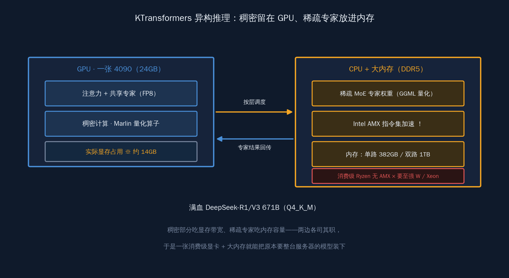
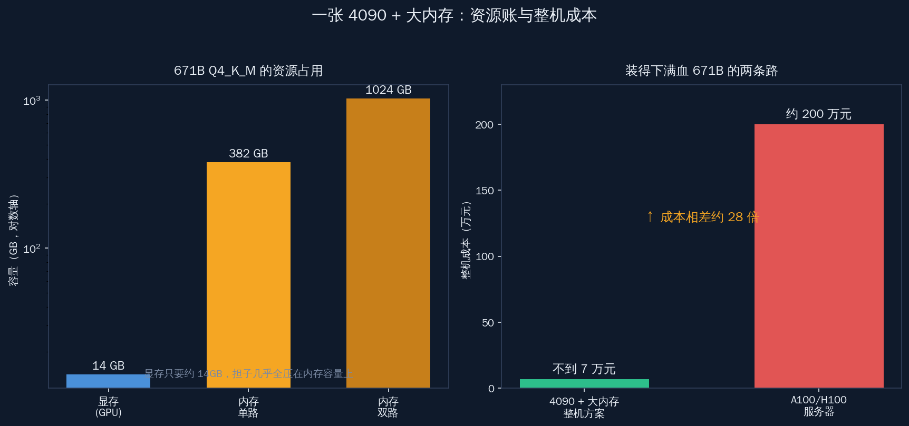
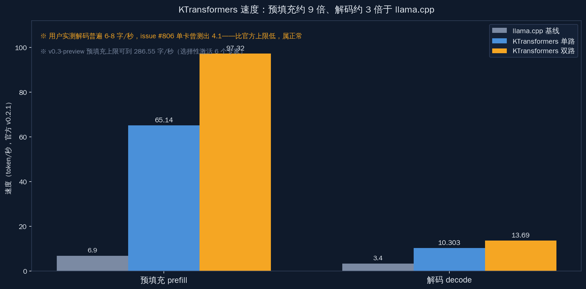
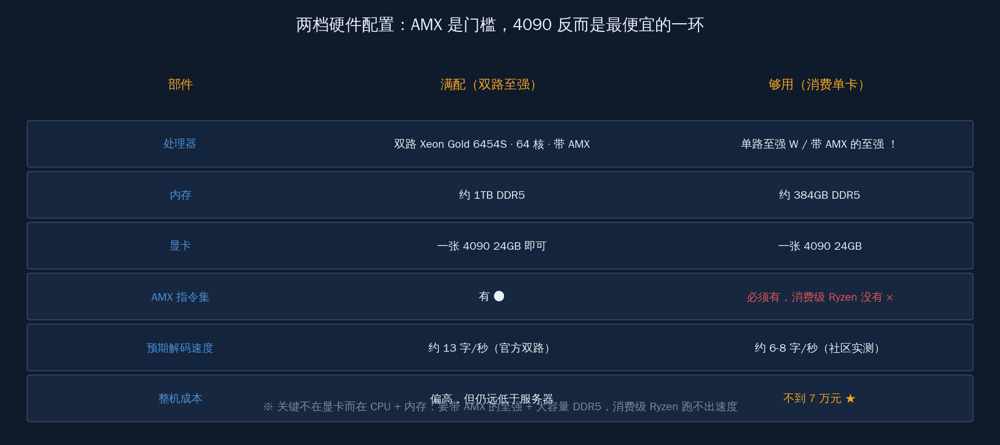
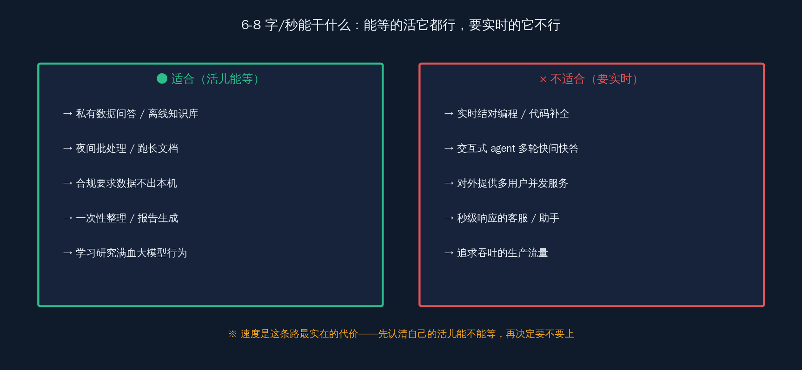

# 一张 4090 跑满血 DeepSeek 671B：靠大内存硬扛


> 显存不够，不代表跑不了大模型。这句话过去两周我们一直在用各种量化和引擎去验证它的反面——怎么把一个模型压进 24GB 显存里。今天换个方向：当模型根本压不进去的时候，还有没有办法在自己的机器上跑起来。

过去两周，这个系列把"4090 上 Qwen3-Coder 各量化横评""双 4090 张量并行跑 DeepSeek-V4-Flash""Mac Studio 选机""5090 五引擎横评""LMDeploy 与 TRT-LLM 实测"挨个写了一遍。它们有一个共同前提：模型得先装进显存。671B 这一档装不进，于是默认它跟个人机器无缘。

但有一条完全不同的路线，此前 28 天一次都没碰过——**当权重根本塞不进显存时，把稀疏 MoE 的专家权重放到 CPU 内存上算，只把稠密计算留在 GPU，让一张 24GB 的 4090 配上大内存，就能跑起原本要 8 张 A100 才装得下的满血大模型。** 它换来的不是"比云端更快"，而是"以前在个人机器上根本不可能"。这就是清华团队和趋境科技做的 KTransformers，本文要把这条路线讲透：它怎么做到的，要配多少内存，能跑多快，以及哪些场景适合、哪些场景千万别用。

需要先说清楚一个常见误解。看到"单卡 4090 跑 671B"，很多人第一反应是"那我把云端 API 换成本地不就省钱了"——这个理解是错的。这条路线换来的从来不是更快或更便宜的日常推理，而是一件以前根本不成立的事：在一台个人能买到的机器上，把满血的 671B 跑起来。它的对照组不是云端 API，是"花 200 万配 A100 服务器"或者"干脆跑不了"。想明白这个对照组，后面所有关于速度的讨论才不会拧巴。

## 一、把专家权重搬到内存：异构推理到底在做什么

KTransformers 的核心论点只有一句：稀疏 MoE 的专家权重又大又不常用，把它们放到便宜的 CPU 内存里按需计算，宝贵的显存只留给真正每个 token 都要算的稠密部分。

DeepSeek-R1/V3 这类模型是稀疏混合专家（MoE）结构。它名义上有 671B 参数，但每生成一个 token，路由只会激活其中一小撮专家——真正参与计算的激活参数远小于总参数。这就留出了一个空子：那些大部分时间在睡觉的专家权重，没必要全程占着显存。

举个直观的数：DeepSeek-R1/V3 名义 671B，但单步路由通常只激活几十 B 量级的专家。也就是说，每生成一个 token，绝大多数专家权重都没参与计算——它们只是占着空间在等。把这批"等待中"的权重赶出显存、放到内存里待命，显存立刻松出一大片，这就是 14GB 这个数字的来源。

KTransformers 做的就是按计算特性把模型拆开放：

- **稠密部分 + 共享专家**：留在 GPU 上，用 Marlin 算子加速，这部分每个 token 都要算，对延迟最敏感；
- **稀疏专家矩阵**：放到 CPU / DRAM 上算，吃 Intel AMX 指令集，专家模块用 GGML 量化压体积；
- **注意力 / 共享专家**：可以走 FP8，进一步省显存。



它的项目原话把自己定位得很清楚："A Flexible Framework for Experiencing Heterogeneous LLM Inference/Fine-tune Optimizations"——一个体验异构大模型推理与微调优化的灵活框架。开发方是清华 KVCache.AI 团队和趋境科技，仓库托管在 GitHub 上（`kvcache-ai/ktransformers`，Apache-2.0 许可），约 1.7 万 star，到 2026 年 5 月 21 日仍在更新。

为什么偏偏是 MoE 适合这么拆，得说清楚根因。稠密模型每个 token 都要把全部权重过一遍，权重放哪儿、权重就得在哪儿算，没有腾挪空间；而 MoE 把前馈层切成几十上百个专家，路由每步只挑几个激活。换句话说，**专家权重的"占用空间"很大，但"单步参与计算"的只有一小撮。** 占空间的东西可以放慢一点的便宜介质（内存），参与计算的东西放快的贵介质（显存），这笔账才划算。稠密模型没有这个结构红利，硬卸载只会被反复换入换出拖死——这也是为什么这条路线天生就是为大稀疏 MoE 准备的。

还有一个常被忽略的细节：量化档位是分开选的。注意力和共享专家这些留在 GPU 的部分，可以走 FP8，省显存又不太掉精度；放到 CPU 的稀疏专家，用 GGML 那套量化（Q4_K_M 是常见档），重点是压体积、让 380GB 内存装得下。两头用不同精度，是这套方案能把显存压到 14GB 的关键之一。

时间线值得记一下：2025 年 2 月清华团队开源这套方案，"单卡 4090 跑满血 671B"的说法第一次让很多人意识到大模型本地化还有这条路；一年多过去，到 2026 年 5 月仓库依然活跃。**这不是一个昙花一现的 demo，是一条持续被维护的工程路线。**

## 二、显存只要 14GB，代价是内存吃到 380GB

这一节回答最实际的问题：跑 671B 到底要什么硬件。结论先抛——显存负担小到出乎意料，内存负担大到也出乎意料。

跑 DeepSeek-R1/V3 671B 的 Q4_K_M 量化版，资源账是这样的：

- **GPU**：至少 14GB 显存，一张 4090D 24G 完全够用，单卡足矣；
- **CPU 内存（单路 / single socket）**：需要 382GB DRAM；
- **CPU 内存（双路 / dual socket）**：需要约 1TB DRAM。

很多人实测下来的占用是"显存约 14GB、内存约 380GB"——显存这一头，连一张 4090 都没占满；真正的门槛挪到了内存上。



CPU 这一头有个国内 DIY 用户最容易忽略的硬门槛：**Intel AMX 指令集**。KTransformers 的 CPU 算子是专门为 AMX 写的，吃满 AMX 才有它宣传的速度。这意味着消费级的 AMD Ryzen 平台没有 AMX，跑不出效果；要 Intel Xeon 或至强 W 这一档才行。官方推荐的配置是 Intel Xeon Gold 6454S 这一档，单 socket 32 核，双 socket 64 核效果最佳。

给两档具体配置，照着配就能起：

**高配档（追求双路速度）**

- GPU：4090D 24G ×1
- CPU：Intel Xeon Gold 6454S ×2（双路 64 核，吃满 AMX）
- 内存：1TB DDR5
- 适合：想要双路接近 100 tok/s 预填充、能接受服务器主板成本的人

**消费级档（单路够用）**

- GPU：单张 4090 24G
- CPU：单路 Xeon（带 AMX），32 核
- 内存：384GB（高端消费 / 工作站主板能插满）
- 适合：个人开发者、家里有一台能插大内存的工作站、想本地跑满血 671B 试水的人

内存这头还有一个比容量更隐蔽的变量：带宽。专家权重放在内存里，每生成一个 token，被路由选中的那批专家权重要从内存搬到 CPU 去算，搬运速度直接决定解码快慢。所以内存通道数、频率、是不是插满了所有通道，往往比"内存够不够大"更影响实际速度。单路 382GB、双路 1TB 这两个数字保证的是"装得下"；想跑到官方那个速度，还得把内存通道插满、用上对应平台的多通道带宽。**很多人内存够了速度却不达标，问题常常不在容量，在带宽没拉满。**

成本这一头很关键。据网易、每经报道，整套 4090 方案（含大内存主板和 CPU）成本不到 7 万元；而能装下满血 671B 的 A100 / H100 服务器要约 200 万元。**同样跑一个 671B，硬件成本差出 95% 以上——这是这条路线存在的全部理由。**

## 三、预填充快 9 倍，解码快 3 倍，但绝对速度是个位数

这一节看 KTransformers 跑起来到底有多快，以及官方数字和真实社区体验之间的落差。结论先抛——倍数很漂亮，绝对值要冷静。

官方 v0.2.1 给的数字（对比 llama.cpp）：

- **预填充（prefill）**：单路 65.14 tok/s，双路 97.32 tok/s，约为 llama.cpp 的 9.44 倍；
- **解码（decode）**：单路 10.303 tok/s，双路 13.69 tok/s，约为 llama.cpp 的 3.03 倍。

v0.3-preview 把预填充进一步推到最高 286.55 tok/s，约为 llama.cpp 的 27.79 倍——靠的是选择性只激活 6 个专家。



这些倍数确实好看。但要老实说清楚两件事：

**第一，倍数是相对 llama.cpp 的，不是相对云端。** 比 llama.cpp 解码快约 3 倍，意思是 llama.cpp 在同样硬件上更慢，不是说 KTransformers 追上了 8 卡 A100 的速度。

**第二，真实社区体验普遍低于官方数字。** 不少人实测生成速度在 6 到 8 tok/s 这个区间；GitHub 上有人用单卡 4090 加 CPU 跑 671B int4，issue #806 里测出 4.1 tok/s。这些数字比官方的 10 到 13 tok/s 低，原因往往是内存带宽、CPU 型号、量化档位、上下文长度的差异。**我们如实把它写出来，不回避——你大概率不会一上来就跑出官方那个数。**

这里要分清预填充和解码两个阶段，它们对体感的影响完全不同。预填充是把你输入的提示词一次性读进去、算出第一个 token 之前的那段，吃的是并行算力，长上下文时这一段最耗时；解码是之后一个接一个吐字。KTransformers 在预填充上对 llama.cpp 的优势（9 倍、甚至 v0.3 的 27 倍）尤其明显，因为这一段最吃 CPU 上 AMX 的并行能力。**对于"喂一篇长文档再提问"这类活，预填充快意味着等第一个字的时间明显缩短，这块的提升比解码那 3 倍更解决实际痛点。**

把绝对速度翻译成体感：解码 10 tok/s 意味着一秒钟吐出十几个字，读起来像一个打字不算快的人在回你消息。它适合能等的场景，不适合追求实时的交互式 agent。这一点本文最后会展开。

## 四、和 llama.cpp、vLLM 不是谁取代谁

这一节把三条本地推理路线摆清楚。结论先抛——它们解决的是不同场景的问题，选错了路线，再调参也白费。

| 引擎 | 最适合的场景 | MoE 卸载效率 | 高并发 | 核心限制 |
|---|---|---|---|---|
| vLLM / SGLang | 显存装得下时的高并发服务 | 不主打卸载 | 强 | 显存不够直接跑不了 |
| llama.cpp | 通用 CPU/GPU 混合，跨平台 | 较低 | 弱 | MoE 专家卸载效率低 |
| KTransformers | 显存装不下，靠大内存换"能跑" | 高（专门优化） | 单用户串行 | 吃 AMX、单用户、速度个位数 |


三句话记住它们的分工：

- **显存装得下** → 选 vLLM 或 SGLang，要的是高并发和吞吐；
- **要跨平台、随便跑跑** → llama.cpp，通用但 MoE 卸载这块不是它的强项；
- **显存装不下、又想在自己机器上跑满血大 MoE** → KTransformers，用大内存和专家卸载换一个"能跑"。

和 llama.cpp 的差别集中在 MoE 卸载这一环：llama.cpp 也能把部分层放 CPU，但它不是为稀疏专家结构专门优化的，卸载效率低；KTransformers 的 CPU 算子是冲着 AMX 和 MoE 专家矩阵写的，这是它快出几倍的来源。和 vLLM 的差别更根本——vLLM 假设你显存够，它优化的是同时服务几十个请求的吞吐；KTransformers 假设你显存不够，它优化的是一个人怎么把模型跑起来。

所以横评的时候别陷进"谁的解码 tok/s 更高"这种单一维度的比较。这三条路线的差异不在快慢，在前提：显存够不够、要不要并发、能不能等。前提对上了，速度才有意义；前提错了，跑分再高也用不上。这也是为什么本系列前面那些"4090 上各引擎横评"都默认模型装得进显存——它们比的是同一个前提下谁更快，而 KTransformers 干脆换了前提。

这里要再强调那个被国内 DIY 用户反复踩的坑：**消费级 Ryzen 没有 AMX**。看到"单卡 4090 就能跑"就兴冲冲去配一套高端 Ryzen 主机，结果 CPU 这头根本吃不满 KTransformers 的算子，速度上不去。要 Xeon 或至强 W。

AMX 是 Intel 从第四代至强（Sapphire Rapids）开始引入的矩阵运算扩展指令集，专门加速低精度矩阵乘——而专家计算的核心恰恰是矩阵乘。KTransformers 的 CPU 算子是冲着 AMX 写的，所以它的速度优势严格绑定在带 AMX 的 Intel 平台上。这跟海外开发者圈常见的"AMD EPYC 大内存 + llama.cpp 卸载"那套实操路线是两个方向：EPYC 内存通道多、性价比高，跑 llama.cpp 的卸载很合适，但它没有 AMX，到了 KTransformers 这里就吃不到专用算子的红利。**国内 DIY 圈里 EPYC 二手平台便宜、很多人第一反应去配 EPYC，这恰恰是和 KTransformers 错配的——它要的是带 AMX 的 Intel。**

## 五、权重走魔搭和镜像站拉，命令骨架照抄



这一节给照着就能跑的安装与下载步骤，重点照顾国内的网络环境。结论先抛——装环境和拉权重是两件事，权重走国内镜像最省心。

**装环境**。KTransformers 通过 pip 安装，起一个 OpenAI 兼容的 server。命令骨架大致是：

```bash
# 1. 装 KTransformers（建议先建独立 conda / venv 环境）
pip install ktransformers

# 2. 本地命令行对话（快速验证模型能不能跑起来）
python -m ktransformers.local_chat \
  --model_path <模型配置目录> \
  --gguf_path <Q4_K_M 权重目录>

# 3. 起 OpenAI 兼容 server（给 IDE / agent 当后端）
python -m ktransformers.server \
  --model_path <模型配置目录> \
  --gguf_path <Q4_K_M 权重目录> \
  --port 10002
```

起来之后，它会在本地暴露一个 OpenAI 兼容端口（如 10002），后面接 IDE 和 agent 全靠它。具体参数以仓库当前版本的文档为准，官方教程目前主要覆盖 DeepSeek-V3/R1（671B）这一档。

**拉权重**。671B Q4_K_M 的 GGUF 文件很大，国内直连 HuggingFace 慢且不稳，走两个镜像更顺：

- **ModelScope（魔搭）**：`pip install modelscope` 之后用 `modelscope download` 拉对应的 GGUF 仓库到本地目录；
- **hf-mirror.com**：设 `export HF_ENDPOINT=https://hf-mirror.com`，再用 `huggingface-cli download` 按平时的 HuggingFace 用法拉，请求会自动走镜像。

这里要分清两类文件。`--model_path` 要的是模型的配置和 tokenizer（结构信息），体积小，从魔搭或镜像拉对应的原始模型仓库即可；`--gguf_path` 要的是量化后的权重 GGUF，这才是几百 GB 的大头。两个路径分别指对，是新手最容易搞混的一步——把配置目录填到 gguf_path、或反过来，server 起不来。

下完把 GGUF 目录路径填进上面 server 命令的 `--gguf_path` 就行。**对国内用户来说，权重下载这一步用魔搭或镜像站，比硬连外网省下的时间往往比调参还多。**

## 六、起好的本地后端，灵码和 OpenClaw 都能接

这一节讲怎么把这个本地 server 用起来。结论先抛——只要是认 OpenAI 兼容接口的工具，把 base_url 指过来就能接。

KTransformers 起的是 OpenAI 兼容 server，所以国内主流 IDE 和 agent 接入它的方式都一样：把模型后端的 base_url 指到本地那个端口（如 `http://127.0.0.1:10002/v1`），api_key 随便填一个非空字符串即可。

几个常用的接法：

- **通义灵码**：在自定义模型后端里填本地 endpoint，把灵码的补全 / 对话请求引到本地这台机器；
- **Continue.dev**：在配置文件里加一个 OpenAI 兼容 provider，model 写成你跑的模型名，apiBase 指向本地端口；
- **Cline**：在 API Provider 选 OpenAI Compatible，Base URL 填本地端口；
- **OpenClaw**：作为本系列读者的主力项目，它同样能把这个本地 endpoint 当后端——配置里指定 OpenAI 兼容地址，就能让 OpenClaw 的对话和工具调用走本地这台跑 671B 的机器，数据不出本机。

有一个接入上的细节值得提醒：因为是单用户串行，这个本地 server 同一时刻只服务一个请求。如果你同时挂着灵码补全、又开着 Cline 跑任务，两边的请求会排队，互相拖慢。把它当成"一次专心服务一件事"的后端来用，体验最稳。

接通之后要管理好预期。10 tok/s 左右的解码速度，意味着这套本地后端**适合能等的活**：

- 隐私合规场景——数据不能出本机、又想用满血大模型推理；
- 夜间批处理——把一批任务排进去，第二天看结果，不在乎实时；
- 离线研究 / 长文档分析——你提个问题去干别的，回来看答案。

**它不适合**追求实时反馈的交互式 agent——你敲一行代码等它补全等好几秒，体验会很难受。**这条路线买的是"能跑满血大模型"这件事本身，不是"跑得飞快"。** 把它放在对的场景里，它就是个人机器上此前不存在的能力。

## 七、有些边界，它自己也还没走到

诚实是这条路线值得信任的前提，所以局限要写明白，而不是替它打圆场。

- **单用户串行推理**：它服务的是一个人，不能像数据中心那样并发服务几十人。想用它搭一个团队共用的推理服务，并发上去速度会塌，这不是它设计的用途；
- **官方覆盖范围有限**：官方教程目前主要覆盖 DeepSeek-V3/R1（671B）。对更新的 DeepSeek-V4、Qwen3 这类大 MoE，官方实测数字尚未公开——能不能跑、跑多快，得自己试，别拿 671B 的数字直接套。这一点是它作为一条工程路线还在成长的标志：路线本身（稀疏 MoE 专家卸载）是通用的，但每个新模型的结构差异、专家数量、路由方式都不一样，适配需要时间，不是换个权重路径就自动支持；
- **多卡配置官方未充分覆盖**：超过单张 4090 的多卡方案，官方文档覆盖不充分。它的设计初衷就是"单卡 + 大内存"，多卡不是它的主战场。如果你手里已经有两三张卡，先想清楚——多卡更适合用 vLLM 做张量并行把模型铺开，而不是套到一个为单卡设计的卸载方案上；
- **绝对速度是个位数到十几**：前面说过，真实体验常在 6 到 8 tok/s，issue 里也有 4.1 tok/s 的记录。这个速度本身不是缺陷，是这条路线的固有特征——你拿内存带宽换了显存容量，速度就是这个代价。

把这些边界摆清楚，不是泼冷水。**恰恰是因为它没有假装自己是云端的平替，这条路线才值得信任。** 它清楚自己解决的是"装不进显存"这一个问题，不越界承诺别的。

## 八、把社区的真实声音放回来：6 到 8 tok/s 是什么体验

官方数字是实验室条件下的上限，真正决定你要不要上这条路的，是社区里普通人跑出来的体感。这一节把那些没那么漂亮、但更真实的声音放回来。



社区里反复出现的几个观察：

- **生成速度普遍落在 6 到 8 tok/s**：这是大多数自己配机器的人跑 671B Q4 的真实区间，比官方单路 10.3 tok/s 略低，差异来自内存带宽、CPU 具体型号、上下文长度；
- **极端情况会更低**：GitHub issue #806 里，有人用单卡 4090 加 CPU 跑 671B int4，测出 4.1 tok/s。这种偏低的数字往往出现在内存通道没插满、或 CPU 不是推荐档的配置上；
- **预填充体感比解码好**：很多人反馈"问一个问题等第一个字"的时间比想象中短，但"长答案一直吐到尾"会让人觉得慢——这正好对应预填充快、解码慢的特性。

把这些数字摆在一起，能得出一个对决策最有用的判断：**这套方案的速度足够支撑"问一个问题、等一段完整回答"，但撑不起"一边打字一边等它实时补全"。** 6 到 8 tok/s 读一段技术分析、跑一次代码审查、总结一篇长文档完全够用；但你要它当随时响应的结对编程助手，会被那个速度劝退。

所以选不选这条路，先问自己一个问题：**我要的是"快"，还是"在自己机器上能跑满血大模型"？** 如果是前者、且模型装得进显存，那 vLLM 更对路；如果是后者、模型又大到装不进，KTransformers 是目前少有的可行解。

## 九、对照一下：什么样的人该上这条路

把前面所有的账揉到一起，做成一张选型对照，方便你对号入座。结论先抛——这条路是给"有大内存 Intel 平台、跑能等的活、看重数据不出本机"的人准备的。

| 你的情况 | 建议 | 理由 |
|---|---|---|
| 有带 AMX 的 Xeon + 384GB 以上内存 + 一张 4090 | 直接上 KTransformers | 这就是它的目标配置，照配置单跑得起来 |
| 只有消费级 Ryzen + 大内存 | 不建议 | 没有 AMX，吃不到专用算子，速度上不去 |
| 显存够装下你要的模型（如双卡跑量化版） | 选 vLLM / SGLang | 要并发和吞吐，不该卸载到内存 |
| 追求实时交互的结对编程 / agent | 不建议本地这条路 | 6-8 tok/s 撑不起实时体验 |
| 数据不能出本机 + 要满血大模型推理 | 强烈推荐试一下 | 隐私合规场景里它几乎是唯一可行解 |
| 夜间批处理 / 离线长文档分析 | 推荐 | 能等的活，速度完全够用 |

这张表里藏着这条路线最朴素的逻辑：**它不跟云端比速度，它解决的是"个人机器能不能跑得起满血大模型"这件以前没有答案的事。** 把它放进对的格子，它就是个人开发者手里多出来的一项能力；放错格子，再怎么调参也只会失望。

## 局势

回到开头那句话：显存不够，不代表跑不了大模型。一年多前清华团队把这条路开出来的时候，"单卡 4090 跑满血 671B"听起来还像个噱头；今天它是一套有 1.7 万 star、还在持续更新、能照着配置单复现的工程方案。它没让 671B 在个人机器上跑得更快，但它让 671B 第一次在个人机器上跑得起来——7 万块的整机，对一台 200 万的 A100 服务器，做成了同一件事。

值得一提的是，它的项目定位里还写着 fine-tune——异构这套思路不止用在推理，也朝着让个人机器做大模型微调的方向延伸。这条路如果继续走通，意味着个人开发者能碰的，不只是"跑别人的满血模型"，还有"在本地动手调它"。

异构推理 + 专家卸载这条路线，本质是把"算力稀缺"重新定义成"内存可以补"。显存贵、内存便宜，而大稀疏 MoE 又恰好把"占空间"和"要计算"这两件事分开了——这个结构上的巧合，被清华团队和趋境科技用一套工程方案接住了。**当显存成了天花板，把不常用的专家搬到便宜的内存里，本地能跑的模型上限一下被推高了一整个数量级——这是属于个人开发者的一次机会窗口。**

我们这一代赶上了一个好时候：满血大模型不再只属于有 200 万预算的机房，一台 7 万块的机器、一张 4090、一条配置单，就能把它请回自己桌上。路就在前面，剩下的，是我们一起把它跑起来。
