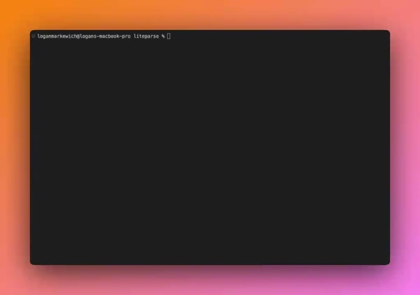
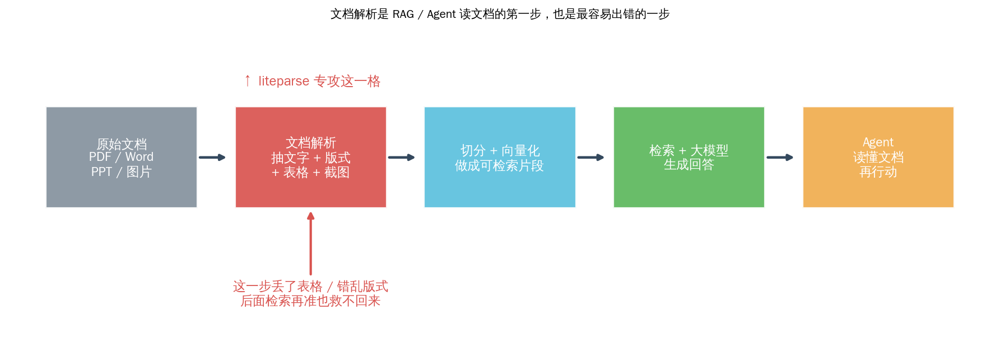
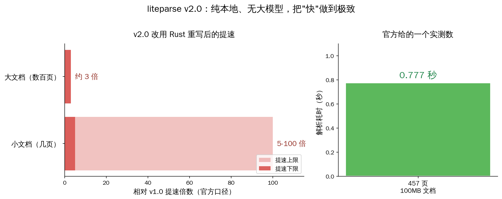
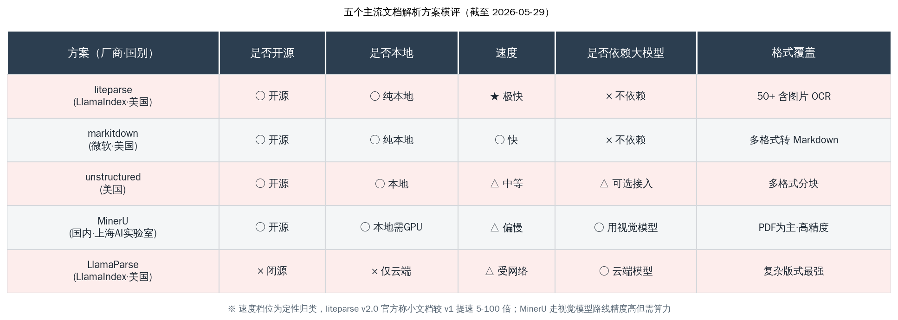
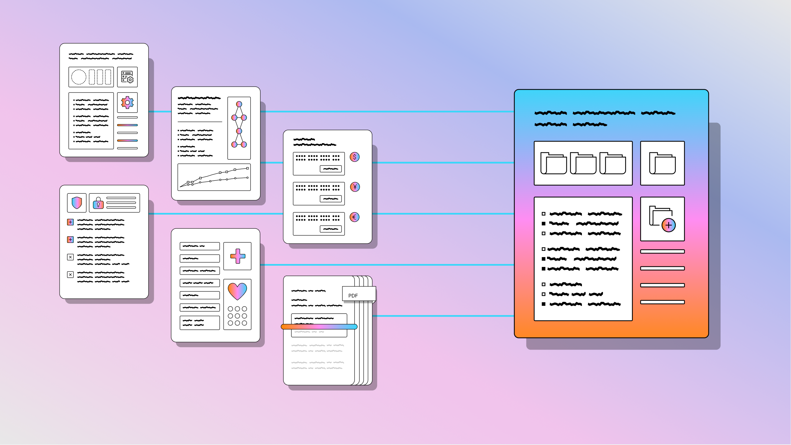

# liteparse：给 RAG 配个快的本地文档解析器

做 RAG（检索增强生成）和知识库的人都懂一件事：**真正天天折磨人的，不是检索算法，也不是用哪个大模型，而是第一步——把一份 PDF、Word、PPT 干净地变成文字。** 这一步做不好，后面切片再精、向量再准、模型再强，都救不回来。

这个月，做 LlamaIndex 的那个团队把他们的文档解析器 liteparse 用 Rust 完全重写后开源，5 月 29 日当天涨了约 680 颗 star，总数到约 7100，冲上了 GitHub Trending。它的定位很克制：**纯本地跑、不依赖大模型、不要 API key、把"快"做到极致。** 这正好补上了国内做 RAG 的人一直缺的一档选项——既不想把文档传到云端，又不想为了解析一份合同去开一块 GPU。

本文想把一件事讲清楚：**liteparse 到底解决了什么痛点，它和微软的 markitdown、国内的 MinerU、以及 LlamaIndex 自家的云端版 LlamaParse 各占什么位置，国内开发者在什么场景下值得换过去。** 结论先放这儿——如果你要的是"在自己机器上、几百页文档零点几秒出文字、喂给 Agent 就走"，liteparse 现在是最顺手的那一个；如果你要啃的是密密麻麻的表格、扫描件、手写体，那还得另请高明。

## liteparse 到底是什么：一个只干一件事的解析器

一句话：**liteparse 是一个开源的文档解析库，把 PDF、Office 文档、图片里的文字连同版式一起抽出来，全程在你自己机器上跑，不连云、不调大模型、不要 API key。**

它的几个事实，先摆清楚：

- **作者**是 run-llama，也就是 LlamaIndex 团队——RAG 框架里名气最大的那一个，所以它对"解析完之后要喂给检索和 Agent"这件事理解得很到位
- **语言**是 Rust，仓库里 Rust 代码占了大头，外面包了 Python、Node.js、WASM 三层调用接口
- **许可证**是 Apache 2.0，商用友好，国内公司可以放心集成
- **仓库**2026 年 2 月初建立，到 5 月底约 7100 star、440 fork，5 月 29 日单日涨约 680 star
- **当前版本**是 v2.0 系列，5 月底连发了 Python、Node、Crates、Docker、WASM 多个平台的 2.0.3

<small>来源：run-llama/liteparse 仓库 README 配图</small>

它支持的格式不止 PDF。官方说覆盖 50 多种文档类型，常见的有这几大类：

- **PDF**：主战场
- **Office 文档**：Word（.doc / .docx / .docm / .odt / .rtf）、PowerPoint（.ppt / .pptx / .odp）、表格（.xls / .xlsx / .ods / .csv / .tsv），非 PDF 格式会先自动转成 PDF 再解析
- **图片**：.jpg / .png / .gif / .bmp / .tiff / .webp / .svg，靠内置 OCR 认字

值得专门说一句它的 OCR：**liteparse 把 Tesseract 直接打包进去了，装好即用、零配置**，这对国内开发者省事不少——不用单独折腾 OCR 环境。如果你嫌 Tesseract 认中文一般，它也留了口子，可以接一个 HTTP 服务换成 EasyOCR、PaddleOCR 或你自己的识别后端。

> 一个反差值得记住：名字叫 liteparse、README 开头自称"专注 PDF 的轻量解析"，但实际支持 50 多种格式。它的"轻"不是指功能少，而是指**不背大模型、不连云、跑得轻快**。

## 它解决的真痛点：RAG 第一步，过去只能在"快"和"准"里二选一

这一节的核心判断：**过去做文档解析，开发者被逼着在"快但糙"和"准但重"之间二选一，liteparse 想在中间补一档"又快又全本地"。**

LlamaIndex 团队自己的说法很直白：传统工具逼着 Agent 做选择——

- 要**快**，就用 pypdf 这类纯文本抽取库，结果版式经常乱、表格散架
- 要**准**，就上云端服务、GPU 或视觉大模型（VLM），代价是延迟高、可能超时、还得把文档传出去

对一个要实时响应的 Agent 来说，这两条路都别扭。让用户上传一份 PDF 等十几秒、或者动不动超时，体验直接崩。liteparse 的取舍是：**牺牲掉"啃最难版式"的那部分能力，换来又快、又能本地跑、又不依赖大模型的确定性。** 它把抽文字这件事做得快且稳，对 Agent 来说，确定性往往比"偶尔能解析出超复杂表格"更重要。

它给出的输出也是奔着 Agent 设计的，一共三种：

1. **保留版式的文字**：按空间网格还原排版，多栏、缩进不会串行，方便大模型理解文档结构
2. **JSON + 边界框**：给出每段文字的坐标，方便精确定位某个元素在原文哪个位置
3. **PNG 页面截图**：直接渲染成图，交给多模态大模型做更深的视觉推理

这第三种很有意思——**当文字抽取搞不定的时候，liteparse 不硬扛，而是把整页截成图，丢给多模态模型去看。** 这其实是给 Agent 留了条后路：能用文字就用文字（快），文字不够再上视觉（准）。

## 为什么"保留版式的文字"这件事对大模型这么重要

这一节单独拎出来讲，是因为它是 liteparse 和最朴素的"抽文字"工具拉开差距的地方：**同样是把 PDF 变成文字，留不留版式，喂给大模型的效果差很远。**

举个最常见的例子。一份合同、一张报价单、一份带多栏排版的报告，如果用最朴素的抽取方式，文字会被"摊平"——左右两栏的内容交错串到一起，表格的行列错位，大模型读到的就是一团语序混乱的文字。检索的时候，明明相关的两句话被拆散了；生成的时候，模型把隔壁栏的数字张冠李戴。**这类错误最隐蔽，因为它不报错，只是悄悄把答案带偏。**

liteparse 的做法是按**空间网格**还原版式：

- 多栏排版按列读，不会把左右两栏串成一行
- 缩进、段落层级尽量保留，文档结构对大模型可见
- 配合 JSON 里的边界框坐标，能精确知道某段文字原本在页面的哪个位置

对 RAG 来说，这意味着切分（chunking）这一步能切得更干净——按真实的段落和结构切，而不是按一团乱码硬切。**解析阶段多保住的那点结构，会在后面检索和生成的每一步连本带利地还回来。** 这也是为什么 LlamaIndex 团队做 RAG 框架出身，会特别在意"版式"这件别的解析器容易忽略的事。

## 为什么要用 Rust 重写：v2.0 的提速来自哪里

核心判断：**v2.0 改用 Rust，不是为了赶时髦，而是为了把"快"和"到处都能跑"这两件事一次性解决。**

liteparse v1 是 TypeScript 写的，团队发现两个绕不过去的问题：一是想把它编译成一个独立二进制，TypeScript 的系统依赖太复杂、根本做不到；二是 Node 进程光是启动就占掉了大半运行时间，解析小文档时启动开销甚至盖过了解析本身。

换成 Rust 之后，这两件事都顺了：

- **一处改、处处通**：Rust 核心改一次，Python、Node、WASM 三个语言接口同步生效，不用各写一遍
- **能塞进浏览器和边缘**：靠一个定制的 WASM 包，liteparse 能在浏览器里、在边缘运行时里直接跑——文档不用离开用户的浏览器
- **速度肉眼可见地提上来**

官方给的提速数字是这样的（口径是相对自家 v1）：

- **小文档**（几页 PDF）：提速 5 到 100 倍——因为省掉了 Node 启动那一大块开销
- **大文档**（数百页）：提速约 3 倍
- **一个实测点**：一份 457 页、100MB 的文档，解析耗时 0.777 秒

技术上，Rust 核心用了一个**定制 fork 并重新编译的 PDFium**（Chrome 渲染 PDF 用的那个库）做底层，OCR 接的是 tesseract-rs。WASM 版本因为浏览器里没有系统级依赖，OCR 改成以回调函数的方式接入，不再内置。

> 把这几个数字翻译成一句话：**liteparse v2.0 的本事就是"轻"——启动几乎零开销、几百页文档零点几秒出结果、还能塞进浏览器跑，全程不碰云、不碰大模型。**

## 横向对比：liteparse、markitdown、unstructured、MinerU、LlamaParse 各占什么位

到这一步，国内开发者最想知道的是：**市面上能选的解析方案不少，liteparse 和它们到底差在哪、什么时候该换。** 这是本文的核心对照，先看表。

逐个说清楚每一个的定位和厂商：

- **liteparse（LlamaIndex · 美国）**：开源、纯本地、极快、不依赖大模型，覆盖 50 多种格式含图片 OCR。强项是速度和"装好即用"，弱项是复杂版式
- **markitdown（微软 · 美国）**：开源、本地、轻快，把各种格式转成 Markdown，同样不依赖大模型。它和 liteparse 是最像的一对，也是最值得国内开发者放在一起掂量的一对——下面单独展开
- **unstructured（美国）**：开源、可本地，主打把文档切成结构化片段，直接对接 RAG 切分这一步，可选接入模型增强；速度中等，工程上偏重
- **MinerU（国内 · 上海人工智能实验室）**：开源、本地可跑但偏吃 GPU，走的是**视觉模型 + OCR 双引擎**路线，精度高、支持 100 多种语言，把 PDF 转成 Markdown / JSON 的质量是这几个里第一档；代价是要算力、速度偏慢。许可证已从 AGPLv3 换成基于 Apache 2.0 的自定义协议，商用门槛降了不少
- **LlamaParse（LlamaIndex · 美国）**：闭源、仅云端，要免费额度或付费套餐，靠云端模型啃最复杂的版式——密集表格、多栏、图表、手写、扫描件，这些是它的主场

这里有个关键关系要点明：**liteparse 和 LlamaParse 是同一个团队的两件产品，分工明确，不是竞争关系。**

- liteparse = 本地、免费、无大模型的"快解析"，对付实时 Agent、本地工作流
- LlamaParse = 云端、收费、上模型的"重解析"，对付精度要求极高的复杂文档

<small>来源：LlamaIndex 官方博客 liteparse-local-document-parsing-for-ai-agents 配图</small>

换句话说，LlamaIndex 团队自己也承认：**遇到密集表格、多栏排版、图表、手写、扫描 PDF，liteparse 不如 LlamaParse，建议你上云端版。** 这种坦诚反而让人放心——它没把 liteparse 吹成万能解析器。

### liteparse 和微软 markitdown 怎么选

这两个最像：都开源、都纯本地、都不依赖大模型、都对付各种格式。但定位有微妙差别，国内开发者选的时候可以这样想：

- **markitdown 主打"转成一份干净的 Markdown"**：它的目标产物是结构清晰、人能直接读的 Markdown，适合把文档喂给大模型当上下文，或者做文档归档、内容迁移
- **liteparse 主打"给程序和 Agent 用的结构化结果"**：它给的是保留空间版式的文字 + JSON 边界框 + 页面截图三件套，更偏向被代码消费、被 Agent 调用，而不是给人读

再加上 liteparse 用 Rust 写、能编译成 WASM 塞进浏览器跑、几百页零点几秒——**纯论速度和"能在哪跑"，liteparse 这一版更激进。** 如果你要的是"转 Markdown 给人看"，markitdown 顺手；如果你要的是"挂给实时 Agent、要快、要能本地甚至浏览器里跑"，liteparse 更对路。两个都开源免费，其实可以都装上，按用途分着用。

## 国内开发者怎么用、什么场景值得换

落到实操，liteparse 装起来很轻，四条路任选：

- Python：`pip install liteparse`
- Node.js：`npm i @llamaindex/liteparse`
- Rust：`cargo add liteparse`
- 浏览器 / 边缘：`npm i @llamaindex/liteparse-wasm`

另外它还提供 CLI 命令行工具和一个 MCP Server——也就是说，你可以把它直接挂给 Claude、Cursor 这类支持 MCP 的 Agent，让模型自己调用它去读文档。对做本地 Agent、做隐私优先工具的人，这条路很顺。

那么什么场景值得换？给几条明确的判断：

- **做隐私优先 / 本地知识库的，强烈推荐试一下**：文档不出本机，不用 API key，不用 GPU，合规和成本都省心。这正是国内很多政企、内部资料场景最在意的一点
- **给实时 Agent 当读文档的前置环节，值得换**：几百页零点几秒，配合 MCP 直接挂给模型，比起调云端解析少了延迟和超时风险
- **要在浏览器 / 边缘里解析文档的，几乎没有替代品**：WASM 版本让文档连用户浏览器都不用离开，这个能力其他几家暂时给不了
- **文档以普通版式为主（合同、报告、说明书的常规排版）的 RAG 项目，可以考虑用它替掉 pypdf**，质量和速度都是升级

什么时候**先别急着换**？也说清楚，免得踩坑：

- 你的文档是**密集财报表格、多栏学术论文、扫描件、手写体**——这类复杂版式 liteparse 不是强项，国内场景里 MinerU 的视觉模型路线精度更高，或者直接上 LlamaParse 云端版
- 你的核心需求是**把中文 PDF 转成高质量 Markdown 喂给大模型**——MinerU 在中文复杂文档上的成熟度目前更值得托付，liteparse 内置的 Tesseract 认中文一般，要换 PaddleOCR 后端才追得上

一个务实的组合思路：**普通文档走 liteparse 求快，复杂文档兜底走 MinerU 或 LlamaParse 求准**，按文档难度分流，而不是指望一个工具通吃。

## 写在最后

回到开头那句话：**RAG 真正天天折磨人的，是把文档干净地变成文字这第一步。** liteparse 的意义不在于它有多全能——它明明白白告诉你复杂版式打不过云端版——而在于它把"又快、又全本地、又不依赖大模型"这一档补齐了。过去这一档要么没有，要么得自己拿 pypdf 凑合。

对国内做 RAG、做知识库、做本地 Agent 的人来说，这是一个实打实多出来的好选择：文档不用出本机、不用开 GPU、不用付云端账单，几行命令装好，就能让 Agent 又快又稳地读文档。再叠上国内 MinerU 在中文复杂文档上的深耕，我们手里能用的本地解析工具，比一年前丰富太多了。

文档解析这件又脏又累的活，正在被一件件趁手的开源工具接管。这是好事——我们终于可以少花点力气在"把 PDF 读干净"上，多花点力气在真正要做的产品上。一起加油。
