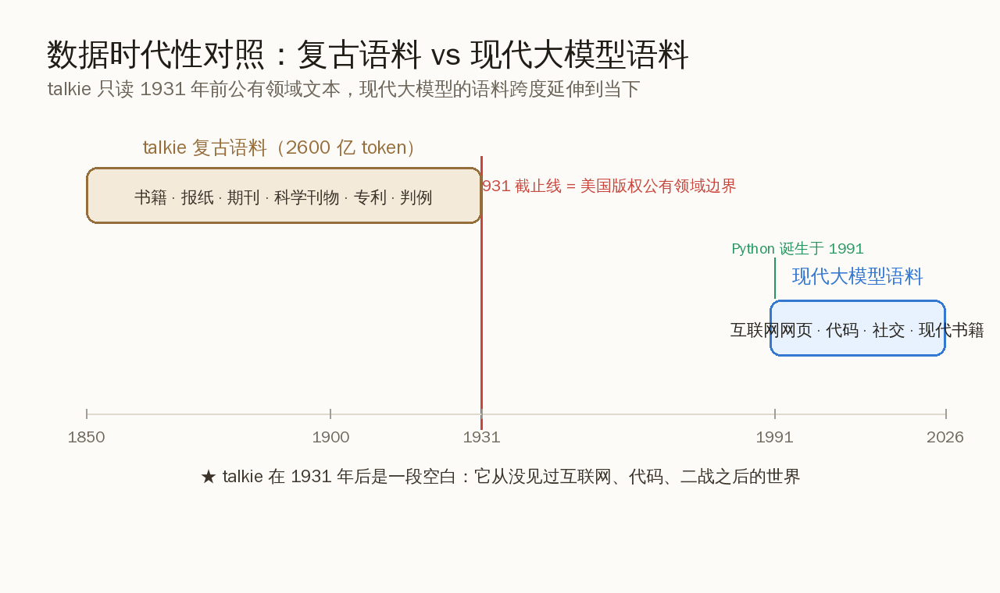
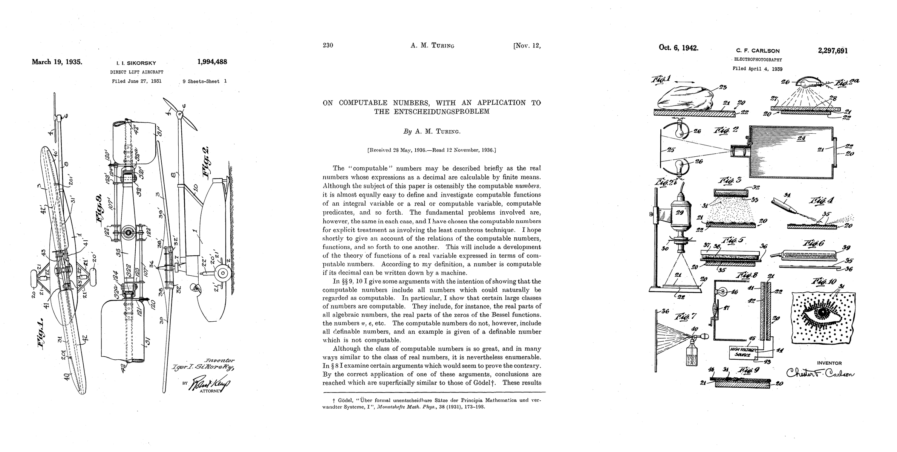
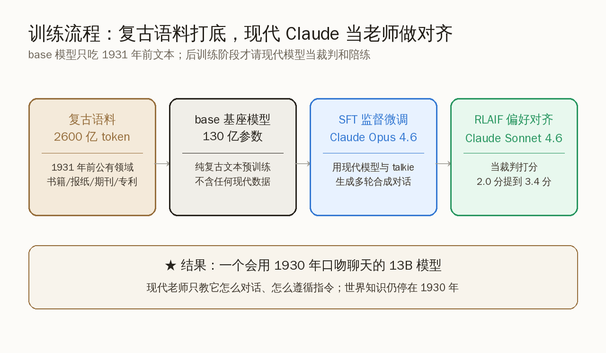
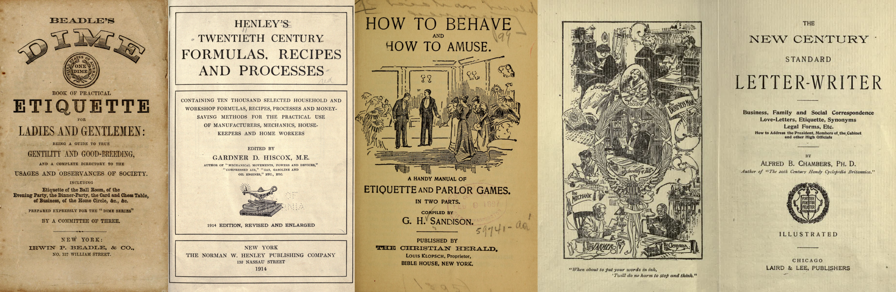
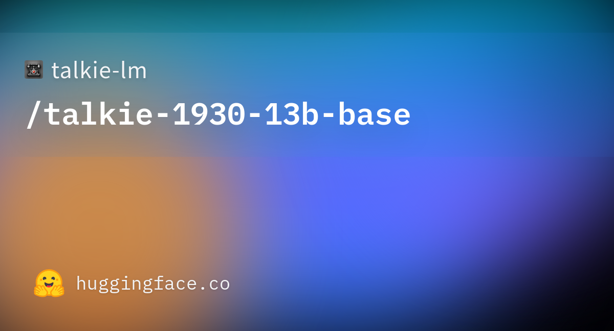

# GPT 之父训了个 1930 年的模型：只读古书，却写出了 Python

一个只读过 1931 年以前书报的 130 亿参数模型，被丢去做 Python 编程题，居然答对了几道——而 Python 这门语言要等到 1991 年才被发明出来。

做出这件事的人，名字很多人熟：Alec Radford，初代 GPT 的主要作者，后来 CLIP、Whisper 也都有他。这次他和 Nick Levine、David Duvenaud 一起，发布了一个叫 talkie 的模型，确切型号是 talkie-1930-13b。它的设定听起来像个行为艺术：**把训练数据严格卡在 1930 年底之前，让模型活在一个还没有计算机、没有二战、没有互联网的世界里。** 然后看它能学会什么、学不会什么。

本文想讲清楚的，不是"有人做了个怀旧玩具"这么简单。talkie 真正在追问的是一个被整个行业绕着走的问题：**一个语言模型的能力，到底有多少来自它读过的具体内容，又有多少来自纯粹的语言规律本身？** 把数据的时代性砍到 1930 年这条干净的线上，恰好给了一个谁都没污染过的实验场。结论可以先放在这里——talkie 证明了"会推理"和"知道事实"是两件可以分开的事，而这件事对所有训练模型的人都有用。

## 为什么偏偏卡在 1930 年：一条版权画出来的干净线

先说最反常识的那个选择：截止日期为什么是 1930 年底，而不是 1920 或者 1945。

答案朴素得有点出人意料——**因为 1931 年是美国版权法里作品进入公有领域的边界。** 在美国，1930 年底之前出版的作品如今版权已过期，可以自由使用；再往后就开始牵扯版权。三位作者选这条线，一半是为了实验干净，一半是为了数据合法：所有训练文本都来自公有领域，不碰任何还在版权保护期内的现代材料。

这条线带来一个意外的研究价值。当下所有大模型都有一个甩不掉的麻烦：**评测污染**。HumanEval、各种 benchmark 的题目早就散落在互联网各处，模型预训练时很可能已经"背"过答案，于是测出来的高分到底是真会做题还是见过题，谁也说不清。

talkie 把这个问题一刀切干净了。它训练数据里最晚的文本停在 1930 年，而几乎所有现代评测集都诞生在那之后。

用作者自己的话说，这是一个"干净的实验环境，用来测一个语言模型能在多大程度上泛化到它预训练数据之外"。换句话说：**当我们能 100% 确定模型从没见过某类知识时，它在相关任务上的表现，就是泛化能力的纯净读数，没有任何记忆的水分。**

作者还顺手做了个很有画面感的实验来验证这条线确实"卡住"了模型。他们从《纽约时报》"历史上的今天"栏目里取了将近 5000 条历史事件描述，逐条算出这些事件对 talkie 来说有多"意外"——技术上是用每字节比特数来量化的，模型越觉得某段文字"出乎意料"，数值越高。把结果按年代分箱后，规律很清晰：**1930 年这条截止线之前的事件，模型读起来都不算意外；一过 1930 年，意外程度就明显抬升，到 1950、1960 年代最强烈，之后趋于平稳。** 这等于给"模型确实活在 1930 年"做了一次定量体检——它对二战之后的世界，是真的一无所知。

## 2600 亿 token 的古书是怎么凑出来的

要训练一个 13B 模型，数据量不能小。talkie 用了 **2600 亿 token 的 1931 年前英文文本**，这在"复古语料"这个小众方向上，是目前已知规模最大的一个。

这些 token 不是凭空来的，而是站在几个公共数据项目的肩膀上拼出来的：

- **Internet Archive（互联网档案馆）**：海量扫描的旧书旧报
- **Institutional Data Initiative**：机构级的历史文献数字化项目
- **Common Pile**：开放许可文本的集合工程

把这些来源汇到一起，语料的构成大致是这几类：

| 文本类型 | 大致内容 |
|---|---|
| 书籍 | 公有领域的文学、学术、技术著作 |
| 报纸 | 当时的日报、周报 |
| 期刊 / 杂志 | 通俗读物与专业期刊 |
| 科学刊物 | 那个年代的学术论文 |
| 专利 | 专利说明书 |
| 判例 | 法律判决文书 |

<small>来源：talkie 项目页展示的语料样张</small>

这一版只用了英文文本，作者给的理由很实在：**验证一条数据管线得对源文档非常熟悉，而他们都是英语母语者。** 多语种扩充被列为下一步的高优先级——既能扩大语料，也能引入更多元的视角。

值得一提的是数据的"洁净度"。现代网页语料里混着大量重复、低质、机器生成的垃圾，得花大力气清洗；而公有领域的旧书旧报虽然有 OCR 识别误差，但内容本身是人类认真写就的出版物，信息密度高、噪声类型也不一样。这本身就是一组有意思的对照。

## 它怎么会写 Python：泛化，不是记忆

现在回到那个最抓人的问题：一个 1930 年的模型，凭什么能写出 1991 年才诞生的 Python？

第一反应当然是怀疑数据污染——是不是有现代代码偷偷混进了训练集？作者的回答是否定的，而他们给出的证据相当有说服力。

先看整体表现：在 HumanEval 这套 Python 编程评测上，**复古模型的得分远远落后于用现代网络数据训练的模型**，这完全在意料之中——它压根没见过代码。但随着模型规模变大，分数虽然低，却在稳步往上爬。

真正关键的是，作者去逐道检查了 talkie 答对的那些题，发现一个清晰的规律：**所有答对的，要么是极简单的单行程序（比如把两个输入相加），要么是对题目里给出的示例代码做小改动。**

其中一个例子特别能说明问题。题目给了一个"旋转密码"的加密函数，要求模型写出对应的解密函数。talkie 的做法是——把加密函数里的一个加号改成减号，一个字符的修改，解密函数就成了。

这背后藏着的，不是它记得 Python 语法，而是**它理解了"解密是加密的逆运算"这件事**。逆函数的概念，1930 年的数学书里写得明明白白。它是把读古书学到的数学直觉，迁移到了一个它从没见过的符号系统上。

> 一个模型能把"逆运算"这个抽象概念，从数学文本迁移到陌生的编程语法上——这恰恰是泛化能力最干净的证据。它不是在背代码，是在用语言里学到的结构去套一个新问题。

这就回到了本文的核心：talkie 把"会推理"和"知道事实"拆开了。它不知道 Python 是什么（事实层面一片空白），但它具备了某种程度的逻辑迁移能力（推理层面有东西）。模型规模越大，这种迁移能力越强——**哪怕训练数据里完全没有现代知识，缩放定律（scaling law）依然在起作用。**

## 请现代 Claude 当老师：一个聪明的绕路

光有个会"补全古文"的基座模型还不够，作者想让它能像 1930 年的人那样跟你对话。这里出现了全篇最妙的一处设计，也是个有点烧脑的悖论。

**问题是这样的**：现代对话模型（比如各家的聊天助手）之所以会聊天、会听指令，靠的是海量现代对话记录和指令微调数据。可这些数据全是 1930 年以后的产物——一旦用上，talkie 就被"现代化"污染了，复古实验也就破功了。

作者的解法分两步走，核心是**让现代模型只教"怎么说话"，绝不教"说什么内容"**。

第一步是**找到 1930 年自己的"对话教材"**。那个年代虽然没有聊天机器人，却有大量结构化的指导类文本——礼仪手册、书信写作指南、菜谱、字典、百科全书。这些文本天然带着"提问—回答""指令—执行"的格式。作者先用这类古籍给模型做了初步微调，让它学会"被问就答"的基本姿态。

<small>来源：talkie 项目页展示的后训练素材样张</small>

第二步才请来现代老师，分成两个阶段：

- **SFT（监督微调）阶段**：用 Claude Opus 4.6（Anthropic 的旗舰对话模型）和 talkie 之间生成的多轮合成对话，做拒绝采样后拿来微调。Claude 在这里扮演"陪练"，陪 talkie 练对话的来回节奏。
- **RLAIF（基于 AI 反馈的强化学习）阶段**：用 Claude Sonnet 4.6 当裁判，对 talkie 生成的回答打分，做在线的偏好优化。效果很直接——遵循指令的能力，在五分制上从 2.0 分提到了 3.4 分。

这里的精妙在于角色的严格切分：**现代模型只负责教"对话的形式"——怎么轮流说话、怎么理解指令、怎么把话说得有条理；至于"说什么内容"，仍然全部来自 talkie 自己那颗只装着 1930 年知识的脑子。** 世界观、事实、语气，统统是复古的；只有交流的礼节是现代老师手把手带出来的。

当然也有翻车的地方。作者发现，talkie 会从 Claude 的输出里"染上"现代的格式习惯——比如用数字编号列表，而这种排版风格在 1930 年并不那么常见。复古的纯度和对话的顺畅，本身就是一对需要不断权衡的矛盾。

## 这个实验真正留下的东西

绕了一圈，talkie 看似是个怀旧玩具，但它沉淀下来的几条判断，对每一个认真训练模型的人都有参考价值。

**第一，能力和知识可以解耦。** 一个完全不知道现代世界的模型，依然能做出需要逻辑迁移的事情。这意味着"模型聪不聪明"和"模型知道多少"是两个可以分开测量的维度——过去它们被现代语料死死绑在一起，分不清谁的功劳。

**第二，它提供了一把测泛化的干净尺子。** 整个行业都在为评测污染头疼，而 talkie 用一条版权画出的时间线，天然隔绝了所有现代评测集。这套思路完全可以推广：想干净地测某种能力，就找一批模型确定没见过的任务来考它。

**第三，"现代模型教形式、历史数据供内容"是个可复用的范式。** 用强模型当裁判和陪练来对齐弱模型，本就是当下流行的做法；talkie 把它用到了一个极端场景，证明了即便基座模型的知识被严格限定，对齐流程依然能让它学会好好说话。这对那些受限于数据、只能用窄领域语料训练模型的场景，是个实在的启发。

下一步，作者的路线图已经摆出来了：

- **今年夏天**：发布一个 GPT-3 级别的复古模型
- **再往后**：把语料扩到一万亿 token 以上，目标做出一个 GPT-3.5 级别、能力接近初代 ChatGPT 的复古模型
- **多语种**：把英文之外的公有领域文本也纳进来

<small>来源：talkie-1930-13b-base 模型卡</small>

模型已经开源，基座版 talkie-1930-13b-base 和指令微调版 talkie-1930-13b-it 都能在 HuggingFace 上下载，配套的推理库[1]用 Apache-2.0 协议放在 GitHub，6 月 1 日凌晨核对约 886 stars[2]。想亲手跟一个"活在 1930 年"的模型聊聊它眼里的世界，门槛并不高。

说到底，talkie 最打动人的地方在于它的克制——它没有去追更高的分数、更强的能力，而是退后一步，问了一个更根本的问题：**当我们说一个模型"聪明"时，我们到底在称赞数据，还是在称赞模型本身？** 把时钟拨回 1930 年，答案反而清晰了几分。这种愿意为了想清楚一件事而专门搭一个干净实验的劲头，恰恰是这个行业一直需要、也一直在受益的东西。

---

**参考链接**

[1] talkie 推理库与项目说明（GitHub）: https://github.com/talkie-lm/talkie
[2] talkie 项目主页 · Introducing talkie: https://talkie-lm.com/introducing-talkie
[3] talkie-1930-13b-base 模型卡（HuggingFace）: https://huggingface.co/talkie-lm/talkie-1930-13b-base
