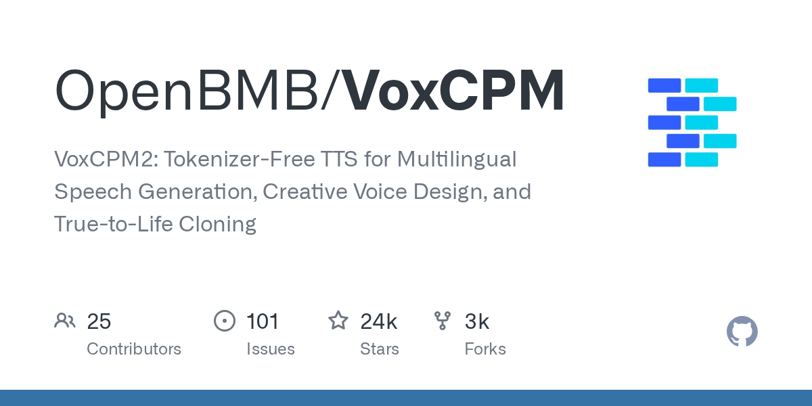
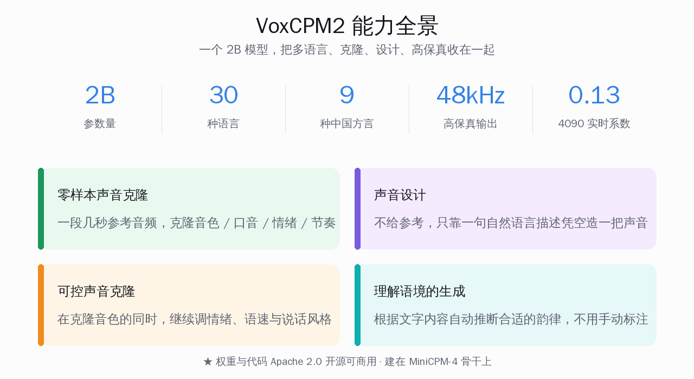
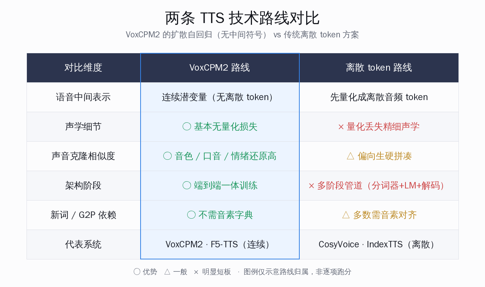
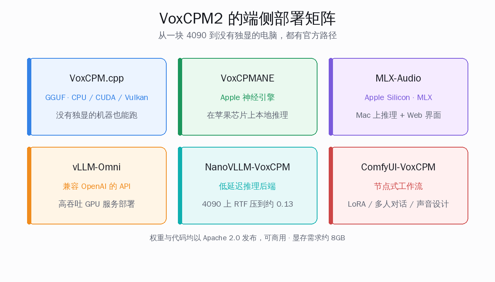

# VoxCPM2：不切音频 token 的开源语音模型

一段几秒钟的录音，喂给模型，它就能用你的声音念出任何一段文字——不光是音色像，连你的口音、语速、那点情绪起伏都跟着学过来。这件事现在不需要云端 API，也不需要一块专业显卡，一个 2B 大小的开源模型就能做到，权重和代码都是 Apache 2.0，商用免费。

这就是面壁智能（ModelBest）和清华团队开源的 **VoxCPM2**。它的仓库 `OpenBMB/VoxCPM` 在 5 月底冲上了 GitHub Trending，6 月 1 日凌晨核对约 23,700 stars、3,000 forks。它最特别的地方不在参数量，而在技术路线：**它不把语音先切成一串离散的音频 token，而是直接在连续空间里建模整段声音。** 这个选择，正好踩在当下语音合成（TTS，Text-to-Speech，文字转语音）最核心的一个矛盾上。

本文想把一件事讲清楚：**VoxCPM2 的"不切 token"到底解决了什么问题，它和大家已经在用的 CosyVoice、F5-TTS 各占什么位置，做语音应用的国内开发者在什么场景下值得换过去。** 结论先放这儿——如果你要的是高保真的声音克隆、自然的情绪韵律，又想自己掌控部署、甚至想在 CPU 或苹果芯片上跑，VoxCPM2 现在是开源里很顺手的一个；如果你做的是要求极低延迟的实时语音对话客服，那还得把流式方案一并配齐再上。

## VoxCPM2 是什么：一个 2B 的语音底座

一句话：**VoxCPM2 是面壁智能开源的语音生成模型，输入文字就能合成 48kHz 高保真语音，能凭一段参考音频克隆声音，也能只靠文字描述凭空"设计"一把新声音。**

先把几个事实摆清楚：

- **作者**是 OpenBMB / ModelBest（面壁智能）联合清华大学相关团队，和此前 MiniCPM 系列小模型同源，VoxCPM2 就建在 MiniCPM-4 这个语言模型骨干上
- **参数量**是 2B，相比上一代 VoxCPM-0.5B 大了一圈，但放在语音模型里仍然算小尺寸，对部署友好
- **许可证**是 Apache 2.0，权重和代码都可商用，国内公司可以放心集成
- **仓库** 2025 年 9 月建立，6 月 1 日凌晨核对约 23,700 stars、3,000 forks，5 月底登上 GitHub Trending
- **配套论文**已上 arXiv（编号 2509.24650），把整套技术路线写得很完整

<small>来源：OpenBMB/VoxCPM 仓库社交卡片</small>

它能干的事，官方归成几类，值得逐个点一下：

- **多语言生成**：支持 30 种语言，大多数情况直接输入目标语言文字即可，不用额外标注语种
- **中国方言**：覆盖 9 种方言——四川话、粤语、吴语、东北话、河南话、陕西话、山东话、天津话、闽南话
- **声音设计（Voice Design）**：不给参考音频，只用一段自然语言描述（比如"一个低沉、沙哑、偏慢的中年男声"），就能造出一把全新的声音
- **可控声音克隆**：用一段简短参考音频克隆音色，同时还能调情绪、语速和说话风格，尽量保留原始音色
- **高保真克隆**：若同时给参考音频和对应文字，模型能更自然地承接参考语音，在音色、节奏、情绪上保留更多细节
- **理解语境**：能根据文字内容自动推断合适的韵律，不用你手动标注语气

从 0.5B 到 2B，从中英双语到 30 种语言，从 16kHz 到 48kHz——这一代基本把开源语音模型常见的能力凑齐了，而且收在一个模型里，不用为不同功能各配一个。

## 核心区别：为什么"不切 token"是关键

这一节是全文的核心判断：**过去的主流 TTS 都得先把语音压缩成一串离散的音频 token 再处理，这一步注定会丢掉声音里最细的那部分信息；VoxCPM2 绕开了这一步，所以克隆出来的声音更像、韵律更自然。**

要理解这件事，得先看传统路线的难处。语音合成长期卡在一个两难里：

- 走**离散 token**这条路（像早期 VALL-E、以及 CosyVoice 用的监督式语义 token），好处是自回归生成稳定、不容易跑飞，但语音被量化成有限的 token 之后，那些精细的声学细节就被不可逆地丢掉了
- 走**连续信号**这条路，能保住完整的声音保真度，但一长就容易"误差累积"，越念越飘，严重时整句话糊成一团听不清

VoxCPM2 的解法很巧：它不是在"稳定"和"保真"里二选一，而是用一个叫**有限标量量化（FSQ，Finite Scalar Quantization）**的瓶颈结构，把信息拆成两部分管。一部分像"骨架"，负责语义和韵律的稳定规划；另一部分是"残差"，负责补回精细的声学细节。整套模型端到端一起训练，中间不再依赖一个预先训练好的音频分词器。

论文里把这套结构讲得很具体，分成几个分工明确的部件：

- **文本语义语言模型（TSLM）**：先生成语义和韵律的"草图"，靠量化稳住，专注于语言层面有意义的规划
- **残差声学语言模型（RALM）**：把量化时丢掉的精细声学细节再补回来，专门负责声音的精修
- **局部扩散解码器（Local DiT）**：在前两者的指引下,生成高保真的语音潜变量

打个不严谨但好理解的比方：离散 token 路线像是先把一幅画压成马赛克再放大，细节回不来了；VoxCPM2 则是把"画什么内容"和"画多细"分开管，内容那条线压得规整、细节那条线保持连续，最后合起来出图。这就是为什么官方反复强调"克隆不再是生硬的拼凑，而是高度还原的语音再生"——细节没在中途被丢掉。

值得一提的是，这条"连续建模"的路并非面壁独创。海外的 **F5-TTS** 也走纯连续（流匹配 + 扩散）路线，同样不需要音素字典；区别在于 F5-TTS 是非流式架构、中文偏弱，而 VoxCPM2 把语义和声学显式分层，又补齐了流式和中文方言。可以说 VoxCPM2 是把这条技术路线，在中文场景和工程完整度上往前推了一截。

## VoxCPM2 相比上一代改了什么

这一代不是简单调大参数。对照官方文档，VoxCPM2 在保留"局部编码器 → 文本语义 LM → 残差声学 LM → 局部扩散"这条四阶段主线的同时，重新设计了三条核心信息流。下面这张表把代际差异列清楚：

| 维度 | VoxCPM 1 / 1.5 | VoxCPM 2 |
|---|---|---|
| 残差 LM 层数 | 6 | 8 |
| FSQ 潜变量维度 | 256 | 512 |
| 最大序列长度 | 4096 | 8192 |
| 音频输出采样率 | 16kHz / 44.1kHz | 48kHz |
| 编解码采样率 | 对称（同采样率） | 非对称（16kHz 输入 → 48kHz 输出） |
| 语义与声学融合 | 加法 | 拼接 + 投影 |
| 支持语言 | 2（中、英） | 30 |
| 可控性 | 无 | 声音设计 + 风格控制 |

几个改动的意思值得点破：

- **非对称编解码**最实用：你只需要给一段普通的 16kHz 录音（手机随手录的就行），模型内部带超分能力，直接输出 48kHz 录音棚级别的音质，省掉额外上采样这一步
- **融合方式从加法改成"拼接 + 投影"**：让模型更灵活地学怎么把语义和声学信息揉到一起，而不是被逐元素相加这种死规矩限制，表现力更强
- **隔离式参考通道**：上一代克隆声音是靠"prompt 续写"——把参考音频拼在前面接着念；这一代给参考音频开了一条专用通道，支持四种模式：零样本（无参考）、续写、仅参考、参考定音色 + prompt 给上下文

## 声音克隆要多少素材，效果怎么样

做应用的人最关心两件事：克隆一个声音要喂多少素材，像不像。

VoxCPM2 的答案是**零样本克隆**——官方口径是"只需一段简短的参考音频"，不需要为某个特定说话人专门微调或重训。它捕捉的不只是音色，还包括说话人的口音、情绪基调、节奏和停顿。论文和示例页里能看到一组很有说服力的演示：

- **情绪克隆**：同一个声音，能切换生气、开心、悲伤、惊讶
- **方言与口音克隆**：从四川话、河南话、粤语，到印度英语、伦敦腔英语
- **录音环境克隆**：连参考音频里的背景特征和录音条件都能一并学过来

如果你愿意多给一点——参考音频再配上它对应的文字转写——模型还能进入"高保真"模式，在音色、节奏、情绪、风格上保留更多细节。这是一个梯度：素材越完整，还原度越高，但门槛始终很低。

它还有两个偏"创作"的能力，对内容生产场景特别有用：

- **声音设计**：完全不给参考音频，只用一句自然语言描述就凭空造一把声音。做有声书、播客、游戏配音时，不用真去找配音演员录样本
- **理解语境的生成**：丢给它一段讲故事的文字、一段天气预报、一首诗，它会自动判断该用什么语气念，不用你手动标注

当然官方也很坦诚地标了限制：遇到极长文本，或者情绪、语气变化特别剧烈的输入，模型仍可能偶发不稳定；声音设计和风格控制提供了更直接的属性调节，但实际效果仍可能有波动。这种坦诚反而比"无所不能"的宣传更可信。

## 端侧能不能跑：这是 VoxCPM2 最被低估的一点

对国内开发者来说，"能不能自己掌控部署"往往比跑分更重要。VoxCPM2 在这件事上准备得相当充分。

先看速度。官方给的实时系数（RTF，Real-Time Factor，数值越小越快，小于 1 就是比实时还快）：

- 在消费级的 **NVIDIA RTX 4090** 上，基础推理 RTF 约 0.30
- 配上专门的 **NanoVLLM-VoxCPM** 推理后端，RTF 能压到约 0.13，适合高并发服务
- 显存需求约 8GB——这意味着一块 4090、甚至显存够的中端卡就能带得动

更值得说的是它的部署矩阵，已经不是"只能在 N 卡上跑"的状态：

- **VoxCPM.cpp**：基于 ggml / GGUF，支持在 CPU、CUDA、Vulkan 上推理——也就是说没有独立显卡的机器也能跑
- **VoxCPMANE**：面向苹果神经引擎（Apple Neural Engine）部署
- **MLX-Audio**：基于苹果 Silicon 的 MLX 框架做推理、API 服务和 Web 界面
- **vLLM-Omni**：基于上游 vLLM 的官方服务方案，支持连续批处理和兼容 OpenAI 的 API
- **ComfyUI-VoxCPM**：接入节点式工作流，支持 LoRA 训练、多人对话、声音设计、自动转写

这套组合的潜台词很清楚：**你可以在自己的 Mac 上本地跑出录音棚级别的语音，也可以在一块 4090 上搭一个高吞吐的语音服务，全程数据不出本机。** 对做隐私优先应用、做端侧 AI、或者单纯不想为语音功能持续付云端 API 费用的开发者，这是实打实的选项。GGUF 这条线尤其关键——它把语音合成的门槛从"得有 GPU"降到了"有台电脑就行"。

## 和 CosyVoice、F5-TTS 怎么选

把同类放一起看，定位会更清楚。这里不堆跑分，只讲取舍：

| 维度 | VoxCPM2 | CosyVoice 2 | F5-TTS |
|---|---|---|---|
| 核心路线 | 扩散自回归（连续，无离散 token） | 监督语义 token + 流匹配 | 纯流匹配 + 扩散（连续） |
| 是否需音素字典 | 否 | 多数需要 | 否 |
| 中文表现 | 强（含 9 种方言） | 强（中文 SOTA） | 中（需微调） |
| 流式 / 低延迟 | 配 NanoVLLM 可低延迟 | 原生流式，约 150ms | 非流式架构 |
| 声音克隆 | 零样本，含情绪 / 方言 / 风格 | 零样本 | 零样本 |
| 声音设计（凭描述造声） | 有 | 较弱 | 无 |
| 端侧 / CPU 部署 | GGUF + 苹果芯片 + MLX | 偏 GPU | 偏 GPU |
| 许可证 | Apache 2.0 | Apache 2.0 | 较宽松 |

落到具体场景，给一个直接的判断：

- **要做高质量配音、有声书、声音克隆，又看重情绪和方言还原** → VoxCPM2，它的连续建模在保真度和表现力上占优，声音设计还能省掉找样本的麻烦
- **要做实时语音对话、客服、语音助手，延迟卡得极死** → 优先看 CosyVoice 2 的原生流式（约 150ms），VoxCPM2 也能配 NanoVLLM 做低延迟，但流式生态 CosyVoice 更成熟
- **以英文短文本朗读、海外 demo 为主，要架构简洁** → F5-TTS 依然轻快
- **想在 Mac 或没有独显的机器上本地跑** → VoxCPM2 的 GGUF / 苹果芯片这条线，目前同类里准备得最全

需要说明的是，这几家都在快速迭代，上面的取舍是按当前各自的成熟度判断，不是谁全面碾压谁。实际选型，建议拿自己真实的文本和参考音频各跑一轮再定。

## 写在最后

VoxCPM2 这次冲上 Trending，热闹的是"几秒录音克隆你的声音"这个直观演示，但真正有分量的是它把"不切音频 token"这条更难走的连续建模路线，在中文场景、方言覆盖、端侧部署上一次性补齐到了能用的程度。

它给国内开发者带来的，不只是又多了一个开源 TTS 选项，而是一个信号：高保真、可克隆、能自己掌控部署的语音能力，正在从云端付费 API 的专属，变成一个 2B 模型、一段几秒录音、甚至一台没有独显的电脑就能拥有的东西。对想把语音真正用进产品、又在意成本和数据掌控权的人来说，这一步的意义，比任何一个跑分数字都更实在。

---

**参考链接**

- [1] OpenBMB/VoxCPM 开源仓库：https://github.com/OpenBMB/VoxCPM
- [2] VoxCPM 论文（arXiv 2509.24650）：https://arxiv.org/abs/2509.24650
- [3] VoxCPM 示例演示页：https://openbmb.github.io/VoxCPM-demopage/
- [4] VoxCPM-0.5B 模型卡（HuggingFace）：https://huggingface.co/openbmb/VoxCPM-0.5B
- [5] VoxCPM 2.0 官方文档：https://voxcpm.readthedocs.io/zh-cn/latest/
