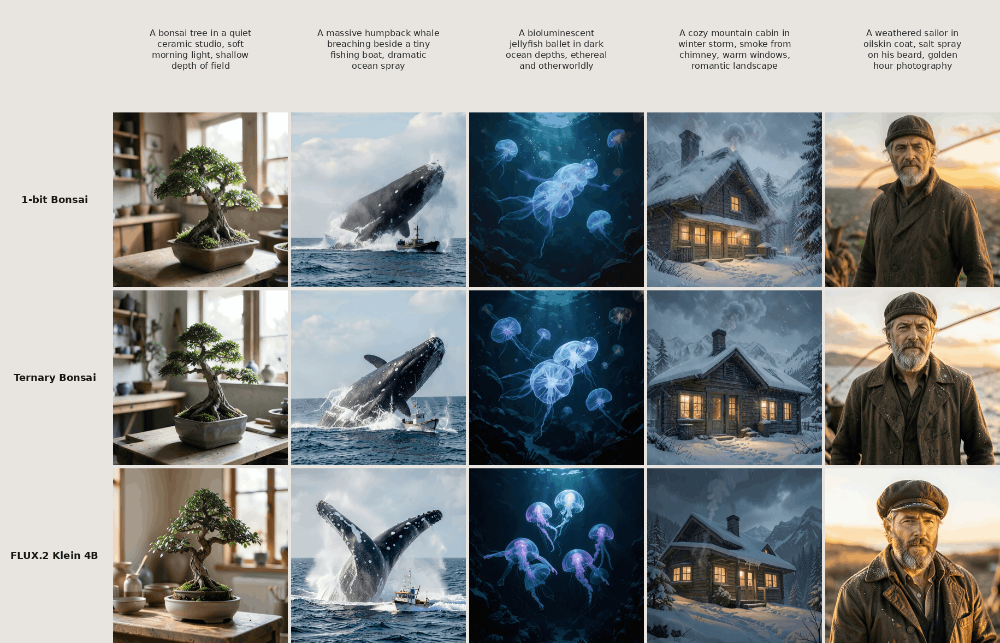
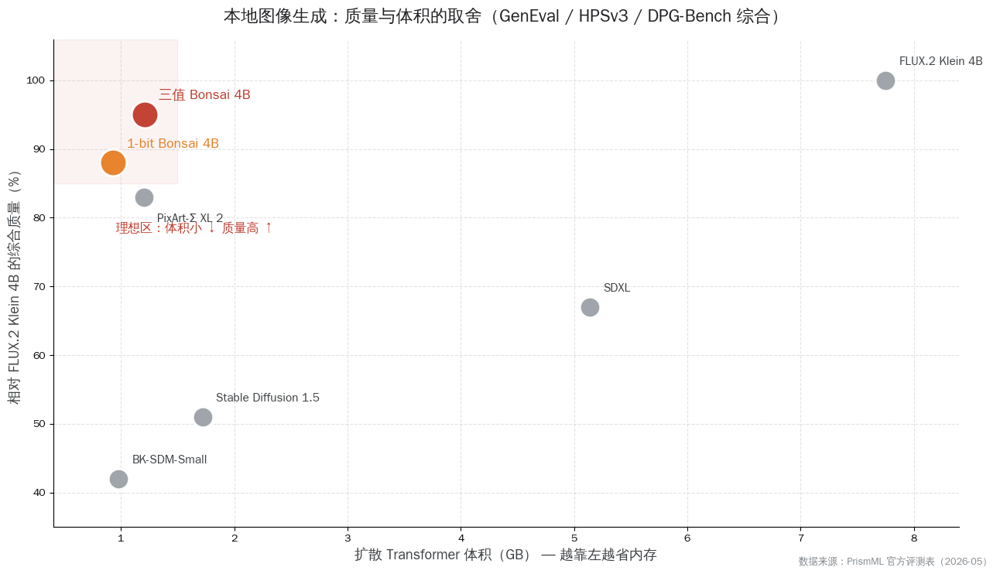
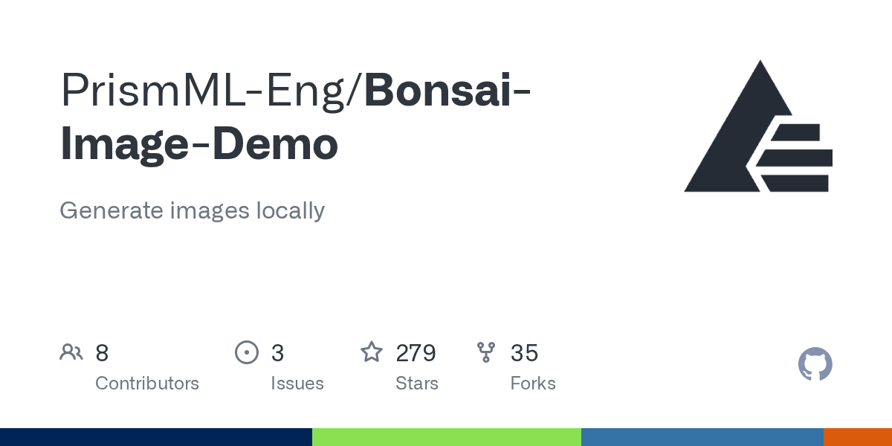

# Bonsai Image 4B：1-bit 量化把画图模型塞进手机

一个 4B 参数的画图模型，全精度状态下扩散主干就有 7.75 GB，跑起来要十几 GB 显存，过去只能待在带独显的台式机或云端 GPU 上。PrismML（一家位于美国帕萨迪纳的高性能模型团队）5 月 26 日放出的 Bonsai Image 4B，把这个主干用 1-bit 二值量化压到了 0.93 GB，用三值（ternary）量化压到 1.21 GB，然后让它在 iPhone 17 Pro Max 上 512×512 出图约 9.4 秒、在 Mac M4 Pro 上约 6 秒。**这是第一个 4B 量级、能整个装进手机内存直接跑的图像生成模型。**

这件事最反直觉的地方是：把每个权重压到只剩 1 个比特，按常识画质应该崩掉，但官方评测里三值版仍保留约 95% 的质量、纯 1-bit 版保留约 88%。它还是 Apache 2.0 开源，权重和推理代码都在 Hugging Face 上。

<small>来源：PrismML 官方发布页样张网格</small>

这篇文章想讲清楚一件事：**Bonsai Image 4B 的真正价值不在于多了一个画图模型，而在于它把"高质量扩散模型必须配大显存"这个前提撕开了一道口子——靠的是激进到 1-bit 的量化，而不是把模型砍小。** 下面顺着五个问题往下走：1-bit 怎么把画图模型压这么狠还不崩、它和要大显存的 SDXL / FLUX 横比差多少、质量和体积到底怎么取舍、本地出图对隐私和成本意味着什么、以及国产手机的 NPU 能不能接住它。

## 1-bit 不是把模型砍小，是把每个权重压成一个方向

先把最容易被当成营销词的"1-bit"讲透，因为它和大家熟悉的"小模型"是两回事。

平时我们说让模型跑得动，惯常做法是把模型做小——参数从 12B 砍到 4B、再砍到 1B，能力随之下降。Bonsai 走的是另一条路：**参数量一个没减，还是 4B，动的是每个权重怎么存。**

全精度模型里，每个权重是一个 FP16 浮点数，占 16 个比特，能表示非常细的数值。Bonsai 的两个版本把这件事推到了极限：

- **1-bit（二值）版**：每个权重只剩两种取值 {−1, +1}，相当于只记一个方向、不记大小。再给每 128 个权重配一个 FP16 的分组缩放系数找回大致幅度，算下来平均每个权重 1.125 个比特。
- **三值（ternary）版**：每个权重三种取值 {−1, 0, +1}，多出来的那个"0"让模型能表达"这个连接干脆不要"，表达力比纯二值更强，平均每个权重 1.71 个比特，业内常叫它 1.58-bit。

对比一下平时听到的量化档位就知道这有多激进：INT8 量化每个权重还有 256 种取值，INT4 还有 16 种，而二值只剩 2 种、三值只剩 3 种。换句话说，它赌的是一件事——**画图模型可能根本不需要那么精确的数值，大部分时候只需要方向信息。** 实测下来，扩散 Transformer 扛住这种极端压缩的能力，比很多人预想的好得多。

具体压了多少，官方给的扩散主干体积对照很直观：

| 模型 | 扩散 Transformer 体积 | 相对 FP16 压缩 |
| --- | --- | --- |
| FLUX.2 Klein 4B（全精度） | 7.75 GB | 1.0× |
| 1-bit Bonsai Image 4B | 0.93 GB | 8.3× |
| 三值 Bonsai Image 4B | 1.21 GB | 6.4× |

值得一提的是，并不是模型里所有东西都压成 1-bit。占比约 5% 的一小撮对精度敏感的张量（叫投影层）保留在 FP16，剩下那些占大头、反复参与计算的矩阵层才做二值/三值。正是这部分大头被压扁，才把整个主干从 7.75 GB 拉到不足 1 GB。Bonsai 不是从零训的，它是在 FLUX.2 Klein 4B 上改的——架构原样保留，只换权重的存法。

## 为什么压扁"扩散主干"是关键：它要被反复调用几十次

要理解为什么 PrismML 死盯着扩散 Transformer 压，得看出图时模型里到底什么在干活。

一次文生图，文本编码器把你的提示词编码成向量，这一步只跑一次，之后就被卸载出内存。真正反复跑的是扩散 Transformer：每一步去噪都要把它整个调用一遍。Bonsai 用的是 4 步采样（FlowMatch Euler，guidance=1.0），主干就要被连续叫 4 次。**所以主干的大小，直接决定了内存压力、内存带宽和出图速度——它是出图过程里被摩擦得最狠的那块。**

把主干压扁之后，连带整个部署包都瘦了一圈。算上压缩过的文本编码器（4-bit 的 Qwen3-4B）和 FP16 的 VAE，Apple 平台上 1-bit 版整包 3.42 GB、三值版 3.88 GB，而全精度 FLUX.2 Klein 4B 要 15.97 GB。更关键的是运行时的实际占用——因为文本编码器编完提示词就卸载了，真正出图时占的内存比整包小得多：

| 场景 | 1-bit 版运行内存 | 三值版运行内存 | 全精度 FLUX.2 Klein 4B |
| --- | --- | --- | --- |
| 出 512×512 图 | 约 1.5 GB | 约 1.96 GB | 约 11.74 GB |
| 出 1024×1024 图 | 约 1.95 GB | 约 2.38 GB | 约 14.39 GB |

这张表是整件事的要害。出一张 512 的图只吃 1.5 GB 左右内存，意味着它能塞进 iPhone、iPad、Mac 这些靠统一内存吃饭的设备。在 iPhone 17 Pro Max 上，全精度 FLUX.2 Klein 4B 根本装不下，而两个 Bonsai 版本都能直接在机器上跑起来。速度方面，iPhone 17 Pro Max 出一张 512×512 约 9.4 秒，Mac M4 Pro 约 6 秒——在 M4 Pro 上，这比官方那套全精度 MFLUX 流程快了约 5.6 倍。

社区里也有人在桌面 N 卡上实测过：一篇广为转发的技术评测提到，三值版在一张 RTX 3080 上峰值显存约 6.8 GiB——对一个能出 1024×1024 的 4B 扩散模型来说，这个占用低到让人意外。要让这些极小的权重表示真的跑得快，还得靠专门的低位算子：Apple 端走 MLX 的低位路径，N 卡端走 Gemlite 的低位 GEMM 内核配 HQQ 运行时，没有这套优化内核，1-bit 反而会慢得没法用。

## 和 SDXL / FLUX 横比：同样的内存档位，质量不是一个量级

光说压得小没用，得知道压完还能不能打。PrismML 把 Bonsai 放进了一组同行里跑 GenEval（看物体组合和属性绑定）、HPSv3（看人类偏好和美感）、DPG-Bench（看密集提示词的语义还原）三个评测，结果如下：

| 模型 | 扩散主干（GB） | GenEval | HPSv3 | DPG-Bench | 相对 FLUX.2 Klein 4B 质量 |
| --- | --- | --- | --- | --- | --- |
| FLUX.2 Klein 4B | 7.75 | 0.819 | 12.84 | 0.853 | 100% |
| 三值 Bonsai Image 4B | 1.21 | 0.723 | 12.22 | 0.851 | 95% |
| 1-bit Bonsai Image 4B | 0.93 | 0.671 | 11.15 | 0.822 | 88% |
| PixArt-Σ XL 2 | 1.20 | 0.541 | 11.93 | 0.769 | 83% |
| SDXL | 5.14 | 0.300 | 10.05 | 0.740 | 67% |
| Stable Diffusion 1.5 | 1.72 | 0.396 | 4.20 | 0.601 | 51% |
| BK-SDM-Small | 0.98 | 0.297 | 3.05 | 0.559 | 42% |

把这张表的两头对齐看，结论就出来了。**和它体积相近的小模型比，Bonsai 是降维打击。** 拿 BK-SDM-Small 来说，体积 0.98 GB 和 1-bit 版几乎一样，但 GenEval 只有 0.297，连 Bonsai 的一半都不到；SD 1.5 体积 1.72 GB 比三值版还大，质量却只有它的一半多。在 1 GB 出头这个内存档位上，过去只能用 SD 1.5、BK-SDM 这类老一代小模型，现在 Bonsai 把现代扩散 Transformer 的水准搬了进来。

反过来和大块头比，它也没装。SDXL 主干 5.14 GB，是三值版的四倍多，GenEval 却只有 0.300，被 Bonsai 甩开一大截——这说明 Bonsai 赢的不只是省体积，是连绝对质量都压过了老一代的大模型。当然天花板还在：FLUX.2 Klein 4B 全精度的 0.819 仍是这组里最高的，Bonsai 是去无限逼近它，不是超过它。

<small>来源：PrismML 官方同提示词出图对照网格</small>

把质量和体积这两个轴画在一张图上，Bonsai 两个点的位置就一目了然——它们牢牢落在"体积小、质量高"那个理想角落，而老一代小模型挤在右下、SDXL 这类大块头浮在中间偏左。

<small>数据来源：PrismML 官方评测表（GenEval / HPSv3 / DPG-Bench 综合）</small>

社区的真人反馈和这张表大体对得上。一些上手试过的人说，它在环境氛围、光影、景深、电影感这类整体观感上表现得出乎意料地好；短板也很明确——精确的文字渲染、物体计数、严格的构图约束、复杂排版仍会翻车。不过这几样恰恰是连全精度大模型也没完全解决的老大难，不能全算到量化头上。也有人提醒，三值版选 0.723 这种分数放在两三年前是顶尖水平、但不是当下的最强，期待它打平云端旗舰并不现实。

## 质量和体积怎么选：两个版本对应两种诉求

1-bit 和三值不是谁取代谁，PrismML 把它们做成了一根滑杆的两端，对应两种很现实的取舍。

- **三值版（1.21 GB，质量优先）**：多出来的"0"状态让它在视觉质量和提示词还原上更稳，官方保留约 95% 质量。代价是比 1-bit 版大约 0.3 GB。适合内存够用、更在意出图好不好看的场景。这也是官方推荐的演示默认档。
- **1-bit 版（0.93 GB，体积优先）**：把主干压到 1 GB 以内，质量保留约 88%。适合内存、带宽、部署体积是硬约束的场景——比如要塞进一个本来就不大的 App 里，或者跑在内存特别紧张的设备上。

这里有个容易被忽略的细节：从 1-bit 升到三值，平均每个权重只多了约 0.6 个比特（1.125 → 1.71），主干只大了约 0.3 GB，质量却从 88% 跳到 95%。**那个"0"状态的性价比相当高**——它让模型能表达"这个连接可以断开"，多出来的这点表达力对画质的拉动很明显。对大多数人来说，只要内存扛得住，三值版是更划算的默认选择。

需要泼一盆冷水的是：所谓"保留 95% 质量"是 PrismML 自己的口径，目前还没有第三方拿 FID、CLIP-score 或人工盲评做出一张能和 SDXL / FLUX 直接对齐的表。而且这个 95% 是三个评测的平均值，具体到人脸、手部、文字渲染这些子类上，回退幅度可能更大。把它当成一个方向上令人鼓舞的信号、而不是已经盖章的定论，更稳妥。

## 本地出图意味着什么：隐私归你，成本归零，迭代不再掐表

把模型压进设备，省下来的不只是显存，而是整个出图这件事的玩法。

图像生成天然是个反复试的活儿：你很少一次出图就满意，总要改提示词、比几张、留好的删差的、再换个说法重来。**当每次生成都是一趟云端请求时，这个反复试错的过程就变成了要掐表、要等、要算账的事。** 本地出图把这层摩擦去掉了——模型一旦装进设备，生成就直接长在产品里，更便宜、迭代更快，提示词和生成的图也都留在自己手上。

这背后是三笔很实在的账：

- **成本归零**：过去做产品要嵌图像生成，要么调云 API（每张约 0.02~0.04 美元），要么自己租 GPU 跑 SDXL / FLUX（每小时约 0.5 美元）。本地出图开了第三条路——把模型装进 App，每张图的边际成本是零。M4 Pro 上 6 秒的延迟比云 API 慢，但对"点一下生成、等一会儿"这种交互完全够用。
- **隐私归己**：提示词和生成的图不出设备，对涉及敏感内容、内部素材、不便上传的创作场景，这是硬需求。飞机上、咖啡馆里、没网的地方，照样能改分镜、试草图。
- **协议友好**：Bonsai 走 Apache 2.0，权重和代码都覆盖，商用无附加分发限制。相比 Stable Diffusion 的 CreativeML OpenRAIL、FLUX 部分小版本的研究授权，想把它嵌进商业产品的团队，法务这关轻松不少。

PrismML 自己也顺手放了个叫 Bonsai Studio 的 iOS App，整模型完全在 iPhone 本地跑，等于给了个现成的端侧出图样板。

<small>来源：PrismML-Eng/Bonsai-Image-Demo 仓库社交卡片</small>

## 国产手机 NPU 能不能接住它：适配这条路通不通

讲了这么多 iPhone 和 Mac，国内读者最关心的大概是：安卓、骁龙、天玑这些国产手机芯片，跑不跑得了？

先说现状：**Bonsai 官方目前只支持 Apple 平台（iPhone / iPad / Mac）和 N 卡 CUDA，还没有放出安卓版。** iPhone 上的推理走 MLX 的 2-bit / 1-bit 路径，需要 iOS 18 以上和 Apple Silicon。安卓侧暂时是空白。

但"没现成的"不等于"跑不了"。把 Bonsai 的思路和端侧图像生成的大方向放一起看，国产手机这条路技术上是通的：

- 量化这件事本身和芯片厂商无关。高通在公开材料里早就把量化、压缩、条件计算列为解锁端侧生成式 AI 的核心手段；骁龙 8 Gen 系列的 NPU 也已经能跑量化后的扩散模型。
- 学术界已有在国产手机上跑通的先例。一项叫 DreamLite 的工作把一个 0.39B 的端侧扩散模型用 W8A8 量化，在小米 14（骁龙 8 Gen3）和 vivo X100（天玑 9300）上，1024×1024 出图做到约 1 秒以内。这说明国产旗舰的 NPU 接住端侧扩散模型，已经不是纸面设想。

把这两点和 Bonsai 拼起来，结论是：Bonsai 把"4B 量级扩散模型能压到手机能跑"这件事在 Apple 端验证通了，而国产手机的 NPU 算力和量化工具链也具备接住同类模型的条件——**缺的不是硬件能力，是有人把 1-bit / 三值这套低位算子在骁龙、天玑的 NPU 上铺好。** 考虑到 Bonsai 是 Apache 2.0 全开源、底层又是大家熟悉的 FLUX 架构，移植的门槛不算高，国内端侧 AI 团队接下来值得盯一盯这条线。

## 它撕开的口子，比模型本身更重要

回到开头那个反直觉的点：把每个权重压到只剩一个比特，画质居然没崩。Bonsai Image 4B 真正的意义，不是榜单上多了一个分数体面的画图模型，而是它用一个能跑通、能上手的例子说明——**现代图像模型对数值精度的需求，可能被我们高估了一个数量级。** 当 1.21 GB 的扩散主干就能在消费级设备上出 1024×1024 的图，"画图必须配大显存"这个默认前提，就到了该重新审视的时候。

对国内做端侧 AI、做创作工具、做隐私优先方案的开发者来说，这是一个值得收进工具箱的信号。它当下还有边界：质量天花板低于云端旗舰，文字和精确构图仍会翻车，安卓版还没影，95% 的质量也还等第三方复核。但方向已经很清楚——高质量图像生成正在从"只有大显存玩家入场"，慢慢挪到每个人手里那台设备上。这道口子一旦撕开，后面跟上来的会越来越多。

---

参考链接：

[1] PrismML 官方发布页 · Introducing 1-bit and Ternary Bonsai Image 4B: https://prismml.com/news/bonsai-image-4b
[2] PrismML 官方公告 · PR Newswire: https://www.prnewswire.com/news-releases/prismml-releases-bonsai-image-4b-302782354.html
[3] 三值版模型卡 · Hugging Face prism-ml/bonsai-image-ternary-4B-mlx-2bit: https://huggingface.co/prism-ml/bonsai-image-ternary-4B-mlx-2bit
[4] 推理代码仓库 · PrismML-Eng/Bonsai-Image-Demo: https://github.com/PrismML-Eng/Bonsai-Image-Demo
[5] r/LocalLLaMA 社区讨论: https://www.reddit.com/r/LocalLLaMA/comments/1togflk/prismml_just_released_binary_and_ternary_bonsai/
[6] 技术解读 · Data Science in Your Pocket: https://medium.com/data-science-in-your-pocket/bonsai-image-worlds-1st-1-bit-image-generator-5afb94cb6f20
[7] DreamLite · 端侧统一扩散模型（小米 14 / vivo X100 实测）: https://arxiv.org/html/2603.28713v1
[8] EdgeFusion · 端侧文生图与 NPU 部署: https://arxiv.org/html/2404.11925
