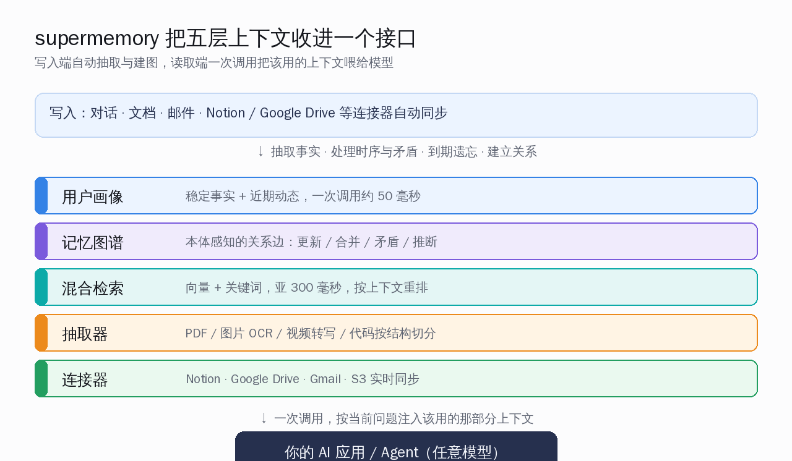
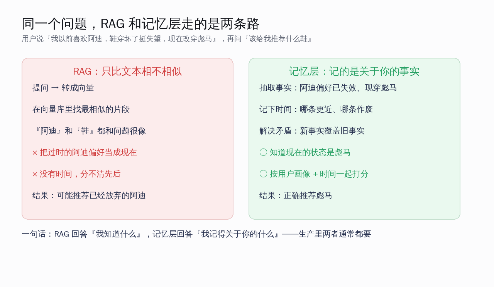
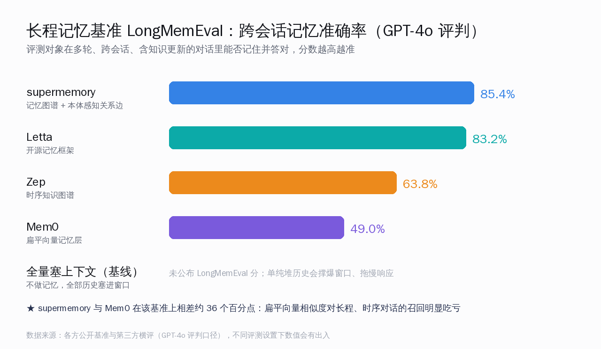

# supermemory：给 AI Agent 装一层记得住你的记忆


用过 ChatGPT、Claude 或者任何一个 AI 助手的人，都撞过同一堵墙：这一轮聊得好好的，它记得你是做后端的、偏好 Python、项目用的是 PostgreSQL；换个窗口重新开一段，它就像第一次见你，把所有偏好、项目背景、上次的结论统统忘光，又得从头交代一遍。**AI 真正的记忆问题不是它笨，而是它根本没有跨会话的长期记忆——一关窗口，关于你的一切清零。**

supermemory（仓库 `supermemoryai/supermemory`）想正面补上的就是这一块。它给自己的定位是一句话：**AI 时代的记忆 API，给 AI 装上记得住事的那一层。** 6 月 1 日凌晨核对仓库，总 star 约 2.35 万、2100 多 fork、TypeScript 写成，2024 年 2 月建库，最近一直在 GitHub Trending 在榜。它对外宣称在 LongMemEval、LoCoMo、ConvoMem 这三个 AI 记忆主流基准上都排第一。


<small>来源：supermemoryai/supermemory 仓库社交卡片</small>

这篇文章想把几件事讲清楚：**Agent 的持久记忆到底要解决上下文窗口之外的哪个问题、supermemory 这套写入到检索的架构是怎么搭的、它和大家熟的 RAG、向量库、Mem0 差在哪、给 Claude Code 和 Cursor 接一层记忆怎么落地、以及隐私和本地化这条路能走多远。** 结论先放这儿——如果你的痛点是"Agent 老是忘记用户、每次都从零开始"，记忆层是当下最对症的补丁，supermemory 把记忆和检索打成了一个接口；但它是托管为主的方案，自建和数据自主这条线上要权衡的东西不少。

## 上下文窗口再大，也不等于有记忆

先说清楚一个常被混淆的事：**上下文窗口大，和"有记忆"是两码事。**

很多人觉得，现在模型动不动 100 万 token 上下文，把历史全塞进去不就行了？真到生产里这条路走不通，原因很实在：

- **塞历史会撑爆窗口、也会拖慢响应。** 第三方横评里有个对照数字很说明问题——不做记忆、把全部历史硬塞进上下文这种基线做法，单轮端到端要十几秒、吃掉两万多 token；而走记忆层的方案只取该用的那一小块，token 和延迟都降一个量级。
- **塞进去不等于用得对。** 模型看到一大段历史，未必能从里面挑出此刻真正相关的那几条；越长的上下文里，关键事实越容易被淹没。
- **历史是无限增长的，窗口是有限的。** 一个长期用户聊了半年，记录早就超出任何窗口。

所以"记忆"要解决的，不是"能不能装下"，而是**在海量历史里，把此刻关于这个用户该记住、该用上的那几条事实，准确地拎出来注入。** 这跟"把文档塞进窗口"是完全不同的工程。

supermemory 在文档里把这件事拆成两个概念，值得国内开发者先记住：

- **文档（Document）**是静态知识。一篇讲 Python 的资料对谁都一样，不随访问者变化，不带时间，适合做语义相似检索。
- **记忆（Memory）**是关于具体用户、会随时间演变的事实。"这个用户偏好深色模式"只对他成立，且某天可能作废。

把这两件事分开，是理解后面所有架构的前提。

## supermemory 的五层：写入端建图，读取端一次注入

把 supermemory 当成"又一个向量库"会错得很远。它官方把自己描述成**五层上下文收进一个接口**：用户画像、记忆图谱、检索、抽取器、连接器。



拆开看，它分写入和读取两条线。

**写入这条线，核心是"理解"而不是"存档"。** 你把对话、文档、邮件丢进去，它不是原样存下来，而是跑一条处理流水线：抽取事实、判断这条新事实和已有记忆有没有矛盾、要不要更新或合并、给到期的信息打上遗忘标记，最后把这些事实之间的关系连成一张图。官方把这张图叫"活的知识图谱"——内容不是孤立躺着，而是互相之间有"更新""扩展""推断"这类带语义的关系边。举个直观的例子：用户先说"我用 MySQL"，过两个月说"迁到 Postgres 了"，系统不会傻乎乎存成两条并列事实，而是让新事实把旧的标记作废。

**读取这条线，核心是"一次调用，按需注入"。** 它对外主要就两个动作：

- **添加记忆**：`POST /v3/add`，把内容连同一个 `containerTags`（通常是用户 ID 或项目 ID）丢进去。
- **检索记忆**：`POST /v3/search`，按当前问题取回最相关的记忆和文档片段。

检索默认走**混合模式**——向量相似度加关键词一起算，再按上下文重排，官方称延迟做到亚 300 毫秒。还有一个更省事的动作叫**用户画像**：系统从历史里自动维护出一份关于该用户的画像，分"稳定事实"和"近期动态"两块，一次调用约 50 毫秒就能把这份画像拿到手，不用每次都去逐条搜记忆。

五层里对国内开发者特别实用的是**抽取器**和**连接器**这两层。抽取器能吃 PDF、图片（OCR）、视频（转写）、代码（按语法结构切分），上传进去自动变成可检索的记忆；连接器则把 Notion、Google Drive、Gmail、S3 这些你已经在用的数据源接进来自动同步。也就是说，记忆的来源不止聊天记录，你日常的工作资料也能成为 Agent 的长期记忆底料。

## 记忆层和 RAG 不是一回事，别拿 RAG 当记忆用

这是最值得讲透的一点，因为大量团队踩的坑就是**用 RAG 来做记忆，然后纳闷 Agent 为什么总记错。**



RAG 的本质是：把问题转成向量，去库里找语义最相似的片段，塞进提示词。它回答的是"**我知道什么**"——内容相不相关，是内容自己的属性，跟"谁在问"无关。

记忆要回答的是另一个更难的问题："**关于这个用户，此刻我该记起什么**"。这里有几个 RAG 天生不管的信号：

- **时间。** 用户说"上个月搬到柏林了"，纯向量检索可能反而把旧地址翻出来，因为旧地址和"地址"这个词更像。RAG 没有"事实何时生效、何时作废"的概念。
- **用户隔离。** 同一个问题，RAG 对谁都返回一样的结果；记忆必须先按用户 ID 把检索范围圈到这个人，再做相似度。这在多租户系统里是硬要求——共享一个不分区的索引，两个问法相近的用户能通过向量临近度互相串到对方的偏好，不需要任何越权。
- **重要性。** "对花生过敏"该比"喜欢爵士乐"排得更靠前，哪怕后者和当前问题更像。
- **写入路径。** RAG 是只读的，索引一次然后查；记忆需要一条写入路径，从对话里抽事实、决定存什么、信息变了要更新而不是简单追加一条矛盾的。

supermemory 的做法是**两个都给你**：文档走 RAG 那套（静态、通用、不绑用户），记忆走带时间和用户画像那套，检索时一次调用把两边该用的都拿回来。一句话记住——**RAG 答"我知道什么"，记忆答"我记得关于你的什么"，生产里大多数 Agent 两个都需要。**

## 和 Mem0 横着比：一个是全栈平台，一个是轻量记忆层

国内开发者选型时，supermemory 最直接的对手是 Mem0（约 5.1 万 star 的开源记忆层）。两个解决的是同一个"AI 健忘症"，但赌注下得不一样。



| 维度 | supermemory | Mem0 |
|---|---|---|
| 定位 | 全栈上下文平台：记忆 + RAG + 用户画像 + 连接器 + 文件处理 | 聚焦的记忆层：add / search / delete 三件套 |
| 接入哲学 | 给一个用户 ID，平台自动建画像、自动注入 | 开发者自己决定何时写、何时读，控制粒度细 |
| 长程基准 | 在 LongMemEval 等公开基准上自报领先，第三方横评给到约 85% 量级 | 第三方横评 LongMemEval 约 49%、LoCoMo 约 67% |
| MCP | 官方 MCP 服务，一行配置接进 Claude / Cursor / Windsurf | 主打 SDK，MCP 需自行实现 |
| 用户画像 | 自动维护"稳定事实 + 近期动态"的画像 | 存记忆，但不自动聚合成用户画像 |
| 自建 / 数据自主 | 核心 MIT 开源，但完整能力依赖托管 API | 提供完整可自托管的开源版 |

几点要给国内读者讲实在：

- **基准分要带保留地看。** supermemory 在多个公开 AI 记忆基准上自报第一，第三方横评里它和 Mem0 在 LongMemEval 上确实拉开了约 36 个百分点的差距，这个差距方向是可信的——扁平向量相似度在长程、跨会话、含时序更新的对话上吃亏，是这一类基准反复验证过的。但具体数值在不同评测设置（谁当评判模型、上下文怎么截）下会浮动，社区里也一直有人质疑 LoCoMo、LongMemEval 这些基准本身的设计严谨度。**别把某个具体百分比当成铁板钉钉的结论，看相对趋势就好。**
- **全栈 vs 轻量是真实的取舍。** supermemory 把记忆、RAG、画像、连接器打成一个平台，少了很多自己拼接的活，但你也把更多东西托付给了它的黑盒——为什么取回这条记忆、想自己调记忆逻辑，可见的旋钮比开源框架少。Mem0 把记忆做成可检查的对象，控制和可观测性更强，自托管也更直接。
- **谁更适合谁。** 想最快上线、要画像和连接器开箱即用、benchmark 召回质量是硬指标——supermemory 顺手；要细粒度掌控记忆生命周期、要把记忆层嵌进已有栈而不替换、要数据完全自主——Mem0 的路更顺。

## 给 Claude Code、Cursor 接一层记忆：怎么落地

supermemory 真正出圈的地方，是它的**分发方式**：一个 MCP 服务，让任何兼容 MCP 的客户端瞬间拥有跨工具的持久记忆。

最省事的装法是一行命令（把 `claude` 换成你的客户端，比如 `cursor`、`windsurf`、`vscode`）：

```bash
npx -y install-mcp@latest https://mcp.supermemory.ai/mcp --client claude --oauth=yes
```

或者手动写进 MCP 客户端配置：

```json
{
  "mcpServers": {
    "supermemory": {
      "url": "https://mcp.supermemory.ai/mcp"
    }
  }
}
```

它默认走 OAuth，客户端会自动发现授权服务器并弹出登录。接上之后，**你在 Cursor 里定下的项目约定、在 Claude Desktop 里聊过的偏好，能跨工具共享同一份记忆**——这正是"换个窗口就失忆"最难受的地方被补上的点。官方还为 Claude Code、OpenClaw、OpenCode 这些工具单独做了开源插件，自动抓取会话、按需注入。

如果是自建 Agent，直接用 SDK 更可控。Python 和 JavaScript 都有官方 SDK，三个动作就能跑起来：

```python
import os
from supermemory import Supermemory

client = Supermemory(api_key=os.environ.get("SUPERMEMORY_API_KEY"))

# 写入一条记忆，绑到具体用户
client.add(
    content="用户偏好 Python，项目用 PostgreSQL，部署在自有机房",
    container_tags=["user_123"],
)

# 检索：按当前问题取回该用户最相关的记忆 + 文档片段
results = client.search.memories(
    q="该给这个用户推荐什么数据库方案",
    container_tag="user_123",
    search_mode="hybrid",   # 混合：记忆 + 文档片段，官方推荐
    threshold=0.6,
    limit=5,
)

# 一次性拿用户画像，约 50ms，省得每轮逐条搜
profile = client.profile(container_tag="user_123")
print(profile.profile.static, profile.profile.dynamic)
```

落地时有两个工程点值得提前想清楚：

- **`containerTags` 就是你的多租户隔离边界。** 写入和检索都带上用户或项目标识，记忆才不会在用户之间串。这件事要在一开始就做对——等积累了几百万条记忆再回头补隔离，是一次很痛的重建。
- **代理模式省事但有代价。** supermemory 还提供一种"记忆路由"接法，让你的请求先过它再转给模型，自动注入画像和记忆，几乎不用改业务代码。代价是多一跳延迟、注入哪些记忆由它的算法决定、每次请求都过它会更快消耗额度。要细控就用显式的 add / search，不要图省事全走代理。

## 隐私和本地化：开源到哪、数据自主到哪

对国内团队，最现实的两个问题是：**数据能不能不出我自己的环境、能不能本地化部署。** 这块要说得诚实。

- **核心开源、完整能力托管。** supermemory 的核心在 MIT 协议下开源，但官方反复强调"完整平台的全部能力依赖托管 API"。也就是说，用一行 MCP 接上的那套体验，记忆是存在它云端的。对数据敏感、要求完全自主的团队，这一点必须先掂量。
- **想要完全数据自主，Mem0 的自托管路更直。** 如果"数据不出本地"是硬约束，Mem0 提供完整可自托管的开源版本，把核心记忆能力跑在自己机器上，是更直接的选择；supermemory 走自托管要付出的拼装成本更高。
- **合规资质是它面向企业的卖点。** 第三方横评提到 supermemory 拿了 SOC 2 Type II、HIPAA、GDPR 这类合规认证，对医疗、金融、法务这种数据驻留和审计是硬要求的场景，托管反而省掉了自己做合规工程的活。但这套合规是按海外框架来的，跟国内的数据出境和等保要求不是一回事，**国内团队不能直接照搬，得按自己的合规口径单独评估。**

一句话给到判断：**做面向海外用户的产品、又想省掉记忆基础设施的活，supermemory 托管很顺手；数据必须留在境内、要完全自主可控的国内场景，优先考虑能干净自托管的方案，或者只把 supermemory 的开源核心拿来在自己环境里改造。**

## 写在最后

AI 从"一次性问答"走向"长期陪着你的助手"，记忆这一层迟早是标配——一个记不住你是谁的 Agent，再聪明也只是个高级搜索框。supermemory 把记忆和检索这件原本要自己拼几周的脏活，收成了一行就能接的接口，还顺手把用户画像、连接器、文件处理都给齐了，这是它在 GitHub 上被持续关注的实在原因。

对国内开发者，它最大的价值不一定是直接用它的托管服务，而是**它把"Agent 记忆该怎么设计"这件事讲清楚了**：记忆不是更大的窗口，不是又一个向量库，而是带时间、带用户隔离、能处理矛盾和遗忘的一套独立工程。理解了这套思路，无论你是接它、接 Mem0、还是自己造一层，都不至于再把 RAG 当记忆用。这一层补上，你的 Agent 才算真的开始"认得"用户——而这恰恰是它从工具变成助手的那一步。

---

参考链接：

- [1] supermemoryai/supermemory 仓库：https://github.com/supermemoryai/supermemory
- [2] supermemory 研究与产品页（五层上下文）：https://supermemory.ai/research/
- [3] supermemory 文档·Memory 与 RAG 的区别：https://supermemory.ai/docs/concepts/memory-vs-rag
- [4] supermemory 文档·搜索接口：https://supermemory.ai/docs/search
- [5] supermemory 文档·MCP 安装与使用：https://supermemory.ai/docs/supermemory-mcp/setup
- [6] supermemory SDK（Python / JavaScript）：https://supermemory.ai/docs/integrations/supermemory-sdk
- [7] LogRocket 横评·Mem0 与 Supermemory：https://blog.logrocket.com/building-ai-apps-mem0-supermemory/
- [8] AgentMarketCap 记忆系统横评·Mem0 / Zep / Letta / Supermemory：https://agentmarketcap.ai/blog/2026/04/08/ai-agent-memory-shootout-2026-mem0-zep-letta-supermemory
- [9] Mem0 官方·RAG 与 AI 记忆的区别：https://mem0.ai/blog/rag-vs-ai-memory
- [10] DataCamp 教程·给 AI Agent 加持久记忆：https://www.datacamp.com/tutorial/supermemory-tutorial
