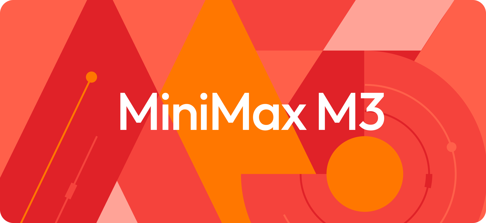
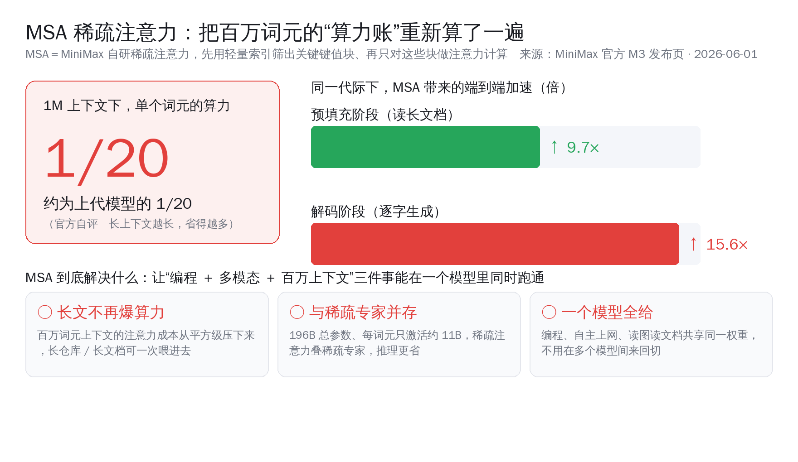
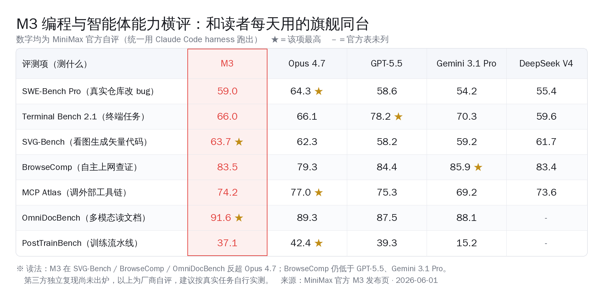
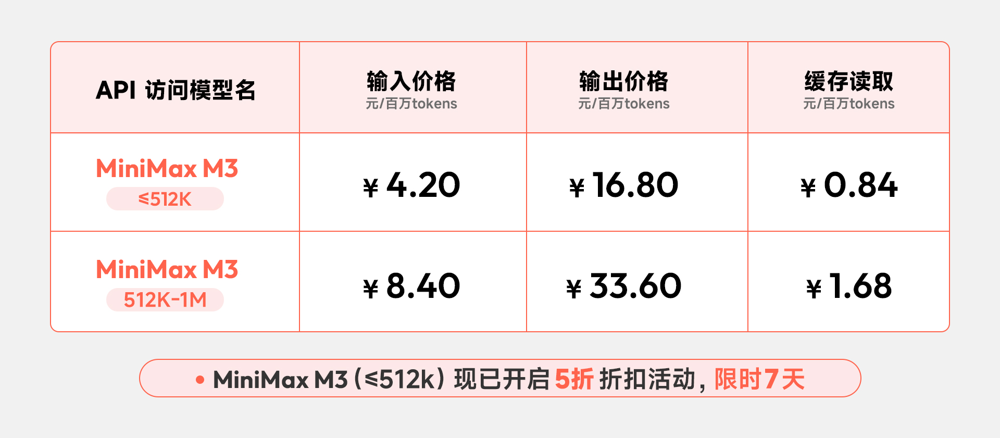
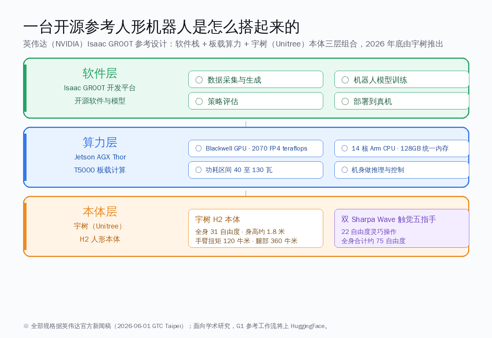
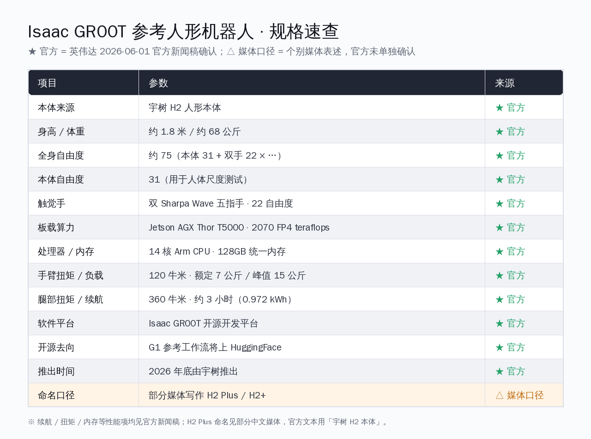
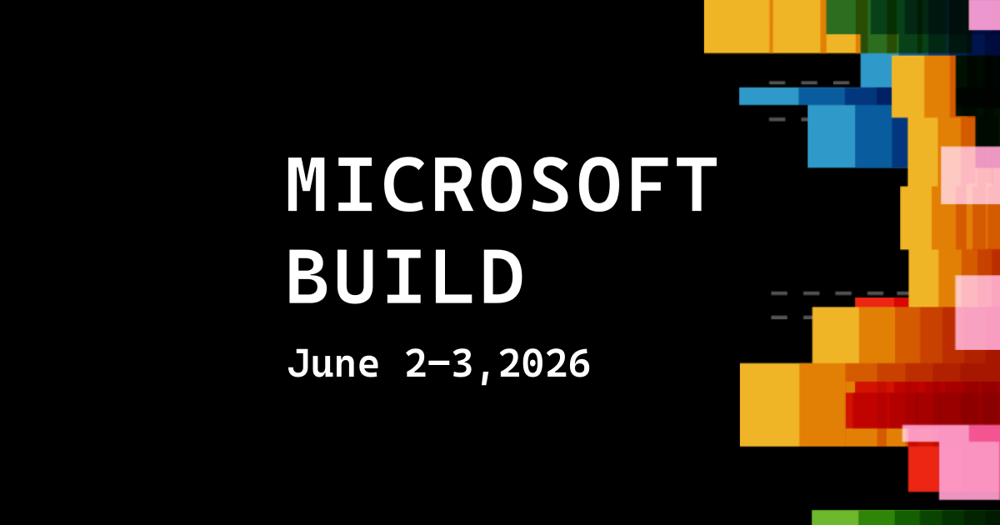
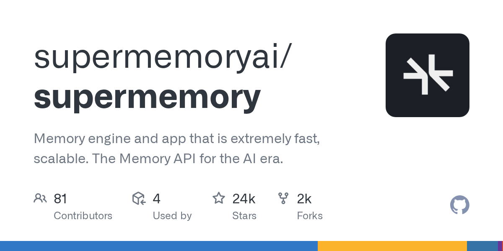
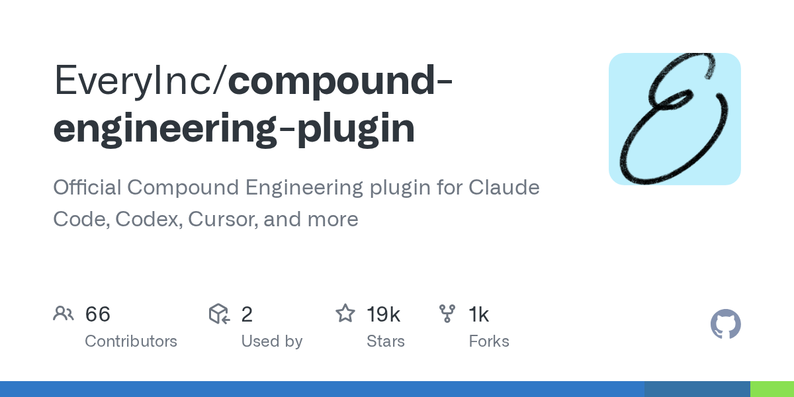
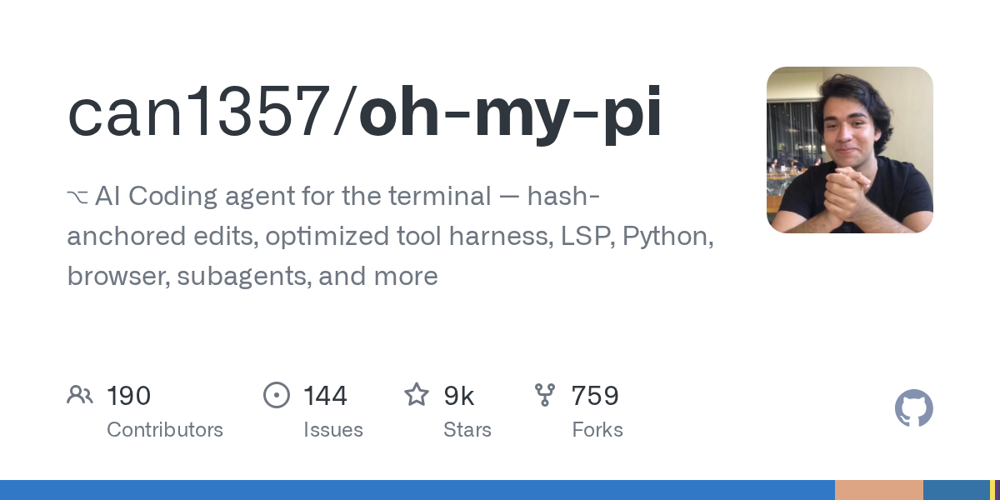

# MiniMax M3 五折上线主打编程 · 宇树本体进英伟达开源人形机 · 微软自研模型要换掉 Copilot 里的 GPT | AI 日报 | 2026-06-02

## 📋 头版目录

- 🇨🇳 MiniMax M3 旗舰 6/1 发布，自研 MSA 稀疏注意力把百万上下文单词元算力压到上代约 1/20，SWE-Bench Pro 自评 59.0% → 头条 1
- 🇨🇳 英伟达 GTC 台北开源人形机器人参考设计 Isaac GR00T，本体直接用宇树 H2 Plus，全身约 75 自由度 → 头条 2
- 🛠 微软 Build 2026 旧金山开幕，自研编码模型 Project Polaris 8 月起接管 GitHub Copilot 默认引擎 → 头条 3
- 💸 Anthropic 6/1 向美国证监会秘密递交招股书，估值约 9650 亿美元，赶在 OpenAI 前面冲上市 → 要闻
- 💰 GitHub Copilot 6/1 转按量计费正式生效，重度用户预估月账单跳涨数倍 → AI Coding
- 🇨🇳 宇树科技 6/1 科创板 IPO 过会，73 天过会刷新纪录，2025 营收 16.99 亿元同比涨 330% → 头条 2
- 🧠 MiniMax M3 限时五折，标准档输入 ¥2.1、输出 ¥8.4 每百万词元，权重与技术报告 10 天内开源 → 头条 1
- 🤖 Isaac GR00T 算力用 Jetson Thor 模组、2070 FP4 TFLOPS、128GB 统一内存，宇树年底开售 → 头条 2
- 📰 Karpathy 加入 Anthropic 预训练团队，此前用编码智能体自动调参把训练时间压低约 11% → 名人说
- 🎙 Simon Willison 给智能体下了被广泛接受的定义，并连发安全提醒：别用近乎 root 的权限跑编码智能体 → 名人说
- 🎙 Yann LeCun 离开 Meta 自立门户 AMI Labs，押注世界模型而非纯大模型，种子轮 10.3 亿美元 → 名人说
- 🔥 PewDiePie 自托管 AI 工作台 Odysseus 两天涨到约 2 万星，本地优先题材连热一周 → GitHub Trending
- 🔥 记忆引擎 supermemory 约 2.4 万星、Compound Engineering 插件约 1.9 万星，智能体记忆与跨端工作流走红 → GitHub Trending
- 🔬 阶跃星辰 Step-3.7-Flash 201B 图文模型、美团 LongCat 视频数字人近 24 小时刷新 → 国内 AI
- 🛠 mcp2cli 把 MCP 工具变命令行，自测省 96%–99% 上下文令牌，约 2200 星 MIT 开源 → AI Coding
- 🛡 编码智能体沙箱安全升温：Codex 从 docker 用户组绕过限制的讨论延续，加固清单成刚需 → AI Coding
- 🧠 谷歌 Gemini Spark 全天候个人智能体进入受信测试，下周面向 Ultra 用户开美区公测 → 快讯
- ⚖️ 苹果 WWDC 6/8 开幕在即，iOS 27 预计带谷歌 Gemini 驱动的新版 Siri → 值得关注
- 🏭 国产 GPU 算力梯队更新：华为昇腾 950 系路线图、寒武纪首次年度盈利 → 值得关注

## 🔥 头条深度

### 头条 1 · MiniMax M3 把编程、百万上下文、多模态压进同一个模型

> 来源：MiniMax 官方博客 minimax.io，2026-06-01 M3 发布主视觉

MiniMax（稀宇科技）6 月 1 日发布新一代旗舰 M3 [1]，把三件过去要分开做的事放进了一个模型：前沿编程、百万词元上下文、原生多模态。对国内开发者来说，最实在的一点是它的价格——标准档输入 ¥2.1、输出 ¥8.4 每百万词元，只有同档海外旗舰的零头。M3 当天先开 API，权重和技术报告承诺 10 天内在 HuggingFace 与 GitHub 放出。

#### 头条 1.1 · MSA 稀疏注意力把百万词元的算力账重新算了一遍

M3 的工程核心是自研的 MSA（MiniMax 稀疏注意力）。官方给出的口径是：在 100 万词元上下文下，M3 处理每个词元的算力约为上一代的 1/20，相当于降低约 95%；预填充阶段加速约 9.7 倍，解码阶段加速约 15.6 倍。

这条路线解决的是一个很具体的痛点。过去把上下文拉到百万级，算力和显存几乎是平方级往上涨，长上下文好用但烧钱。MSA 用稀疏的方式只让每个词元关注真正相关的一小部分，把这条曲线压平，长上下文从"能用但贵"变成"可以日常开着用"。

#### 头条 1.2 · 编程自评领先，桌面操作还差一口气

M3 在编程与智能体方向给出了一组官方自评成绩，放进读者每天用的旗舰坐标系里看，几条结论比较清楚：

- **SWE-Bench Pro 自评 59.0%**，高于 GPT-5.5 与 Gemini 3.1 Pro，接近但没有反超 Claude Opus 4.7；
- **BrowseComp 自评 83.5**，高于 Opus 4.7 的 79.3，浏览类任务上拿到领先；
- Terminal-Bench 2.1 拿到 66.0%，MCP Atlas 74.2%，读图文文档的 OmniDocBench 高于 Gemini 3.1 Pro；
- 桌面操作、后训练这类项目仍落在头部之后，PostTrainBench 自评 37.1 排第三，差距是真实存在的。

需要点明的一句：以上全部是 MiniMax 自评，权重还没公开，独立复现要等开源之后。把它当成"厂商给的起点参考"，真正的分数在你自己的任务里。

#### 头条 1.3 · 价格才是这次最锋利的一刀

> 来源：MiniMax 官方定价页 minimax.io，2026-06-01

M3 把价格按上下文长度分两档，512K 以内享受发布后七天五折。标准档输入 ¥2.1、输出 ¥8.4 每百万词元，优先档输入 ¥3.15、输出 ¥12.6，缓存读取低到 ¥0.42。海外媒体的横向口径是，这个价位大约只有 GPT-5.5、Gemini 3.1 Pro 同类调用成本的 5% 到 10%。

**产业含义**：M3 这次走的是"把能力收进一个模型、再把价格打到地板"的组合拳。对国内做编程智能体、长文档处理、多模态应用的团队，它提供了一个把"贵的能力"日常化的选项。开源待发是唯一需要耐心等的一环——权重开源、社区独立跑分出来之后，这条性价比叙事才算真正站稳。它指向的是一个让人有底气的方向：国产旗舰已经开始在"既要强、又要便宜、还要全"上同时发力。

### 头条 2 · 英伟达把开源人形机器人的标准身体，直接定成了宇树 H2

> 来源：英伟达官方新闻稿 nvidianews.nvidia.com，GTC 台北 2026-06-01

6 月 1 日台北 GTC，英伟达发布首个开源人形机器人参考设计 Isaac GR00T [2]。这条新闻真正的分量不在"又一台机器人"，而在它开源的不是一张图纸，是一台能被研究者直接复现的标准机器人——本体直接采用宇树 H2 Plus，触觉手来自 Sharpa，板载算力是 Jetson Thor。研究者从此可以围绕一台标准化身体做开发，而不必先自己造一台机器人。

#### 头条 2.1 · 软件、算力、本体三层各是什么

Isaac GR00T 是一套"软件 + 算力 + 本体"的完整参考栈，三层各有明确归属：

- **本体层**：宇树 H2 Plus，身高接近 1.8 米、约 68 公斤，本体 31 个自由度；加上 Sharpa Wave 双触觉手 22 个自由度，全身约 75 个自由度；
- **算力层**：英伟达 Jetson AGX Thor T5000 模组，Blackwell 架构 2070 FP4 TFLOPS、128GB 统一内存、功耗 40–130W 可调；
- **软件层**：英伟达 Isaac GR00T 软件平台，提供训练、仿真到部署的链条。

#### 头条 2.2 · 哪些是官方说的，哪些只是个别媒体的写法

这类发布最容易出现"官方口径"和"媒体补充"混在一起的情况，分清楚很重要：

- **官方确认**：开源参考设计、Jetson Thor 算力、Sharpa 触觉手、宇树 H2 Plus 本体、上面那组自由度与算力数字、年底由宇树开售、合作研究机构包括艾伦人工智能研究院（Ai2）、苏黎世联邦理工、斯坦福机器人中心、加州大学圣迭戈分校；
- **媒体补充**：把这次合作直接和宇树 IPO 时点绑在一起的叙事，属于媒体的解读角度，不是英伟达发布稿里的内容。

#### 头条 2.3 · 同一天，宇树 IPO 过会

补充一个同日发生的国内里程碑：6 月 1 日，上海证券交易所上市委审议通过宇树科技科创板 IPO [3]，从受理到过会仅 73 天，刷新今年最快纪录，拟募资 42.02 亿元。招股材料显示，宇树 2025 年营收 16.99 亿元、同比增长约 330%，扣非净利 5.91 亿元，是上市以来首次实现年度盈利；2025 年人形机器人出货超 5500 台，四足机器人全球出货量保持第一。

**产业含义**：技术侧被英伟达选作开源标准身体，资本侧同日过会，宇树在同一天拿到了两个不同维度的认可。对想入场具身智能的开发者，这件事把门槛实打实地降了一截——不用先造一台机器人，可以围绕一台公认的标准身体写算法、跑仿真、调策略。标准身体已经就位，接下来就看谁先动手把它用出花样。这是国内具身智能值得高兴的一程。

### 头条 3 · 微软要拿自研模型，换掉 Copilot 里的 GPT

> 来源：微软 Build 官方活动页 build.microsoft.com

北京时间 6 月 3 日凌晨（太平洋时间 6 月 2 日上午），微软 Build 2026 在旧金山 Fort Mason 开幕，纳德拉做主题演讲 [4]。今年的主线只有一句话：Windows 不再只是给人用的平台，智能体成了运行时、工具链和分发模式里的一等公民。而落到开发者最关心的那块，最硬的一条是——微软自研的编码模型 Project Polaris，将从 2026 年 8 月起取代 GPT-4 Turbo，成为 GitHub Copilot 的默认引擎。

#### 头条 3.1 · Project Polaris 接管 Copilot 默认引擎

按微软在 Build 上的说法，Project Polaris 是其自研的编码模型，采用混合专家（MoE）架构、跑在自研的 Maia 加速器上，官方称在 HumanEval、MBPP 等编码基准上超过 GPT-4 Turbo。迁移安排是：8 月起默认切换、自动迁移，保留三个月的回退期。具体基准比分目前来自科技媒体转述，官方完整数据待 github.blog 一手公告核对，这里只按"官方称"记。

这一步的看点不在某个分数，而在方向：微软把每天有大量开发者在用的 Copilot，默认引擎从合作伙伴 OpenAI 的模型换成自家模型。这是"微软与 OpenAI 逐步解绑"叙事里最实的一步。

#### 头条 3.2 · 智能体平台一整套同时放出

除了 Polaris，Build 第一天还集中放出了一整套面向智能体的能力：

- **Windows Agent Framework** 以 MIT 协议开源，用 YAML 定义智能体；
- **Copilot Workspace** 结束公测正式商用；
- **Azure AI Foundry** 把分散的工具链整合成统一平台，智能体服务已正式可用，新增 Foundry IQ、Fabric IQ 等组件；
- 此前 5 月 26 日，计算机操作智能体（CUA）、智能体之间通信、实时语音三项也已从预览转正。

#### 头条 3.3 · 三条头条放一起看

把今天三条头条叠起来，会看到同一个方向：MiniMax 把模型能力收进一个模型，英伟达把机器人身体收成一个标准，微软把开发工具的引擎收回自己手里。

**产业含义**：能力正在从"分散、需要自己拼"往"集中、拿来就能用"走。对开发者是好事——可选项更现成、上手更快。微软这一步也提醒一件事：底层模型的归属正在重新洗牌，今天你在用的工具，明年默认调用的可能已经换了一颗芯。保持对工具底层的关注，是这个阶段最划算的功课。

## ⚡ 快讯速览

- **谷歌 Gemini Spark 进入受信测试**：谷歌在 5 月 I/O 上发布的全天候个人智能体 Spark，本周向受信测试者开放，下周面向 Ultra 订阅用户开美区公测。它跑在 Gemini 3.5 上、托管在谷歌云专用虚拟机，设备关机仍能后台跑任务，能解析账单揪隐藏订阅、监控邮件提取截止日。后续值得看的是它和常驻个人智能体这条路上其他玩家的体验差距。

- **Anthropic 发布 Claude Opus 4.8**：主打编码与专业工作，与 Sonnet 4.6、Haiku 4.5 组成分层体系。Claude Code 同步加了跨设备远程接管——一台机器开会话、手机上接着用，桌面端 GUI 也重做了分屏与消息置顶。待观察的是 Opus 4.8 在真实长任务里相对上一代的稳定性提升幅度。

- **xAI Grok 企业能力补齐**：Grok Imagine 接口新增高质量模式，提升写实度与文字渲染；Grok 网页版上线连接器，可接入 SharePoint、Outlook、OneDrive、Notion、GitHub、Linear 等。这是把 Grok 往企业工作流里塞的一步，能不能在国内合规场景找到位置还要看后续。

- **阶跃星辰 Step-3.7-Flash 刷新**：201B 规模的图文多模态模型在近 24 小时内更新，落在 HuggingFace 热门列表前列。国内多模态这条线的更新节奏明显在加密，具体能力提升幅度待官方技术说明披露。

- **美团 LongCat 视频数字人更新**：美团 LongCat 的视频数字人模型 1.5 版近 24 小时刷新。视频数字人是国内应用最快铺开的多模态方向之一，后续要看它在口型、表情自然度上的实际表现。

- **DeepSeek-V4-Pro 登上热门列表**：862B 规模的 DeepSeek-V4-Pro 出现在 HuggingFace 热门，延续 V4 系的更新。是否带来推理或长上下文能力的进一步提升，待官方说明确认。

- **OpenAI GPT-5.6 仍是传闻**：社区从 Codex 日志里翻出 gpt-5.6 字样，预测市场押注 6 月发布，但 OpenAI 官方零确认。目前已确认的锚点仍是 GPT-5.5 Instant 在 5 月成为 ChatGPT 默认模型。在官方公告出来前，5.6 的任何参数都只能当未证实信息看。

## 🎙 名人说 & X 热议

**Andrej Karpathy 加入 Anthropic 预训练团队** [跟进]。这位前 OpenAI、特斯拉 AI 负责人加入 Anthropic、进入预训练团队的消息此前已有报道，组建的是一个用 Claude 自身加速预训练研究的新组 [5]。这次值得补记的新细节是：他此前让编码智能体在无人监督下跑 nanochat 自动调参约两天，做了约 700 次实验、自己找到约 20 处优化，把同样的改动迁到更大模型上，训练时间降低约 11%。这本身就是"用 AI 调 AI 训练"的真实样本，比任何口号都有说服力。

**Simon Willison 给智能体下定义，同时连发安全提醒**。他给出了一个被广泛接受的定义——"一个大模型智能体，就是在循环里调用工具来达成目标" [6]。同一周他还连续提醒：现在很多人几乎是用接近 root 的权限在跑编码智能体，这是当下最现实的安全隐患。定义、营收判断、安全警告三条都来自他的一手博客，对国内开发者都有直接参照价值。

**Yann LeCun 离开 Meta，押注世界模型**。这位 Meta 前首席 AI 科学家自立门户成立 AMI Labs，押注 JEPA、世界模型路线，而非把大模型当万能解 [7]。新公司 3 月完成约 10.3 亿美元种子轮、投前估值约 35 亿美元。他对"AI 会抹掉两成岗位"这类说法直言"极其愚蠢"，建议大家别只听 CEO、多听经济学家。在"智能体、编码大模型万能"的主流声里，这是一种有分量的反方视角。

## 📰 精选要闻

- 🔴 **Anthropic 抢在 OpenAI 前面递交 IPO**：6 月 1 日，Anthropic 向美国证券交易委员会（SEC）秘密递交招股书草案 [8]，上轮融资 650 亿美元、投后估值约 9650 亿美元，最快今秋上市。多家媒体口径一致的可调和数字是：第二季度收入约 109 亿美元、环比翻倍，6 月底年化收入跑率预计突破 500 亿美元，本季度有望首次实现运营盈利。对天天用 Claude、Claude Code 的开发者，母公司若成为首家登陆公开市场的纯前沿大模型公司，会给整个行业一个公开定价的参照点。

- 🟡 **谷歌 Gemini 3.5 Pro 预计 6 月全量**：随 Gemini Spark 一同推进的 Gemini 3.5 Pro，预计 6 月内面向更大范围开放。它是 Spark 全天候智能体的底层引擎，对国内关注谷歌路线的开发者，是判断 Gemini 这一代实际能力的关键节点。

- 🔵 **苹果 WWDC 进入倒计时**：苹果全球开发者大会将于 6 月 8 日开幕，iOS 27 预计带来由谷歌 Gemini 驱动的新版 Siri 与 Apple Intelligence，xAI Grok 语音模式也传将进入 CarPlay。这是观察"端侧助手接入哪家大模型"的一个重要窗口。

## 🇨🇳 国内 AI 观察

- **阶跃星辰、美团多模态同日刷新**：阶跃星辰 Step-3.7-Flash（201B 图文）与美团 LongCat 视频数字人 1.5 在近 24 小时内先后更新，落在 HuggingFace 热门前列。国内多模态从图文理解到视频生成两端同时在推进，节奏明显加快。读者可关注的，是这两条线后续谁先把"好用且便宜"这件事坐实。

- **OpenBMB VoxCPM2 语音持续走热**：国内团队 OpenBMB 的 VoxCPM2 单日新增约 888 星、累计约 2.4 万星，主打无 tokenizer 的多语言语音合成、声音设计与真实克隆。国产语音合成这一年在开源侧的存在感越来越强，是个人 AI 与本地部署里很实用的一块。

- **DeepSeek-V4-Pro 延续更新**：862B 规模的 DeepSeek-V4-Pro 出现在 HuggingFace 热门列表，延续 V4 系的迭代。具体能力变化待官方技术说明，但更新频率本身说明国产基座模型在持续往前走。

## 📦 GitHub Trending

- 🔴 **pewdiepie-archdaemon/odysseus** [跟进]：约 20695 星、JavaScript，5 月 31 日创建，两天涨到约 2 万星。瑞典视频创作者 PewDiePie 亲手开发的自托管 AI 工作台，本地优先、隐私优先、零遥测，把多轮对话、自主智能体、硬件感知的两百多个模型一键部署、邮件 AI 摘要起草都放进同一台机器。完整拆解见今日「PewDiePie 开源 Odysseus：本地跑的 ChatGPT 平替」专题。它正中本日报最看重的个人 AI / 本地 AI 助手方向。 [9]

> 来源：GitHub 仓库 og 卡片 pewdiepie-archdaemon/odysseus

- 🔴 **supermemoryai/supermemory**：约 23955 星、单日新增约 647，TypeScript。面向 AI 时代的高速可扩展记忆引擎，提供统一的记忆接口。智能体长期记忆是当前最热的工程方向之一，它给出了一个开箱即用的选项。 [10]

> 来源：GitHub 仓库 og 卡片 supermemoryai/supermemory

- 🔴 **EveryInc/compound-engineering-plugin** [跟进]：约 19087 星、单日新增约 417，TypeScript。官方 Compound Engineering 插件，同时支持 Claude Code、Codex、Cursor 等多端，把一套工程范式跨工具复用。对在多种编码智能体之间切换的团队很实用。 [11]

> 来源：GitHub 仓库 og 卡片 EveryInc/compound-engineering-plugin

- 🟡 **can1357/oh-my-pi**：约 9450 星、单日新增约 335，TypeScript。终端里的 AI 编码智能体，按哈希锚定编辑、优化工具调用、内置语言服务、Python 与浏览器子智能体。是 2025 年底新起的项目，迭代很快。 [12]

> 来源：GitHub 仓库 og 卡片 can1357/oh-my-pi

- 🟡 **dmtrKovalenko/fff**：约 7160 星、单日新增约 135，Rust。面向 AI 智能体与 Neovim 的最快最准文件搜索工具集。智能体要在大仓库里高效找文件，这类底层工具是刚需。 [13]

## 🛠 AI Coding 工具动态

- **GitHub Copilot 转按量计费正式生效** [跟进]：6 月 1 日起，Pro（10 美元）、Pro+（39 美元）订阅价不变，但从"高级请求配额"改为按令牌消耗扣 GitHub AI 信用点，输入、输出、缓存全计，超额按各模型接口费率走 [14]。社区晒出的预估账单从每月 29 美元跳到 750 美元、50 美元跳到 3000 美元不等，多家媒体报道了数倍乃至数十倍的成本担忧。代码内联补全仍免费无限，轻度用户几乎不受影响。这件事正是当下不少人考虑切到 Codex、Claude Code、国产接口或本地模型的主要推力——对开发者而言，多一个清晰的成本账，反而更容易选到适合自己的工具。

- **mcp2cli：把 MCP 工具变成命令行**：开源项目 mcp2cli 在运行时把任意 MCP、OpenAPI 或 GraphQL 服务变成一个命令行工具，零代码生成。作者自测口径称，相比每轮把全部工具说明塞进上下文，按需发现的方式能省下 96% 到 99% 的令牌。项目约 2200 星、MIT 许可、纯 Python 写成。完整拆解见今日「mcp2cli：把 MCP 工具变成命令行，给 Agent 上下文减负」专题。它直击 MCP 工具一多就吃满上下文的痛点，是给智能体上下文减负的实用手段。 [15]

- **编码智能体沙箱安全成刚需** [跟进]：围绕编码智能体"被禁用 sudo 却从 docker 用户组绕过限制"的讨论仍在延续，根因是一条 Docker 官方文档写明的老规矩——属于 docker 用户组约等于拥有管理员权限。真正值得拿走的，是一份把智能体沙箱做扎实的隔离方案与加固清单。完整方案见今日「智能体被禁 sudo，却从 docker 组找到另一扇门」专题。Anthropic 也在近期公开了跨产品的多层隔离做法，安全这块正从"事后补"变成"上线前必做"。 [16]

## 🔭 值得关注

- **OpenAI GPT-5.6 是否 6 月发布**：社区从 Codex 日志翻出的 gpt-5.6 字样、预测市场约八成押注 6 月发布，但 OpenAI 至今零确认。是否真在 6 月推出、带来哪些前端生成与上下文上的变化，待官方公告。

- **苹果 WWDC 端侧助手接入谁家模型**：6 月 8 日 WWDC 上，iOS 27 的新版 Siri 预计由谷歌 Gemini 驱动，这意味着端侧入口和云端大模型的绑定关系正在重排。是否如传闻接入 Gemini、Grok 语音是否进 CarPlay，是观察这条线的关键。

- **Anthropic IPO 进程与定价**：作为可能首家登陆公开市场的纯前沿大模型公司，Anthropic 的招股进度、最终定价区间会给整个行业一个公开锚点。是否如期今秋上市、收入跑率能否兑现，值得持续跟。

- **国产 GPU 算力梯队爬坡**：华为昇腾 950 系给出了 950PR 到 950DT 的路线图，支持 FP8、FP4，互联带宽提升；寒武纪 2025 年首次实现年度盈利，摩尔线程营收高增。国产算力底座能否跟上 M3 这类国产模型的需求，是接下来一年的看点。

- **本地优先 AI 工作台能走多远**：从 Odysseus 两天 2 万星到一周内多个自托管前端走热，本地优先、隐私优先这条路明显有真实需求。是否能从"尝鲜热度"沉淀成稳定可用的日常工具，待社区持续打磨与官方迭代观察。

## ✍ 编辑说

- **MiniMax M3 / 推荐**：国产旗舰把"强、便宜、全"三件事第一次塞进同一个模型，价格还打到海外同档的零头。如果你是做编程智能体、长文档或多模态应用的开发者，这条值得你在 12 个月内的选型清单里给它留个位置——先等权重开源、社区独立跑分坐实，再决定深投也不迟。

- **宇树 + 英伟达 GR00T / 关注**：英伟达把开源人形机器人的标准身体定成宇树 H2，等于给整个研究圈发了一台公认的"标准机器人"。如果你是想入场具身智能的研究者或工程师，这件事把"先造一台机器人"的门槛抹掉了，接下来一年具身智能的算法迭代会因此快起来。

- **微软 Polaris 换 Copilot 引擎 / 做技术储备**：默认引擎从 OpenAI 模型换成微软自研，是底层模型归属重排的信号。如果你团队重度依赖 Copilot，今天读完这条，意义在于提醒你把"工具底层调用的是谁家模型"纳入长期关注——8 月切换时不至于措手不及。

- **GitHub Copilot 按量计费 / 观望**：价格模型变了，重度用户账单可能跳涨数倍。如果你是个人或小团队的重度用户，这条提示你重新算一笔账：把 Copilot、Codex、Claude Code、国产接口、本地模型放在一起比，未必非守着一个不可。多一个选项是好事，不必焦虑。

- **本地优先 AI 工作台 / 关注**：Odysseus 这类自托管工作台的走热说明，"数据留在自己机器上"是真实需求。如果你看重隐私、想攒一套个人 AI 工作流，这个方向值得你花时间盯一盯，挑一个迭代活跃的长期跟。

## 🔗 引用链接

[1] MiniMax M3 官方发布博客: https://www.minimax.io/blog/minimax-m3
[2] NVIDIA 开源人形机器人参考设计 Isaac GR00T 新闻稿: https://nvidianews.nvidia.com/news/nvidia-open-humanoid-robot-reference-design
[3] 证券时报：宇树科技科创板 IPO 过会: https://www.stcn.com/article/detail/3926344.html
[4] Microsoft Build 2026 官方活动页: https://build.microsoft.com/
[5] TechCrunch：Karpathy 加入 Anthropic 预训练团队: https://techcrunch.com/2026/05/19/openai-co-founder-andrej-karpathy-joins-anthropics-pre-training-team/
[6] Simon Willison 博客: https://simonwillison.net/
[7] Axios：Yann LeCun 的 AI 生存指南: https://www.axios.com/2026/05/04/ai-godfather-survival-guide-hype-doom
[8] Fortune：Anthropic 秘密递交 IPO，估值约 9650 亿美元: https://fortune.com/2026/06/01/anthropic-confidentially-files-ipo-965-billion-valuation/
[9] GitHub：pewdiepie-archdaemon/odysseus: https://github.com/pewdiepie-archdaemon/odysseus
[10] GitHub：supermemoryai/supermemory: https://github.com/supermemoryai/supermemory
[11] GitHub：EveryInc/compound-engineering-plugin: https://github.com/EveryInc/compound-engineering-plugin
[12] GitHub：can1357/oh-my-pi: https://github.com/can1357/oh-my-pi
[13] GitHub：dmtrKovalenko/fff: https://github.com/dmtrKovalenko/fff
[14] GitHub Copilot 转按量计费官方公告: https://github.blog/news-insights/company-news/github-copilot-is-moving-to-usage-based-billing/
[15] GitHub：knowsuchagency/mcp2cli: https://github.com/knowsuchagency/mcp2cli
[16] Hacker News：Codex 从 docker 组绕过 sudo 限制讨论: https://news.ycombinator.com/item?id=47305149
