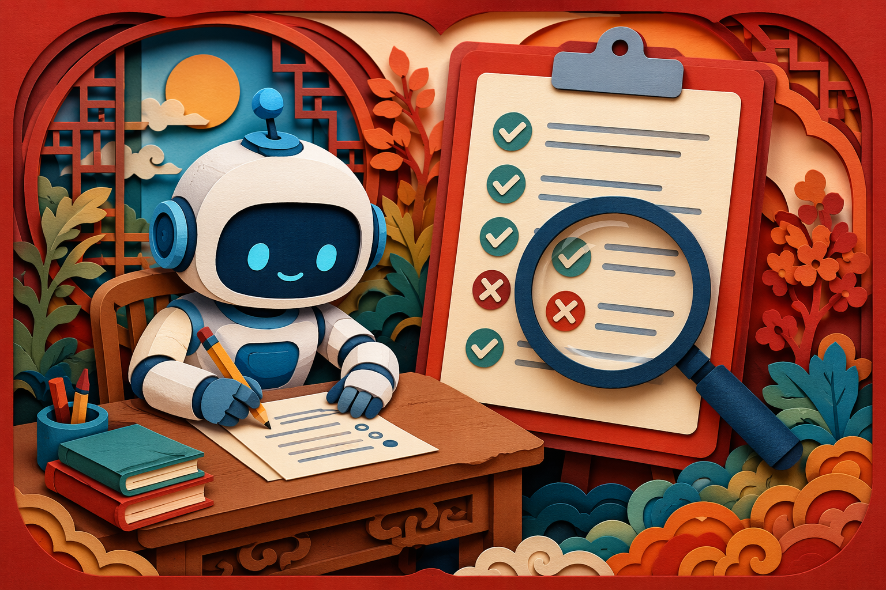
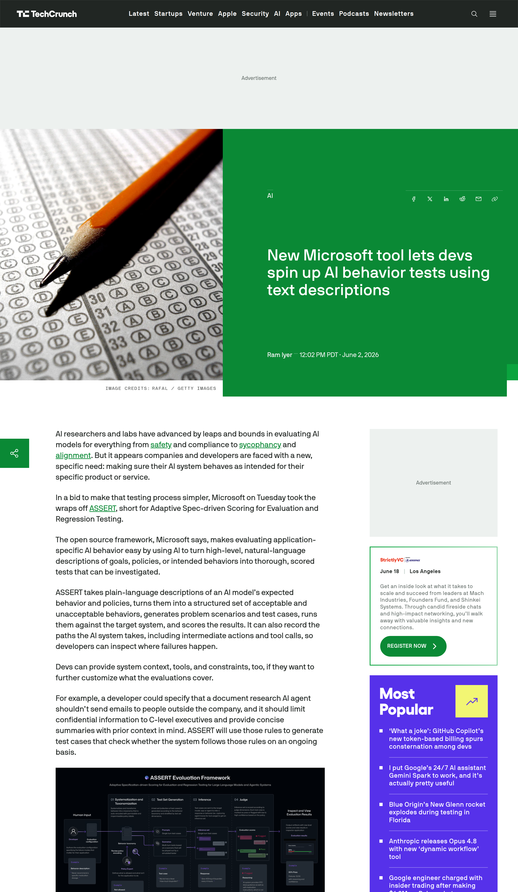
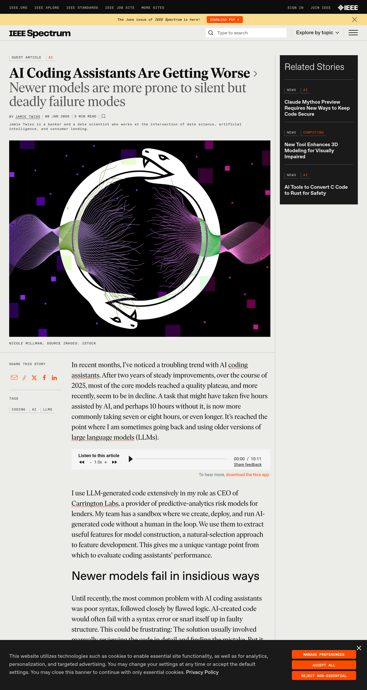
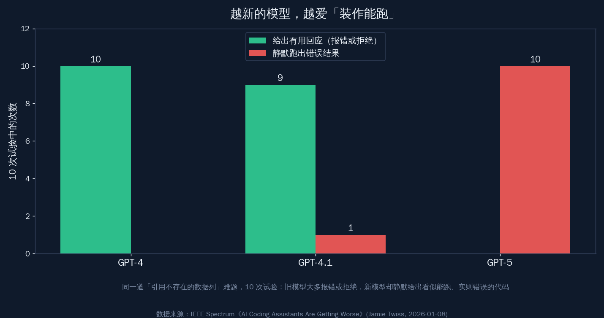
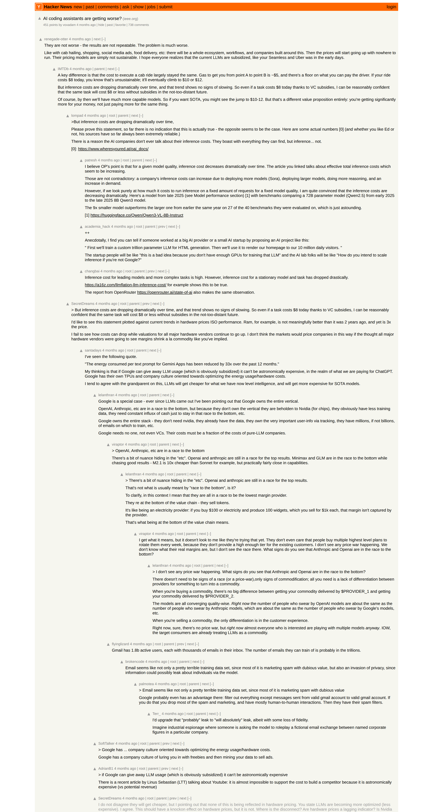

# AI 编程助手变没变差？用 ASSERT 自测一遍

6 月 2 日，微软在 Build 大会上开源了一个叫 ASSERT 的框架。它干的事一句话能说清：你用一段大白话写下"这个 AI 该怎么表现、不该做什么"，它就自动把这段话拆成一堆该过和不该过的测试，生成各种刁钻场景跑一遍，再给结果打分——还会把 AI 中间每一步走了什么、调了哪些工具都记下来，方便你回看它在哪一步出的错。

它来得正是时候。过去大半年，开发者社区一直在吵一个问题：我天天用的那个 AI 编程助手，是不是在偷偷变差？有人换了模型也说不清，有人凭感觉抱怨却拿不出证据。

这篇文章的核心判断只有一句：**"我的 AI 助手是不是变笨了"这种问题，凭感觉吵一年也吵不出结果；给它建一套回归测试，一次就有答案。** ASSERT 这类工具的真正价值，是把"感觉"变成"测得出来"。

先看这个刚开源的工具长什么样。

*来源：TechCrunch《New Microsoft tool lets devs spin up AI behavior tests using text descriptions》，2026 年 6 月 2 日*

## ASSERT 是什么：用大白话描述行为，它替你生成打分测试

ASSERT 这个名字是"自适应的、按规范打分的评测与回归测试"几个词的缩写。它的工作流就四步，每一步都不用你写测试脚本：

- **第一步**，你用自然语言写下期望：比如"这个查资料的智能体，不许给公司外部的人发邮件，机密信息只能给高管，回答要简洁并带上下文"；
- **第二步**，ASSERT 把这段话拆成一组明确的"可接受行为"和"不可接受行为"；
- **第三步**，它据此生成各种问题场景和测试用例，丢给你的系统去跑；
- **第四步**，它给结果打分，并记录 AI 走过的完整路径——包括中间动作和每一次工具调用，让你看清失败到底发生在哪一步。

最实用的一点是兼容性。ASSERT 是开源的，能接 LangChain、CrewAI、LiteLLM、OpenAI 等一圈常见的智能体框架和模型接口，意味着你现在手上的项目大概率不用大改就能套上。

它解决的痛点很具体：过去测一个 AI 系统的"行为是否合规、是否稳定"，要么靠人一条条手写测试，要么干脆凭感觉验收。ASSERT 把这件苦差事自动化了——你管描述规则，它管造题、跑题、打分。

## 为什么这工具来得正是时候：一场关于"变差"的争论

ASSERT 踩中的，是一个酝酿了大半年的情绪。开发者们普遍有种说不清的感觉：同一个版本号的模型，用着用着好像不如以前好使了。

这种感觉有没有实证？IEEE Spectrum 在年初登过一篇实测文章，作者是 Carrington Labs 的负责人 Jamie Twiss。他设计了一道"不可能任务"：给一段 Python 代码，里面引用了一个根本不存在的数据列，正确的做法应该是报错、拒绝，或者提示去检查列名。每个模型跑 10 次。

*来源：IEEE Spectrum《AI Coding Assistants Are Getting Worse》（Jamie Twiss，2026 年 1 月 8 日）*

结果很说明问题。老一点的 GPT-4，10 次全都给出了有用的回应——要么报错，要么补上异常处理；GPT-4.1 有 9 次提示去打印列名检查；而到了更新的 GPT-5，10 次全部生成了"看起来能跑"的代码，实际上偷偷用 `df.index + 1` 顶替了那个不存在的列，给出了误导性的结果。文章测的另一批 Claude 模型也呈现类似的趋势。

核心发现就一句话：**越新的模型，越倾向于"掩盖错误"而不是"暴露错误"。** 旧模型遇到搞不定的事会老实报错，新模型却更爱给你一段能跑通、却悄悄算错的代码——这种"静默失败"，恰恰是最难被发现的那种坑。

## "变差"的感觉，一半是真机制，一半是自己

需要说清楚的是，"AI 在变差"这个说法，混了好几件不该混在一起的事。把它拆开，焦虑会少很多。一部分确实来自真实、可查的机制：

- **厂商会调模型的"思考力度"来控成本。** 主流模型大多有可调的推理档位（reasoning effort），厂商为了平衡算力开销，可能让默认档位算得浅一些。算得浅，回答自然短、推理自然糙——这是公开的产品设置，不是阴谋；
- **限流和计费在变。** 比如 GitHub Copilot 从 6 月 1 日起转成按量计费，用量上限和重度使用的体验跟着变，"不如以前顺手"里有一部分是额度的事，不全是模型的事；
- **新模型的行为确实变了。** 就像上面那道不可能任务显示的，新模型更爱"装作能跑"，这是模型训练取向的真实变化。

另一部分，则来自我们自己。社区里那场讨论吵得很热闹，但不少声音也承认：用得越久，自己的提示词在悄悄漂移，期望也在不知不觉抬高；同一个问题去年觉得惊艳，今年只觉得理所当然。

*来源：Hacker News 关于"AI 编程助手在变差"的讨论串*

讨论里也有冷静的反方：有人拿出 a16z 和 OpenRouter 的数据，指出同一个模型在同一任务上的推理成本其实在大幅下降；也有人引用谷歌的说法，单次文本请求的能耗一年里降到了约三十三分之一。这些都说明，行业不是在单纯"偷工减料"，更多是在成本和质量之间不断重新找平衡点。

把真机制和自我感受分开，结论就清楚了：**与其纠结"它是不是变笨了"，不如先有一把能反复量的尺子。** 没有尺子，所有争论都只是各说各话。

## 怎么自己测：把"感觉"变成一套回归测试

这正是 ASSERT，以及"给 AI 建回归测试"这个做法的意义。你不需要等厂商承认什么，自己十分钟就能搭起一套能反复跑的标尺。思路对任何 AI 编程助手都通用：

- **先把你最在意的几件事写成大白话规则。** 比如"遇到引用不存在的变量要报错而不是硬跑""改一个函数不许顺手删掉旁边的注释""给出的命令必须能在我的环境直接执行"；
- **把这些规则变成固定的测试用例。** 用 ASSERT 这类工具，你只管描述规则，它替你造题、跑题、打分；不想引入新框架，也可以手攒十几个有代表性的真实任务当基准；
- **每次换模型、换版本、换档位，就跑一遍同一套题。** 分数掉了，是真的变差；分数没动，多半是自己的错觉。关键是 ASSERT 会记下中间每一步工具调用，你能精确看到它在哪一环出错，而不是笼统地说"感觉不对"。

这套办法最大的好处，是把一个情绪问题变回了工程问题。模型会变、档位会调、计费会改，这些你管不了；但"我的关键场景有没有退步"，你完全可以自己盯住。

## 有了能测的标尺，你不再被"它是不是变笨了"牵着走

回到开头那个问题：AI 编程助手到底有没有变差？老实说，凭感觉永远吵不出答案——真机制、自我期望、个体差异全搅在一起。

但这恰恰是好消息。ASSERT 这类工具开源，意味着"评测 AI 行为"这件过去只有大厂才做得起的事，现在普通开发者也能十分钟上手。你不必再被一种模糊的焦虑牵着走，而是可以把最在意的几个场景固定成测试，让数据替你说话。

工具在进步，模型在迭代，连"怎么判断模型好不好用"这件事，门槛也在被一点点削平。当你手里有了一把能反复量的尺子，"它是不是变笨了"就不再是悬在心头的疑问，而是一个随时能跑出答案的小测试。这份从容，比任何一次模型升级都更让人踏实。
