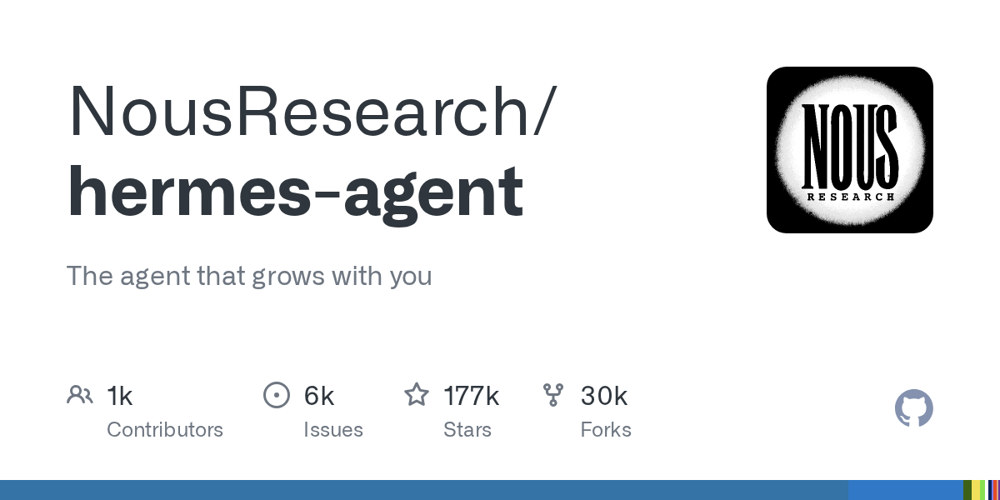
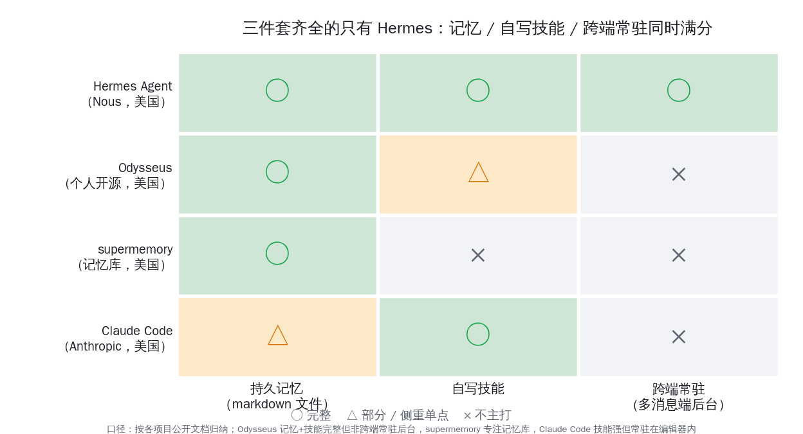
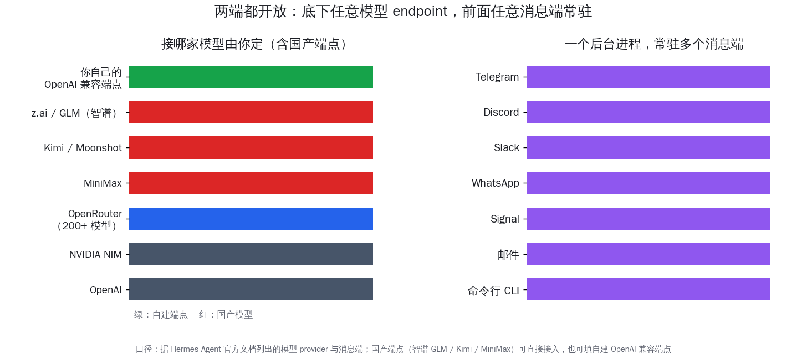
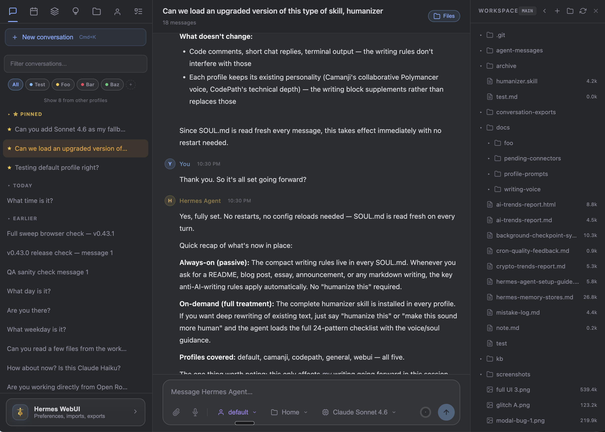
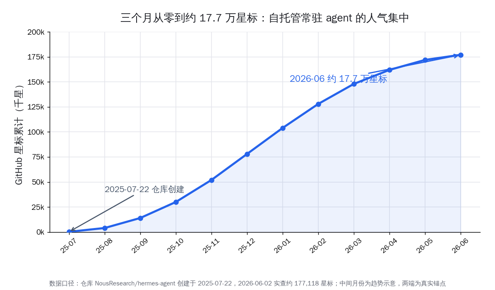
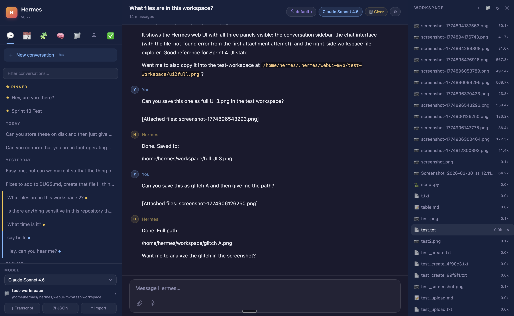

# Hermes 自托管常驻 agent：关掉电脑它还在后台干活

昨天我们还在聊 Odysseus 这台本地优先的 AI 工作台、聊 supermemory 这个记忆库。今天要说的 Hermes Agent，乍看又是「自托管 AI agent」，但它其实是另一种物种——一个不待在编辑器里、也不只管记忆，而是常驻在你服务器后台、随时能从 Telegram 喊起来干活的智能体。这篇不打算再写一遍「又一个自托管 agent」。

真正值得讲的是一个问题：为什么是 Hermes 这一个，几乎把整个自托管常驻 agent 的人气都聚到了自己身上。Nous Research 这个仓库 2025-07-22 才创建，到 2026-06-02 约 177,118 星标，三个月不到冲进 GitHub 最热的那一小撮项目。答案藏在它的三件套里——用 markdown 文件做持久记忆、让 agent 自己写技能、在多个消息端常驻后台。

<small>来源：GitHub 仓库展示卡</small>

## 它和昨天那几个，根本不是一类东西

先把容易混的几个产品分清楚，否则「自托管 AI」这四个字会把完全不同的东西糊成一团。

- **Claude Code（Anthropic，美国）**：能力很强，但它常驻在你的编辑器和终端会话里，你关掉窗口它就不在了，主要陪你写代码。
- **supermemory（美国）**：一个专门的记忆库，给别的应用补长期记忆这一块，本身不是一个会自己干活的 agent。
- **Odysseus（个人开源，美国）**：昨天聊过的本地优先工作台，把聊天、智能体、记忆、邮件日历塞进一台机器，重心是「在本机得到接近桌面端 AI 的完整体验」。
- **Hermes Agent（Nous Research，美国）**：一个常驻在服务器后台的自主智能体，你人在手机上、它在云端的一台小机器上待命，从 Telegram、Discord、Slack 任意一端给它发消息，它就接着上次的记忆继续办事。

一句话区分：Odysseus 是「打开来用的一台本地 AI 工作台」，Hermes 是「挂在后台随时待命、跨设备喊得动的常驻助手」。前者你坐在它面前，后者它在远端等你。这个差别，决定了它们各自最在意什么。

这条分界线很重要，因为「自托管 AI」这个标签下，其实站着三种心态完全不同的产品：

- **以「完整体验」为重的**，像 Odysseus，追求把聊天、记忆、邮件、日历都收进一台机器，你需要打开它、坐在它面前用。
- **以「补一块能力」为重的**，像 supermemory，只把记忆这一件事做到极致，给别的应用当地基。
- **以「常驻陪伴」为重的**，就是 Hermes，它要的不是功能多全，而是「人不在也在、换设备也接得上」。

理解了这三种心态，就明白为什么不能拿同一把尺子量它们。Hermes 在意的从来不是「界面里塞了多少模块」，而是「我离开电脑之后，那个 AI 还在不在、还记不记得我」。它的全部设计，都是围着这一个问题转的。

<small>来源：项目仓库 assets/banner.png</small>

## 第一件套：记忆不进数据库，就是几个 markdown 文件

Hermes 的持久记忆，做法朴素到让人意外——它不塞向量数据库，而是把记忆写成 markdown 文件。

仓库里最核心的两个文件是 `MEMORY.md` 和 `USER.md`：前者是 agent 给自己攒的工作记忆，后者是它对你这个人的画像。agent 在干完一段活之后，会被定期提醒去整理这些文件，把该记的事、该记的偏好写进去。跨会话回忆这一层，它用 FTS5 全文检索配合大模型做摘要，把过去的对话翻出来续上。

举个具体点的画面：你某天告诉它「以后给我写代码默认用中文注释、缩进用两个空格」，这条偏好会被它写进 `USER.md`；过几周你换了台机器重新部署，把这个文件拷过去，它依旧记得这个习惯，不用你再交代一遍。`MEMORY.md` 则更像它的工作笔记，记着「这个项目的测试怎么跑、上次卡在哪」。这两份文件加上可检索的历史会话，构成了它「记得住」的全部底子——而这底子，是你随时能翻开来看的纯文本。

这个设计的好处，对国内开发者特别实在：

- **记忆是你能直接读、直接改的纯文本**：想知道它记了你什么，打开 `USER.md` 看一眼就行，不用去查一个不透明的向量库。
- **可迁移、可备份、可版本管理**：几个 markdown 文件而已，丢进 git 就能版本管理，换台机器拷过去记忆原样还在。
- **数据完全在你手里**：记忆既不出本机、也不进任何第三方账号，这正是「数据主权」最朴素的形态。

和它对照一下昨天聊的 supermemory 就更清楚了。supermemory 走的是「专业记忆库」路线，把记忆做成一套可以挂给任意应用的服务，检索能力强、工程更重；Hermes 走的是另一头——记忆就是 agent 自己读写的几个文件，简单、透明、属于你。两条路没有优劣，只是取舍不同：要给一个大型应用补强检索，supermemory 更合适；要让一个常驻在身边的私人 agent「看得见、改得动」地记住你，Hermes 这种 markdown 记忆反而更顺手。

把记忆做成 markdown，看着土，其实抓住了个人 AI 最该让人安心的一点：你的 AI 记住了你什么，应该由你看得见、改得动。这一点，恰恰是一堆把记忆锁进云端向量库的产品给不了的。

<small>来源：依据各项目公开文档自制（截至 2026-06-02）</small>

## 第二件套：干完一件复杂活，它会自己写一个技能

第二件套是「自写技能」（self-written skills），这是 Hermes 比多数同类更进一步的地方。

按官方文档，agent 在完成一件复杂任务之后，会自动把这套做法沉成一个可复用的技能存下来，下次遇到类似的活直接调，而且这些技能会在使用中自我改进。它兼容 agentskills.io 这个开放技能标准，技能可以分层组织。

这意味着什么？举个国内开发者熟悉的场景：

- 你第一次让它「拉某个仓库、跑测试、把失败用例整理成一份报告发我邮箱」，它一步步摸索着做完。
- 做完之后，它把这套流程存成一个技能。
- 下次你只说一句「老规矩，对那个仓库再来一遍」，它直接调用已存的技能，不用从头摸索。

这套「自写技能」对国内开发者还有一层额外价值：它和 Claude Code 这类工具的技能体系是相通的思路，又因为兼容 agentskills.io 开放标准，调教好的技能不至于被锁死在一个产品里。你在 Hermes 上沉下来的做事方法，理论上能在遵循同一标准的别处复用——这让「攒技能」这件事更值得投入，而不是给某一家产品做免费的训练。

技能加记忆是配套的：记忆让它记住「你是谁、你偏好什么」，技能让它记住「这类活该怎么做」。两者都是纯文本资产，能导出、能迁移。把这两样攒在自己机器上，时间越久，这个 agent 就越贴合你的工作方式——而这份「越用越懂你」的积累，是你自己的，不绑在任何一家云厂商身上。

## 第三件套：一个后台进程，常驻在你所有消息端

第三件套，也是它和 Odysseus、Claude Code 拉开身位的关键——跨端常驻。

Hermes 跑的是一个常驻后台进程，通过一个统一的消息网关，同时挂在多个聊天端上：Telegram、Discord、Slack、WhatsApp、Signal，外加邮件和命令行，社区还做了微信桥接。也就是说，你不需要打开任何专门的 App，平时用什么聊天工具，就在那里直接 @ 它派活。

| 维度 | Claude Code | Odysseus | Hermes Agent |
|---|---|---|---|
| 厂商 / 来源 | Anthropic（美国） | 个人开源（美国） | Nous Research（美国） |
| 形态 | 编辑器 / 终端内会话 | 本地优先工作台 | 服务器后台常驻进程 |
| 你在哪用它 | 坐在电脑前写代码 | 打开本机工作台 | 任意消息端随时喊 |
| 是否常驻待命 | 关窗口即停 | 开着才在 | 后台长期待命 |
| 跨设备接力 | 弱 | 弱 | 强（手机/桌面同一记忆） |

落到使用感受上：你在地铁里用手机给 Telegram 里的它发一句「把昨天那个分析继续跑完」，它在云端那台小机器上接着干，干完把结果推回来。等你回到电脑前，记忆、进度、技能全都在。这种「人走开、活不停」的体验，是编辑器内的 Claude Code 和需要你坐在面前的本地工作台都给不了的。

它能这么干，背后还有两个工程设计在撑：一是它支持多种后台运行环境——本机、Docker、SSH、乃至闲时几乎不花钱的无服务器环境，机器闲下来时进入休眠，有消息进来再唤醒；二是它能临时拆出独立的子智能体并行处理多条任务，复杂的活不至于一条线排队。对一个要「长期挂在后台、随时被叫起来」的 agent，这两点不是锦上添花，而是它能不能真用起来的关键。

也正是这第三件套，把它和相邻产品的距离拉到最开。记忆和技能，别的产品多少都在做；但「一个后台进程、常驻多个消息端、跨设备接力」这件事，目前很少有开源项目做得这么完整。这也是它最打动人的地方——它把 AI 从「你打开它才存在」变成了「它一直都在，等你来」。

<small>来源：依据 Hermes Agent 官方文档自制</small>

## 登顶 OpenRouter 这件事，得老实说清楚

Hermes 火，还有一个常被提起的数字：它在 OpenRouter 上的 token 用量登顶。这个说法的来龙去脉，值得照实讲清楚，不夸大。

- **2710 亿 token 是发布时口径**：2026-05-06 Nous Research 官方宣布，Hermes Agent 以累计约 2710 亿 token 登上 OpenRouter 全站应用 token 用量第一。这个「全站第一 / 2710 亿」是 Nous 官方与社区当时的口径，请按官方说法看待。
- **当下 OpenRouter 页面的口径**：2026-06-02 OpenRouter 的 Hermes Agent 应用页显示的是分类榜第一——「Productivity 第一」「Coding Agents 第一」，累计已处理约 12.6 万亿 token。
- **怎么理解这两个数**：发布时的「全站第一」是 Nous 官方在某个时点的统计口径；如今页面给的是分类第一加更大的累计量，两个数据来自不同时点、不同口径，不必强行对齐。

更稳妥的说法是：Hermes 在 OpenRouter 上的实际调用量长期排在前列，发布时官方宣布过一次全站登顶，眼下页面稳居生产力与编程 agent 两个分类的第一。无论用哪个口径，结论一致——这是当前被真实用起来、跑了大量推理的开源常驻 agent 之一。把这事讲准，比把数字喊大更有说服力。

这个排名为什么值得一提？因为它反映的不是「多少人点了星标」，而是「多少人真的把它挂起来、天天用它消耗 token」。星标是一时的关注，token 用量是持续的使用——一个能在聚合平台的调用量榜上长期靠前的开源 agent，说明它不是看个热闹收藏了事，而是真有一批人把它当日常工具在跑。对想判断「这东西到底实不实用」的国内开发者，后一个信号比前一个可信得多。

当然也要拎清楚：OpenRouter 是个模型聚合平台，token 用量统计的是经由它转发的调用，并不等于「全世界所有人用 Hermes 的总量」——很多人接的是自己的端点、国产模型或本地模型，这部分根本不经过 OpenRouter。所以这个第一，准确说是「在 OpenRouter 这个平台上、被它的用户调用得最多」，范围要框清楚，不宜外推成「全球最受欢迎」。讲到这个份上，读者心里就有数了。

## 配套 WebUI 当天上了 Trending，手机也能顺手用

光有命令行还不够顺手，社区给它配了网页端。`hermes-webui` 这个社区项目，2026-06-02 约 12,431 星标，按近期节奏每天还在涨上千颗，当天就出现在 GitHub Trending 榜上。

它是一个轻量的自托管网页界面，和命令行体验基本对齐，技术上很克制：

- **后端用 Python 标准库的 HTTP 服务，前端是原生 JavaScript**，不需要打包、不需要构建步骤，自托管门槛低。
- **三栏布局**：左边会话列表、中间聊天、右边工作区文件浏览，回应通过 SSE 流式输出。
- **手机友好**：小屏下侧栏收成抽屉式滑出，聊天和输入框占满整屏，触控目标不小于 44 像素，还支持语音输入。
- **多模型并存**：界面里能配 OpenAI、Anthropic、Google、DeepSeek 等多家，和命令行共享同一份持久记忆与技能。

值得留意的是它的技术取向：不用任何前端框架、不需要构建步骤，纯标准库加原生 JavaScript。这在自托管场景里是个很务实的选择——意味着部署它几乎不需要折腾依赖，一台小机器上拉起来就能用，出问题也好排查。对一个面向「自己挂在服务器上用」的工具，这种克制比堆砌花哨功能更对路。

对不爱敲命令行的人，这等于给常驻在后台的 Hermes 配了一个随时能从浏览器或手机打开的面板。它和命令行共享同一份记忆和技能，所以你在手机网页里和它聊的内容、它记住的偏好，回到命令行也都接得上。一个常驻 agent 加一个轻网页端，自托管个人 AI 的体验一下子完整了不少。这也解释了为什么配套的 WebUI 项目能在当天就冲上 Trending——主项目带起了一整个配套需求。

<small>来源：hermes-webui 仓库截图</small>

## 三个月冲到约 17.7 万星标，热度为什么集中在它

把时间线拉出来看，这条增长曲线本身就是个信号。

仓库 2025-07-22 创建，到 2026-06-02 约 177,118 星标，三个月不到，进入 GitHub 最热的那一档。同期它还聚起了将近上千名贡献者——对一个两个多月的项目，这个参与规模并不常见。

<small>来源：仓库 NousResearch/hermes-agent，2026-06-02 约 177,118 星标</small>

热度集中在它身上，不是偶然，而是因为它把这一类产品最该有的几件事一次凑齐了：

1. **记忆做成了人能读能改的 markdown**，比锁进向量库更让人放心。
2. **技能能自己写、还能复用**，越用越顺手，沉下来的是你自己的资产。
3. **跨端常驻**填上了「人离开电脑、活还在跑」这个真实缺口。
4. **底下接什么模型完全开放**，不绑定单一厂商，谁的接口都能接。

别人可能占了其中一两条，Hermes 把四条凑齐了，又赶上自托管个人 AI 这一波的关注，热度自然往它这儿聚。它不是横空出世的新概念，而是把一个已经成形的需求，第一次做得足够完整。

还有一个容易被忽略的因素：背后是 Nous Research。这家以开源模型和数据集在社区里积累了口碑的团队来做这件事，本身就给项目带了一层信任——大家相信它不会做着做着就闭源、不会某天把记忆偷偷挪上云端。开源个人 AI 这条路，工具好用是一方面，做工具的人值不值得托付，是另一方面。Hermes 这两样都占了，这也是它能在短时间里聚起近千名贡献者的底气所在。

## 国内开发者怎么把它跑起来：5 美元 VPS 接 DeepSeek、智谱 GLM

对国内开发者，最实在的问题是两个：跑得起吗？能接国产模型吗？答案都是能，而且路子很直。

**跑得起——一台 5 美元的 VPS 就够。** 官方明确写了，它能跑在一台 5 美元的 VPS、一个 GPU 集群，或者闲时几乎不花钱的无服务器环境上。Hermes 本身是个轻量的常驻进程，真正吃算力的是模型，而模型这层是你自己挑、放在哪都行——所以一台便宜的小机器挂着它待命，完全够用。

**接国产模型——它本来就不绑定任何一家。** 官方文档列出的模型来源里，直接就有 z.ai/GLM（智谱）、Kimi/Moonshot、MiniMax 这些国产端点，还可以填「你自己的端点」。也就是说：

- 想用 **DeepSeek（深度求索）、千问（Qwen）**：用它们的标准兼容接口，在 Hermes 里填成「自定义端点」即可，几乎都是开箱即用。
- 想用 **智谱 GLM、Kimi、MiniMax**：官方文档里本就列了对应来源，下拉直接选，不用自己拼接口。
- 想多模型并用：日常闲聊用一个便宜的国产模型省钱，复杂任务临时切到更强的那一个，记忆和技能在底层照样共享，不用重新喂背景。

落到具体步骤，国内开发者一条最省心的路径是这样：

1. 租一台便宜 VPS（一个月几美元那档），装好运行环境，把 Hermes 这个常驻进程挂起来。
2. 底层模型填一个国产端点——DeepSeek 或智谱 GLM 的接口都行，按文档把地址和密钥填进配置。
3. 前面接到自己常用的消息端，Telegram 直接支持，微信走社区桥接。
4. 让 `MEMORY.md`、`USER.md` 和技能文件落在一个你自己的目录里，丢进 git 做版本管理。

这样跑起来之后，数据全程在自己手里，模型用的是国产接口，人在手机上就能随时派活、随时取结果。对一个既想要数据主权、又不想被某一家云端模型绑死的国内开发者，这套组合的吸引力是实打实的——它没有让你在「方便」和「自主」之间二选一。

**有几个小提醒，能少踩坑：**

- VPS 只是挂着这个轻进程，真正的推理跑在你接的模型那一端，所以小机器配置低没关系，关键是网络通到模型接口。
- 常驻进程暴露在公网时，记得给 WebUI 配上密码或通行密钥，别让它裸奔——官方对这点有明确提醒。
- 记忆既然是纯文本，建议定期把那几个 markdown 文件备份进 git，换机或重装时直接拷回来，agent 对你的了解一点不丢。

<small>来源：hermes-webui 仓库 docs/images</small>

## 它真正的意义：把「常驻、记得住、谁的模型都能接」做成了开源样板

回到开头那个问题——为什么是 Hermes 一个聚拢了这条赛道几乎全部的人气。

不是因为它发明了什么新东西。持久记忆、自写技能、多端常驻，单看每一样都不算独创。它做对的，是第一次把这三件套同时做完整，再叠上「底下任意模型 endpoint、前面任意消息端常驻」的开放面，让一个普通开发者用一台 5 美元的小机器就能拥有一个常驻、记得住事、还能接国产模型的私人 agent。

对国内做个人 AI 的人，它有两重价值：一是能直接拿来用——租台便宜 VPS、接上 DeepSeek 或智谱 GLM，就能跑起一个数据全在自己手里的常驻助手；二是一份做得相当完整的参考实现，值得拆开来学，尤其是它怎么用几个 markdown 文件就把「持久记忆」这件事讲清楚，又怎么把自写技能和跨端常驻这两块缝在一个不算庞大的代码里。

自托管个人 AI 的门槛，正在以肉眼可见的速度往下走。三个月前还需要拼凑一堆工具才能搭出来的东西，现在一个开源仓库加一台小机器就能起步。你不必交出数据，也不必绑定某一家模型，就能拥有一个属于自己、记得住你、随叫随到的 AI。这条路前辈已经趟出来了，我们这一代赶上的，正是它越来越好走的时候。
