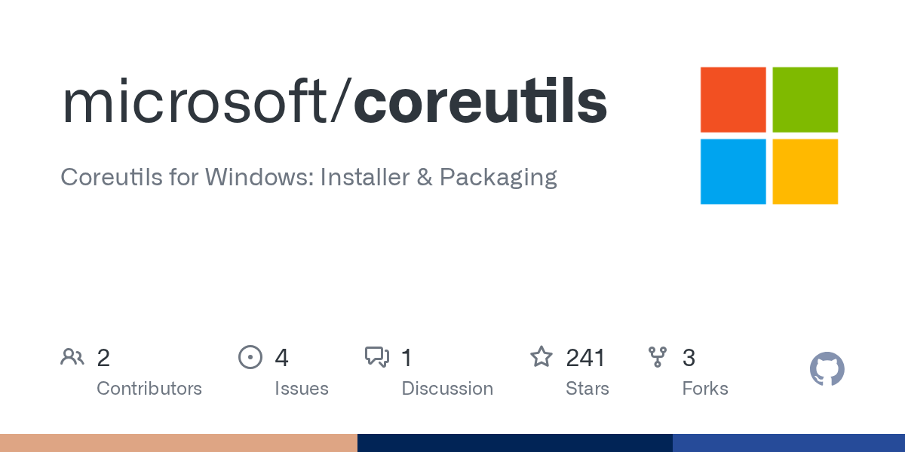
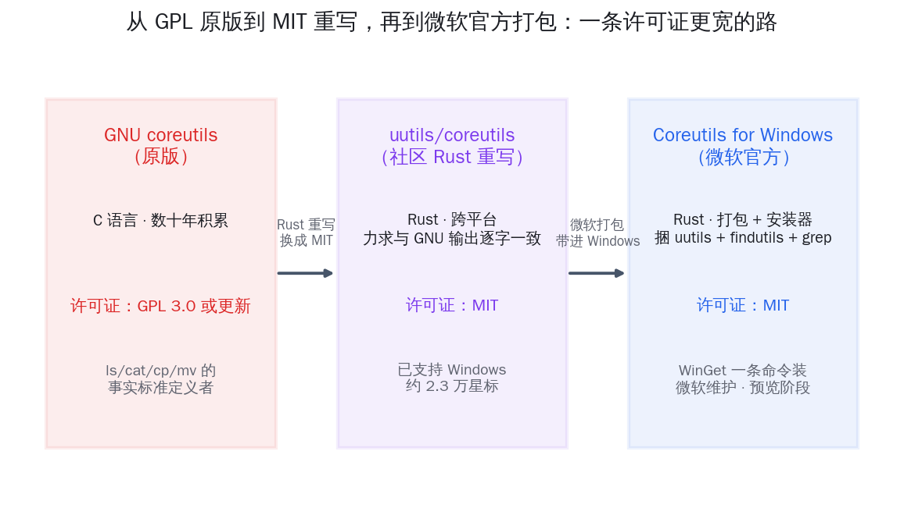
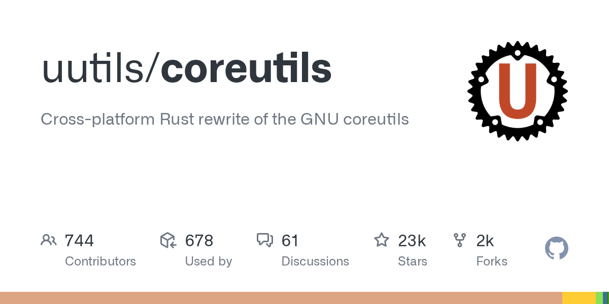
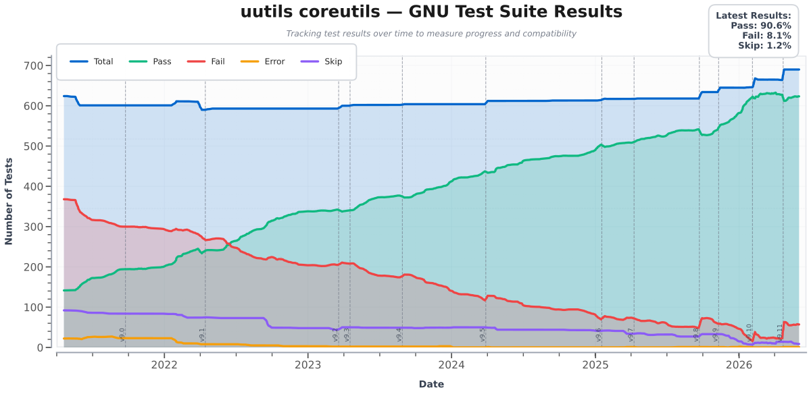
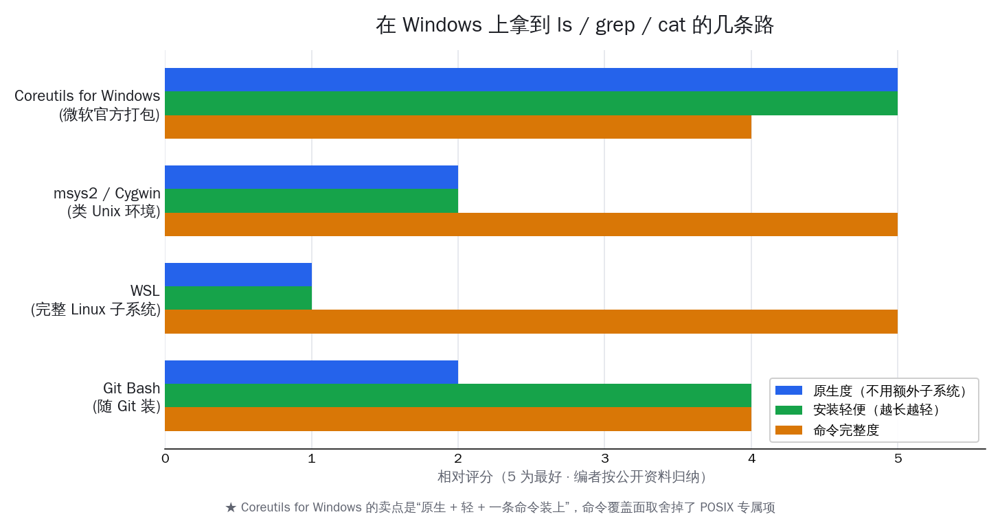
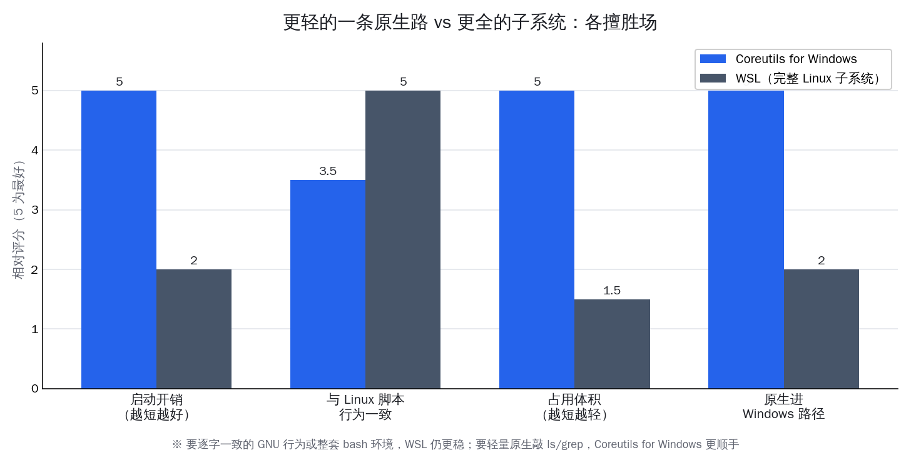

# 微软把 ls/grep 原生搬进 Windows，WSL 外一条轻路


长期在 Windows 上写代码的人，多半都干过同一件事：为了用上 `ls`、`grep`、`cat` 这几个最顺手的命令，先装一个 Git Bash，或者开一个 WSL，再或者搬来 msys2、Cygwin 那套类 Unix 环境。命令本身不复杂，麻烦的是为了几个命令，要么多挂一个 Linux 子系统，要么多装一整套环境。**真正的痛点不是 Windows 没有这些命令，而是想原生、轻量地用上它们，过去一直缺一条官方的现成路。**

6 月初，微软把这条路补上了。它在 GitHub 上线了一个新仓库 microsoft/coreutils，定位写得很克制——`Coreutils for Windows: Installer & Packaging`。**注意这几个词：安装器、打包。它不是微软又从头写了一套命令行工具，而是把社区已经做好的 Rust 版命令行工具打包成一个 Windows 原生程序，用一条命令就能装上，由微软自己维护。**


<small>来源：microsoft/coreutils 仓库社交卡片</small>

先把几个核对过的数字摆清楚。6 月 2 日核对仓库：约 290 颗 star、4 个 fork、MIT 许可、Rust 写成，5 月 15 日建库，当天还在持续提交；已发出的版本标记是 `v2026.5.29`，README 明确写着「本项目处于预览阶段」。对应的那条 Hacker News 讨论帖约 165 分、约 150 条评论，是当天的热门话题之一。

这篇文章想讲清楚六件事：**微软这个仓库到底做了什么、它依赖的 uutils 是怎么用 Rust 重写 GNU 的、它和 GNU 原版、WSL 各自的取舍在哪、许可证为什么从 GPL 变成 MIT、它对在 Windows 上跑 Claude Code 这类编程 agent 意味着什么、以及它现在还有哪些已知的粗糙之处。** 一句话先放这儿——对在 Windows 上跑 AI 工具链和后端的国内开发者，这是 WSL 之外一条更轻的原生路径，值得装来试试；但它现在是预览阶段，命令覆盖面和 shell 冲突还有不少要磨的地方，本文会一一摊开。

## 微软这个仓库做的是打包分发，不是重写

第一件要说清楚的，也是最容易被标题带偏的一点：**microsoft/coreutils 不是一个 fork，也不是微软重写的实现，它是一个安装与打包项目。**



读 README 第一段就很明白。它写的是：这是「一个由微软维护的构建版本」，把三样东西打包成一个 Windows 用的多调用单一程序——社区的 uutils/coreutils、uutils/findutils，外加一个兼容 GNU 的 `grep`。目标也写得直接：让你在 Linux、macOS、WSL、容器和 Windows 之间来回切换时不再别扭，同样的命令、同样的参数、同样的管道，行为保持一致，已有脚本搬过去不用改写。

落到实际操作，它就是一条命令的事：

```powershell
winget install Microsoft.Coreutils
```

装完之后，`ls`、`cat`、`cp`、`mv`、`rm`、`grep` 这些命令就原生进了 Windows 的 PATH，不必再起一个 Linux 子系统、也不必先开 Git Bash。**它的价值不在「写了什么新代码」，而在「微软出面，把社区已经做好的东西做成了官方可信、一条命令可装、长期有人维护的分发」。**

Hacker News 上一条很尖锐的追问，恰好点破了这个分工。有人问：既然 uutils 本身就已经支持 Windows，为什么微软还要单独开这个仓库？讨论里的答案是一致的——微软这个仓库的价值在「Windows 专属的适配与打包」：它把 uutils、findutils、grep 三摊东西收拢成一个安装包，处理好 Windows 上的命令命名冲突，补上若干 Windows 特有的修正，再挂上官方维护的招牌。换句话说，**重写这件事社区早就做完了，微软补的是「让普通 Windows 用户一条命令就能用上」这最后一段路。**

这件事让不少老用户由衷高兴。一位评论者写道：cygwin、msys2、Git Bash 这些移植版一直都在、也都很好用，他的 PATH 里总会留一个，但「由微软来维护这套（前提是他们持续做下去）是个大好消息」。微软亲自下场维护，意味着它更可能跟 Windows 系统、PowerShell、WinGet 形成长期配合，而不是一个随时可能停更的第三方移植。

这个分工还有个常被忽略的好处：**它把「谁负责什么」理清楚了。** 命令的实现、跨平台的正确性、跟 GNU 行为对齐的工作，留在上游的 uutils 社区；Windows 上的命名冲突处理、安装包、跟系统的配合，归微软这个仓库。README 里的贡献指南也专门讲了「改动如何在本仓库和上游 uutils 之间流转」。这种上下游分明的安排，比一个第三方自己 fork 一份、再各修各的，要可持续得多——上游修好的能力，下游打包就能直接吃到。

## uutils 是用 Rust 重写 GNU，目标是逐字一致

要理解微软打包的是什么，得先认识被打包的主角——uutils/coreutils。

它是一个跨平台的 GNU coreutils 的 Rust 重写项目，2013 年建库，到 6 月 2 日核对约 2.3 万颗 star、近 1900 个 fork，MIT 许可。它给自己定的目标很硬核：**做 GNU 工具的「drop-in 替代」，也就是不光命令名一样，连标准输出和错误码都要跟 GNU 原版逐字对得上。** 谁用谁的命令，行为应当看不出差别。


<small>来源：uutils/coreutils 仓库社交卡片</small>

为什么是 Rust？两点很现实。一是内存安全——这些命令是几乎每个脚本、每条管道都要碰的底层零件，用 Rust 写能从语言层面挡掉一大批内存漏洞。二是跨平台——同一份 Rust 代码能编到 Linux、macOS、Windows，甚至 WASM，不像 C 版那样要为不同平台缝缝补补。这正是它能被微软直接拿来打包进 Windows 的前提。

内存安全这一点，放在微软身上格外有分量。这几年微软在系统底层一直明确往 Rust 推——从内核组件到工具链，逐步用内存安全的语言替换历史 C/C++ 代码，是它公开表态的方向。命令行工具虽小，却是攻击面不小的一类：它们要处理各种来路的输入、解析参数、读写文件。选一套用 Rust 重写、又有公开兼容性成绩单的实现来打包进 Windows，和微软整体的安全取向是一致的。这也是为什么它没有自己用 C 再写一遍，而是直接选了 uutils。

它「重写得像不像」不是嘴上说说，而是有一条公开的成绩单。uutils 维护着一个 GNU 测试套件的通过率追踪，把自己跑过多少条 GNU 官方测试随时间画成曲线，谁都能去看进度。


<small>来源：uutils/coreutils-tracking GNU 测试通过率追踪图</small>

这张图是 uutils 敢说自己「力求逐字一致」的底气：它不是凭感觉宣称兼容，而是拿 GNU 自己的测试来量。**这也解释了微软为什么愿意直接拿它打包——一个有公开兼容性成绩单、又是内存安全语言写的项目，对要把它塞进 Windows、面向海量普通用户的微软来说，是个相当稳妥的底子。**

微软这个打包还不止收了 uutils 一个项目。README 写明它捆了三样：uutils/coreutils（那批最核心的命令）、uutils/findutils（`find` 这类查找工具的 Rust 重写），再加一个兼容 GNU 的 `grep`。把它们合成一个「多调用单一程序」，是 coreutils 工具集的经典做法——一个程序文件，按你调用它时用的命令名，表现成对应的那个命令。这样装一次就把 `ls`、`find`、`grep` 一并备齐，对每天既要列文件、又要查文件、还要搜内容的开发者，正好是一套最常用的组合。

## 许可证从 GPL 变 MIT，是这条路最实在的差别之一

谈到把 GNU 工具搬进商业操作系统，许可证是绕不开的一环，而这恰好是 uutils 这条路最实在的差别之一。

GNU coreutils 原版用的是 GPL 3.0 或更新版本，uutils 的 Rust 重写用的是 MIT，微软的打包仓库也是 MIT。这一栏的变化看着小，分量却不轻：

- **GPL 是传染性较强的许可证。** 把 GPL 代码深度绑进自家产品，往往要承担相应的开源义务，对操作系统厂商和企业内部分发是个需要谨慎评估的事。
- **MIT 是非常宽松的许可证。** 几乎可以随意打包、分发、内置进商业产品，约束极少。
- **微软选择打包 MIT 版的 uutils，而不是 GPL 的 GNU 原版，路就顺得多**——它能名正言顺地把这套工具直接放进 Windows 的分发渠道，不必背上 GPL 那一层考量。

把这三者的关系一句话串起来：**GNU 用 C 写、定义了 ls/cat/cp/mv 这套命令几十年的事实标准，许可证是 GPL；uutils 用 Rust 把它重写一遍、力求行为逐字一致，把许可证换成了更宽松的 MIT；微软再把 MIT 版的 uutils 打包带进 Windows。** 一条由 GPL 到 MIT、由社区到官方分发的链条，到这里就闭合了。许可证这一换，是这套工具能进 Windows 官方渠道的关键一环。

## 在 Windows 上拿到 ls/grep 的几条路，各擅胜场

对一个具体的开发者来说，更实在的问题是：我在 Windows 上想用 `ls`、`grep`，现在到底有几条路，该走哪条？把常见的几条摆在一起看，位置就清楚了。



| 路径 | 怎么拿到 | 原生度 | 体量 | 适合谁 |
|---|---|---|---|---|
| **Git Bash** | 随 Git for Windows 一起装 | 中（自带一套 mingw 环境） | 轻 | 已经在用 Git、只想顺手有几个命令 |
| **WSL** | 装一个完整 Linux 子系统 | 低（另起一个 Linux） | 重 | 要整套 bash 环境、要逐字 GNU 行为 |
| **msys2 / Cygwin** | 装一套类 Unix 环境 | 中 | 中 | 要相对完整的工具链、能接受额外环境 |
| **Coreutils for Windows** | `winget install` 一条命令 | 高（原生进 PATH） | 轻 | 想轻量、原生地敲 ls/grep，不想多挂子系统 |

几点值得展开：

- **Git Bash** 的好处是很多人本来就装了 Git，几乎零额外成本就有了一批命令；代价是它自带的是 mingw 那一套，行为和工具集跟原版 GNU 有出入。
- **WSL** 是最「完整」的一档——它就是一个真的 Linux，bash、包管理、逐字一致的 GNU 行为全都有；代价是它重，启动和占用都不轻，本质上是在 Windows 旁边又跑了一个操作系统。
- **msys2 / Cygwin** 介于两者之间，工具链相对完整，但仍需要你接受一整套独立环境。
- **Coreutils for Windows** 走的是最轻、最原生的一条——一条命令装上，命令直接进 Windows 的 PATH，不必起子系统、不必开 Bash。代价是它有意识地砍掉了一批命令（后面会讲），覆盖面不如 WSL 那么全。

**所以这不是「谁取代谁」，而是各擅胜场。** 要一整套 bash 环境、要逐字一致的 GNU 行为，WSL 仍然更稳；只是想在原生 Windows 终端里轻量地敲几个最常用的命令，Coreutils for Windows 这条新路更顺手。

把这几条路放进一天的真实使用里，差别会更具体。如果你只是在 PowerShell 里偶尔想 `ls -la` 看一眼、`grep` 翻一下日志，那么开一个 WSL 显然过重——光启动子系统、再把路径换算回来就够烦的；这时候一条命令装上的原生工具集明显更顺。反过来，如果你要跑的是一整套依赖 bash 语法、依赖完整 GNU 行为的复杂脚本，或者要用包管理装一堆 Linux 软件，那 WSL 提供的「一个真 Linux」是这套轻量工具给不了的。下面这张对照把开发者最在意的四个维度摆在一起，看得更直观。



这张图想说的就一句：**Coreutils for Windows 赢在启动开销、占用体积和原生度，WSL 赢在与 Linux 脚本逐字对齐的程度。** 选哪条，取决于你这次要的是「轻、原生、够用」还是「全、一致、是个真 Linux」。多数人其实两条都会留——平时敲命令走轻的这条，跑重活时再开 WSL。

## 对在 Windows 上跑 Claude Code 的人，这条路省的是开销

把镜头拉回到 AI 开发这件事上。**今天大量编程 agent——Claude Code、Cursor 里的 agent、各种 shell 驱动的 AI 工具——干活的方式，本质上是替你在终端里敲命令。** 它读文件、搜代码、跑脚本、串管道，靠的都是底层那套 Unix 命令行工具。这恰好是 Coreutils for Windows 能帮上忙的地方。

过去在 Windows 上跑这类工具，常见的别扭有这么几种：

- **agent 生成的是 Linux 风格命令。** 它习惯性地敲 `ls`、`grep`、`cat`、`find`，但原生 Windows 终端里这些要么没有、要么是行为不一样的同名命令，结果就是命令报错、agent 反复试错。
- **绕道 WSL 又多一层。** 为了让命令跑得通，很多人把 agent 的 shell 指到 WSL，于是路径要在 Windows 和 Linux 两套之间换算，文件读写跨一层子系统，反而多了不少摩擦。
- **跨平台脚本行为对不齐。** 同一份 CI 脚本、同一套自动化，在同事的 macOS、Linux 上跑得好好的，到 Windows 上因为命令行为不一致就翻车。

Coreutils for Windows 想抹平的正是这一层。**当 `ls`、`grep`、`cat`、`find` 这些命令原生、且行为对齐地待在 Windows 的 PATH 里，agent 敲出来的 Linux 风格命令就能直接跑通，不用再绕 WSL、不用再为路径换算操心。** README 把这个目标说得很清楚：让同样的命令、参数、管道在各平台行为一致，已有脚本搬过去不用翻译。对一个要在 Windows 上跑编程 agent 的开发者，这意味着 agent 的 shell 命令更稳、跨平台的脚本可复现性更好。

它的轻量也契合 agent 沙箱的需求。很多 agent 会在受限的子进程或沙箱里执行命令，一个原生、单一程序、不依赖整个 Linux 子系统的工具集，比起「先拉起一个 WSL」要轻得多，也更容易塞进受控的执行环境。**对国内开发者来说，落点很具体：如果你日常在 Windows 上跑 Claude Code、写后端、串 AI 工具链，这条路能让你少开一个子系统，就把 agent 要敲的命令喂顺。**

需要诚实说明的是，这是一个开发者工具的故事，不是一个 AI 模型的进展。它本身不会让 agent 更聪明；它做的是把 agent 赖以干活的那层命令行地基，在 Windows 上铺得更平。但对每天被「Windows 上命令跑不通」绊住的人，这层地基铺平，体感是实打实的。

## Windows 和 Linux 的几处天生差异，它没法替你抹平

把这套工具请进 Windows 之后，还有几处差异是操作系统层面的，命令本身抹不平，得心里有数。README 专门列了一份「Windows 注意事项」，对要在 Windows 上跑脚本和 agent 的人很实用：

- **换行符是 CRLF。** Windows 的文本文件常用 `\r\n` 结尾，多数命令能透明处理，但用 `$` 做行尾匹配、或按精确字节数算的场景会受影响。
- **没有 `/dev/null`，要用 `NUL`。** 比如把输出丢掉，Linux 写 `> /dev/null`，Windows 这边要写 `> NUL`。
- **没有 POSIX 信号。** `SIGHUP`、`SIGPIPE`、`SIGUSR` 这些都不在；`Ctrl+C`（也就是 `SIGINT`）照常能用。这也是 `kill`、`timeout` 这类命令暂时没收的原因。
- **路径分隔符两种都认。** `/` 和 `\` 都接受，但有些命令输出用的是 `\`，往下游管道传时可能要留意。
- **权限模型不一样。** Windows 用的是 ACL，不是 POSIX 的权限位，`find -perm` 这类按权限判断的用法行为会不同甚至用不了；创建符号链接还需要开发者模式或管理员终端。

这些差异说明一件事：**Coreutils for Windows 让你在 Windows 上用上同名命令，但它没把 Windows 变成 Linux。**

对写跨平台脚本的人，这反而是个好提醒——把 `/dev/null` 换成 `NUL`、注意 CRLF、别依赖 POSIX 信号，脚本在 Windows 上才真能跑顺。这些都是常识级的小坑，提前知道就能绕开。

## 现在还粗糙：shell 冲突和命令取舍，是讨论的焦点

把好处说够，也得把现在的粗糙之处摊开。Coreutils for Windows 还是预览阶段，Hacker News 上得票最高的几条评论，争的恰恰是它的两个未完成面。

第一个焦点是 **shell 冲突**。Windows 上 CMD 和 PowerShell 自带一批同名命令（比如 `echo`、`mkdir`、`sort`），装上这套工具后，到底跑的是哪一个，README 自己也写得很坦白：取决于你用的 shell、PATH 的先后顺序，以及 PowerShell 的别名表。一位高票评论直接点了这一段，说这「不太让人满意」——用户不该需要去猜哪个版本会生效，希望微软给一个「不用猜也能稳定工作」的方案。还有人补充，PowerShell 早先把一些 Linux 命令名映射到了参数不同的 Windows 命令上，这跟新的 GNU 兼容版会再撞一次。

第二个焦点是**有意砍掉的命令**。README 列了一份「故意不收」的清单，理由分三类：依赖 POSIX 专属概念的（如 `chmod`、`chown`、`id`、`kill`——Windows 没有 POSIX 信号和权限位）、会破坏现有 Windows 脚本的，以及在 Windows 上没什么用的（如 `shred`、`uname`）。`dd` 被标注为「也许将来会加」。有评论者据此批评：项目说要让跨平台脚本无缝搬运，但既没带 bash、命令覆盖又不全，像 `dd`、`chown` 这些在 Windows 上其实有真实用途的命令也没收，离「无缝」还有距离。

围绕「哪些命令收、哪些不收」，讨论里还有一类很较真的疑问：为什么 `dir` 因为和内置命令冲突就不收，`echo`、`rmdir` 同样冲突却照收，`sort` 又被判定不冲突？这套取舍标准从外面看确实不够一目了然。

README 给出的处理是一张冲突对照表，用三种状态标每个命令在 CMD 和 PowerShell 7.4+ 下的表现：正常可用、随包发出但与内置命令冲突、以及不收。换句话说，**它没回避冲突，而是把冲突逐个列了出来，让你心里有数。** 但「列出来」和「自动帮你选对」是两回事，后者才是用户真正想要的，这也正是高票评论盯着不放的点。值得一提的是，README 还要求 PowerShell 7.4 或更新版本，老版本不支持——这对一些还在用旧 PowerShell 的环境是个前置门槛。

把社区的态度归一句：**方向叫好，细节待磨。** 「终于来了」「微软原生维护是好消息」是主流情绪；同时大家也清楚，shell 冲突怎么消、命令覆盖到哪、要不要配一个 shell，是它从预览走向好用必须答的题。这些不是否定，而是一个预览阶段项目该有的待办。

还有一条颇有意思的留言，半开玩笑地说「最好的 Linux 发行版是 Windows」——它道出的，正是微软这些年一点点把 Unix 工具链请进 Windows 的方向：先有 WSL，再有原生的命令行工具集。这条路一直在往前走。

## 写在最后

把 microsoft/coreutils 放回它出现的位置看，分量就清楚了。它本身代码不多、还在预览，真正重要的是它代表的方向——**微软愿意出面，把社区用 Rust 重写、许可证更宽松的那套 Unix 命令行工具，做成 Windows 上一条命令可装、官方长期维护的原生路径。**

这条路的取舍也很清楚：它不追求像 WSL 那样搬来一整个 Linux，而是用更轻、更原生的方式，把 `ls`、`grep`、`cat` 这些每天都要用的命令直接铺进 Windows 的 PATH。要逐字一致的 GNU 行为、要整套 bash 环境，WSL 仍然是更稳的选择；要的是轻量原生地敲几个最常用的命令、让 Windows 上的脚本和 agent 跑得更顺，这条新路就很对症。

对在 Windows 上跑 Claude Code、写后端、串 AI 工具链的国内开发者，最实在的一点是：**多了一个不必先开子系统、就能把命令喂顺的选项。** 它现在还粗糙，shell 冲突和命令覆盖都要继续磨，但一个由官方维护、跟着系统一起演进的底座已经搭起来了。趁着它还在预览，装上 `winget install Microsoft.Coreutils` 跑几条自己常用的命令试试，亲手感受一下这条更轻的路顺不顺手，是个挺值得花几分钟的事。工具一点点把地基铺平，我们在 Windows 上写代码、跑 agent 的体验，也会跟着一起变好。
