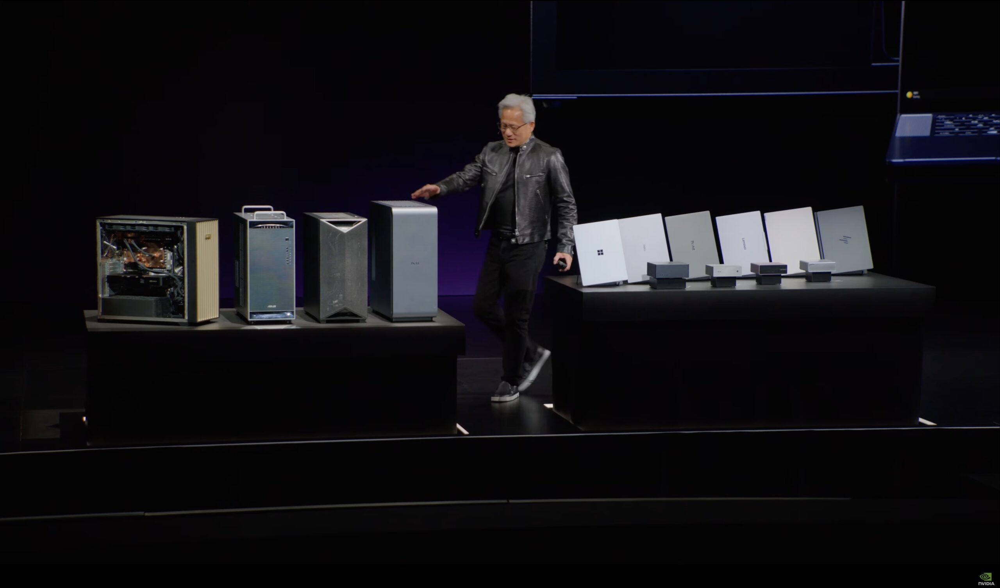
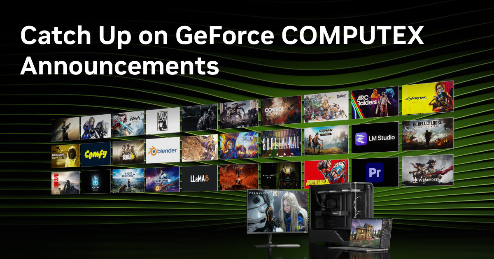

# 英伟达 Computex 2026：从机房一路铺到 Windows 桌面

5 月 31 日，黄仁勋在 Computex 台北的 GTC Taipei 主题演讲上，把英伟达这一年要卖的东西一次摊开。两个多小时的演讲里，从机柜级的 Vera Rubin 超级系统，到给 Windows 的 DGX Station 工作站，到能装进普通笔记本和台式机的 RTX Spark，再到给机器人和自动驾驶用的一整套 Physical AI 模型，全部讲了一遍。

容易被一堆型号绕晕。但如果只抓一条线，这场演讲其实只讲了一件事：

**同一颗 Blackwell 架构，英伟达正在把它从数据中心一路下放——从机房里的 Vera Rubin 机柜，到桌边的 DGX Station，再到你笔记本里的 RTX Spark，让『跑得动智能体』这件事第一次在每一档算力上都成立。** 顺着这条下放梯队，挑出和国内开发者真正相关的几件。

先看英伟达自己反复强调的那条主线。

## 主线只有一条：英伟达说，智能体已经能赚钱了

*来源：英伟达官方新闻稿 RTX Spark 发布配图 nvidianews.nvidia.com*

整场演讲反复出现的一句话是：智能体（agent）已经能干活、能赚钱，每生成一个词元（token）都对应一份收入。黄仁勋把这一年的英伟达定位成「卖会赚钱的智能体算力」，硬件只是这套生意的载体。

围绕个人电脑，他给了一句更重的话——RTX Spark 是「40 年来第一条被彻底重新设计的 PC 产品线」，并称整个 PC 产业「100%」都会站到这套平台上、跨好几代架构一起做。这话说得满，但背后是一个真实的转向：英伟达不再只把消费级当游戏显卡卖，而是把同一套 CUDA、RTX、AI 平台压进一颗芯片，往「个人 AI 机器」推。

这条主线之所以重要，是因为它解释了后面所有型号为什么长一个样——它们是同一套能力在不同算力档位上的复制。顺着梯队从机房往桌面走。

## 机房这头：Vera Rubin 进入量产，5 分钟装一个机柜

梯队最上面一档是 Vera Rubin——英伟达下一代数据中心超级系统。本次演讲给出的关键进展只有一句，但分量不轻：**Vera Rubin 已经进入全面量产。**

黄仁勋现场强调了一个工程细节：通过把整机柜的组装流程重做，一个 Grace Blackwell 机柜的装配时间被压到 5 分钟级别。对数据中心客户来说，这意味着交付节奏更快、单位算力的落地成本更可控。

这一档离个人开发者最远，一句话带过即可：它是这条下放梯队的源头——所有往下走的芯片，本质都是这套机房级架构的小型化。真正和我们桌面相关的，从下一档开始。

## 工作站到桌面：同一套能力，三个算力档位

*来源：英伟达 Computex 2026 主题演讲 Windows PC 环节，StorageReview 报道整理 storagereview.com*

往下两档，是这次面向「个人和开发者」的主角：给 Windows 的 DGX Station 工作站，和能进普通笔记本、台式机的 RTX Spark。

先把三档摆在一张表里，最能看清英伟达的下放逻辑——同样是 Grace + Blackwell，只是内存和算力按档位拉开：

| 档位 | 代表产品 | 芯片 | 统一内存 | AI 算力 | 定位 |
|---|---|---|---|---|---|
| 工作站 | DGX Station（Windows） | GB300 Grace Blackwell Ultra | 最高 748GB 一致性内存 | 最高 20 petaflops（FP4） | 高端本地 AI 工作站 |
| 桌面 / 笔记本 | RTX Spark | 20 核 Grace + Blackwell GPU（6144 CUDA 核） | 最高 128GB 统一内存 | 1 petaflop（FP4） | 消费级个人 AI 机器 |
| 对照：机柜 | Vera Rubin | 下一代 Grace Blackwell | 机柜级 | 机柜级 | 数据中心 |

**DGX Station 这一档**是给专业开发者和工作站用户的：一颗 GB300 Grace Blackwell Ultra 超级芯片，72 核 Grace CPU 配 Blackwell Ultra GPU，最高 748GB 一致性内存、最高 20 petaflops 的 FP4 算力，还带一块 ConnectX-8 高速网卡（800Gb/s），可选再加一块 RTX PRO 6000 工作站显卡。简单说，它把过去得搭一个小机柜才有的本地训练 / 推理能力，收进了一台能放在桌子底下的工作站，而且这次明确是给 Windows 用的。

**RTX Spark 这一档**是这次声量最大的消费级产品：把 Grace CPU 和 Blackwell GPU 封进一颗超级芯片，最高 128GB 统一内存、1 petaflop 算力，官方称本地能跑 120B 参数的大模型加 100 万词元上下文。秋季上市，华硕、戴尔、惠普、联想、微软 Surface、微星都有机型，据报道 30 多款笔记本、10 多款台式机。

RTX Spark 的「装得下 vs 跑得快」这笔账——128GB 统一内存能装下 120B，但据报道内存带宽约 300 GB/s、不到一张 RTX 4090（约 1008 GB/s）的三分之一——此前已单独算过，这里不再展开。本篇只把它放回梯队里看：**它的意义不在某一项参数，而在英伟达第一次让『跑得动本地大模型』这件事，从过去得花四五千美元的专用开发机（如已上市的 DGX Spark），下放到了消费级 Windows 笔记本能够得着的价位。**

这一档讲完，下放梯队的硬件部分就清楚了。但硬件只是壳，真正让国内开发者今天就能用上的，是同台放出的软件优化。

## 给开发者：本地推理直接提速，DLSS 4.5 八月到

*来源：英伟达 GeForce Computex 2026 官方发布页 nvidia.com/geforce*

如果说硬件要等秋季，这一节的东西是开发者今天就能受益的。两件最值得记：

- **本地推理直接提速**：英伟达公布了一组针对主流智能体模型的优化——在 llama.cpp 上 2 倍、在 vLLM 上 2.6 倍的性能提升；多卡场景下 llama.cpp 和 ComfyUI 还有额外 2 倍增益。对用 RTX 显卡在本地跑模型的人，这是不换硬件就能拿到的加速。
- **本地智能体运行时 OpenShell**：和微软一起，英伟达给出了一套叫 NVIDIA OpenShell 的本地智能体运行时，配上一组 Windows 安全机制，让智能体能在受控沙箱里访问本地文件、邮件、日历乃至实时屏幕，全部在设备上处理、不上云。这是把「个人智能体」从演示推向可部署的一步。

游戏和创作这条线也有更新，挑两条：

- **DLSS 4.5 光线重建**：8 月到，换上第二代 Transformer 模型，官方称相比上一代多用 35% 算力、多处理 20% 参数，画面重建质量更好；秋季进 Blender 5.3，创作者也能用上。
- **配套软件**：RTX 加速的游戏和应用已超 1000 款；Adobe 重写了 Photoshop 和 Premiere 的部分流程，在 RTX Spark 上 AI 性能翻倍。

这一节是整场演讲对国内开发者最实在的部分——硬件可以等，软件优化先到。最后一档，是离消费级最远、但想象空间最大的 Physical AI。

## Physical AI：一套模型，喂给机器人和自动驾驶

下放梯队之外，黄仁勋花了大量篇幅讲 Physical AI——把同一套 AI 能力喂给机器人和自动驾驶。三个模型最值得记，列成一张表：

| 模型 | 定位 | 关键规格 | 开放方式 |
|---|---|---|---|
| Cosmos 3 | 物理世界基础模型 | 混合 Transformer 全模态，处理文本 / 图像 / 视频 / 环境声 / 动作；分 Super（高精度）/ Nano（快推理）/ Edge（实时，稍后） | Hugging Face / GitHub / build.nvidia.com |
| Alpamayo 2 Super | 自动驾驶视觉-语言-动作模型 | 320 亿参数，面向 L4，360 度环视感知，带可解释推理轨迹 | GitHub / Hugging Face（夏季） |
| Isaac GR00T 参考人形机 | 人形机器人参考设计 | 基于宇树 H2 Plus 机身，约 1.8 米 / 68 公斤、75 个自由度，大脑用 Jetson AGX Thor（128GB 统一内存），约 1kWh 电池、3 小时续航 | 硬件年底上市 |

这三样里，**Cosmos 3 和 Alpamayo 2 都直接上 Hugging Face 和 GitHub 开放权重**——国内做机器人、做自动驾驶的团队可以直接取用，这是比硬件更值得关注的一点。落地一侧，英伟达列了 DRIVE Hyperion 的一串合作：Uber 的慕尼黑无人车项目年内启动，富士康 / 富智捷的台湾无人车瞄准 2028，越南 VinFast 在东南亚做 L4 部署。

至于 Isaac GR00T 这台基于宇树机身的参考人形机本身，它本身此前已单独写过，这里只把它放回 Physical AI 的整体里看：它是英伟达给整个机器人行业的一个「参考答案」，让更多团队不用从零搭硬件。

## 梯队读完：英伟达把同一套能力铺满了每一档算力

把这场演讲从头看到尾，型号很多，逻辑只有一条：**英伟达不再分『数据中心的 AI』和『个人的 AI』，而是用同一颗 Blackwell 架构，从 Vera Rubin 机柜、DGX Station 工作站、一路下放到 RTX Spark 笔记本，让『跑得动智能体』在每一档算力上都成立，再用 Physical AI 把这套能力延伸到机器人和车上。**

对国内开发者，这场演讲里真正能马上用上的，不是秋季才到的芯片，而是今天就能拿的几样：llama.cpp 2 倍、vLLM 2.6 倍的本地推理优化，Cosmos 3 和 Alpamayo 2 的开放权重，以及一个正在成形的本地智能体运行时。硬件下放需要时间，但能力下放已经开始——我们这一代开发者，恰好赶上从机房到桌面的算力被一档档铺平的时候，手里能选的工具，只会越来越多。
