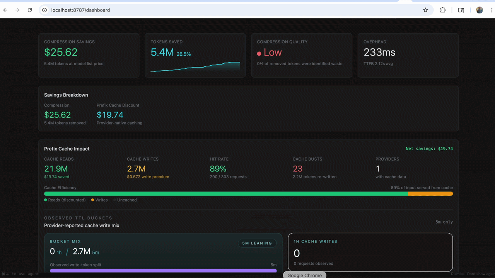
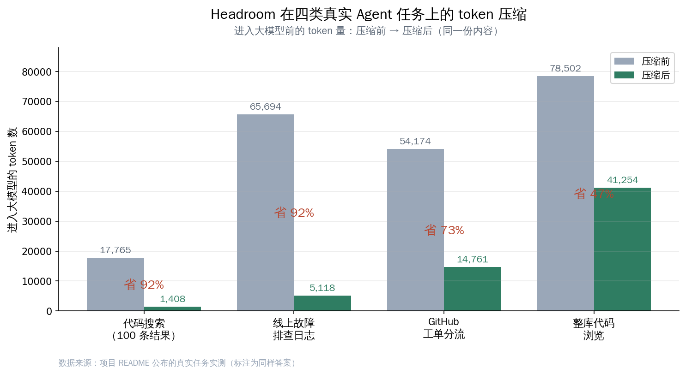
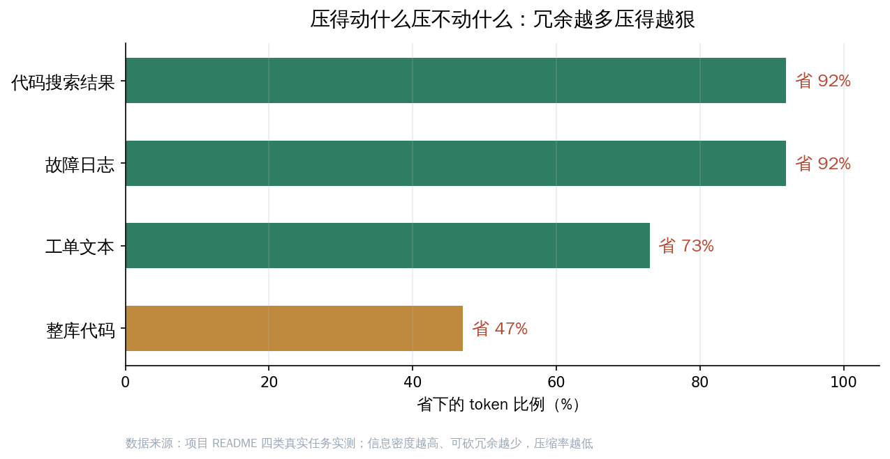
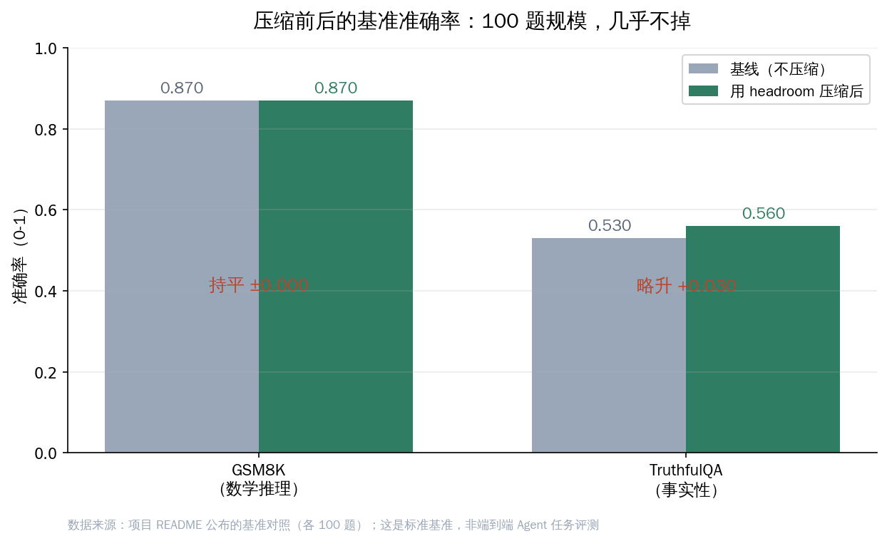
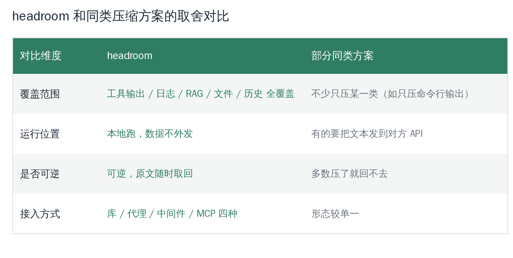

# 给 Agent 省 token 的 headroom：进大模型前先砍掉一大半内容

<small>来源：headroom 项目 GitHub 社交卡片（chopratejas/headroom，2026-06-04）</small>

一个开发者用 Claude Code 跑了一次线上故障排查，让 Agent 把一段日志读进去定位那行 FATAL。日志原文 65694 个 token，几乎把半个上下文窗口塞满。换上 headroom 之后，同一段日志进模型时只剩 5118 个 token——同样找到了那行 FATAL，token 少了 92%。

这就是 headroom 想解决的那件具体的事：**Agent 真正需要"读懂"的信息，往往只占它实际吞进去的 token 的一小部分；剩下的是格式、缩进、重复字段、噪声**。headroom 做的是在这堆内容进入大模型之前，先把它压到原来的一小块再送进去。本文要回答的，就是这句话到底能不能成立、压到什么程度、什么时候压得动、什么时候压不动——以及它把"零损失"这件事说得有多诚实。

## token 成本不是省钱问题，是上下文窗口问题

先把这件事为什么值得做讲清楚。现在一线开发者每天用 Claude Code、Cursor、Codex 这类 Agent，最常撞上的墙不是模型不够聪明，而是**上下文窗口被无关内容占满**。具体表现是这几种：

- Agent 调一次工具，返回的是一大段 JSON——里面真正有用的可能就三五个字段，其余是嵌套结构和重复 key；
- Agent 读一份日志定位报错，几万行里真正相关的就那几行，但整段都进了模型；
- 做 RAG 检索，召回十几段切片，每段都带着模板化的页眉页脚和元数据；
- 让 Agent 浏览一个代码库，整文件原样塞进去，注释、空行、import 全占着 token。

这些内容有两重代价。一重是钱：进模型的 token 越多，每次调用越贵。另一重更要命——**上下文窗口是有限的，噪声占得越多，留给真正推理的空间越少**，模型还容易在长上下文里"读丢"关键信息。所以省 token 在 Agent 场景里不是抠成本，是把有限的窗口腾出来给真正重要的内容。

而且这两重代价是会叠加放大的。一个长任务里，前面几步塞进来的噪声不会自己消失，它会一直跟着上下文滚到后面每一步，被反复计费、反复占窗口。等于说越早进来的那段冗余，被重复"收费"的次数越多。所以在 Agent 场景里，把内容在入口处就压瘦，收益不是线性的省一次，而是顺着整条任务链省下去。

headroom 给这件事的解法用一句话概括就是：在更小的预算里塞进同样的信息。它把自己定位成 Agent 和大模型之间的一层压缩处理——你的 Agent 该读什么还读什么，只是这些内容在抵达模型之前先过一遍 headroom。这层处理强调一件让人安心的事：**全程在本地跑，你的数据不外发**，原文也只存在你自己机器上。对在意数据不出本机的开发者，这一条有时比压缩率本身更要紧。

## 三种用法：当库、当代理、当 MCP server

headroom 没有强迫你改 Agent 架构，它提供三种用法，对应三种接入深度，你可以按自己的场景挑最省事的那一种。

**第一种，当库直接调。** Python 里 `from headroom import compress`，TypeScript 里 `await compress(messages, { model })`，在自己的应用里把要发给模型的 messages 先压一遍。适合自己写 Agent 逻辑、想精确控制压哪一段的人。它还顺手给主流框架都留了接口——Anthropic / OpenAI 官方 SDK、Vercel AI SDK、LiteLLM、LangChain、Agno、Strands 都能一行接进去，不用自己改造调用链。

**第二种，当代理（proxy）挡在中间。** 跑一句 `headroom proxy --port 8787`，它起一个本地代理，任何走 OpenAI 兼容接口的客户端把请求指过来就行，一行业务代码都不用改，什么语言写的 Agent 都能用。这是接入成本最低的一种——尤其适合"我不想动代码，只想看看到底能省多少"的试水心态。

**第三种，当 MCP server。** 这是它和 Claude Code、Cursor 这类支持 MCP 的工具贴得最紧的一种用法。headroom 跑 `headroom mcp install` 之后，对外暴露三个 MCP 工具：

- `headroom_compress`——把一段内容压缩；
- `headroom_retrieve`——把之前压掉的原文取回来；
- `headroom_stats`——查压缩省了多少。

也就是说，支持 MCP 的 Agent 可以把 headroom 当成一个标准工具来调，压缩这件事变成 Agent 工作流里的一个可调用动作。

除此之外它还提供了一个更省事的入口——`headroom wrap` 系列命令。一条 `headroom wrap claude`、`headroom wrap codex`、`headroom wrap cursor` 就能把对应的编码 Agent 包起来，压缩自动生效。官方列出的兼容清单里，Claude Code、Codex、Cursor、Aider、Copilot CLI、OpenClaw 都在一条命令包得住的范围内。

把这三种用法翻译成一个开发者的真实选择题，大概是这样：

- **自己写 Agent、要逐段控制压什么**——选库模式，`compress()` 接在自己的调用链里；
- **手上是别人写好的 Agent、不想动它一行代码**——选代理模式，起个本地代理把请求指过去；
- **每天用 Claude Code / Cursor 这类支持 MCP 的工具**——选 MCP 或 `headroom wrap`，一条命令包起来就能用，压缩和取回都变成 Agent 能调的工具。

三种用法之间还能叠——比如你既用 `headroom wrap claude` 让 Claude Code 自动省 token，又在自己另一个 Python 服务里用库模式精压某段 RAG 召回，两边共用同一套本地存储和记忆。这种"按场景挑接法、又能混着用"的弹性，是它接入门槛低的关键。

<small>来源：headroom 项目 README 内嵌运行录屏的画面（CLI 包裹 Claude Code，2026-06-04）</small>

## 不是一刀切压缩，是分内容类型选不同压法

headroom 真正讲究的地方在于它**不是用一种算法压所有东西**。不同内容的结构差别很大——JSON 是结构化的、代码是有语法树的、自然语言段落又是另一回事——用同一把尺子压必然顾此失彼。

它的做法是先判断内容类型，再分派给对应的压缩处理。整条处理顺序大致是：先对齐缓存前缀、再判断内容类型分流、最后做可逆压缩存档。

它内部主要有这么几块各管一摊：

- **SmartCrusher**——专门压 JSON，处理字典数组、嵌套对象、混合类型这些工具输出最常见的结构；
- **CodeCompressor**——按语法树（AST）压代码，支持 Python、JavaScript、Go、Rust、Java、C++，能理解代码结构而不是当纯文本砍；
- **Kompress-base**——一个发布在 HuggingFace 上的模型，专门压自然语言散文，用 Agent 运行轨迹训练出来；
- **CacheAligner**——稳定住请求前缀，让 Anthropic、OpenAI 这些厂商的 KV-cache 真正命中；
- **IntelligentContext**——按学到的重要性给内容打分，决定哪些留、哪些压；
- **CCR（可逆压缩）**——压缩时原文不删，模型要的时候能取回来，下一节单独说。

判断内容类型、选对压缩器这件事由一个叫 ContentRouter 的部分统一调度。这套分类型处理的设计，也是它敢说"同样答案"的底气——结构化的东西按结构压，不会把代码里有意义的符号当噪声删掉。

更难得的是，无论你是当库调、走 SDK，还是用代理，headroom 对外都是同一条稳定的请求生命周期，不会因为接入方式不同就行为飘忽。这条生命周期被拆成一串清晰的阶段，按顺序大致是：接收输入 → 缓存对齐 → 内容分流 → 压缩 → 存档记忆 → 发送前处理 → 收到回复。

开发者可以在任意一个阶段挂自己的处理逻辑，比如在"压缩"这一步加一条自定义规则、在"存档"这一步决定哪些原文要留底。这意味着 headroom 不是一个黑盒函数，而是一条**每一步都能观察、能介入**的处理流程——你想全自动就全自动，想精细控制某一段也有口子。

这里单独点一下 CacheAligner，因为它解决的是一个很容易被忽略的坑。Anthropic、OpenAI 这些厂商的 KV-cache 是按请求前缀命中的——只要前缀有一丁点变化，缓存就失效，得重算。压缩如果把每次请求的前缀都搅乱了，反而会把本来能命中的缓存白白丢掉，省下来的 token 又从缓存失效那头亏回去。CacheAligner 做的就是稳住前缀，**让压缩和缓存命中这两件事不打架**。从 dashboard 的实测画面能看到，prefix 缓存命中率被维持在 89% 这个量级。

<small>来源：headroom 项目 README 内嵌的运行截图（dashboard 实测帧，2026-06-04）</small>

## CCR：压掉的原文没丢，模型要的时候能取回来

很多压缩方案的麻烦在于——压了就回不去了，万一模型恰好需要被压掉的那段细节，就抓瞎了。headroom 的 CCR（可逆压缩）走的是另一条路：**压缩时原文不删，留在本地；模型如果真的需要某段被压掉的细节，调 `headroom_retrieve` 把原文取回来**。

这等于给"压得太狠丢了关键信息"上了一道保险。日常对话里模型读压缩版就够了，省 token；遇到压缩版信息不足的情况，它有一个明确的口子能把原文拿回来。配合前面的分类型压缩，headroom 想表达的取舍是：**默认尽量压，但不让你为压缩承担"信息真的没了"的风险**。

对要把压缩接进生产的人来说，这个可逆设计其实比压缩率更值钱。它意味着你可以先开着压缩跑，万一某个任务效果不对，原文还在，能取回来对照、能回滚，而不是压完就成了一锤子买卖。它把"敢不敢上"的心理门槛降了一大截。

## 压多少，得看压的是什么——诚实地交代区间

接下来是大家最关心的：到底能压多少？项目对外标的是"60-95% fewer tokens"，但**这个区间不能拿来当成任意内容都能压到 95% 的承诺**。压缩率高度取决于内容的冗余程度——越是结构化、越是重复的内容压得越狠，越是密集的有效信息压得越少。

项目 README 给出了四类真实 Agent 任务的实测数字，区间从 47% 到 92%，把这个分布看清楚很重要：

<small>来源：根据 headroom 项目 README 公布的真实任务实测数据整理（同样答案口径）</small>

| 任务类型 | 压缩前 token | 压缩后 token | 省下比例 |
|---|---|---|---|
| 代码搜索（100 条结果） | 17,765 | 1,408 | 92% |
| 线上故障排查日志 | 65,694 | 5,118 | 92% |
| GitHub 工单分流 | 54,174 | 14,761 | 73% |
| 整库代码浏览 | 78,502 | 41,254 | 47% |

这张表比一句"省 60-95%"诚实得多。能看出一条很清楚的规律：

<small>来源：根据 headroom 项目 README 四类真实任务实测整理</small>

**搜索结果、日志这类高度重复、噪声密集的内容压得最狠（92%）；而整库代码浏览这种有效信息密度高的场景，压到 47% 就到头了**——因为代码里能砍的冗余本来就少。所以对自己的场景估收益，应该看你喂给 Agent 的内容偏哪一类，而不是直接套那个 95% 的上限。把规则记成一句话：**你喂进去的越是噪声，它帮你省得越多；你喂进去的越是干货，它越不会乱动。**

## "同样答案"是什么口径：基准测试不等于端到端任务

项目反复强调"same answers"（同样答案），还给了一组基准测试数字。这里要把口径说清楚，避免误读。

它公布的基准对照是这样的：

| 基准 | 类型 | 样本数 | 基线得分 | 用 headroom 后 | 差值 |
|---|---|---|---|---|---|
| GSM8K | 数学推理 | 100 | 0.870 | 0.870 | ±0.000 |
| TruthfulQA | 事实性 | 100 | 0.530 | 0.560 | +0.030 |
| SQuAD v2 | 阅读问答 | 100 | — | 97% | 压缩 19% 时 |
| BFCL | 工具调用 | 100 | — | 97% | 压缩 32% 时 |

GSM8K 那一行是它最常被引用的依据——100 道数学题，压缩前后准确率都是 0.870，**确实是零下降**。TruthfulQA 甚至略微高了 0.030。

<small>来源：根据 headroom 项目 README 公布的基准对照整理（各 100 题）</small>

但有三点必须诚实地交代清楚：

- **这是标准基准测试，不是端到端的真实 Agent 任务评测**。GSM8K 是数学应用题，TruthfulQA 是事实问答，它们衡量的是"压缩之后模型还能不能答对这类标准题"，不等于"在你那套复杂的多轮 Agent 工作流里效果一定不掉"；
- **样本量是 100 题**。这个规模能说明趋势，能支撑"压缩没有明显损害准确率"的判断，但不是大规模评测；
- **SQuAD v2 和 BFCL 那两行的 97% 对应的是较温和的压缩率（19% 和 32%）**，不是前面表格里那种 90%+ 的激进压缩。也就是说，越激进的压缩越要警惕准确率，这两行恰好提示了压缩率和准确率之间存在取舍。

把这几点放在一起看，更稳妥的理解是：**headroom 在中等压缩率下，于这几个标准基准上几乎不损准确率；在高压缩率（90%+）的真实任务上它声称仍是"同样答案"，但那是基于具体任务的人工核对，而非这组基准跑出来的**。对要上生产的人，结论应该是"先在自己的任务上拿可逆压缩做小流量验证"，而不是直接信一个上限数字。好在前面说的 CCR 可逆设计，正好让这种小流量验证做起来没什么心理负担。

## 为什么"省 token"这件事今年突然变得要紧

把视野放大一点看，headroom 这类工具能在今年冒头，背后是 Agent 用法本身变了。一两年前大家用大模型，多半是单轮问答——问一句、答一句，上下文也就几千 token，省不省无所谓。今年主流变成了多轮、长链路的 Agent：一个任务里 Agent 要反复调工具、读文件、查日志、检索文档，每一步的输出都累进上下文里滚雪球。

这就带来两个新痛点，恰好是 headroom 瞄准的：

- **窗口被滚雪球式占满**——任务跑到一半，上下文里堆的全是前几步工具返回的原始输出，真正要推理的内容反而被挤到边上；
- **重复读同一份内容**——多个 Agent 协作时，同一份文档、同一段代码常被不同 Agent 各读一遍，token 重复消耗。

headroom 的分类型压缩对着第一个痛点，跨 Agent 共享记忆对着第二个痛点。它不是凭空造了个需求，而是 Agent 工作流走到这一步，自然长出来的一层。理解了这个背景，就能明白为什么它强调"全覆盖"——因为在真实 Agent 任务里，吃掉窗口的从来不是单一某类内容，而是工具输出、日志、RAG、文件、历史混在一起的一大坨。

## 它在一排同类工具里站在哪

上下文压缩这件事不止 headroom 一家在做。把它放在同类里看，能更清楚它的取舍：

<small>来源：根据 headroom 项目 README "Compared to" 一节整理</small>

| 维度 | headroom | 部分同类方案 |
|---|---|---|
| 覆盖范围 | 工具输出 / RAG / 日志 / 文件 / 历史全覆盖 | 不少只压某一类（如只压命令行输出） |
| 运行位置 | 本地跑，数据不外发 | 有的要把文本发到对方 API |
| 是否可逆 | 可逆（CCR，原文能取回） | 多数压了就回不去 |
| 接入方式 | 库 / 代理 / 中间件 / MCP 四种 | 形态较单一 |

它的卖点集中在四个字：**全、本地、可逆、接法多**。当然这也意味着它更重——如果你只用单一厂商、只需要对话历史的原生压缩、又不需要跨 Agent 共享记忆，那它对你可能偏重了，这一点项目自己在文档里也直说了，没有硬把所有人都框进来。

值得一提的是，它并不排斥别的工具：headroom 把另一个做命令行输出改写的工具 RTK 直接装进了自己的处理流程，对 RTK 处理过的输出再做下游压缩。这种叠加而非互斥的态度，对实际接入是友好的——你已有的工具不用拆掉，headroom 接在下游继续帮你省。

这几个维度里，"本地跑"和"可逆"两条尤其值得国内开发者多看一眼。把要压的文本发到第三方 API 去压，意味着你的代码、日志、检索内容都要出本机，这在很多团队是直接卡死的红线；headroom 全程本地，原文也只存本地，这条对合规敏感的场景几乎是硬门槛。而"可逆"则决定了你敢不敢把压缩开在真实流量上——能取回原文，就能放心地先压再说，错了能回退。两条加起来，是它区别于"压完就发走、压完就回不去"那类方案的根本差异。

## 什么时候该上它，什么时候可以先不上

一个工具肯把"什么时候别用我"写进首页，通常比满屏只夸自己的更值得信。headroom 在文档里很直接地划了适用和不适用的边界，照着对一对自己的场景，比看压缩率有用。

**比较适合上的情况：**

- 每天跑 AI 编码 Agent，又不想为了省 token 改自己的代码——代理或 `headroom wrap` 一条命令就接上了；
- 同时在好几个 Agent 之间切换，需要一份跨工具共享、还能自动去重的记忆；
- 在意"压了能不能取回来"，需要可逆压缩兜底——原文随时能通过 CCR 取回。

**可以先不上的情况：**

- 只用某一个厂商自带的对话压缩就够了，也不需要跨 Agent 共享记忆——那 headroom 对你偏重；
- 跑在沙箱环境里、本地起不了进程——它要在本地跑，这种环境接不进去。

这两栏边界的诚实，恰恰回应了前面反复强调的那条：headroom 不承诺"无损万能"，它清楚自己擅长什么、不适合什么。对要落到真实项目里的人，先用这两栏对一遍自己的场景，再决定接不接，是最省事的判断方式。

## 工程上还有几块顺手的设计

除了核心压缩，headroom 还带了几个面向多 Agent 协作的能力，对每天在 Claude、Codex、Gemini 之间来回切的人挺实用：

- **跨 Agent 共享记忆**——在 Claude、Codex、Gemini 之间维护一份共享存储，自动去重，换工具不丢上下文；
- **`headroom learn`**——挖掘失败的会话，把纠正经验写回 `CLAUDE.md` / `AGENTS.md` / `GEMINI.md`，让 Agent 下次少犯同样的错；
- **图片压缩**——通过训练出来的路由模型，把图片也压掉 40-90%；
- **多 Agent 上下文传递**——压缩后的上下文能在多个 Agent 之间传递，不必每个 Agent 重新读一遍原文。

这些不是这篇要展开的主线，但它们说明 headroom 想做的不只是一个压缩函数，而是一层服务于多 Agent 日常的上下文处理。换句话说，它的野心不止"帮你省 token"，而是"帮你的一整套 Agent 协作省心"。

## 写在最后：把窗口腾给真正重要的内容

回到开头那句话——Agent 真正需要读懂的信息，往往只占它吞进去 token 的一小部分。headroom 做的就是把这件事工程化：**分内容类型选压法、用可逆压缩兜住风险、本地跑保住数据、库 / 代理 / MCP 三种接法降低门槛**。

它在四类真实任务上把进模型的 token 砍掉 47%-92%，并在 100 题规模的 GSM8K 上做到准确率零下降——这些数字诚实地交代了适用边界：压得动的是结构化、重复、噪声多的内容，压不太动的是信息密度高的内容；基准零下降是中等压缩率下的标准题结论，高压缩率的真实任务仍需要自己验证。

这种"把话说满之前先把边界划清"的态度，本身就比一串漂亮数字更让人愿意上手试。它没有把 95% 当成对所有人的承诺，也没有把 100 题的基准包装成端到端保证，而是把压得动什么、压不动什么、可逆怎么兜底都摊开讲——一个肯这么讲的工具，接进生产时心里更有底。

对国内每天和 Agent 打交道的开发者，这是一个很正面的信号：**当大家都在为上下文窗口不够用发愁时，省 token 这条路上已经有人把工具做到了能直接接进 Claude Code、Cursor 的程度**。它不神奇，也不承诺无损万能，但它把"在更小预算里塞进同样信息"这件事，从一句口号变成了可以小流量试一试的真东西。这条路才刚开始走，往后只会有更多人把它走宽——我们正好赶上了趁手工具一个接一个冒出来的时候，沿着这条路往前走，每个人手里的窗口都会越用越从容。
