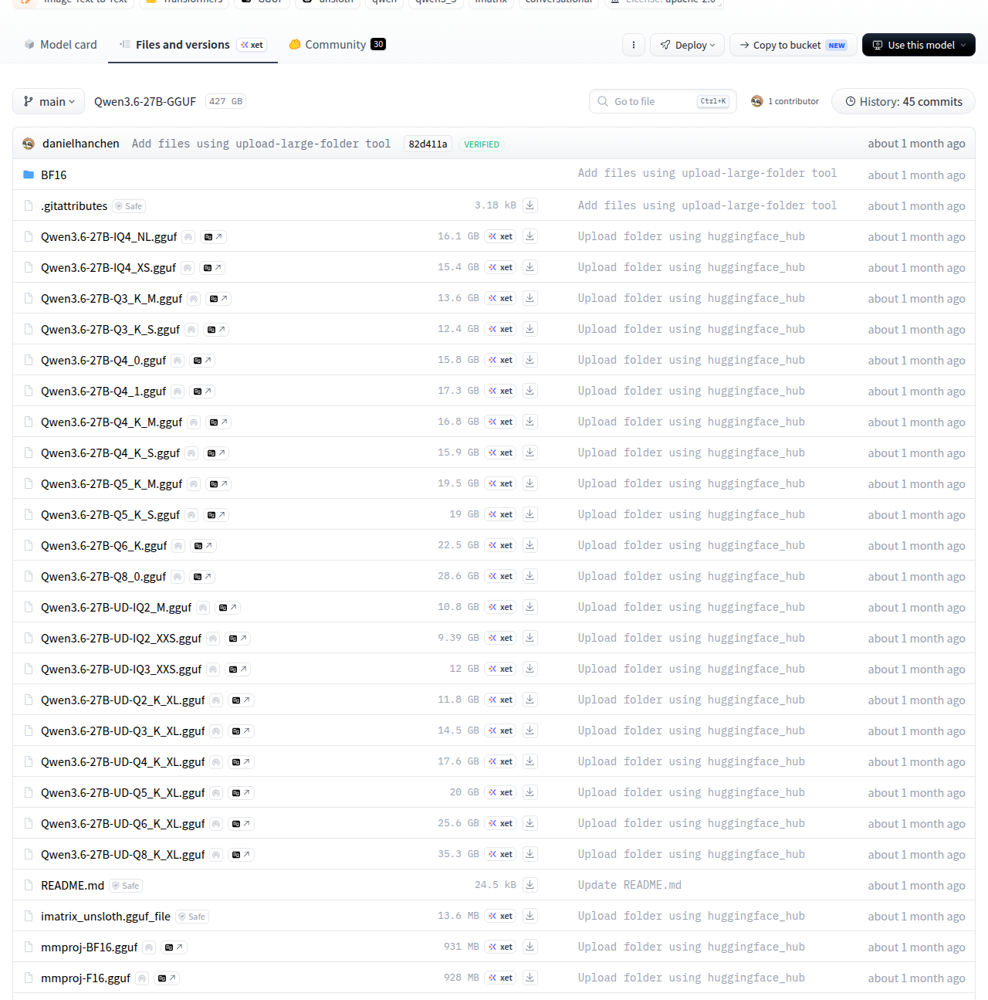
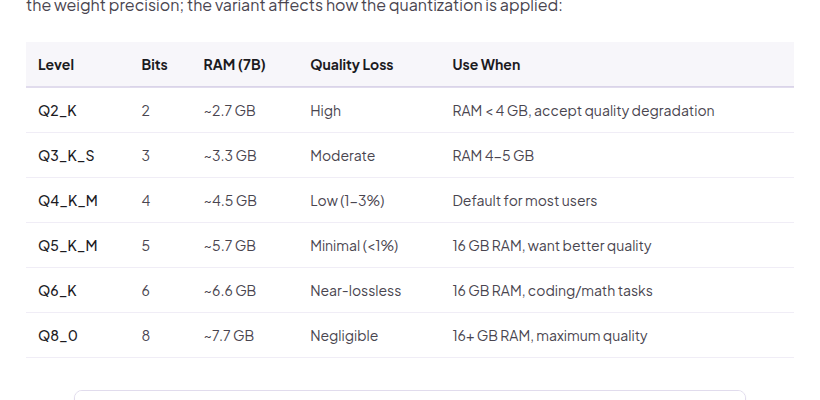
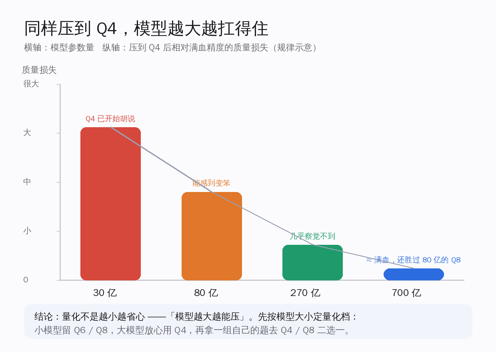
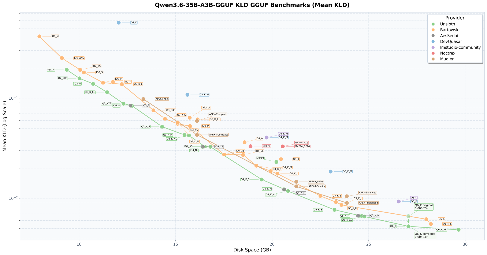
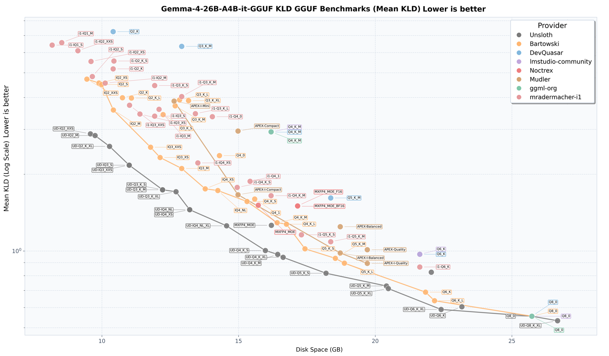

# 本地跑大模型怎么选量化：模型越大越能压，小模型才怕压

每个在自己电脑上跑过大模型的人，下载前都卡在过同一个选择：同一个模型，HuggingFace 上摆着一长串文件——Q2_K、Q4_K_M、Q5_K_M、Q8_0，体积从 2.7GB 到 7.7GB 不等，到底下哪个？

流行的直觉是「显存不够就选小的，越小越省心」。但真把不同量化档下回来、拿同一组题挨个跑一遍，得到的规律是反过来的：**量化不是越小越省心，而是模型越大越能压。** 700 亿参数的模型压到 Q4，质量几乎等于满血；而 30 亿的小模型压到 Q4 就开始胡说。换句话说，量化档不该照着显存余量随手选，而要先看模型本身有多大——大模型经得起狠压，小模型得手下留情。这篇就把这条规律讲透，再给你一套自己在家就能复现的二选一方法。

上面这张图就是你每次下模型前真实面对的画面。以 HuggingFace 上一个热门的 270 亿参数模型为例，它的 GGUF（开源量化模型格式）仓库会一次性列出 Q2_K 一直到 Q8_0、再到动态量化的一长串文件，每个体积都不一样。Qwen（千问）、Gemma、Llama、gpt-oss、DeepSeek 这些大家熟悉的模型，几乎都是这个样子。选哪一个，就是本地跑模型的第一道门槛。

这道门槛之所以让人犯怵，是因为它把两件事捆在了一起：一边是你机器的显存有多少、能装下多大的文件，一边是你愿意为质量付多少代价。大多数人第一反应是盯着显存挑——显存紧就往小里选，显存宽就往大里选。这个直觉只对了一半。

真正决定你该选哪一档的，不是「我显存还剩多少」，而是「这个模型本身有多大、它经不经得起压」。把顺序搞反了，要么白白浪费显存去跑一个其实可以压得更狠的大模型，要么硬把一个小模型压到它撑不住、开始满嘴跑火车。接下来要做的，就是把这个顺序正过来。

## 先认清这些 Q4、Q8 到底在说什么

这一节先把量化档的含义和代价讲清楚：**位数越低，文件越小、跑得越快，但离满血越远——关键是「离多远」在不同档位之间差别巨大。**

量化，简单说就是把模型里原本用高精度数字存的权重，改用更少的位数来近似存储，从而把文件压小、把显存占用降下来。GGUF 是 llama.cpp 这套本地推理工具用的格式，它把同一个模型切成了从 2 位到 8 位的多个档位。下面以一个 70 亿参数的模型为例，把每一档的体积和相对满血的质量损失摆出来。

具体到每一档，含义是这样的：

- **Q2_K**：2 位，约 2.7GB，质量损失严重，属于「实在跑不动才用」的应急档。
- **Q3_K_S**：3 位，约 3.3GB，损失 5–10%，复杂推理和数学题上能明显感觉到掉链子。
- **Q4_K_M**：4 位，约 4.5GB，损失 1–3%（按 MMLU（综合知识基准）口径），被普遍当作多数人的默认档。
- **Q5_K_M**：5 位，约 5.7GB，损失不到 1%。
- **Q6_K**：6 位，约 6.6GB，近乎无损，适合编程和数学这类对精度敏感的活。
- **Q8_0**：8 位，约 7.7GB，损失小到可以忽略，不到 0.5%。

把这串数字读一遍就能看出门道：从 Q8 一路降到 Q4，体积砍掉了将近一半，质量却只掉了 1–3%；但从 Q4 再往下降到 Q3、Q2，体积省得不多，质量却开始断崖式往下走。Q3_K_S 比 Q4_K_M 只省了大约 1.2GB，质量损失却从 1–3% 跳到 5–10%，在复杂推理和数学题上立刻露馅；Q2_K 再往下，省的空间更有限，损失已经被标成「严重」。**Q4_K_M 之所以被当成默认，正是因为它卡在那个「性价比拐点」上——再往下省的那点空间，不值得用质量去换。** 这个默认推荐，已经稳稳坐了大约 18 个月，期间换过一代又一代模型，这条经验一直没被推翻。

往上看也是同一个道理。从 Q4 升到 Q5，损失从 1–3% 收窄到不到 1%；再升到 Q6，已经近乎无损；到 Q8 几乎就是满血复刻。代价是体积一路从 4.5GB 涨到 7.7GB。所以编程、数学这种「错一步全盘皆输」的活，值得多花两三 GB 上 Q6、Q8；而日常问答、写点文案这类容错高的场景，Q4 完全够用，省下的显存还能让上下文开得更长。**先想清楚「这台机器主要拿来干什么」，再决定要不要为那不到 1% 的质量多掏显存，比盲目追高有用得多。**

## 速度这笔账：量化越小越快，但分场合

这一节的核心结论很短：**在 GPU 上，量化越小确实越快，Q4 大约是 Q8 的 1.7 倍速度；但换到 CPU 上，这条规律只是有时成立。**

很多人选小量化档，图的不只是省显存，还有速度。同一张显卡上，Q4 跑起来大约比 Q8 快 1.7 倍——位数少了，每次计算搬运的数据也少，自然快。但这条「越小越快」的规律主要在 GPU 上成立；到了 CPU 上，瓶颈换成了别的环节，小量化档不一定更快，只是有时候快。

光说倍率不够直观，把一个 700 亿参数的大模型放到不同硬件上实测，速度差异是这样的：

- **单张 RTX 4090 + 显存外卸**：约 5–10 词元/秒（token/秒），模型装不下显存、要往内存里挪一部分，速度被拖住。
- **双 RTX 4090 分层（Q5）**：约 100 词元/秒，两张卡把模型层分着扛，速度一下子上来了。
- **RTX 5090 原生（Q4）**：约 10–12 词元/秒。
- **Mac Studio M2 Ultra（Q4）**：约 35 词元/秒，统一内存的优势在大模型上体现得很明显。
- **消费级 CPU 跑 70 亿 Q4**：约 8–12 词元/秒，纯 CPU 跑中等模型，这个速度已经能用。

这几行对比里最值得琢磨的，是单张 RTX 4090 和双 RTX 4090 之间那道鸿沟：同样是 700 亿参数的模型，单卡靠显存外卸只能跑出 5–10 词元/秒，两张卡把模型层分着扛就直接冲到约 100 词元/秒。差距大到这个地步，根子不在量化档，而在「模型有没有完整装进显存」。一旦装不下、要往内存里挪一部分，每一步推理都得隔着一条慢得多的通道搬数据，速度立刻被拖垮。这也解释了为什么 Mac Studio M2 Ultra 用 Q4 能跑到约 35 词元/秒——它的统一内存够大，大模型能整个装进去，省掉了外卸那一刀。

这串数字想说明的是：**速度不是单看量化档决定的，硬件配置、是否需要显存外卸、是单卡还是多卡分层，影响往往比量化档本身更大。** 选档时，速度可以作为参考，但别让它喧宾夺主——真正该先想清楚的，是下一节那条关于模型大小的规律：它不光决定质量，还顺带决定了你的模型能不能整个塞进显存、要不要走那条拖后腿的外卸路。

## 真正的反差：模型越大，越扛得住压

这是全文的核心。**同样压到 Q4，30 亿参数的小模型质量损失明显、开始胡说，700 亿参数的大模型却几乎无损——模型越大，越扛得住量化。**

为什么会这样？可以这么理解：大模型的参数本来就有大量冗余，权重里藏着很多「重复表达同一件事」的空间，压低精度时，这些冗余先被牺牲掉，核心能力还稳稳留着；而小模型本来参数就紧巴巴，每一个权重都在干活，精度一降，真正承载能力的部分就被伤到了。所以同一档量化，落在大模型身上是「挠痒痒」，落在小模型身上是「伤筋动骨」。

这条规律最有说服力的一个证据是跨尺寸的对比：**Llama 3.1 的 700 亿参数版本压到 Q4_K_M，在几乎所有基准上都胜过 Llama 3.1 的 80 亿参数版本的 Q8_0。** 也就是说，与其用一个小模型的高保真档，不如用一个大模型的压缩档——只要你的显存装得下那个大模型的 Q4，把算力押在「更大的模型 + 更狠的量化」上，往往比押在「更小的模型 + 更轻的量化」上更划算。

把不同大小模型在各档位下的显存需求摆出来，这笔账会更清楚：

- **30 亿参数**：FP16 约 6GB、Q8 约 3.8GB、Q4 约 2GB、Q3 约 1.6GB。
- **70 亿参数**：FP16 约 14GB、Q8 约 7.7GB、Q4 约 4.5GB、Q3 约 3.3GB。
- **130 亿参数**：FP16 约 26GB、Q8 约 14GB、Q4 约 8GB。
- **700 亿参数**：FP16 约 140GB、Q8 约 70GB、Q4 约 40GB、Q3 约 30GB。

看这组数：一个 80 亿参数模型的 Q8 要约 7.7GB，而 700 亿参数模型的 Q4 要约 40GB——后者确实要多吃好几倍显存。但关键在于：只要你装得下这 40GB，质量是全面反超的。**这正是「模型越大越能压」最实在的回报：显存够用的话，把预算花在喂一个更大的模型上，比砸在小模型的高保真档上更值。**

反过来，30 亿这种小模型就得反着来——它本来余量就小，Q4 已经开始胡说，想要它靠谱，就得给它更高的精度档（Q6、Q8），别再省那一两 GB。好在小模型的高精度档也不贵：30 亿参数的 Q8 才约 3.8GB，比 70 亿参数的 Q4（约 4.5GB）还小一圈，所以「小模型给高档」根本不会让显存吃紧。**小模型怕压，是因为它没有可牺牲的冗余——每一个权重都在干活，精度一降就伤到正经本事。**

这条规律也顺手解释了一个很多人踩过的坑：显存只有一点点时，不少人会下意识地拿一个小模型再压到 Q3、Q2，想着「又小又能跑」。但这恰恰是最差的组合——小模型本就脆弱，再叠一道狠量化，跑出来的东西基本不能用。同样的显存预算，与其把小模型往死里压，不如选一个稍大一点、能在 Q4 下站得住的模型。**显存紧的时候，第一反应不该是「压得更狠」，而是「换一个更扛压的尺寸」。**

## 把同一档量化做得更聪明：按层分配位宽

这一节讲一个进阶但很实用的做法：**与其全模型一刀切用同一个位数，不如敏感的层多给位、冗余的层少给位——同样的平均位宽，质量更好。**

前面说的 Q4、Q8 都是「均匀量化」，整个模型一个标准压到底。但模型里不同的层，对精度的敏感度差别很大。Unsloth（一个做高效微调和量化的团队）的动态量化（Dynamic 2.0，对应文件名 UD-Q4_K_XL）就是冲着这个差异去的：嵌入层、首尾的注意力层这类敏感层，保留 Q6 甚至 Q8 的高精度；中间的前馈层这类相对冗余的层，降到 Q2、Q3。这样一来，同样的平均位宽，质量比一刀切的均匀量化更好。

效果有多实在？UD-Q4_K_XL 这个动态量化档，表现比普通的 Q4 更好，体积又比 Q8 系列小了大约 8GB——等于在「更小」和「更准」之间同时占了便宜。

更能说明问题的是编程能力实测。Unsloth 在 Aider Polyglot 编程基准（非推理模式）上，对自己的动态量化各档位打了分：

- **5 位**：70.7%
- **4 位**：69.7%
- **3 位**：68.4%
- **2 位**：65.8%
- **1 位**：55.7%

从 5 位掉到 3 位，得分只从 70.7% 滑到 68.4%，差距小得惊人。这进一步印证了那条核心规律：**在足够大的模型上，三四位量化的编程能力掉得很少。** 真正崩盘要等到 1 位那种极端档才出现。

在 Gemma 这类模型上做的方法对比也是同一个方向：同样的平均位宽，动态量化整体领先一刀切的均匀量化。所以如果你下载的模型恰好有动态量化版本，优先选它，几乎是稳赚的——同等质量更省体积，同等体积质量更高。

## 这些规律不用信我，你自己在家就能验

这一节想说的是：**上面每一条结论，都是可复现的——你不需要相信谁的跑分，下不同的量化档、跑一组自己的题，就能亲眼看到。**

这正是本地跑模型最让人安心的地方：一切都摆在明面上，谁都能验。几个独立的参照可以帮你对照：

- **arXiv 上有一篇统一评测**（标题大意是「我该用哪种量化」），在 Llama-3.1-8B 上，对 llama.cpp 的各个量化档做了同一套口径的测评，结论与「大模型扛压、小模型怕压」的方向一致。
- **HuggingFace 上的 GGUF 仓库**，像前面那个 270 亿参数模型一样，会把 Q2_K 到 Q8_0 再到动态量化一长串文件全列出来，体积各不相同——这本身就是你下载前真实要做的选择，不是厂商替你包办的。
- **HackerNews 上「谁在 2026 年跑本地 AI 工作站」那类讨论**里，大家用 llama.cpp、Ollama、vLLM，在 3090、苹果 M 系列、Strix Halo 等各种机器上跑，分享的也都是自己的一手体验。

有了这些参照，再加上你自己的硬件，就能动手验证。方法很简单：**拿一小组你自己的「金标题」——也就是你平时最常问、最在意答对的那几道题——分别在 Q4 和 Q8 上各跑一遍，选那个能过你质量线的、最便宜的档；把 Q8_0 留作高保真参照，随时对照着看。** 这套方法不依赖任何官方跑分，完全是你自己说了算。

为什么强调「自己的题」而不是官方榜单？因为榜单测的是通用能力，你在意的却可能是某个很具体的活——比如改自己项目里的一段代码、按固定格式抽取信息、用某种语气写回复。一个模型在 MMLU 上掉了 2%，落到你这几道题上，可能完全感觉不出来，也可能正好踩在它变笨的那块。

**官方跑分给的是平均值，你的金标题给的是「对你而言到底够不够用」，后者才是下载前真正要回答的问题。** 准备这组题也不费事：把你最近一周里最常丢给模型的五到十个真实需求记下来，固定下来当尺子，以后每次想换档、换模型，拿这把尺子量一遍就有数了。

## 选量化，先看模型大小，再做你自己的二选一

回到开头那条规律：**量化不是越小越省心，而是模型越大越能压。** 这句话落到操作上，就是一句明确的选档顺序——先看模型有多大，再拿自己的题去二选一。

具体怎么操作，可以记住这几条：

- **700 亿这类大模型**：放心压到 Q4，质量几乎等于满血，性价比最高；显存够的话，有动态量化版（UD-Q4_K_XL）就优先用，更省体积。
- **70 亿、130 亿这类中等模型**：Q4_K_M 是稳妥的默认档，损失只有 1–3%；对编程、数学这类精度敏感的活，往上挪到 Q6、Q8 更稳。
- **30 亿这类小模型**：别再省了，Q4 容易胡说，直接给 Q6 或 Q8，让它把本就不多的本事都使出来。
- **拿不准的时候**：用你自己的一小组金标题，在 Q4 和 Q8 上各跑一遍，选能过线的最便宜那档，Q8_0 留作参照。

本地跑大模型最好的一点，就是这套选择权完完整整握在自己手里：模型在你硬盘上，题是你自己的题，跑出来的好坏你自己说了算，不用看任何人的脸色。摸清「模型越大越能压、小模型才怕压」这条规律，再配上一组自己的金标题，你就能在显存预算之内，稳稳地把每一份算力都用在刀刃上。下一个模型下回来时，那一长串 Q2 到 Q8 的文件，你不会再犯怵了——你已经知道该先看什么、再选什么。
