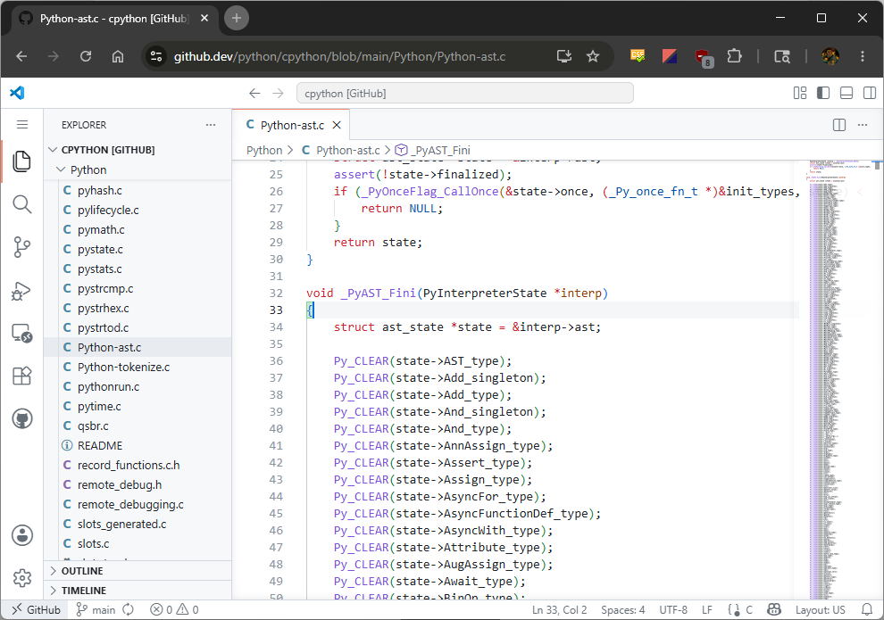
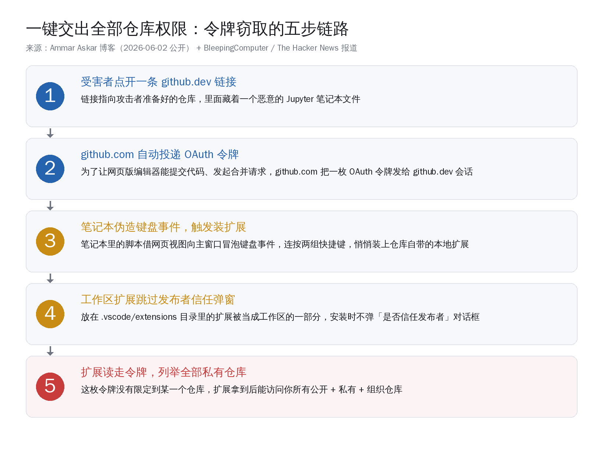
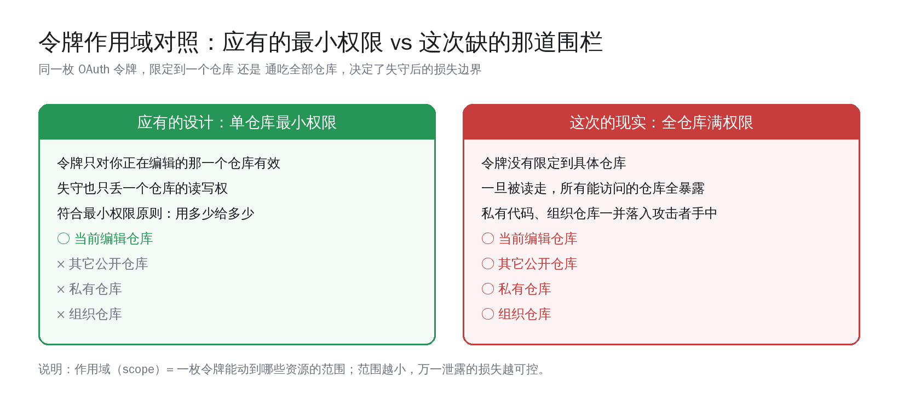
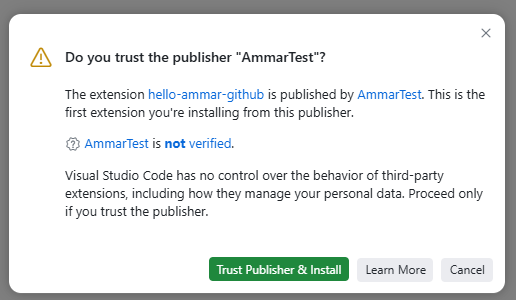
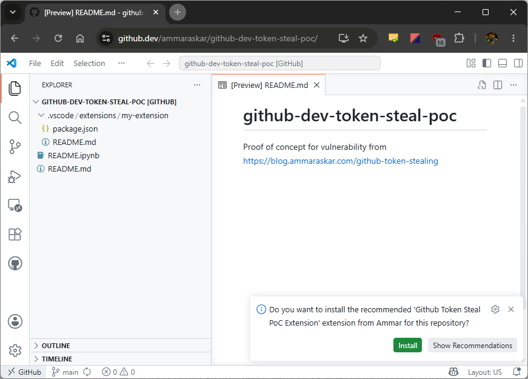
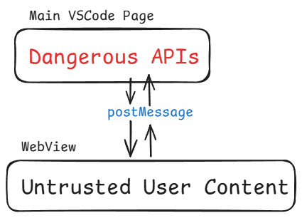

# github.dev 一个链接交出全部仓库：AI 编程时代该补的那道围栏

2026 年 6 月 2 日，安全研究者 Ammar Askar 在个人博客公开了一种针对 github.dev 的攻击手法：受害者只要点开一条 github.dev 链接，攻击者就能拿到一枚 GitHub 的 OAuth 令牌——而这枚令牌不限定在某一个仓库，它能读写你能访问的**全部**公开、私有、组织仓库。次日，也就是 6 月 3 日，微软完成修复，并对外表示问题已在服务端缓解、用户无需操作。

这件事真正值得 AI 编程开发者认真读一遍的，不是某个浏览器编辑器出了个洞、补上了就完事。**它把一条平时藏得很深的信任假设摆到了台面上：当一个编辑器愿意自动替你装仓库里带的扩展、自动把你的身份令牌交给网页会话时，打开一个陌生仓库这个动作，本身就等于把一部分执行权交了出去。** 而今天我们每天在用的 Claude Code、Cursor、Copilot、通义灵码、Trae、扣子，全都建立在同一类假设之上——从仓库里加载扩展、技能、MCP 配置，用令牌代表你去调接口。这道围栏怎么补，是这篇文章想讲清楚的核心。

下面分五段：先看清这次的两处设计缺陷各自是什么；再把视角抬到 AI 编程工具普遍的信任边界；然后给一份开发者今天就能用的加固清单；最后看国产 IDE 与 Agent 在「跑外部代码、装外部技能」这件事上的隔离现状，以及这次事件能让我们把隔离做得更扎实的地方。

## github.dev 是什么，为什么一个链接就能动手

先把舞台交代清楚。github.dev 是 GitHub 自家的网页版编辑器，在任意仓库页面按一下句号键，或者把网址里的 github.com 改成 github.dev，浏览器里就会起一个轻量版的 VS Code。它免费、不用本地克隆仓库，能浏览文件、改代码、提交、发起合并请求——按 GitHub 官方文档的说法，是「一套完全跑在浏览器里的轻量编辑体验」。

为了让这个网页编辑器能替你提交代码、发合并请求，github.com 在启动编辑器时会往 github.dev 会话里投递一枚 OAuth 令牌。这一步本身合理：网页编辑器要代表你和 GitHub 接口打交道，总得有个身份凭证。问题出在凭证的范围上。

整条攻击链可以拆成五步，每一步都用到了一个看起来无害的合理设计：

- **第一步**：受害者点开一条 github.dev 链接，链接指向攻击者准备好的仓库，里面藏着一个恶意的 Jupyter 笔记本文件；
- **第二步**：github.com 自动把 OAuth 令牌投递给这个 github.dev 会话；
- **第三步**：笔记本里的脚本伪造键盘事件，连按两组快捷键，触发安装仓库自带的本地扩展；
- **第四步**：这个放在仓库 `.vscode/extensions` 目录里的扩展被当成工作区的一部分，安装时跳过了「是否信任发布者」的对话框；
- **第五步**：扩展拿到那枚令牌，调用 GitHub 接口把你所有私有仓库列了出来。

整条链路没有要求受害者输密码、装什么软件、点任何「同意」按钮，唯一的动作就是点了一个链接。Askar 自己给这套手法起的标题就叫「一键」（1-Click）。

**这一节记住一句话：github.dev 把一枚代表你全部仓库权限的令牌，交给了一个由陌生仓库内容驱动的网页会话。** 后面两处缺陷，一处是令牌本身的范围太大，一处是装扩展的门槛太低，两者叠在一起才凑成这次的「一键」。

## 缺陷一：令牌没做仓库级作用域

第一处缺陷，是令牌的作用域（scope，指一枚令牌能动到哪些资源的范围）。

Askar 的原话是：「这枚令牌没有限定到你交互的那个具体仓库，意味着它对你能访问的其它每一个仓库都有完整权限。」换句话说，你只是在 github.dev 里打开了一个公开仓库准备改个错别字，但投递进来的那枚令牌，能力范围覆盖你账号下所有私有项目、所属组织的全部仓库。

这道围栏的有无，直接决定了一旦令牌泄露，损失到底有多大：

如果令牌按「最小权限」设计——只对你正在编辑的那一个仓库有效——那么即便被读走，攻击者也只能动这一个仓库，私有代码和组织仓库安然无恙。这是信息安全里反复强调的最小权限原则：你用到多少权限，系统就只给你多少，不多给。

而这次的现实是令牌通吃全部仓库。一枚令牌一旦落入恶意扩展手里，攻击者拿着它去调 GitHub 接口，第一件事就是列举你能访问的所有私有仓库。对个人开发者，泄露的是私有项目；对在企业里用 GitHub 的工程师，泄露的可能是整个组织的代码库。

这里要说句公道话：github.dev 这个产品的工程能力是过硬的——把一整套 VS Code 搬进浏览器、和 GitHub 仓库无缝打通，本身是相当漂亮的工程。作用域这道围栏没补严，是产品演进里很常见的一类疏漏：能力先跑起来，权限的颗粒收得不够细。这次被指出来，正好是把它收细的契机。

**这一节的核心判断：令牌的作用域不是锦上添花，而是失守之后的损失边界。** 范围给到「单仓库」还是「全仓库」，决定了一次泄露是擦伤还是重伤。

## 缺陷二：工作区扩展绕过了信任弹窗

光有一枚大权限令牌还不够，攻击者得有办法把读令牌的代码塞进你的编辑器里运行。第二处缺陷就管这个：装扩展的门槛被绕过了。

正常情况下，VS Code 装一个扩展会弹「是否信任此发布者」的对话框，让你确认来源。这是一道给人留的刹车。

但 VS Code 有一类特殊的「工作区扩展」：放在仓库 `.vscode/extensions` 目录里的扩展，会被当成这个工作区的一部分。在已信任的工作区里安装这类扩展，编辑器会跳过发布者信任的那道弹窗——因为它默认「你既然信任了这个工作区，就信任工作区里带的扩展」。

攻击者要做的，是把受害者「骗」到点确认那一步。这里用上了第三个合理设计：VS Code 的网页视图（webview）出于体验考虑，允许键盘事件从沙箱里的网页内容冒泡到主窗口，好让快捷键能正常工作。Askar 的恶意笔记本就利用这一点，从网页视图里派发合成的键盘事件——先按一组快捷键接受「推荐安装本地扩展」的提示，再按一组触发自定义键位去装扩展。整个过程对受害者是静默的。

把这条机制翻译成大白话：

- 网页视图本该是沙箱，把不可信的仓库内容关在里面；
- 但键盘事件能从沙箱冒泡出来，相当于沙箱的墙开了一道缝；
- 工作区扩展又不弹信任弹窗，相当于另一道门没上锁；
- 两道缝凑到一起，仓库里的内容就能驱动编辑器替你装一个它指定的扩展。

下面这张图是 Askar 画的 VS Code 网页视图安全模型：主窗口握着「危险接口」，网页视图里是「不可信的用户内容」，两者靠 postMessage 通信——而键盘事件恰好能穿过这层边界。

微软 6 月 3 日的修复正是对着这道缝去的：一方面给「打开笔记本」加了确认对话框作为应急挡板，另一方面从根上堵住了笔记本网页视图里键盘事件向外冒泡的路径，让伪造按键这条路走不通。修复落地后，这套「一键」手法失效。

**这一节的核心判断：沙箱不是装上就万事大吉，沙箱的每一处「为了体验开的缝」都要当成攻击面来审。** 键盘事件冒泡、工作区扩展免信任，单看都合理，叠起来就成了通道。

## 把视角抬高：AI 编程时代的信任边界

讲到这里，如果只把它当成 github.dev 一个产品的 bug，就把这件事看小了。值得 AI 编程开发者警觉的，是它背后那套**几乎所有 IDE 类 AI 工具都共用的信任模型**。

今天主流的 AI 编程工具，无一例外建立在三个假设上：

1. **从仓库加载可执行的东西**：扩展、技能（skill）、MCP 服务器配置、`.vscode` 目录下的设置，很多都是从你打开的项目里读出来的；
2. **用令牌代表你去调接口**：编辑器、Agent 都握着代表你身份的令牌，去访问代码托管平台、模型接口、各种第三方服务；
3. **让 Agent 自主跑代码 / 命令**：Agent 模式天然要读整个工作区、执行命令、调工具，自主性是卖点。

这三条单看都是为了好用，但它们共同的含义是：**当你打开一个陌生仓库、让 AI 工具去「帮你看看这个项目」时，你其实是在允许这个项目里的内容，影响你本地工具的行为。** github.dev 这次只是把这个含义用最干脆的方式演示了一遍——内容驱动了装扩展，扩展拿走了令牌。

放到我们每天用的工具上，对应的信任面是清楚的：

| AI 编程工具 | 从仓库加载什么 | 握着什么令牌 | 需要警惕的信任面 |
|---|---|---|---|
| Claude Code | 项目级 skill、MCP 服务器配置、`CLAUDE.md` 指令 | 模型接口密钥、Git 凭证 | 打开陌生仓库时，其携带的 skill / MCP 配置会不会被加载执行 |
| Cursor | `.cursor` 规则、扩展、MCP | 模型接口密钥、登录令牌 | Agent 模式默认读全工作区，规则文件可影响行为 |
| GitHub Copilot | 扩展、工作区设置 | GitHub 令牌 | 与本次 github.dev 同源的 VS Code 扩展信任模型 |
| 通义灵码（阿里） | 自定义指令、扩展管理 | 登录令牌 | 自定义指令从何而来、是否随项目带入 |
| Trae（字节） | 工作区全量代码、扩展 | 登录令牌 | Builder 模式默认读取整个工作区 |
| 扣子（字节） | 可接入本地 Claude Code / Codex CLI / OpenClaw、技能 | 平台令牌 | 接入的本地终端与外部技能的执行隔离 |

这张表不是在说这些工具有同样的漏洞——它们各自的实现和防护差异很大。它要说的是：**「从仓库加载、用令牌代表你、让 Agent 自主跑」这三件事，是这一代工具共有的能力，也是共有的信任面。** github.dev 这次帮所有人把这道题提前考了一遍。

**这一节回扣全文核心：智能体越自主、越好用，能动到的东西就越多，那道决定「失守损失多大」的信任边界就越要认真画。** 自主性和信任边界不是对立的，把边界画清楚，自主性才敢放开。

## 开发者今天就能上手的加固清单

道理讲完，落到能动手的地方。这份清单不需要你等任何官方更新，今天就能做，而且对所有 IDE 类 AI 工具通用：

**令牌与权限**

- **给令牌做最小作用域**：能用细粒度令牌（fine-grained token）就别用经典全权令牌；给 CI、给第三方工具的令牌，按「只读 / 单仓库」最小化，用多少给多少；
- **定期轮换、按需撤销**：长期不用的令牌、授权过的第三方应用，定期清一遍；这次事件后 BleepingComputer 给出的应急动作之一，就是清除 github.dev 的浏览器站点数据与 Cookie；
- **私有代码与高权限令牌分账号 / 分环境**：日常浏览、试用陌生项目，尽量不在握着生产令牌的主账号 / 主环境里做。

**扩展与技能**

- **别让工具自动装工作区扩展**：检查编辑器里「自动安装工作区推荐扩展」一类的开关，默认关掉，装什么扩展自己点确认；
- **打开陌生仓库前先扫一眼可执行项**：`.vscode/`、项目级 skill 文件、MCP 配置、各种 `*.config` ——这些是「会被工具读进去执行」的东西，陌生项目先看清楚再让 Agent 接管；
- **MCP 服务器只接可信来源**：MCP 让 Agent 能调外部工具，能力大，接入前确认服务器来源可信，别随手把仓库里附带的 MCP 配置直接启用。

**沙箱与执行**

- **让 Agent 在隔离环境里跑陌生代码**：评审不信任的项目时，放进容器 / 沙箱 / 一次性环境，别直接在握着全部令牌的主机上让 Agent 自由执行命令；
- **审计 Agent 的实际动作**：开着工具的操作日志，让「Agent 到底调了哪些工具、访问了什么」可回溯。

**判断与习惯**

- **把「点开一个仓库链接」当成一次授权来对待**：尤其是社交媒体、邮件、聊天里别人发来的、指向网页编辑器的链接；
- **不慌**：这次微软次日就修了，整条链路也需要受害者主动点开特定恶意仓库才成立。它给的不是恐慌，是一份「把权限收细」的待办。

**这份清单的核心是一句话：把令牌作用域收到最小、把「自动执行外部代码」的开关默认关掉、把陌生代码放进沙箱跑。** 这三件事做到，绝大多数同类风险的损失面都会大幅收窄。

## 国产 IDE 与 Agent 的隔离现状：对比来看，能做得更扎实

最后看国产工具。把令牌作用域、扩展信任、外部代码执行这三把尺子，量一量国产 IDE 与 Agent，能看到现状，也能看到机会。

先看现状。国产 AI 编程工具里，「从仓库 / 工作区读多少」这件事各家口径已经有明显差异：

- **Trae（字节）** 在 Builder 模式下默认直接读取整个工作区下的所有代码，自主性强，对应的信任面也大——打开陌生项目时，等于把整个工作区交给了 Agent；
- **通义灵码（阿里）** 走的是另一条路，默认需要开发者手动提供特定文件作为上下文，读取范围更克制；
- **扣子（字节）** 作为 Agent 平台，提供基于角色的访问控制、数据隔离、私网连接这类企业级能力，并且能接入本地的 Claude Code、Codex CLI、OpenClaw——接入越多外部执行体，隔离这道题就越要答好。

这里没有「谁对谁错」，自主读全工作区和手动给上下文，是体验与边界之间的不同取舍。但 github.dev 这次事件给国产工具提了个很具体的醒：**Agent 读得越多、跑得越自主，越需要把「读」和「执行外部带来的指令 / 扩展」这两件事分开对待。** 读全工作区是为了理解项目，可以放开；但「执行工作区里附带的可执行项」必须有独立的、默认收紧的确认环节，不能因为「已经信任了这个工作区」就一路绿灯——这恰恰是 github.dev 这次栽的地方。

往前看，这件事对国产工具其实是个好机会，可以把隔离做得比海外同行更扎实：

1. **令牌最小作用域做成默认**：国产 IDE 和 Agent 对接代码平台、模型接口时，把「单项目 / 最小权限」作为默认档，而不是让用户自己去关；
2. **工作区可执行项的「二次确认」做成产品默认**：打开陌生项目时，对 skill / MCP 配置 / 扩展这类「会被执行」的东西，默认给一次清晰的确认，把 github.dev 这次缺的那道弹窗补上、补在默认开启的位置；
3. **沙箱执行做成一键可用**：把「让 Agent 在隔离环境里跑陌生代码」从高级用法变成普通用户点一下就能开的选项；
4. **审计可见**：让用户随时能看清 Agent 调了哪些工具、动了哪些令牌。

国产工具这两年在能力上追得很快，AutoGLM、扣子、通义灵码、Trae 各有各的强项。安全和隔离这件事，恰恰是后发者可以把功课做得更整齐的地方——海外踩过的坑，我们能在默认设置里就绕开。

**回到开篇那句话作结：智能体越自主，信任边界越要认真做。** github.dev 这次的「一键」，把一道平时看不见的围栏照得清清楚楚——令牌该有作用域、扩展该有确认、外部代码该进沙箱。这些不是给自主性踩刹车，而是让我们敢把油门踩得更稳。这道题海外刚考过、当天就交了卷，国产工具完全可以借这次把隔离做得更扎实，让「打开一个陌生仓库」这件每天都在发生的事，重新变成一件踏实的事。我们这一代开发者赶上的，正是工具能力和安全意识一起成熟的时候，这是难得的好时机。
