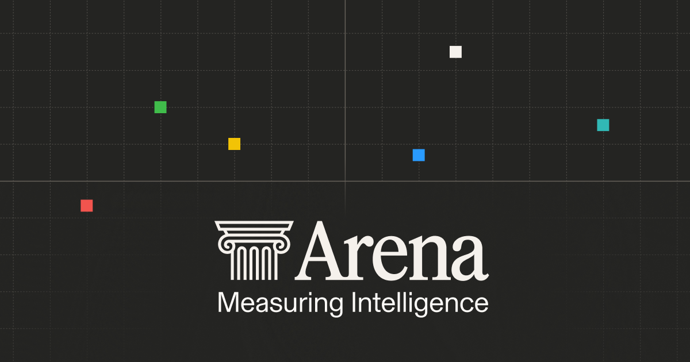
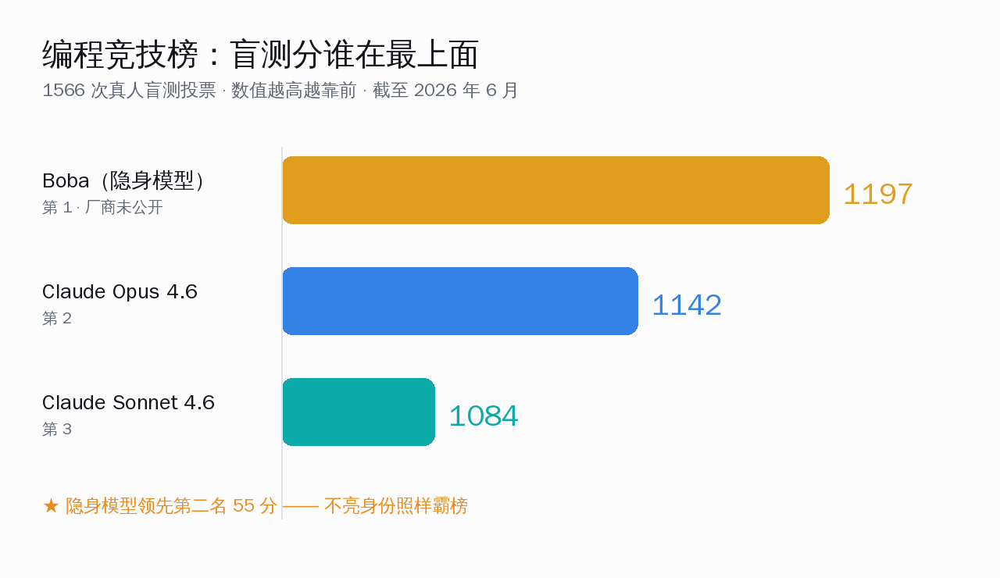
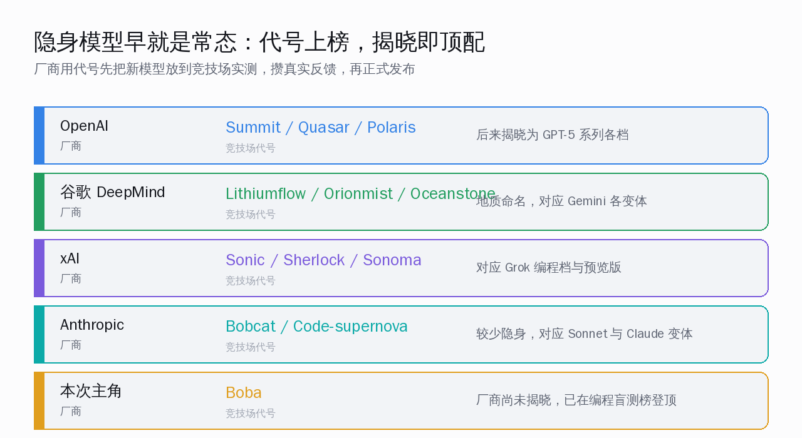
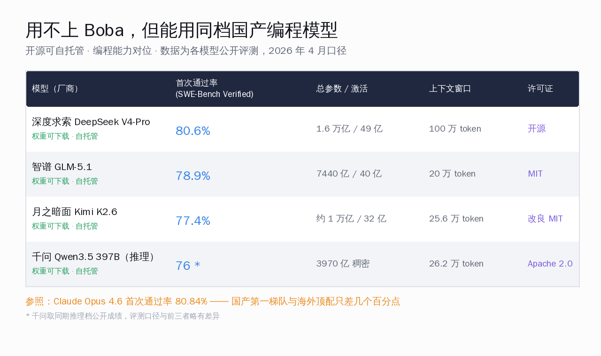
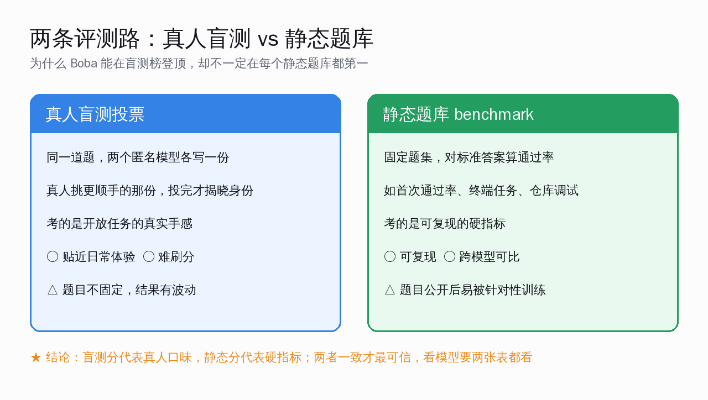

# 一个不亮身份的模型，登顶了编程竞技榜

> 截至 2026 年 6 月，一个名叫 Boba 的匿名模型以盲测分 1197 坐在编程竞技榜最上面，压过 Claude Opus 4.6（1142）和 Claude Sonnet 4.6（1084）。它的厂商至今没有公开。这件事比"谁第一"更值得说的，是一个不亮身份的模型也能霸榜——以及国内开发者该看哪张表，才不会被一个榜单牵着走。

先把本文的核心判断摆明：**Boba 登顶不是某家厂商的胜负新闻，而是"厂商用代号先实测、再公布"已经成为行业常规动作的又一个例证；对国内开发者真正有用的，是把同档国产编程模型放进同一张对位表，再分清盲测投票和静态题库这两条评测路各自能说明什么。** 下面三件事一件件讲清楚。

## Boba 是谁：榜上第一，名字却是个代号

Arena（也就是大家熟知的 LMArena）的编程竞技榜上，排在最前面的不是 Claude，也不是 GPT 或 Gemini，而是一个叫 Boba 的名字。它后面标注的厂商一栏写着"stealth"——隐身，意思是这个模型背后是谁，官方还没揭晓。

这一档的盲测分对照很直观：

几个关键数字，一次说完：

- **盲测分 1197**：Boba 当前编程竞技榜第一，数值越高代表真人盲选时越受青睐；
- **领先 55 分**：第二名 Claude Opus 4.6 是 1142，第三名 Claude Sonnet 4.6 是 1084；
- **1566 次投票**：这个分数来自真人盲测，每次让两个匿名模型答同一道题，真人挑更顺手的那份，投完才揭晓身份。

这张榜单考的不是单一题目，而是七类前端与创意编程任务：React 网页生成（最常被点的一类）、HTML5 画布小游戏、p5.js 创意动画、D3.js 数据可视化、Three.js 三维场景、SVG 插画、Tone.js 旋律编排。每一类都是开放式任务，没有标准答案，谁写得更顺手就投谁。

一个连身份都没公开的模型坐在最上面，第一反应可能是好奇"它到底是谁家的"。但更要紧的一点是：**这件事本身一点都不反常。**

## 隐身模型早就是常态：代号上榜，揭晓即顶配

把时间线拉长就会发现，用代号先上竞技场、攒够真实反馈再正式发布，已经是各大厂商心照不宣的常规打法。

各家的代号还各有偏好：

- **OpenAI** 喜欢用星空词——Summit、Quasar、Polaris，后来一一对上 GPT-5 系列各档（Polaris Alpha 揭晓为 GPT-5.1 的非推理版）；
- **谷歌 DeepMind** 偏爱地质名——Lithiumflow、Orionmist、Oceanstone，对应 Gemini 的不同变体；
- **xAI** 出得勤——Sonic（Grok 编程档）、Sherlock（4.1 与 4.2 预览）、Sonoma；
- **Anthropic** 较少隐身，但也有 Bobcat、Code-supernova 这类代号，揭晓后是 Sonnet 与 Claude 的变体。

为什么要先隐身再亮相？道理其实很朴素：

1. **实战取样**：竞技场上是真人在用真问题投票，比关起门来跑题库更接近真实手感；
2. **边测边调**：拿到大规模真实反馈后，还能再做一轮训练优化，等成熟了再挂正式名字；
3. **节奏掌控**：模型迭代比公关稿快得多，先用代号占个位置，正式发布时再统一对外。

所以 Boba 登顶传递的信号是：**一个不亮身份的模型能坐上编程榜第一，说明厂商隐身实测这套打法已经足够成熟，成熟到代号阶段就能拿出顶配水准。** 揭晓只是时间问题，至于是谁家的，等官方公布即可，不必急着猜。

对国内开发者来说，更实际的问题接着就来了：这个模型现在用不上，那手头能用的国产编程模型，到底排在什么位置？

## 用不上 Boba，但手头能用同档开源编程模型

Boba 还没公开身份、也没开放使用，对日常写代码暂时帮不上忙。但好消息是，国内开源编程模型这一年走得很稳，已经能拿来跟海外顶配掰一掰手腕——而且权重可下载、能自托管。

把第一梯队的几个放进同一张对位表，看得最清楚：

这里用的是 SWE-Bench Verified 的"首次通过率"——给模型一个真实代码仓库的待修问题，看它一次性把问题改对的比例，是目前最贴近真实开发的硬指标之一。几个数字（2026 年 4 月公开评测口径）：

| 模型（厂商） | 首次通过率（SWE-Bench Verified） | 总参数 / 激活 | 上下文窗口 | 许可证 |
|---|---|---|---|---|
| 深度求索 DeepSeek V4-Pro | 80.6% | 1.6 万亿 / 49 亿 | 100 万 token | 开源 |
| 智谱 GLM-5.1 | 78.9% | 7440 亿 / 40 亿 | 20 万 token | MIT |
| 月之暗面 Kimi K2.6 | 77.4% | 约 1 万亿 / 32 亿 | 25.6 万 token | 改良 MIT |
| 千问 Qwen3.5 397B（推理档） | 约 76% | 3970 亿 稠密 | 26.2 万 token | Apache 2.0 |

作为参照，Claude Opus 4.6 同一指标是 80.84%。也就是说，**国产第一梯队和海外顶配在首次通过率上只差几个百分点，DeepSeek V4-Pro 已经追到 80.6%，咬得相当紧。**

如果只看一个数字会失之片面，这几个模型各有自己的长处，按场景选更稳：

- **深度求索 DeepSeek V4-Pro**：首次通过率最高（80.6%），且是这批里唯一带 100 万 token 上下文的，整个代码仓库一次塞进去做重构是它的拿手戏；
- **智谱 GLM-5.1**：许可证最干净（MIT），多语言表现强，适合对合规要求高、要自托管的团队，8 卡 H100 就能跑生产规模；
- **月之暗面 Kimi K2.6**：在更难的 SWE-Bench Pro 上以 58.6% 领先这一档，多步复杂任务靠多智能体协同往往能啃下别人漏掉的难题；
- **千问 Qwen3 系列**：背靠阿里，工具链与国内云的衔接最顺，Apache 2.0 许可证对商用最友好。

把这张表读一遍，结论很清楚：**Boba 用不上不要紧，国产开源编程模型已经在同一档位上，能下载、能自托管、能商用，差距是几个百分点而不是一个量级。** 这是一年来真金白银攒下来的进步。

那么问题又回到评测本身——Boba 在盲测榜第一，是不是就等于它在所有场景都最强？这就要说到第三件事了。

## 盲测投票和静态题库，是两条不同的评测路

很多人看榜单会下意识把"竞技榜第一"和"静态题库跑分第一"画等号，其实这是两条不同的评测路，各自说明的事情并不一样。

两条路的区别，列出来一目了然：

**真人盲测投票（竞技榜）**

- 同一道题，两个匿名模型各写一份，真人挑更顺手的那份，投完才揭晓身份；
- 考的是开放式任务的真实手感，比如"这段 React 页面写得顺不顺、好不好用"；
- 优点是贴近日常体验、难刻意刷分；
- 短板是题目不固定，不同时间段的结果会有波动。

**静态题库（如 SWE-Bench Verified）**

- 固定题集，对着标准答案算通过率，如首次通过率、终端任务完成率、仓库调试成功率；
- 考的是可复现的硬指标，换谁来跑结果都能对得上；
- 优点是可复现、跨模型可比；
- 短板是题目一旦公开，容易被针对性训练"背"出高分。

理解了这层区别，再回头看 Boba 就通透了：**它在盲测榜第一，说明真人在开放编程任务里更愿意选它的输出；但这并不自动等于它在每一个静态题库上都拿第一。** 盲测分代表"真人口味"，静态分代表"硬指标"，两者都重要，但回答的是不同问题。

所以挑模型时，更稳的做法是两张表都看：

1. 先看静态题库，确认它在你关心的任务类型（仓库调试 / 终端操作 / 前端生成）上硬指标够用；
2. 再看竞技榜，确认真人在开放任务里也认可它的实际手感；
3. 两者一致，才是真的可信。

对国产模型也是同一把尺子。前面那张对位表给的是 SWE-Bench Verified 的硬指标，要更全面地判断，还得结合它们在竞技榜上的真人反馈一起看——好在这些模型大多已经进了 Arena 的代码榜单，能查能比。

## 写在最后：一个代号霸榜，反而让我们看清了三件事

回到开头那句话。Boba 登顶编程竞技榜，表面是个"匿名模型第一"的趣闻，往里看却帮我们把三件事看得更清楚：

- **第一，厂商隐身实测早已成熟。** 一个不亮身份的代号能坐上编程榜第一，说明用代号先上场、攒反馈再发布，是各家通行的常规打法，揭晓只是时间问题。
- **第二，国产编程模型已经在同一档位。** 用不上 Boba 没关系，DeepSeek V4-Pro、GLM-5.1、Kimi K2.6、千问 Qwen3 这批开源模型，首次通过率和海外顶配只差几个百分点，还能下载、自托管、商用，这是实打实的底气。
- **第三，看榜要看两张表。** 盲测投票代表真人口味，静态题库代表硬指标，两者一致才最可信——别被任何单一榜单牵着走。

榜单天天在变，今天是 Boba，明天可能就揭晓成某个熟悉的名字，后天又会冒出新的代号。但有一条越来越稳：我们手里能用的好工具，正在变得越来越多、越来越强。国产开源模型这一年追得很扎实，路在前面，越走越宽——一起加油。
