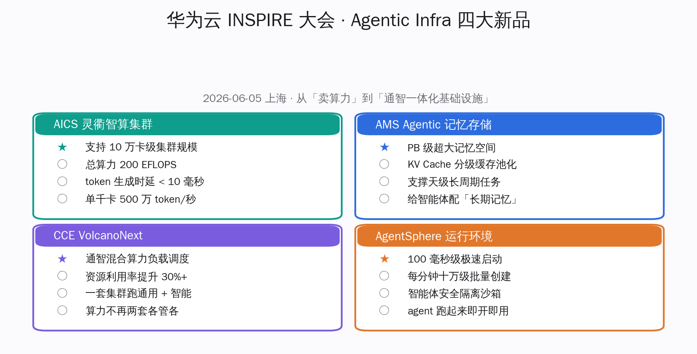
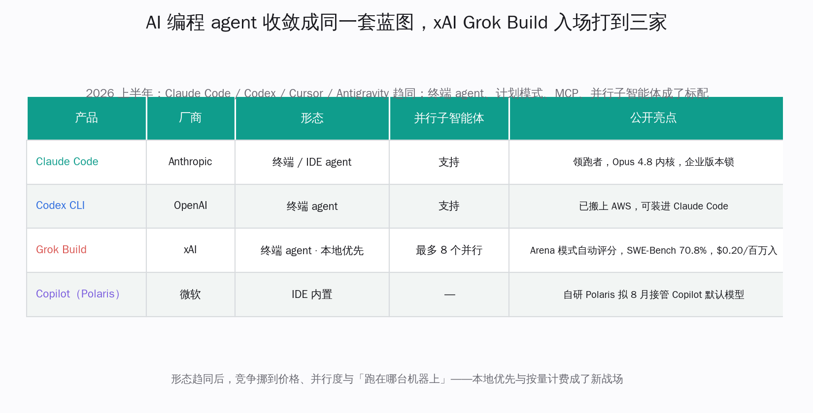
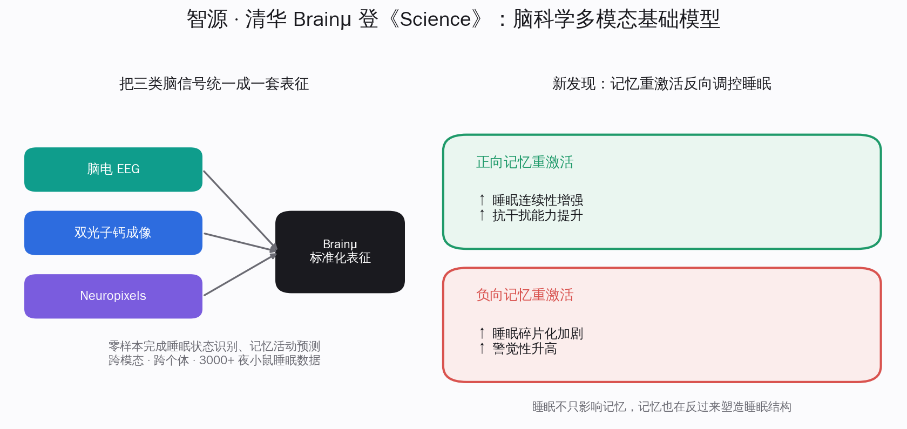
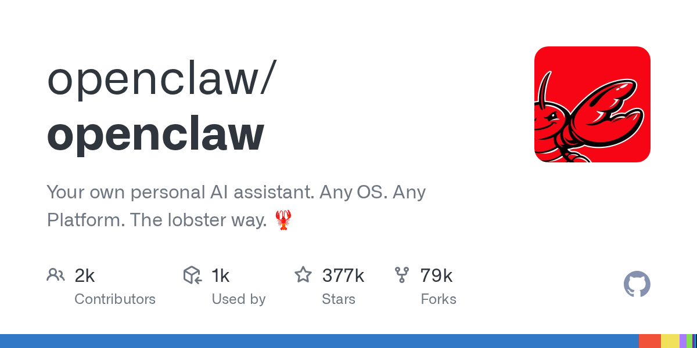
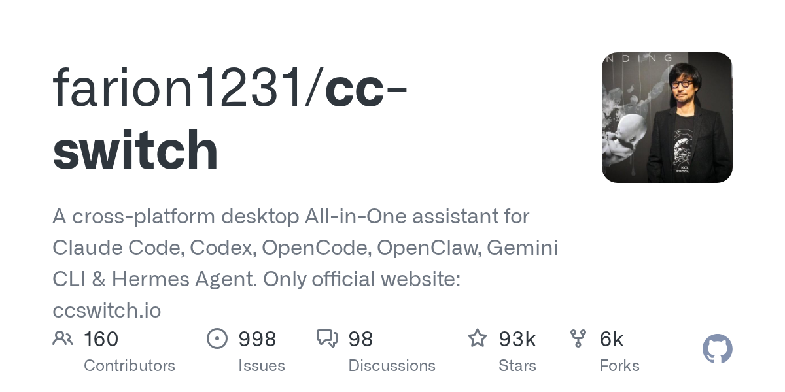
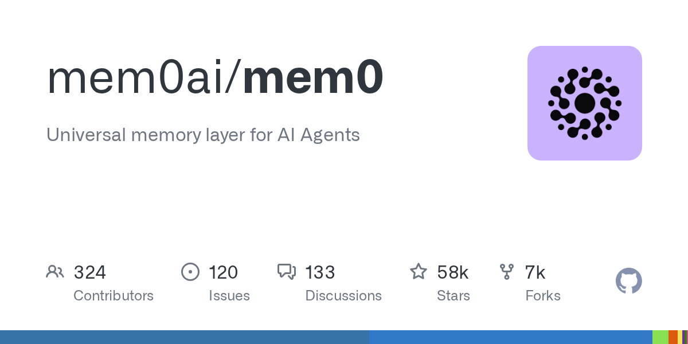
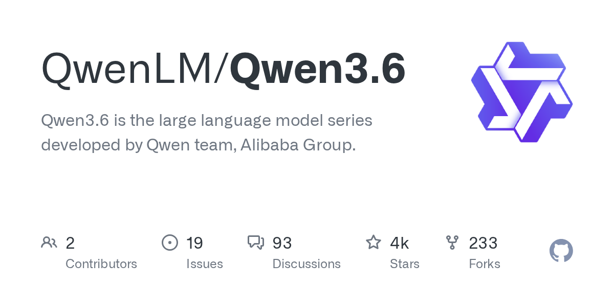

# 华为云搭出 Agentic 算力基础设施 · 马斯克 Grok Build 让编程 agent 三分天下 · 智源脑模型登 Science | AI 日报 | 2026-06-06

## 📋 头版目录

- 🏭 华为云 INSPIRE 大会 6/5 提出 Agentic Infra 新范式，从卖算力转向通智一体化基础设施 → 头条 1
- 🇨🇳 AICS 灵衢智算集群支持 10 万卡级规模、总算力 200 EFLOPS、token 生成时延压到 10 毫秒内 → 头条 1
- 🧠 AMS 记忆存储给智能体配 PB 级长期记忆，AgentSphere 沙箱做到 100 毫秒级启动 → 头条 1
- 🛠 到 6 月初，Claude Code、Codex、Cursor、Antigravity 的编程 agent 形态基本趋同 → 头条 2
- 🛠 马斯克 xAI 的 Grok Build 入场，最多 8 个并行子智能体、本地优先、SWE-Bench 70.8% → 头条 2
- 💰 竞争从「谁更像 agent」挪到价格与并行度，Grok Build 输入价低至每百万词元 0.2 美元 → 头条 2
- 🔬 智源与清华 Brainμ 脑科学多模态模型登《Science》，揭示记忆-睡眠双向调控 → 头条 3
- 🧠 Brainμ 把脑电、双光子钙成像、Neuropixels 统一成一套表征，零样本识别睡眠状态 → 头条 3
- 🇨🇳 阶跃 Step 3.7 Flash 登顶 Artificial Analysis 榜，速度、性价比、端到端三项第一 → 国内 AI
- 🇨🇳 阶跃 Step 3.7 Flash 推理最高约 409 词元/秒，编程能力达头部闭源模型的 97%，权重已开源 → 国内 AI
- 🇨🇳 WPS 笔记正式发布，把 AI 贯穿记录、整理与复用，定位信息入口而非聊天框 → 国内 AI
- 🎙 奥特曼、Dario、哈萨比斯罕见联名，呼吁立法强制筛查合成 DNA 订单 → 名人说
- 🎙 姚顺雨现身，公开回应「腾讯 AI 落后了吗」 → 名人说
- 📰 OpenAI 在 ChatGPT 内测试自助广告，只向免费与 Go 档展示、不影响回答 → 精选要闻
- ⚖️ 微软自研 Polaris 编程模型仍按计划 8 月接管 GitHub Copilot 的默认模型 → 头条 2
- 🏭 英特尔把 Agentic AI 的算力密度做到新高，用 CPU 承接智能体负载 → 快讯
- 🛠 谷歌把 Managed Agents 放进 Gemini API 公开预览，智能体跑在托管 Linux 沙箱里 → 快讯
- 🔥 个人助手 OpenClaw 越过 37.7 万星，仍是个人 AI 助手里最大的开源项目 → GitHub Trending
- 🔥 多智能体切换器 cc-switch 约 9.26 万星，一处管好 Claude Code、Codex、Gemini CLI → GitHub Trending
- 🔥 智能体记忆层 mem0 约 5.78 万星，正好踩中给 agent 配长期记忆的方向 → GitHub Trending
- ⚖️ 苹果 WWDC 6/8、北京智源大会 6/12-13 临近，重做的 Siri 与世界模型是本周看点 → 值得关注

## 🔥 头条深度

### 头条 1 · 华为云 INSPIRE 大会：把「卖算力」升级成「卖一整套能跑智能体的基础设施」

> 来源：新浪财经 [1]，量子位 [2]

6 月 5 日，华为云 INSPIRE 创想者大会在上海开幕，CEO 周跃峰抛出一个判断：智能体时代到来，计算范式正在发生根本性的变化，过去那套「按张卡、按台机器卖算力」的供给方式，已经接不住智能体的需求 [1]。配合这个判断，华为云提出了一套叫 Agentic Infra 的新范式，并一口气发了四款新品。

对国内做智能体的团队来说，这件事的分量不在某一个参数，而在一个转向：基础设施厂商开始把「能不能把智能体高效、持续、安全地跑起来」当成一个整体问题来卖，而不再只卖底下的算力。

#### 头条 1.1 · 四款新品分别补上算力、记忆、调度、运行环境四块

周跃峰这次发布的四款新品，正好对应智能体跑起来要解决的四件事 [1][2]。

- **AICS 灵衢智算集群**管的是算力。它基于大带宽的灵衢网络，支持 10 万卡级的集群规模，总算力达到 200 EFLOPS，并把 token 的生成时延压到了 10 毫秒以内、单千卡的吞吐做到每秒 500 万词元。对一个要长时间连续推理的智能体，时延和吞吐比峰值算力更要紧。
- **AMS Agentic 记忆存储**管的是记忆。它提供 PB 级的超大记忆空间，用 KV Cache 分级缓存池化，让智能体能撑起以天计的长周期任务——相当于给智能体配了一块够大、够快的「长期记忆」，而不必每次重新读一遍上下文。
- **CCE VolcanoNext**管的是调度。它把通用算力和智能算力的负载混在一套集群里统一调度，官方称资源利用率能提升三成以上，让企业不必为两类任务各备一套机器。
- **AgentSphere**管的是运行环境。它做到 100 毫秒级的极速启动、每分钟十万级的批量创建，给智能体一个安全隔离、即开即用的沙箱。

把这四块拼齐，传递的信号很清楚：跑智能体不再只是「找张卡推理」，而是算力、记忆、调度、运行环境一整套都得跟上。

#### 头条 1.2 · 「长期记忆」被单独拎出来，正卡在个人助手最缺的那一环

四款里最值得国内开发者多看一眼的是 AMS 记忆存储。过去一年，个人 AI 助手、企业智能体最常被吐槽的不是不够聪明，而是「记不住」——一个长任务做到一半，上下文一满就开始丢信息。华为云把「给智能体配长期记忆」单独做成一款基础设施产品，等于承认了这是当前智能体落到实用时绕不过去的一道坎。

这个判断和今天 GitHub 上的热度也对得上：专做智能体记忆层的开源项目 mem0 眼下已有约 5.78 万星 [16]。一边是云厂商把记忆做进基础设施，一边是开源社区把记忆做成可自托管的中间件，两头都在补同一块短板，说明「让智能体记得住」正从一个研究话题变成一类要交付的能力。

### 头条 2 · 编程 agent 的形态之争基本结束，Grok Build 入场把竞争推向价格与并行度

> 来源：The New Stack [4]，DevOps.com [3]，CNBC [5]

到 6 月初，关于「AI 编程工具到底该长什么样」的争论基本上有了答案。过去半年，Claude Code、Codex、Cursor、Antigravity 这四款定义了这一品类的产品，悄悄地达成了一致：都是能在终端或编辑器里自己干活的智能体，都有计划模式、都支持 MCP、都能派生并行的子智能体 [4]。形态趋同之后，新入场者不再纠结「像不像 agent」，而是直接在价格、并行度和「跑在哪台机器上」这几件事上比拼。

#### 头条 2.1 · 马斯克的 Grok Build 用并行和本地优先切入

最新的一个入场者是马斯克 xAI 的 Grok Build [3]。它是一个跑在终端里的编程智能体，最大的特点是能同时开最多 8 个并行子智能体，每个都走「计划—检索—构建」三步；还带一个叫 Arena 的模式，会先给几路相互竞争的产出自动打分排名，开发者再回头看。它在 SWE-Bench Verified 上拿到 70.8% 的成绩，输入侧价格低至每百万词元 0.2 美元，而且强调本地优先——源码不传回 xAI 的服务器。

把这些特点摆在一起会发现，Grok Build 没有去拼「我更聪明」，而是拼「我能同时干更多、更便宜、还更放心地留在你机器上」。这正好印证了形态收敛之后竞争的新走向：当大家长得越来越像，价格、并行度和数据是否离开本机，就成了真正的差异点。

#### 头条 2.2 · 微软用自研 Polaris 从默认模型这一层切进来

微软走的是另一个方向。[跟进] 此前 Build 大会上亮出的自研编程模型 Polaris，目前仍按计划从 8 月起接管 GitHub Copilot 的默认模型，把原来的内核替下来 [5]。和 Grok Build 对照很有意思：xAI 是再造一个新工具，微软则是用自研模型去换掉一个已经装在上亿开发者机器里的工具的内核——工具不变，底下的模型悄悄换一遍。

对每天在用这些工具的人，结论是务实的——编程 agent 的「形态」基本定型了，接下来一段时间值得盯的不是又冒出什么新形态，而是同一套形态下，谁的价格更低、谁的并行更稳、谁让你更放心地把代码留在本地。今天另有专题对这几款工具的路线差异做了更细的拆解，可一并参看「云端一发即走的编程 agent，和 Claude Code 是两条路」。

### 头条 3 · 智源与清华的脑科学模型 Brainμ 登《Science》，国产基础模型第一次撑起一篇神经科学正刊

> 来源：量子位 [6]，网易科技 [7]

6 月 4 日，北京智源人工智能研究院与清华大学的合作成果登上《Science》，论文题为《记忆重激活驱动经验依赖的睡眠自适应调节》，由智源 Brainμ 模型团队负责人雷博与清华大学生命学院钟毅教授共同通讯 [6][7]。这件事有两层看点：一层是科学发现本身，另一层是支撑它的，是一款国产的多模态基础模型。

科学发现这层，研究第一次证实了记忆和睡眠是双向作用的：睡眠中的记忆重激活不只受睡眠影响，也会反过来调控睡眠结构——负向记忆的重激活会加剧睡眠碎片化、抬高警觉性，正向记忆的重激活则有助于增强睡眠的连续性和抗干扰能力 [7]。这也给抑郁、焦虑相关的睡眠障碍研究提供了新的切入角度。

模型这层更值得 AI 圈留意。Brainμ 是智源自研的脑科学多模态基础模型，它能把脑电（EEG）、双光子钙成像、Neuropixels 这几类原本格式各异的神经信号，统一编码成一套标准化的表征，从而实现跨模态、跨个体的联合分析 [7]。在这项研究里，它在零样本的条件下就完成了睡眠状态识别、记忆活动预测等任务，处理了 3000 多个夜晚的小鼠睡眠数据，并展现出跨品系、跨任务的泛化能力。

把基础模型那套「统一表征、零样本迁移」的思路搬到神经科学，让一个模型同时接住多种信号、多种任务，是国产模型在 AI for Science 方向上一个扎实的落点。昨天那条让助手学会「边睡边记」的产品更新还停在体验层，今天这篇则是从真实的脑信号里，把「记忆与睡眠」的相互作用机制讲清楚。

## ⚡ 快讯速览

- **英特尔把 Agentic AI 的算力密度做到新高**：面向智能体推理这类新负载，英特尔展示了用 CPU 承接 Agentic AI 工作的方案，把单位空间里的 AI 算力密度往上又推了一截 [10]。在大家默认「智能体就该上 GPU」的当下，这条提醒的是：智能体的负载结构和训练不一样，CPU 在某些推理与编排环节仍有性价比空间，值得做部署选型时多算一笔账。

- **谷歌把 Managed Agents 放进 Gemini API 公开预览**：谷歌在 Gemini API 里上线了 Managed Agents 的公开预览，让开发者能直接构建、部署自主且有状态的智能体，并让它们跑在谷歌托管的、安全隔离的 Linux 沙箱里 [22]。这条和今天华为云 AgentSphere、xAI Grok Build 的方向其实是一回事——大厂都在抢着提供「让智能体安全跑起来的现成运行环境」，开发者不必再自己搭一套隔离沙箱。

- **DeepSeek V4 正式版仍在等信号 [跟进]**：DeepSeek V4 目前仍是 4 月底放出的预览版，官方没有给正式版的确切日期，「本月转正」属于外界推测 [18]。可写的真实增量是 V4-Flash 已经登上 OpenRouter 全球调用榜前列、并宣布 API 永久降价；正式版到底哪天官宣，还要等 DeepSeek 自己给信号。

## 🎙 名人说 & X 热议

**奥特曼、Dario、哈萨比斯罕见站到一起：合成 DNA 该立法筛查了。** 三位平时针锋相对的 AI 公司掌门人——OpenAI 的 Sam Altman、Anthropic 的 Dario Amodei、Google DeepMind 的 Demis Hassabis——联名发了一封公开信，呼吁美国国会立法，强制对合成 DNA 的订单做筛查 [11]。他们担心的是：合成 DNA 技术已经从专门实验室走到了网上低价下单，每个碱基对低到 0.07 至 0.09 美元，理论上可被用来重建危险病原体；而行业从 2009 年起靠的还是自愿筛查，三分之二以上的基因合成公司甚至不是相关行业联盟的成员。他们提出三条具体措施：筛查 DNA 序列中的可疑模式、核验客户身份、保留可追溯的记录。值得记下的是这个姿态本身——几家最激烈的竞争对手愿意为同一件事联名，说明这道存在了二十年的安全缺口，已经被他们看得比彼此的竞争更重。这封信明确强调，这不是在渲染 AI 威胁，而是在补一个早就该补的真实漏洞。

**姚顺雨回应「腾讯 AI 落后了吗」。** 在 OpenAI 工作、以 Agent 研究知名的姚顺雨公开现身，正面回应了外界关于「腾讯 AI 是不是落后了」的讨论 [12]。这类来自一线研究者的判断，比公司公关口径更有参考价值——它提醒关注国内大厂 AI 进展的人，评估一家公司的位置，不能只看发布会节奏，还要看它在研究人才和实际能力上的底子。

## 📰 精选要闻

- 🔴 **华为云提出 Agentic Infra 新范式，把智能体基础设施当成一个整体问题来卖**：除了上面头条拆过的四款新品，华为云这次更想立住的是「Agentic Infra」这个范式——它把「高效的词元工厂 + 持续学习 + 通智一体化调度 + 安全自治」打包成一套对智能体友好的基础设施定义 [1]。同时大会宣布上线智慧医疗、具身智能、智能制造、科学计算四个「行业 AI 梦工厂」专区。对国内企业，这给「上智能体到底要准备什么样的基础设施」提供了一个相对完整的参照系：不止是买算力，还要把记忆、调度、运行环境一并考虑进去。

- 🟡 **OpenAI 给 ChatGPT 引入广告，划清「答案不受广告影响」的边界**：OpenAI 公布了在 ChatGPT 内测试广告的做法——广告只向免费档和 ChatGPT Go 档展示，Plus、Team、企业版保持无广告；广告不影响 ChatGPT 给出的回答，出现时清楚标注为赞助内容，广告主拿不到用户的聊天、历史与记忆，只拿到聚合的展示与点击数据 [13]。放在行业层面，这是问答式 AI 的免费体验第一次开始靠广告来支撑，它把「自然回答」和「赞助内容」做了明确的视觉分离。这条边界划得稳不稳，会成为后来者做问答类商业化时反复参照的样本。

- 🔵 **CVPR 2026 上，英伟达、特斯拉、Waymo 一起听中国公司讲物理 AI**：在本周的 CVPR 2026 现场，物理 AI（机器人、自动驾驶、智慧基础设施）成了一条主线，多家中国公司在相关方向上做了分享，英伟达、特斯拉、Waymo 等都在听众席上 [21]。它和昨天 CVPR「重估深度学习标准件」的看点是同一届会的两个侧面——一边在重写底层默认设计，一边在把模型推向真实世界的物理交互。

## 🇨🇳 国内 AI 观察

- **阶跃 Step 3.7 Flash 登顶 Artificial Analysis 榜，速度、性价比、端到端三项第一**：阶跃星辰的 Step 3.7 Flash 在第三方评测平台 Artificial Analysis 上拿到速度、性价比、端到端三项第一 [8]。具体的数字很能说明问题：推理速度最高约每秒 409 词元，单任务成本约为同档头部闭源旗舰的九分之一，编程能力达到头部闭源模型的 97%；在 OpenRouter 上输入每百万词元 0.2 美元、输出 1.15 美元，热度稳居全球第二，并已在 HuggingFace 开源。它支持多模态理解、工具编排和多智能体集群，主打企业级智能体场景。对国内开发者，这是又一个「够快、够便宜、还开源」的可选项，正踩在智能体规模化要省钱、省时延的需求上。

- **WPS 笔记正式发布，把 AI 做成信息入口而不是聊天框**：金山办公正式发布 WPS 笔记，把 AI 贯穿到记录、整理与复用的全过程 [9]。它给出的判断很直接——AI 笔记不该是又一个聊天框，而应是一个信息入口。对每天在用文档工具的人，这意味着 AI 不再只是侧边栏里一个问答助手，而是把「随手记下来的东西怎么自动整理、之后又怎么被找回来用上」这条日常需求接了起来，是 AI 落到办公场景里一个相当务实的形态。

- **国产模型在「快」和「省」上集体发力**：从阶跃 Step 3.7 Flash 的每秒约 409 词元，到华为云 AMS 把智能体记忆做成基础设施，国内这一周的几条进展放在一起看，指向一个共同方向——大家不再只比单点跑分，而是在真实用起来时最吃成本的「时延」和「记忆」上下功夫。这是国产 AI 从「能用」往「用得起、用得久」走的一个务实信号。

## 📦 GitHub Trending

> 以下星标为发布当日查询所得。

- 🔴 **openclaw/openclaw（约 37.7 万星）**：跨任意操作系统帮你把日常事务真正办完的开源个人助手，仍是个人 AI 助手赛道里最大的项目 [14]。在「给智能体配长期记忆、配运行环境」成为今天主线的背景下，它那张「能装、能常驻、能办完活」的能力清单，恰好是华为云 AMS、mem0 这些新基础设施要去填实的需求样板。

- 🔴 **farion1231/cc-switch（约 9.26 万星）**：一个跨平台的桌面工具，把 Claude Code、Codex、OpenCode、OpenClaw、Gemini CLI、Hermes Agent 这些命令行智能体集中到一处管理、一键切换 [15]。它的走红正好印证了头条二里的判断——当编程 agent 形态趋同、一个人手里同时装好几款时，「在它们之间顺滑切换」本身就成了一个真实需求。

- 🟡 **mem0ai/mem0（约 5.78 万星）**：面向 AI 智能体的通用记忆层，让智能体能跨会话记住用户与上下文 [16]。它和华为云这次把记忆做进基础设施是同一股潮流的两个侧面——一个走开源自托管，一个走云上交付，都在补「智能体记不住」这块短板。

- 🟡 **QwenLM/Qwen3.6（约 3500 星）**：阿里千问团队 Qwen3.6 系列的官方仓库，6 月 3 日仍在更新 [17]。星标还不算高，但作为国产开源旗舰系列的承载仓库，值得放进观察名单，看后续会不会随新版本放出而快速上量。

## 🛠 AI Coding 工具动态

- **Grok Build 把「并行 + 本地优先」做成卖点**：xAI 的 Grok Build 是这一周最值得开发者上手试一试的新编程智能体 [3]。它能同时跑最多 8 个并行子智能体，自带 Arena 模式给多路产出自动打分，且强调源码不离开本机。对喜欢一次铺开多条思路、又在意代码不外传的人，这两点都正中需求。要留意的是它目前主要面向 SuperGrok 等付费档，想试的人先看清楚自己的订阅是否覆盖。

- **cc-switch 让「多款编程 agent 并存」变得好管**：当一个人手里同时装着 Claude Code、Codex、Gemini CLI，来回切换、各自配置就成了麻烦事。cc-switch 把这些命令行智能体集中到一个桌面工具里统一管理、一键切换 [15]，是形态趋同之后冒出来的一类「粘合」工具。它的流行本身说明：编程 agent 的竞争已经从单款好不好用，外溢到了「一堆放在一起怎么协同」。

- **编程 agent 的下一仗在价格与计费**：把 Grok Build 低至 0.2 美元的输入价、阶跃 Step 3.7 Flash 的低成本、微软用自研 Polaris 换 Copilot 内核放在一起看，方向是一致的——形态定型后，开发者选工具会越来越看「同样的活，谁更便宜、计费更透明」。这对个人开发者是好事：能力差距在收窄，价格战在打开。

## 🔭 值得关注

- **苹果 WWDC（6/8）**：重做成真正能对话、带上下文和记忆的 Siri，以及可能的独立助手 App、系统级「搜索或提问」手势，是开发者本周最大的悬念。会前消息密集但都未官宣，端侧模型与第三方模型如何搭配，6 月 8 日的主题演讲见分晓 [20]。

- **北京智源大会（6/12-13）[跟进]**：会期临近，真正值得盯的新看点是今天 Brainμ 登上《Science》之后，智源在 AI for Science 这条方向上还会拿出什么；以及是否有国产模型借场发布。世界模型、具身智能、AI 自我进化仍是今年主线 [19]。

- **智能体的基础设施方向**：从华为云把算力、记忆、调度、运行环境打包成 Agentic Infra，到谷歌 Managed Agents、mem0、cc-switch 这些围绕智能体的运行环境与中间件走红，「智能体要真正干活，底层得换一套基础设施」正在成为一个独立且清晰的方向。它会不会形成几套被广泛采用的标准做法，值得持续观察。

- **国产模型的「快与省」**：阶跃 Step 3.7 Flash 在速度和性价比上拿下第三方榜单第一，叠加多家国产模型在时延、成本上的发力，国产开源在「真实调用」这一侧的优势还在扩大。这一优势是否会进一步转化为海外开发者的实际采用，值得接着看。

## ✍ 编辑说

- **华为云 Agentic Infra / 关注**：这次发布真正的信号不是某个参数，而是基础设施厂商开始把「跑智能体」当成算力、记忆、调度、运行环境的一整套问题来卖。如果你在企业里负责 AI 基础设施选型，今天读完这条，对你接下来一年怎么规划「智能体要落在什么样的基础设施上」会有直接参考——别只盯着算力，记忆和运行环境同样关键。

- **编程 agent 形态定型 / 推荐**：到 6 月初，编程 agent 长什么样基本有了共识，竞争挪到了价格、并行度和数据是否留在本地。如果你每天靠这类工具写代码，今天该记住的判断是：往后选工具不必再追新形态，而要比同一形态下谁更便宜、并行更稳、更让你放心把代码留在本机——Grok Build、Codex、Claude Code 都值得按这三条重新比一遍。

- **Brainμ 登 Science / 做技术储备**：一款国产多模态基础模型能撑起一篇神经科学正刊，说明「统一表征 + 零样本迁移」这套打法正在走出语言和图像，进入更专业的科学领域。如果你关注 AI for Science，今天把 Brainμ 记下来：它代表的不只是一个脑科学成果，而是国产基础模型在垂直科学方向上一种可复制的路径。

- **三位 CEO 联名管 DNA / 关注**：最激烈的竞争对手为生物安全联名上书，是个明确的信号——AI 能力外溢到生物领域的风险，已经被一线机构看得足够重。如果你做的产品涉及生物、医药或任何高风险知识的生成，今天该记住的是：相关的合规与筛查要求，很可能比你预期的来得更快。

## 🔗 引用链接

- [1] 新浪财经：华为云发布系列 Agentic AI 新品，周跃峰谈软硬芯协同: https://finance.sina.com.cn/tech/shenji/2026-06-05/doc-iniaikav9777618.shtml
- [2] 量子位：华为云发布 Agentic AI 系列新品，打造智能时代「硅基黑土地」: https://www.qbitai.com/2026/06/431027.html
- [3] DevOps.com：xAI 携 Grok Build 入局编程智能体: https://devops.com/xai-enters-the-coding-agent-race-with-grok-build/
- [4] The New Stack：Cursor、Claude Code 与 Codex 正合并成一套 AI 编程栈: https://thenewstack.io/ai-coding-tool-stack/
- [5] CNBC：微软与谷歌在 AI 编程模型上叫板 Anthropic 与 OpenAI: https://www.cnbc.com/2026/06/01/microsoft-and-google-take-on-anthropic-and-openai-in-ai-coding-models.html
- [6] 量子位：智源&清华合作成果登上 Science，脑科学多模态基础模型 Brainμ: https://www.qbitai.com/2026/06/431033.html
- [7] 网易科技：智源与清华研究成果登上《Science》，Brainμ 助力揭示「记忆-睡眠」机制: https://www.163.com/tech/article/KUM0D29C00098IEO.html
- [8] 量子位：阶跃 Step 3.7 Flash 登顶 AA 榜，速度、性价比、端到端三项第一: https://www.qbitai.com/2026/06/429294.html
- [9] 量子位：WPS 笔记正式发布，AI 贯穿记录、整理与复用全过程: https://www.qbitai.com/2026/06/431014.html
- [10] 量子位：有人靠 CPU 把 AI 算力密度卷到了新高度: https://www.qbitai.com/2026/06/431045.html
- [11] 量子位：奥特曼、Dario、哈萨比斯同仇敌忾，合成 DNA 得查了: https://www.qbitai.com/2026/06/429711.html
- [12] 量子位：姚顺雨现身，公开回应腾讯 AI 落后了吗: https://www.qbitai.com/2026/06/429285.html
- [13] OpenAI：在 ChatGPT 中测试广告: https://openai.com/index/testing-ads-in-chatgpt/
- [14] GitHub：openclaw/openclaw: https://github.com/openclaw/openclaw
- [15] GitHub：farion1231/cc-switch: https://github.com/farion1231/cc-switch
- [16] GitHub：mem0ai/mem0: https://github.com/mem0ai/mem0
- [17] GitHub：QwenLM/Qwen3.6: https://github.com/QwenLM/Qwen3.6
- [18] DeepSeek 官方新闻：V4 预览版: https://api-docs.deepseek.com/news/news260424
- [19] 北京智源大会 2026 官网: https://2026.baai.ac.cn/
- [20] Neowin：WWDC 2026 前瞻汇总: https://www.neowin.net/news/wwdc-2026-here-is-everything-apple-is-expected-to-announce/
- [21] 量子位：CVPR 2026，英伟达特斯拉 Waymo 一块听中国公司讲物理 AI: https://www.qbitai.com/2026/06/429130.html
- [22] 谷歌 Gemini API 更新日志：Managed Agents 公开预览: https://ai.google.dev/gemini-api/docs/changelog
