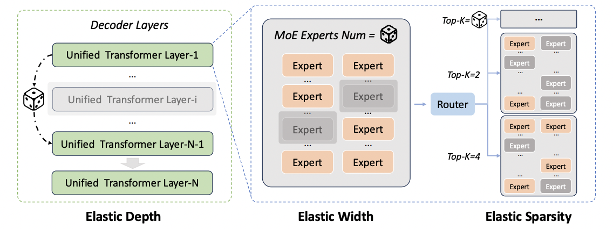
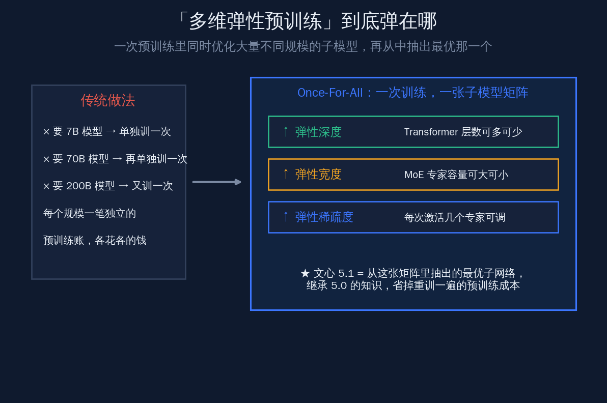
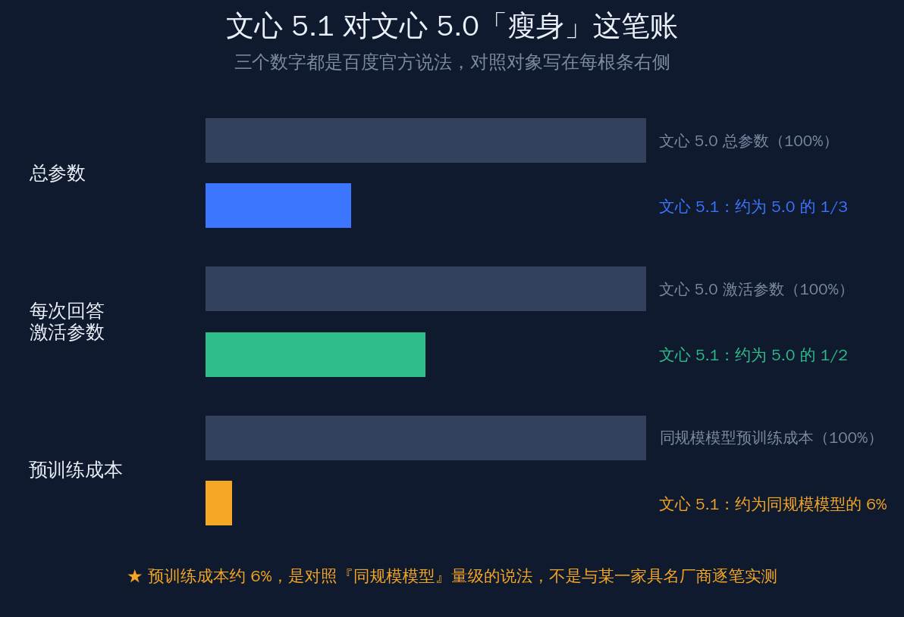
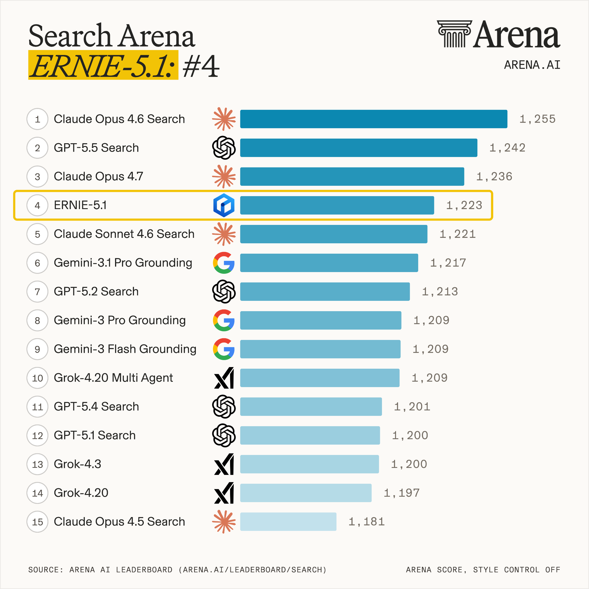
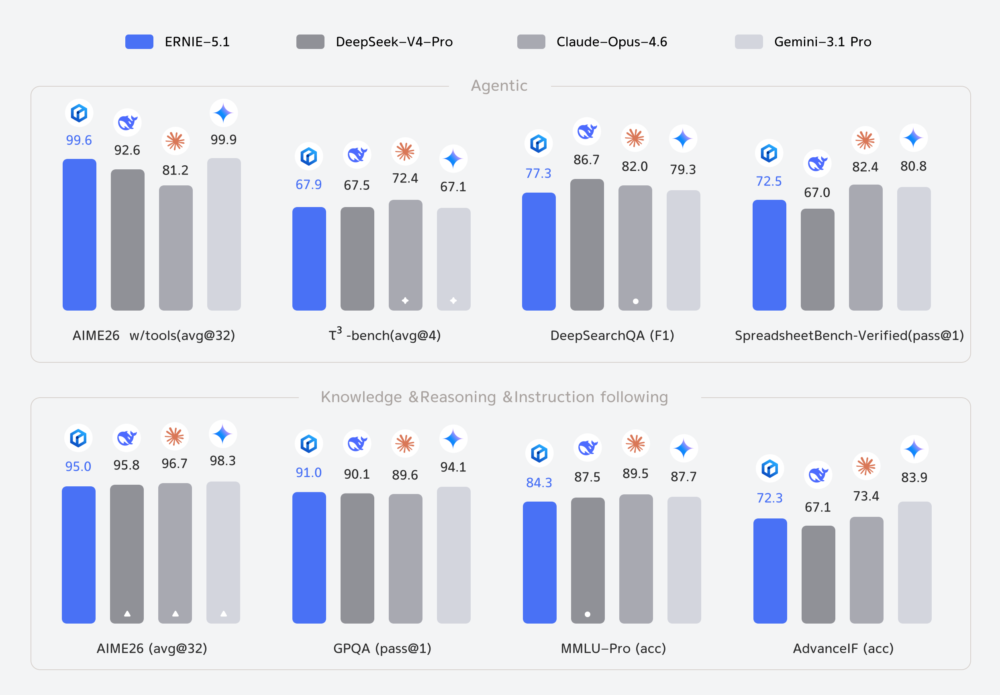

# 文心 5.1 用 6% 成本逼近领先的国产大模型

5 月 9 日，百度正式发布新一代基础大模型文心 5.1（ERNIE 5.1）。发布稿里最抓眼的不是某个榜单名次，而是一个数字：这一代模型只用了业界同规模模型约 6% 的预训练成本，就把基础能力做到了同规模段位的领先水平。

这句话值得拆开看。**国产大模型这两年比的早就不只是「谁的分高」，而是「同样一档能力，谁花的钱更少」**——文心 5.1 把答案押在了一条叫「多维弹性预训练」的技术路线上。本文想回答四件事：6% 的成本到底省在哪、这笔账是怎么算出来的、登顶搜索榜和超过 DeepSeek-V4-Pro 含金量几何、以及训练效率这条线上海外的 GPT、Claude、Gemini 在做什么。先把结论放在前面：**文心 5.1 真正的看点不是榜单名次，而是它把「训练一代大模型」这件事的单位成本，结结实实压下来了一个量级。**

## 6% 是百度官方说法，先把口径说清楚

写之前先把一件事讲明白，免得后面每个数字都要打折扣读：**「6% 预训练成本」是百度官方在发布博客里给出的说法，不是第三方独立实测的结果。**

百度官方博客（ernie.baidu.com）原文的表述是，文心 5.1「仅使用业界同规模模型约 6% 的预训练成本」，达到了同模型规模下的领先基础性能。量子位等多家国内媒体当日跟进时，引用的也是同一句官方口径。

这里有两个需要读者自己拎清楚的限定词：

- **「约 6%」**——是个约数，不是精确到小数点的实测数；
- **「同规模模型」**——是一个量级上的对照，不是与某一家具名厂商（比如某个具体的海外模型）逐笔账目核对出来的。

把口径摆正之后，6% 这个数字依然站得住——因为它背后是一套讲得通的技术机制，而不是一句空泛的营销话。下面就把这套机制讲清楚。

## 多维弹性预训练，到底弹在哪

文心 5.1 的核心技术叫**多维弹性预训练**，底层是百度自研的一套 Once-For-All 弹性训练框架。一句话概括它干的事：**不再为每一种规模的模型单独训练一次，而是在一次预训练里同时优化一大批不同规模的子模型，最后从这一批里抽出最优的那一个。**

要理解它的价值，得先看传统做法贵在哪。

### 传统做法：每个规模重训一遍，各花各的钱

按以往的常规路线，如果你想要一个小一些的模型给端侧用、一个中等的给通用场景、一个超大的冲榜，往往就得分别从头训练三次。每一次都是一笔独立的预训练账单，算力、数据、时间各算各的。模型规模越多，重复投入就越多。

### Once-For-All：一次训练，得到一张子模型矩阵

百度这套框架换了个思路。它在**一次**预训练过程里，通过动态采样机制，同时优化大量深度不同、专家容量不同、激活稀疏度不同的子模型，构造出一张覆盖多种参数规模与算力预算的「子模型矩阵」。

按官方的说法，这张矩阵在三个维度上都可以弹性伸缩：

- **弹性深度**——调整有多少层 Transformer 参与计算；
- **弹性宽度**——调整 MoE（混合专家）层里用多少专家容量；
- **弹性稀疏度**——调整每次推理激活几个专家。

文心 5.1 就是从这张矩阵里抽出来的「最优子网络」。它继承了上一代文心 5.0 已经学到的知识，等于站在 5.0 的肩膀上做了一次精挑细选的瘦身，而不是从一张白纸重新训起。**这就是 6% 成本的来路：省掉的，正是「为了这一档能力，本来要从头重训一遍」的那笔大钱。**

这里还能多读出一层意思。Once-For-All 这套思路在学界并不算全新概念——「一次训练、多处复用」的弹性网络早有研究铺垫，难点从来不在「想不想得到」，而在「能不能在万亿参数、稀疏 MoE 的真实大模型上把它跑稳、跑出效果」。文心 5.1 的价值，恰恰是把这套思路从论文规模推到了旗舰大模型规模，并交出了可对外公布的能力成绩单。

需要补一句诚实话：官方博客对这套框架给出的是机制层面的描述，**具体到「6% 是怎么逐项算出来的」这一步，官方并没有公布细账。** 所以更准确的读法是——技术路线讲得通、方向可信，但精确的成本拆解仍以官方口径为准。后续如果有完整的技术报告或第三方复现，会是更硬的检验。

## 6% 这笔账，配着「瘦身」一起看才完整

光说成本省了 94%，听起来容易过于戏剧化。把它和文心 5.1 相对上一代的「瘦身」数字放在一起，整笔账才完整、才不容易被一句话带偏。

百度官方给出的三组对照是：

| 维度 | 文心 5.0 | 文心 5.1（官方说法） |
|---|---|---|
| 总参数 | 基准（100%） | 约为 5.0 的 1/3 |
| 每次回答激活参数 | 基准（100%） | 约为 5.0 的 1/2 |
| 预训练成本 | —— | 约为同规模模型的 6% |

几个数字之间的逻辑是自洽的：

- **总参数压到约 1/3**——模型整体变小，存储和训练的盘子小了一圈；
- **激活参数压到约 1/2**——每次回答真正参与计算的部分减半，直接关系到推理时的算力开销；
- **预训练成本约 6%**——靠的不只是模型变小，更是靠 Once-For-All 框架免去了「为这一档能力重训一遍」的环节。

作为参照，上一代文心 5.0 是一个总参数达到 2.4 万亿、采用稀疏 MoE 架构、每次推理只激活很小一部分参数的超大模型。文心 5.1 在继承它能力的前提下做到上面这套瘦身，**等于把「训练一代旗舰模型」的账单，从「数亿元」这个量级往「数千万元」量级压——这是国内大模型把训练效率当成第一竞争力的一个清晰信号。**

## 搜索榜国内第一，含金量看「测什么、怎么测」

成本压下来，能力没掉队，才算这条路走通了。文心 5.1 在两个方向给出了成绩单：一个是 LMArena 搜索榜，一个是 Agent（智能体）能力。逐个看含金量。

### LMArena 搜索榜：1223 分，全球第四、国内第一

文心 5.1 在 LMArena 的搜索排行榜（Search Arena）上拿到 1223 分，位居全球第四、国内第一，是这张榜单上唯一上榜的国产模型。

这张榜的测法值得说一句。LMArena（前身即广为人知的大模型竞技场）走的是**真人盲测对战**的路子：用户提出问题，两个匿名模型各给一份回答，用户投票选更好的那个，最后用类似国际象棋 Elo 的算法把胜负折算成分数排名。它衡量的不是某道标准化考题的对错，而是**真实用户在真实提问下更愿意选谁的回答**。

搜索榜则进一步聚焦在「带联网搜索的问答」这个场景——模型要先检索、再组织信息、最后给出靠谱回答。这恰恰是百度的主场：文心背后接着百度自家的搜索数据与检索能力，在中文搜索问答上本就有长期积累。**在这样一张偏向真实使用偏好的榜单上，国内第一、全球第四，是一个扎实的位置**，比单看某个标准化基准分数更能说明它在「日常用得上」这件事上的水平。

也别把这个名次读成「全面第一」。搜索榜衡量的是搜索问答这一个细分场景，全球前三仍是几家头部闭源模型；文心 5.1 的位置是「这条细分赛道上国产最靠前」，把锚点定准了，比一句笼统的「登顶」更经得起推敲。

要诚实的一点是：竞技场类榜单会随时间和投票样本变化，分数和名次是某一时间窗口的快照，不是一锤定音的恒定结论。

### Agent 能力：在两个基准上超过 DeepSeek-V4-Pro

另一条线是智能体能力。按百度官方博客的说法，文心 5.1 在 **τ³-bench** 和 **SpreadsheetBench-Verified** 这两个评测任务上超过了 DeepSeek-V4-Pro，整体智能体能力接近领先的闭源模型。

这两个基准测的是什么，正好对应了 Agent 最实在的两类活儿：

- **τ³-bench**——偏向多轮工具调用、按任务流程把事情办成的能力，考的是「会不会用工具、能不能把一件多步骤的事做完」；
- **SpreadsheetBench-Verified**——偏向表格类任务，考的是在结构化数据里读、算、填的准确度，是办公场景里很高频的一类需求。

一个细节值得点出来：**量子位当日的报道转述了「Agent 能力超过 DeepSeek-V4-Pro」这一句，但没有点出具体是哪两个基准；具体到 τ³-bench 和 SpreadsheetBench-Verified 这两个名字，是百度官方博客里写明的。** 看国产模型对位 DeepSeek 这种话题度极高的对比时，把「在哪个基准上超过」核对清楚，比记住一句「超过了」更有用——因为它告诉你这个领先是落在工具调用和表格任务上，而不是泛泛而谈的「全面超越」。

把两条线合起来看：**文心 5.1 在「真人更爱选谁」的搜索问答上拿到国内第一，在「会不会办事」的智能体任务上越过 DeepSeek-V4-Pro 的两个具体基准——成本压下去的同时，能力站在了一线段位，这才是 6% 这个数字真正的分量所在。**

## 训练效率这条线，全球前沿团队都在拼

把文心 5.1 放到全球坐标系里，会发现「用更少的算力训出更强的模型」并不是某一家的孤军——这恰恰是 2026 年前沿模型团队共同的主题。理解了这一点，才能看清文心 5.1 走的是一条主流且正确的路。

国外团队在这条线上，发力点大致分两类：

- **复用已有投入**——不从零训练，而是在已有大模型基础上做压缩、增长、复用，把「沉没的算力」尽可能榨出价值；
- **直接省算力**——靠量化、剪枝、蒸馏等手段，把训练和推理的开销直接压下来。

几个有代表性的方向：

| 厂商 / 方向 | 训练效率上的做法 | 与文心 5.1 的相似处 |
|---|---|---|
| Google / Gemini | Gemini Nano 系列（如 Nano-1、Nano-2）从更大的 Gemini 蒸馏而来，给手机、笔记本等端侧用 | 同样是「大模型派生小模型」，省掉小模型从头训练的成本 |
| 业界通行的剪枝 + 蒸馏 | 从一个已训好的大模型派生出多个小模型，所需训练数据可大幅减少，整个模型族的算力开销随之下降 | 思路接近：一次大投入，摊薄到一个模型族 |
| MoE 高效预训练新方向 | 学界在探索让 MoE 模型「正交增长」等方式，复用已有投入而非推倒重来 | 都瞄准「不为每个规模重训一遍」这个浪费点 |

文心 5.1 的 Once-For-All 弹性预训练，可以看成是这条全球主线上一个有自己特色的解法：**别人多用「先训大、再蒸馏出小」的师生路线，百度走的是「一次训练就生成一整张子模型矩阵、再从中抽最优」的弹性路线。** 目标是同一个——让单位能力的训练成本降下来；路径各有侧重。

两条路线各有适用场景。师生蒸馏的好处是成熟、稳定，缺点是每派生一个小模型，仍要单独做一遍蒸馏；弹性预训练的好处是一次预训练就覆盖一整片规模区间，理论上摊薄得更彻底，难点则在于要让一大批子模型在同一次训练里都收敛得好、互不拖累，工程难度更高。文心 5.1 能把这条路跑通并交出能力成绩单，本身就说明了国内团队在大规模训练工程上的功底。

放在这个坐标系里看，文心 5.1 的意义就清楚了：**国内大模型不仅在跟上「训练效率优先」这个全球趋势，还拿出了一条带自研框架的、能讲通机制、能落到具体数字的路线。** 这比单纯报一个榜单名次，更能说明国产基础模型这两年的功力长在了哪里。

## 写在最后：把成本压下来，路就更宽了

回到开头那句话——文心 5.1 真正的看点，不是它在哪张榜上排第几，而是它把「训练一代基础大模型」的单位成本，扎扎实实压下来了一个量级。

这件事的好处会慢慢显出来：训练一代模型的门槛低了，迭代就能更快、试错的空间就更大，更多团队也更有底气在基础模型这条最烧钱的赛道上持续投入。**当「同样一档能力，花的钱更少」成为可以公开比拼的指标，国产大模型比的就从「谁敢砸钱」，变成了「谁更会花钱」——这是一个产业走向成熟的标志。**

需要保持的清醒是：6% 也好、超过 DeepSeek-V4-Pro 也好，目前都还是官方口径，第三方的独立复现和长期的真实使用反馈，会是更硬的检验。但路线本身是站得住的，方向也是对的。文心 5.1 这一步走对了，剩下的，交给时间和真实场景去验证——而国产基础模型把训练效率当成主战场来打，这条路，会越走越宽。
