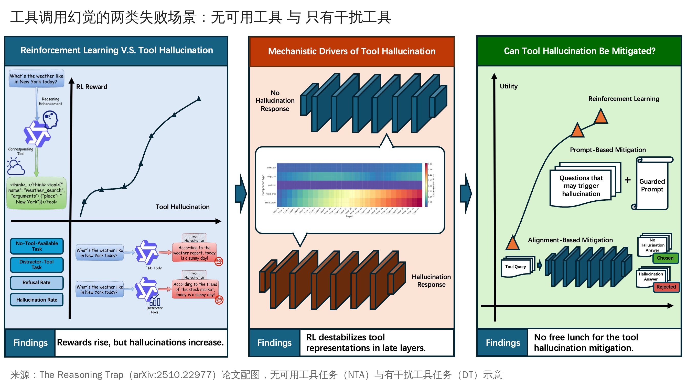
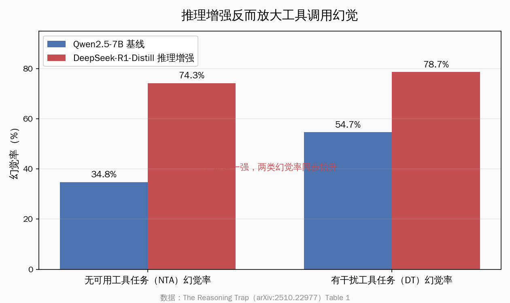
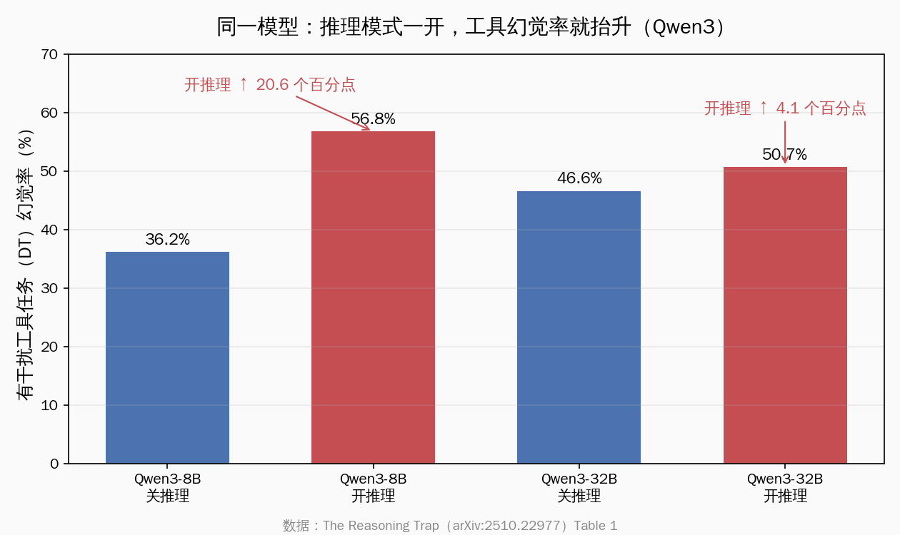
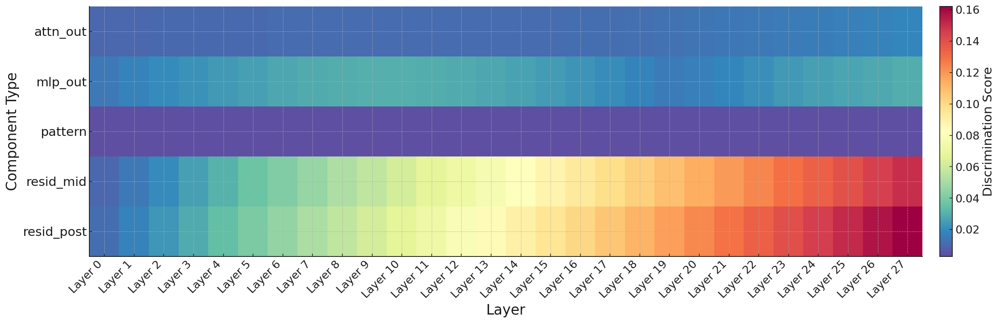
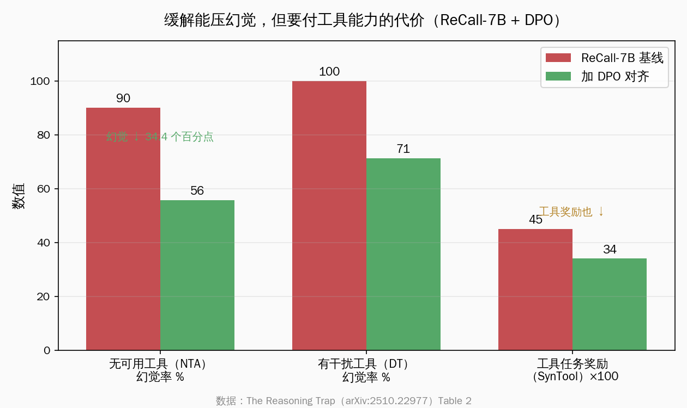
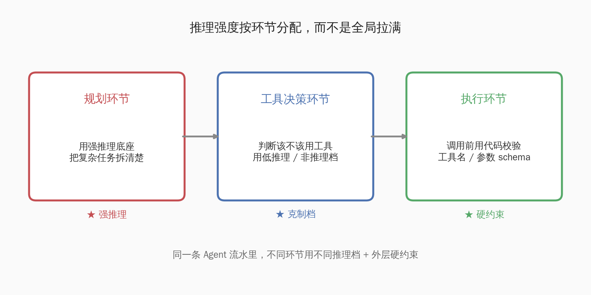

# 推理开越猛，Agent 工具调用越爱凭空捏造

> 一个反直觉的发现：你给 Agent 换上推理（reasoning）更强的模型、把"深度思考"开到最大，它在工具调用（tool call，函数调用）这一环节，反而更容易凭空捏造一个根本不存在的工具或参数。这不是个别现象，而是一条可量化、可复现、跨模型成立的规律。

最近一篇被 ACL 2026 主会接收的论文把这件事讲透了——《The Reasoning Trap: How Enhancing LLM Reasoning Amplifies Tool Hallucination》（arXiv:2510.22977），作者是 Chenlong Yin、Zeyang Sha、Shiwen Cui、Changhua Meng、Zechao Li。它的核心论断只有一句话：**把大模型的推理能力调强，会同步放大它在工具调用场景里的幻觉，而且推理越强、幻觉越多。**

这句话对正在搭 Agent 的开发者来说，分量不轻。我们这两年的默认直觉是"模型越聪明越好用"，于是给 Agent 默认开 thinking、上推理模型、把思维链拉长。这篇论文给出的实验数据说明：在"该不该调用工具、调用哪个工具"这件事上，更强的推理不一定带来更可靠的判断，有时恰恰相反。

好消息是，这件事一旦被量化清楚，它就从"玄学翻车"变成了"可预期、可规避的工程问题"。下面把机制、数据、以及国内开发者能怎么用，逐层讲清楚。

## 这篇论文到底测了什么

要相信一个反直觉结论，先得看它怎么测的。论文搭了一个专门的诊断基准 SimpleToolHalluBench，从 AgentSafetyBench 里取了 296 个工具，构造两类"故意为难模型"的任务：

- **无可用工具任务（No-Tool-Available，下称 NTA）**：用户的问题需要某个外部工具才能完成，但工具箱里根本没给这个工具。正确做法是模型老老实实回答"我没有合适的工具"。
- **有干扰工具任务（Distractor-Tool，下称 DT）**：工具箱里只放了一堆不相关的干扰工具，真正需要的那个仍然缺席。正确做法同样是拒绝硬调。

这两类任务的共同点是：**正确答案就是"不调用任何工具"**。任务被设计成"靠现有工具绝对完不成"，于是只要模型动手去调了某个工具，就记一次幻觉。幻觉率就是"在这些本该拒绝的场景里，模型却伸手去调工具"的比例——NTA 任务的幻觉率记作 R_NTA，DT 任务的记作 R_DT。

*来源：The Reasoning Trap（arXiv:2510.22977）论文 Figure，工具幻觉两类失败模式概览*

这个设计的聪明之处在于：它把"工具调用可靠性"单独拎出来量化了。日常我们评测 Agent，盯的多是"任务完成率"——能把活干成就行。但 SimpleToolHalluBench 盯的是反面：**当本该收手时，模型能不能管住自己的手。** 这恰恰是生产环境里最伤人的一类错误：用户问了个本系统答不了的问题，Agent 不说"我做不了"，而是煞有介事地调了个不存在的接口、填了一组编造的参数，然后给出一个看似合理、实则全假的结果。

## 核心数据：推理一强，幻觉率就抬

论文最有说服力的一张表是 Table 1。它把"基线模型"和"推理增强模型"放在同一套任务上对照，结果非常直接。

下面这张图是按原文 Table 1 数值绘制的对照——同一家族、同一规模量级，区别只在"有没有经过推理强化"：

具体数字（均为论文 Table 1 原文值）：

| 模型 | 配置 | 无可用工具（NTA）幻觉率 | 有干扰工具（DT）幻觉率 |
|---|---|---|---|
| Qwen2.5-7B-Instruct | 基线 | 34.8% | 54.7% |
| DeepSeek-R1-Distill-Qwen-7B | 推理增强（蒸馏） | 74.3% | 78.7% |

同样是 7B 量级、同源的 Qwen2.5 底子，经过推理蒸馏（DeepSeek-R1 那一套长思维链训练）之后，NTA 幻觉率从 34.8% 抬到 74.3%，DT 幻觉率从 54.7% 抬到 78.7%。也就是说，在"本该拒绝调用工具"的场景里，推理增强后的模型有四分之三的情况会忍不住乱调。**推理能力强化的同时，工具调用的克制力被一起削弱了。**

更妙的是，论文还给了一组"同一个模型、只切推理开关"的对照——这是对开发者最有用的一组数据，因为它最接近我们日常的操作：同一个 Qwen3，把 thinking（推理模式）开起来 vs 关掉。

按原文 Table 1：

| 模型 | 配置 | 无可用工具（NTA）幻觉率 | 有干扰工具（DT）幻觉率 |
|---|---|---|---|
| Qwen3-8B | 关推理模式 | 4.1% | 36.2% |
| Qwen3-8B | 开推理模式 | 5.4% | 56.8% |
| Qwen3-32B | 关推理模式 | 5.1% | 46.6% |
| Qwen3-32B | 开推理模式 | 8.8% | 50.7% |

看 DT 这一列：同一个 Qwen3-8B，只是把推理模式打开，有干扰工具任务的幻觉率就从 36.2% 跳到 56.8%，足足抬了 20.6 个百分点；32B 版本也抬了 4.1 个百分点。**模型没换、权重没动、就拨了一下"要不要深度思考"的开关，工具调用的可靠性就明显下滑。** 这是这篇论文里最贴近一线开发的一组证据：它说明"推理放大幻觉"不只是训练阶段埋下的，在推理（inference）阶段临时一开 thinking 也会立刻发生。

这里要给一个让人安心的注脚：Qwen3 的 NTA 幻觉率即使开了推理也只在个位数（4.1% → 5.4%，5.1% → 8.8%），比那个 7B 蒸馏模型的 74.3% 健康太多。这说明**幻觉率高低和模型本身的训练质量强相关**——好底子的模型，开推理后只是"略微变差"，而不是"崩盘"。换句话说，这条规律是"方向性"的（开推理 → 幻觉抬升），但抬升的幅度，取决于你选的是哪个模型。

## 不是"工具数据没训好"，是推理本身的副作用

读到这里，最容易冒出来的反驳是："会不会只是这些推理模型在工具调用上没训练好，过拟合了数学题，所以不会用工具？" 论文专门做了一组实验堵住这个口子，而这恰恰是它最硬的部分。

作者拿一个模型，**只用纯数学题做强化学习训练，全程不碰任何工具相关的数据**，然后观察训练过程中工具幻觉率怎么变。结论用原文的话说是：

> "尽管完全没有任何工具相关的监督信号，我们依然观察到，随着训练推进，无可用工具任务（NTA）和有干扰工具任务（DT）两类的幻觉率都在持续上升。"

这句话的分量在于：**模型从头到尾没见过一个工具调用的训练样本，仅仅因为推理能力被数学题练强了，它在工具场景里的幻觉就跟着涨。** 这就把"工具数据没训好"这个解释彻底排除了——问题不在工具数据的缺失，而在"推理强化"这个动作本身，会顺带破坏模型对"该不该用工具"的判断。

论文进一步说明这个效应是"方法无关"的：无论你是用监督微调（SFT）把推理能力训进去，还是干脆不训、只在推理阶段把模型从"直接回答"切到"一步步思考"，幻觉放大都会出现。训练时埋下、推理时也能现场触发——这两条路都通向同一个结果。

把这三层证据叠起来，论文的因果链就立住了：

- **第一层（因果）**：推理增强 → 工具幻觉同步抬升，且能力涨多少、幻觉涨多少大致成正比；
- **第二层（排除过拟合）**：连纯数学训练都能放大工具幻觉，说明不是工具数据的锅；
- **第三层（方法无关）**：训练注入和推理时临时唤起，两种方式都触发。

## 机制：推理训练悄悄"动摇"了工具可靠性的内部表征

知道"会发生"还不够，工程上我们想知道"为什么"，才好对症。论文用 CKA（Centered Kernel Alignment，一种衡量神经网络内部表征相似度的方法）做了机理分析，结论挺反直觉，也挺优雅。

它对比了推理强化前后，模型内部各层表征的变化程度，结论是两边冷热不均：

- **分布内（in-distribution）的表征非常稳定**：模型见惯的常规场景，强化推理前后几乎没变，CKA 维持在 0.9 以上。

- **工具可靠性相关的分布外（out-of-distribution）表征显著动摇**：在早层和中层，CKA 一路掉到 0.75 以下。

*来源：The Reasoning Trap（arXiv:2510.22977）论文 Figure，逐层表征差异热力图*

用一句白话翻译：**推理强化这套训练，对模型日常熟悉的事情几乎没影响，却专门动摇了"判断工具该不该信、该不该调"这一类相对边缘的内部表征。** 这些早期层里微小、几乎察觉不到的偏差，会顺着模型一层层往上累积，最终在靠后的层、在残差流（residual stream，模型逐层叠加信息的主干通道）里放大成明显不同的激活模式——表现到外面，就是"凭空调了个不存在的工具"。

这个机制解释了一个我们直觉上的困惑：为什么模型在正常任务上越来越聪明，偏偏在"工具该不该用"上越来越糊涂？因为强化推理优化的是"怎么把会做的题做得更对"，它无意中把那部分"管住手、知道自己不会"的表征当成了可以牺牲的代价。换句话说，**推理强化让模型更敢想，也更敢动手——哪怕手边根本没有合适的工具。**

还有一个细节值得开发者留意：论文观察到，推理链越长，幻觉越容易冒头。模型在长思维链里反复"推演"该怎么完成任务时，会一步步把自己说服成"应该有这么一个工具"，于是在链条末端真的去调了一个它一路想象出来的接口。

这和我们日常的体感对得上——开了深度思考的模型，有时会洋洋洒洒解释一通"我打算先调用某某接口获取数据"，而那个接口你压根没给它。思维链给了模型更大的发挥空间，也给了幻觉更长的发酵时间。理解这一点，"该不该把思维链拉满"就从一个习惯动作，变成了一个需要按场景权衡的设计选择。

## 缓解能压住幻觉，但要付能力的代价

论文没有停在"指出问题"，它试了两种缓解办法：提示工程（prompt engineering，比如在系统提示里明确写"没有合适工具时不要硬调"）和 DPO（Direct Preference Optimization，直接偏好优化，一种偏好对齐方法）。

DPO 这一组的数据值得细看。论文 Table 2 拿一个工具幻觉很严重的模型 ReCall-7B 做对齐：

按原文 Table 2：

| 方法 | 无可用工具（NTA）幻觉率 | 有干扰工具（DT）幻觉率 | 工具任务奖励（SynTool） |
|---|---|---|---|
| ReCall-7B 基线 | 90.2% | 100.0% | 0.45 |
| 加 DPO 对齐 | 55.8% | 71.4% | 0.34 |

DPO 确实把幻觉压下来了：NTA 幻觉率从 90.2% 降到 55.8%，降了 34.4 个百分点。但同一张表也写着代价——工具任务奖励（SynTool 这个正常工具使用基准上的得分）从 0.45 掉到 0.34。也就是说，**你越使劲教模型"别乱调工具"，它在该用工具时也变得畏手畏脚，正常工具能力一起被压下去了。**

这就是论文标题里"陷阱"二字的真意：可靠性和能力之间存在一个绕不开的取舍。提示工程的效果更温和也更有限，单靠一句"没工具就别调"能压下去一部分，但远不能根治。把两种办法叠起来用，能拿到累积但仍然有限的改善。

这个取舍听上去有点丧气，但对工程师反而是个清醒剂：**它告诉我们不能指望"一个万能开关"既要推理强、又要工具稳。** 真实的做法是按场景分配——什么时候要模型敢想，什么时候要模型稳手，得我们自己在系统设计层面拆开来安排。下一节就讲怎么拆。

## 落到搭 Agent 的实操：六条可以今天就用的对照

这篇论文最大的价值，是把一个模糊的"翻车体感"变成了可操作的设计原则。结合它的数据，给正在搭 Agent / MCP 的开发者整理出六条对照，都是不依赖具体厂商、今天就能用的：

**第一，工具调用密集的环节，默认不要无脑开 thinking。** Qwen3 那组数据已经很说明问题——同一个模型，开推理让 DT 幻觉率从 36.2% 抬到 56.8%。如果某个步骤的核心是"在给定工具集里选对工具、或判断没有合适工具",这一步用非推理模式、或低推理档，往往比拉满思维链更稳。把推理预算花在真正需要长链条思考的环节（复杂规划、多步数学、代码推导），而不是均匀撒给每一次工具决策。

**第二，把"规划"和"执行工具"在架构上分开。** 一个常见且有效的模式是：用推理强的模型负责"想清楚要干什么、分几步"，但真正落到"调哪个工具、填什么参数"时，交给一个推理档更低、更克制的执行步骤来做。让敢想的归敢想、稳手的归稳手，避免同一次调用里既要发散又要精确。

**第三，给工具调用上"硬约束"，不要只靠模型自觉。** 论文里 DT 任务的高幻觉率说明：光靠提示词让模型"别乱调"效果有限。工程上更靠谱的是在模型外面加一层校验——调用前用代码检查这个工具名是否真在已注册的工具表里、参数 schema 是否对得上、必填字段是否齐全；对不上就直接拦下来，不让这次幻觉的调用真正发出去。MCP 这类协议天然适合在这一层做白名单校验。

**第四，把"拒绝调用"也当成一个正经选项喂给模型。** 很多 Agent 的提示词只教模型"怎么调工具"，没给"什么都不调"留位置，模型于是被默认推着去动手。明确地在工具列表里放一个"无合适工具时回报无法完成"的出口，或在系统提示里把"宁可说做不到，也不要编造工具"写成硬规则，能把一部分硬调的冲动接住。

下面把前四条整理成一张速查对照：

| 场景 | 不推荐做法 | 推荐做法 |
|---|---|---|
| 工具选择 / 判断有无合适工具 | 全程拉满思维链 | 用低推理档或非推理模式 |
| 复杂多步规划 | 和工具执行混在一次调用里 | 规划用强推理、执行工具用克制档，分开 |
| 防止调用不存在的工具 | 只靠提示词约束 | 调用前用代码做工具名 / 参数 schema 校验 |
| 本系统答不了的问题 | 提示词只教"怎么调工具" | 显式给出"拒绝调用 / 回报无法完成"的出口 |

**第五，专门给"该不该调工具"建一套测试集，而不是只测任务完成率。** 这是论文方法论给我们的直接启发：SimpleToolHalluBench 的精髓是"构造一批靠现有工具绝对完不成的任务，看模型会不会硬调"。你完全可以照这个思路，给自己的 Agent 造一小批"陷阱用例"——故意拿掉关键工具、或只放干扰工具，然后统计模型有多少比例会乱伸手。把这个"工具幻觉率"纳入每次换模型、换 thinking 档位时的回归测试，换模型前后跑一遍，心里就有数了。

**第六，换"更聪明的模型"时，单独验一遍工具可靠性。** 这是这篇论文给所有人的提醒：当你把 Agent 的底座从一个普通模型换成一个推理更强的新模型，任务完成率大概率会涨——但工具调用的克制力可能同时下滑。别只看到完成率的提升就直接上线，把上面那套"陷阱用例"重新跑一遍，确认幻觉率没有跟着任务能力一起飙上去。

这六条背后其实是同一个判断：**推理强度不该是一个全局拉满的总开关，而应该是一个按环节分配的设计变量。** 过去我们调 Agent，习惯在"用不用推理模型"上做一个一刀切的决定；这篇论文给的启发是，把这个决定细化到每一个步骤——规划步可以敢想，工具决策步要稳手，执行步要可校验。同一条 Agent 流水里，不同环节用不同的推理档，配上外层的硬约束和针对性测试，远比"全程开最强推理"更可控。这不是把模型能力打折，而是把它的能力放到最该发挥的地方。

## 给国内 Agent 开发者：拿国产推理模型做对照的思路

国内搭 Agent 的同行手里，正好握着一批最适合验证这条规律的模型——DeepSeek-R 系列、Kimi、以及带 thinking 档位的千问（Qwen），都是推理强、且开关清晰的代表。论文里用的 DeepSeek-R1-Distill-Qwen-7B、Qwen3 系列本身就是国产模型，这意味着论文的结论对我们来说不是隔岸观火，而是手边就能复现、就能受益的实操参照。

可以这样把论文的方法搬到自己的项目里：

- **拿带 thinking 开关的模型做 A/B 对照**：千问的 thinking 档、Kimi 的深度思考、DeepSeek 的推理模式，都支持开关切换。在你自己的工具集上，造一小批"无合适工具"的陷阱用例，分别用开 / 关推理各跑一遍，亲眼看一下幻觉率的差。论文给的方向是"开推理会抬幻觉"，但具体抬多少、抬到什么程度还能接受，得用你自己的工具集和业务场景来量——这是别人替代不了的功课。
- **按环节分配推理档**：在规划环节用 DeepSeek-R / Kimi 深度思考这类强推理底座，把复杂任务拆清楚；到了"选工具、填参数"这一具体环节，切到非推理档或更克制的设置，把工具调用的稳定性提上来。
- **把工具幻觉率纳入选型标准**：国产模型迭代很快，每次有新版本、新的推理档位放出来，除了看 benchmark 跑分，顺手用你那套陷阱用例量一下工具幻觉率，让"工具可靠性"和"任务完成率"一起进选型表。

这件事的积极意义在于：**国内一线的推理模型质量已经足够好，好到我们可以从容地讨论"怎么把它们用得更稳",而不是还在追"够不够强"。** Qwen3 即使开了推理，NTA 幻觉率也只在个位数，这本身就是国产底座扎实的证明。论文揭示的不是"国产模型有问题"，而是"所有强推理模型共有的一个工程特性"——认清它，我们反而能比别人更早一步把 Agent 搭得更稳。

## 收个尾：认清陷阱，才好把 Agent 搭得更稳

把这篇论文的核心再说一遍：**推理增强会同步放大工具调用幻觉，这条规律可量化（7B 蒸馏模型 NTA 幻觉率从 34.8% 抬到 74.3%）、可复现（Qwen3 一开推理 DT 幻觉率抬 20.6 个百分点）、跨模型成立、且源于推理训练对内部表征的动摇而非工具数据缺失。**

这听上去像个坏消息，但换个角度看，它其实是一份难得的工程地图。在它之前，"换了更强的模型、Agent 却开始乱调工具"是一种说不清道不明的玄学翻车；在它之后，这变成了一个有名字、有数据、有缓解方向的明确问题。知道陷阱在哪，我们就能绕着走：工具决策环节收着点推理、规划和执行分开、加一层调用前校验、给"拒绝"留出口、专门测工具幻觉率。

我们这一代搭 Agent 的开发者其实挺幸运——手里有 DeepSeek-R、Kimi、千问这样开关清晰、质量扎实的国产推理模型，又有这样把问题量化到位的研究替我们趟路。把"推理强弱"从一个粗暴的总开关，拆成按环节精细分配的设计变量，正是 Agent 工程从"能跑起来"走向"稳得住"的必经一程。认清这个陷阱，下一个被你搭出来的 Agent，会比上一个更让人放心。一起加油。

> 论文：The Reasoning Trap: How Enhancing LLM Reasoning Amplifies Tool Hallucination，arXiv:2510.22977，ACL 2026 主会接收。文中所有幻觉率数值均取自论文 Table 1 与 Table 2 原文。
