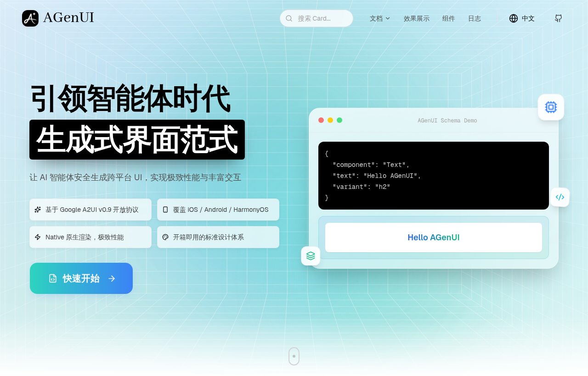
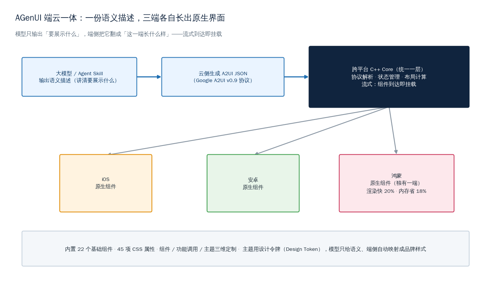
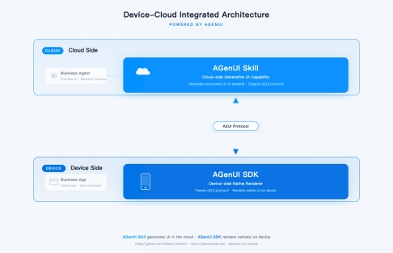
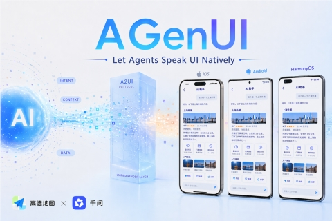
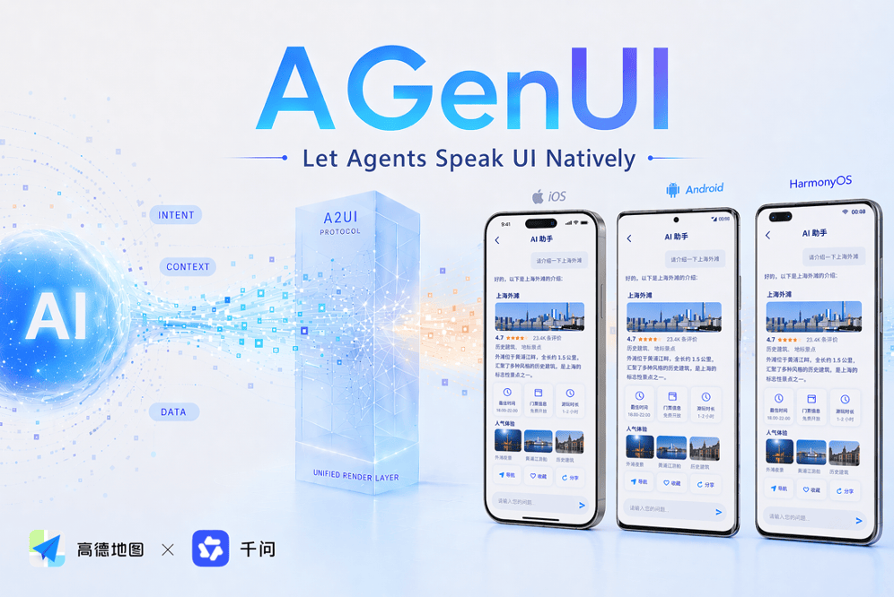
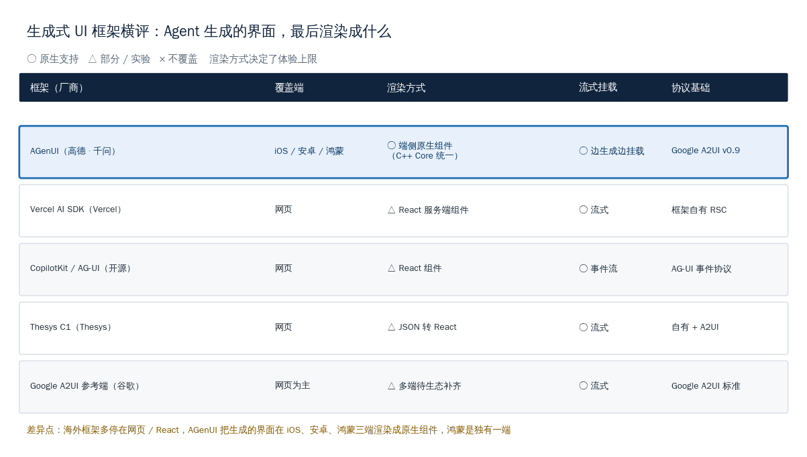

# 高德联手千问开源 AGenUI：Agent 生成的界面，在三端跑成原生组件

高德和阿里千问的 C 端应用团队近期开源了一个叫 AGenUI 的框架。它要解决的不是「Agent 怎么生成界面」，而是更难的一步：让 Agent 生成的界面在 iOS、安卓、鸿蒙三端都渲染成原生组件，而且是边生成边出现。

这件事值得国内做 Agent、做前端的同行认真看一眼。过去一年，「让大模型生成 UI」从实验室概念变成了一堆可用框架，但它们几乎都停在网页和 React 这一层。AGenUI 把战场挪到了真实 App：一份语义描述，三端各自长出原生界面，鸿蒙还是单独跑通的一端。这正是国内团队最熟的主场——手机 App 的原生体验，恰恰是海外网页框架最难够到的地方。

## 先说清楚：生成式 UI 到底在生成什么

这篇文章的核心论点只有一句：**Agent 生成 UI 这件事，难点早就不在「生成」，而在「生成完之后渲染成什么」。** AGenUI 给出的答案是——渲染成三端的原生组件，而不是又一个网页套壳。

要理解这句话，先得弄清楚生成式 UI（Generative UI）是什么。

过去我们用 AI 助手，交互形态基本就是聊天框：你问一句，它回一段文字。但文字不是万能的。你让它帮你订机票，它回你一大段「航班 A 出发 8:00，航班 B 出发 9:30……」，远不如直接弹一张可点选的航班卡片来得清楚。你让它做数据分析，一张图表胜过三百字描述。

生成式 UI 的思路就是：**让模型不止生成文字，还能生成界面**——根据当前任务，临时「长出」一张表单、一组卡片、一个选择器，让用户直接点、直接填，而不是在聊天框里来回打字。

*来源：AGenUI 官网 genui.amap.com 首页实截，「引领智能体时代生成式界面范式」*

举个具体场景就好懂了。你在一个出行 App 里对 AI 助手说「帮我订明天去上海的高铁」，理想的反馈不该是一大段文字罗列车次，而是直接弹出一张可点选的车次卡片：上面列着几个班次、时间、票价，你手指一点就选好了，再点一下就进入下单。这张卡片就是 Agent 临时「生成」出来的界面——它不是 App 预先写死的某个页面，而是根据这次对话现场长出来的。这就是生成式 UI 想达到的效果。

这个方向在 2026 年已经成了明确趋势。一个直接的信号是：谷歌在 2026 年推出了 A2UI（Agent-to-User Interface）协议，专门规范「Agent 怎么把界面意图描述出来」。AGenUI 官网写得很直白——它基于 Google A2UI v0.9 开放协议构建，号称 100% 协议兼容。换句话说，AGenUI 不是另起炉灶发明一套描述格式，而是接住了一个正在形成的开放标准。

为什么协议这么重要？因为生成式 UI 真正的工程难点，是怎么把「模型脑子里想展示的东西」可靠地传递到「用户屏幕上真正显示的东西」。这中间要跨过两道坎：

- **第一道坎**：模型输出要稳定、可控、省 token。如果让模型直接吐一大段前端代码，既费 token，又容易出错，还有安全隐患。
- **第二道坎**：同一份描述，要能在不同设备上都渲染成体验一致的界面。手机、平板、车机、鸿蒙的折叠屏，屏幕尺寸和系统能力都不一样。

AGenUI 的整个设计，就是围绕这两道坎展开的。

## 端云一体：模型只管「展示什么」，端侧负责「长成什么样」

这一节看 AGenUI 的核心架构——它把生成式 UI 拆成了云、端两半，各管一摊。

按官方的说法，AGenUI 采用端云一体架构，分工很清楚：

- **云侧**：通过 Agent Skill 生成 AI 原生的 A2UI JSON。这一步的关键，是让模型只输出「要展示什么」的语义描述，而不是具体的像素和代码。这样能降低大模型的 token 消耗，也减少了输出的不确定性。
- **端侧**：依托一个跨平台的 C++ Core，统一处理协议解析、状态管理和布局计算，然后在 iOS、安卓、鸿蒙三端各自渲染成原生组件。

*来源：AGenUI 开源资料架构示意图*

这套分工的妙处，在于把「难的部分」从模型身上挪到了端侧的 C++ Core 里。三件事被这层 C++ Core 一次性兜住：

- **协议解析**：把云侧来的 A2UI JSON 读懂，知道每个节点是什么组件、有什么属性。
- **状态管理**：界面是活的，用户点了、填了、滑动了，状态要持续维护，不能渲染完就不管了。
- **布局计算**：同一份描述，在手机竖屏、平板横屏、鸿蒙折叠屏上各自算出合适的布局。

模型这一头则变轻了：它不用关心 iPhone 和鸿蒙折叠屏的差异，只需要讲清楚「这里要一张航班卡片，上面有出发时间、价格、一个预订按钮」。剩下「这张卡片在 iOS 上长什么样、在鸿蒙上长什么样」，全交给端侧那层 C++ Core 去翻译。

这种「模型出语义、端侧管呈现」的分法，还顺手解决了一个安全顾虑。如果让模型直接生成可执行代码塞进 App，等于把界面控制权交给了一个不完全可控的生成过程，风险不小。而 A2UI 这种纯数据描述，端侧只会按既定的组件规则去渲染，模型生成不出来的东西就渲染不出来，相当于给了一道天然的护栏。

这就引出了 AGenUI 一个很关键的设计——**一份描述，三端各自渲染成原生组件**。开发者接入 SDK 之后，可以把 Agent 的输出直接变成可交互的原生卡片，而不需要为 iOS、安卓、鸿蒙分别写三套 UI 代码。

为什么「原生」这两个字这么要紧？这就要说到生成式 UI 一直以来的一个体验短板。

## 三端原生 + 流式挂载：补的是网页套壳的两个短板

这一节回答：AGenUI 跟市面上一堆生成式 UI 框架比，差异到底在哪。答案是两点——**渲染成原生，而不是网页套壳；流式挂载，而不是等全部生成完再显示。**

先说原生这一点。

过去很多「让 AI 生成界面」的方案，最后做出来都是一个 WebView——本质是在 App 里塞一个浏览器，把生成的网页界面套进去。这条路上手快，但体验上有天花板：滚动会卡、动画不跟手、跟系统的输入法和手势经常打架、深色模式适配也常出问题。用户一眼就能感觉到「这块跟原生 App 不是一个质感」。

AGenUI 走的是另一条路。它端侧那层 C++ Core 把生成的界面描述，直接翻译成各平台的原生组件——iOS 上是 iOS 的原生控件，鸿蒙上是鸿蒙的原生控件。从底层保证多端体验一致，而不是靠一个浏览器内核去模拟。

这条路对鸿蒙的意义尤其大。据 IT之家报道，AGenUI 是面向鸿蒙的首个生成式 UI 开源框架，鸿蒙版相比 iOS 和安卓版本，渲染性能提升约 20%、内存占用降低约 18%，还跟小艺、鸿蒙意图框架做了协同，适配了鸿蒙的「1+8+N」全场景分布式架构。对正在补齐应用版图的鸿蒙来说，多一个原生的生成式 UI 框架是实打实的助力。

再说流式挂载这一点。

*来源：AGenUI 发布资料，同一份界面在 iOS / Android / HarmonyOS 三端渲染成原生组件*

大模型生成内容是一个字一个字往外蹦的，界面也一样。如果非要等整个界面描述全部生成完才开始渲染，用户就得对着空白屏幕干等好几秒。

AGenUI 的核心是 Streaming-first 流式架构——**组件到达即刻挂载，做到「边生成边呈现」**。模型先吐出来一个标题，标题就先显示；接着吐出来一张卡片，卡片就接着挂上去。配合最小化节点差分更新和独立线程异步渲染，即使是高频的增量更新，也不会卡住主线程。

这两点合起来，AGenUI 想补的正是过往方案的两块体验短板：界面质感塌成网页，以及等待时的空白焦虑。

## 22 个组件、45 项 CSS：给 Agent 一套够用的积木

光有架构还不够，开发者真正动手时，关心的是「手里有哪些现成的零件」。这一节看 AGenUI 给了多少积木，以及怎么定制。

按官方数据，AGenUI 内置 **22 个基础组件和 45 项 CSS 属性**，支持组件、功能调用、主题三个维度的定制。

| 维度 | AGenUI 提供的能力 | 解决的问题 |
|---|---|---|
| 组件 | 22 个基础组件（卡片 / 表单 / 列表等） | Agent 不用从零拼界面，直接调现成积木 |
| 功能调用 | 组件可绑定交互与功能 | 生成的不是死界面，是能点能填的活组件 |
| 主题 | 45 项 CSS 属性 + 设计令牌系统 | 同一份界面，自动套上不同 App 的品牌样式 |

其中主题这一维度最能体现工程巧思。AGenUI 的 Theme 系统支持设计令牌（Design Token）——模型只需要输出语义描述，比如「这是一个主要按钮」，端侧就能自动把它映射成符合品牌规范的具体样式：高德的 App 里它是高德的蓝，换一个 App 接入，同样一份描述就变成那个 App 的主色。

这件事的价值在于解耦。模型管「这是什么」，App 管「这长什么样」。模型不需要知道每个接入方的品牌色卡，接入方也不需要去改模型的输出。一份语义描述能跑在多个 App、多个品牌之下，这正是「一套描述、多端复用」能成立的前提。

*来源：量子位 qbitai.com 2026-05 AGenUI 报道配图*

## 海外对位横评：大家都在做生成式 UI，路线不一样

这一节把 AGenUI 放到全球坐标里看。结论先给：**海外的生成式 UI 框架大多停在网页和 React 这一层，AGenUI 的差异是三端原生，鸿蒙更是独有一端。**

2026 年，生成式 UI 是个全球热门方向，海外冒出了好几条不同路线：

- **Vercel AI SDK 的 Generative UI**：走的是 React 服务端组件路线，在网页上把生成的界面实时渲染成 React 组件。流式做得不错，但跟 React 和网页框架绑得很深。
- **CopilotKit / AG-UI**：AG-UI 是一套事件协议，规范的是「Agent 后端和前端之间消息怎么流动」——它更像是管道，主要服务网页和 React 项目。
- **Thesys C1**：2026 年初上线，把生成的界面存成 JSON 再转成 React 组件，主打可审计、可回放，落点同样在网页。
- **Google A2UI**：一个纯数据协议标准，定义「界面描述长什么样」。它是 AGenUI 的协议底座，但谷歌侧的参考实现目前也以网页为主，多端能力要靠后续慢慢补齐。

横向摆在一起，差异就清楚了。

这里要说句公道话：上面这些海外框架各有所长，网页这条路它们做得很成熟，Vercel AI SDK 和 CopilotKit 在 React 项目里都是很顺手的选择。AGenUI 不是要取代它们，而是补上了它们够不到的一块——移动端和鸿蒙端的原生渲染。

国内团队选 AGenUI 这条路，其实很合理。国内的 AI 助手大多是手机 App 形态，用户对原生体验的要求很高；而鸿蒙正在补应用版图，谁能第一个把生成式 UI 在鸿蒙上跑成原生，谁就占了先手。海外框架的网页基因，恰恰是它们在这块的弱项。高德和千问把自己最熟的移动原生能力，用在了这个新方向上，是把长处使到了对的地方。

## 开发者怎么试

想上手的同行，路径很清晰：

1. **看文档**：直接访问官网 genui.amap.com，上面有标准组件设计规范、深色 / 浅色模式支持等说明，也写明了基于 Google A2UI v0.9 协议、协议层完全对齐。
2. **判断适不适合自己**：如果你做的是手机 App 里的 AI 助手、需要让 Agent 生成可交互界面、又特别在意原生体验和鸿蒙覆盖，AGenUI 值得认真评估一下。如果只是网页项目，Vercel AI SDK、CopilotKit 这类成熟方案可能上手更快。
3. **关注协议演进**：A2UI 还是 v0.9，标准在往前走。早一点熟悉这套语义描述的思路，后面不管用哪家实现，底层概念都是通的，这部分认知不会浪费。

要提醒一句：AGenUI 是近期才开源的早期框架，组件库官网标的是「20+ 扩展组件，持续增加中」，组件库和工具链都还在早期。现在更适合做技术预研、跑通原型，离大规模生产环境的成熟度还需要时间。这不是泼冷水——早期正是参与共建、影响一个新框架走向的最好窗口。

## 回到那句话

绕了一圈，再回到开头那句核心论点：**生成式 UI 的难点，从来不在「生成」，而在「生成完渲染成什么」。**

模型能生成界面描述，这件事在 2026 年已经不稀奇了——海外好几家都做到了。真正把门槛抬高的，是怎么让这份描述在 iOS、安卓、鸿蒙三端都跑成原生组件，还能边生成边出现、不卡顿、自动套上各家的品牌样式。AGenUI 用一层跨平台的 C++ Core 加一套设计令牌，把这件难事做成了三端通吃。

更让人踏实的是，这条路我们国内团队走得很有底气。手机 App 的原生体验是我们的主场，鸿蒙是我们正在一起补齐的一块版图，谷歌 A2UI 这样的开放协议又给了大家一个共同的语言。AGenUI 把这几件事接在了一起，给国内做 Agent、做前端的同行多了一个扎扎实实的选择。

生成式界面这扇门才刚推开。一个开放协议、一套三端原生的实现、一群愿意一起共建的开发者——能凑齐这些，已经是很好的起点了。接下来怎么走，值得我们一起期待。

---

参考资料：

- 量子位《高德与千问 C 端应用团队开源 AGenUI：首个覆盖 iOS、安卓、鸿蒙三端的原生 A2UI 框架》：https://www.qbitai.com/2026/05/416864.html
- IT之家《高德推出"华为鸿蒙 HarmonyOS 首个生成式 UI 开源框架"AGenUI，利用通用协议适配多终端界面》：https://www.ithome.com/0/951/131.htm
- AGenUI 官网：https://genui.amap.com
