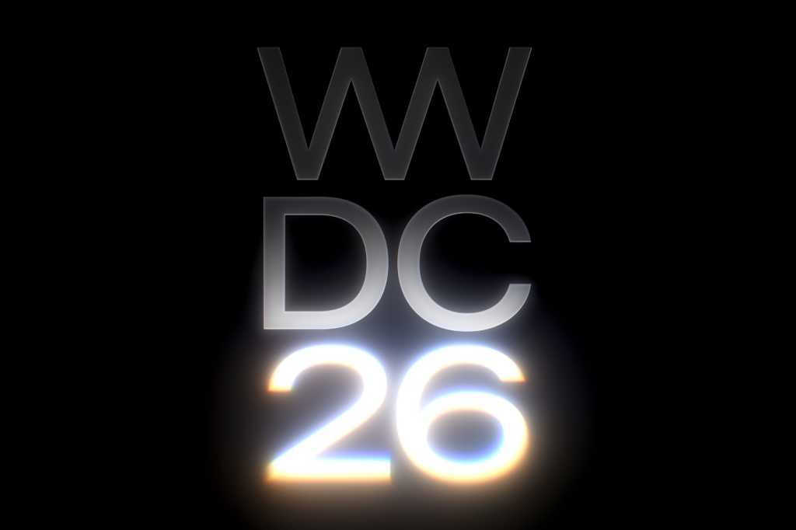
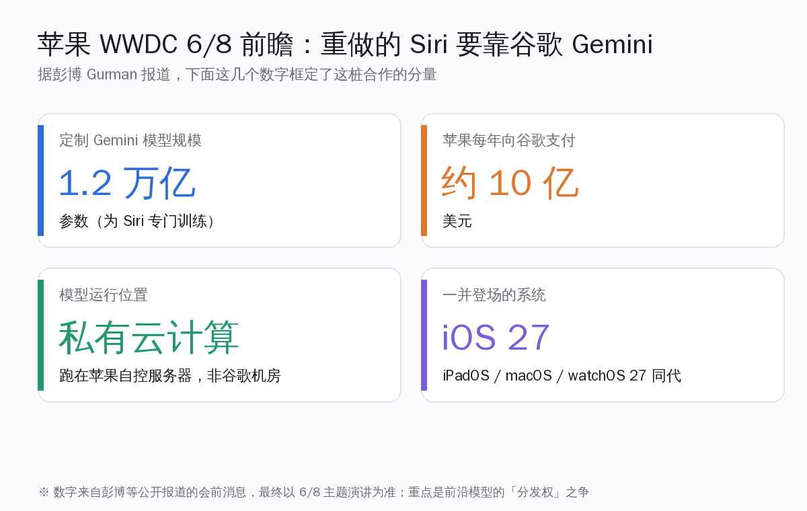
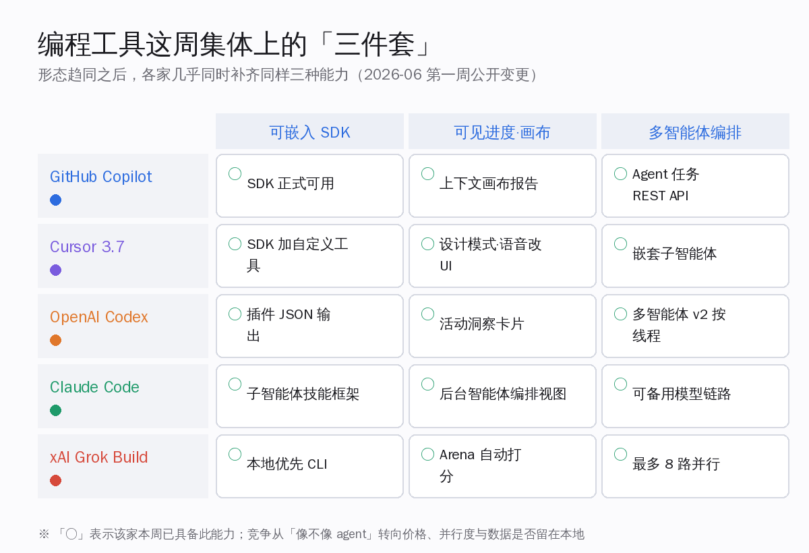
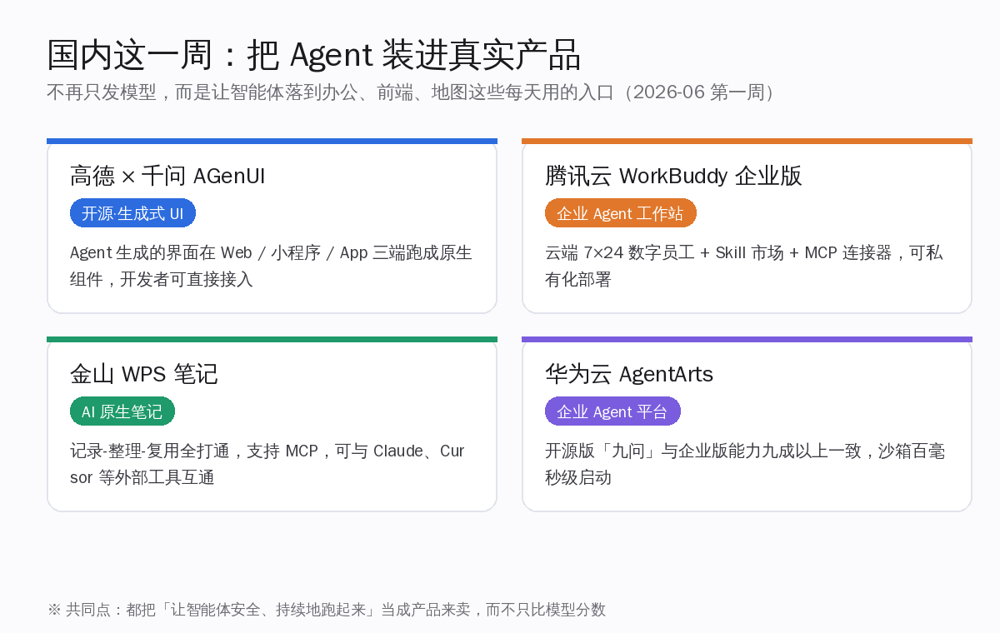
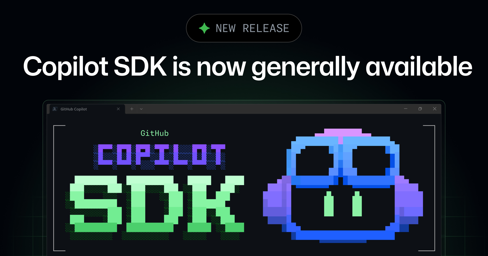
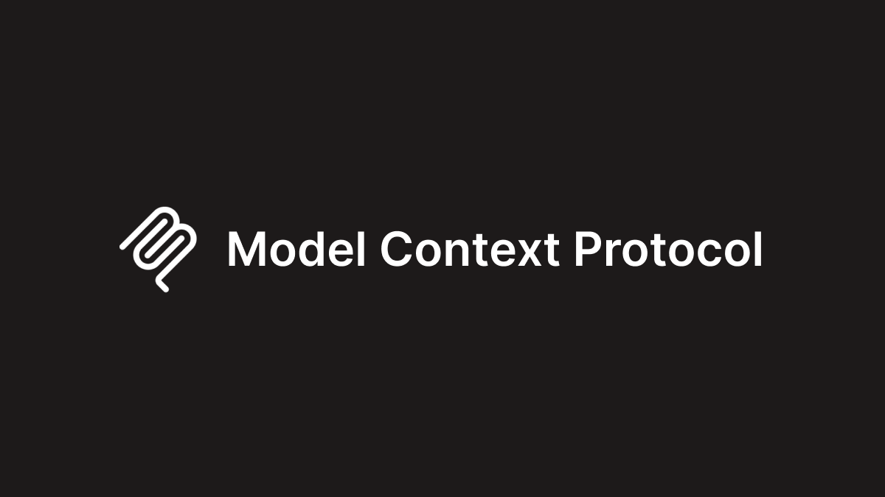
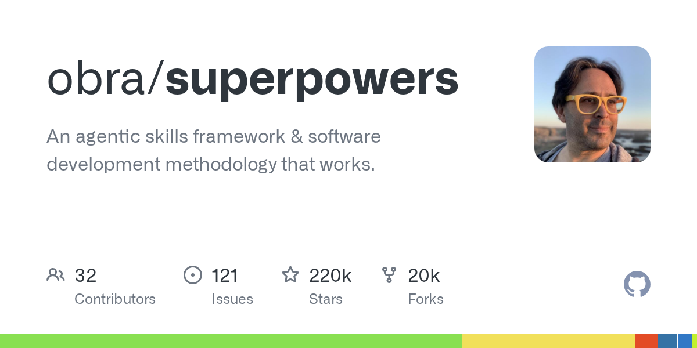
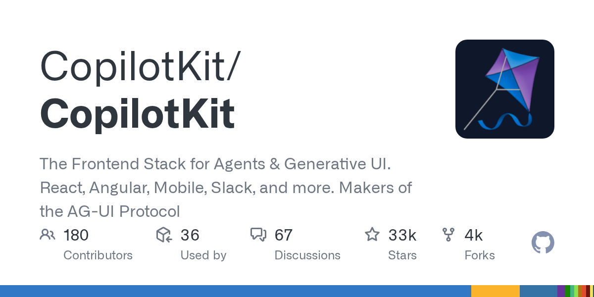
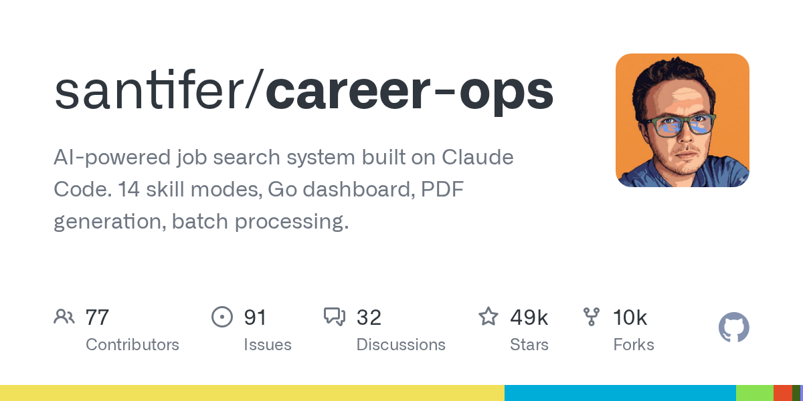

# 苹果明天 WWDC·Siri 改用谷歌 Gemini · 编程工具同质化进下半场 · 国内一周把 Agent 装进真实产品 | AI 日报 | 2026-06-07

## 📋 头版目录

- 🍎 苹果 6/8 WWDC 开幕，重做的 Siri 将由约 1.2 万亿参数的定制 Gemini 驱动 → 头条 1
- 💰 苹果每年向谷歌支付约 10 亿美元，模型跑在苹果自控的私有云计算上 → 头条 1
- 🧠 新 Siri 走独立 App 与「搜索或提问」手势，可读邮件照片、感知屏幕内容 → 头条 1
- 🛠 2026 年 6 月第一周，Copilot、Cursor、Codex、Claude Code 同时补齐同样三件套 → 头条 2
- 🛠 三件套指可嵌入 SDK、可见进度画布、多智能体编排，形态彻底趋同 → 头条 2
- 💰 竞争从「像不像 agent」转向价格、并行度与代码是否留在本地 → 头条 2
- 🇨🇳 高德联手千问开源 AGenUI，Agent 生成的界面在三端跑成原生组件 → 头条 3
- 🇨🇳 腾讯云 WorkBuddy 企业版、金山 WPS 笔记、华为云 AgentArts 一周集中落地 → 头条 3
- 🛠 GitHub Copilot SDK 正式可用，可把 Copilot 的智能体引擎嵌进自家产品 → 精选要闻
- 🛠 GitHub Copilot 上线百万词元上下文与可调推理档位 → 精选要闻
- 🔬 MCP 协议核心转为无状态，候选版发布、正式版定在 7 月底 → 精选要闻
- 🛠 GitHub Copilot 这周清退 GPT-4.1、GPT-5.2 等旧模型，按能力档位选更稳 → 快讯
- 💸 Anthropic 6/1 向美国证监会保密递交招股书草案，开了上市选项 → 快讯
- 🛠 Cursor 3.7 设计模式支持多选与语音改界面，SDK 加嵌套子智能体 → AI Coding
- 🛠 Claude Code 加可备用模型链路，主力模型过载时自动切换不重启 → AI Coding
- 🛠 OpenAI Codex CLI 多智能体 v2 按线程固定运行时，插件支持 JSON 输出 → AI Coding
- 🔥 obra/superpowers 越过 21.9 万星，是给 Claude Code 配技能的最大框架 → GitHub Trending
- 🔥 CopilotKit 约 3.32 万星，做 Agent 前端栈与生成式 UI → GitHub Trending
- 🔥 国产 AI 记忆系统 MemPalace 约 5.43 万星，与 mem0 同赛道 → GitHub Trending
- ⚖️ 北京智源大会 6/12-13 临近，具身产业一线掌舵人将集中发声 → 值得关注

## 🔥 头条深度

### 头条 1 · 苹果明天开 WWDC，重做的 Siri 要靠谷歌的 Gemini 来撑

> 来源：Macworld [11]，The Motley Fool [12]

苹果的全球开发者大会 WWDC 将在明天、6 月 8 日上午（太平洋时间 10 点）开幕 [11]。往年这场大会的看点是新系统和新硬件，今年被反复讨论的却是一件更基础的事：那个被苹果拖了一年多、一直没做好的 Siri，这次大概率要靠一个外部模型来撑——而这个模型来自谷歌。

对每天关注前沿模型格局的人，这件事的分量不在 Siri 本身好不好用，而在一个更大的信号：连苹果这样有钱、有数据、有十几亿台设备分发能力的公司，也选择不自己从头训一个最强的对话模型，而是付钱用别人的。前沿模型的「分发权」第一次这么直白地被摆上桌面。

#### 头条 1.1 · 几个公开的数字，框定了这桩合作的分量

据彭博社记者 Mark Gurman 等多方会前报道，这桩合作的几个关键数字已经基本清晰 [12]：

- **模型规模约 1.2 万亿参数**：谷歌为苹果专门训练了一个定制版的 Gemini 模型，用来驱动新一代 Siri 背后的基础模型层。
- **每年约 10 亿美元**：苹果为这个定制模型向谷歌支付的费用，量级在每年十亿美元上下。这笔钱的方向值得记一笔——苹果与谷歌此前长年的关系是谷歌付钱给苹果买搜索默认位，这次资金是反过来流动的。
- **跑在苹果自控的私有云计算上**：据报道，这个 Gemini 模型不是直接跑在谷歌的机房，而是运行在苹果自己掌控的「私有云计算」（Private Cloud Compute）服务器上。这是苹果一贯的隐私姿态——可以借别人的模型能力，但要把数据留在自己能管的边界内。

把这几条放在一起看，苹果走的是一条很务实的路：模型能力先借过来把产品做出来，隐私和数据控制权自己攥着。

#### 头条 1.2 · 新 Siri 的形态，正在向「聊天机器人」靠拢

会前消息里，新 Siri 的产品形态也大致有了轮廓 [11][12]。它预计会变成一个独立的 App，带一个系统级的「搜索或提问」手势，整合进灵动岛，界面更接近大家熟悉的聊天机器人；能力上则会拿到个人上下文的访问权——能读你的邮件、照片、文件，能感知当前屏幕上有什么，并在多个 App 之间替你执行更连贯的操作。配套的还有 iOS 27、iPadOS 27、macOS 27 等同代系统。

对开发者，真正值得明天盯紧的有两点：一是苹果会开放哪些接口，让第三方 App 接进这套更强的 Siri 和系统级智能；二是这套「借谷歌模型、跑自家私有云、攥住个人数据」的组合，会不会成为其他终端厂商的参照样板。这些都要等明天的主题演讲给出确切答案，今天能确定的只是——一家最在意自研和隐私的公司，在最关键的智能层选择了合作而非单干。

### 头条 2 · 编程工具的形态之争基本结束，这周各家集体上了同样的「三件套」

> 来源：GitHub Changelog [5][6]，Cursor [7]，OpenAI [8]，Claude Code [9]

如果说昨天 Grok Build 入场标志着编程 agent「该长什么样」的争论收尾，那么把这一周各家的公开更新排在一起看，会更清楚地看到一件事：大家不只是形态像，连这周补的能力都几乎一模一样。2026 年 6 月第一周，GitHub Copilot、Cursor、OpenAI Codex、Claude Code 不约而同地补齐了同样的三件套。

#### 头条 2.1 · 三件套：可嵌入 SDK、可见进度画布、多智能体编排

把这周的变更归一下类，会发现它们都落在三个方向上 [5][6][7][8][9]：

- **可嵌入 SDK**——工具不再只是给人用的终端，而是把自己的智能体引擎打包成 SDK，让你嵌进自家产品。GitHub 的 Copilot SDK 这周转正 [5]，Cursor 的 SDK 加了自定义工具 [7]，Codex 的插件开始支持机器可读的 JSON 输出 [8]。
- **可见进度的画布**——智能体在后台干了什么，开始被可视化地摊开给你看。Copilot 上了上下文用量的画布报告 [6]，Cursor 把智能体的上下文消耗做成可交互的画布视图 [7]，Codex 加了活动洞察卡片 [8]。
- **多智能体编排**——一个任务派给多个子智能体并行干，成了标配。Cursor 支持嵌套子智能体 [7]，Codex 的多智能体 v2 能按线程固定各自的运行时 [8]，Claude Code 把后台编排和可备用模型链路也补上了 [9]，Grok Build 则是最多 8 路并行。

三件套一旦各家都有，「我更像 agent」就不再是卖点了。

#### 头条 2.2 · 同质化之后，真正的差异点是价格、并行度和数据在哪

形态和能力都收敛之后，竞争自然往三个更实在的地方挪：谁更便宜、谁的并行更稳、谁让你更放心地把代码留在本机。昨天入场的 Grok Build 就是踩着这三点切进来的——本地优先、最多 8 路并行、输入侧价格低到每百万词元 0.2 美元 [10]。微软那边走的是另一条线：用自研模型从默认模型这一层换掉 Copilot 的内核，工具不变、底子悄悄换。

对每天在用这些工具的人，结论很务实：接下来一段时间值得比的不是「谁又出了新形态」，而是同一套形态下，谁的账更划算、谁的并行不翻车、谁不把你的源码传走。这几款工具具体的路线差异，今天的「Grok Build 入场：五个编程 agent 趋同，竞争转向价格」专题里讲得更细。

### 头条 3 · 国内这一周：不再只发模型，而是把 Agent 装进每天都在用的入口

> 来源：高德 AGenUI [1]，量子位 [2][3][4]

如果把这一周国内厂商的动作连起来看，能看到一个共同的转向：发布的重点不再是「我们又训了个更强的模型」，而是「我们把智能体装进了一个你每天都在用的产品里」。办公、前端、地图、企业流程，几个最高频的入口这一周都被补上了智能体。

#### 头条 3.1 · 高德联手千问，把「Agent 生成的界面」做成了能跑的开源组件

最值得国内开发者多看一眼的是高德和千问（Qwen）联合开源的 AGenUI [1]。它要解决的是生成式 UI 落地时最别扭的一环：让大模型动态生成的界面，能在 Web、小程序、原生 App 这三端，都跑成体验一致的原生组件，而不是各端各写一套、或者只能凑合用网页套壳。对做 Agent 应用的团队，这意味着「让智能体自己生成交互界面」从一个 demo 概念，往「三端可直接接入的工程能力」靠近了一步。它的三端方案，今天的「高德联手千问开源 AGenUI」专题里讲得更完整。

#### 头条 3.2 · 办公与企业入口：WorkBuddy、WPS 笔记、AgentArts 集中落地

另外三件事补的是办公和企业流程这一侧 [2][3][4]：

- **腾讯云 WorkBuddy 企业版**把自己定位成「企业 AI 办公工作站」——云端 7×24 小时的数字员工、人机协作的项目，加一个管组织、权限、用量和成本的控制台，底层支持 Skill 市场和 MCP 工具连接器，可以私有化部署 [3]。
- **金山 WPS 笔记**正式发布，是一款把「记录—整理—复用」打通的 AI 原生笔记；对开发者最相关的一点是它支持 MCP，能和 Claude、Cursor 这类外部工具互通 [4]——国内办公软件主动接进 MCP 生态，这个信号比功能本身更值得注意。
- **华为云 AgentArts** 企业 Agent 平台开放公测，官方称其开源版「九问」与企业版能力九成以上一致 [2]。

把这四件事拼起来，国内这一周传递的判断和海外其实是同一个：当模型分数的差距在缩小，能不能把智能体安全、持续地嵌进真实产品，正在变成比模型本身更要紧的能力。

## ⚡ 快讯速览

- **Anthropic 向美国证监会保密递交了招股书草案**：6 月 1 日，Anthropic 确认已向美国证监会（SEC）保密提交了一份 Form S-1 草案，等于为日后可能的上市开了一个选项，最终是否、何时上市仍要看监管审核 [14]。这是一线前沿实验室里第一个出现的明确上市信号。对把技术栈押在 Anthropic 上的团队，这条更多是一个背景参照——它说明这家公司开始为更长周期的资本运作做准备，但短期内 Claude、Claude Code 的产品节奏不会因此变化，真正要观察的是上市后信息披露变多之后，外界能看到的模型与营收数据会细到什么程度。

- **GitHub Copilot 这周清退了一批旧模型**：Copilot 做了几次模型下架——6 月 2 日把 GPT-4.1 从所有 Copilot 场景移除，6 月 5 日又把 GPT-5.2 与 GPT-5.2-Codex 从聊天、行内编辑、智能体模式和补全里撤掉 [15]。这类清理本身是日常维护，但对在配置里写死了某个具体模型的团队是个提醒：把工作流硬绑在某一个模型版本上，迟早会被一次下架打断；按能力档位来选、而不是认准某个具体型号，长期会更省心。

- **谷歌 Gemini 3.5 Pro 的正式开放仍在等信号 [跟进]**：作为 5 月 I/O 上亮相、主打更重推理的版本，Gemini 3.5 Pro 目标是把上下文窗口做到 200 万词元并带「深度思考」模式，但截至本周仍处于受限预览，正式开放的确切日期官方尚未给出 [24]。可写的真实增量是 3.5 Flash 已经正式可用；Pro 究竟哪天全量，还要等谷歌自己官宣，恰好也卡在苹果用定制 Gemini 撑 Siri 的节点上。

## 🎙 名人说 & X 热议

**关于「编程工具趋同」，一线开发者的判断比厂商口径更值得听。** 这一周各家编程工具集体补齐同样三件套，社区里资深开发者讨论得最多的不是「哪家更强」，而是一个更冷静的问题：当工具长得越来越像、能力越来越齐，选择标准是不是该从「跟风换最新的」回到「哪套最贴合我现有的工作方式和数据边界」。这个判断对每天要在 Claude Code、Cursor、Copilot、Codex 之间做取舍的人很有参考价值——形态收敛意味着迁移成本和锁定风险，比某一项跑分更值得纳入考量。与其追每周的新功能，不如盯住价格曲线、并行稳定性，以及源码是否离开本机这几条对长期成本真正有影响的线。

## 📰 精选要闻

- 🔴 **GitHub Copilot SDK 正式可用**：GitHub 在 6 月 2 日宣布 Copilot SDK 转为正式可用，提供一套稳定的生产级接口，让开发者把 Copilot 的智能体引擎直接嵌进自家应用，支持自定义工具、MCP，以及对系统提示词分段的精细编辑 [5]。这是「三件套」里可嵌入 SDK 这一项最实在的落点——它把 Copilot 从一个编辑器插件，变成了可以被别的产品调用的智能体底座。

- 🟡 **GitHub Copilot 上线百万词元上下文与可调推理档位**：6 月 4 日，Copilot 拿到了百万词元级的上下文窗口和可按任务选择的推理档位 [6]，意味着可以把一整个大仓库塞进一次上下文，再按需要调高或调低推理深度。配合同期上线的 Agent 任务 REST API，开发者能从持续集成流程里以编程方式发起和管理 Copilot 的智能体任务。

- 🟡 **MCP 协议核心转为无状态，候选版已发布**：Model Context Protocol 的新一版规范进入候选阶段，最大的变化是协议核心层转为无状态——原本需要保持会话粘性的远端 MCP 服务，现在可以放在普通的轮询负载均衡后面，客户端也能缓存工具列表 [13]。候选版打包了无状态核心、扩展框架、任务机制等多项内容，含破坏性变更，正式版定在 7 月 28 日。对在搭 MCP 服务的团队，这是一次值得提前按候选版做适配的底层调整。

- 🔵 **OpenAI Codex 把网站生成与亚马逊云接入补齐**：Codex 这周前后上线了 Sites 预览，能创建、部署、检查托管在 OpenAI 一侧的网站、仪表盘和内部工具；同时支持跑在亚马逊 Bedrock 上，由 AWS 托管鉴权与计费 [8]。这两项更偏「全栈影响」而非当天就能随手玩的功能，但 Bedrock 接入对已经在用 AWS 的团队是可以直接动手的。

## 🇨🇳 国内 AI 观察

- **高德 × 千问 AGenUI 开源，生成式 UI 三端跑成原生组件**：见头条 3，这里只补一句对开发者最关键的点——它要让 Agent 动态生成的界面在 Web、小程序、App 三端有一致体验，开发者可直接接入 [1]，补上的正是「让智能体自己生成交互」这个方向上最缺的一段工程能力。

- **B 站办了一场零门槛的「AI 创造公开赛」**：B 站发起 AI 创造公开赛，主张参赛者用 AI 工具做出可交互产品、并公开直播开发过程，由观众投币和弹幕来决出胜负，无年龄、学历、职业、经验门槛 [18]。对个人开发者和喜欢「边做边播」的人，这是一个把 vibe coding 直接变成参赛作品的低门槛入口。

## 📦 GitHub Trending

> 以下星标数为发布当日实时数据。

- 🔴 **obra/superpowers · 约 21.9 万星** [19]：给 Claude Code 配的智能体技能框架，外加一套软件开发方法论，是目前这一类里体量最大的开源项目，正好踩在「给编程 agent 补技能」的方向上。

- 🔴 **CopilotKit/CopilotKit · 约 3.32 万星** [20]：Agent 前端栈与生成式 UI 框架，也是生成式 UI 协议 AG-UI 的作者，覆盖 React、Slack、移动端等多端。它和今天高德 AGenUI 的方向是一回事——都在解决「智能体怎么把界面交付给用户」这一层。

- 🟡 **MemPalace/mempalace · 约 5.43 万星** [21]：标榜「benchmark 最强」的开源 AI 记忆系统，与 mem0 同赛道。智能体记忆这条线最近热度很高，云厂商把记忆做进基础设施、开源社区把记忆做成可自托管的中间件，两头都在补「让智能体记得住」这块短板。

- 🟡 **Panniantong/Agent-Reach · 约 2.23 万星** [22]：给智能体装一双「上网的眼睛」，能读取 X、Reddit、B 站、小红书等平台内容，且主打零 API 费用。对做调研类、信息聚合类智能体的人，是一个现成的数据接入层。

- 🟡 **santifer/career-ops · 约 4.93 万星** [23]：一套基于 Claude Code 的求职系统，把简历打磨、岗位匹配、投递追踪拆成十几个技能模式，再配一个看板来管进度。它是「把 Claude Code 当成做某一类具体事情的底座」这股潮流里很典型的一个——智能体框架不只用来写代码，也开始被拿去解决日常事务。

## 🛠 AI Coding 工具动态

- **Cursor 3.7：设计模式支持多选与语音改界面**：Cursor 这周的更新里，设计模式新增了对界面元素的多选，以及在浏览器里用语音直接描述要改什么（点选、绘制、语音三种方式改 UI）；智能体的上下文用量现在能以可交互的画布报告查看；企业版可以从一处管理多个团队，SDK 也加了自定义工具、自动评审路由和嵌套子智能体 [7]。

- **Claude Code 加了「可备用模型链路」**：6 月 5 日前后的几个版本里，Claude Code 新增了备用模型设置——主力模型过载时可按顺序最多尝试三个备用模型，让会话不必因为一次模型抖动就重启；同时在拒绝规则里支持通配符，可以用一个 `*` 一次性禁掉所有工具，跨会话消息转发也做了权限收紧 [9]。对长时间挂着跑任务的人，可备用模型链路是个实用的稳定性补丁。

- **OpenAI Codex CLI 0.137：多智能体按线程固定运行时**：Codex 的命令行工具更新到 0.137，多智能体 v2 能为每个线程固定各自的运行时选择，插件工作流拿到机器可读的 JSON 输出和缓存建议，并加了企业月度额度、云端托管的配置包等 [8]。对把 Codex 接进自己脚本的人，JSON 输出意味着可以把它的产出直接喂给下游流程。

## 🔭 值得关注

- **北京智源大会 6/12-13 临近**：第八届北京智源大会将于 6 月 12 日至 13 日在北京举行，议程已公开，覆盖智能体、世界模型、具身智能、AI 自进化、AI 安全等方向，并会有多位国内具身智能与人形机器人创业一线的掌舵人集中发声 [16][17]。这是下周国内最值得盯的一场会，是否会有新的国产基础模型或具身方向的成果在会上首发，待会期观察。

- **苹果 WWDC 之后，前沿模型「分发权」之争会怎么走**：苹果选择用定制 Gemini 撑 Siri，把「自己有渠道、但把最强模型外包」这条路走通之后，其他终端与操作系统厂商会不会跟进同样的组合（借模型、跑私有云、攥数据），值得持续观察。明天主题演讲给出的接口开放程度，是判断这条路能走多宽的第一个信号。

- **编程工具同质化之后，定价与锁定会成为新战场**：当各家形态和能力都收敛，下一阶段真正分胜负的可能是价格曲线和迁移成本。Grok Build 用低价和本地优先切入、微软用自研模型换内核，都是这个方向的早期动作，后续各家会不会打起价格战、会不会用数据与生态抬高迁移成本，是接下来几个月的看点。

- **智能体记忆这条线，云与开源两头都在补**：从华为云把记忆做进基础设施，到 MemPalace、mem0 这类开源记忆中间件持续走热，「让智能体记得住」正从研究话题变成一类要交付的能力。这条线值得跟踪的是：记忆层会不会像向量数据库那样，长出几个事实标准。

## ✍ 编辑说

- **苹果 Siri 借 Gemini / 关注**：如果你在判断前沿模型的竞争格局，这条值得你记一年。它说明在「最强模型」这件事上，连最有底气自研的公司也开始接受「能力可以外包、但数据与隐私边界要自己攥」的分工。对做应用层的人，结论是利好——你不必自己拥有最强模型，也能做出好产品。

- **编程工具三件套 / 做技术储备**：如果你是团队里定工具选型的人，这一周的同质化说明一件事——别再按「谁这周出了新功能」来回换工具。形态已经稳定，接下来该把精力放在评估迁移成本、数据边界和长期价格上。把这三件套当成基准线，缺哪件再补哪件。

- **国内 Agent 产品化 / 推荐**：如果你是国内做 Agent 应用的开发者，高德 AGenUI、WPS 接 MCP 这两条今天读完对你有直接价值——生成式 UI 的三端工程能力和办公场景的 MCP 工具节点，都是你接下来搭产品时能直接用上的现成组件。

- **MCP 无状态化 / 关注**：如果你在维护远端 MCP 服务，这条值得你提前排期。协议核心转无状态会简化部署架构，但含破坏性变更，等 7 月底正式版前用候选版做一轮适配，比到时候赶工更稳。

## 🔗 引用链接

- [1] 高德 AGenUI 官网: https://genui.amap.com
- [2] 量子位 · 华为云 INSPIRE 与 AgentArts 平台: https://www.qbitai.com/2026/06/431027.html
- [3] 量子位 · 腾讯云 WorkBuddy 企业版: https://www.qbitai.com/2026/06/430758.html
- [4] 量子位 · 金山 WPS 笔记发布: https://www.qbitai.com/2026/06/431014.html
- [5] GitHub Changelog · Copilot SDK 正式可用: https://github.blog/changelog/2026-06-02-copilot-sdk-is-now-generally-available/
- [6] GitHub Changelog · Copilot 百万词元上下文与可调推理档位: https://github.blog/changelog/2026-06-04-larger-context-windows-and-configurable-reasoning-levels-for-github-copilot/
- [7] Cursor 更新日志: https://cursor.com/changelog
- [8] OpenAI Codex 更新日志: https://developers.openai.com/codex/changelog
- [9] Claude Code 版本发布: https://github.com/anthropics/claude-code/releases
- [10] xAI Grok 产品页: https://x.ai/news/grok-imagine-1-5
- [11] Macworld · WWDC 2026 前瞻: https://www.macworld.com/article/678333/wwdc-keynote-event-time-what-launch-ios-macos-watchos-hardware.html
- [12] The Motley Fool · 苹果 WWDC 6/8 看点: https://www.fool.com/investing/2026/06/01/apples-wwdc-is-june-8-heres-the-1-announcement-tha/
- [13] Model Context Protocol · 无状态候选版: https://blog.modelcontextprotocol.io/posts/2026-07-28-release-candidate/
- [14] Anthropic · 保密递交招股书草案: https://www.anthropic.com/news/confidential-draft-s1-sec
- [15] GitHub Changelog · Copilot 2026 年 6 月模型下架: https://github.blog/changelog/month/06-2026/
- [16] 北京智源大会 2026 官网: https://2026.baai.ac.cn/
- [17] 智源社区 · 具身产业 CEO 论坛议程: https://hub.baai.ac.cn/view/55174
- [18] 量子位 · B 站 AI 创造公开赛: https://www.qbitai.com/2026/06/430752.html
- [19] GitHub · obra/superpowers: https://github.com/obra/superpowers
- [20] GitHub · CopilotKit/CopilotKit: https://github.com/CopilotKit/CopilotKit
- [21] GitHub · MemPalace/mempalace: https://github.com/MemPalace/mempalace
- [22] GitHub · Panniantong/Agent-Reach: https://github.com/Panniantong/Agent-Reach
- [23] GitHub · santifer/career-ops: https://github.com/santifer/career-ops
- [24] 谷歌 · Gemini 3.5 模型: https://blog.google/innovation-and-ai/models-and-research/gemini-models/gemini-3-5/
