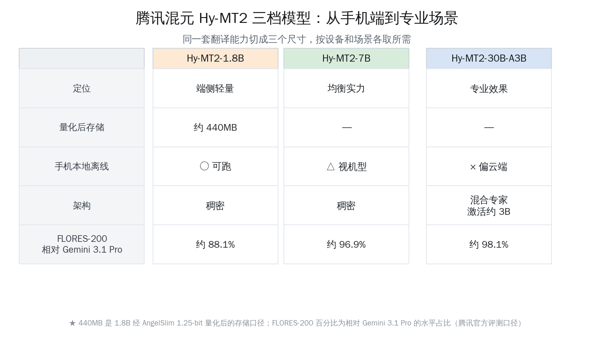
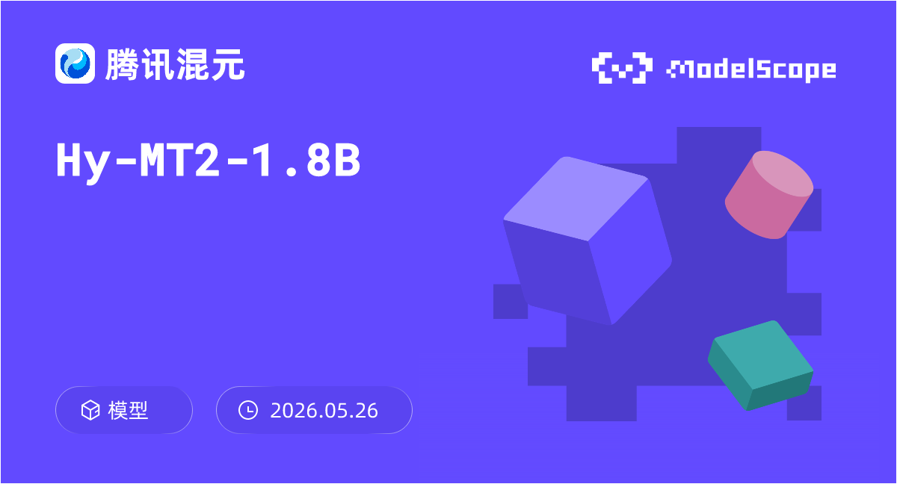
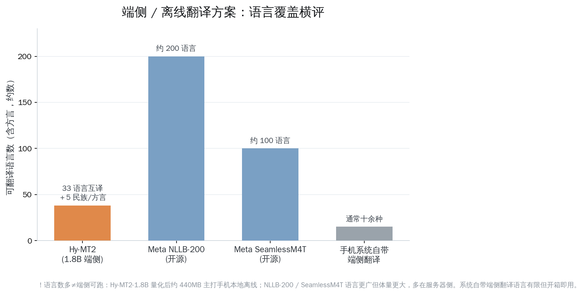

# 腾讯混元 Hy-MT2：440MB 塞进手机的离线翻译模型

一个能装进手机、断网也能用的翻译模型，体积只有 440MB——比很多人手机里一首无损音乐还小。这就是腾讯混元这次开源的 Hy-MT2-1.8B 留给人最直接的印象。

如果要用一句话说清楚 Hy-MT2 的意义：**端侧离线翻译正在从「能用」迈向「能替代云端商业接口」，而把 1.8B 模型压到 440MB、塞进手机本地跑起来，是这条路上一个清晰的拐点。** 过去我们默认「好用的翻译要联网、要调云端接口」，现在这个默认假设第一次被认真挑战了。

下面这篇文章就围绕这一个判断展开：440MB 是怎么做到的、离线翻译到底在什么场景里真正值钱、海外同类方案摆在一起怎么比、三档模型该怎么选。

## Hy-MT2 这次开源了什么

先把这次发布的全貌交代清楚。腾讯混元在 2026 年 5 月 21 日开源了全新一代翻译模型 Hy-MT2，同时上线了配套的小程序「腾讯Hy翻译」，支持语音输入和离线翻译。

模型一次给了三个尺寸，覆盖从手机端到专业场景的不同需求：

- **Hy-MT2-1.8B**：端侧轻量档，量化后约 440MB，主打手机本地离线
- **Hy-MT2-7B**：均衡档，效果和体量取中间
- **Hy-MT2-30B-A3B**：专业效果档，采用混合专家（MoE）架构，每次推理动态激活约 3B 参数，在接近 30B 翻译质量的同时，显存消耗与 7B 模型相当

语言覆盖方面，Hy-MT2 支持 33 种语言互译，另外还支持 5 种民族语言与方言互译，方言里明确包含粤语、闽南语等国内日常会用到的语种。对一个翻译模型来说，国内民族语言和方言的支持往往是海外开源模型最薄弱的一环，这一块的加入很务实。

模型权重已经在 GitHub、HuggingFace、ModelScope（魔搭）等平台同步开放，硬件适配也做得比较广——官方说明 1.8B 量化版本可以在苹果、高通、联发科等主流手机芯片上流畅运行。

这一节的核心结论就一句：Hy-MT2 不是单点放一个模型，而是用同一套翻译能力切出三个尺寸，把「手机端离线」和「服务器侧专业翻译」一次性都覆盖了。

## 440MB 是怎么做到的

最值得聊的工程细节，是 1.8B 模型怎么被压到 440MB 的。

一个 1.8B 参数的模型，如果按常见的半精度（每个参数 2 字节）存放，光权重就要约 3.6GB；即便用常见的 4-bit 量化（每个参数 0.5 字节），也还要约 900MB 上下。440MB 对应的平均位宽明显比 4-bit 更激进。

腾讯混元给出的答案是 **AngelSlim 1.25-bit 极致量化**。简单说，量化就是用更少的比特数来近似存储原本占用更多空间的模型参数——位宽越低，体积越小，但精度损失的风险也越大。1.25-bit 意味着平均每个参数只用一个多比特来表示，这是相当靠近极限的压法。

把它放进一个直观对照里更好理解：

| 存放方式 | 每参数位宽 | 1.8B 模型约占 | 手机本地可行性 |
|---|---|---|---|
| 半精度 FP16 | 16 bit | 约 3.6GB | 偏吃力 |
| 常见 4-bit 量化 | 4 bit | 约 900MB | 视机型 |
| AngelSlim 1.25-bit | 约 1.25 bit | **约 440MB** | 适合手机本地 |

> 上表中半精度与 4-bit 的体积是按位宽换算的常规估算，用来理解 440MB 的位置；440MB 为腾讯混元官方给出的 1.8B 量化版本存储口径。

极致量化最怕的就是「压得下去但翻得变味」。Hy-MT2 的处理是把这套量化方案和模型本身一起调，而不是事后硬压。官方口径里有两个数字可以参照效果：一是 1.8B 量化版相比上一代 Hy-MT1.5，推理速度提升约 1.5 倍；二是腾讯官方自评，1.8B 这一档的翻译效果「超越了微软等主流商业接口」。

这里需要诚实地标注一句：**「1.8B 超越微软等主流商业接口」是腾讯官方的自评口径，不是第三方独立实测结论。** 它代表厂商对自家模型的信心，读者真正落到自己场景时，最好还是拿自己常用的语种和文本类型亲自试一遍。同样地，外界此前关于 Hy-MT 系列「1GB 内存流畅运行、每 50 个 token 平均 0.18 秒」这类更细的运行指标，来自上一代 Hy-MT1.5 的报道，本次 Hy-MT2 的公开说明里并未重新给出对应数字，所以我们不把它直接套到 Hy-MT2 头上。

这一节记住一个结论就够：440MB 不是简单粗暴地砍精度，而是 1.25-bit 量化方案与模型协同调出来的结果，目标很明确——让 1.8B 真正跑进手机本地。

## 离线翻译，在什么场景里真正值钱

聊技术之前，得先回答一个更实际的问题：手机上明明已经有那么多联网翻译应用了，一个离线模型到底解决了谁的痛点？

答案藏在「没有网络」「不想上传」「语种偏门」这几类真实场景里。

**第一类，无网络或弱网络环境。** 出国落地、还没买到当地电话卡的那几个小时；地铁、地下停车场、高铁穿隧道；偏远地区徒步、登山。这些时刻恰恰是最需要翻译、却最连不上云端的时候。一个本地离线模型，等于把翻译能力随身揣在兜里，不看网络脸色。

**第二类，隐私敏感的内容。** 把合同条款、医疗报告、内部文档丢进联网翻译，文本会离开你的设备上传到服务器。对一部分人和场景来说，这是不能接受的。端侧离线翻译的全部计算都发生在本机，文本不出手机，这一条对隐私敏感用户的价值是实打实的。

**第三类，民族语言与方言。** 粤语、闽南语这类语种，在很多海外开源翻译模型里要么不支持，要么质量很弱。Hy-MT2 把 5 种民族语言/方言纳进来，对应的是国内真实存在、又长期被主流翻译工具忽略的需求。

把这三类场景列在一起看，离线翻译的价值就很清楚了：

- **出国 / 弱网**：随身可用，不依赖网络和当地流量
- **隐私优先**：文本留在本机，敏感内容不上传
- **民族语言 / 方言**：补上主流工具的覆盖空白
- **成本与稳定**：本地推理，不计调用次数、不受云端接口波动影响

这一节的结论：离线翻译不是联网翻译的「降级备份」，它在「没网、不想传、语种偏」这三类场景里是更优解，而 440MB 的体量让这种更优解第一次变得人人手机可装。

## 海外同类方案，摆一起怎么比

要判断 Hy-MT2 端侧路线的分量，得把海外几条主流路线拉到同一张桌子上对照。这里主要看三个维度：模型大小、语言覆盖、离线能力。

先看几条有代表性的对位方案：

- **Meta NLLB-200**：开源多语言翻译模型，主打超广语言覆盖，支持约 200 种语言，其中包含大量低资源语种。语言数遥遥领先，但完整模型体量大，更多跑在服务器侧。
- **Meta SeamlessM4T**：开源的语音文本一体化翻译模型，语言覆盖约 100 种，强项在语音翻译，体量同样偏大。
- **手机系统自带端侧翻译**（如 Google Gboard 的端侧翻译、苹果设备端翻译）：最大优点是开箱即用、深度集成在系统里，离线包下载后本地运行；但支持语种通常只有十余种，且能力被框定在系统给定范围内。

把它们和 Hy-MT2 放进同一张表：

| 方案 | 厂商 | 语言覆盖 | 离线能力 | 端侧体量定位 |
|---|---|---|---|---|
| Hy-MT2-1.8B | 腾讯混元（国内） | 33 语言互译 ＋ 5 民族/方言 | 支持手机本地离线 | 约 440MB，主打端侧 |
| NLLB-200 | Meta（美国） | 约 200 语言 | 开源可自部署 | 完整版偏大，多在服务器 |
| SeamlessM4T | Meta（美国） | 约 100 语言 | 开源可自部署 | 体量偏大，强项语音 |
| 系统自带端侧翻译 | Google / 苹果（美国） | 通常十余种 | 系统级离线 | 开箱即用，语种受限 |

对照下来能看出几个清楚的位置关系：

- **语言覆盖的广度**，NLLB-200 是绝对第一梯队，这是 Meta 在低资源语言上长期投入的结果，Hy-MT2 不在同一个量级上比这个数。
- **「既能离线、又是开源完整模型、还能装进手机」** 这个组合，恰恰是 Hy-MT2-1.8B 的差异化位置：系统自带翻译离线但语种少、不开源；NLLB-200 / SeamlessM4T 开源但体量大、更适合服务器。
- **民族语言与方言**，是 Hy-MT2 相对海外方案的一块实在补位。

需要点明一句：**语言数多并不等于端侧能跑。** NLLB-200 支持约 200 种语言固然惊人，但完整模型的体量决定了它更适合云端和服务器，普通用户很难把它装进手机日常用。Hy-MT2-1.8B 反过来，先把「装得进手机、断网能用」这件事做扎实，再在 33 语言加民族方言这个务实范围里把质量做好。

这一节的结论：横评下来，Hy-MT2 走的不是「比语言最多」的路，而是「在手机能装下的体量里，把离线翻译做到可用、够用」——这正好对上了前面说的那个拐点。

## 三档模型，该怎么选

最后落到最实际的问题：1.8B、7B、30B-A3B 三个尺寸，到底该用哪个。

判断标准其实很简单，先看你的翻译发生在哪儿、对质量要求多高：

- **手机本地、要离线、对随身和隐私敏感** → 选 **1.8B**。440MB 体量是它唯一能塞进手机本地的尺寸，出国、弱网、隐私文本这些场景都靠它。
- **本地有一定算力（如电脑、边缘设备），想要更稳的质量又不想上太大模型** → 选 **7B**。它在体量和效果之间取平衡，FLORES-200 评测里相对 Gemini 3.1 Pro 的水平占比明显高于 1.8B。
- **服务器侧、追求专业级翻译质量、术语和格式要求严** → 选 **30B-A3B**。混合专家架构让它在接近 30B 质量的同时，显存消耗压到和 7B 相当，是这套里翻译效果的天花板。

用一张决策表收拢：

| 你的情况 | 推荐尺寸 | 关键理由 |
|---|---|---|
| 手机随身、离线优先、隐私敏感 | Hy-MT2-1.8B | 约 440MB，唯一可手机本地离线 |
| 本地有算力、要质量也要轻便 | Hy-MT2-7B | 体量与效果平衡，质量明显上一档 |
| 服务器侧、专业级翻译 | Hy-MT2-30B-A3B | MoE 激活约 3B，质量接近 30B、显存近 7B |

关于翻译质量的相对位置，官方在 FLORES-200 通用翻译能力评测里给了一组参照：三档模型相对当前行业表现最好的翻译模型 Gemini 3.1 Pro，水平占比分别约为 88.1%、96.9%、98.1%。需要说明，这是腾讯官方给出的评测口径，且 FLORES-200 是通用翻译能力的一种衡量，真实场景里的体感还要看具体语种和文本类型。官方也提到，Hy-MT2 这一代提升最大的是指令遵循能力——它能更准确地按用户对术语、风格、输出格式的要求来翻译，这一点在专业翻译里往往比单纯的分数更有用。

这一节记住一句话：**离线随身用 1.8B，本地求稳用 7B，服务器求精用 30B-A3B**，三档各有明确的归位，不必纠结。

## 写在最后

回到开头那个判断：端侧离线翻译正在从「能用」走向「能替代云端商业接口」，而 1.25-bit 极致量化把 1.8B 压到 440MB、装进手机，是这条路上一个清晰的拐点。

Hy-MT2 的价值，不在于某一个尺寸跑分多高，而在于它把「好翻译必须联网」这个我们用了很多年的默认假设，认真地往前推了一步。当一个开源、可离线、装得进手机的翻译模型摆在面前，出国的人、注重隐私的人、需要民族语言和方言的人，第一次有了一个不依赖网络也不上传文本的踏实选择。

更让人有底气的是，这件事是国内团队做出来的，权重大大方方地开源在 GitHub、HuggingFace、魔搭上，任何开发者都能下载、能改、能装进自己的应用里。从极致量化到民族语言覆盖，每一处都踩在真实需求上。我们这一代开发者很幸运，能在这样一个工具越来越多、门槛越来越低的时候做事——把模型装进口袋这件事，正在变成理所当然。前面的路，值得期待。

---

参考来源：

- IT之家《腾讯混元全新翻译模型 Hy-MT2 开源：可在手机端本地部署，最小仅 440MB》：https://www.ithome.com/0/953/521.htm
- 量子位《腾讯混元开源全新翻译模型 Hy-MT2，上线小程序「腾讯Hy翻译」》：https://www.qbitai.com/2026/05/422068.html
- Hy-MT2-1.8B 模型卡（HuggingFace）：https://huggingface.co/tencent/Hy-MT2-1.8B
- Hy-MT2-1.8B 模型页（魔搭 ModelScope）：https://modelscope.cn/models/Tencent-Hunyuan/Hy-MT2-1.8B
