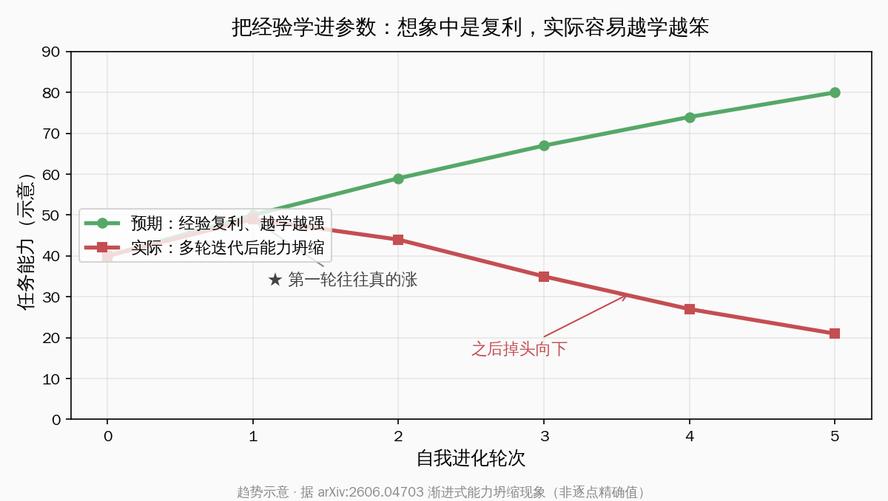
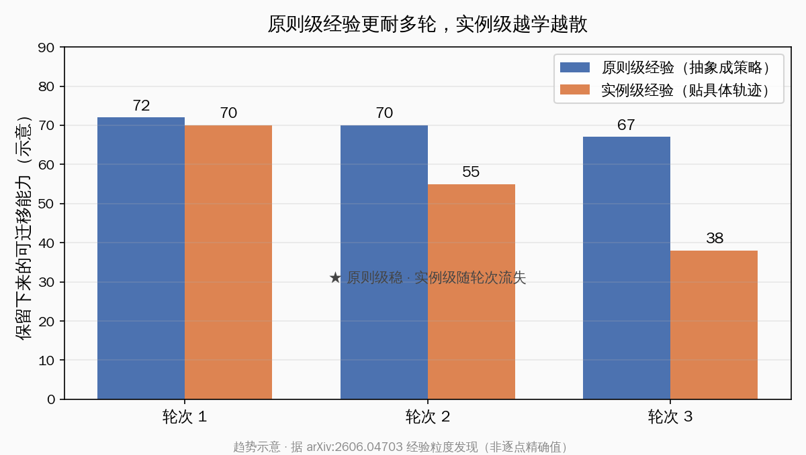
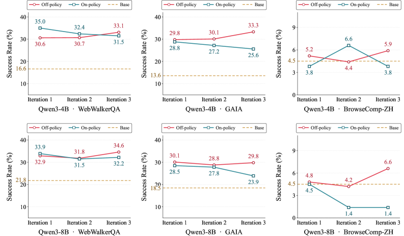
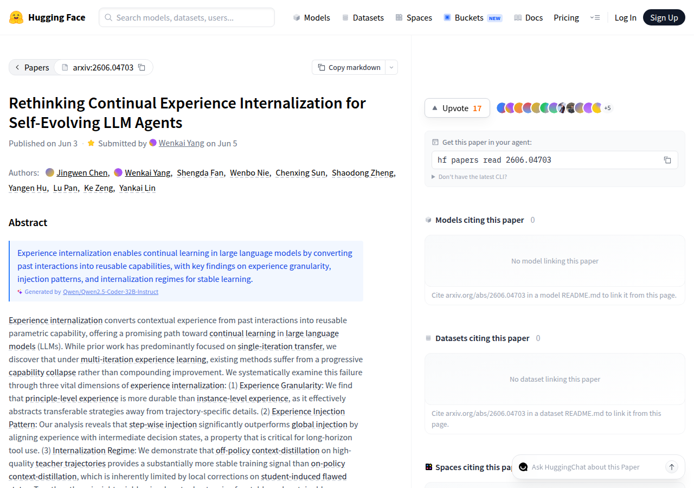

# 自进化 Agent 越学越笨？一篇论文给经验内化定下三条原则

让 Agent 把自己用过的经验学进参数里、下一轮变得更强，这件事听起来像复利——跑得越久，本金越厚。但一篇 6 月 3 日挂上 arXiv 的新论文给出了一个让人有点意外的结论：现有的「经验内化」方法在多轮迭代下，不是越学越强，而是出现「渐进式能力坍缩」，第一轮可能真的涨，再往后掉头向下。

这是人民大学高瓴人工智能学院、北京航空航天大学软件学院与美团团队的工作，题目叫《Rethinking Continual Experience Internalization for Self-Evolving LLM Agents》（重新审视自进化大模型 Agent 的持续经验内化，arXiv:2606.04703），目前挂在 HuggingFace Papers 的每日论文列表里。它的核心主张可以浓缩成一句话：**想让 Agent 靠经验自我进化又不退化，关键不是「学得多」，而是学「原则」而不是「实例」、按环节喂而不是整段灌、用好老师的轨迹而不是让学生自己纠错。** 这篇文章就围绕这一句话展开。

> 提示：这是一篇刚挂上 arXiv 四天、尚未经过同行评审的预印本。本文把它的发现都按「论文主张」对待，引用的是方向和原则，少数有原文表格支撑的数值会标明出处；示意曲线只复刻方向，不当成逐点精确值。

## 经验内化是什么：个人 Agent 长期记忆的那个终极想象

先把对象说清楚。论文研究的「经验内化」（experience internalization），指的是把 Agent 过往交互里积累的上下文经验，转换成可复用的参数能力——通俗讲，就是**把「用过、踩过、对过」的东西，从临时塞在上下文里，变成长进模型参数里的本事。**

为什么这么多人想要它？因为它正好戳中个人 Agent 最大的痛点。

- **上下文塞不下**：Agent 跑长任务，工具调用记录、中间状态、纠错过程一大堆，全堆在上下文里既贵又慢，迟早超窗口；
- **记忆要能带走**：今天这个会话学到的教训，明天换个会话最好还在，而不是每次从零开始；
- **越用越顺的预期**：理想状态是 Agent 像老员工，做得越多越熟练，经验自动复利。

把这三件事合起来，就是「自进化 Agent」（self-evolving agent）的终极想象：让模型自己把每一轮的经验消化进参数，下一轮起点更高，如此往复。这也是为什么「记忆压缩」「持久记忆」这类工具最近这么热——大家都在找一条让 Agent 把经验留下来的路。

经验内化是其中最激进的一条：不只是把记忆存在外部库里检索，而是直接改模型本身。听起来很美。论文要泼的那盆冷水，正是冲着这份「很美」来的。

## 渐进式能力坍缩：多轮迭代下，经验复利反成经验拖累

论文最反直觉的发现就在这张图的方向里：**把经验一轮轮内化进去，能力曲线不是向上复利，而是先涨后崩。**

过去大量工作只测了「单轮迁移」——内化一次经验，看一次涨没涨，结论往往是涨的，于是大家默认多轮也会一路向上。论文专门把这个假设放到多轮自我进化的场景里压测，用 Qwen3-4B-Instruct 和 Qwen3-8B 做学生模型，在 WebWalkerQA、GAIA-Text-103、BrowseComp-ZH 这三个偏网页检索与多步工具使用的基准上，连做三轮自我进化迭代，结果发现现有方法普遍出现「渐进式能力坍缩」（progressive capability collapse）。

把这个坍缩拆开看，有三层值得注意。

1. **第一轮的涨是真的**：单轮迁移确实有效，这也是过去论文乐观的来源——只看一轮，结论没错；
2. **问题出在「再往后」**：进入第二、第三轮，能力不再累加，反而开始倒退，越内化越退步；
3. **不是某一个方法的偶发**：论文把它当成现有内化范式的共性失败，而不是某个实现没调好。

这就把一个工程直觉打翻了：很多人默认「自进化就是把内化循环多跑几轮」，论文说，循环本身没问题，问题是循环里每一步怎么内化——内化方式不对，多跑几轮等于把错误一轮轮放大。

这一节的结论可以一句话带走：**经验内化的危险不在第一次，而在第 N 次；把它当复利来跑，很容易跑成负利。** 接下来论文做的，就是把「怎么内化才不坍缩」拆成三个维度逐个验证。

## 第一条线：学原则，别学实例

第一条线讲的是**经验的粒度**（experience granularity）：同样一段经验，你是把它整理成「可迁移的策略原则」，还是「贴着某条具体轨迹的实例」，结果差很远。

论文的主张是：**原则级（principle-level）经验比实例级（instance-level）经验更耐多轮迭代。**

两者的差别用大白话说就是：

- **实例级经验**：记住「上次这道题，我先调了搜索工具 A、再调了 B、第三步翻到第二页才找到答案」——它绑死在那条具体轨迹的细节上；
- **原则级经验**：从那次经历里抽出一条策略——「遇到信息分散的检索任务，先确认有没有现成工具能一步到位，没有再分步检索，别急着回答」——它把可迁移的策略，从轨迹的琐碎细节里剥出来。

为什么原则级更持久？论文的解释是，实例级经验带着太多「只在那一次成立」的细节，多轮内化时这些细节会互相打架、互相覆盖，越攒越乱；而原则级经验已经抽象成了通用策略，迁移到新任务时不容易冲突，所以一轮轮下来还站得稳。论文在 Qwen3-4B 上对比了经验粒度的影响，方向清楚：原则级在迭代中保留得更好。

这条线对做记忆型 Agent 的人尤其有共鸣。很多人的「经验库」其实就是一堆成功轨迹的回放——本质是实例级。论文提醒的是：**回放具体轨迹只是第一步，真正该留进参数的是从轨迹里抽出来的策略原则。** 你存的是「这次怎么做对的」，还是「这类问题该怎么想」，决定了它能不能扛过多轮。

## 第二条线：一步步喂，别整段灌

第二条线讲的是**经验的注入方式**（experience injection pattern）：同一段经验，是在任务开头整段灌给模型，还是在决策的每一步对齐着喂，效果差异同样明显。

论文的主张是：**逐步注入（step-wise）显著优于全局注入（global）。**

- **全局注入**：把经验在任务一开始整段塞进去，让模型「带着这段经验」从头跑到尾；
- **逐步注入**：把经验拆开，对齐到中间的每一个决策状态——走到这一步时，喂这一步该用的那部分经验。

为什么逐步更好？论文给的理由是，长程工具使用任务里，真正决定成败的是**中间每一步的决策状态**。整段灌进去的经验，模型在跑到第五步、第十步时早就「忘了前面那段话的重点」，甚至会因为开头那段经验太显眼而过早作答（论文专门给了「全局注入导致过早回答」的案例分析）。逐步注入把经验对齐到当下这一步该做的决策上，模型每一步都拿得到正确的提示。论文里，逐步注入在三个基准上都好过全局注入，其中 WebWalkerQA 的成绩从 23.2% 提升到 31.2%（论文主张，原文 Table 数值）。

这条线翻译成工程语言很实在：**经验不是开场白，是导航。** 你不会在出发前把整条路线一口气背给司机听就指望他全程记住，而是到每个路口才提示该往哪拐。给 Agent 喂经验也一样——对齐到决策点，比一股脑塞在前面有用得多。

## 第三条线：跟好老师学，别老盯着自己的错改

> 图为论文中不同内化方式在多轮自我进化迭代下的表现对照。来源：arXiv:2606.04703 论文 Figure（HTML 版 v1）

第三条线讲的是**内化机制**（internalization regime）：经验内化在论文里用的是「上下文蒸馏」（context-distillation）——把上下文里的经验蒸馏进模型参数。问题是，蒸馏的训练信号从哪来。

论文的主张是：**在高质量教师轨迹上做 off-policy 上下文蒸馏，比 on-policy 上下文蒸馏提供更稳定的训练信号。**

这里有两个术语要先讲清楚：

- **on-policy（同策略）上下文蒸馏**：学生模型自己先跑一遍，在它自己跑出来的（往往有缺陷的）状态上做局部纠正——相当于让学生在自己的错题上打补丁；
- **off-policy（异策略）上下文蒸馏**：直接在一批高质量的教师轨迹上学——相当于让学生临摹好范本。

论文为什么更看好 off-policy？因为 on-policy 的训练信号天生受限于「学生自己制造出来的有缺陷状态」——学生本来就在退化，你还让它在自己退化出来的状态上自我纠错，等于让一个走偏的人靠自己把自己掰回来，纠偏的力度有限，还容易把偏差越滚越大。这恰好对上了前面「渐进式能力坍缩」的病根：多轮 on-policy 内化，就是让模型一轮轮在自己越来越差的轨迹上学，越学越歪。

而 off-policy 用的是稳定的高质量教师轨迹，每一轮的「学习目标」都是干净的，不会被学生自己的退化带跑。论文在多轮自我进化迭代里对比了两种机制，结论是 off-policy 给出的训练信号明显更稳。

这一节的判断可以这么记：**让 Agent 自我纠错听起来很自主，但「自主」不等于「稳定」。** 在它还没站稳的阶段，给它一批好范本临摹，比让它对着自己的错卷自己，要靠谱得多。

## 三条线合起来：一份不坍缩的内化配方

> 图为该论文在 HuggingFace Papers 每日论文列表中的页面。来源：HuggingFace Papers（huggingface.co/papers/2606.04703）

把三条线并排放在一起，论文给出的其实是一份「让经验内化不坍缩」的配方。三条主张对应三个工程动作，整理成一张表：

| 维度 | 容易坍缩的做法 | 论文推荐的做法 | 为什么更稳 |
|---|---|---|---|
| 经验粒度 | 实例级：记住具体轨迹细节 | 原则级：抽出可迁移策略 | 多轮迭代不互相打架 |
| 注入方式 | 全局：开头整段灌 | 逐步：对齐到每个决策状态 | 长程任务每步都对得上 |
| 内化机制 | on-policy：在自己缺陷状态上纠错 | off-policy：在高质量教师轨迹上学 | 训练信号干净不被退化带偏 |

这三条不是孤立的小技巧，它们指向同一个底层判断：**经验内化坍缩的根源，是把「太具体、太靠自己、太一次性」的信号一轮轮喂回了模型。** 原则级解决「太具体」，逐步注入解决「一次性整段灌」的对齐问题，off-policy 解决「太靠自己」。论文把这三条合起来跑最终设置，得到的是一条稳得多、能持续往上走的自我进化曲线——这也是它「重新审视」这个标题的底气所在。

值得一提的是，这套验证用的学生模型正是国内开发者最熟的 Qwen3 系列，基准里还专门包含了中文检索任务 BrowseComp-ZH。对想动手复现的人来说，门槛不算高。

## 和「记忆压缩 / 持久记忆」其实是一体两面

如果你最近在关注记忆型 Agent，会发现这篇论文和「记忆压缩」「持久记忆」这一类工具，讲的是同一件事的两个面。

- **持久记忆工具**关心的是：怎么把经验**存下来、带得走、检索得到**——经验放在外部，用的时候捞回来；
- **经验内化**关心的是：怎么把经验**学进参数、长成本事**——经验直接改模型。

两条路看着不同，撞上的却是同一堵墙：**经验不是越多越好，攒法不对，反而会让 Agent 变笨。**

做持久记忆的人早就体会过这件事——记忆库越塞越满，检索反而越来越不准，无关的旧记忆把当前任务带偏，这是记忆系统的老问题。论文等于从参数内化这一侧，给同一个现象补了一份更硬的证据：哪怕你把经验直接学进参数，只要粒度太碎、对齐太粗、信号太脏，多攒几轮照样退化。

国内这两年做记忆型、自进化 Agent 的团队不少，从开源记忆框架到带长期记忆的个人助手，大家都在解「让 Agent 记住并越用越顺」这道题。这篇论文的价值，在于把「越用越顺」这个朴素愿望背后的陷阱拆开摆清楚了——它不替任何人下结论该怎么做产品，但它把「想稳，得在粒度、对齐、信号三处都讲究」这件事，用可对照的实验讲明白了。

## 写在最后：自进化的稳，藏在「学什么」里

绕回开头那句话。让 Agent 把经验学进参数、自我进化，这个方向本身没有错，错的是把它想得太轻松——以为多跑几轮循环，能力就会自动复利。这篇来自国内团队的论文，最有价值的地方不是泼冷水，而是泼完冷水之后，把「怎么才不坍缩」的三条线清清楚楚定了下来：**学原则别学实例，一步步喂别整段灌，跟好老师学别死盯自己的错。**

对每天在搭 Agent、调记忆、试自进化的人来说，这三条都不抽象。下次你给 Agent 设计经验回放或记忆积累时，可以拿它当一份现成的检查清单：我存的是策略还是流水账？我是在决策点喂还是开场一股脑塞？我的学习信号是干净的范本还是模型自己越跑越歪的轨迹？把这三处想清楚，自进化才有机会真的往上走，而不是绕一圈回到原点。

自进化 Agent 仍然是个值得长期下注的方向。难的从来不是让模型学得多，而是让它学得稳——而这篇论文恰好告诉我们，稳，是有章法可循的。

### 参考资料

- 论文 abstract：[Rethinking Continual Experience Internalization for Self-Evolving LLM Agents（arXiv:2606.04703）](https://arxiv.org/abs/2606.04703)
- 论文全文 HTML 版：[arxiv.org/html/2606.04703v1](https://arxiv.org/html/2606.04703v1)
- HuggingFace Papers 页：[huggingface.co/papers/2606.04703](https://huggingface.co/papers/2606.04703)
