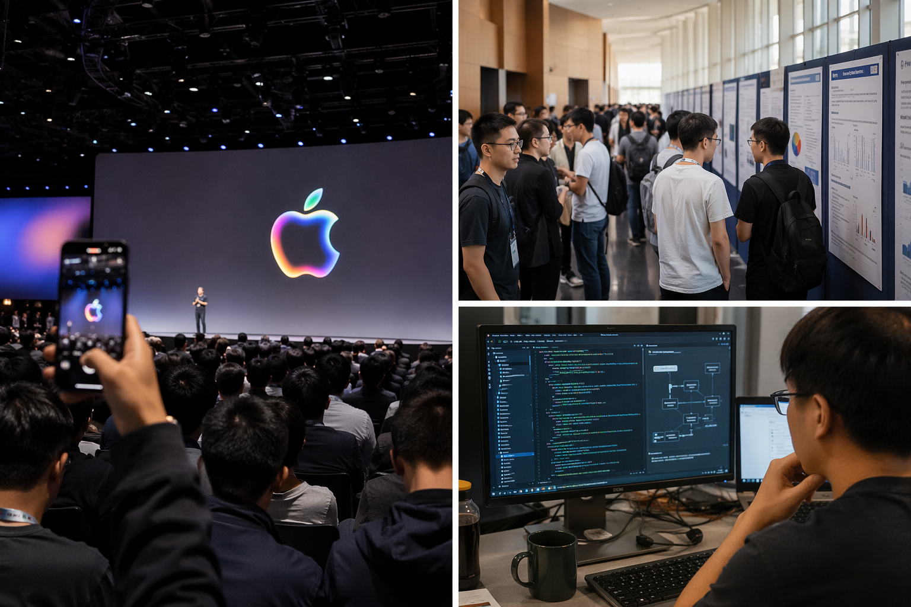
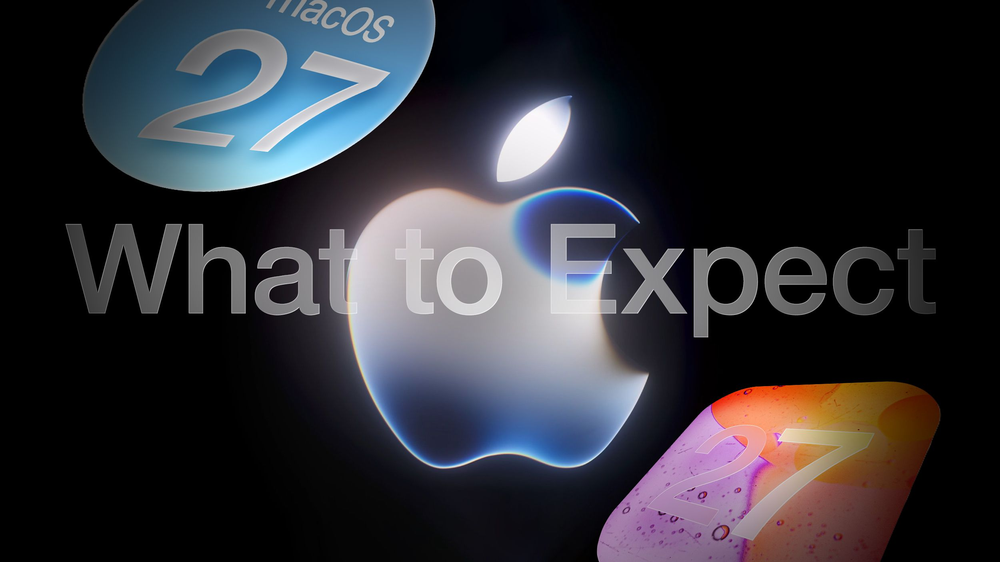
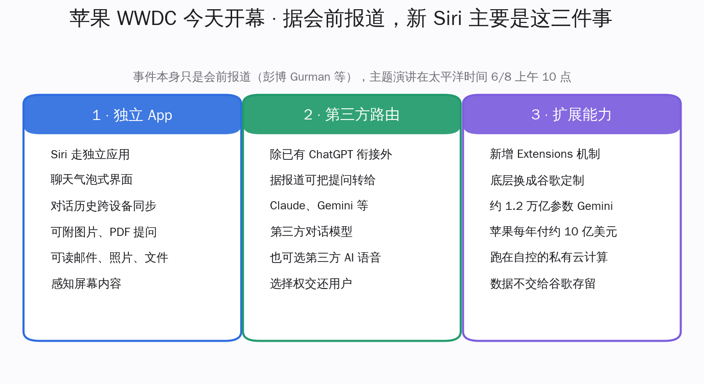
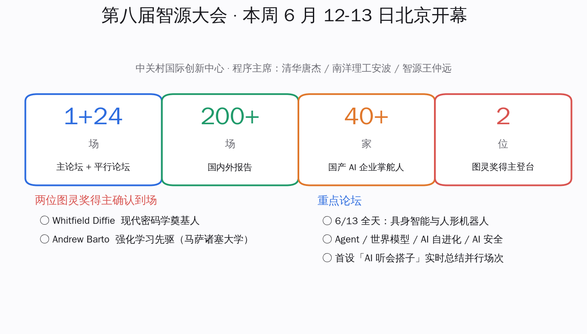
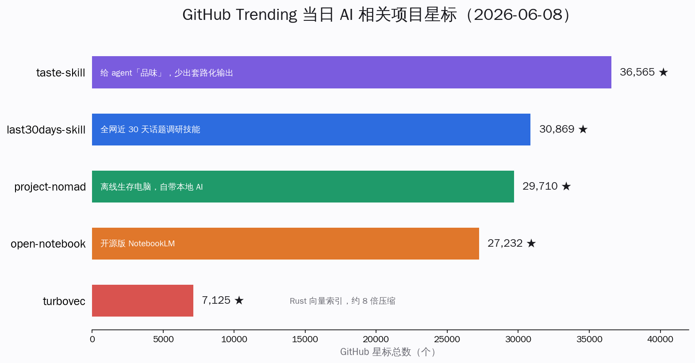
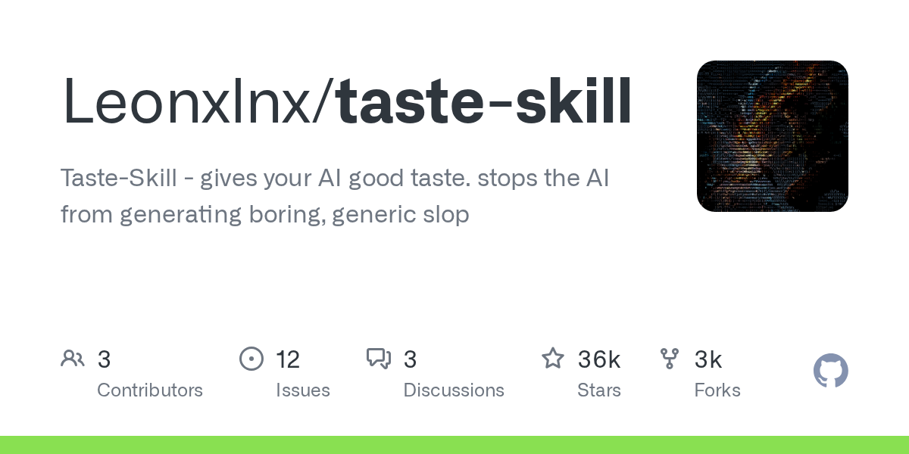
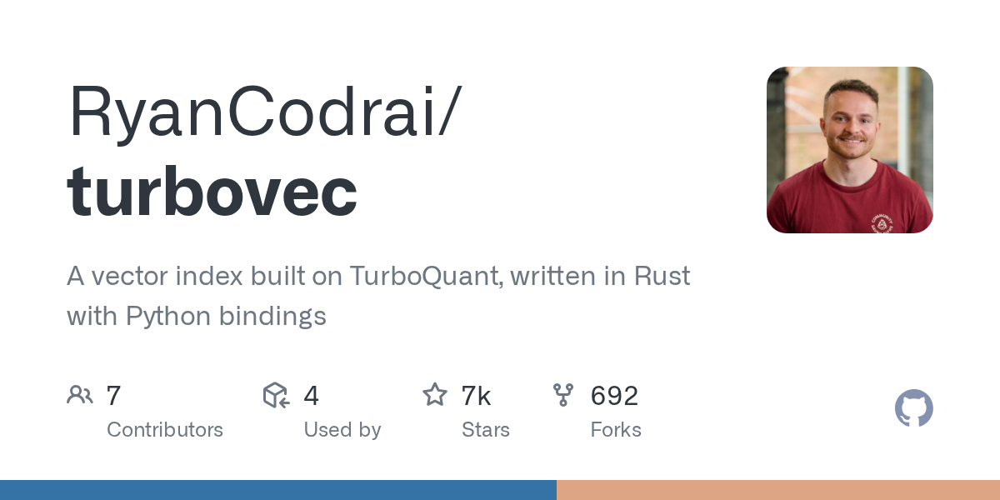
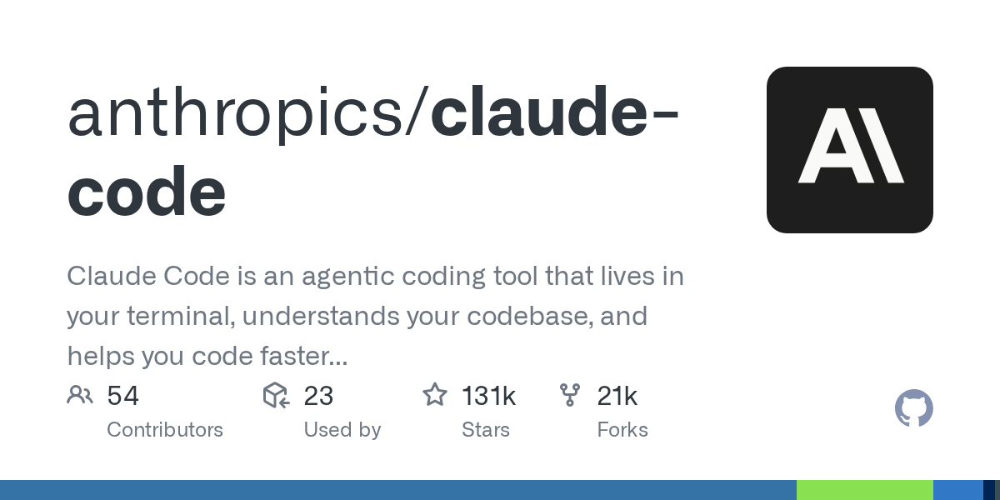

# 苹果 WWDC 今天揭新 Siri 接谷歌 Gemini · 智源大会本周登场 · 开发者忙着给 Agent 配技能和沙箱 | AI 日报 | 2026-06-08

## 📋 头版目录

- 🍎 苹果全球开发者大会 WWDC 今天开幕，主题演讲在太平洋时间上午 10 点 → 头条 1
- 🧠 据会前报道，重做的 Siri 走独立 App、聊天气泡界面、对话历史跨设备同步 → 头条 1
- 🛠 新 Siri 据报道可把提问转给 Claude、Gemini 等第三方模型，选择权交还用户 → 头条 1
- 💰 底层换成谷歌定制约 1.2 万亿参数 Gemini，苹果每年付约 10 亿美元、跑在私有云计算 → 头条 1
- 🇨🇳 第八届智源大会本周 6 月 12-13 日在北京开幕，1 场主论坛加 24 场平行论坛 → 头条 2
- 🇨🇳 集结 200 多场报告、40 多家国产 AI 企业掌舵人，两位图灵奖得主登台 → 头条 2
- 🤖 智源大会具身智能与人形机器人论坛排满 6 月 13 日全天 → 头条 2
- 🛠 GitHub 榜这两天霸屏的不是模型，是给 Agent 配技能的 taste-skill、last30days-skill → 头条 3
- 🔬 Simon Willison 发布 micropython-wasm，把不可信的模型生成代码塞进 WASM 沙箱跑 → 头条 3
- 🧠 NVIDIA Cosmos 3 发布，做面向物理 AI 的全模态世界模型 → 精选要闻
- 🧠 谷歌 Gemini 3.5 Pro 临近发布、据报 200 万 token 上下文，但仍未正式上线 → 快讯
- 💸 Anthropic 6 月 1 日向美国证监会保密递交招股书草案，IPO 进程启动 → 精选要闻
- 🇨🇳 MiniMax M3 编程评测 59.0% 居开源前列，开源权重本周放出 → 国内 AI
- 🇨🇳 百度 PaddleOCR-VL-1.6 发布，主攻文档解析精度 → 国内 AI
- 🇨🇳 DeepSeek V4 正式版定档三季度，当前在用的是 4 月 24 日预览版 → 快讯
- 🔥 taste-skill 约 3.66 万星、last30days-skill 约 3.09 万星，「Agent 技能」一类持续霸榜 → GitHub Trending
- 🔥 Rust 向量索引 turbovec 约 7100 星，号称约 8 倍压缩、本地 RAG 省内存 → GitHub Trending
- 🛠 Claude Code 连发 v2.1.166-168，跨会话消息不再带用户权限、deny 规则支持通配符 → AI Coding
- 🛠 Cline v3.88 默认模型换成国产 Kimi K2.6，修好 MCP 配置被清空的问题 → AI Coding
- 📰 Yann LeCun 用两篇实证给「世界模型优于大语言模型」的判断加码 → 名人说

## 🔥 头条深度

### 头条 1 · 苹果今天开 WWDC，新 Siri 据报道要走独立 App、还能转给 Claude

> 来源：MacRumors [1]，TechTimes [2]

苹果的全球开发者大会 WWDC 今天开幕，主题演讲安排在太平洋时间 6 月 8 日上午 10 点 [1]。昨天这份日报已经讲过这场大会会前最受关注的那条线——重做的 Siri 大概率要靠一个外部模型来撑，而这个模型来自谷歌。今天是揭晓的日子，会前最后一批报道把新 Siri 的形态描得更具体了，有几处对每天用 AI 工具的人来说尤其值得记一笔。**注意：以下除大会时间与系统版本号外，均为彭博记者 Mark Gurman 等的会前报道，不是苹果的官方确认，今晚主题演讲才会见分晓。[跟进]**

#### 头条 1.1 · 新 Siri 据报道会变成一个能聊天、能读你东西的独立应用

据 MacRumors 汇总的会前报道，新 Siri 的变化集中在三块 [1]：

- **独立 App、聊天式界面**：Siri 据报道会有一个独立应用，输入栏支持文字和语音，可以附上图片、PDF 提问，界面用类似 iMessage 的聊天气泡，对话历史通过 iCloud 在多设备间同步。换句话说，它从一个「按一下问一句」的语音助手，变成一个能留住上下文的对话窗口。
- **能读你的个人内容、感知屏幕**：据报道，新 Siri 可以在授权下读取邮件、照片、文件等个人内容，并能感知当前屏幕上有什么，从而完成更跨应用的操作。
- **可以把问题转给第三方模型**：这是最值得开发者注意的一条——除了已有的 ChatGPT 衔接，iOS 27 据报道允许用户把提问转交给 Claude、Gemini 等第三方对话模型，甚至可以选用第三方的 AI 语音。把「用哪家模型回答」的选择权交还用户，对一台出货十几亿的设备来说，分量不小。

#### 头条 1.2 · 底层那个模型，是谷歌为苹果单独训的

新 Siri 云端那层智能，据彭博报道由谷歌为苹果定制的一个 Gemini 模型驱动 [2]。几个会前流传的关键数字，框定了这桩合作的分量：

- **约 1.2 万亿参数的定制 Gemini**：谷歌为苹果专门训练，采用混合专家结构，每次回答只激活其中一部分参数。
- **每年约 10 亿美元**：苹果为这个模型向谷歌支付的费用量级。值得记一笔的是资金流向——过去长年是谷歌付钱给苹果买搜索默认位，这次钱是反过来流动的。
- **跑在苹果自控的私有云计算上**：据报道模型运行在苹果自己掌控的私有云计算服务器上，苹果一贯的姿态是可以借别人的模型能力，但要把数据留在自己能管的边界里，不交给谷歌存留。

需要提醒的是，关于这个模型到底跑在谁的机房，不同会前报道之间存在出入，今晚之前都不算定论。对关注前沿模型格局的人，这件事的分量不在 Siri 本身好不好用，而在一个信号：连苹果这样有钱、有数据、有分发能力的公司，也选择不自己从头训一个最强的对话模型，而是付钱用别人的。前沿模型的「分发权」第一次这么直白地摆上桌面。

### 头条 2 · 智源大会本周在北京开幕，两位图灵奖得主和 40 多家国产 AI 掌舵人同场

> 来源：智源大会官网 [3]，量子位 [4]，智源社区 [5]

如果说苹果那条线讲的是「一家公司怎么借别人的模型」，那国内这一周最值得标记的，是一场把学界和产业摆到一起的大会。第八届北京智源大会本周 6 月 12-13 日在中关村国际创新中心举办，程序主席是清华唐杰、南洋理工安波和智源研究院院长王仲远 [3]。

#### 头条 2.1 · 这届大会的规模和到场阵容

这届大会把学界和产业摆到了同一张桌子上 [3][4]：

- **1 场主论坛 + 24 场平行论坛**：覆盖 Agent、世界模型、具身智能、AI 自进化、AI 安全等方向。
- **200 多场报告**：国内外研究者同场分享。
- **40 多家国产 AI 企业掌舵人**：阿里、腾讯、智谱等公司的 CEO、联合创始人或首席科学家到场。
- **两位图灵奖得主登台**：现代密码学奠基人 Whitfield Diffie，以及强化学习先驱、马萨诸塞大学的 Andrew Barto。

一个细节能看出主办方的心思：这届首次部署了一个「AI 听会搭子」，在多场平行论坛同时进行时，实时帮与会者总结跟不过来的那些场次。把 Agent 用在自己的会上，比讲一百页 PPT 更直接。

#### 头条 2.2 · 真正值得盯的是 6 月 13 日那一整天的具身智能

对关注机器人和具身方向的人，这届大会的重头戏排在 6 月 13 日——具身智能与人形机器人论坛占满全天 [5]。论坛由银河通用的王鹤和智源的王鹏伟共同主持，讲者包括清华高阳（千寻智能）、灵心巧手的夏华夏、上海创智学院的罗剑岚等一线团队。

放在最近的节奏里看，这条线接得上前几天的几件事：上个月英伟达开源人形机器人本体里有宇树的身影，本周智源又把国内具身一线的人集中拉到一个论坛。模型这边大家拼得难分高下，具身这边国内反而攒出了一条从本体到算法都有人做的完整队伍，这一整天的议程会是观察这条队伍成色的好窗口。

### 头条 3 · 模型趋同之后，开发者忙的是给 Agent 配「技能」和圈一个安全沙箱

> 来源：Simon Willison 博客 [6]，GitHub [7][8][9]

把这两天 GitHub 趋势榜拉出来看，会发现一件有意思的事：霸屏的不是哪个新模型，而是两类「围着模型做工程」的东西。一类是给 Agent 配技能的仓库，一类是给 Agent 圈安全执行环境的工具。这正好接上昨天那条主线——当模型本身的差距缩小，开发者的注意力就从「换哪个模型」转向「给模型补什么」。

#### 头条 3.1 · 「Agent 技能」一类仓库，在榜上待了快两周还没下来

榜单前排，是 taste-skill（约 3.66 万星 [7]）和 last30days-skill（约 3.09 万星 [8]）这类仓库。它们不训模型，而是给 Claude Code 这样的 Agent 配一套可以即插的「技能」：

- **taste-skill** 做的事是给模型一点「品味」，让它别老输出那种一眼就能看出是套路的内容。
- **last30days-skill** 是一套调研技能，让 Agent 自己去 Reddit、X、YouTube、Hacker News 和网页上把某个话题近 30 天的动态扒一遍，再综合成一份有出处的结论。

这类仓库不是这两天才冒出来的，但能在榜上待住快两周，说明开发者真的在用「技能」这一层做事——模型是发动机，技能是你给它装的工具箱，谁的工具箱顺手，活就干得快。

#### 头条 3.2 · 另一头，是给 Agent 圈一个跑代码不出事的沙箱

同一时间，LLM 工具圈的 Simon Willison 在 6 月 6 日发布了 micropython-wasm 的早期版本，外加一个配套插件，解决的是另一个让人头疼的问题：Agent 生成的代码，怎么安全地跑起来 [6]。

它的做法是把一个精简版 Python 编译进 WebAssembly，让模型生成的、来路不明的代码在一个隔离的 WASM 沙箱里执行——跑得出结果，但碰不到你的文件系统和网络。这条思路最近反复出现：上周还有人在讨论 Codex 自己摸索绕过权限的事，安全执行就成了绕不开的一环。技能层让 Agent 会干更多事，沙箱层保证它干的时候不闯祸，两件事其实是一体两面。

## ⚡ 快讯速览

- **DeepSeek V4 正式版定档三季度，澄清一个时间点**：顺手纠正一个流传的说法——DeepSeek V4 的正式版按官方计划是 2026 年三季度推出，并非本月 [18]。当前大家在用的是 4 月 24 日发布并开源的预览版，含 V4-Pro（总参约 1.6 万亿、激活约 49B）和经济档 V4-Flash（总参约 2840 亿、激活约 13B），首次把百万 token 上下文设成标配，并明确适配华为昇腾。待观察的是正式版会不会把价格和长上下文档位再往下压一档。

- **谷歌 Gemini 3.5 Pro 临近发布但仍未上线**：据 TechTimes 报道，谷歌在 5 月的 I/O 上预告的 Gemini 3.5 Pro 正接近发布，预期带 200 万 token 上下文和 Deep Think 推理模式，但截至目前尚未正式开放，只在内部和有限的云端预览里用，Flash 档则已经在 Gemini App 和搜索里铺开 [17]。在苹果都要借 Gemini 撑 Siri 的当口，谷歌自家最强一档迟迟不发，本身就是个信号。待观察的是它选在哪个时点放量、正式发布日期是否还在本月。

## 🎙 名人说 & X 热议

### Yann LeCun 又用两篇实证，给「世界模型优于大语言模型」加码

Meta 首席 AI 科学家 Yann LeCun 长期看空纯大语言模型这条路，最近被翻出来讨论的两篇预印本，给他的判断添了具体证据 [20]。

一篇叫 Stable-Worldmodel 的评测发现：一个在干净条件下成功率约 50% 的模型，一旦把场景里智能体的颜色换掉，成功率掉到约 12%；把背景换掉，掉到约 6%。作者的结论是——「预测得准」并不等于「规划得好」，光看预测精度会高估一个模型真正的能力。另一篇关于可辨识性的论文则说明，在高斯隐变量、平稳、充分探索这些条件成立时，模型能把隐藏结构恢复到只差一个线性变换的程度。

把这两篇放一起看，LeCun 这一派想说的是：让模型学会「想象世界接下来会怎样」，可能比让它继续背更多文本更接近通用智能。这条路线分歧不新鲜，但有了可复现的数字，就不再只是口水仗。本周的智源大会也专门排了世界模型论坛，正好是国内同行下场的窗口。

## 📰 精选要闻

🔴 **Anthropic 向美国证监会保密递交招股书草案，IPO 进程启动**：据 Anthropic 官方声明，公司在 6 月 1 日向美国证监会（SEC）保密递交了 Form S-1 招股书草案，这给了它在 SEC 审核后选择公开上市的可能 [14]。官方明确：股票数量、价格、代码、交易所和时间表都尚未确定。需要说清的是，外界流传的约 9650 亿美元估值、约 470 亿美元年化收入是媒体估算，并不在官方文件里，引用时按「媒体估算」对待。这是头部 AI 实验室里第一家正式启动上市流程的，往后看它的招股书一旦公开，会第一次让外界看清一家前沿模型公司的真实账本。[跟进]

🟡 **NVIDIA Cosmos 3 把世界模型推向物理 AI**：英伟达发布 Cosmos 3，定位是面向物理 AI 的全模态世界模型，用混合 Transformer 架构同时吃多种数据模态，论文已上 arXiv（编号 2606.02800）[15]。它服务的是机器人、自动驾驶这类需要「在脑子里预演物理后果」的场景。这条线和学界对世界模型的押注是同一个方向，值得和本周智源大会的相关论坛对照着看。

## 🇨🇳 国内 AI 观察

🟡 **MiniMax M3 开源权重本周放出，编程评测居开源前列**：上周一（6 月 1 日）MiniMax 发布通用大模型 M3，采用自研的 MSA 稀疏注意力，主打编程、智能体和百万 token 长上下文，官方称在 SWE-Bench Pro 编程评测拿到 59.0%，在开源模型里居前 [19][21]。API 已先行上线，开源权重和技术报告据官方说法在发布后约十天内放出，时间窗正好落在本周。需要提醒的是这些分数是厂商自报、尚未经第三方独立复测，等权重放出后才好下结论。[跟进]

🟡 **百度 PaddleOCR-VL-1.6 主攻文档解析精度**：百度 PaddleOCR 系列上新文档解析模型，靠针对薄弱区域的精修和渐进式后训练把解析精度往上推，论文已上 arXiv（编号 2606.03264）[16]。对国内做 RAG、做企业知识库的团队，OCR 和版式解析这一层是真正每天在用的底子，这一档的进步比一个新对话模型更贴近实际使用。

## 📦 GitHub Trending

🔴 **taste-skill / last30days-skill — 「Agent 技能」一类持续霸榜**

taste-skill（约 3.66 万星 [7]）和 last30days-skill（约 3.09 万星 [8]）是这两天榜单前排的常客。前者给模型补「品味」、压住套路化输出，后者是一套全网近 30 天话题调研技能。两个都不是模型，是给 Claude Code 这类 Agent 即插即用的能力包——开发者用脚投票，投给了「技能层」。

🔴 **turbovec — Rust 向量索引，本地 RAG 省内存**

turbovec（约 7100 星 [9]）是一个 Rust 写的向量索引，带 Python 绑定，基于谷歌研究院在 ICLR 2026 提出的免训练量化方法 TurboQuant。它号称约 8 倍压缩——一个千万级文档的库，内存占用从 31GB 压到约 4GB，并接了 LangChain、LlamaIndex 等常用框架。对想在本地把 RAG 跑起来又被内存卡住的人，是个可以直接 fork 上手的选择。

🟡 **open-notebook / project-nomad — 开源版 NotebookLM 与离线本地 AI**

open-notebook（约 2.72 万星 [10]）是一个可自建的开源 NotebookLM 实现，给想把资料库握在自己手里的团队用；project-nomad（约 2.97 万星 [11]）则把工具、知识和一个本地 AI 打包成一台「离线也能用」的电脑，戳的是断网、隐私这些场景。两个项目都指向同一个偏好——把 AI 留在自己能管的边界内。

## 🛠 AI Coding 工具动态

- **Claude Code v2.1.166-168（6 月 6 日）**：主更新在 166，三件事对多会话协作的人有用 [12]。一是权限隔离——从别的 Claude 会话通过消息转发过来的请求，不再携带你本人的权限，接收方会拒绝转发来的授权请求，自动模式下直接拦截，等于堵住了「一个会话替另一个会话越权」的口子。二是 deny 规则现在支持通配符，写一个 `"*"` 可以一次性禁掉所有工具。三是调用模型遇到非预期错误时，会在备用模型上自动重试一次再放弃。另外修了 JetBrains 2026.1+ 终端闪烁、macOS 上后台进程偶发占满 CPU 等问题。

- **Cline v3.88（6 月 5-7 日）**：VS Code 端的 Cline 跳版到 v3.88，把默认模型换成了国产的 Kimi K2.6，并修好一个让人膈应的 bug——之前增删 MCP server 时，配置写入会触发文件监听把 MCP server 列表清空 [13]。默认模型选国产开源模型这件事本身值得记一笔，开源编程 Agent 的默认档正在被国产模型占住。

## 🔭 值得关注

- **WWDC 今晚揭晓后看什么**：今天的主题演讲过后，重点看三件会前报道能不能坐实——新 Siri 是不是真的开放给 Claude、Gemini 等第三方模型，开发者能拿到哪些新的 Apple Intelligence 接口，以及那个定制 Gemini 到底跑在谁的机房。明天这份日报会补跟进。

- **Gemini 3.5 Pro 何时真发**：谷歌最强一档预告已久仍未上线，在苹果都要借 Gemini 的当口，它的正式发布时间是观察谷歌前沿模型节奏的关键，是否本月还要再看官方口径。

- **Anthropic 上市进程**：保密递交 S-1 只是第一步，后续招股书一旦转公开版，会第一次披露一家前沿模型公司的真实收入与成本结构，是否会改变外界对 AI 实验室盈利能力的判断，待 SEC 审核后观察。

- **智源大会具身论坛成色**：6 月 13 日全天的具身智能与人形机器人论坛，集中了国内从本体到算法的一线团队，能否看出一条完整的国产具身路线，待会上议程展开后判断。

- **MCP 正式版进度**：模型上下文协议（MCP）核心转向无状态的候选版此前已发布，正式版定在 7 月底，是否如期、生态工具迁移是否顺利，仍需持续观察。

## ✍ 编辑说

- **苹果借 Gemini 撑 Siri / 关注**：如果你关注前沿模型的分发格局，今天这件事的意义不在 Siri 好不好用，而在于它把「连苹果都选择付费用别人的模型」这个信号摆上了桌面。读完这条，对你判断未来一年「模型公司和设备公司谁握住入口」这个问题，会多一个锚点。先等今晚主题演讲坐实再下结论。

- **智源大会 / 做技术储备**：如果你是做 Agent、世界模型或具身方向的研究者或工程师，本周这场大会的论坛议程和讲者名单值得提前扒一遍。它不是一条「今天就有用」的新闻，但 6 月 13 日的具身论坛和世界模型论坛，对你接下来半年盯哪条技术路线有参考价值。

- **Agent 技能与沙箱浪潮 / 推荐**：如果你每天在用 Claude Code 这类工具，taste-skill、last30days-skill 这类「技能」仓库和 micropython-wasm 这类沙箱方案，是当下最值得花半小时上手试的东西。模型趋同之后，真正拉开效率差距的，往往是你给 Agent 配了什么工具、圈了多严的安全边界。

- **Claude Code 权限隔离 / 关注**：如果你在跑多会话、多 Agent 协作的工作流，v2.1.166 这次的跨会话权限隔离值得留意——它堵的是「一个会话替另一个越权」的安全口子。对你设计 Agent 之间怎么传消息、怎么授权，这是个需要重新过一遍的点。

## 🔗 引用链接

- [1] WWDC 2026 前瞻（MacRumors）: https://www.macrumors.com/guide/wwdc-2026-what-to-expect/
- [2] WWDC 2026 周一开幕、Gemini 驱动重做 Siri（TechTimes）: https://www.techtimes.com/articles/317902/20260606/wwdc-2026-opens-monday-gemini-powers-rebuilt-siri-iphone-11-faces-ios-27-cut.htm
- [3] 第八届智源大会官网: https://2026.baai.ac.cn/
- [4] 智源大会预热（量子位）: https://www.qbitai.com/2026/05/424551.html
- [5] 智源大会具身智能与人形机器人论坛议程（智源社区）: https://hub.baai.ac.cn/view/55074
- [6] MicroPython in a sandbox（Simon Willison）: https://simonwillison.net/2026/Jun/6/micropython-in-a-sandbox/
- [7] taste-skill（GitHub）: https://github.com/Leonxlnx/taste-skill
- [8] last30days-skill（GitHub）: https://github.com/mvanhorn/last30days-skill
- [9] turbovec（GitHub）: https://github.com/RyanCodrai/turbovec
- [10] open-notebook（GitHub）: https://github.com/lfnovo/open-notebook
- [11] project-nomad（GitHub）: https://github.com/Crosstalk-Solutions/project-nomad
- [12] Claude Code v2.1.166 发布说明（GitHub）: https://github.com/anthropics/claude-code/releases/tag/v2.1.166
- [13] Cline v3.88.0 发布说明（GitHub）: https://github.com/cline/cline/releases/tag/v3.88.0
- [14] Anthropic 保密递交 S-1 草案（官方）: https://www.anthropic.com/news/confidential-draft-s1-sec
- [15] NVIDIA Cosmos 3 论文（arXiv）: https://arxiv.org/abs/2606.02800
- [16] PaddleOCR-VL-1.6 论文（arXiv）: https://arxiv.org/abs/2606.03264
- [17] Gemini 3.5 Pro 临近发布（TechTimes）: https://www.techtimes.com/articles/317919/20260606/google-gemini-35-pro-nears-june-launch-2-million-token-context-deep-think-reasoning.htm
- [18] DeepSeek V4 预览版发布（官方）: https://api-docs.deepseek.com/news/news260424
- [19] MiniMax 模型发布说明: https://platform.minimaxi.com/docs/release-notes/models
- [20] Yann LeCun 世界模型路线（TechTimes）: https://www.techtimes.com/articles/317928/20260606/yann-lecun-world-models-bet-ami-labs-stakes-103-billion-against-large-language-models.htm
- [21] MiniMax M3 发布报道（MarkTechPost）: https://www.marktechpost.com/2026/06/01/minimax-releases-minimax-m3-with-msa-architecture-supporting-1m-token-context-native-multimodality-and-agentic-coding/
