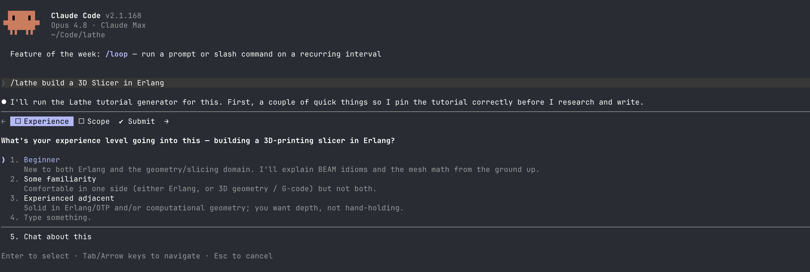
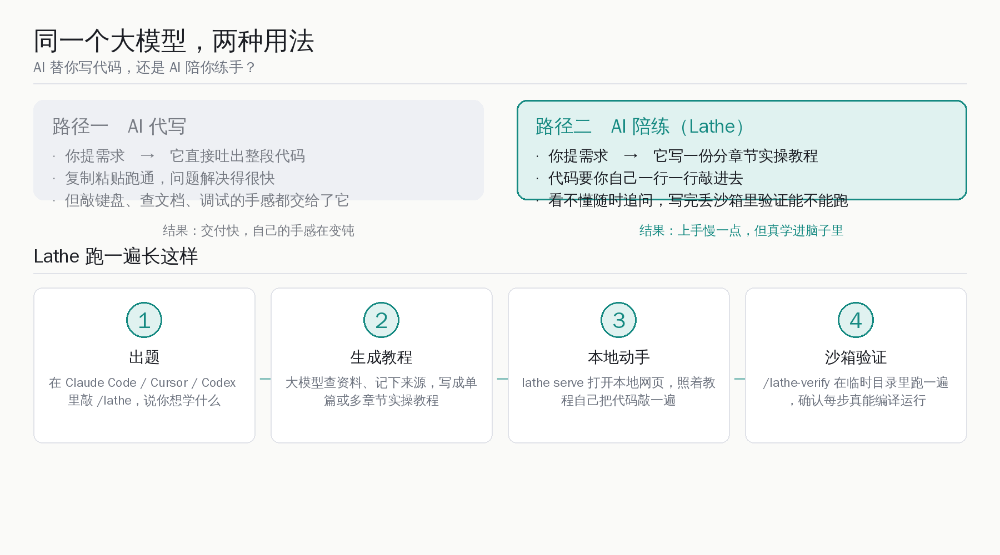
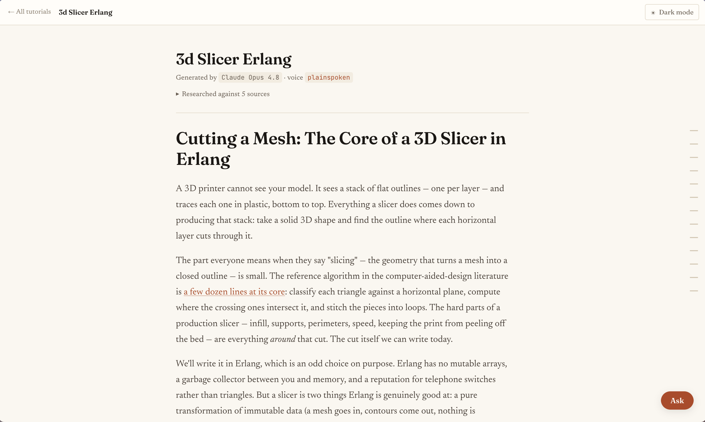
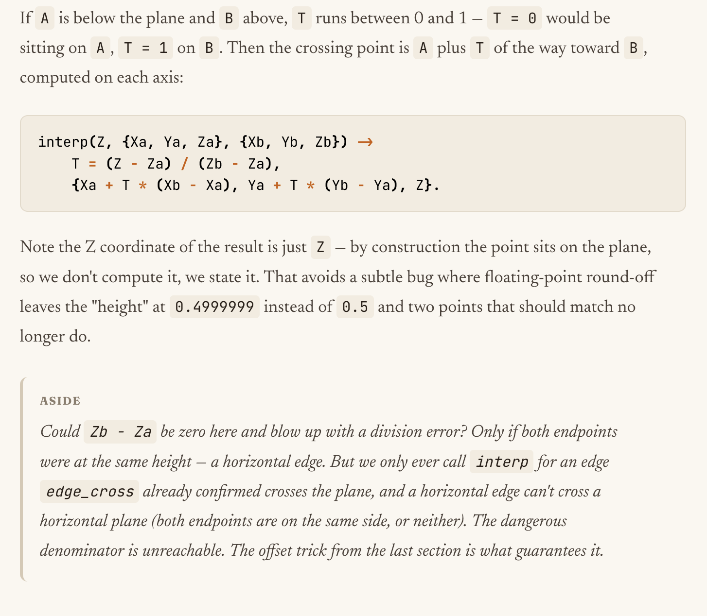
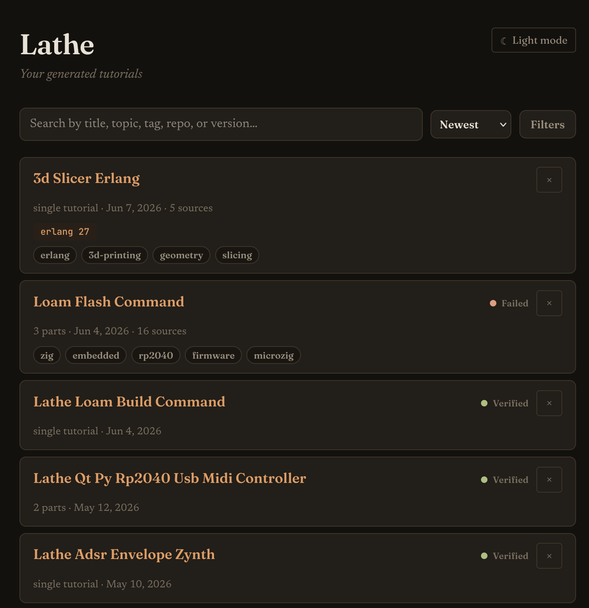
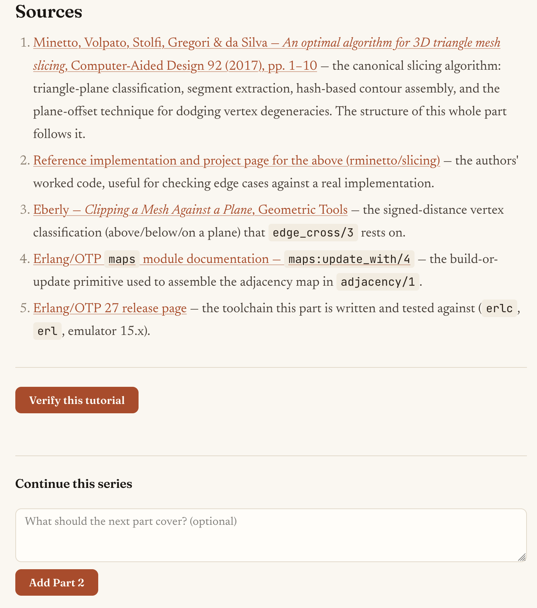

# Claude Code 反着用：让大模型出教程逼你自己敲，而不是替你写代码

这两年很多人都有一种说不太清的别扭：Claude Code、Cursor、Codex 把代码写得越来越顺手，活儿是干完了，但有时候合上电脑会有点心虚——这段逻辑到底是我想明白的，还是它替我想明白的？查文档、踩坑、调试这些最磨人也最长功夫的环节，慢慢都交给了模型。

最近有个叫 Lathe 的开源小工具，正好冲着这个别扭来。它把大模型的用法掉了个头：**不替你写代码，而是把你想学的主题拆成一份分章节的实操教程，然后逼你自己一行一行敲进去，写完还能丢进沙箱里验证能不能跑。** 一句话说清它的主张——用 AI 当陪练，不当代写。

这篇文章想讲清楚三件事：Lathe 到底怎么工作、它为什么值得认真看一眼、以及国内开发者用着 Claude Code 之外的国产编程工具，能不能复刻同一套学习法。

## 先把它是什么说清楚：一个命令加一个本地程序

Lathe 的作者是 Deven Jarvis，项目 2026 年 5 月 4 日建在 GitHub 上，用 Go 写成，采用 MIT 协议开源，到 6 月 8 日已经积累了近 300 个 star、10 个 fork，最新版本是 6 月 7 日发布的 v0.3.0。从建仓到现在刚一个月，迭代到了第三个小版本，还算勤快。

它的形态有两半，分得很清楚：

- **一半是大模型技能（skill）**：以 `/lathe`、`/lathe-extend`、`/lathe-verify`、`/lathe-ask`、`/lathe-tag` 这几个斜杠命令的形式，跑在你现成的大模型会话里。作者明确支持 Claude Code、Cursor、Codex 三家。
- **另一半是一个本地命令行程序（Go CLI）**：负责把生成好的教程存下来、管理起来、在浏览器里渲染出好看的阅读界面。它自己从不调用大模型，只是给模型递一个确定性的接口去读写教程。

这个分工是 Lathe 设计上最聪明的一点：**真正花钱、花算力的"思考"部分，借用你已经在用的大模型；本地程序只干存储和展示这种确定性的脏活累活。** 所以它装起来很轻——就是一个自包含的二进制文件，扔到 `$PATH` 里就行。

<small>来源：Lathe 项目 README 截图，`docs/img/lathe-prompt-cc.png`，2026-06-07</small>

上面这张图是作者在 Claude Code 里实际跑的样子：敲一句 `/lathe build a 3D Slicer in Erlang`（用 Erlang 写一个 3D 切片软件），它不会一上来就甩代码，而是先反过来问你一个问题——你对这个领域的底子有多厚？是新手、半懂、还是已经很熟只想要点深度。你选完，它才据此调整教程的讲法。这个"先摸底再讲课"的动作，已经很像一个真人老师了。

## 它怎么跑：出题、生成、动手、验证四步

把一次完整的使用拆开，Lathe 的流程是四步走，每一步职责清楚。

**第一步，出题。** 在 Claude Code、Cursor 或 Codex 里敲 `/lathe`，跟一句你想学什么。可以让它生成单篇教程，也可以生成一个多章节的系列。

**第二步，生成教程。** 大模型去查资料、记下查过哪些来源，然后写成一份或多份 Markdown 教程文件（`part-01.md`、`part-02.md` 这样编号）。作者建议这一步用你手头最强的"长思考"模型，比如 Claude Opus、GPT-5 Codex——因为这件事不是机械地反复改代码，而是要把一个完整概念从头研究、设计、讲清楚，吃的是模型的推理深度。

**第三步，本地动手。** 在任意终端敲 `lathe serve`，它会启动一个本地网页服务（默认端口 4242）并自动打开浏览器。你在这个专门为阅读做的界面里，照着教程把代码自己一行一行敲进去。

**第四步，沙箱验证。** 这一步是可选的，但很关键。敲 `/lathe-verify <教程名>`，模型会把教程里的每一步都走一遍，**在一个临时目录（`mktemp -d`）里建文件、跑命令、执行每个检查点（Checkpoint）**，确认这份教程真能编译、真能运行，再把结果记回教程的元数据里。验证有四种结果：通过、失败、跳过、验证中。

这里有个细节值得夸：验证默认是临时目录，不碰你自己的代码仓库；而且因为跑在你自己的大模型会话里，所有命令都走你平时的权限确认流程，你能看见、能批准每一个工具调用。作者也老实说了，这只是"软隔离"，不是安全沙箱级别的边界，别拿它跑不可信的东西。

## 阅读体验：这才是它跟"直接问 AI"拉开差距的地方

如果只是生成几个 Markdown 文件，那直接在对话框里问模型也能要到，何必多装个程序？作者把心思花在了阅读界面上，这也是 Lathe 真正的产品感所在。

<small>来源：Lathe 项目 README 截图，`docs/img/read-tutorial.png`，2026-06-07</small>

看上面这张真实截图，一份生成出来的《3D Slicer Erlang》教程，顶部清清楚楚写着一行署名：**这份教程由哪个模型生成（Claude Opus 4.8）、用的是哪种文风（plainspoken）、研究时参考了几个来源**。点开来源那一栏，能看到模型当时实际查过的链接清单。

这套"亮明出身"的做法，正好回应了大家对 AI 教程最大的担心——它会不会一本正经地胡说？作者的回答分两层：

- **一层是机制上的透明**：每份教程都记录来源链接，让你能去核对材料从哪来，而不是只能信它一张嘴。教程里模型不确定的地方，会主动标出来。
- **一层是学习方式本身就降低了风险**：因为是你自己在一行一行敲、一句一句读，你天然处在一个"等一下，这说得通吗"的警觉状态里。觉得不对就敲 `/lathe-ask` 追问，或者直接让模型把这一段改掉。作者甚至觉得，正是这种"逮住模型的小破绽再顶回去"的过程，让他比被动接收讲得更明白。

界面上还有几个为"动脑子"专门设计的小机关：鼠标移到右侧边栏会浮出整篇的目录导航；正文里穿插着旁注，时不时戳你想深一点；每篇教程末尾还留了"课后练习"，把一部分内容故意留给你自己去补完。

<small>来源：Lathe 项目 README 截图，`docs/img/tutorial-content.png`，2026-06-07</small>

## 教程攒多了怎么管：一个本地的"私人技术书架"

用上一阵子，你手上的教程会越攒越多。Lathe 把所有教程存在本地的 `~/.lathe/tutorials/` 目录里，一个教程一个文件夹，里面是编号的 Markdown 章节加一份元数据文件（`metadata.json`）。这份元数据记着教程的标题、主题、创建时间、状态、标签、用了哪个模型、什么文风、研究时参考了哪些来源。整套数据都在你本地，离线也能看。

<small>来源：Lathe 项目 README 截图（深色模式），`docs/img/tutorial-selection-dark-mode.png`，2026-06-07</small>

`lathe serve` 打开的列表页就是你的私人技术书架：

- **搜索**：按标题、主题、标签、仓库名、工具版本匹配，全部在浏览器本地跑，所以又快又能离线用；
- **排序**：按最新、最早、或标题字母序；
- **筛选**：按状态、按类型（单篇还是系列）、按标签、按版本号筛。

每张教程卡片上还会显示一个"参考了 N 个来源"的计数，让你一眼看出这份材料的研究扎实程度。这种把"读过/学过的东西"沉淀成一个可检索本地库的做法，对长期学习的人很受用——它不只是个生成器，更像一个会越长越厚的学习档案。

## 来源可追溯：每份教程都留着研究的脚印

前面提过 Lathe 对"AI 会不会胡说"的两层应对，其中机制那一层，核心就是来源可追溯这件事，值得单拎出来说。

<small>来源：Lathe 项目 README 截图，`docs/img/sources-and-extend.png`，2026-06-07</small>

Lathe 把每份教程"研究时实际查过的链接"完整留了下来，存在元数据的 `sources` 字段里，在阅读页面顶部用一个"参考了 N 个来源"的面板展开，点开就是完整链接清单。这跟教程正文里那种零散的 `## Sources` 引用不一样——它是一条**教程级别、持久保存**的研究脚印，让你能去核对材料从哪来，而不是只能对着文字干信。

后续如果你用 `/lathe-extend` 给教程加新章节，新查到的链接会自动并进同一条脚印里，还会跟已有的去重。对一个学习工具来说，"能回溯每句话的出处"这件事，比讲得多漂亮重要得多。

## 文风（voice）：让 AI 不假装自己是个老师傅

Lathe 有个挺克制的设计叫"文风"（voice），管的是教程读起来是什么调子，但**不碰准确性、研究、引用、验证、结构这些硬骨头**——那些是固定的，文风只能改语气。内置两种：

- **plainspoken（默认）**：诚实、精确，不编造人设，不瞎编第一人称的"我当年踩过的坑"，刻意避免把模型说得像个有血有肉的人。
- **companion（陪伴型）**：稍微暖一点、带点俏皮的"键盘边上的朋友"的口吻。

你也可以用 `/lathe-voice` 自己定制文风，它会反过来采访你：想要什么语气、用第几人称、能不能带点幽默，然后起草一份规格让你拍板。

但这里有一条红线，作者守得很死：**自定义文风被明令禁止冒充某个真实人物、伪造资历、或者否认自己是 AI 写的。** 每份教程顶部都强制带一行署名，老老实实写明是哪个模型、哪种文风生成的。作者把话讲得很坦白——他知道这种防护是猫鼠游戏，总能被绕过，但他想表个态：Lathe 是给你个人学习用的，不是用来批量生产"AI 垃圾教程"去污染互联网的。这份自觉，在一堆只顾着"一键生成内容"的工具里，反而显得难得。

## 作者为什么做这个：一个老程序员的私心

读完项目说明，能感觉到这工具带着很强的个人色彩，不是为了做一门生意。

作者说自己 2000 年代还是个少年时，是靠给 PSP 写自制游戏入门编程的，先 Lua 后 C++，养分全来自当年那些免费的在线教程和一个小小的玩家社区。他点名感谢了几个经典资源，比如 GitHub 上的 build-your-own-x 仓库、《Crafting Interpreters》，还有教人从零写光线追踪器、时序数据库、线性代数矩阵库的各种一次性教程。**动手做，是他这辈子学得最扎实的方式。**

到了 2026 年有了大模型，写软件确实快了，但他发现那些"啊哈，原来如此"的顿悟时刻不见了——因为活儿都被模型干了。于是他做了 Lathe，把大模型从"替我想"扳回到"教我学"，专门用来切入那些**冷门或者太新、压根找不到现成人类教程**的领域。他自己最近就在拿它学用 Zig 写嵌入式软件、从零写 3D 切片软件——这些方向网上的人写资料本来就少。

作者还很坦诚地自问自答了一句容易被人挑刺的话：你这工具本身是不是也是 AI"糊"出来的（vibecode），那不是跟你的主张自相矛盾吗？他大方承认就是 vibecode 的，但理由站得住：这工具风险低、就是给个人学习用的，而且他自己天天在用、已经稳定好使，觉得能帮到别人才拿出来开源。他也提醒，目前只在自己的环境（macOS + Claude Code）验证过，别的配置应该能跑但没保证。这种"把话说在前头"的态度，比那些把 demo 吹上天的项目实在多了。

## 它有边界，得说清楚

积极归积极，Lathe 不是万能药，几个边界作者自己就划得很明白，咱们照实转述：

- **教程质量比不过真人写的好教程。** 作者原话就是"差远了"。它没有人类教程那种心气、个性和架构上的考究。它的长处不在质量上限，而在于：那个"老师"随时在线答疑、随叫随改、而且真能把一个系列从头写到尾（不像很多人 2018 年开了个头的教程系列至今没填完）。
- **能找到真人写的好教程，优先用真人的。** 作者反复强调这一点，希望你大多数时候都能找到。Lathe 的位置很清楚——补位那些没人写、或者太新太偏的领域。
- **它终究是大模型，会以大模型的方式出错。** 所以才建议配最强的思考型模型，并且把"你自己动手 + 随时质疑"当成纠错的兜底。

把这些边界摆出来，不是泼冷水，恰恰是这工具可信的地方：它从不假装自己能取代什么，只老实告诉你它能给你什么、不能给你什么。

## 这套学习法，国内开发者怎么用上

这是最值得聊的一段。Lathe 的两种技能里，明确支持的是 Claude Code、Cursor、Codex 这三家海外编程工具。但好消息是，**它真正有价值的不是那个 Go 程序，而是它背后那套学习方法论**——而方法论是可以迁移的。

拆开看，Lathe 这套学习法其实由三块拼起来：

| 组成部分 | Lathe 的做法 | 国内复刻的可行性 |
|---|---|---|
| 出题 + 拆章节教程 | `/lathe` 技能调大模型生成分章实操教程 | 高：千问、DeepSeek、Kimi、智谱 GLM 都能写出分章节教程，把 prompt 模板抄过来即可 |
| 自己动手敲 + 追问 | 本地网页阅读 + `/lathe-ask` | 高：这一步本质是"读教程自己敲键盘"，跟用哪家模型无关 |
| 沙箱验证能不能跑 | `/lathe-verify` 在临时目录跑检查点 | 中：需要让国产 Coding agent 在临时目录里执行命令并核对结果，多数国产工具已具备命令执行能力 |

换句话说，哪怕你不装 Lathe，**把它的核心 prompt 思路搬进国产编程工具里，一样能跑通**。一个最朴素的复刻：让千问或 DeepSeek 帮你把"用 Rust 写一个玩具数据库"拆成五章实操教程，每章末尾留一道练习题、附上参考来源；你照着自己敲；卡住就追问；写完让它在一个干净目录里把你的代码跑一遍验收。整套流程，国产模型今天就能撑得起来。

更进一步，国产 Coding 工具自己也完全可以把这套学习法做成内置功能。它对中文学习者还有个天然便利——**用母语生成的实操教程，理解门槛比啃英文资料低一截**，对刚入门、想快速切入陌生领域的同学尤其友好。这是一块现成的、值得国产工具认真琢磨的产品方向。

## 写在最后

Lathe 给"AI 写多了会不会让人变笨"这个普遍焦虑，提供了一个特别积极的反向答案：**问题从来不在 AI 本身，而在我们怎么用它。** 同一个大模型，你让它代写，它就替你把顿悟的乐趣一并拿走；你让它当陪练，它就成了一个永远在线、随叫随到、还能陪你查资料的老师。

对国内开发者来说，这件事的启发可能比工具本身更值钱。我们这一代赶上了一个特别好的时候——基础设施已经足够好，国产大模型也足够能打，想学什么冷门东西，不必再苦等有没有人写教程，自己就能让模型现场拆一份出来、然后踏踏实实把它敲进脑子里。

工具会换，方法论会留下来。把 AI 当陪练这件事，今天就能开始练，谁先把手感攒厚，谁就先一步。
