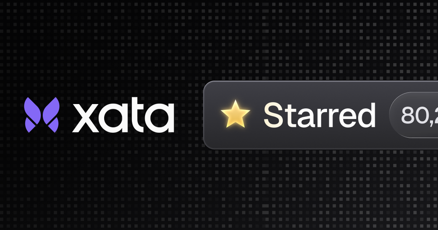
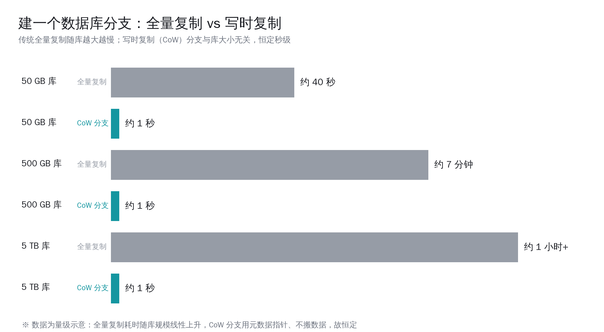
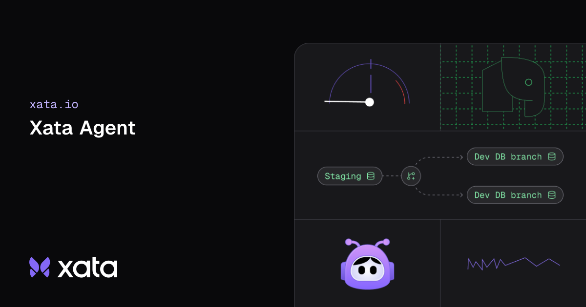

# Xata 把 Postgres 开源了：给每个 agent 一个秒建秒销的数据库分支

一个跑得正常的 AI 编程 agent，可能在十分钟里开出几十个数据库分支：试一条迁移、看看结果、留下能用的、丢掉跑坏的，再换一条路重来。人类开发者一天建一两次数据库副本就算多了，agent 一次任务就要几十上百次。这两种用法对数据库的要求，根本不是一回事。

2026 年 4 月 15 日，Xata 把它的核心代码以 Apache 2.0 协议开源，正面回答的就是这个问题：当用数据库的不再只是人，而是大量并行、反复重试、同时探索多条路径的 agent，数据库该长成什么样。它给出的答案是一句很具体的承诺——给每个 agent 一个能秒建秒销、和库多大无关的隔离 Postgres 分支。

这篇文章想讲清楚三件事：agent 用数据库为什么和人不一样、Xata 的 copy-on-write 分支和缩容到零到底解决了什么真实的卡点、以及国内开发者现在手里有 Supabase、Neon 这些选项，什么场景值得认真考虑给 agent 配一套专用的数据分支。

## 先把几个能查的数字摆清楚

在展开之前，把这次开源里几个硬事实对一遍，免得后面越说越虚。

- **开源时间与协议**：Xata 核心于 2026 年 4 月 15 日宣布开源，采用 Apache 2.0 协议。主仓库用 Go 编写，到 6 月 9 日核对约 873 个 star，仍在持续更新。
- **建分支耗时与库大小无关**：官方原话是「创建一个分支，源库是 50GB 还是 5TB，耗时一样」。原因后面讲，但这是它最核心的卖点。
- **100% 原生 Postgres**：Xata 不 fork、不改 Postgres 内核，分支能力做在存储层，跑的是没动过的标准 Postgres。
- **缩容到零是缩计算不删数据**：分支不活跃时，消失的只是计算实例，存储还在；有连接进来再自动把计算拉起来。
- **另一个开源项目 Xata Agent**：一个用 TypeScript 写的 PostgreSQL 运维 agent，同样 Apache 2.0，核对约 1076 个 star，专门盯数据库的指标和日志、诊断问题、给优化建议。

这几条都能直接核到官方 blog 和公开仓库信息，不是宣传话术。下面从「为什么需要」讲起。

## 一、agent 用数据库，和人差在哪

传统数据库范式有一个隐含假设：用它的是人，或者是人写好、行为可预期的服务。一个团队几十号人，连接数、并发、新建库的频率都在一个能预估的区间里。数据库管理员按这个区间配容量、调参数、做备份，一切井井有条。

agent 把这个假设打破了。Xata 在开源说明里列了 agent 的几个特征，每一条都和传统假设拧着来：

| 维度 | 人类 / 传统服务 | agent |
|---|---|---|
| 并发 | 可预估，相对平稳 | 大量并行，峰值难料 |
| 出错处理 | 人工介入、谨慎重试 | 自动重试，失败就再来一遍 |
| 探索方式 | 一般走单条确定路径 | 同时探索多条路径，留好的弃坏的 |
| 协调 | 有流程、有人盯 | 常常各跑各的，无中心协调 |
| 生命周期 | 库长期存在 | 很多库只活几分钟，用完就该消失 |

把这几条叠起来看，结论很直接：agent 需要的不是一个共享的大数据库，而是**大量各自独立的小沙箱**。每个 agent 想试一个有破坏性的操作——删一批数据、改一次表结构、灌一轮测试数据——都得在一个不会污染主库、也不会被别的 agent 干扰的隔离环境里做。试坏了直接丢掉，不留痕迹。

哥伦比亚大学 DAPLab 在 5 月底的一篇研究里把这个场景说得更技术化：未来 agent 会拿数据库当一块「工作记忆」——试一个动作、看结果、留下有希望的状态、丢掉坏的、在真正写回主状态之前先比较几个备选。他们预计这类场景会同时开出「几十、几百、上千个活跃分支」。

数量级一旦到这里，问题就变味了。一个用户每天跑 10 个 agent，10 万用户就是 100 万个 agent;如果每个 agent 还要好几个库，那就是数百万个数据库同时存在。传统那套「按团队规模配一个库」的做法，到这个量级完全转不动。

## 二、传统做法到底卡在哪

知道了 agent 要「大量、便宜、能并发、用完即弃」的隔离分支，再看现有做法为什么不够用，就清楚了。

最朴素的办法是给每个 agent 整个复制一份数据库。问题立刻暴露：一个 50GB 的库复制一遍，要等几分钟、占一份完整磁盘;到 5TB 就更夸张。agent 等不起这个时间，预算也扛不住这份存储。一个任务开几十个分支，每个都全量拷一遍，账单会失控。

第二个办法是用现成的「数据库分支」功能。市面上确实有几家做了分支，但 DAPLab 这次专门建了一套叫 BranchBench 的基准去压测它们，发现现有的分支方案普遍踩在一个两难上：**要么分支建得快但库内查询慢，要么查询快但分支管理贵**，很难两头都顾上。

他们的实测数字相当具体（以下为 BranchBench 公开的测试结果）：

| 系统 | BranchBench 实测表现 |
|---|---|
| Neon | 建分支最慢处比基线慢约 25 倍;切换分支最慢处慢约 1500 倍;活跃分支撞到 20 个的上限;在一个 1000 步的蒙特卡洛树搜索任务里只跑完了 33 步 |
| Dolt | 分支管理便宜，但被库内查询开销拖累;同一个任务在 2 小时超时前只跑完 170 步 |

这两个数字摆出来，agent 场景的难点就具象了。一个需要反复 fork、试、剪枝的探索型任务，分支创建慢一点、切换慢一点、再撞上活跃分支数量上限，整个任务就基本跑不动——1000 步里只完成 33 步，等于卡死。

这里要说清楚：DAPLab 测的是当下这些系统在极端 agent 负载下的边界，不是说它们在常规开发场景里不好用。Neon 给 PR 预览开个分支、秒级就绪、用完即删，这套体验在人类开发流程里非常顺手。问题只在于——agent 的量级和节奏，把这些系统设计时没太考虑过的角落给压出来了。

## 三、copy-on-write 分支：为什么 5TB 和 50GB 一样快

Xata 的解法核心是把分支做在存储层，用 copy-on-write（写时复制，下称 CoW）。这套机制不新鲜，文件系统和虚拟机快照用了很多年，但把它干净地接到 Postgres 上、还保持内核不改，是这次的工程价值所在。

它的原理可以拆成几步：

1. **数据切块 + 索引块**。Xata 把数据切成一个个数据块，另有一层「索引块」记录每个数据块存在哪。
2. **建分支只拷索引**。创建分支时，只复制那层轻量的索引块，让它先指向和父库一模一样的数据块——一份数据都没真拷。所以这一步几乎是瞬间完成的。
3. **写的时候才复制**。当分支真要改某块数据时，复制才发生（这就是「写时复制」名字的由来），而且只复制被改动的那一块，不是整个库。
4. **存储省到很低**。没改的数据块在父子分支之间共享，开很多分支也不会成倍占磁盘。

现在回头看「50GB 和 5TB 建分支一样快」这句话就好理解了：建分支的耗时只跟那层索引元数据的大小有关，和底下真实数据多大没关系。库再大，索引块也就那么点，拷起来都是一眨眼。官方把这个能力概括成一句话——把 TB 级的数据在几秒内「复制」成一个轻量分支。

全量复制和 CoW 分支的差别，对照起来一目了然：

存储层的实现也值得一提，因为它决定了分支不只是「建得快」，还得「跑得不慢」：

- **底座是两个成熟开源项目**：Kubernetes 上的 Postgres 运维项目 CloudNativePG，负责复制、故障切换、备份这些生产必需的事;以及 OpenEBS 的 Mayastor，一个基于 NVMe 的复制式存储引擎。
- **走 NVMe over Fabrics**：分支的磁盘通过 NVMe over Fabrics（NVMe-oF）这套协议挂到网络上，号称能跑出接近本地磁盘的延迟、网络上撑起几十万级别的 IOPS。这一点很关键——把存储和计算拆开、用网络挂载，是缩容到零的前提，但拆开之后性能不能塌，NVMe-oF 就是来补这个的。

把这两块拼起来，Xata 想达到的就是 DAPLab 指出的那个「两难」的另一种答案：分支既要建得快、管得便宜，又要库内查询不掉链子。

## 四、缩容到零：让百万个数据库变得养得起

光有秒级分支还不够。如果一个 agent 任务结束后，它那几十个分支还各占一份计算资源在那空转，百万级数据库的账单照样压垮人。

Xata 的第二块是缩容到零（scale to zero）。它的逻辑很朴素：大多数 agent 开的库根本不需要活几天几周，它们只活几分钟——刚好够 agent 干完一件事，然后就该缩容到零。这时候**消失的只是计算实例，存储还在**;下次有连接进来，再自动把计算拉起来。

这件事的意义在于把成本模型对齐了 agent 的真实生命周期：

- agent 干活时，计算实例在线，正常算钱;
- agent 干完、库闲下来，计算自动下线，这段时间不为算力付费;
- 数据不丢，需要时秒级唤醒,不用重新建库灌数据。

CoW 分支管「建得起、占得起」，缩容到零管「养得起」。两块合在一起，才让「给每个 agent 一个自己的数据库」从一句愿景变成一笔算得过来的账。这也是 Xata 把自己定位成「面向 agent 规模的 Postgres」而不是又一个 serverless 数据库的原因——它瞄的不是省你一台机器的钱，是让数百万个短命数据库这件事在经济上成立。

## 五、还有一个 Xata Agent：让 Postgres 自己有人盯

这次开源里还有一个容易被盖过去、但很实用的项目：Xata Agent，一个开源的 PostgreSQL 运维 agent。它和上面的分支平台是两回事，但思路是一脉的——既然 agent 时代数据库会变多变碎，运维这件事也得有 agent 来分担。

它干的活儿，约等于给 Postgres 配了一个不睡觉的值班工程师：

- **全天候盯指标和日志**：盯慢查询、CPU 和内存尖峰、连接数异常这些信号，想在小问题滚成宕机前就发现。
- **跟着 playbook 走，不乱来**：靠一套工具和英文写的诊断流程（playbook）来约束自己，避免凭空乱猜;按设计，它不会对数据库执行有破坏性、甚至只是可能有破坏性的命令。
- **接主流云上的 Postgres**：原生支持 AWS RDS、Amazon Aurora、Google Cloud SQL，以及任何能用连接串连上的 Postgres。
- **模型可选、可扩展**：支持主流大模型供应商，也能接本地模型;工具侧能通过 MCP 接自定义能力。
- **部署不重**：用 Docker 镜像跑，额外依赖只有一个用来存它自己配置、状态和历史的 Postgres。技术上是个用了 Vercel AI SDK 的 Next.js 应用，主要用 TypeScript 写。

把这两个项目放一起看，Xata 这次想表达的是一套完整的判断：agent 不只是数据库的「新用户」，它既会把数据库用出新形态（要海量短命分支），也能反过来帮你运维数据库（自动盯、自动诊断）。

## 六、国内开发者现在能用什么对位

讲了这么多 Xata，落到手头——国内开发者今天就想给 agent 配数据分支，有哪些现成选项，分别适合什么场景？把能用的几条路对照一下。

| 方案 | 分支能力 | 缩容到零 | 适合的场景 |
|---|---|---|---|
| Neon | CoW 分支，秒级就绪 | 支持，闲时暂停计算、毫秒级唤醒 | PR 预览、测试环境、中小规模 agent 探索;但极端高并发分支会撞上限（参考 BranchBench） |
| Supabase | 提供预览分支，但偏向 schema（表结构）层面，不是完整数据集的分支 | 不支持，选定计算规格后持续运行 | 想要一整套后端（库 + 鉴权 + 存储 + 函数）的中小团队;分支主要用于 schema 迭代 |
| Xata（自托管开源版） | 存储层 CoW，建分支与库大小无关 | 支持，缩计算不删数据 | 真要做到 agent 规模、海量短命分支、且愿意自己运维 Kubernetes + 存储层的团队 |
| 国产托管 Postgres / 云数据库 | 多数提供克隆、快照、只读副本;原生秒级 CoW 分支能力各家差异大，需逐家核实 | 部分 serverless 形态支持闲时降配，能力随厂商不同 | 数据要落在境内、合规优先的团队;选型前务必逐项核对分支与缩容的真实能力，别按海外宣传词类推 |

几个可操作的判断，给正在选型的同行参考：

1. **不是所有 agent 应用都需要 agent 规模的数据分支**。如果你的 agent 一天就开个位数的分支，Neon 那种秒级 CoW 分支已经很够用，没必要为「百万分支」的能力买单。Xata 这套解决的是量级问题，量级没到，复杂度反而是负担。
2. **判断要不要上专用数据分支，先看三件事**：一是单次 agent 任务会不会开出几十上百个隔离库;二是这些库是不是大多只活几分钟、用完就该消失;三是源库是不是大到「全量复制一遍」在时间和成本上不可接受。三条都中，才轮到 Xata 这类存储层 CoW 方案真正发挥价值。
3. **缩容到零对成本的影响，比分支速度更隐蔽也更要紧**。分支建得快是看得见的体验，但真正决定百万级短命库养不养得起的，是闲时计算能不能归零。选型时这一项要单独问清楚，别和「快照」「克隆」混为一谈。
4. **数据落地和合规优先时，先把能力逐项核实**。海外这几家的分支、缩容能力是它们公开标注的;国产云数据库各家进度不一，克隆、快照、serverless 降配都有，但原生 CoW 秒级分支要逐家确认。把需求拆成「建分支耗时是否与库大小无关」「闲时计算能否归零」「单次能并发多少活跃分支」几个具体问题去问，比看一句「支持分支」可靠得多。

## 写在最后

把这件事拉远一点看，它真正提醒我们的是：agent 不只是换了个写 SQL 的人，它把数据库的负载形态整个换了——从少量长命的大库，变成海量短命的小分支。Xata 这次开源给出的那句承诺「建分支与库大小无关、用完缩容到零」，本质是在为这个新形态重写数据库的成本模型。

对国内做 agent 的同行来说，现在不一定要立刻换数据库，但值得把一个问题提前放进设计里：当你的 agent 真的开始并行、重试、同时探索多条路径，你给它的每条路径,是不是都有一个安全、独立、又养得起的数据沙箱。想清楚这个,比追哪个产品更重要。好在这套能力已经摆在开源里了——什么时候量级到了,什么时候用得上,主动权在你手里。
