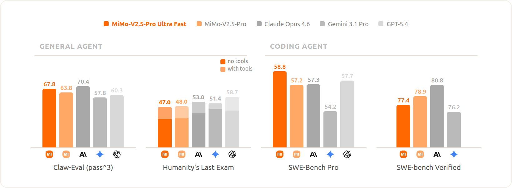
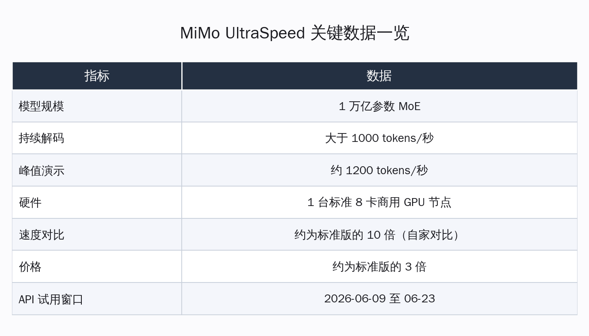
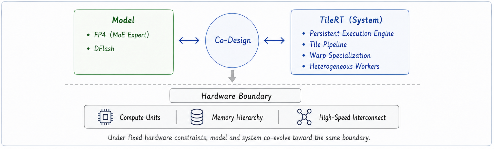
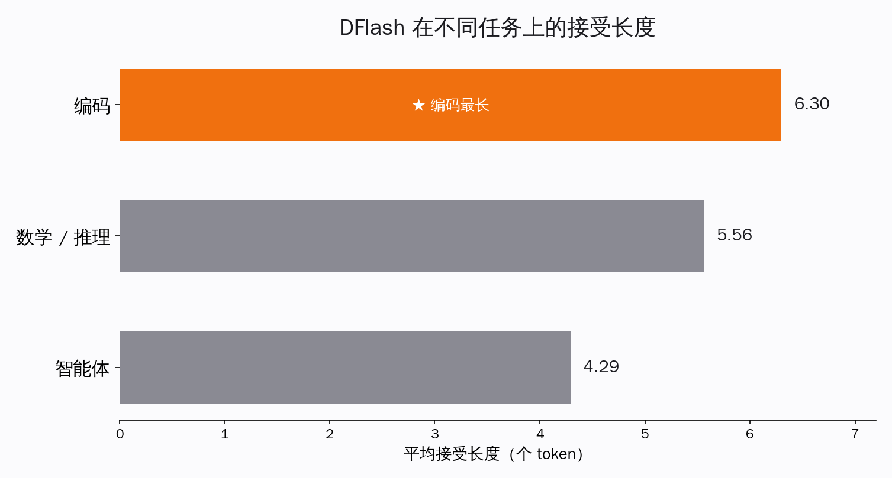
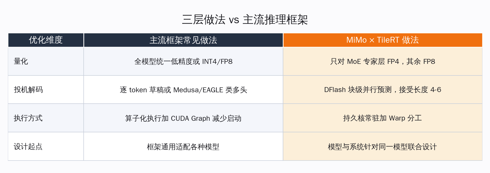

# 万亿模型在 8 卡商用机跑出 1000 字/秒，靠的不是换芯片

把一个万亿参数的大模型跑快，过去几乎所有人的第一反应都是同一句话：等更强的卡，或者上定制芯片。小米 MiMo 团队和 TileRT 这两天给出的答案，把这句话直接划掉了一半。

他们让一个 1 万亿参数的 MoE 模型，在一台**标准的 8 卡商用 GPU 服务器**上，持续解码速度稳定跑过 1000 tokens/秒，峰值演示触到约 1200 tokens/秒。没有定制硅片，没有专用 ASIC，用的就是市面上能买到的商用卡。这件事当天冲上了 Hacker News 头页，海外做推理系统的人讨论得最多的一句话是：原来瓶颈一直不在硬件够不够快，而在软件有没有把硬件喂饱。

这篇要讲清楚的核心论点只有一个：**万亿模型的推理速度，正在从"换硬件"问题，变回"软件工程"问题。** MiMo-V2.5-Pro-UltraSpeed 不是靠某一招黑科技，而是模型团队和系统团队坐在一张桌子上，把量化、投机解码、GPU 运行时三层一起重新设计的结果。三层各自省在哪、又各自让出了什么，是这篇文章接下来逐层要交代的事。这套思路对海外的 vLLM、SGLang、TensorRT-LLM 是一次正面对话，对国内做自部署、想把推理成本压下来的开发者，则是一份相当具体的参照。

## 这次快的到底是什么：同一个模型的高速服务档

这次发布的不是一个新模型，而是现有 MiMo-V2.5-Pro 的一种高速服务模式，官方命名 MiMo-V2.5-Pro-UltraSpeed。底座是同一个万亿参数 MoE 模型，能力不变，变的是怎么把它服务出去。

| 指标 | 数值 | 口径 / 来源 |
|---|---|---|
| 模型规模 | 1 万亿参数 MoE | MiMo 官方博客，2026-06-08 |
| 持续解码速度 | 大于 1000 tokens/秒 | 官方博客，单 8 卡节点 |
| 峰值演示速度 | 约 1200 tokens/秒 | 官方博客 |
| 硬件 | 1 台标准 8 卡商用 GPU 节点 | 官方未公开具体卡型 |
| 速度对比 | 约为标准版 MiMo-V2.5-Pro 的 10 倍 | 官方内部对比，非对比其他厂商 |
| 价格 | 约为标准版 MiMo-V2.5-Pro 的 3 倍 | 官方公布 |
| API 试用窗口 | 2026-06-09 至 2026-06-23 | 官方，仅 API、需申请、不支持按量套餐 |

这里有个数字要专门澄清，因为海外几家聚合媒体转载时口径乱了。官方给出的"10 倍"是**和自家标准版 MiMo-V2.5-Pro 比**，不是和 ChatGPT 或 Claude 比。市面上流传的"快过 ChatGPT/Claude 15 倍"这类说法，在 MiMo 官方博客、TileRT 官方博客以及 gizmochina 等一手报道里都查不到原话，属于二手传播中产生的口径漂移，这里不采用。把基准说清楚很重要：UltraSpeed 是同一个模型的两种服务档位之间的速度差，谈的是工程能榨出多少，而不是模型谁强谁弱。

作为参照，小米去年 12 月发布的 MiMo-V2-Flash 输出速度大约 150 tokens/秒。从 150 到 1000+，中间隔的不是一代新卡，而是一整套服务层的重做。

## 第一层：只给专家层做 FP4，省显存又不伤推理质量

万亿参数模型最直接的负担是显存和访存带宽。参数越大，每生成一个 token 要从显存里搬运的权重就越多，而解码阶段几乎是被访存带宽卡住的——算力经常在等数据。最朴素的提速办法就是量化，把权重位宽压下来，搬运量自然变小。

但麻烦在于，把整个模型一刀切到 FP4 这种 4 比特精度，复杂推理和代码任务上的准确率会明显掉下来。MiMo 的做法是**只对 MoE 的专家层做 FP4，其余模块保持原精度**。

这个取舍背后有清晰的算账逻辑，官方模型卡里讲得很直白：在 MoE 架构里，专家层占了绝大多数参数，同时它们对量化的容忍度也最好；而注意力、嵌入这些模块参数占比小、对精度更敏感。所以把 4 比特的"刀"只落在专家层这块最大、最耐压的肉上，收益最大、代价最小。

具体配置上有几个值得记的细节：

- 专家层采用 MXFP4 格式，量化块大小为 32
- 网络其余部分保持 FP8（不是更高的 BF16，本身已是低精度档）
- 每一层注意力的 o_proj 单独保留更高精度
- 官方称相对 FP8 基线达到接近无损的质量

这一层的本质是访存优化：把最占带宽的那部分权重压到最小，让解码阶段少搬数据。它解决的是"模型太大、数据搬不动"的问题，但它管不到下一个瓶颈——一次只生成一个 token 这件事本身的串行性。

## 第二层：DFlash 投机解码，一次蒙对好几个 token

大模型逐字生成天生是串行的：必须先吐出第 N 个字，才能算第 N+1 个字。投机解码（speculative decoding）是这几年公认有效的破局思路——先用一个小而快的"草稿模型"一口气猜出后面好几个 token，再让大模型一次性并行验证这几个猜测，猜对的部分直接采纳，猜错的从分歧点重来。猜得越准，大模型被调用的次数越少，整体就越快。

MiMo 用的投机解码方法叫 DFlash，走的是块级并行预测的路子。和传统逐个 token 往后猜不同，它的草稿模型一次前向就填满一整块被遮盖的位置，草稿全程用滑动窗口注意力(SWA)，让每次预测的计算量从随上下文长度线性增长，变成基本恒定。草稿每块最多生成 8 个 token，在验证开销和并发之间取平衡。

衡量投机解码效果有个关键指标叫"接受长度"——平均每轮大模型验证能一次性采纳多少个草稿 token，越高越省。官方给出的几组数据是：

| 任务类型 | DFlash 接受长度 |
|---|---|
| 编码 | 6.30 |
| 数学 / 推理 | 5.56 |
| 智能体 | 4.29 |

接受长度 6.30 的直观含义是：在代码任务上，大模型平均每验证一轮就能往前推进约 6 个字，相当于把昂贵的大模型调用频率压到原来的约六分之一。代码这类格式高度规律、续写可预测性强的场景收益最大；智能体那种多分支、上下文跳跃大的任务，可预测性低，接受长度自然回落到 4.29。这条规律本身对所有上投机解码的人都成立。

这一层解决的是"串行生成调用太频繁"的问题。但它又带来一个新的麻烦：草稿生成、验证、采纳来回切换，会把执行流切得很碎。这就轮到第三层登场。

## 第三层：持久核运行时，把碎掉的执行流重新连成一条

如果说前两层是模型团队的活，这一层就是 TileRT 这套 GPU 运行时的主场，也是整件事里最有系统工程含量的部分。

TileRT 官方博客把从"几十 tps"到"1000+ tps"拆成两次跨越，核心洞察是一句反直觉的话：**真正的瓶颈不是哪个算子(kernel)跑得慢，而是整条执行流在微秒级别被一个个割裂的算子边界反复打断。**

传统推理引擎是算子化执行的：把网络拆成一个个算子，GPU 算完一个、停一下、再启动下一个。每个算子单看都不慢，但万亿模型一次前向要串起成百上千个算子，每次启动和切换都在微秒尺度上漏掉一点时间，叠加起来 GPU 大量时间花在算子之间的空隙上，而不是真正在算。再加上第二层投机解码带来的频繁验证切换，这种碎裂被进一步放大。

TileRT 的解法是把整条计算流水线收进**一个常驻在 GPU 上的持久引擎核(Persistent Engine Kernel)**，让它一直待在硬件里连续运转，不再频繁地启动和退出。在这个持久核内部，再用 Warp Specialization(线程束分工)把数据搬运、计算、通信拆成几组各司其职的协作角色，让这三件事在同一时刻并行流动，而不是串成一条排队走。再往上，异构 Worker 把这种分工从单个流多处理器(SM)扩展到整张卡的执行域。

这一层是纯软件的访问方式革命：不改硬件、不改模型，只是换一种让 GPU 连续干活、几乎不空转的执行组织方式。它和前两层不是各管一段、互不相干，而是必须配合——专家层 FP4 减少了搬运量，投机解码减少了大模型调用次数，持久核则保证省下来的这些机会不在算子边界的缝隙里漏掉。三层任何一层单独拿出来都到不了 1000，合在一起才破千。这正是官方反复强调的"模型-系统协同设计"(model-system codesign)的真正含义：不是三个团队各交一份答卷，而是从一开始就照着对方的约束来设计自己那一层。

## 对位海外：它和 vLLM、SGLang、TensorRT-LLM 在聊同一件事

海外这一波讨论之所以热，是因为 MiMo×TileRT 踩中的痛点，恰好是 vLLM、SGLang、TensorRT-LLM 这几个主流推理框架这两年一直在攻的方向。把它放进这个坐标系里看，就知道它新在哪、又承接了什么。

| 优化维度 | 主流框架的常见做法 | MiMo×TileRT 这次的做法 |
|---|---|---|
| 量化 | 全模型统一低精度，或权重 INT4/FP8 | 只对 MoE 专家层 FP4,其余 FP8,注意力部分保高精度 |
| 投机解码 | 逐 token 草稿，或 Medusa/EAGLE 类多头 | DFlash 块级并行预测，滑动窗口，接受长度 4-6 |
| 执行方式 | 算子化执行 + CUDA Graph 减少启动开销 | 持久核常驻 + Warp 分工，从根上消解算子边界 |
| 设计起点 | 框架通用，适配各种模型 | 模型与系统针对同一个模型联合设计 |

前三行 MiMo 都不是凭空发明，而是在各框架已有方向上做到了更激进的工程实现：量化更精细地挑了部位，投机解码换了块级范式，执行方式从"减少启动次数"推进到"干脆不再反复启动"。CUDA Graph 是把一串算子录制成图来减少启动开销，持久核则更进一步，索性让核一直不退出。

真正构成差异的是最后一行。通用框架要服务千千万万个模型，天然不能为某一个模型把假设钉死；而 MiMo 和 TileRT 是冲着同一个万亿模型联合设计的，可以把每一层的取舍都咬合到这个模型的具体形态上。这是一条用通用性换极致速度的路——它跑得快，但这套配置很难原样搬到别的模型上。这也提醒在自部署里抄作业的人：能直接复用的是思路，不是参数。

值得一提的是，这次开源的 FP4 投机解码 checkpoint(MiMo-V2.5-Pro-FP4-DFlash)给出的就是 SGLang 部署示例，目前在 HuggingFace 上约 70 星。也就是说协同设计里偏模型侧的那部分——FP4 专家量化加 DFlash 草稿——是公开可复现的；真正不开放、构成速度护城河的，是 TileRT 那套持久核运行时。这个开放边界划得很清楚：模型侧的方法论拿出来共享，系统侧的极致实现留作服务能力。

## 对国内自部署：能学到的三件具体事

这套打法对国内做自部署、盯着推理成本的开发者，启发是相当落地的。这里只客观摆它揭示的规律，不替谁做决定。

**第一，提速的重心可以先看软件，再谈换卡。** 长期以来"模型太慢就加卡"是默认路径，但这次最值得记下的一点是：同样一台 8 卡商用机，通过量化、投机解码、运行时三层重做，就把同一个模型从几十 tps 量级拉到了 1000+。在动预算买更贵硬件之前，自部署链路里这三层往往还有没榨干的空间。

**第二，量化要挑部位，不要一刀切。** 全模型一把 FP4 掉精度，但只压 MoE 专家层就能接近无损——这条经验对所有跑 MoE 模型做自部署的人都有参照价值。哪块参数最多又最耐压，刀就往哪落；敏感的注意力、嵌入留住精度。这是个可以直接借鉴的取舍原则。

**第三，投机解码的收益高度看场景。** 接受长度在代码任务上能到 6.30，在智能体任务上只有 4.29。这意味着如果你的负载主要是代码补全、规律性强的结构化生成，上投机解码回报很高；如果是多分支跳跃的复杂智能体流程，收益要打折扣。把它用在对的场景，才划算。

## 什么场景值得为高速模式多掏 3 倍

最后回到能不能上手这件事。试用窗口是 2026-06-09 到 06-23 两周，仅开放 API、需要申请，不支持按量套餐；获批用户有两周免费体验，每账号每天最多排队 10 次、单次会话有时长上限。这是一次明确的限时窗口，而非常态商用，想验证的人节奏要踩准。

定价上，UltraSpeed 约为标准版的 3 倍价格、约 10 倍速度。3 倍价钱换 10 倍速度，单位 token 的速度性价比反而更高，但绝对开销变高了——所以它不是默认档，而是给特定场景准备的。从这个取舍出发，大致能分出该不该用：

- **值得用**：对首字延迟和吐字速度敏感的交互场景，比如实时代码补全、对话式智能体、需要快速看到完整结果的长文生成；速度直接换体验和效率的地方，多掏 3 倍买 10 倍速通常划算。
- **不必用**：离线批处理、跑通即可不在乎几秒快慢的任务，标准版更省。
- **要测一测**：重度智能体编排——投机解码接受长度在这类任务上偏低，实际提速可能达不到 10 倍，先小规模实测再决定。

回到开头那句被划掉一半的话：万亿模型跑得快，过去被默认为是硬件的胜利。MiMo×TileRT 这次把这件事重新交回到了软件工程手里——量化挑对部位、草稿猜对节奏、运行时连住执行流，三层咬合，普通的 8 卡商用机也能破千。它没有许诺一把通吃的银弹，反而把每一层的取舍都摆得明明白白。对在自部署里跟成本较劲的人来说，这种把账算清楚的发布，比任何一个"史上最快"的口号都更有用。系统工程的空间，远比想象中大。
