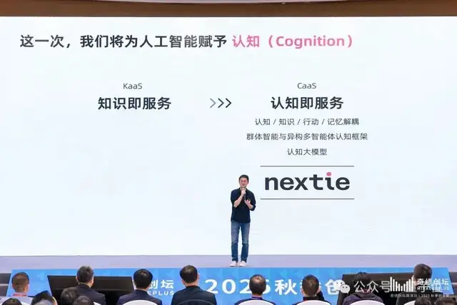
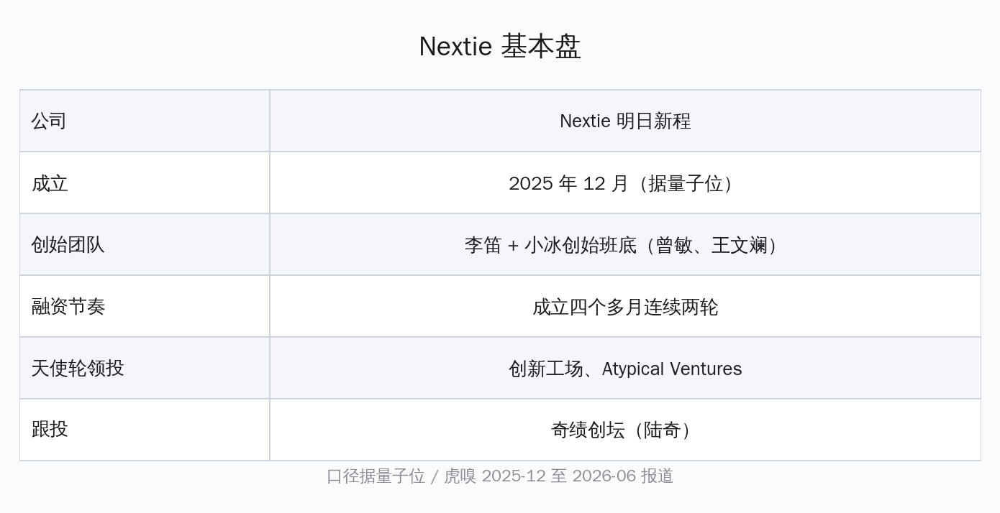
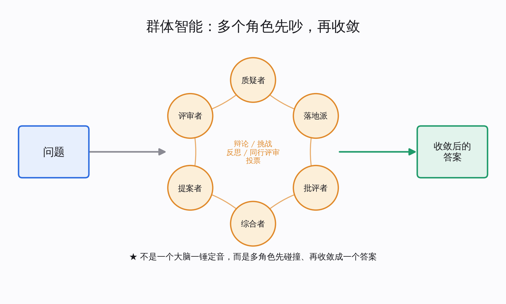
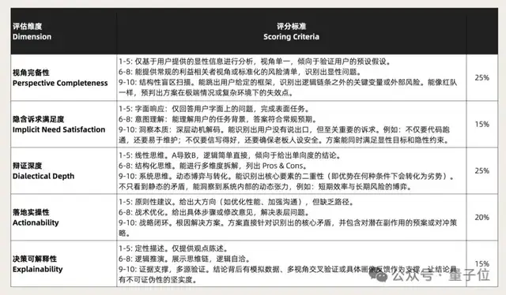
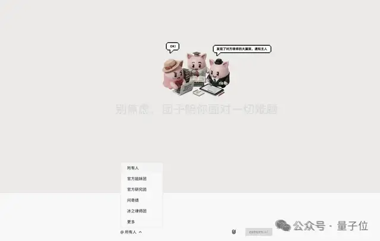

# 李笛押小模型：4B 端侧跑，几十个 AI 吵到 GPT-5.4 水平

这两年我们听惯了一种叙事：模型要更大，上下文要更长，参数从几百亿冲到上万亿，窗口从 8K 拉到几百万 token。所有头部玩家都在同一条赛道上往前堆，仿佛智能这件事只要堆得够多就会自己冒出来。

可堆到今天，每个天天用大模型干活的人心里都有一个没说出口的困惑：上下文给得越长，模型反而越容易在中间走神；参数堆得越多，它给的答案越像一个说不清理由的黑箱。你让它写一段稍微复杂的方案，它洋洋洒洒答了一屏，但你既不知道它为什么这么选，也没法确认它有没有漏掉关键视角。

2026 年 6 月，一个熟悉的名字给出了另一种答案。"小冰之父"李笛带着他离开微软后创立的公司 Nextie（明日新程），发布了一个只有 **4B** 参数的端侧认知模型"新程 Alpha"，以及一个让几十个 AI"坐在一起吵架"的群体智能平台"团子"。他押的不是"更大的单体模型"，而是一句听上去有点反直觉的判断——**智能不会来自某一个更大的模型。**

这篇文章想把这条"小而认知、端侧可跑、多 agent 协作"的路线讲清楚：它到底在工程上主张什么，和我们熟悉的单体大模型、和海外的多 agent 辩论框架有什么异同，以及对每天在用个人 AI 的你我，一个能塞进 MacBook 的 4B 模型意味着什么。

## 先认人：从小冰出走的那支队伍

要看懂 Nextie 押的方向，得先认清是谁在押。

李笛在国内 AI 圈不是新面孔。他做过微软亚洲互联网工程院副院长，是微软小冰从孵化到独立的核心操盘人，业内多年称他"小冰之父"。2025 年底，他带着小冰的创始班底集体出走，另起炉灶成立了 Nextie，中文名"明日新程"。同行的还有小冰前联合创始人、前微软首席研发总监曾敏，以及小冰前大模型与算法负责人、前英特尔架构师王文斓。

这支队伍的履历，决定了他们不太可能去做一件"再训一个更大的聊天机器人"的事。下面这张表先把公司的基本盘摆出来：

| 维度 | 情况 | 口径与时间 |
|---|---|---|
| 公司 | Nextie（明日新程） | 据量子位，2025 年 12 月成立 |
| 创始团队 | 李笛 + 小冰创始班底（曾敏、王文斓等） | 据量子位、虎嗅 2025-12 至 2026-06 报道 |
| 融资节奏 | 成立四个多月完成连续两轮融资 | 据量子位 2026-04 报道 |
| 天使轮领投 | 创新工场、Atypical Ventures | 据量子位 2026-04 报道 |
| 跟投 | 奇绩创坛（陆奇） | 据量子位 2026-04 报道 |
| 储备 | 称资金足够 3-5 年创新所需 | 公司表述，据量子位 |

把李开复系的创新工场和陆奇的奇绩创坛同时拉进同一家公司的早期盘子里，这件事本身就说明了一点：押"群体智能"这条非主流路线的，不只是李笛一个人的判断。

## 第一个主张：群体智能，不是把一个模型做更强

Nextie 的第一句核心主张很直白——与其把一个 AI 做得更聪明，不如给一个人配一支会思考的"决策团队"。

李笛的出发点是一个朴素的观察：人做决策做得不好，根子常常不在算力不够，而在认知不全——只从一个视角看问题，看不到自己没想到的那一面。单体大模型恰恰复制了这个毛病：再大的模型，一次推理也只是"一个脑子"给出的一种输出。

群体智能换了个思路。它不追求单个智能体的能力极限，而是让多个认知能力、功能角色都不一样的 AI 围坐到一起，按明确规则相互协作、相互验证。这个协作过程，Nextie 称为"认知碰撞"——具体动作是辩论、挑战、反思、同行评审、投票。一个问题进来，不是一个模型直接吐答案，而是一群带着不同立场的 agent 先吵一轮，再收敛。

这套主张落到产品上，就是 2026 年 2 月上线内测的"团子"。它被定位成原生群体智能平台，而不是又一个聊天机器人——界面不是我们熟悉的那种一来一回的线性对话框，而是一块白板式、思维导图式的画面，把几十个 agent 的推理过程、观点碰撞、协作路径都摊开给你看。据多家媒体的内测报道，团子在一个问题上会调动数十个 agent 经多轮辩论后投票，再汇总交付结果——它追求的不是单个智能体抢答出"正确答案"，而是一群智能体协作收敛出"最优解"。

团子在商业模式上也刻意避开了按 token 计费的惯例。按李笛的说法，同一个 token 在不同任务里承载的信息密度差别很大，所以他们更倾向于按任务结果定价，而不是按消耗的 token 数收钱。这个选择和它"让一群 agent 反复辩论"的形态是配套的：既然鼓励多轮碰撞，就不能让用户为每一轮辩论的 token 单独买单。

## 对位海外：多 agent 辩论与"认知核心"

讲到这里，熟悉海外动态的人会有一个合理的疑问：让多个模型互相辩论再投票，这事学术界早就有人做过，Nextie 的"群体智能"和它们差在哪？

确实，"多 agent 辩论"（multi-agent debate）是一个已经被研究过几年的方向——让几个语言模型实例就同一个问题互相质疑、迭代几轮，往往能比单个模型直接作答更准、幻觉更少。Nextie 的认知碰撞和这个思路一脉相承，但它把重心放在了工程化上：上下文管理、多智能体、多智能体协同方法被拆成三个明确的组件来做，再叠加 agent 之间不同的认知角色分工，而不只是把同一个模型复制几份让它们对话。

另一个可以对位的，是 OpenAI 前研究主管卡帕西（Andrej Karpathy）提出的"认知核心"（cognitive core）设想——他认为未来更理想的形态，可能是一个参数不大、但把"如何思考"这件事学扎实的小模型，把海量事实性知识交给外部检索，而不是一股脑塞进模型权重里。Nextie 的第二句主张，恰好和这个方向呼应。

| 路线 | 智能从哪来 | 对待知识的方式 | 典型形态 |
|---|---|---|---|
| 主流单体大模型 | 单个超大模型一次推理 | 把知识尽量塞进权重 | 千亿/万亿参数 + 超长上下文 |
| 多 agent 辩论（学术界） | 多个模型实例互相质疑 | 仍依赖底座模型自身知识 | 几个同质模型对话几轮 |
| 卡帕西"认知核心" | 一个会思考的小模型 | 知识外置，模型只管推理 | 小参数 + 外部检索 |
| Nextie 群体智能 + 认知模型 | 多角色 agent 协作 + 认知结构 | 解耦知识与认知 | 端侧小模型 + 多 agent 平台 |

放在一起看就清楚了：Nextie 不是在某一格里多走一步，而是把"多 agent 协作"和"小而认知的模型"这两件事捏到了一起——用群体把单脑的视角盲区补上，用认知结构把单纯堆知识的笨重卸下来。

## 第二个主张：4B 的认知模型，塞进 MacBook

如果说群体智能是 Nextie 的"协作层"，那 6 月发布的"新程 Alpha"就是它的"单体层"——而这个单体，故意做得很小。

据量子位 2026-06-09 的报道，新程 Alpha 只有 **4B** 参数，定位是一个端侧认知模型，可以在苹果 MacBook、具身智能设备等终端上直接部署本地运行。一个更大的 **8B** 版本正在训练中。它的设计思路是把"认知"和"知识"解耦——模型本身不靠把海量事实背进权重取胜，核心练的是认知结构，也就是"怎么把一个问题想全、想透"的能力。

这个小模型的几项关键参数和它的定位，先看一眼：

| 指标 | 新程 Alpha | 口径与时间 |
|---|---|---|
| 参数规模 | 4B | 据量子位 2026-06-09 |
| 部署形态 | MacBook、具身智能设备等端侧本地运行 | 据量子位 2026-06-09 |
| 性能口径 | 在群体智能任务上效果比肩 GPT-5.4 | 公司表述，据量子位 2026-06-09 |
| 后续 | 8B 版本训练中 | 据量子位 2026-06-09 |

这里有个口径要分清。"比肩 GPT-5.4"是 Nextie 自己给出的说法，针对的是群体智能任务这个特定场景，并不是说一个 4B 模型在所有维度上单挑顶级闭源大模型。Nextie 自己也讲得很明白：它的赌注从来不是"单体更强"，而是"小模型加群体协作"这套组合。把模型做小，正是为了让它能在端侧本地跑起来，进而让群体智能这件事不必每一步都依赖云端算力。

为了衡量这种"想得全不全"，Nextie 还给出了一套五维评估，去看一个答案在认知层面够不够好：

- **视角完备性**：有没有把该考虑的立场都覆盖到
- **隐含诉求满足度**：除了字面问题，有没有接住用户没明说的真实需求
- **辩证深度**：有没有看到不同立场之间的张力，而不是只给一边
- **落地实操性**：给的结论能不能真的拿去做
- **决策可解释性**：为什么是这个结论，理由说不说得清

这五个维度合起来，其实是在回答主流大模型那两个老问题：上下文越长越走神、参数越多越像黑箱。群体智能用"多视角"对治走神，认知模型用"可解释"对治黑箱。

## 这条路不是凭空冒出来的

把一个 4B 小模型说成能比肩顶级大模型，听起来容易让人怀疑是不是在讲故事。但李笛这支队伍走小模型这条路，其实已经走了好几年，不是临时起意。

早在 2023 年初，小冰团队就推出过"小冰链"（X-CoTA），把模型的思维链透明化——让你看见它一步步怎么想，而不只是看最终答案。据公开资料，小冰链当时用的参数量约为 GPT-3 的 2%。换句话说，"用小参数 + 透明推理去逼近大模型效果"这个思路，是这支队伍长期的技术信仰，而不是为了这次发布临时编出来的卖点。

一条更清楚的演进线是这样的：

- **2023 年初**：小冰链（X-CoTA），思维链透明化，约 GPT-3 的 2% 参数量
- **2025 年 12 月**：Nextie 成立，确立群体智能与认知模型方向
- **2026 年 2 月**：团子内测，几十个 agent 协作辩论
- **2026 年 6 月**：新程 Alpha，4B 端侧认知模型，8B 训练中

从透明推理的小模型，到多 agent 协作的平台，再到能塞进 MacBook 的端侧认知模型——这条线一直围绕同一个信念：智能的增量更可能来自"怎么想"和"一起想"，而不只是"想的脑子有多大"。

## 对个人 AI 用户，这意味着什么

绕了一圈，回到最实在的问题：一个 4B、能在 MacBook 上本地跑的认知模型，对天天用个人 AI 的人到底意味着什么？

意义不在于它的跑分有多高，而在于它把"个人 AI"的几个老痛点，从云端搬回了你自己的设备上。

最直接的一点是数据不必出门。端侧本地运行意味着你的文档、对话、决策过程可以留在自己的机器里，不必为了用上一个"会思考"的助手就把数据交到云端。对在意隐私的个人用户，这是实打实的差别。

接着是成本。群体智能要让几十个 agent 反复辩论，如果每一步都打云端 API，账单会很可观。把基础模型做小、能本地跑，正是为了让"多 agent 协作"这件原本很贵的事，有机会在个人设备上以更低的代价发生。

还有一点常被忽略：决策过程是看得见的。团子那块白板式的界面，加上认知模型强调的可解释性，让 AI 不再是一个吐结论的黑箱，而是把"它为什么这么想"摊开给你看。对需要拿 AI 帮自己做判断的人，看得见的理由，比一个不知所以然的答案更值得信。

也得把话说在前头：4B 模型"比肩 GPT-5.4"目前还是 Nextie 自报的口径，限定在群体智能任务，端侧体验最终好不好，要等更多人真正上手才算数。但路线本身的价值不取决于这一次跑分——当几乎所有人都在往"更大、更长"那条独木桥上挤的时候，有一支有实力、有资本支持的国内团队认真地走另一条"小而认知、端侧可跑、多 agent 协作"的路，本身就是对"AI 到底该长什么样"这个问题，多了一个值得期待的答案。

智能或许真的不必只来自一个越来越大的模型。它也可以来自一群想得各有侧重、又愿意坐下来好好吵一架的小脑袋——而其中一个，正安静地跑在你自己的笔记本里。
